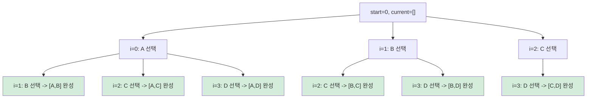
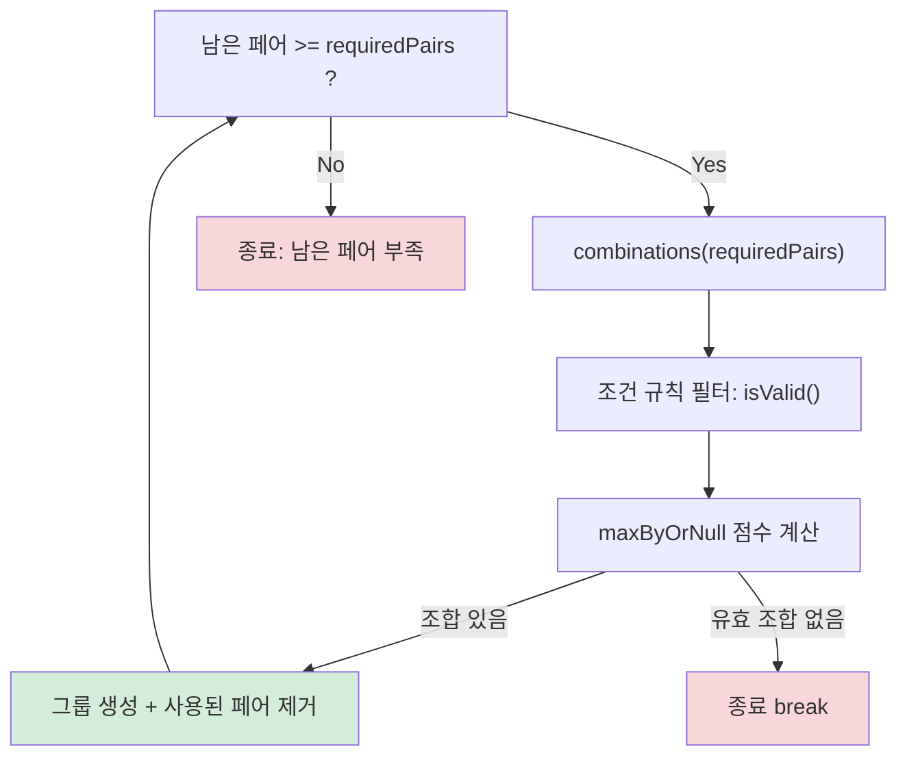
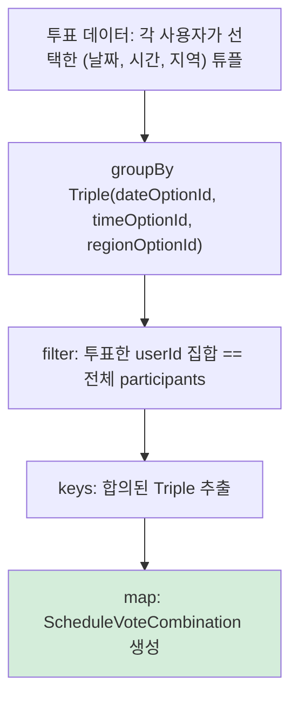
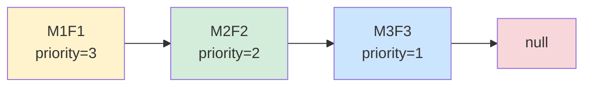
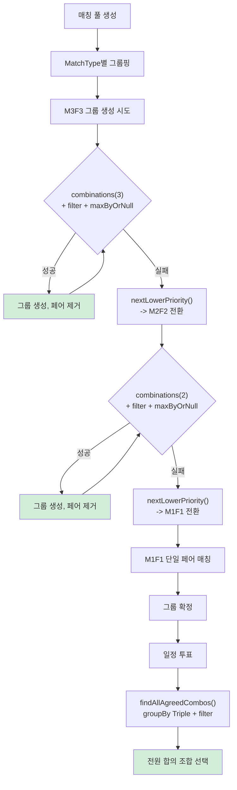

> **[시리즈] 코딩 테스트 알고리즘, 실무에서 이렇게 쓴다 -- duurian-server 편**
>
> 1. **[Combination -- 조합 생성](/posts/kotlin-algorithm-01-combination/)**
> 2. [Score & Range -- 점수 계산과 구간 매핑](/posts/kotlin-algorithm-02-score-range/)
> 3. [Set 연산 -- 교집합, 합집합, 차집합](/posts/kotlin-algorithm-03-set-operations/)
> 4. [Streak -- 연속 일수 계산](/posts/kotlin-algorithm-04-streak/)
> 5. [Top-K -- 상위 N개 선정](/posts/kotlin-algorithm-05-top-k/)
> 6. [GroupBy -- 그룹핑과 분류](/posts/kotlin-algorithm-06-groupby/)
> 7. [Rule Pattern -- 조건부 필터링과 규칙 체인](/posts/kotlin-algorithm-07-rule-pattern/)
> 8. [충돌 감지 -- 중복 방지와 양방향 확인](/posts/kotlin-algorithm-08-conflict-detection/)

---

## 1. 들어가며

코딩 테스트에서 "N개 중 K개를 고르시오"라는 문구를 보면 바로 **조합(Combination)**을 떠올립니다. 재귀와 백트래킹의 기본이면서, 문제 난이도가 올라갈수록 조합 위에 조건 필터링, 최적화, 가지치기를 쌓아 올려야 합니다.

그런데 이 패턴이 실무에서도 정말 쓰일까요? 결론부터 말하면, **duurian-server에서는 핵심 비즈니스 로직에 조합 알고리즘이 직접 사용됩니다.** 소셜 매칭 서비스인 duurian은 N개의 매칭 페어(pair) 중에서 K개를 골라 하나의 그룹을 만들어야 하고, 일정 투표에서는 날짜 x 시간 x 지역의 다차원 조합 중 전원이 합의한 조합을 찾아야 합니다.

duurian은 소셜 매칭 + AI 대화 서비스로, Kotlin + Spring Boot + JPA + PostgreSQL 기반의 헥사고날 아키텍처로 구성되어 있습니다. 이 글에서는 조합 알고리즘의 이론을 정리한 뒤, duurian-server의 실제 코드에서 이 패턴이 어떻게 적용되었는지 하나씩 살펴보겠습니다.

---

## 2. 알고리즘 원리

### 2.1 조합(Combination)이란

n개의 원소에서 순서를 고려하지 않고 k개를 선택하는 경우의 수를 **nCk**라고 표기합니다. 수학적으로는 다음과 같습니다.

```
nCk = n! / (k! * (n-k)!)
```

예를 들어 `{A, B, C, D}`에서 2개를 고르면 `{A,B}, {A,C}, {A,D}, {B,C}, {B,D}, {C,D}`로 총 4C2 = 6가지입니다. 순열(Permutation)과의 차이는 순서의 유무인데, 순열은 `{A,B}`와 `{B,A}`를 다른 것으로 취급하지만 조합은 같은 것으로 봅니다.

### 2.2 재귀 백트래킹 방식

조합을 생성하는 가장 직관적인 방법은 **재귀 백트래킹(Recursive Backtracking)**입니다. 각 원소에 대해 "포함한다 / 포함하지 않는다"를 결정하며 트리를 탐색합니다.



핵심은 **start 인덱스**입니다. 현재 선택한 원소 이후의 원소만 후보로 삼기 때문에 중복 없이 순서 무관하게 조합이 생성됩니다. i=0에서 A를 선택한 뒤에는 i=1 이후만 탐색하므로, `{B,A}` 같은 중복이 발생하지 않습니다.

### 2.3 알고리즘 수도코드

```
function combine(start, current):
    if current.size == k:
        result.add(current)
        return

    for i in start..n-1:
        combine(i + 1, current + elements[i])
```

- **종료 조건**: 현재 선택 개수가 k에 도달하면 결과에 추가
- **재귀 호출**: start를 i+1로 올려 이미 고려한 원소를 건너뜀
- **가지치기(Pruning)**: 남은 원소 수가 부족하면 더 이상 탐색하지 않음 (`n - start < k - current.size`)

### 2.4 엣지 케이스

| 조건 | 결과 | 수학적 근거 |
|------|------|------------|
| k = 0 | `[[ ]]` (빈 리스트 하나) | nC0 = 1 |
| k = n | `[[전체 리스트]]` | nCn = 1 |
| k > n | `[]` (빈 리스트) | 선택 불가 |
| n = 0 | `[]` | 원소 없음 |

---

## 3. Kotlin 구현과 언어 특성

### 3.1 duurian-server의 CombinationUtils.kt

duurian-server에서는 조합 알고리즘을 **Kotlin 확장 함수(extension function)**로 구현했습니다. 이 코드는 `common` 모듈에 위치하여 프로젝트 전체에서 재사용됩니다.

```kotlin
// common/src/main/kotlin/kr/duurian/duurian/util/CombinationUtils.kt

package kr.duurian.duurian.util

/**
 * 리스트에서 주어진 크기(k)의 조합을 생성하는 확장 함수입니다.
 *
 * 예: listOf(1, 2, 3).combinations(2)
 * -> 결과: [[1, 2], [1, 3], [2, 3]]
 *
 * @param k 조합 크기
 * @return 크기 k인 모든 조합 리스트
 */
fun <T> List<T>.combinations(k: Int): List<List<T>> {
    if (k == 0) return listOf(emptyList())         // k가 0이면 빈 리스트 하나 반환 (조합 없음)
    if (this.size < k) return emptyList()          // 원소 수보다 k가 크면 조합 불가능

    val result = mutableListOf<List<T>>()          // 결과 저장용 리스트

    // 재귀적으로 조합을 생성하는 내부 함수
    fun combine(start: Int, current: List<T>) {
        if (current.size == k) {
            result.add(current)
            return
        }

        for (i in start until this.size) {
            combine(i + 1, current + this[i])      // 현재 원소 포함해서 다음 재귀 호출
        }
    }

    combine(0, emptyList())
    return result
}
```

### 3.2 코드 한 줄씩 분석

#### 엣지 케이스 처리

```kotlin
if (k == 0) return listOf(emptyList())
```

k=0이면 "아무것도 선택하지 않는다"는 의미입니다. 수학적으로 nC0 = 1이므로, 빈 리스트를 원소로 가진 리스트 하나를 반환합니다. `emptyList()`가 아닌 `listOf(emptyList())`인 점에 주의해야 합니다. "조합이 0개"와 "아무것도 선택하지 않는 조합 1개"는 다른 의미이기 때문입니다.

```kotlin
if (this.size < k) return emptyList()
```

원소 개수보다 k가 크면 조합을 만들 수 없으므로 빈 리스트를 반환합니다.

#### 재귀 탐색

```kotlin
for (i in start until this.size) {
    combine(i + 1, current + this[i])
}
```

`start`부터 `this.size - 1`까지 순회하며 각 원소를 선택합니다. `current + this[i]`는 Kotlin의 `List.plus()` 연산자를 사용한 것으로, 기존 리스트를 변경하지 않고 새로운 리스트를 생성합니다. 이 **불변성(immutability)** 덕분에 Java의 전형적인 백트래킹 패턴인 `add() -> 재귀 -> remove()` 없이도 올바른 조합이 생성됩니다.

### 3.3 Kotlin 확장 함수의 장점

이 구현에서 주목할 점은 `fun <T> List<T>.combinations(k: Int)` 시그니처입니다. Java라면 `CombinationUtils.combinations(list, k)`로 호출해야 하지만, Kotlin 확장 함수 덕분에 마치 List의 기본 메서드처럼 사용할 수 있습니다.

```kotlin
// 호출부 - 자연스러운 체이닝
val bestGroup = remainingPairs
    .combinations(requiredPairs)       // 마치 List의 내장 메서드처럼
    .filter { conditionRuleEvaluator.isValid(it) }
    .maxByOrNull { priorityRuleEvaluator.calculateScore(it) }
```

이 코드가 주는 이점을 정리하면 다음과 같습니다.

| 특성 | Java 스타일 | Kotlin 확장 함수 |
|------|------------|------------------|
| 호출 방식 | `CombinationUtils.combinations(list, k)` | `list.combinations(k)` |
| 체이닝 | 별도 변수에 저장 후 사용 | `.filter { }.maxByOrNull { }` 바로 연결 |
| 가독성 | 유틸리티 클래스 의존 | 리스트의 자연스러운 확장 |
| 제네릭 | `<T>` 타입을 명시적으로 전달해야 하는 경우 있음 | 리시버 타입에서 자동 추론 |

### 3.4 내부 함수(Local Function)와 클로저

`combine` 함수가 `combinations` 함수 내부에 정의되어 있습니다. 이것이 Kotlin의 **로컬 함수(local function)**인데, 외부 함수의 변수(`result`, `this`, `k`)에 직접 접근할 수 있는 클로저 특성을 활용합니다. 파라미터 수가 줄어들어 재귀 호출이 간결해집니다.

만약 로컬 함수를 사용하지 않으면 `combine(start, current, result, k, this)`처럼 모든 것을 파라미터로 넘겨야 합니다. 로컬 함수를 쓰면 변하는 값(`start`, `current`)만 파라미터로 받고, 변하지 않는 값(`result`, `k`, `this`)은 클로저로 캡처합니다.

### 3.5 `current + this[i]`의 트레이드오프

`current + this[i]`는 매번 새 리스트를 생성하므로, 대규모 입력에서는 GC 압박이 생길 수 있습니다. 성능이 중요한 경우에는 `MutableList`를 사용하고 마지막 원소를 제거하는 전통적인 백트래킹 방식이 메모리 효율적입니다.

```kotlin
// 불변 방식 (현재 구현) - 간결하지만 리스트 복사 비용
combine(i + 1, current + this[i])

// 가변 방식 (성능 최적화) - 복잡하지만 메모리 효율적
current.add(this[i])
combine(i + 1, current)
current.removeAt(current.lastIndex)  // 백트래킹
```

duurian-server에서는 n과 k가 작기 때문에 불변 방식의 간결함을 선택했습니다.

---

## 4. 실무 적용 사례

### 4.1 사례 1: 매칭 그룹 생성 -- N개 페어에서 K개 선택

duurian은 소셜 매칭 서비스로, 사용자들을 남녀 페어(pair)로 묶은 뒤, 이 페어들을 다시 조합하여 매칭 그룹을 만듭니다. 예를 들어 3:3 매칭(M3F3)이면 3개의 페어를 하나의 그룹으로 묶어야 합니다.

```mermaid
flowchart LR
    subgraph pool["매칭 풀 (8개 페어)"]
        P1["Pair 1"]
        P2["Pair 2"]
        P3["Pair 3"]
        P4["Pair 4"]
        P5["Pair 5"]
        P6["Pair 6"]
        P7["Pair 7"]
        P8["Pair 8"]
    end

    subgraph comb["8C3 = 56가지 조합"]
        C1["{P1,P2,P3}"]
        C2["{P1,P2,P4}"]
        CD["..."]
        CN["{P6,P7,P8}"]
    end

    subgraph filter["비즈니스 규칙 필터"]
        F1["conditionRuleEvaluator.isValid()"]
    end

    subgraph select["최적 선택"]
        B1["priorityRuleEvaluator.calculateScore() 최대"]
    end

    pool --> comb
    comb --> filter
    filter --> select

    style select fill:#d4edda
```



핵심 코드는 `DefaultMatchGroupGenerator`에 있습니다.

```kotlin
// core/src/main/kotlin/kr/duurian/duurian/application/match/generator/DefaultMatchGroupGenerator.kt

@Component
class DefaultMatchGroupGenerator(
    private val conditionRuleEvaluator: MatchingConditionRuleEvaluator,
    private val priorityRuleEvaluator: MatchingPriorityRuleEvaluator,
) : MatchGroupGenerator {

    override fun generate(
        candidates: List<MatchingPair>,
        poolId: UUID
    ): List<MatchGroupTemplate> {
        val results = mutableListOf<MatchGroupTemplate>()

        // 현재 시도 중인 MatchType으로 그룹핑
        val groupedByMatchType = candidates
            .filter { it.availableMatchTypes.contains(it.currentMatchType) }
            .groupBy { it.currentMatchType }

        for ((matchType, pairsForType) in groupedByMatchType) {
            val requiredPairs = matchType.requiredCouples
            val remainingPairs = pairsForType.toMutableList()

            generateGroups(
                matchType = matchType,
                requiredPairs = requiredPairs,
                remainingPairs = remainingPairs,
                generatedGroups = results,
                poolId = poolId
            )
        }

        return results
    }

    private fun generateGroups(
        matchType: MatchType,
        requiredPairs: Int,
        remainingPairs: MutableList<MatchingPair>,
        generatedGroups: MutableList<MatchGroupTemplate>,
        poolId: UUID
    ) {
        // M1F1은 단일 페어 매칭이므로 조합이 필요 없음 (k=1)
        if (matchType == MatchType.M1F1) {
            val iterator = remainingPairs.iterator()
            while (iterator.hasNext()) {
                val pair = iterator.next()
                val pairList = listOf(pair)
                if (conditionRuleEvaluator.isValid(pairList)) {
                    generatedGroups += MatchGroupTemplate.create(
                        matchType = matchType,
                        pairs = pairList,
                        matchingPoolId = poolId,
                        createdAt = LocalDateTime.now()
                    )
                    iterator.remove()
                }
            }
            return
        }

        // 핵심 루프: 조합 생성 -> 조건 필터 -> 최적 선택 -> 반복
        while (remainingPairs.size >= requiredPairs) {
            val validGroups = remainingPairs
                .combinations(requiredPairs)                          // nCk 조합 생성
                .filter { conditionRuleEvaluator.isValid(it) }        // 비즈니스 규칙 필터

            val bestGroupPairs = validGroups
                .maxByOrNull { priorityRuleEvaluator.calculateScore(it) }  // 점수 최대 조합
                ?: break

            generatedGroups += MatchGroupTemplate.create(
                matchType = matchType,
                pairs = bestGroupPairs,
                matchingPoolId = poolId,
                createdAt = LocalDateTime.now()
            )
            remainingPairs.removeAll(bestGroupPairs)                  // 선택된 페어 제거 후 반복
        }
    }
}
```

이 코드에서 조합 알고리즘이 사용되는 핵심 흐름은 다음 네 단계입니다.

1. **조합 생성**: `remainingPairs.combinations(requiredPairs)` -- N개 페어에서 K개를 고르는 모든 경우의 수를 생성합니다.
2. **조건 필터링**: `conditionRuleEvaluator.isValid(it)` -- 생성된 조합 중 비즈니스 규칙(지역, 나이 등)을 만족하는 것만 남깁니다.
3. **최적 선택**: `maxByOrNull { priorityRuleEvaluator.calculateScore(it) }` -- 유효한 조합 중 점수가 가장 높은 것을 선택합니다.
4. **탐욕적 반복**: 선택된 페어들을 제거하고, 남은 페어로 다시 조합을 생성합니다.



이 방식은 **Greedy 전략**입니다. 매 단계에서 최적의 그룹을 만들고 나머지로 다음 그룹을 만듭니다. 전역 최적(global optimum)을 보장하지는 않지만, 매칭 도메인에서는 "가능한 한 좋은 그룹을 빨리 만드는 것"이 중요하기 때문에 이 전략이 적합합니다.

예를 들어, 10개 페어에서 M3F3 그룹을 만드는 과정을 추적하면 다음과 같습니다.

| 라운드 | 남은 페어 | 생성 조합 수 | 유효 조합 수 | 선택 |
|--------|----------|-------------|-------------|------|
| 1 | 10 | 10C3 = 120 | 예: 30 | 최고 점수 1개 |
| 2 | 7 | 7C3 = 35 | 예: 12 | 최고 점수 1개 |
| 3 | 4 | 4C3 = 4 | 예: 2 | 최고 점수 1개 |
| 4 | 1 | 1 < 3 | - | 종료 |

### 4.2 사례 2: 일정 투표 조합 탐색

매칭 그룹이 만들어지면 그룹 멤버들이 만날 일정을 정해야 합니다. duurian에서는 날짜, 시간, 지역 세 가지 축에 대해 투표를 진행하고, **전원이 동의한 조합**을 찾습니다.

```kotlin
// core/src/main/kotlin/kr/duurian/duurian/application/match/service/ConfirmMatchGroupScheduleService.kt

private fun findAllAgreedCombos(
    votes: List<ScheduleVote>,
    participants: Set<UUID>
): List<ScheduleVoteCombination> {
    return votes
        .groupBy { Triple(it.dateOptionId, it.timeOptionId, it.regionOptionId) }
        .filter { (_, vs) -> vs.map { it.userId }.toSet() == participants }
        .keys
        .map { (d, t, r) -> ScheduleVoteCombination(d, t, r) }
}
```

이 코드는 직접 nCk 조합을 생성하지 않지만, **다차원 조합 탐색**이라는 관점에서 조합 알고리즘의 변형입니다. 날짜 3개, 시간 3개, 지역 2개라면 이론적 조합은 3 x 3 x 2 = 18가지입니다. 하지만 모든 조합을 열거하지 않고, 실제 투표 데이터에서 역으로 조합을 추출합니다.



구체적인 동작 예시를 보면 다음과 같습니다.

- 참가자: {Alice, Bob, Carol}
- Alice 투표: (D1, T1, R1), (D1, T2, R1)
- Bob 투표: (D1, T1, R1), (D2, T1, R1)
- Carol 투표: (D1, T1, R1), (D1, T1, R2)

`groupBy` 결과:

| Triple 키 | 투표한 사용자 |
|-----------|-------------|
| (D1, T1, R1) | {Alice, Bob, Carol} |
| (D1, T2, R1) | {Alice} |
| (D2, T1, R1) | {Bob} |
| (D1, T1, R2) | {Carol} |

`filter` 후: (D1, T1, R1)만 전원 합의 -- 이것이 결과입니다.

여기서 `Triple`을 키로 사용하는 것은 Kotlin의 data class 특성(equals, hashCode 자동 생성) 덕분입니다. Java에서는 별도의 키 클래스를 만들거나 문자열 연결(`dateId + "_" + timeId + "_" + regionId`)로 키를 구성해야 했을 것입니다.

### 4.3 사례 3: 우선순위 경로 탐색 -- dropWhile 패턴

duurian의 매칭 타입은 M3F3(3:3) > M2F2(2:2) > M1F1(1:1) 순으로 우선순위가 있습니다. 현재 타입에서 매칭이 실패하면 다음 우선순위 타입으로 내려가는 로직이 필요한데, 이때 **순서 있는 리스트에서 현재 위치의 다음 원소 탐색** 패턴이 사용됩니다.

```kotlin
// domain/src/main/kotlin/kr/duurian/duurian/match/model/matchGroups/MatchType.kt

enum class MatchType(
    val requiredCouples: Int,
    val priority: Int,
    val description: String
) {
    M3F3(3, 1, "3:3 매칭"),
    M2F2(2, 2, "2:2 매칭"),
    M1F1(1, 3, "1:1 매칭");

    companion object {
        @JsonCreator
        fun fromDisplayName(name: String): MatchType {
            return entries.find { it.name == name }
                ?: throw IllegalArgumentException("Invalid reasonType: $name")
        }

        fun priorityOrder(): List<MatchType> {
            return entries.sortedByDescending { it.priority }
        }
    }

    fun nextLowerPriority(): MatchType? {
        return priorityOrder()
            .dropWhile { it != this }   // 현재 타입을 찾을 때까지 건너뜀
            .drop(1)                     // 현재 타입도 건너뜀
            .firstOrNull()               // 다음 타입 반환 (없으면 null)
    }
}
```

`dropWhile + drop + firstOrNull` 체인은 **순서가 있는 리스트에서 현재 위치 다음 원소를 찾는** Kotlin 관용적 표현입니다.

```
priorityOrder() -> [M1F1, M2F2, M3F3]  (priority 내림차순)

M2F2.nextLowerPriority():
  dropWhile { it != M2F2 } -> [M2F2, M3F3]  (M1F1 제거)
  drop(1)                  -> [M3F3]          (M2F2 제거)
  firstOrNull()            -> M3F3            (다음 타입)

M1F1.nextLowerPriority():
  dropWhile { it != M1F1 } -> [M1F1, M2F2, M3F3]
  drop(1)                  -> [M2F2, M3F3]
  firstOrNull()            -> M2F2

M3F3.nextLowerPriority():
  dropWhile { it != M3F3 } -> [M3F3]
  drop(1)                  -> []
  firstOrNull()            -> null  (더 이상 내려갈 곳 없음)
```

이 패턴이 if-else 체인보다 우수한 점은 **enum에 새로운 값이 추가되어도 코드를 수정할 필요가 없다**는 것입니다. 예를 들어 M4F4를 추가해도 priority 값만 설정하면 `nextLowerPriority()`는 자동으로 올바르게 동작합니다.



### 4.4 사례 4: 조합 + Greedy의 결합 -- 전체 흐름

사례 1~3을 결합하면, duurian의 매칭 시스템 전체 흐름이 하나의 조합 기반 알고리즘으로 구성되어 있음을 알 수 있습니다.



---

## 5. 시간 복잡도와 실무 주의점

### 5.1 시간 복잡도 분석

| 연산 | 시간 복잡도 | 설명 |
|------|------------|------|
| nCk 조합 생성 | O(nCk * k) | 조합 수 * 리스트 복사 비용 |
| 조건 필터링 | O(nCk * F) | F = 필터 1회 비용 |
| 최적 선택 (maxByOrNull) | O(V * S) | V = 유효 조합 수, S = 점수 계산 비용 |
| Greedy 반복 | O(n/k * nCk * (F+S)) | 최대 n/k번 반복 |

nCk의 값은 n과 k에 따라 급격히 증가합니다.

| n | k | nCk | 실무 상황 |
|---|---|-----|----------|
| 6 | 3 | 20 | 소규모 매칭 풀 |
| 8 | 3 | 56 | 일반 매칭 풀 |
| 10 | 3 | 120 | 대규모 매칭 풀 |
| 15 | 3 | 455 | 이벤트 기간 |
| 20 | 3 | 1,140 | 주의 필요 |
| 20 | 5 | 15,504 | 위험 구간 |
| 50 | 25 | 126,410,606,437,752 | 절대 불가 |

### 5.2 실무에서의 안전 장치

duurian-server에서는 다음과 같은 이유로 조합 폭발이 제한됩니다.

1. **k 값이 작습니다**: 매칭 타입별 `requiredCouples`가 최대 3입니다 (M3F3). k=3이면 n=20이어도 1,140개로 처리 가능합니다.
2. **n 값이 비즈니스에 의해 제한됩니다**: 매칭 풀의 크기가 지역, 나이대, 매칭 주기에 의해 자연적으로 제한됩니다.
3. **Greedy 반복으로 n이 감소합니다**: 매 반복마다 k개의 페어가 제거되므로, 다음 라운드의 조합 수는 이전보다 반드시 줄어듭니다.
4. **M1F1은 조합을 생성하지 않습니다**: k=1인 경우를 별도 분기 처리하여, 불필요한 `combinations(1)` 호출을 피합니다.

### 5.3 주의해야 할 점

**n이 예상보다 커질 수 있는 경우를 대비해야 합니다.** 이벤트 기간에 매칭 풀에 대량의 사용자가 유입되면 조합 수가 급증할 수 있습니다. 대비책으로는 다음을 고려할 수 있습니다.

- **풀 분할(Pool Partitioning)**: 매칭 풀을 지역, 나이대 등으로 사전 분할하여 각 풀의 크기를 제한
- **상한 설정**: 조합 수가 임계값(예: 10,000)을 넘으면 랜덤 샘플링으로 후보 축소
- **Sequence 기반 Lazy 평가**: 모든 조합을 메모리에 올리지 않고, 조건을 만족하는 첫 N개만 생성
- **사전 필터링**: 조합 전에 페어 단위로 호환 불가능한 것을 제거하여 n 자체를 줄이기

```kotlin
// Sequence 기반 최적화 예시 (현재 코드의 개선 방향)
val bestGroup = remainingPairs
    .combinations(requiredPairs)
    .asSequence()                                      // Lazy 평가
    .filter { conditionRuleEvaluator.isValid(it) }
    .maxByOrNull { priorityRuleEvaluator.calculateScore(it) }
```

단, `combinations()` 자체가 모든 조합을 리스트로 반환하므로, 진정한 Lazy 평가를 위해서는 `combinations` 함수 자체를 `Sequence`를 반환하도록 변경해야 합니다.

---

## 6. 관련 코딩 테스트 유형

조합 알고리즘을 활용하는 대표적인 코딩 테스트 문제를 정리하겠습니다. duurian-server 코드와의 대응 관계도 함께 살펴보겠습니다.

### 6.1 백준 15650 -- N과 M (2)

**문제**: 1부터 N까지 자연수 중에서 중복 없이 M개를 고른 수열을 사전순으로 출력하라.

**duurian 대응**: `CombinationUtils.kt`의 `combinations(k)`와 정확히 동일한 구조입니다. start 인덱스로 오름차순을 보장합니다.

```kotlin
fun solve(n: Int, m: Int) {
    val result = (1..n).toList().combinations(m)
    result.forEach { println(it.joinToString(" ")) }
}
```

### 6.2 프로그래머스 -- 소수 찾기

**문제**: 한 자리 숫자가 적힌 종이 조각으로 만들 수 있는 모든 소수의 개수를 구하라.

**duurian 대응**: 부분집합 생성 + 조건 필터링이라는 점에서 `combinations + filter` 패턴과 동일합니다. duurian에서는 "유효한 매칭 그룹"을 필터링하듯이, 이 문제에서는 "소수인 숫자"를 필터링합니다.

### 6.3 백준 1182 -- 부분수열의 합

**문제**: N개의 정수로 이루어진 수열에서 크기가 양수인 부분수열 중 합이 S인 것의 개수를 구하라.

**duurian 대응**: 모든 크기(1..N)의 조합을 생성하고 합 조건으로 필터링하는 패턴입니다. duurian에서 일정 투표의 "전원 합의" 조건 필터와 구조적으로 유사합니다.

```kotlin
fun solve(arr: List<Int>, s: Int): Int {
    return (1..arr.size).sumOf { k ->
        arr.combinations(k).count { it.sum() == s }
    }
}
```

### 6.4 프로그래머스 -- 단체사진 찍기

**문제**: 8명이 한 줄로 서서 단체사진을 찍을 때, 주어진 조건을 모두 만족하는 배치의 수를 구하라.

**duurian 대응**: 순열 + 조건 필터링입니다. duurian의 "조합 생성 후 conditionRuleEvaluator로 필터링"과 동일한 패턴입니다. 차이점은 순열(permutation)이냐 조합(combination)이냐일 뿐, "모든 경우의 수를 생성하고 조건으로 거르는" 구조는 같습니다.

### 6.5 백준 2798 -- 블랙잭

**문제**: N장의 카드 중 3장을 골라 합이 M을 넘지 않으면서 M에 최대한 가까운 값을 구하라.

**duurian 대응**: `combinations(3) + filter { 조건 } + maxByOrNull { 점수 }` 체인과 정확히 일치합니다. duurian의 매칭 그룹 생성과 구조가 같습니다.

```kotlin
fun solve(cards: List<Int>, m: Int): Int {
    return cards.combinations(3)
        .map { it.sum() }
        .filter { it <= m }
        .maxOrNull() ?: 0
}
```

---

## 7. 정리

### 요약 테이블

| 구분 | 코딩 테스트 | duurian-server 실무 |
|------|------------|-------------------|
| 입력 | 정수 배열, 문자열 | `List<MatchingPair>` |
| 알고리즘 | 재귀 백트래킹 nCk | `List<T>.combinations(k)` 확장 함수 |
| 필터 조건 | 합, 소수, 거리 등 | `conditionRuleEvaluator.isValid()` |
| 최적 선택 | min/max 값 | `maxByOrNull { calculateScore() }` |
| 반복 전략 | 일회성 탐색 | Greedy 반복 (선택 후 제거) |
| 다차원 조합 | 좌표 탐색, DP | `groupBy(Triple) + filter` |
| 경로 탐색 | 그래프 DFS/BFS | `dropWhile + drop + firstOrNull` |

### 핵심 포인트

1. **확장 함수로 범용 유틸리티를 설계하라**: `List<T>.combinations(k)`는 타입에 무관하게 어떤 리스트에든 사용할 수 있습니다. common 모듈에 배치하여 프로젝트 전체에서 재사용합니다.

2. **조합은 시작이고, 필터와 선택이 본질입니다**: 실무에서 조합 생성 자체보다 중요한 것은 비즈니스 규칙에 맞는 필터링과 최적 조합 선택입니다. `combinations + filter + maxByOrNull` 체이닝이 이를 깔끔하게 표현합니다.

3. **n과 k의 크기를 항상 의식하라**: 조합 수는 기하급수적으로 증가합니다. 실무에서는 입력 크기가 고정되어 있다고 가정하지 말고, 최악의 경우를 대비한 안전 장치(풀 분할, 상한 설정, 타임아웃)를 마련해야 합니다.

4. **Greedy와 조합을 결합하면 실용적인 최적화가 됩니다**: 전역 최적을 보장하지는 않지만, 매칭처럼 "충분히 좋은 결과를 빠르게"가 중요한 도메인에서는 Greedy + 조합이 효과적인 전략입니다.

5. **Kotlin의 함수형 API가 알고리즘 코드를 선언적으로 만듭니다**: `groupBy`, `filter`, `maxByOrNull`, `dropWhile` 같은 컬렉션 함수들이 알고리즘의 각 단계를 명확하게 표현합니다. 이것은 코드 리뷰와 유지보수에서 큰 장점이 됩니다.

---

*다음 글: [Score & Range -- 점수 계산과 구간 매핑](/posts/kotlin-algorithm-02-score-range/)에서는 가중 평균 계산과 when 기반 구간 매핑이 추천 시스템, 친밀도 등급, 가격 정책에서 어떻게 활용되는지 살펴봅니다.*

*정지원 (duurian 백엔드 개발자)*
