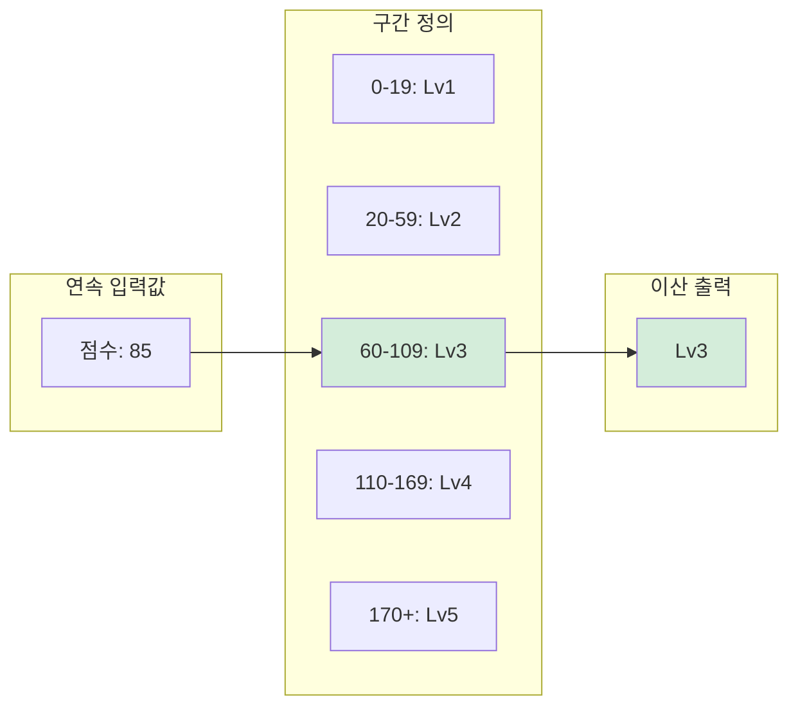
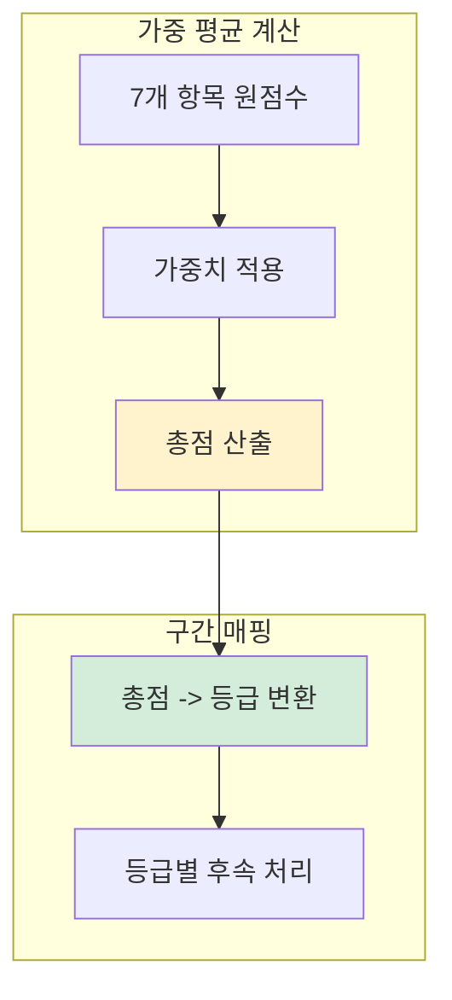
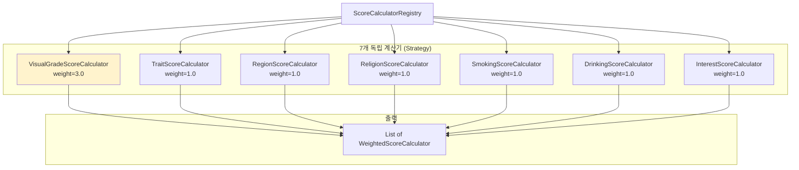
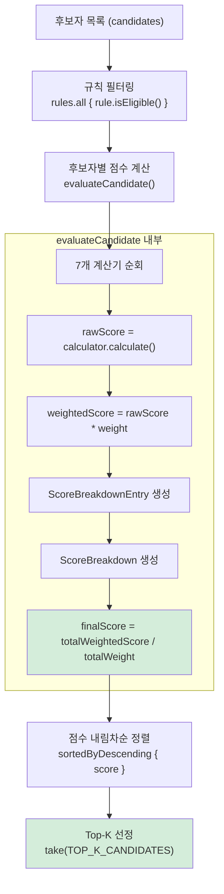
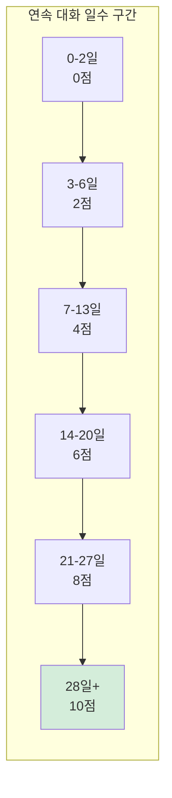
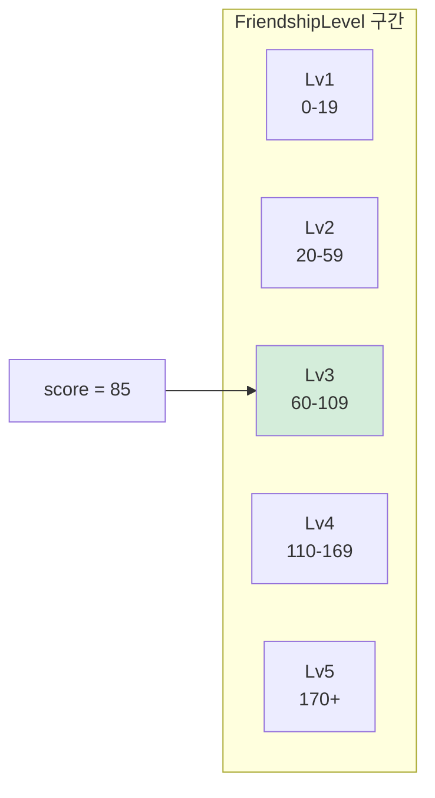
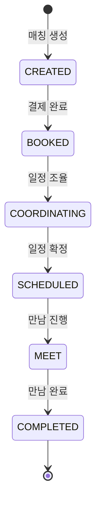

> **[시리즈] 코딩 테스트 알고리즘, 실무에서 이렇게 쓴다 -- duurian-server 편**
>
> 1. [Combination -- 조합 생성](/posts/kotlin-algorithm-01-combination/)
> 2. **[Score & Range -- 점수 계산과 구간 매핑](/posts/kotlin-algorithm-02-score-range/)**
> 3. [Set 연산 -- 교집합, 합집합, 차집합](/posts/kotlin-algorithm-03-set-operations/)
> 4. [Streak -- 연속 일수 계산](/posts/kotlin-algorithm-04-streak/)
> 5. [Top-K -- 상위 N개 선정](/posts/kotlin-algorithm-05-top-k/)
> 6. [GroupBy -- 그룹핑과 분류](/posts/kotlin-algorithm-06-groupby/)
> 7. [Rule Pattern -- 조건부 필터링과 규칙 체인](/posts/kotlin-algorithm-07-rule-pattern/)
> 8. [충돌 감지 -- 중복 방지와 양방향 확인](/posts/kotlin-algorithm-08-conflict-detection/)

---

## 1. 들어가며

코딩 테스트에서 "점수를 계산하라", "등급을 판정하라"는 문제를 만나면 대부분 if-else 체인이나 간단한 수학 연산으로 해결합니다. 기초 수준의 문제라고 가볍게 넘기기 쉽습니다.

그런데 실무에서는 이 패턴이 훨씬 복잡한 모습으로 등장합니다. **7개 항목에 서로 다른 가중치를 부여하여 총점을 계산**하거나, **연속 일수/글자 수/비활성 기간 같은 다양한 입력을 각각 다른 구간 규칙으로 점수화**하거나, **점수를 5단계 등급으로 변환**하거나, **수량에 따라 가격을 차등 적용**하는 등 다양한 변형이 존재합니다.

duurian은 소셜 매칭 + AI 대화 서비스로, Kotlin + Spring Boot + JPA + PostgreSQL 기반의 헥사고날 아키텍처로 구성되어 있습니다. 이 글에서는 duurian-server의 실제 코드를 통해 가중 평균 계산, 구간 매핑, 상태 매핑이라는 세 가지 핵심 패턴이 어떻게 구현되고 활용되는지 상세하게 살펴보겠습니다.

---

## 2. 알고리즘 원리

### 2.1 가중 평균(Weighted Average)

가중 평균은 각 항목의 중요도(가중치)를 반영하여 평균을 계산하는 방법입니다. 단순 평균이 모든 항목을 동등하게 취급하는 반면, 가중 평균은 중요한 항목에 더 큰 영향력을 부여합니다.

#### 수학적 정의

```
가중 평균 = (w1 * s1 + w2 * s2 + ... + wn * sn) / (w1 + w2 + ... + wn)
```

- `si`: i번째 항목의 원점수 (raw score)
- `wi`: i번째 항목의 가중치 (weight)

#### 예시: 과목별 학점 계산

| 과목 | 점수(si) | 학점(wi) | 가중 점수(wi * si) |
|------|----------|----------|-------------------|
| 수학 | 90 | 3 | 270 |
| 영어 | 80 | 2 | 160 |
| 국어 | 70 | 1 | 70 |

```
단순 평균 = (90 + 80 + 70) / 3 = 80.0
가중 평균 = (270 + 160 + 70) / (3 + 2 + 1) = 500 / 6 = 83.33
```

가중 평균(83.33)이 단순 평균(80.0)보다 높은 이유는 가중치가 가장 큰 수학(3학점)의 점수(90점)가 결과에 더 크게 반영되기 때문입니다.

### 2.2 구간 매핑(Range Mapping)

구간 매핑은 연속적인 수치 값을 이산적인 등급이나 레벨로 변환하는 알고리즘입니다. 수직선 위에 여러 개의 구간을 설정하고, 입력값이 어느 구간에 속하는지를 판정합니다.



구간 매핑의 핵심은 **구간 경계의 정의**입니다. 경계가 겹치면 어느 구간에 속하는지 모호해지고, 빈 구간이 있으면 특정 값이 어디에도 속하지 않게 됩니다.

### 2.3 두 패턴의 결합

실무에서는 가중 평균과 구간 매핑이 결합되는 경우가 많습니다.



duurian-server에서는 추천 시스템이 가중 평균으로 총점을 산출하고, 친밀도 시스템이 구간 매핑으로 등급을 판정합니다. 이 두 패턴이 서비스의 핵심 도메인 로직을 구성합니다.

---

## 3. Kotlin 구현과 언어 특성

### 3.1 Kotlin when 표현식의 힘

이 글에서 다루는 거의 모든 코드가 Kotlin의 `when` 표현식을 활용합니다. `when`은 Java의 `switch`를 대체하면서 다음과 같은 강점을 가집니다.

| 특성 | Java switch | Kotlin when |
|------|------------|-------------|
| 표현식 사용 | Java 14+ switch expression | 기본 지원 |
| 범위 조건 | 불가 | `in 51..150` |
| 조건식 분기 | 불가 | `when { days >= 28 -> ... }` |
| 타입 검사 | instanceof 별도 처리 | `is Type -> ...` |
| break 필요 | 필수 (fall-through 방지) | 불필요 |
| exhaustive 검사 | 불가 | sealed class/enum과 함께 가능 |

`when`에는 두 가지 형태가 있습니다.

```kotlin
// 형태 1: when(value) - 값 기반 매칭
when (gradeDifference) {
    0 -> SAME_GRADE_SCORE
    1 -> ONE_GRADE_DIFF_SCORE
    else -> NO_GRADE_MATCH_SCORE
}

// 형태 2: when { } - 조건식 기반 매칭
when {
    days >= 28 -> 10
    days >= 21 -> 8
    else -> 0
}
```

형태 1은 특정 값에 대한 정확한 매칭, 형태 2는 범위나 복합 조건에 대한 매칭에 적합합니다. duurian-server에서는 두 형태가 모두 사용됩니다.

### 3.2 `in` 연산자와 IntRange

Kotlin의 `in` 연산자는 범위 검사를 직관적으로 표현합니다.

```kotlin
characterCount in 51..150   // 51 <= characterCount <= 150
```

이것은 다음과 동일하지만 훨씬 읽기 쉽습니다.

```kotlin
characterCount >= 51 && characterCount <= 150
```

`51..150`은 `IntRange` 객체를 생성하고, `in` 연산자는 이 범위의 `contains()` 메서드를 호출합니다. IntRange의 `contains()`는 O(1)이므로 성능 걱정은 없습니다.

---

## 4. 실무 적용 사례

### 4.1 사례 1: 추천 점수 계산 -- ScoreBreakdown 도메인 모델

duurian의 추천 시스템은 두 사용자 간의 호환성을 7가지 항목으로 평가합니다. 각 항목에 가중치를 부여하여 최종 점수를 계산하고, 이 점수를 기반으로 추천 순위를 결정합니다.

#### ScoreBreakdownEntry -- 단일 항목 점수

```kotlin
// domain/src/main/kotlin/kr/duurian/duurian/recommendation/calculator/ScoreBreakdownEntry.kt

/**
 * 점수 계산 결과의 단일 항목을 나타냅니다.
 * - rawScore: 계산기에서 반환된 원점수 (0~100)
 * - weight: 해당 항목에 부여된 가중치
 * - weightedScore: rawScore * weight (총점 계산용)
 */
data class ScoreBreakdownEntry(
    val type: ScoreType,
    val rawScore: Double,
    val weight: Double,
    val weightedScore: Double
)
```

`data class`로 선언했기 때문에 `equals()`, `hashCode()`, `toString()`, `copy()`가 자동 생성됩니다. 점수 항목을 값 객체(Value Object)로 다루기에 적합합니다.

#### ScoreBreakdown -- 총점 계산

```kotlin
// domain/src/main/kotlin/kr/duurian/duurian/recommendation/calculator/ScoreBreakdown.kt

/**
 * 추천 점수 계산에 사용된 모든 항목 점수의 조합입니다.
 * - entries: 항목별 raw/weighted 점수 목록
 * - finalScore: 총 weighted 점수 / 총 weight로 산정된 최종 점수
 */
data class ScoreBreakdown(
    val entries: List<ScoreBreakdownEntry>
) {
    private val totalWeightedScore: Double get() = entries.sumOf { it.weightedScore }
    private val totalWeight: Double get() = entries.sumOf { it.weight }
    val finalScore: Double get() = if (totalWeight == 0.0) 0.0 else totalWeightedScore / totalWeight
}
```

이 클래스의 핵심은 `finalScore` 프로퍼티입니다. 가중 평균 공식을 정확하게 구현하고 있습니다.

```
finalScore = totalWeightedScore / totalWeight
           = (w1*s1 + w2*s2 + ... + w7*s7) / (w1 + w2 + ... + w7)
```

주목할 점은 `totalWeight == 0.0` 검사입니다. 모든 가중치가 0인 극단적 상황에서 0으로 나누기(Division by Zero)를 방지합니다. Kotlin에서 `Double / 0.0`은 예외가 아닌 `Infinity`를 반환하므로, 이 검사가 없으면 최종 점수가 `Infinity`가 되어 후속 정렬에서 문제가 발생할 수 있습니다.

또한 `get()` 키워드로 커스텀 getter를 정의하여, 프로퍼티에 접근할 때마다 값을 재계산합니다. `entries`가 불변 리스트이므로 캐싱을 해도 되지만, 현재 구현은 매 접근마다 O(n)의 합산 연산을 수행합니다. n=7로 고정이므로 실질적 성능 차이는 없습니다.

### 4.2 사례 2: Strategy 패턴 + 가중치 계산 결합 -- ScoreCalculatorRegistry

7개의 독립적인 계산기를 관리하고, 각각에 가중치를 부여하는 Registry 클래스입니다.

```kotlin
// core/src/main/kotlin/kr/duurian/duurian/application/recommendation/calculator/ScoreCalculatorRegistry.kt

@Component
class ScoreCalculatorRegistry(
    private val visualGradeScoreCalculator: VisualGradeScoreCalculator,
    private val traitScoreCalculator: TraitScoreCalculator,
    private val regionScoreCalculator: RegionScoreCalculator,
    private val religionScoreCalculator: ReligionScoreCalculator,
    private val smokingScoreCalculator: SmokingScoreCalculator,
    private val drinkingScoreCalculator: DrinkingScoreCalculator,
    private val interestScoreCalculator: InterestScoreCalculator,
) {

    fun getWeightedCalculators(): List<WeightedScoreCalculator> = listOf(
        WeightedScoreCalculator(type = ScoreType.LOOKS, calculator = visualGradeScoreCalculator, weight = 3.0),
        WeightedScoreCalculator(type = ScoreType.TRAIT, calculator = traitScoreCalculator, weight = 1.0),
        WeightedScoreCalculator(type = ScoreType.REGION, calculator = regionScoreCalculator, weight = 1.0),
        WeightedScoreCalculator(type = ScoreType.RELIGION, calculator = religionScoreCalculator, weight = 1.0),
        WeightedScoreCalculator(type = ScoreType.SMOKING, calculator = smokingScoreCalculator, weight = 1.0),
        WeightedScoreCalculator(type = ScoreType.DRINKING, calculator = drinkingScoreCalculator, weight = 1.0),
        WeightedScoreCalculator(type = ScoreType.INTEREST, calculator = interestScoreCalculator, weight = 1.0),
    )
}
```

이 코드에서 주목할 부분은 **가중치 전략**입니다.

| 항목 | 가중치 | 비율 | 설명 |
|------|--------|------|------|
| LOOKS (외모) | 3.0 | 33.3% | 가장 중요한 항목 |
| TRAIT (성격) | 1.0 | 11.1% | 기본 가중치 |
| REGION (지역) | 1.0 | 11.1% | 기본 가중치 |
| RELIGION (종교) | 1.0 | 11.1% | 기본 가중치 |
| SMOKING (흡연) | 1.0 | 11.1% | 기본 가중치 |
| DRINKING (음주) | 1.0 | 11.1% | 기본 가중치 |
| INTEREST (관심사) | 1.0 | 11.1% | 기본 가중치 |
| **합계** | **9.0** | **100%** | |

총 가중치 합은 9.0이고, 외모 항목 혼자 3.0/9.0 = 33.3%를 차지합니다. 이것은 소셜 매칭 도메인에서 외모 호환성이 사용자 만족도에 가장 큰 영향을 미친다는 비즈니스 판단이 반영된 것입니다.

이 구조는 **Strategy 패턴**의 변형입니다. 각 계산기(`VisualGradeScoreCalculator`, `TraitScoreCalculator` 등)는 동일한 `ScoreCalculator` 인터페이스를 구현하고, Registry가 이들을 조합합니다.



이 설계의 장점은 다음과 같습니다.

1. **개방-폐쇄 원칙(OCP)**: 새로운 계산기를 추가할 때 기존 코드를 수정하지 않습니다. Registry에 항목만 추가하면 됩니다.
2. **독립적 테스트**: 각 계산기를 단위 테스트로 독립적으로 검증할 수 있습니다.
3. **가중치 조정 용이**: 가중치 값만 변경하면 전체 추천 결과가 달라집니다. A/B 테스트에 유리합니다.

### 4.3 사례 3: 가중 점수 합산 흐름 -- BasicRecommendationAlgorithm

Registry에서 가져온 계산기들로 실제 점수를 계산하는 전체 흐름입니다.

```kotlin
// core/src/main/kotlin/kr/duurian/duurian/application/recommendation/algorithm/BasicRecommendationAlgorithm.kt

@Component
class BasicRecommendationAlgorithm(
    private val rules: List<RecommendationRule>,
    private val calculatorRegistry: ScoreCalculatorRegistry,
    private val reasonGenerator: ReasonTagGenerator
) : RecommendationAlgorithm {

    private val weightedCalculators = calculatorRegistry.getWeightedCalculators()

    override val code = RecommendationAlgorithmCode.BASIC

    override suspend fun recommend(
        targetUser: RecommendationTarget,
        candidates: List<RecommendationTarget>
    ): AlgorithmResult {

        val evaluatedCandidates = candidates
            .asSequence()
            // 1. 추천 제외 룰 적용
            .filter { candidate ->
                rules.all { rule -> rule.isEligible(targetUser, candidate) }
            }
            // 2. 점수 계산 및 추천 사유 생성
            .map { candidate ->
                evaluateCandidate(targetUser, candidate)
            }
            // 3. 점수 기준 내림차순 정렬
            .sortedByDescending { it.candidateInfo.score }
            .toList()

        // 4. Top-K 선정
        val topK = evaluatedCandidates.take(RecommendationConstants.TOP_K_CANDIDATES)

        return AlgorithmResult(
            candidates = topK.map { it.candidateInfo },
            recommendations = topK.map { it.recommendedProfile }
        )
    }

    private fun evaluateCandidate(
        targetUser: RecommendationTarget,
        candidate: RecommendationTarget
    ): EvaluatedCandidate {
        // 7개 계산기를 순회하며 점수 계산
        val breakdownEntries = weightedCalculators.map { calculator ->
            val rawScore = calculator.calculator.calculate(targetUser, candidate)
            val weightedScore = rawScore * calculator.weight

            ScoreBreakdownEntry(
                type = calculator.type,
                rawScore = rawScore,
                weight = calculator.weight,
                weightedScore = weightedScore
            )
        }

        val breakdown = ScoreBreakdown(breakdownEntries)
        val finalScore = breakdown.finalScore

        val reasonTags = reasonGenerator.generate(targetUser, candidate)

        val recommendedProfile = RecommendedProfile.createForBasic(
            profile = candidate.profileComposition.profile,
            score = finalScore,
            reasonTags = reasonTags
        )

        val candidateInfo = RecommendationCandidateInfo(
            target = candidate,
            score = finalScore,
            reasonTags = reasonTags,
            explanation = null
        )

        return EvaluatedCandidate(
            candidateInfo = candidateInfo,
            recommendedProfile = recommendedProfile
        )
    }
}
```

점수 계산 파이프라인을 단계별로 분석하면 다음과 같습니다.



구체적인 계산 예시를 보면 다음과 같습니다.

| 항목 | rawScore | weight | weightedScore |
|------|----------|--------|---------------|
| LOOKS | 80.0 | 3.0 | 240.0 |
| TRAIT | 60.0 | 1.0 | 60.0 |
| REGION | 100.0 | 1.0 | 100.0 |
| RELIGION | 100.0 | 1.0 | 100.0 |
| SMOKING | 100.0 | 1.0 | 100.0 |
| DRINKING | 0.0 | 1.0 | 0.0 |
| INTEREST | 40.0 | 1.0 | 40.0 |
| **합계** | - | **9.0** | **640.0** |

```
finalScore = 640.0 / 9.0 = 71.11
```

외모 점수(80점)가 3배 가중치를 받아 결과에 가장 큰 영향을 미칩니다. 음주 항목이 0점이지만, 가중치가 1.0이라 전체에 미치는 영향은 제한적입니다.

### 4.4 사례 4: 등급 차이 기반 점수 -- VisualGradeScoreCalculator

외모 등급 간 거리(difference)를 점수로 변환하는 계산기입니다. `when(value)` 형태로 정확한 값 매칭을 수행합니다.

```kotlin
// core/src/main/kotlin/kr/duurian/duurian/application/recommendation/calculator/VisualGradeScoreCalculator.kt

@Component
class VisualGradeScoreCalculator : ScoreCalculator {

    companion object {
        private const val SAME_GRADE_SCORE = 100.0
        private const val ONE_GRADE_DIFF_SCORE = 80.0
        private const val TWO_GRADE_DIFF_SCORE = 60.0
        private const val NO_GRADE_MATCH_SCORE = 0.0
    }

    override fun calculate(
        user: RecommendationTarget,
        candidate: RecommendationTarget
    ): Double {
        val userGrade = user.profileComposition.profile.visualGrade ?: return NO_GRADE_MATCH_SCORE
        val candidateGrade = candidate.profileComposition.profile.visualGrade ?: return NO_GRADE_MATCH_SCORE

        val gradeDifference = userGrade.distanceTo(candidateGrade)

        return when (gradeDifference) {
            0 -> SAME_GRADE_SCORE        // 100.0 - 동일 등급
            1 -> ONE_GRADE_DIFF_SCORE    // 80.0  - 1단계 차이
            2 -> TWO_GRADE_DIFF_SCORE    // 60.0  - 2단계 차이
            else -> NO_GRADE_MATCH_SCORE // 0.0   - 3단계 이상 차이
        }
    }
}
```

이 코드에서 주목할 점은 세 가지입니다.

첫째, **상수 분리**입니다. 점수 값을 `companion object`의 `const val`로 분리하여 매직 넘버를 제거했습니다. 점수 조정이 필요할 때 한 곳만 수정하면 됩니다.

둘째, **null 안전 처리**입니다. `?: return NO_GRADE_MATCH_SCORE`로 등급 정보가 없는 사용자를 조기 반환합니다. Kotlin의 Elvis 연산자와 early return의 조합입니다.

셋째, **값 매칭**입니다. `when (gradeDifference)` 형태로 정수 값에 대한 정확한 매칭을 수행합니다. 등급 차이는 0, 1, 2와 같은 이산값이므로 이 형태가 적합합니다.

| 등급 차이 | 점수 | 의미 |
|----------|------|------|
| 0 | 100.0 | 동일 등급 - 완벽 매칭 |
| 1 | 80.0 | 1단계 차이 - 양호 |
| 2 | 60.0 | 2단계 차이 - 보통 |
| 3+ | 0.0 | 3단계 이상 - 매칭 부적합 |

### 4.5 사례 5: 다중 구간 매핑 -- FriendshipScoreCalculator

친밀도 시스템에서는 다양한 행동 지표를 각각 다른 구간 규칙으로 점수화합니다. `when { }` 형태의 조건식 매칭이 집중적으로 사용되는 사례입니다.

```kotlin
// domain/src/main/kotlin/kr/duurian/duurian/conversation/friendship/model/FriendshipScoreCalculator.kt

object FriendshipScoreCalculator {

    /**
     * 연속 대화 일수에 따른 점수를 계산합니다.
     */
    fun calculateConsecutiveDaysScore(consecutiveDays: Int): Int {
        return when {
            consecutiveDays >= 28 -> 10
            consecutiveDays >= 21 -> 8
            consecutiveDays >= 14 -> 6
            consecutiveDays >= 7 -> 4
            consecutiveDays >= 3 -> 2
            else -> 0
        }
    }

    /**
     * 대화 품질 점수를 계산합니다. (사용자 답변의 글자 수 기준)
     */
    fun calculateConversationQualityScore(characterCount: Int): Int {
        return when {
            characterCount > 150 -> 4
            characterCount in 51..150 -> 3
            characterCount in 21..50 -> 2
            characterCount in 6..20 -> 1
            else -> 0
        }
    }

    /**
     * 오늘 생성된 대화 요약 개수에 따른 점수를 계산합니다.
     * 대화 요약 1개당 1점이 부여되며, 최대 5점까지 획득 가능합니다.
     */
    fun calculateSummaryScore(summaryCount: Int): Int {
        return minOf(summaryCount, 5)
    }

    /**
     * 미대화 일수에 따른 감점을 계산합니다.
     */
    fun calculateInactivityPenalty(inactiveDays: Int): Int {
        return when {
            inactiveDays >= 30 -> -120
            inactiveDays >= 15 -> -90
            inactiveDays >= 8 -> -60
            inactiveDays >= 4 -> -15
            else -> 0
        }
    }
}
```

이 클래스에는 **네 가지 서로 다른 구간 매핑** 함수가 존재합니다. 각각의 특성을 정리하면 다음과 같습니다.

#### 함수별 구간 규칙 비교

| 함수 | 입력 | 구간 방향 | 출력 범위 | 특이점 |
|------|------|----------|----------|--------|
| `calculateConsecutiveDaysScore` | 연속 일수 | 상한에서 하한 | 0~10 | `>=` 비교만 사용 |
| `calculateConversationQualityScore` | 글자 수 | 상한에서 하한 | 0~4 | `in` 범위 혼용 |
| `calculateSummaryScore` | 요약 개수 | 선형 | 0~5 | `minOf`로 상한 클램핑 |
| `calculateInactivityPenalty` | 비활성 일수 | 상한에서 하한 | -120~0 | **음수** 반환 |

#### 연속 일수 점수의 구간 시각화



주의 깊게 볼 점은 **조건의 순서**입니다. `when` 표현식은 **위에서 아래로 순차 평가**하며, 첫 번째로 참인 조건이 선택됩니다. 따라서 `>= 28`을 가장 먼저 검사하고, `>= 21`, `>= 14` 순으로 내려갑니다. 이 순서가 뒤집히면 `>= 3`이 모든 값을 흡수해버리므로 올바르지 않은 결과가 나옵니다.

```kotlin
// 잘못된 순서 (모든 값이 2점으로 매핑됨)
when {
    consecutiveDays >= 3 -> 2   // 28일도 여기서 걸림!
    consecutiveDays >= 7 -> 4   // 도달 불가
    ...
}
```

#### 비활성 감점의 비즈니스 의미

`calculateInactivityPenalty`는 **음수를 반환**한다는 점에서 특별합니다. 다른 세 함수가 "보상"을 주는 반면, 이 함수는 "벌칙"을 부과합니다.

```kotlin
val dailyScore = calculateConsecutiveDaysScore(consecutiveDays)   // +2 ~ +10
                + calculateConversationQualityScore(characterCount) // +1 ~ +4
                + calculateSummaryScore(summaryCount)              // +1 ~ +5
                + calculateInactivityPenalty(inactiveDays)         // -120 ~ 0
```

4일 이상 대화하지 않으면 감점이 시작되고, 30일 이상이면 -120점이 부과됩니다. 이는 Lv5(170점)에서 한 번에 Lv2(50점 = 170 - 120) 수준으로 떨어질 수 있는 강력한 패널티입니다. "사용자가 계속 서비스에 참여하도록 유도한다"는 비즈니스 목표가 알고리즘에 직접 반영된 것입니다.

#### object 키워드의 활용

`FriendshipScoreCalculator`는 `object`로 선언되었습니다. 모든 함수가 순수 함수(pure function)이고 내부 상태가 없으므로, 인스턴스를 여러 개 만들 필요가 없습니다. `object`는 Kotlin의 싱글톤 패턴으로, 별도의 DI 없이 `FriendshipScoreCalculator.calculateConsecutiveDaysScore(14)`처럼 직접 호출할 수 있습니다.

### 4.6 사례 6: 점수에서 등급으로 -- FriendshipLevel

계산된 친밀도 점수를 5단계 등급으로 변환하는 enum입니다.

```kotlin
// domain/src/main/kotlin/kr/duurian/duurian/conversation/friendship/model/FriendshipLevel.kt

enum class FriendshipLevel(val minScore: Int, val maxScore: Int, val description: String) {
    Lv1(0, 19, "알아가는 사이"),
    Lv2(20, 59, "조금 더 알고 싶은 사이"),
    Lv3(60, 109, "마음을 털어 놓을 수 있는 사이"),
    Lv4(110, 169, "사소한 취향까지 아는 사이"),
    Lv5(170, Int.MAX_VALUE, "누구보다 나를 잘 알아주는 절친 사이");

    companion object {
        fun fromScore(score: Int): FriendshipLevel {
            return entries.find { score in it.minScore..it.maxScore } ?: Lv1
        }
    }
}
```

이 패턴은 **enum + 범위 프로퍼티 + find**의 조합으로, 구간 매핑을 데이터 주도(data-driven) 방식으로 구현한 것입니다.

핵심 한 줄을 분해하면 다음과 같습니다.

```kotlin
entries.find { score in it.minScore..it.maxScore } ?: Lv1
```

1. `entries` -- enum의 모든 값을 순서대로 나열한 리스트: `[Lv1, Lv2, Lv3, Lv4, Lv5]`
2. `find { ... }` -- 조건을 만족하는 **첫 번째** 원소를 반환
3. `score in it.minScore..it.maxScore` -- 점수가 해당 레벨의 범위 안에 있는지 확인
4. `?: Lv1` -- 어떤 레벨에도 해당하지 않으면 Lv1 반환 (방어적 프로그래밍)

이 방식이 `when` 기반 매핑보다 우수한 점은 **레벨을 추가해도 `fromScore` 함수를 수정할 필요가 없다**는 것입니다. 예를 들어 Lv6를 추가하려면 enum에 한 줄만 추가하면 됩니다.

```kotlin
Lv6(250, Int.MAX_VALUE, "소울메이트")
// fromScore()는 수정 불필요!
```

다만 주의할 점이 있습니다. `entries`는 enum 선언 순서를 따르므로, **범위가 겹치면 첫 번째로 매칭된 레벨이 반환**됩니다. 현재 구현에서는 Lv5의 maxScore가 `Int.MAX_VALUE`이므로, 모든 양의 정수가 어딘가에 반드시 매칭됩니다. 하지만 음수 점수(비활성 감점으로 인해 발생 가능)는 어떤 레벨에도 해당하지 않아 fallback인 Lv1이 반환됩니다.



### 4.7 사례 7: 수량 기반 가격 정책 -- PersonaViewingPrice

구매 수량에 따라 가격을 차등 적용하는 정책입니다. 이커머스의 대량 구매 할인과 동일한 패턴입니다.

```kotlin
// domain/src/main/kotlin/kr/duurian/duurian/persona/model/PersonaViewingPrice.kt

object PersonaViewingPrice {

    fun calculate(personaCount: Int): Int? {
        return when {
            personaCount >= 7 -> 55
            personaCount in 5..6 -> 40
            personaCount in 3..4 -> 28
            personaCount in 1..2 -> 18
            else -> null // 0개: 결제 불가
        }
    }

    fun isPurchasable(personaCount: Int): Boolean {
        return personaCount > 0
    }
}
```

여기서 흥미로운 점은 **반환 타입이 `Int?`**라는 것입니다. 0개 이하일 때 `null`을 반환하여 "결제 자체가 불가능하다"는 의미를 표현합니다. 0원이 아닌 null입니다. 이것은 "무료"와 "불가능"의 의미 차이를 타입 시스템으로 구분하는 Kotlin의 null safety 활용 사례입니다.

| 수량 | 총 가격 | 개당 단가 | 할인 효과 |
|------|---------|----------|----------|
| 1개 | 18 | 18.0 | 기준가 |
| 2개 | 18 | 9.0 | 50% 할인 |
| 3개 | 28 | 9.3 | 48% 할인 |
| 4개 | 28 | 7.0 | 61% 할인 |
| 5개 | 40 | 8.0 | 56% 할인 |
| 6개 | 40 | 6.7 | 63% 할인 |
| 7개+ | 55 | 7.9 이하 | 56%+ 할인 |

수량이 많을수록 개당 단가가 낮아지는 구조입니다. 이것은 "더 많은 페르소나를 구매하도록 유도한다"는 비즈니스 전략이 가격 구간 매핑으로 구현된 것입니다.

### 4.8 사례 8: 상태에서 진행 단계로 -- MatchProgressStepResolver

매칭 상태(enum)를 UI에서 표시할 진행 단계 목록으로 변환하는 매퍼입니다. 구간 매핑의 변형으로, 숫자가 아닌 **enum 값을 리스트로 매핑**합니다.

```kotlin
// domain/src/main/kotlin/kr/duurian/duurian/match/model/MatchProgressStepResolver.kt

object MatchProgressStepResolver {

    fun resolveSteps(status: MatchStatus): List<String> = when (status) {
        MatchStatus.CREATED -> listOf("MATCHED")
        MatchStatus.BOOKED -> listOf("MATCHED", "PAID")
        MatchStatus.COORDINATING -> listOf("MATCHED", "PAID", "SCHEDULED")
        MatchStatus.SCHEDULED -> listOf("MATCHED", "PAID", "SCHEDULED", "MEET")
        MatchStatus.MEET -> listOf("MATCHED", "PAID", "SCHEDULED", "MEET")
        MatchStatus.COMPLETED -> listOf("MATCHED", "PAID", "SCHEDULED", "MEET")
        else -> emptyList()
    }

    fun resolveCurrentStep(status: MatchStatus): String? = when (status) {
        MatchStatus.CREATED -> "MATCHED"
        MatchStatus.BOOKED -> "PAID"
        MatchStatus.COORDINATING -> "SCHEDULED"
        MatchStatus.SCHEDULED -> "MEET"
        MatchStatus.MEET -> "MEET"
        MatchStatus.COMPLETED -> "MEET"
        else -> null
    }
}
```

`resolveSteps`는 **누적 패턴**을 따릅니다. 상태가 진행될수록 이전 단계들이 모두 포함됩니다.



UI에서는 이 리스트를 활용하여 진행 바(progress bar)를 렌더링합니다.

```
COORDINATING 상태:
[완료] MATCHED -> [완료] PAID -> [진행중] SCHEDULED -> [ ] MEET
```

`resolveCurrentStep`은 현재 활성 단계만 반환합니다. 이 두 함수의 조합으로 "어디까지 완료되었고, 지금 어느 단계인지"를 클라이언트에 전달할 수 있습니다.

---

## 5. 시간 복잡도와 실무 주의점

### 5.1 시간 복잡도 분석

| 연산 | 시간 복잡도 | duurian 실제 값 | 비고 |
|------|------------|----------------|------|
| 가중 평균 계산 | O(n) | n=7 | 상수 취급 가능 |
| when 구간 매핑 | O(k) | k=6 (최대 분기 수) | 상수 취급 가능 |
| enum find 매핑 | O(m) | m=5 (레벨 수) | 상수 취급 가능 |
| 전체 추천 파이프라인 | O(C * n) | C=후보 수, n=7 | C에 비례 |

모든 단위 연산의 복잡도가 O(1)에 가깝습니다. 추천 시스템의 실제 병목은 점수 계산이 아니라, 후보 목록 조회(DB I/O)와 정렬(O(C log C))에 있습니다.

### 5.2 실무 주의점

#### 0으로 나누기 방지

```kotlin
val finalScore: Double get() = if (totalWeight == 0.0) 0.0 else totalWeightedScore / totalWeight
```

Kotlin에서 `Double / 0.0`은 예외가 아닌 `Double.POSITIVE_INFINITY` 또는 `Double.NEGATIVE_INFINITY`를 반환합니다. 이것은 후속 정렬에서 예기치 않은 순서를 만들 수 있으므로, 반드시 검사해야 합니다.

#### 구간 경계의 일관성

`FriendshipScoreCalculator`의 네 함수를 보면, `>=`만 사용하는 함수와 `in` 범위를 사용하는 함수가 혼재합니다. 이것은 의도적인 선택인데, `>=` 방식은 상한이 열려 있고 `in` 방식은 상한이 닫혀 있습니다.

```kotlin
// >= 방식: 구간이 겹치지 않는 것을 순서로 보장
consecutiveDays >= 28 -> 10   // 28, 29, 30, ...
consecutiveDays >= 21 -> 8    // 21, 22, 23, 24, 25, 26, 27

// in 방식: 구간이 명시적으로 정의됨
characterCount in 51..150 -> 3  // 51, 52, ..., 150
```

`>=` 방식은 조건 순서에 의존하므로 순서가 잘못되면 버그가 발생합니다. `in` 방식은 구간이 명시적이므로 순서와 무관하게 올바릅니다. 다만 `in` 방식은 모든 구간을 빠짐없이 정의해야 하는 부담이 있습니다.

#### enum 기반 매핑에서 구간 겹침 방지

```kotlin
enum class FriendshipLevel(val minScore: Int, val maxScore: Int, ...) {
    Lv1(0, 19, ...),
    Lv2(20, 59, ...),
    // Lv3(50, 109, ...)  -- 이렇게 정의하면 50~59 구간이 겹침!
}
```

`entries.find`는 첫 번째 매칭을 반환하므로, 구간이 겹치면 나중에 정의된 레벨에 도달할 수 없습니다. 구간이 연속적이고 겹치지 않는지를 단위 테스트로 검증하는 것이 좋습니다.

```kotlin
@Test
fun `레벨 구간은 겹치지 않아야 한다`() {
    val levels = FriendshipLevel.entries
    for (i in 0 until levels.size - 1) {
        assertTrue(levels[i].maxScore < levels[i + 1].minScore ||
                   levels[i].maxScore + 1 == levels[i + 1].minScore)
    }
}
```

#### null 반환의 의미 설계

`PersonaViewingPrice.calculate()`는 0개일 때 `null`을 반환합니다. 이것은 "0원"이 아니라 "결제 불가"를 의미합니다. 호출부에서 이 구분을 명확히 처리해야 합니다.

```kotlin
val price = PersonaViewingPrice.calculate(count)
if (price == null) {
    throw BusinessException("구매할 수 있는 페르소나가 없습니다")
}
// price는 여기서 non-null Int로 스마트 캐스트
```

---

## 6. 관련 코딩 테스트 유형

### 6.1 프로그래머스 -- 성적 매기기

**문제**: 학생들의 점수에 따라 등급(A~F)을 부여하라.

**duurian 대응**: `FriendshipLevel.fromScore()`와 동일한 구조입니다. 점수 구간을 등급으로 매핑합니다.

```kotlin
fun getGrade(score: Int): String = when {
    score >= 90 -> "A"
    score >= 80 -> "B"
    score >= 70 -> "C"
    score >= 60 -> "D"
    else -> "F"
}
```

### 6.2 백준 2920 -- 음계

**문제**: 1~8 숫자 배열이 오름차순인지, 내림차순인지, 혼합인지 판정하라.

**duurian 대응**: `MatchProgressStepResolver.resolveSteps()`와 유사한 "입력 -> 분류" 패턴입니다.

```kotlin
fun solution(notes: List<Int>): String = when (notes) {
    (1..8).toList() -> "ascending"
    (8 downTo 1).toList() -> "descending"
    else -> "mixed"
}
```

`when`에서 리스트 비교를 직접 할 수 있는 것은 Kotlin의 `data class` 스타일 `equals()` 덕분입니다.

### 6.3 면접 질문: "추천 점수 계산 방식을 설명하세요"

이 글에서 다룬 내용 자체가 기술 면접 답변이 됩니다.

- **가중 평균 공식** 설명
- **Strategy 패턴**으로 7개 계산기를 독립적으로 관리
- **ScoreBreakdown**으로 계산 과정을 투명하게 기록
- **가중치 조정으로 A/B 테스트** 가능

### 6.4 프로그래머스 -- 가중 평균 변형 문제

코딩 테스트에서 가중 평균이 직접 출제되는 경우는 드물지만, "각 항목에 가중치를 적용하여 최적값을 구하라"는 문제는 자주 등장합니다.

```kotlin
// 일반적인 가중 평균 구현 (코딩 테스트용)
fun weightedAverage(scores: List<Int>, weights: List<Double>): Double {
    val totalWeighted = scores.zip(weights).sumOf { (s, w) -> s * w }
    val totalWeight = weights.sum()
    return if (totalWeight == 0.0) 0.0 else totalWeighted / totalWeight
}
```

duurian의 `ScoreBreakdown`은 이 단순한 공식을 도메인 모델로 감싸서, 각 항목의 원점수/가중치/가중점수를 모두 추적할 수 있게 만든 것입니다.

### 6.5 백준 구간 합 / 누적 합 문제

`MatchProgressStepResolver.resolveSteps()`의 **누적 패턴**은 코딩 테스트의 누적 합(Prefix Sum)과 구조적으로 유사합니다. 상태가 진행될수록 이전 단계들이 모두 포함되는 것은, 배열의 인덱스가 증가할수록 이전 값들의 합이 누적되는 것과 같은 원리입니다.

---

## 7. 정리

### if-else vs when vs enum 비교 테이블

| 항목 | if-else 체인 | when 표현식 | enum 기반 매핑 |
|------|-------------|------------|--------------|
| 가독성 | 보통 | 좋음 | 매우 좋음 |
| 적합한 분기 수 | 2~3개 | 4~10개 | 5개 이상, 변경 빈번 시 |
| 범위 조건 | `>=`, `<=` 조합 | `in` 연산자 | 프로퍼티로 정의 |
| 확장성 | 코드 수정 필요 | 코드 수정 필요 | enum 항목만 추가 |
| 타입 안전성 | 없음 | 보통 | 매우 좋음 |
| exhaustive 검사 | 불가 | sealed/enum과 가능 | 가능 |
| duurian 사례 | - | `FriendshipScoreCalculator`, `VisualGradeScoreCalculator`, `PersonaViewingPrice` | `FriendshipLevel` |

### 요약 테이블

| 구분 | 코딩 테스트 | duurian-server 실무 |
|------|------------|-------------------|
| 가중 평균 | `zip + sumOf / sum` | `ScoreBreakdown` 도메인 모델 + `ScoreCalculatorRegistry` |
| 구간 매핑 | `when { score >= X }` | `FriendshipScoreCalculator` (4가지 함수) |
| 등급 변환 | `when` 또는 `if-else` | `FriendshipLevel.fromScore()` (enum + find) |
| 가격 정책 | 구간별 조건문 | `PersonaViewingPrice.calculate()` (nullable 반환) |
| 상태 매핑 | - | `MatchProgressStepResolver` (enum -> List) |
| 설계 패턴 | 단순 함수 | Strategy 패턴 + Registry + data class |

### 핵심 포인트

1. **가중 평균을 도메인 모델로 감싸라**: `ScoreBreakdown`은 단순한 수학 공식을 넘어, 각 항목의 원점수/가중치/가중점수를 모두 추적하는 투명한 계산 기록입니다. 디버깅과 설명 가능성(explainability)에서 큰 장점이 있습니다.

2. **Strategy 패턴으로 계산기를 분리하라**: 7개 계산기를 독립적으로 관리하면, 새로운 계산 항목 추가, 가중치 조정, 개별 단위 테스트가 모두 용이해집니다.

3. **when의 두 가지 형태를 구분하라**: `when(value)`는 정확한 값 매칭에, `when { }`는 범위/조건 매칭에 사용합니다. 상황에 맞는 형태를 선택하면 코드 가독성이 크게 향상됩니다.

4. **enum + 범위 프로퍼티 + find는 확장 가능한 구간 매핑입니다**: `FriendshipLevel`처럼 enum에 범위를 프로퍼티로 저장하면, 새 레벨 추가 시 `fromScore()` 함수를 수정할 필요가 없습니다.

5. **음수와 null의 의미를 설계하라**: `calculateInactivityPenalty`의 음수 반환은 "감점"을, `PersonaViewingPrice.calculate()`의 null 반환은 "불가"를 의미합니다. 반환값의 의미 설계가 비즈니스 규칙을 코드로 표현하는 핵심입니다.

---

*이전 글: [Combination -- 조합 생성](/posts/kotlin-algorithm-01-combination/)*

*다음 글: [Set 연산 -- 교집합, 합집합, 차집합](/posts/kotlin-algorithm-03-set-operations/)에서는 Kotlin의 Set 연산이 사용자 필터링, 매칭 충돌 검사, 투표 참여자 비교에서 어떻게 활용되는지 살펴봅니다.*

*정지원 (duurian 백엔드 개발자)*
