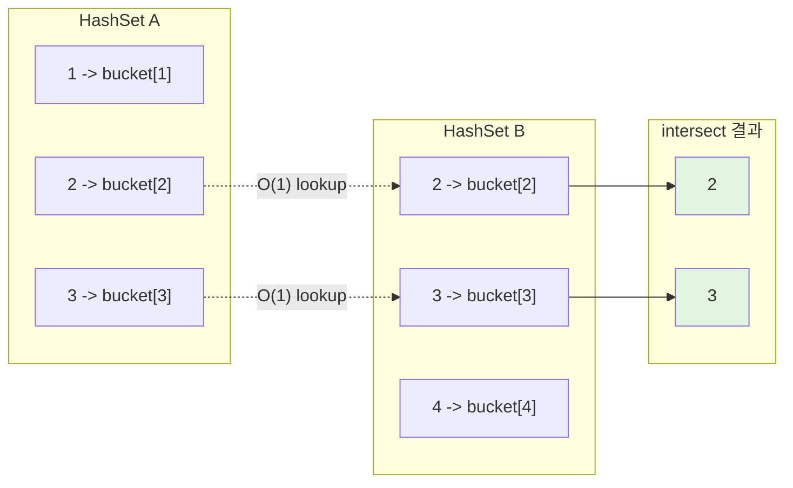
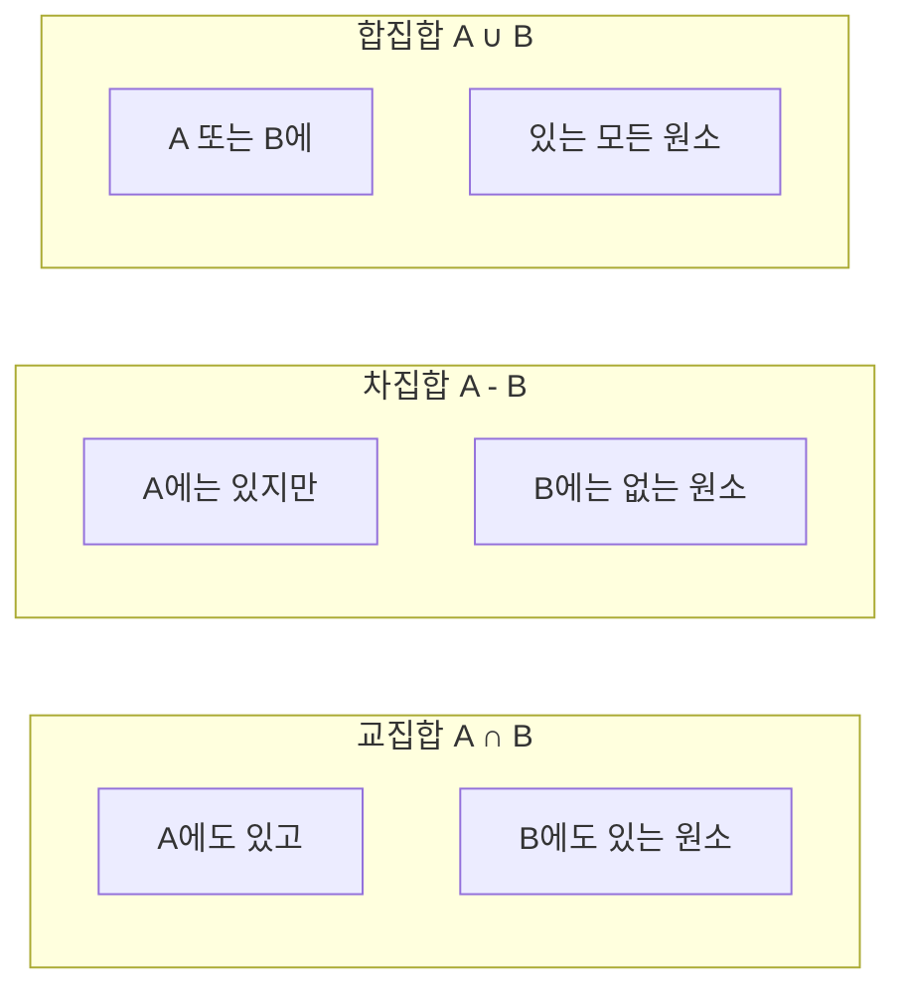
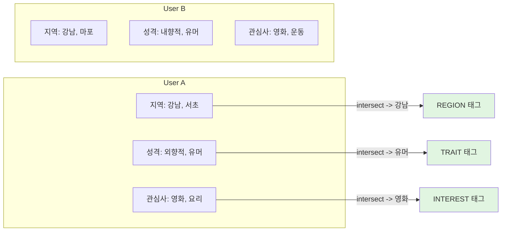
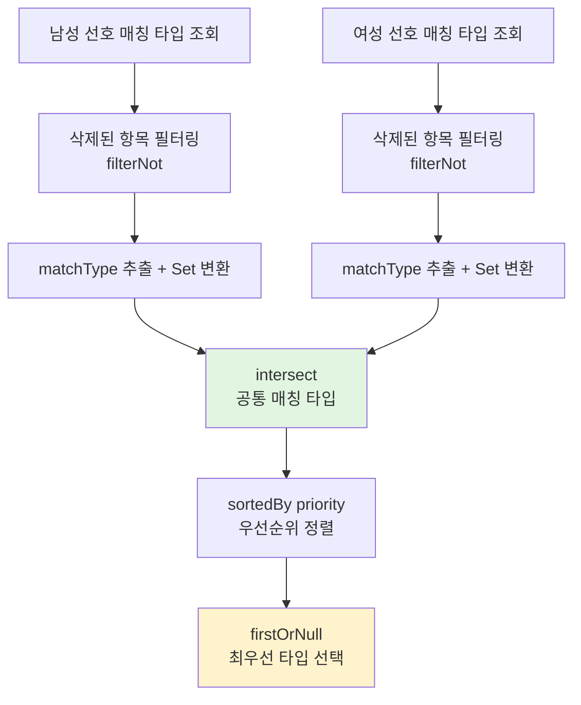
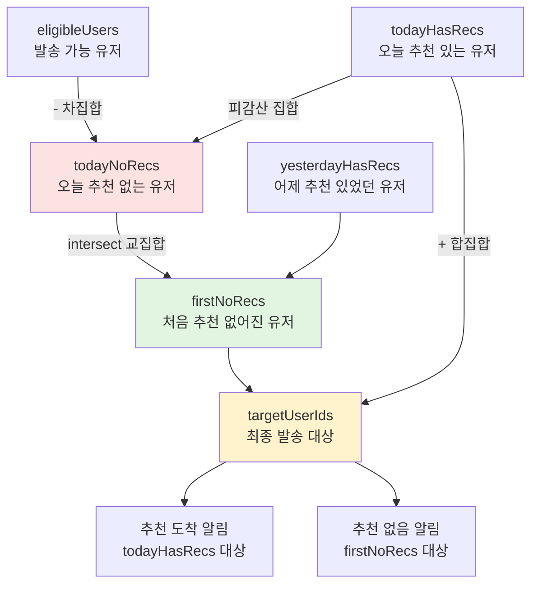
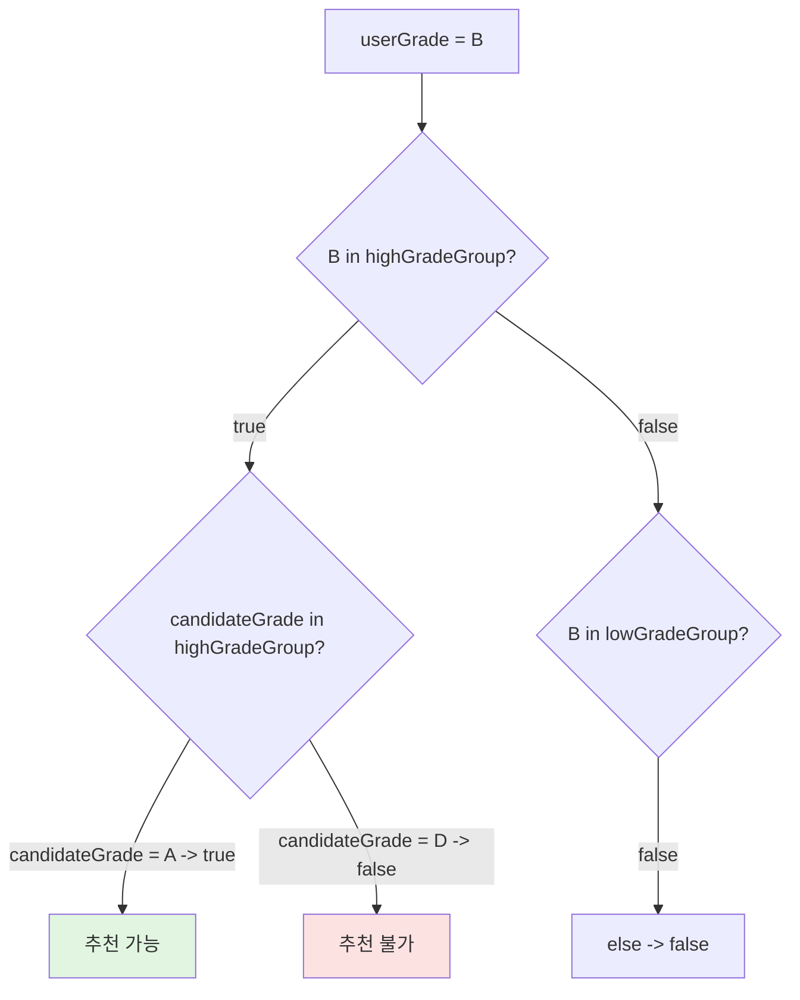

> **[시리즈] 코딩 테스트 알고리즘, 실무에서 이렇게 쓴다 -- duurian-server 편**
>
> 1. [Combination -- 조합 생성](/posts/kotlin-algorithm-01-combination/)
> 2. [Score & Range -- 점수 계산과 구간 매핑](/posts/kotlin-algorithm-02-score-range/)
> 3. **[Set 연산 -- 교집합, 합집합, 차집합](/posts/kotlin-algorithm-03-set-operations/)**
> 4. [Streak -- 연속 일수 계산](/posts/kotlin-algorithm-04-streak/)
> 5. [Top-K -- 상위 N개 선정](/posts/kotlin-algorithm-05-top-k/)
> 6. [GroupBy -- 그룹핑과 분류](/posts/kotlin-algorithm-06-groupby/)
> 7. [Rule Pattern -- 조건부 필터링과 규칙 체인](/posts/kotlin-algorithm-07-rule-pattern/)
> 8. [충돌 감지 -- 중복 방지와 양방향 확인](/posts/kotlin-algorithm-08-conflict-detection/)

---

## 1. 들어가며

코딩 테스트에서 집합(Set) 연산은 "두 배열의 공통 원소 찾기", "대칭 차집합 구하기" 같은 형태로 빈번하게 출제됩니다. 단순히 이중 반복문으로 풀 수 있지만, 해시 기반 Set을 사용하면 시간 복잡도를 O(n^2)에서 O(n)으로 줄일 수 있다는 것이 핵심입니다.

실무에서도 집합 연산은 놀라울 정도로 자주 등장합니다.

- **추천 시스템**: 두 사용자의 관심사 교집합으로 유사도 점수를 계산
- **알림 시스템**: 전체 대상에서 이미 처리된 유저를 차집합으로 제거
- **매칭 시스템**: 양쪽 선호 타입의 교집합으로 공통 매칭 타입 도출
- **등급 분류**: Set 멤버십 테스트로 그룹 소속 여부 판정

duurian-server에서는 `intersect`, `subtract`, `union` 그리고 `+`, `-`, `in` 연산자가 추천, 매칭, 알림 도메인 전반에 걸쳐 사용되고 있습니다. 이번 글에서는 7가지 실제 코드를 통해 Set 연산의 다양한 활용 패턴을 분석하겠습니다.

---

## 2. 알고리즘 원리

### 2.1. 집합 연산의 수학적 정의

세 가지 기본 집합 연산을 수학 표기로 정리하면 다음과 같습니다.

| 연산 | 수학 표기 | 의미 | 예시 (A=&#123;1,2,3&#125;, B=&#123;2,3,4&#125;) |
|------|----------|------|----------------------------|
| 교집합 | A &#8745; B | 양쪽 모두에 있는 원소 | &#123;2, 3&#125; |
| 합집합 | A &#8746; B | 어느 한쪽이라도 있는 원소 | &#123;1, 2, 3, 4&#125; |
| 차집합 | A - B | A에만 있고 B에는 없는 원소 | &#123;1&#125; |
| 대칭 차집합 | A &#9651; B | 한쪽에만 있는 원소 | &#123;1, 4&#125; |

### 2.2. 해시 기반 Set의 동작 원리



교집합(`intersect`)의 내부 동작은 다음과 같습니다.

1. 작은 쪽 Set의 각 원소를 순회 -- O(min(n, m))
2. 큰 쪽 Set에 `contains`로 존재 여부 확인 -- 각 O(1)
3. 존재하면 결과 Set에 추가

이 덕분에 전체 시간 복잡도는 **O(min(n, m))** 이 됩니다. 이중 반복문의 O(n * m)과 비교하면 큰 차이입니다.

### 2.3. Venn 다이어그램으로 보는 세 연산



---

## 3. Kotlin 구현 / 언어 특성

### 3.1. Kotlin Set API 한눈에 보기

Kotlin은 집합 연산을 위한 풍부한 API를 제공합니다.

```kotlin
val a = setOf(1, 2, 3)
val b = setOf(2, 3, 4)

// 교집합 -- 양쪽 모두에 있는 원소
a.intersect(b)       // {2, 3}
a intersect b        // 중위(infix) 호출도 가능

// 합집합 -- 어느 한쪽이라도 있는 원소
a.union(b)           // {1, 2, 3, 4}
a + b                // 연산자 오버로딩 (동일 결과)

// 차집합 -- 왼쪽에만 있는 원소
a.subtract(b)        // {1}
a - b                // 연산자 오버로딩 (동일 결과)

// 멤버십 테스트
2 in a               // true -- O(1)
5 !in a              // true
```

### 3.2. Java와의 차이점

Java에서는 Set 연산을 위해 별도의 메서드 체인이 필요합니다.

```java
// Java -- 원본 Set을 변경하는 mutable 방식
Set<Integer> intersection = new HashSet<>(setA);
intersection.retainAll(setB);  // 원본이 변경될 수 있는 위험

Set<Integer> difference = new HashSet<>(setA);
difference.removeAll(setB);
```

Kotlin의 `intersect`, `subtract`, `union`은 **항상 새로운 Set을 반환**합니다. 원본을 변경하지 않으므로 immutable 함수형 프로그래밍에 적합합니다.

### 3.3. List에서 Set으로 변환하는 관용적 패턴

```kotlin
// 실무에서 가장 많이 쓰는 패턴
val userInterests = user.interestList
    .map { it.name }   // List<Interest> -> List<String>
    .toSet()            // List<String> -> Set<String>
```

이 `map { ... }.toSet()` 패턴은 duurian-server 전반에서 반복적으로 나타납니다. 도메인 객체의 리스트를 비교 가능한 값(이름, ID 등)의 Set으로 변환하는 관용적인 표현입니다.

### 3.4. Kotlin Set API 요약 테이블

| 메서드 | 수학 기호 | 설명 | 반환 타입 | 시간 복잡도 |
|--------|----------|------|-----------|-------------|
| `intersect(other)` | A &#8745; B | 교집합 (양쪽 모두 존재) | `Set<T>` | O(min(n, m)) |
| `union(other)` | A &#8746; B | 합집합 (한쪽이라도 존재) | `Set<T>` | O(n + m) |
| `subtract(other)` | A - B | 차집합 (A에만 존재) | `Set<T>` | O(n) |
| `+` (operator) | A &#8746; B | union과 동일 | `Set<T>` | O(n + m) |
| `-` (operator) | A - B | subtract와 동일 | `Set<T>` | O(n) |
| `in` (operator) | x &#8712; A | 원소 포함 여부 | `Boolean` | O(1) |
| `containsAll(other)` | B &#8838; A | 부분집합 여부 | `Boolean` | O(m) |

---

## 4. 실무 적용 사례

### 사례 1: 관심사 매칭 점수 -- 자카드 유사도 변형

**파일**: `core/.../recommendation/calculator/InterestScoreCalculator.kt`

```kotlin
@Component
class InterestScoreCalculator : ScoreCalculator {
    override fun calculate(user: RecommendationTarget, candidate: RecommendationTarget): Double {
        if (user.profileComposition.interestList.isEmpty()) return 0.0

        val userInterests = user.profileComposition.interestList.map { it.name }.toSet()
        val candidateInterests = candidate.profileComposition.interestList.map { it.name }.toSet()
        val common = userInterests.intersect(candidateInterests)

        return (common.size.toDouble() / userInterests.size) * 100.0
    }
}
```

#### 분석

이 코드는 **자카드 유사도(Jaccard Similarity)의 변형**입니다. 원래의 자카드 유사도는 `|A &#8745; B| / |A &#8746; B|`이지만, 여기서는 **사용자 기준 매칭 비율** `|A &#8745; B| / |A|`를 사용합니다.

이렇게 설계한 이유는 "내가 가진 관심사 중 상대방과 얼마나 겹치는가"를 측정하는 것이 추천 목적에 더 부합하기 때문입니다.

| 사용자 관심사 | 후보 관심사 | 교집합 | 점수 |
|:------------|:----------|:------|:-----|
| 영화, 음악, 요리 | 영화, 요리, 운동 | 영화, 요리 | 66.7 |
| 영화, 음악, 요리 | 영화, 음악, 요리 | 영화, 음악, 요리 | 100.0 |
| 영화, 음악, 요리 | 운동, 독서 | (없음) | 0.0 |

```kotlin
// 자카드 유사도와의 비교
val jaccard = common.size.toDouble() / userInterests.union(candidateInterests).size
// 2 / 4 = 0.5 (50%)

val userBased = common.size.toDouble() / userInterests.size
// 2 / 3 = 0.667 (66.67%)  <-- 실제 구현
```

`intersect`를 사용하지 않고 이중 반복문으로 구현한다면 다음과 같을 것입니다.

```kotlin
// 비효율적인 방식 -- O(n * m)
var count = 0
for (ui in userInterests) {
    for (ci in candidateInterests) {
        if (ui == ci) count++
    }
}
```

`intersect`는 이를 O(n) 한 줄로 해결합니다.

---

### 사례 2: 지역 매칭 -- 존재 여부만 판단

**파일**: `core/.../recommendation/calculator/RegionScoreCalculator.kt`

```kotlin
@Component
class RegionScoreCalculator : ScoreCalculator {
    override fun calculate(
        user: RecommendationTarget,
        candidate: RecommendationTarget
    ): Double {
        val userRegions = user.profileComposition.regionList.map { it.name }.toSet()
        val candidateRegions = candidate.profileComposition.regionList.map { it.name }.toSet()
        val common = userRegions.intersect(candidateRegions)
        return if (common.isNotEmpty()) 100.0 else 0.0
    }
}
```

#### 분석

사례 1과 동일한 `intersect`를 사용하지만, 점수 계산 방식이 다릅니다. 관심사는 **비율** 기반이었다면, 지역은 **이진(binary)** 판정입니다. "하나라도 겹치면 100점, 아니면 0점"이라는 간단한 규칙입니다.

이는 도메인 특성을 반영한 설계입니다.
- **관심사**: 3개 중 1개 겹치는 것과 3개 다 겹치는 것은 다릅니다 (비율이 중요)
- **지역**: "같은 지역에 사는가?" 여부만 중요합니다 (존재 여부가 중요)

동일한 `intersect` API가 서로 다른 비즈니스 로직에 유연하게 적용되는 좋은 예입니다.

---

### 사례 3: 추천 사유 태그 -- 3가지 속성별 교집합 검사

**파일**: `core/.../recommendation/generator/DefaultReasonTagGenerator.kt`

```kotlin
@Component
class DefaultReasonTagGenerator : ReasonTagGenerator {

    override fun generate(
        user: RecommendationTarget,
        candidate: RecommendationTarget
    ): List<RecommendationReasonTag> {
        val reasons = mutableListOf<RecommendationReasonTag>()

        // ... (외모, 종교, 흡연, 음주는 단순 == 비교) ...

        // [지역] 선호 지역이 겹치는 경우
        val userRegions = user.profileComposition.regionList.map { it.name }.toSet()
        val candidateRegions = candidate.profileComposition.regionList.map { it.name }.toSet()
        if (userRegions.intersect(candidateRegions).isNotEmpty()) {
            reasons += RecommendationReasonTag.REGION
        }

        // [성격] 성격 태그가 겹치는 경우
        val userTraits = user.profileComposition.traitList.map { it.name }.toSet()
        val candidateTraits = candidate.profileComposition.traitList.map { it.name }.toSet()
        if (userTraits.intersect(candidateTraits).isNotEmpty()) {
            reasons += RecommendationReasonTag.TRAIT
        }

        // [관심사] 관심사가 겹치는 경우
        val userInterests = user.profileComposition.interestList.map { it.name }.toSet()
        val candidateInterests = candidate.profileComposition.interestList.map { it.name }.toSet()
        if (userInterests.intersect(candidateInterests).isNotEmpty()) {
            reasons += RecommendationReasonTag.INTEREST
        }

        return reasons
    }
}
```

#### 분석

하나의 메서드 안에서 **지역, 성격, 관심사** 세 가지 속성에 대해 동일한 패턴을 반복합니다.

```
List<도메인객체>.map { it.name }.toSet() -> intersect -> isNotEmpty
```

이 패턴은 "두 사용자 사이에 겹치는 속성이 있는가?"라는 질문에 대한 정형화된 답변입니다. 결과를 `RecommendationReasonTag`로 수집하여 클라이언트에 "이 사람을 추천한 이유"로 표시합니다.



#### UI 표시 예시

```
+--------------------------------------+
| 추천 이유                             |
+--------------------------------------+
| - 선호 지역이 비슷해요 (강남)          |
| - 성격이 잘 맞아요 (유머)             |
| - 관심사가 겹쳐요 (영화)             |
+--------------------------------------+
```

---

### 사례 4: 매칭 타입 공통점 -- 교집합 + 우선순위 정렬

**파일**: `core/.../match/service/CreateMatchingPairService.kt`

```kotlin
private fun findCommonMatchTypesSortedByPriority(
    maleUserId: UUID,
    femaleUserId: UUID
): List<MatchType> {
    val malePrefs = preferenceCompositionFactory.create(maleUserId).preferenceMatchTypeList
    val femalePrefs = preferenceCompositionFactory.create(femaleUserId).preferenceMatchTypeList

    val maleMatchTypes = malePrefs.filterNot { it.isDeleted }.map { it.matchType }.toSet()
    val femaleMatchTypes = femalePrefs.filterNot { it.isDeleted }.map { it.matchType }.toSet()

    return maleMatchTypes.intersect(femaleMatchTypes)
        .sortedBy { it.priority }
}
```

#### 분석

이 코드는 `intersect`의 결과를 바로 사용하지 않고, **우선순위(priority)로 정렬**합니다. `intersect`는 `Set<MatchType>`을 반환하므로 순서가 보장되지 않습니다. 따라서 `.sortedBy { it.priority }`를 체이닝하여 `List<MatchType>`으로 변환합니다.

처리 흐름은 다음과 같습니다.



#### 단계별 예시

```kotlin
// 예시 데이터
val maleMatchTypes = setOf(MEAL, WALK, MOVIE)   // 남성 선호
val femaleMatchTypes = setOf(MEAL, COFFEE, WALK) // 여성 선호

// 1단계: 교집합
val common = maleMatchTypes.intersect(femaleMatchTypes)
// {MEAL, WALK}

// 2단계: 우선순위 정렬
val sorted = common.sortedBy { it.priority }
// [MEAL(priority=1), WALK(priority=3)]

// 3단계: 최우선 타입 선택
val best = sorted.firstOrNull()
// MEAL
```

`intersect` 결과가 비어 있다면(`firstOrNull`이 null을 반환) 매칭 페어를 생성할 수 없으므로 `IllegalStateException`을 던집니다. 이 방어 로직이 "공통점이 없는 두 사용자는 매칭할 수 없다"는 비즈니스 규칙을 코드로 표현합니다.

---

### 사례 5: 일일 추천 알림 -- 차집합 + 교집합 + 합집합 종합 사용

**파일**: `core/.../recommendation/service/SendDailyRecommendationService.kt`

```kotlin
fun sendNotification() {
    // 4. 발송 가능한 유저 (ACTIVE & APPROVED)
    val eligibleUsers: Set<UUID> = queryUserPort.findActiveUserIdsWithApprovedProfile()

    // 5. 오늘의 추천 있는 유저
    val todayHasRecs: Set<UUID> =
        queryRecommendationPort.findTargetUserIdsWithRecommendationsBetween(todayStartUtc, tomorrowStartUtc)

    // 6. 오늘의 추천 없는 유저 -- 차집합
    val todayNoRecs: Set<UUID> = eligibleUsers - todayHasRecs

    // 7. 전일 추천 있었던 유저
    val yesterdayHasRecs: Set<UUID> =
        queryRecommendationPort.findTargetUserIdsWithRecommendationsBetween(yesterdayStartUtc, todayStartUtc)

    // 8. 처음으로 오늘의 추천이 없어진 유저 -- 교집합
    val firstNoRecs: Set<UUID> = todayNoRecs.intersect(yesterdayHasRecs)

    // 9. 최종 발송 타겟 -- 합집합
    val targetUserIds = todayHasRecs + firstNoRecs

    // 10. todayHasRecs -> 추천 도착 알림
    // 11. firstNoRecs -> 추천 없음 알림
}
```

#### 분석

이 코드는 하나의 메서드 안에서 **차집합, 교집합, 합집합을 모두** 사용하는 종합적인 사례입니다. 각 연산이 명확한 비즈니스 의미를 가집니다.



| 단계 | 연산 | Kotlin 코드 | 의미 |
|:-----|:-----|:-----------|:-----|
| 6 | 차집합 | `eligibleUsers - todayHasRecs` | 추천이 없는 유저 |
| 8 | 교집합 | `todayNoRecs.intersect(yesterdayHasRecs)` | 어제까지 추천이 있었는데 오늘 처음 없어진 유저 |
| 9 | 합집합 | `todayHasRecs + firstNoRecs` | 최종 알림 대상 |

#### 왜 교집합이 핵심인가

교집합(`intersect`)이 이 로직의 핵심인 이유는 "**처음으로** 추천이 없어진" 유저만 골라내기 위해서입니다. 3일 전부터 추천이 없던 유저에게 매일 "추천 없음" 알림을 보내면 스팸이 되므로, 어제까지 추천이 있었던 유저(yesterdayHasRecs)와의 교집합으로 "전환 시점"에만 알림을 발송합니다.

```kotlin
// 예시 데이터
val eligibleUsers = setOf("A", "B", "C", "D", "E")  // 전체 가능 유저
val todayHasRecs  = setOf("A", "B")                  // 오늘 추천 있음
val yesterdayHasRecs = setOf("B", "C", "D")           // 어제 추천 있었음

// 차집합: 오늘 추천 없는 유저
val todayNoRecs = eligibleUsers - todayHasRecs
// {"C", "D", "E"}

// 교집합: 처음으로 추천이 없어진 유저
val firstNoRecs = todayNoRecs.intersect(yesterdayHasRecs)
// {"C", "D"} -- E는 어제도 없었으므로 제외

// 합집합: 최종 알림 대상
val target = todayHasRecs + firstNoRecs
// {"A", "B", "C", "D"} -- E는 알림 대상에서 제외
```

Kotlin의 `+`와 `-` 연산자가 Set에 대해 합집합과 차집합으로 동작한다는 점이 코드 가독성을 크게 높여줍니다. Set 연산 없이 명령형으로 작성하면 10줄 이상의 반복문과 조건문이 필요한 로직이 **3줄**로 끝납니다.

---

### 사례 6: 등급 그룹 분류 -- Set 멤버십과 `in` 연산자

**파일**: `core/.../recommendation/rule/VisualGradeGroupRule.kt`

```kotlin
@Component
class VisualGradeGroupRule : RecommendationRule {

    private val highGradeGroup = setOf(VisualGrade.A, VisualGrade.B, VisualGrade.C)
    private val lowGradeGroup = setOf(VisualGrade.D, VisualGrade.E)

    override fun isEligible(
        user: RecommendationTarget,
        candidate: RecommendationTarget
    ): Boolean {
        val userGrade = user.profileComposition.profile.visualGrade ?: return false
        val candidateGrade = candidate.profileComposition.profile.visualGrade ?: return false

        return when (userGrade) {
            in highGradeGroup -> candidateGrade in highGradeGroup
            in lowGradeGroup -> candidateGrade in lowGradeGroup
            else -> false
        }
    }
}
```

#### 분석

이 코드는 `intersect`가 아닌 **`in` 연산자(Set 멤버십 테스트)**를 사용합니다. `in` 연산자는 내부적으로 `Set.contains()`를 호출하며, HashSet에서는 O(1) 시간에 동작합니다.

`when` 식과 `in` 연산자의 조합은 Kotlin만의 강력한 패턴입니다. 이를 if-else 체인으로 작성하면 다음과 같이 가독성이 크게 떨어집니다.

```kotlin
// 읽기 어려운 방식
if (userGrade == VisualGrade.A || userGrade == VisualGrade.B || userGrade == VisualGrade.C) {
    if (candidateGrade == VisualGrade.A || candidateGrade == VisualGrade.B
        || candidateGrade == VisualGrade.C) {
        return true
    }
}
// ... 하위 그룹도 동일하게 반복
```

Set + `in` 조합은 그룹 정의를 데이터로 분리하고, 판별 로직을 선언적으로 표현합니다. 등급이 추가되어도 `highGradeGroup`에 원소를 추가하기만 하면 됩니다.



---

### 사례 7: 하이라이트 필드 -- intersect로 공통점 추출 후 리스트 변환

**파일**: `core/.../recommendation/mapper/RecommendationResponseMapper.kt`

```kotlin
private fun createHighlightedFields(
    me: RecommendationTarget,
    candidate: RecommendationTarget
): HighlightedFields {
    val myProfile = me.profileComposition
    val myPreference = me.preferenceComposition
    val targetProfile = candidate.profileComposition

    return HighlightedFields(
        drinking = (myProfile.profile.drinking == targetProfile.profile.drinking),
        smoking = (myProfile.profile.smoking == targetProfile.profile.smoking),
        religion = (myProfile.profile.religion == targetProfile.profile.religion),
        height = (targetProfile.profile.height in
            myPreference.preference.minHeight..myPreference.preference.maxHeight),
        personalityTraits = myProfile.traitList.map { it.name }
            .intersect(targetProfile.traitList.map { it.name })
            .toList(),
        interests = myProfile.interestList.map { it.name }
            .intersect(targetProfile.interestList.map { it.name })
            .toList()
    )
}
```

#### 분석

여기서 `intersect`의 결과를 `.toList()`로 변환하여 API 응답에 포함합니다. 앞선 사례들은 교집합의 **크기**나 **존재 여부**만 활용했지만, 이 코드는 교집합의 **실제 원소**를 클라이언트에 전달합니다.

클라이언트는 이 정보를 사용하여 "공통 관심사: 영화, 요리"처럼 UI에 하이라이트를 표시합니다. 집합 연산이 단순한 내부 로직을 넘어 사용자에게 직접 보이는 결과물이 되는 사례입니다.

```kotlin
// 예시 데이터
val myTraits = listOf("외향적", "계획적", "감성적")
val candidateTraits = listOf("외향적", "즉흥적", "감성적")

// intersect -> toList
val commonTraits = myTraits.intersect(candidateTraits.toSet()).toList()
// ["외향적", "감성적"]
```

주목할 점은 `intersect`가 `Iterable`에 대해서도 동작한다는 것입니다. `map { it.name }`의 결과는 `List<String>`이지만, `intersect`는 내부적으로 이를 Set으로 변환하여 처리합니다. 따라서 `.toSet()`을 명시적으로 호출하지 않아도 됩니다.

```json
{
  "highlightedFields": {
    "drinking": true,
    "smoking": true,
    "religion": false,
    "height": true,
    "personalityTraits": ["외향적", "감성적"],
    "interests": ["독서", "운동"]
  }
}
```

---

## 5. 시간 복잡도와 실무 주의점

### 5.1. Set 구현체별 시간 복잡도

| 연산 | HashSet | TreeSet | List |
|:-----|:--------|:--------|:-----|
| `contains` | O(1) 평균 | O(log n) | O(n) |
| `intersect` (크기 n, m) | O(min(n,m)) | O(min(n,m) * log(max(n,m))) | O(n * m) |
| `add` | O(1) 평균 | O(log n) | O(1) 또는 O(n) |
| 정렬 보장 | 없음 | 있음 (자동 정렬) | 삽입 순서 |
| 메모리 | 해시 테이블 | Red-Black Tree | 배열 |

### 5.2. List.contains() vs Set.contains() -- 실무 최적화 팁

duurian-server 코드에서 반복적으로 나타나는 `.toSet()` 호출에는 이유가 있습니다.

```kotlin
// 느린 방식 -- List.contains()는 O(n)
val userInterests = user.interestList.map { it.name }  // List<String>
for (ci in candidateInterests) {
    if (ci in userInterests) { /* O(n) 매번 선형 탐색 */ }
}

// 빠른 방식 -- Set.contains()는 O(1)
val userInterests = user.interestList.map { it.name }.toSet()  // Set<String>
for (ci in candidateInterests) {
    if (ci in userInterests) { /* O(1) 해시 룩업 */ }
}
```

데이터 크기가 작으면(관심사 5~10개 수준) 차이가 미미하지만, 추천 시스템은 **수천 명의 후보에 대해 반복** 호출되므로 `.toSet()` 한 번의 비용은 충분히 상각됩니다.

| 데이터 크기 | List 방식 O(n*m) | Set 방식 O(n+m) | 차이 |
|:-----------|:----------------|:---------------|:-----|
| n=10, m=10 | 100회 비교 | 20회 연산 | 5배 |
| n=100, m=100 | 10,000회 비교 | 200회 연산 | 50배 |
| n=1000, m=1000 | 1,000,000회 비교 | 2,000회 연산 | 500배 |

### 5.3. 실무에서 주의할 점

**1) `equals()`와 `hashCode()` 구현**

`intersect`는 내부적으로 `HashSet`을 사용하므로, 비교 대상 객체의 `equals()`와 `hashCode()`가 올바르게 구현되어 있어야 합니다. duurian-server에서 `.map { it.name }`으로 String을 추출하는 이유이기도 합니다. 도메인 객체 자체를 비교하면 참조 비교가 될 수 있습니다.

```kotlin
// 위험 -- Interest 객체의 equals/hashCode 구현에 의존
user.interestList.toSet().intersect(candidate.interestList.toSet())

// 안전 -- String(값 타입)으로 변환 후 비교
user.interestList.map { it.name }.toSet()
    .intersect(candidate.interestList.map { it.name }.toSet())
```

**2) 빈 Set 처리**

```kotlin
emptySet<String>().intersect(setOf("a", "b"))  // emptySet
setOf("a").intersect(emptySet())                // emptySet
```

`InterestScoreCalculator`에서 `if (user.profileComposition.interestList.isEmpty()) return 0.0`으로 빈 리스트를 조기 반환하는 것은 불필요한 연산 방지와 0으로 나누기(division by zero) 방어를 동시에 수행합니다.

**3) mutable vs immutable**

Kotlin의 `intersect`, `subtract`, `union`은 항상 새로운 `Set`을 반환합니다. 원본 Set은 변경되지 않습니다. 이는 Java의 `retainAll`, `removeAll`이 원본을 변경하는 것과 다른 점입니다.

```kotlin
// Kotlin -- 불변 (안전)
val result = setA.intersect(setB)  // setA, setB 모두 변경 없음

// Java -- 가변 (주의 필요)
setA.retainAll(setB);  // setA가 변경됨!
```

**4) 불변성 유지**

```kotlin
// 좋은 예: 불변 Set으로 그룹 정의
private val highGradeGroup = setOf(VisualGrade.A, VisualGrade.B, VisualGrade.C)

// 나쁜 예: 가변 Set 사용 (의도치 않은 수정 가능)
private val highGradeGroup = mutableSetOf(VisualGrade.A, VisualGrade.B, VisualGrade.C)
// 실수로 highGradeGroup.add(VisualGrade.D) 호출 시 버그 발생
```

---

## 6. 관련 코딩 테스트 유형

### 6.1. 백준 1764 -- 듣보잡

듣도 못한 사람과 보도 못한 사람의 교집합(듣도 보도 못한 사람)을 구하는 문제입니다.

```kotlin
fun main() {
    val (n, m) = readLine()!!.split(" ").map { it.toInt() }
    val heard = (1..n).map { readLine()!! }.toSet()
    val seen = (1..m).map { readLine()!! }.toSet()
    val result = heard.intersect(seen).sorted()
    println(result.size)
    result.forEach { println(it) }
}
```

**핵심**: `intersect` 한 줄로 교집합을 구한 뒤 `sorted()`로 사전순 정렬합니다.

### 6.2. 프로그래머스 -- 폰켓몬

N/2마리의 폰켓몬을 선택할 때 최대한 다양한 종류를 선택하는 문제입니다. `toSet()`으로 중복을 제거한 뒤 크기를 비교합니다.

```kotlin
fun solution(nums: IntArray): Int {
    val uniqueTypes = nums.toSet().size
    val selectCount = nums.size / 2
    return minOf(uniqueTypes, selectCount)
}
```

**핵심**: Set의 중복 제거 특성을 활용합니다.

### 6.3. 백준 1269 -- 대칭 차집합

두 집합의 대칭 차집합 크기를 구하는 문제입니다. (A - B) + (B - A)로 해결합니다.

```kotlin
fun main() {
    val (n, m) = readLine()!!.split(" ").map { it.toInt() }
    val a = readLine()!!.split(" ").map { it.toInt() }.toSet()
    val b = readLine()!!.split(" ").map { it.toInt() }.toSet()
    println((a - b).size + (b - a).size)
}
```

**핵심**: Kotlin의 `-` 연산자로 차집합을 간결하게 표현합니다.

### 6.4. 프로그래머스 -- 두 배열의 교집합

두 정수 배열의 교집합을 오름차순 정렬하여 반환하는 문제입니다.

```kotlin
fun solution(nums1: IntArray, nums2: IntArray): IntArray {
    return nums1.toSet().intersect(nums2.toSet()).sorted().toIntArray()
}
```

### 6.5. LeetCode 349 -- Intersection of Two Arrays

두 배열의 교집합을 구하는 문제로, 위와 동일한 패턴입니다.

```kotlin
fun intersection(nums1: IntArray, nums2: IntArray): IntArray {
    return nums1.toSet().intersect(nums2.toSet()).toIntArray()
}
```

---

## 7. 정리

### 7.1. 요약 테이블

| 사례 | 연산 | Kotlin API | 반환값 활용 |
|:-----|:-----|:-----------|:-----------|
| 관심사 매칭 | 교집합 | `intersect` | 크기 비율 -> 점수 |
| 지역 매칭 | 교집합 | `intersect` | 존재 여부 -> Boolean |
| 추천 사유 태그 | 교집합 x3 | `intersect` | 존재 여부 -> 태그 생성 |
| 매칭 타입 | 교집합 + 정렬 | `intersect` + `sortedBy` | 정렬된 리스트 |
| 알림 대상 | 차집합 + 교집합 + 합집합 | `-`, `intersect`, `+` | 필터링된 집합 |
| 등급 그룹 | 멤버십 | `in` | Boolean 판정 |
| 하이라이트 | 교집합 | `intersect` + `toList` | 실제 원소 목록 |

### 7.2. 핵심 포인트

**1) `map { ... }.toSet()` 패턴을 체화해야 합니다.**
도메인 객체 리스트를 비교 가능한 값의 Set으로 변환하는 이 패턴은 실무 Kotlin 코드에서 가장 자주 마주치는 관용적 표현입니다.

**2) 동일한 `intersect`가 다양한 비즈니스 로직에 적용됩니다.**
크기, 존재 여부, 실제 원소 등 결과를 어떻게 활용하느냐에 따라 전혀 다른 기능이 됩니다.

**3) `+`와 `-` 연산자를 적극 활용해야 합니다.**
`SendDailyRecommendationService`에서 보듯이, 합집합과 차집합을 수학 기호처럼 표현할 수 있어 비즈니스 로직의 의도가 코드에 그대로 드러납니다.

**4) HashSet의 O(1) `contains`를 잊지 말아야 합니다.**
추천 시스템처럼 대량 반복이 발생하는 곳에서 `List.contains()` 대신 `Set.contains()`를 사용하는 것만으로도 성능이 크게 개선됩니다.

**5) Set 멤버십 + `when`은 그룹 분류의 정석입니다.**
`VisualGradeGroupRule`처럼 그룹 정의를 데이터(Set)로 분리하고, 판별 로직을 `when` + `in`으로 선언적으로 표현하면 유지보수성이 높아집니다.

---

*이전 글: [Score & Range -- 점수 계산과 구간 매핑](/posts/kotlin-algorithm-02-score-range/)*

*다음 글: [Streak -- 연속 일수 계산](/posts/kotlin-algorithm-04-streak/)에서는 날짜 정렬, 역순 탐색, 타임존 변환이 결합된 실무 패턴을 ConversationDaysCalculator 코드와 함께 분석합니다.*

*정지원 (duurian 백엔드 개발자)*
