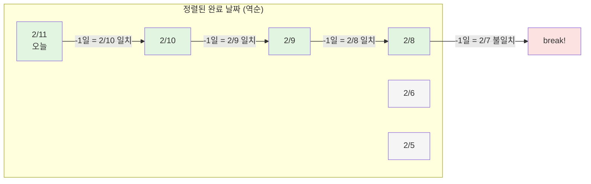
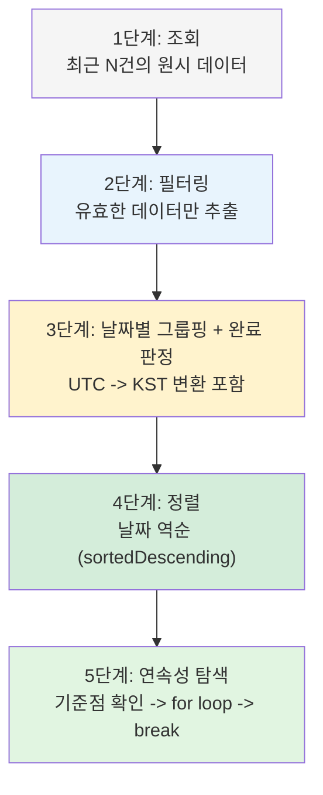
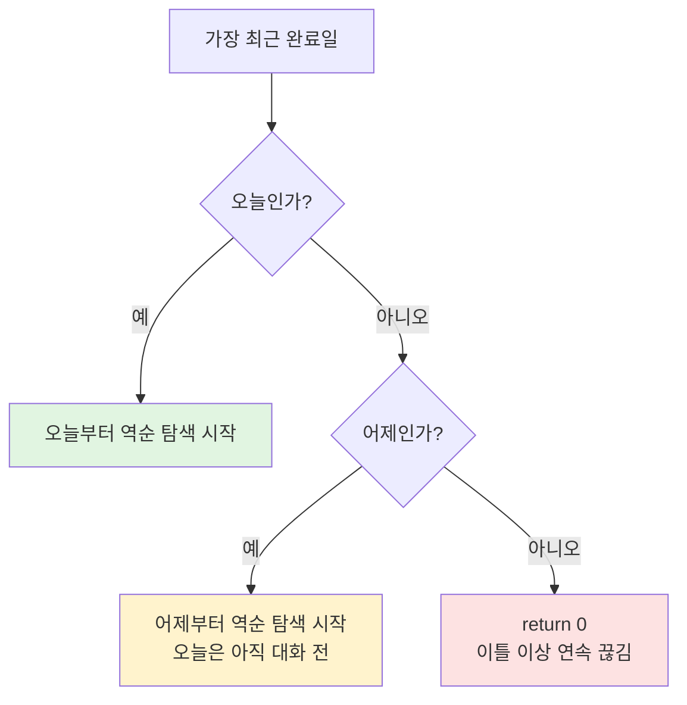
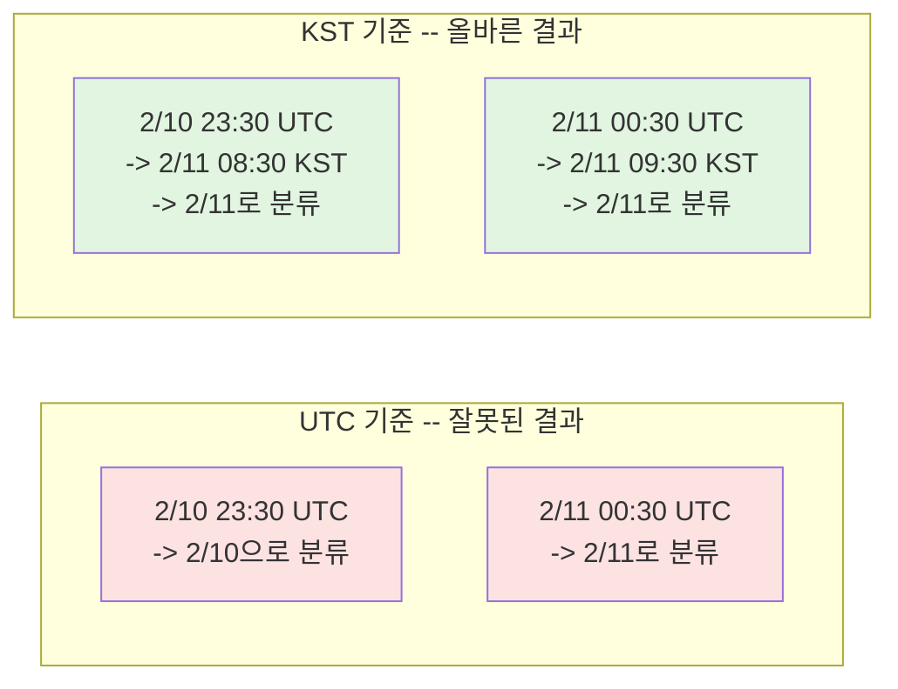
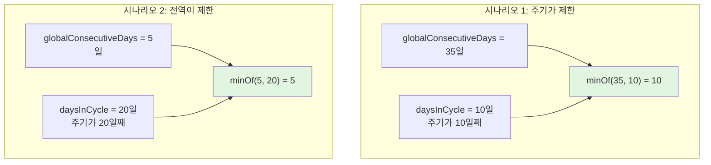
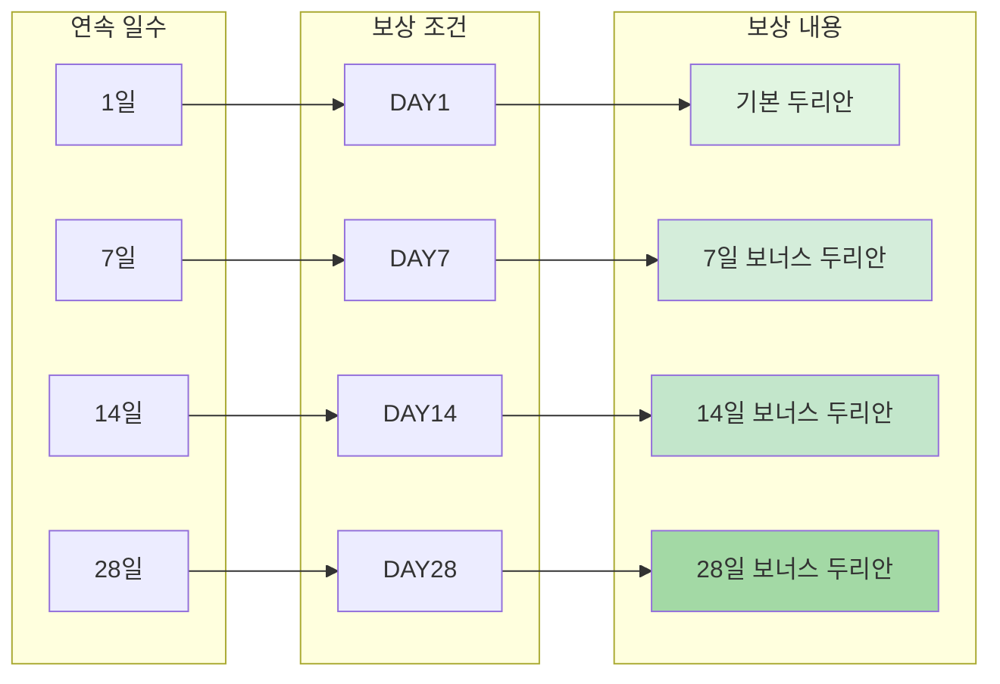
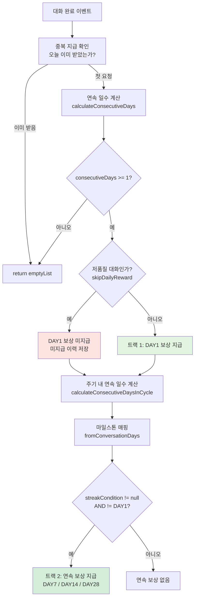
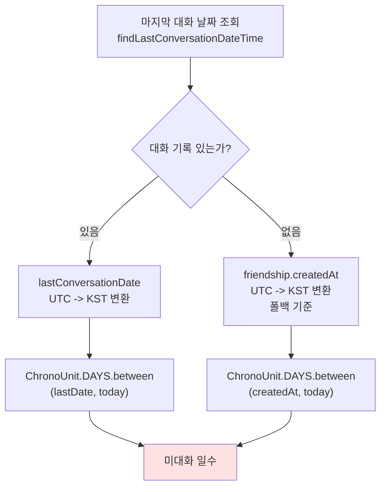
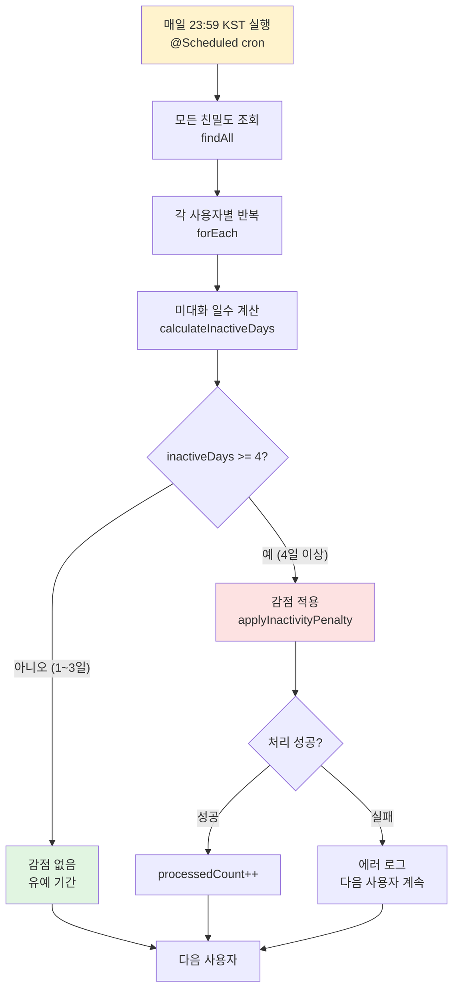
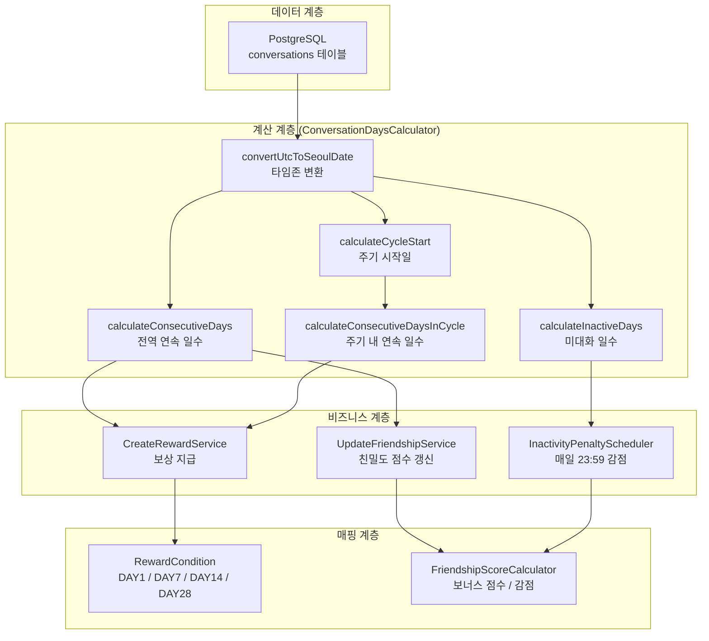

> **[시리즈] 코딩 테스트 알고리즘, 실무에서 이렇게 쓴다 -- duurian-server 편**
>
> 1. [Combination -- 조합 생성](/posts/kotlin-algorithm-01-combination/)
> 2. [Score & Range -- 점수 계산과 구간 매핑](/posts/kotlin-algorithm-02-score-range/)
> 3. [Set 연산 -- 교집합, 합집합, 차집합](/posts/kotlin-algorithm-03-set-operations/)
> 4. **[Streak -- 연속 일수 계산](/posts/kotlin-algorithm-04-streak/)**
> 5. [Top-K -- 상위 N개 선정](/posts/kotlin-algorithm-05-top-k/)
> 6. [GroupBy -- 그룹핑과 분류](/posts/kotlin-algorithm-06-groupby/)
> 7. [Rule Pattern -- 조건부 필터링과 규칙 체인](/posts/kotlin-algorithm-07-rule-pattern/)
> 8. [충돌 감지 -- 중복 방지와 양방향 확인](/posts/kotlin-algorithm-08-conflict-detection/)

---

## 1. 들어가며

코딩 테스트에서 "연속 부분 수열", "가장 긴 연속 구간", "연속된 숫자 세기" 같은 문제는 자주 출제되는 유형입니다. 정렬된 데이터에서 이전 원소와의 차이를 비교하며 연속성을 판단하는 패턴이 핵심입니다.

실무에서 이 패턴은 더 복잡한 형태로 나타납니다.

- **연속 로그인 보상**: 7일 연속 접속 시 보너스 지급
- **출석 체크 시스템**: 연속 출석일에 따라 등급별 혜택 부여
- **활동 감시**: N일 미접속 시 자동 제재 또는 감점
- **구독 주기 관리**: 첫 결제일 기준 월 단위 갱신

duurian-server에서는 **연속 대화 일수**를 기반으로 보상, 친밀도 점수, 비활동 감점을 처리합니다. 이 글에서는 `ConversationDaysCalculator`를 중심으로 Streak 알고리즘의 실무 적용 패턴을 분석하겠습니다.

---

## 2. 알고리즘 원리

### 2.1. Streak 알고리즘이란?

Streak(연속성) 알고리즘은 정렬된 데이터에서 **연속된 원소의 최대 길이**를 구하는 알고리즘입니다. 핵심 아이디어는 단순합니다.

1. 데이터를 정렬합니다.
2. 인접한 원소 간의 차이를 확인합니다.
3. 차이가 1(또는 기대값)이면 연속, 아니면 끊김으로 판단합니다.

```
날짜:    2/6   2/7   2/8   2/9   2/10  2/11
활동:     O     X     O     O     O     O
연속:     1     -     1     2     3     4
```

위 예시에서 2/11 기준 연속 일수는 **4일**입니다. (2/8부터 연속)

### 2.2. 날짜 기반 Streak의 특수성

숫자 배열에서의 연속성 검사와 달리, 날짜 기반 Streak에는 추가적인 고려사항이 있습니다.

| 구분 | 숫자 배열 Streak | 날짜 기반 Streak |
|:-----|:---------------|:---------------|
| 원소 타입 | Int | LocalDate |
| 연속 판정 | `a[i] - a[i-1] == 1` | `date[i] == date[i-1].minusDays(1)` |
| 사전 처리 | 중복 제거 | 필터링 + 그룹핑 + 완료 판정 |
| 기준점 | 없음 (전체 탐색) | 오늘 또는 어제 (현재 시점 기준) |
| 타임존 | 불필요 | UTC -> KST 변환 필수 |
| 탐색 방향 | 양방향 가능 | 역순 (최신 -> 과거) |

### 2.3. 역순 탐색 (Reverse Traversal)

일반적인 Streak 문제는 배열 전체를 순회하며 최장 연속 구간을 찾습니다. 하지만 "현재 연속 일수"를 구할 때는 **오늘부터 역순으로** 탐색하는 것이 효율적입니다.



2/8에서 2/6으로 넘어갈 때 2/7이 빠져 있으므로 연속이 끊깁니다. 이 시점에서 `break`하면 연속 일수는 **4일**(2/11, 2/10, 2/9, 2/8)입니다. 끊긴 이후의 데이터(2/6, 2/5)는 확인할 필요가 없으므로 불필요한 연산을 피할 수 있습니다.

### 2.4. 실무 Streak의 5단계 파이프라인

실무에서의 Streak 계산은 단순한 배열 순회가 아닙니다. 원시 데이터에서 "완료된 날짜" 목록을 만드는 전처리 과정이 알고리즘 자체보다 더 복잡합니다.



---

## 3. Kotlin 구현 / 언어 특성

### 3.1. Kotlin의 날짜 처리 관련 기능

Kotlin은 Java의 `java.time` API를 그대로 사용하면서도, 확장 함수와 함수형 API로 더 간결하게 작성할 수 있습니다.

```kotlin
import java.time.LocalDate
import java.time.LocalDateTime
import java.time.ZoneId
import java.time.temporal.ChronoUnit

// 타임존 상수
val SEOUL_ZONE = ZoneId.of("Asia/Seoul")
val UTC_ZONE = ZoneId.of("UTC")

// UTC -> KST 변환
fun convertUtcToSeoulDate(utcDateTime: LocalDateTime): LocalDate {
    return utcDateTime
        .atZone(UTC_ZONE)
        .withZoneSameInstant(SEOUL_ZONE)
        .toLocalDate()
}

// 두 날짜 사이의 일수 계산
val daysBetween = ChronoUnit.DAYS.between(startDate, endDate).toInt()
```

### 3.2. Kotlin만의 장점

**1) 함수형 파이프라인**

```kotlin
val completedDates = conversations
    .filter { !it.isAiModel && it.questionId == null }  // 사용자 응답만
    .groupBy { convertUtcToSeoulDate(it.createdAt) }    // 날짜별 그룹핑
    .filter { (_, turns) -> turns.size >= 5 }           // 5턴 이상만
    .keys                                                // 날짜만 추출
    .sortedDescending()                                  // 역순 정렬
```

Java로 작성하면 각 단계마다 중간 변수와 반복문이 필요하지만, Kotlin에서는 하나의 체인으로 표현됩니다.

**2) 범위 연산자와 until**

```kotlin
for (i in 1 until completedDates.size) {
    // 1부터 size-1까지 (until은 마지막 값 제외)
}
```

**3) when 표현식으로 구간 매핑**

```kotlin
val score = when {
    consecutiveDays >= 28 -> 10
    consecutiveDays >= 21 -> 8
    consecutiveDays >= 14 -> 6
    consecutiveDays >= 7  -> 4
    consecutiveDays >= 3  -> 2
    else -> 0
}
```

if-else 체인보다 훨씬 읽기 쉽고, 구간 경계가 명확하게 드러납니다.

**4) minOf를 이용한 상한 제한**

```kotlin
return minOf(globalConsecutiveDays, daysInCycle)
```

두 제약 조건 중 더 엄격한 값을 취하는 패턴은 Kotlin의 `minOf`로 한 줄에 표현됩니다.

---

## 4. 실무 적용 사례

### 사례 1: 연속 대화 일수 계산 -- 5단계 파이프라인

**파일**: `core/.../conversation/conversation/service/ConversationDaysCalculator.kt`

```kotlin
@Component
class ConversationDaysCalculator(
    private val queryConversationPort: QueryConversationPort,
) {
    fun calculateConsecutiveDays(userId: UUID): Int {
        val conversations = queryConversationPort.findByUserId(userId, MAX_CONVERSATIONS_FOR_STREAK)
        val completedDates = conversations
            .filter { !it.isAiModel && it.questionId == null }
            .groupBy { convertUtcToSeoulDate(it.createdAt) }
            .filter { (_, turns) -> turns.size >= REQUIRED_TURNS_FOR_COMPLETION }
            .keys
            .sortedDescending()

        if (completedDates.isEmpty()) return 0

        val today = LocalDate.now(SEOUL_ZONE)

        // 오늘 또는 어제 완료된 대화가 없으면 연속 일수는 0
        if (completedDates.first() != today && completedDates.first() != today.minusDays(1)) {
            return 0
        }

        var consecutiveDays = 1
        var currentDate = completedDates.first()

        for (i in 1 until completedDates.size) {
            val expectedPrevDate = currentDate.minusDays(1)
            if (completedDates[i] == expectedPrevDate) {
                consecutiveDays++
                currentDate = completedDates[i]
            } else {
                break
            }
        }

        return consecutiveDays
    }

    private fun convertUtcToSeoulDate(utcDateTime: LocalDateTime): LocalDate {
        return utcDateTime
            .atZone(UTC_ZONE)
            .withZoneSameInstant(SEOUL_ZONE)
            .toLocalDate()
    }
}
```

#### 5단계 상세 분석

**1단계 -- 조회**: 최근 300건의 대화를 조회합니다.

```kotlin
val conversations = queryConversationPort.findByUserId(userId, MAX_CONVERSATIONS_FOR_STREAK)
// MAX_CONVERSATIONS_FOR_STREAK = 300
// 하루 5턴 기준 최대 60일치를 커버
```

**2단계 -- 필터링**: AI 모델의 응답과 시스템 질문을 제외하고, 사용자가 직접 입력한 응답만 남깁니다.

```kotlin
.filter { !it.isAiModel && it.questionId == null }
// isAiModel=false: AI 응답 제외, 사용자 응답만
// questionId=null: 시스템 질문 응답 제외, 자유 대화만
```

이 필터링이 중요한 이유는 대화 완료의 판단 기준이 "사용자 응답 5턴"이기 때문입니다. AI 응답까지 포함하면 턴 수가 부풀려집니다.

**3단계 -- 날짜별 그룹핑 + 완료 판정**:

```kotlin
.groupBy { convertUtcToSeoulDate(it.createdAt) }  // Map<LocalDate, List<Conversation>>
.filter { (_, turns) -> turns.size >= REQUIRED_TURNS_FOR_COMPLETION }  // 5턴 이상만
```

`groupBy`가 반환하는 `Map<LocalDate, List<Conversation>>`에서, value의 크기가 5 이상인 항목만 남깁니다. 이것이 "그 날 대화를 완료했다"는 의미입니다.

```kotlin
// 예시
// 2/11: [Conv1, Conv2, Conv3, Conv4, Conv5, Conv6] -> 6개 >= 5 -> 완료
// 2/10: [Conv7, Conv8]                             -> 2개 <  5 -> 미완료
// 2/9:  [Conv9, Conv10, Conv11, Conv12, Conv13]     -> 5개 >= 5 -> 완료
```

**4단계 -- 정렬**: `.keys.sortedDescending()`으로 날짜만 추출하고 역순 정렬합니다.

```kotlin
// 위 예시 기준: [2/11, 2/9] (2/10은 미완료이므로 제외)
```

**5단계 -- 연속성 탐색**:

```kotlin
// 기준점 확인: 가장 최근 완료일이 오늘 또는 어제인가?
if (completedDates.first() != today && completedDates.first() != today.minusDays(1)) {
    return 0  // 이틀 이상 안 했으면 연속 끊김
}

// 역순 탐색
var consecutiveDays = 1
var currentDate = completedDates.first()

for (i in 1 until completedDates.size) {
    val expectedPrevDate = currentDate.minusDays(1)
    if (completedDates[i] == expectedPrevDate) {
        consecutiveDays++
        currentDate = completedDates[i]
    } else {
        break  // 연속 끊김 -> 즉시 중단
    }
}
```

#### "오늘 또는 어제" 기준의 이유



"어제"까지 허용하는 이유는 **아직 오늘 대화를 하지 않았을 수 있기 때문**입니다. 오전에 연속 일수를 조회하면 오늘 대화를 아직 안 했더라도 어제까지의 연속 기록이 유지되어야 합니다.

#### 실행 예시

```kotlin
// 완료 날짜: [2/11, 2/10, 2/9, 2/8, 2/6, 2/5]
// 오늘: 2/11

// i=0: currentDate = 2/11, consecutiveDays = 1
// i=1: expected = 2/10, actual = 2/10 -> 일치! consecutiveDays = 2
// i=2: expected = 2/9,  actual = 2/9  -> 일치! consecutiveDays = 3
// i=3: expected = 2/8,  actual = 2/8  -> 일치! consecutiveDays = 4
// i=4: expected = 2/7,  actual = 2/6  -> 불일치! break
// 결과: 4일
```

---

### 사례 2: 타임존 변환 -- 실무에서 가장 흔한 함정

**파일**: `core/.../conversation/conversation/service/ConversationDaysCalculator.kt`

```kotlin
private val SEOUL_ZONE = ZoneId.of("Asia/Seoul")
private val UTC_ZONE = ZoneId.of("UTC")

private fun convertUtcToSeoulDate(utcDateTime: LocalDateTime): LocalDate {
    return utcDateTime
        .atZone(UTC_ZONE)              // 1. UTC로 해석
        .withZoneSameInstant(SEOUL_ZONE) // 2. 같은 시각을 KST로 변환
        .toLocalDate()                  // 3. 날짜만 추출
}
```

#### 왜 타임존 변환이 필수인가

DB에는 모든 시간을 UTC로 저장하지만, 사용자의 "하루"는 서울 시간(KST = UTC+9) 기준입니다.

```
UTC  2026-02-10 23:30:00  (10일 23시 30분)
KST  2026-02-11 08:30:00  (11일 08시 30분)
```

UTC 기준으로 날짜를 추출하면 2/10이지만, KST 기준으로는 2/11입니다. 변환 없이 UTC 날짜를 사용하면 자정 전후의 대화가 다른 날로 분류되어 연속 일수가 잘못 계산됩니다.



UTC 기준이면 같은 날(KST 기준 2/11)의 대화가 2/10과 2/11로 나뉘어, 연속 일수 계산에 오류가 발생합니다.

#### 주의: `LocalDate.now()` vs `LocalDate.now(SEOUL_ZONE)`

```kotlin
// 위험: 서버 타임존에 의존
val today = LocalDate.now()  // 서버가 UTC이면 KST와 9시간 차이

// 안전: 명시적 타임존 지정
val today = LocalDate.now(SEOUL_ZONE)  // 항상 KST 기준
```

운영 환경(AWS, GCP 등)은 대부분 UTC를 기본 타임존으로 사용합니다. `ZoneId`를 명시하지 않으면 서버 배포 환경에 따라 결과가 달라지는 버그가 발생합니다.

---

### 사례 3: 주기(Cycle) 기반 연속 일수 -- globalConsecutiveDays와 daysInCycle의 min

**파일**: `core/.../conversation/conversation/service/ConversationDaysCalculator.kt`

```kotlin
fun calculateCycleStart(userId: UUID): LocalDate? {
    val firstConversationDateTime = queryConversationPort.findFirstConversationDateTime(userId)
        ?: return null

    val firstConvDate = convertUtcToSeoulDate(firstConversationDateTime)
    val today = LocalDate.now(SEOUL_ZONE)

    val monthsBetween = ChronoUnit.MONTHS.between(firstConvDate, today)
    return firstConvDate.plusMonths(monthsBetween)
}

fun calculateConsecutiveDaysInCycle(userId: UUID): Int {
    val globalConsecutiveDays = calculateConsecutiveDays(userId)
    val cycleStart = calculateCycleStart(userId) ?: return globalConsecutiveDays

    val today = LocalDate.now(SEOUL_ZONE)
    val daysInCycle = ChronoUnit.DAYS.between(cycleStart, today).toInt() + 1

    return minOf(globalConsecutiveDays, daysInCycle)
}
```

#### 주기의 개념

duurian에서 보상은 **월간 주기**로 관리됩니다. 첫 대화 날짜를 기준으로 매월 새 주기가 시작됩니다.

```
첫 대화: 1월 15일
주기 1: 1/15 ~ 2/14
주기 2: 2/15 ~ 3/14
주기 3: 3/15 ~ 4/14
...
```

`ChronoUnit.MONTHS.between(firstConvDate, today)`로 몇 번째 주기인지 계산하고, `firstConvDate.plusMonths(monthsBetween)`으로 현재 주기의 시작일을 구합니다.

#### minOf의 의미



`minOf(globalConsecutiveDays, daysInCycle)`을 사용하는 이유는 두 가지 제약 조건을 동시에 만족시키기 위해서입니다.

1. **전역 연속 일수 제약**: 실제로 연속 대화를 한 일수를 초과할 수 없습니다.
2. **주기 내 일수 제약**: 현재 주기가 시작된 이후의 일수를 초과할 수 없습니다.

예를 들어, 전체적으로 35일 연속 대화를 했더라도 현재 주기가 10일밖에 안 되었다면, 주기 내 연속 일수는 10일입니다. 이전 주기의 DAY7, DAY14, DAY28 보상을 이미 받았으므로, 새 주기에서 다시 받을 수 있어야 합니다.

#### `+1`이 필요한 이유

```kotlin
val daysInCycle = ChronoUnit.DAYS.between(cycleStart, today).toInt() + 1
```

`ChronoUnit.DAYS.between`은 시작일을 포함하지 않습니다. 주기 시작일 당일(첫날)은 1일째로 계산해야 하므로 `+1`이 필요합니다.

```kotlin
// cycleStart = 2/15, today = 2/15
// between(2/15, 2/15) = 0 -> +1 = 1일째 (올바름)

// cycleStart = 2/15, today = 2/21
// between(2/15, 2/21) = 6 -> +1 = 7일째 (올바름, DAY7 보상 대상)
```

---

### 사례 4: 보상 조건 매핑 -- Streak 마일스톤

**파일**: `domain/.../reward/model/RewardCondition.kt`

```kotlin
enum class RewardCondition(val day: Int?) {
    DAY1(1),
    DAY7(7),
    DAY14(14),
    DAY28(28),
    FIRST_PERSONA_PUBLIC(null);

    companion object {
        fun fromConversationDays(days: Int): RewardCondition? {
            return entries.firstOrNull { it.day != null && it.day == days }
        }
    }
}
```

#### 분석

이 enum은 Streak 일수를 보상 조건에 매핑합니다. `fromConversationDays`는 연속 일수가 **정확히** 마일스톤과 일치할 때만 보상 조건을 반환합니다.

```kotlin
RewardCondition.fromConversationDays(1)   // DAY1
RewardCondition.fromConversationDays(7)   // DAY7
RewardCondition.fromConversationDays(14)  // DAY14
RewardCondition.fromConversationDays(28)  // DAY28
RewardCondition.fromConversationDays(5)   // null (마일스톤에 해당하지 않음)
RewardCondition.fromConversationDays(30)  // null (28일 초과)
```

"정확히 일치"하는 설계가 핵심입니다. 8일째에는 DAY7 보상을 주지 않습니다. DAY7 보상은 7일째 딱 한 번만 지급됩니다.



`FIRST_PERSONA_PUBLIC(null)`은 일수와 무관한 조건으로, `day`가 null이므로 `fromConversationDays`에서 항상 필터링됩니다. 이런 설계는 하나의 enum에 서로 다른 유형의 보상 조건을 통합하면서도 충돌을 방지합니다.

---

### 사례 5: Streak 기반 보상 지급 -- CreateRewardService

**파일**: `core/.../reward/service/CreateRewardService.kt`

```kotlin
@Transactional
override fun createConversationReward(command: CreateRewardCommand): List<CommandRewardResult> {
    val today = LocalDate.now(SEOUL_ZONE)

    // 오늘 이미 대화 보상을 받은 경우 중복 지급 방지
    if (queryRewardPort.existsByUserIdAndTypeAndDate(command.userId, RewardType.CONVERSATION, today)) {
        return emptyList()
    }

    val consecutiveDays = conversationDaysCalculator.calculateConsecutiveDays(command.userId)
    if (consecutiveDays < 1) return emptyList()

    val results = mutableListOf<CommandRewardResult>()

    // 매일 보상 (DAY1): 대화 완료 시 지급
    if (command.skipDailyReward) {
        // 저품질 대화인 경우 DAY1 보상만 미지급하고 미지급 이력 저장
        commandRewardSkipHistoryPort.save(
            RewardSkipHistory.create(userId = command.userId, reasons = command.skipReasons)
        )
    } else {
        createRewardIfExists(
            command = command,
            feature = RewardFeature.CONVERSATION,
            condition = RewardCondition.DAY1
        )?.let { results.add(it) }
    }

    // 연속 보상 (DAY7, DAY14, DAY28): 월간 주기 내 연속일수 기준으로 지급
    val consecutiveDaysInCycle = conversationDaysCalculator.calculateConsecutiveDaysInCycle(command.userId)
    val streakCondition = RewardCondition.fromConversationDays(consecutiveDaysInCycle)
    if (streakCondition != null && streakCondition != RewardCondition.DAY1) {
        createRewardIfExists(
            command = command,
            feature = RewardFeature.CONVERSATION,
            condition = streakCondition
        )?.let { results.add(it) }
    }

    return results
}
```

#### 두 가지 보상 트랙



주목할 점은 **두 가지 연속 일수 계산기를 사용**한다는 것입니다.

| 용도 | 메서드 | 기준 |
|:-----|:------|:-----|
| 보상 자격 확인 | `calculateConsecutiveDays` | 전역 연속 일수 |
| 마일스톤 매핑 | `calculateConsecutiveDaysInCycle` | 주기 내 연속 일수 |

전역 연속 일수가 1 미만이면 보상 자체를 지급하지 않고, 주기 내 연속 일수로 DAY7/14/28 보상을 결정합니다.

`streakCondition != RewardCondition.DAY1` 조건은 DAY1 보상이 이미 위에서 처리되었으므로 중복 지급을 방지합니다.

---

### 사례 6: 연속 일수에서 친밀도 보너스 점수 -- 구간 매핑

**파일**: `domain/.../conversation/friendship/model/FriendshipScoreCalculator.kt`

```kotlin
object FriendshipScoreCalculator {

    fun calculateConsecutiveDaysScore(consecutiveDays: Int): Int {
        return when {
            consecutiveDays >= 28 -> 10
            consecutiveDays >= 21 -> 8
            consecutiveDays >= 14 -> 6
            consecutiveDays >= 7  -> 4
            consecutiveDays >= 3  -> 2
            else -> 0
        }
    }

    fun calculateInactivityPenalty(inactiveDays: Int): Int {
        return when {
            inactiveDays >= 30 -> -120
            inactiveDays >= 15 -> -90
            inactiveDays >= 8  -> -60
            inactiveDays >= 4  -> -15
            else -> 0
        }
    }
}
```

#### 분석

Streak 일수를 점수로 변환하는 **구간 매핑(Range Mapping)** 패턴입니다. `when` 표현식의 조건은 **큰 값부터 작은 값 순서**로 배치되어 있어, 첫 번째로 일치하는 조건이 선택됩니다.

보너스 점수 구간:

```
연속 일수:  0  1  2 | 3  4  5  6 | 7  8  ... 13 | 14 ... 20 | 21 ... 27 | 28+
보너스:     0  0  0 | 2  2  2  2 | 4  4  ...  4 |  6 ...  6 |  8 ...  8 | 10
```

감점 구간:

| 미대화 일수 | 감점 | 비고 |
|:-----------|:-----|:-----|
| 1~3일 | 0 | 유예 기간 |
| 4~7일 | -15 | 경미한 감점 |
| 8~14일 | -60 | 본격적 감점 |
| 15~29일 | -90 | 높은 감점 |
| 30일 이상 | -120 | 최대 감점 |

Streak 계산과 구간 매핑이 결합되어 **날짜 -> 연속 일수 -> 구간 점수**라는 2단 변환이 이루어집니다. 연속 대화가 양의 보상을 주는 반면, 비활동은 음의 점수를 부여합니다. 이 대칭적 설계가 사용자 참여를 유도하는 핵심 메커니즘입니다.

---

### 사례 7: 역방향 Streak -- 비활동 일수 계산

**파일**: `core/.../conversation/conversation/service/ConversationDaysCalculator.kt`

```kotlin
fun calculateInactiveDays(userId: UUID, friendship: Friendship): Int {
    val today = LocalDate.now(SEOUL_ZONE)
    val lastConversationDateTime = queryConversationPort.findLastConversationDateTime(userId)

    return if (lastConversationDateTime != null) {
        val lastConversationDateKst = convertUtcToSeoulDate(lastConversationDateTime)
        ChronoUnit.DAYS.between(lastConversationDateKst, today).toInt()
    } else {
        // 대화 기록이 없는 경우 친밀도 생성일 기준
        val createdAtKst = convertUtcToSeoulDate(friendship.createdAt)
        ChronoUnit.DAYS.between(createdAtKst, today).toInt()
    }
}
```

#### 분석

이 메서드는 연속 대화와 반대 방향의 Streak입니다. "마지막 대화로부터 오늘까지 며칠이 지났는가"를 계산합니다.



핵심적인 설계 결정은 **대화 기록이 없을 때의 폴백(fallback)** 입니다. 대화 기록이 전혀 없는 사용자는 친밀도(`Friendship`)가 생성된 날짜를 기준으로 비활동 일수를 계산합니다. 이렇게 하면 "매칭 후 대화를 한 번도 하지 않은" 사용자도 적절히 감점 대상에 포함됩니다.

```kotlin
// 예시 1: 마지막 대화 2/7, 오늘 2/11
// 미대화 일수 = 4일 -> 감점 대상 (-15)

// 예시 2: 대화 기록 없음, 친밀도 생성 1/20, 오늘 2/11
// 미대화 일수 = 22일 -> 높은 감점 (-90)
```

---

### 사례 8: 미대화 감점 스케줄러 -- Streak + Cron

**파일**: `core/.../conversation/friendship/scheduler/FriendshipInactivityPenaltyScheduler.kt`

```kotlin
@Component
class FriendshipInactivityPenaltyScheduler(
    private val queryFriendshipPort: QueryFriendshipPort,
    private val conversationDaysCalculator: ConversationDaysCalculator,
    private val updateFriendshipUseCase: UpdateFriendshipUseCase,
) {

    @Scheduled(cron = "0 59 23 * * *", zone = "Asia/Seoul")
    fun applyInactivityPenalty() {
        val friendships = queryFriendshipPort.findAll()

        var processedCount = 0
        var penalizedCount = 0

        friendships.forEach { friendship ->
            try {
                val inactiveDays = conversationDaysCalculator.calculateInactiveDays(
                    userId = friendship.userId,
                    friendship = friendship,
                )

                // 4일 이상 미대화인 경우에만 감점 적용
                if (inactiveDays >= 4) {
                    val result = updateFriendshipUseCase.applyInactivityPenalty(
                        ApplyInactivityPenaltyCommand(
                            userId = friendship.userId,
                            inactiveDays = inactiveDays,
                        )
                    )

                    if (result.scoreDiff < 0) {
                        penalizedCount++
                    }
                }

                processedCount++
            } catch (e: Exception) {
                log.error(e) { "친밀도 감점 처리 실패: userId=${friendship.userId}" }
            }
        }
    }
}
```

#### 분석

이 스케줄러는 Streak 알고리즘과 Spring의 `@Scheduled`를 결합한 사례입니다.



주요 설계 결정들을 정리하면 다음과 같습니다.

**1) Cron 표현식: `0 59 23 * * *`**

매일 23시 59분에 실행합니다. 자정이 아닌 23:59인 이유는 자정에는 다른 배치 작업(추천 생성, 일일 통계 등)과 충돌할 수 있기 때문입니다.

**2) `zone = "Asia/Seoul"`**

Spring의 `@Scheduled`에 타임존을 명시합니다. 서버가 UTC 환경에서 동작하더라도 KST 23:59에 실행됩니다.

**3) 개별 예외 처리: try-catch 안의 forEach**

한 사용자의 처리가 실패해도 다른 사용자의 처리를 중단하지 않습니다. 배치/스케줄러에서 매우 중요한 패턴입니다. 전체 처리가 하나의 에러로 중단되면 나머지 사용자의 감점이 누락됩니다.

**4) 4일 이상 조건**

1~3일은 유예 기간으로 감점하지 않습니다. 주말이나 일시적인 바쁜 일정을 고려한 설계입니다.

---

## 5. 시간 복잡도와 실무 주의점

### 5.1. 시간 복잡도 분석

| 단계 | 연산 | 시간 복잡도 | 비고 |
|:-----|:-----|:-----------|:-----|
| DB 조회 | findByUserId | O(log n) + I/O | user_id, created_at 복합 인덱스 |
| 필터링 | filter | O(n) | n = 대화 수 (최대 300) |
| 그룹핑 | groupBy | O(n) | HashMap 사용 |
| 완료 판정 | filter (groups) | O(d) | d = 날짜 수 |
| 정렬 | sortedDescending | O(d log d) | 날짜 정렬 |
| 연속성 탐색 | for loop + break | O(k) | k = 연속 일수 (최악 d) |
| **전체** | | **O(n + d log d)** | n >= d 이므로 실질적 O(n) |

n은 최대 300(MAX_CONVERSATIONS_FOR_STREAK)으로 제한되어 있으므로, 실질적인 시간 복잡도는 **상수 수준**입니다.

### 5.2. 실무 주의점

**1) 데이터 양 제한**

```kotlin
private const val MAX_CONVERSATIONS_FOR_STREAK = 300
```

300건이면 하루 5턴 기준 최대 60일치를 커버하므로, 28일 마일스톤을 충분히 처리할 수 있습니다. 전체 대화 기록을 조회하는 것은 비효율적입니다.

**2) groupBy 키의 동등성**

```kotlin
.groupBy { convertUtcToSeoulDate(it.createdAt) }
```

`groupBy`의 키는 `LocalDate`이며, `LocalDate`의 `equals()`는 년/월/일을 비교합니다. 같은 날짜지만 다른 시각의 대화들이 올바르게 하나의 그룹으로 묶입니다.

**3) 빈 결과 조기 반환**

```kotlin
if (completedDates.isEmpty()) return 0
```

완료된 날짜가 없으면 이후 로직을 실행할 필요가 없습니다. `completedDates.first()` 호출 시 `NoSuchElementException`을 방지하는 역할도 합니다.

**4) 대화 완료 조건의 명확한 정의**

```kotlin
.filter { !it.isAiModel && it.questionId == null }  // 사용자 자유 대화 응답만
.filter { (_, turns) -> turns.size >= REQUIRED_TURNS_FOR_COMPLETION }  // 5턴 이상
```

대화 완료의 기준을 명확히 정의해야 Streak 계산이 정확합니다. duurian-server의 기준은 다음과 같습니다.

- AI 응답 제외 (사용자 참여도 측정 목적)
- 시스템 질문 응답 제외 (자유 대화만 인정)
- 5턴 이상 (짧은 대화는 완료로 인정하지 않음)

**5) null 폴백 전략**

```kotlin
val cycleStart = calculateCycleStart(userId) ?: return globalConsecutiveDays
```

첫 대화가 없으면 주기를 계산할 수 없으므로, 전역 연속 일수를 그대로 반환합니다. 이런 null 폴백 전략은 서비스 초기 사용자(대화 기록이 없는 사용자)를 처리하는 데 중요합니다.

---

## 6. 관련 코딩 테스트 유형

### 6.1. 프로그래머스 -- 연속 부분 수열의 합

원형 배열에서 연속 부분 수열의 합이 k인 것을 찾는 문제입니다. 투 포인터와 연속성 검사가 결합됩니다.

```kotlin
fun solution(elements: IntArray): Int {
    val n = elements.size
    val sums = mutableSetOf<Int>()

    for (length in 1..n) {
        var sum = elements.take(length).sum()
        sums.add(sum)
        for (start in 1 until n) {
            sum = sum - elements[start - 1] + elements[(start + length - 1) % n]
            sums.add(sum)
        }
    }

    return sums.size
}
```

### 6.2. 백준 1806 -- 부분합

연속된 부분 배열의 합이 S 이상인 것 중 최소 길이를 구하는 문제입니다. 슬라이딩 윈도우 패턴을 사용합니다.

```kotlin
fun main() {
    val (n, s) = readLine()!!.split(" ").map { it.toInt() }
    val arr = readLine()!!.split(" ").map { it.toInt() }

    var left = 0
    var sum = 0
    var minLen = Int.MAX_VALUE

    for (right in arr.indices) {
        sum += arr[right]
        while (sum >= s) {
            minLen = minOf(minLen, right - left + 1)
            sum -= arr[left++]
        }
    }

    println(if (minLen == Int.MAX_VALUE) 0 else minLen)
}
```

**핵심**: duurian-server의 Streak 알고리즘과 유사하게, 연속 구간의 경계를 관리합니다.

### 6.3. 백준 2559 -- 수열 (연속 구간 합)

N개의 정수로 이루어진 수열에서 연속 K일간의 온도 합이 최대인 값을 구하는 문제입니다.

```kotlin
fun main() {
    val (n, k) = readLine()!!.split(" ").map { it.toInt() }
    val temps = readLine()!!.split(" ").map { it.toInt() }

    var windowSum = temps.take(k).sum()
    var maxSum = windowSum

    for (i in k until n) {
        windowSum += temps[i] - temps[i - k]
        maxSum = maxOf(maxSum, windowSum)
    }

    println(maxSum)
}
```

**핵심**: 고정 크기의 슬라이딩 윈도우로 연속 구간의 합을 효율적으로 계산합니다.

### 6.4. LeetCode 128 -- Longest Consecutive Sequence

정렬되지 않은 배열에서 가장 긴 연속 수열의 길이를 O(n)에 구하는 문제입니다.

```kotlin
fun longestConsecutive(nums: IntArray): Int {
    val numSet = nums.toSet()
    var maxStreak = 0

    for (num in numSet) {
        // 시작점인 경우만 탐색 (num-1이 없으면 시작점)
        if ((num - 1) !in numSet) {
            var currentNum = num
            var currentStreak = 1

            while ((currentNum + 1) in numSet) {
                currentNum++
                currentStreak++
            }

            maxStreak = maxOf(maxStreak, currentStreak)
        }
    }

    return maxStreak
}
```

**핵심**: Set 멤버십 테스트(`in`)로 O(1) 검색을 활용하여, 전체 O(n)에 Streak을 계산합니다. duurian-server의 `ConversationDaysCalculator`는 날짜가 이미 정렬된 상태이므로 이보다 단순하지만, "연속성 판단을 위해 인접 원소를 비교한다"는 핵심 패턴은 동일합니다.

### 6.5. 프로그래머스 -- 출석 이벤트

연속 출석일에 따라 차등 보상을 제공하는 유형입니다. duurian-server의 `RewardCondition` + `FriendshipScoreCalculator`와 거의 동일한 패턴입니다.

```kotlin
fun calculateReward(attendanceDates: List<LocalDate>): Int {
    val sorted = attendanceDates.sorted()
    var maxStreak = 0
    var currentStreak = 1

    for (i in 1 until sorted.size) {
        if (sorted[i] == sorted[i - 1].plusDays(1)) {
            currentStreak++
        } else {
            maxStreak = maxOf(maxStreak, currentStreak)
            currentStreak = 1
        }
    }
    maxStreak = maxOf(maxStreak, currentStreak)

    return when {
        maxStreak >= 28 -> 1000
        maxStreak >= 14 -> 500
        maxStreak >= 7  -> 200
        maxStreak >= 3  -> 50
        else -> 0
    }
}
```

---

## 7. 정리

### 7.1. Streak 시스템 전체 아키텍처



### 7.2. 요약 테이블

| 사례 | 메서드/클래스 | 패턴 | 핵심 알고리즘 |
|:-----|:-----------|:-----|:-----------|
| 연속 대화 일수 | `calculateConsecutiveDays` | 순방향 Streak | 정렬 + 역순 탐색 + break |
| 타임존 변환 | `convertUtcToSeoulDate` | 데이터 전처리 | UTC -> KST 변환 |
| 주기 내 연속 일수 | `calculateConsecutiveDaysInCycle` | 제한된 Streak | minOf(global, cycle) |
| 보상 조건 매핑 | `RewardCondition` | 마일스톤 매핑 | enum + firstOrNull |
| 보상 지급 | `CreateRewardService` | Streak 소비자 | 두 트랙 보상 (DAY1 + 연속) |
| 친밀도 보너스 | `FriendshipScoreCalculator` | 구간 매핑 | when 표현식 (양방향) |
| 미대화 일수 | `calculateInactiveDays` | 역방향 Streak | ChronoUnit.DAYS.between |
| 감점 스케줄러 | `FriendshipInactivityPenaltyScheduler` | Streak + Cron | @Scheduled + forEach |

### 7.3. 핵심 포인트

**1) Streak 알고리즘은 "정렬 -> 인접 비교 -> 끊김 시 중단"이라는 3단계로 구성됩니다.**
`sortedDescending`으로 역순 정렬한 뒤, `minusDays(1)`로 인접 날짜를 비교하고, 불일치 시 `break`로 중단합니다. 이 패턴은 코딩 테스트의 연속 수열 문제와 동일합니다.

**2) 실무 Streak은 "원시 데이터 -> 유효 데이터 -> 날짜 -> 연속 일수"라는 파이프라인으로 구성됩니다.**
필터링, 그룹핑, 완료 판정 등 전처리 단계가 알고리즘 자체보다 복잡할 수 있습니다. Kotlin의 `filter`, `groupBy`, `keys`, `sortedDescending` 체인이 이 파이프라인을 간결하게 표현합니다.

**3) 타임존 변환은 선택이 아니라 필수입니다.**
UTC로 저장하고 KST로 변환하는 패턴을 정확히 구현하지 않으면, 자정 전후의 데이터가 잘못된 날짜에 분류됩니다. `LocalDate.now()`가 아닌 `LocalDate.now(SEOUL_ZONE)`을 사용해야 합니다.

**4) Streak은 양방향으로 활용됩니다.**
연속 대화 일수(양의 보상)와 미대화 일수(음의 감점)는 동일한 데이터에서 서로 다른 방향으로 계산됩니다. `calculateConsecutiveDays`는 "연속으로 한 날"을 세고, `calculateInactiveDays`는 "안 한 기간"을 셉니다.

**5) Streak의 가치는 소비자(Consumer)에서 결정됩니다.**
`ConversationDaysCalculator`는 순수하게 일수만 계산합니다. 이 일수를 보상으로 연결하는 것은 `CreateRewardService`, 점수로 연결하는 것은 `FriendshipScoreCalculator`, 감점으로 연결하는 것은 `FriendshipInactivityPenaltyScheduler`가 담당합니다. 계산과 활용의 분리가 헥사고날 아키텍처의 핵심입니다.

---

*이전 글: [Set 연산 -- 교집합, 합집합, 차집합](/posts/kotlin-algorithm-03-set-operations/)*

*다음 글: [Top-K -- 상위 N개 선정](/posts/kotlin-algorithm-05-top-k/)에서는 추천 후보 중 상위 N명을 선정하는 패턴을 sortedByDescending, take, 우선순위 큐를 통해 분석합니다.*

*정지원 (duurian 백엔드 개발자)*
