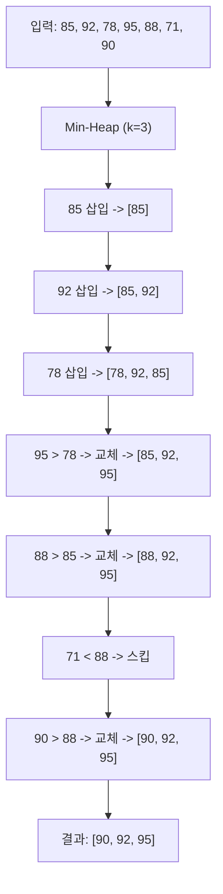
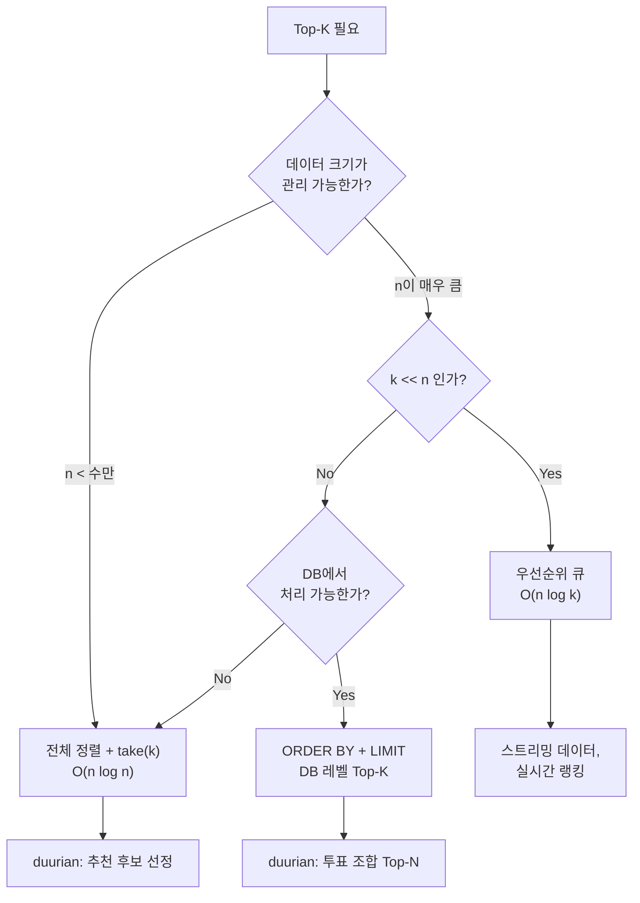
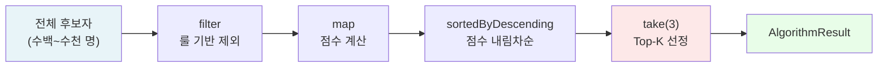

> **[시리즈] 코딩 테스트 알고리즘, 실무에서 이렇게 쓴다 -- duurian-server 편**
>
> 1. [Combination -- 조합 생성](/posts/kotlin-algorithm-01-combination/)
> 2. [Score & Range -- 점수 계산과 구간 매핑](/posts/kotlin-algorithm-02-score-range/)
> 3. [Set 연산 -- 교집합, 합집합, 차집합](/posts/kotlin-algorithm-03-set-operations/)
> 4. [Streak -- 연속 일수 계산](/posts/kotlin-algorithm-04-streak/)
> 5. **[Top-K -- 상위 N개 선정](/posts/kotlin-algorithm-05-top-k/)**
> 6. [GroupBy -- 그룹핑과 분류](/posts/kotlin-algorithm-06-groupby/)
> 7. [Rule Pattern -- 조건부 필터링과 규칙 체인](/posts/kotlin-algorithm-07-rule-pattern/)
> 8. [충돌 감지 -- 중복 방지와 양방향 확인](/posts/kotlin-algorithm-08-conflict-detection/)

---

## 1. 들어가며

코딩 테스트에서 "K번째 큰 수를 구하라", "상위 N개를 출력하라"는 문제를 만나면 우선순위 큐(힙)나 QuickSelect를 떠올립니다. 하지만 실무에서 Top-K는 훨씬 다양한 형태로 등장합니다.

duurian-server에서는 다음과 같은 상황에서 Top-K 패턴이 사용됩니다.

- 추천 알고리즘에서 점수가 가장 높은 상위 3명의 후보를 선정
- 매칭 그룹 생성 시 가장 높은 점수를 받은 최적 조합 1개를 선택
- 일정 투표에서 가장 이른 시간의 조합 1개를 확정
- DB 레벨에서 투표 수 기준 상위 N개 조합을 조회

이 글에서는 Top-K 알고리즘의 이론적 기반부터 Kotlin에서 제공하는 다양한 정렬/선택 API, 그리고 duurian-server 실제 코드에서의 적용 패턴까지 상세하게 다루겠습니다.

---

## 2. 알고리즘 원리

### Top-K 문제 정의

n개의 원소가 있을 때, 특정 기준으로 상위(또는 하위) k개의 원소를 선택하는 문제입니다. 핵심은 **모든 원소의 완전한 정렬이 필요하지 않다**는 점입니다. k개만 정확히 선택하면 됩니다.

### 세 가지 접근법

| 접근법 | 시간 복잡도 | 공간 복잡도 | 특징 |
|--------|-----------|-----------|------|
| 전체 정렬 + Take | O(n log n) | O(n) | 구현 간단, 데이터 전체 정렬 |
| 우선순위 큐 (Min-Heap) | O(n log k) | O(k) | k가 n보다 훨씬 작을 때 유리 |
| QuickSelect | O(n) 평균 | O(1) | 순서 보장 안 됨, 최악 O(n^2) |

### 전체 정렬 + Take

가장 직관적인 방법입니다. 전체를 내림차순 정렬한 뒤 앞에서 k개를 잘라냅니다.

```
[85, 92, 78, 95, 88, 71, 90] -> 정렬 -> [95, 92, 90, 88, 85, 78, 71] -> take(3) -> [95, 92, 90]
```

### 우선순위 큐 (Min-Heap)

크기 k의 최소 힙을 유지하면서 순회합니다. 새 원소가 힙의 최솟값보다 크면 교체합니다.



### QuickSelect (Hoare's Selection)

QuickSort의 파티션 로직을 활용합니다. 피벗을 기준으로 분할한 뒤, k번째 원소가 포함된 쪽만 재귀합니다. 평균 O(n)이지만 실무에서는 정렬된 결과의 순서도 필요한 경우가 많아 잘 사용하지 않습니다.

### 실무에서의 선택 기준



duurian-server에서는 추천 후보가 수백~수천 명 수준이고, k=3이므로 **전체 정렬 + take** 방식이 충분합니다. 대신 Sequence를 활용하여 중간 리스트 생성을 최소화합니다.

---

## 3. Kotlin 구현 / 언어 특성

Kotlin은 Top-K 패턴을 위한 풍부한 표준 라이브러리 API를 제공합니다.

### sortedByDescending + take: 가장 기본적인 Top-K

```kotlin
val topK = candidates
    .sortedByDescending { it.score }
    .take(k)
```

단일 기준으로 내림차순 정렬 후 k개를 선택합니다. `sortedByDescending`은 `Comparable`을 구현하지 않는 객체에서도 lambda로 정렬 기준을 지정할 수 있습니다.

### sortedWith(compareBy) + take: 복합 정렬 기준

```kotlin
val topK = candidates
    .sortedWith(
        compareByDescending<Candidate> { it.score }
            .thenByDescending { it.suitabilityScore }
    )
    .take(k)
```

여러 기준을 체이닝할 때는 `compareBy`와 `thenBy`를 조합합니다. 첫 번째 기준이 같으면 두 번째 기준으로 비교하는 안정 정렬(stable sort)을 수행합니다.

### maxByOrNull / minWith: Top-1 특수 케이스

```kotlin
// 가장 높은 점수 1개 선택
val best = candidates.maxByOrNull { it.score }

// 복합 기준으로 가장 작은 1개 선택
val earliest = candidates.minWith(
    compareBy<Candidate> { it.date }
        .thenBy { it.time }
)
```

k=1인 경우는 정렬이 필요 없습니다. 한 번의 순회로 O(n)에 해결됩니다.

### Sequence를 활용한 lazy Top-K

```kotlin
val topK = candidates
    .asSequence()
    .filter { predicate(it) }
    .map { transform(it) }
    .sortedByDescending { it.score }
    .take(k)
    .toList()
```

`asSequence()`를 사용하면 filter와 map이 lazy하게 평가됩니다. 중간 리스트가 생성되지 않아 메모리 효율이 높습니다. 단, `sortedByDescending`은 전체 원소를 수집해야 하므로 이 지점에서 중간 리스트가 생성됩니다. 그럼에도 filter/map 단계에서의 중간 리스트 생성을 방지하는 효과가 있습니다.

### API 비교 정리

| API | 반환 타입 | 시간 복잡도 | 용도 |
|-----|---------|-----------|------|
| `sortedByDescending { } + take(k)` | `List<T>` | O(n log n) | 단일 기준 Top-K |
| `sortedWith(compareBy) + take(k)` | `List<T>` | O(n log n) | 복합 기준 Top-K |
| `maxByOrNull { }` | `T?` | O(n) | Top-1 (최대) |
| `minWith(comparator)` | `T` | O(n) | Top-1 (최소, 복합 기준) |
| `PriorityQueue` + 수동 관리 | `PriorityQueue<T>` | O(n log k) | 대용량 스트리밍 |

---

## 4. 실무 적용 사례

### 사례 1: BasicRecommendationAlgorithm -- Sequence + sortedByDescending + take

duurian의 추천 시스템에서 가장 핵심적인 Top-K 적용 사례입니다. 전체 후보자 중 점수가 가장 높은 상위 3명을 선정합니다.

**파일**: `core/.../recommendation/algorithm/BasicRecommendationAlgorithm.kt`

```kotlin
@Component
class BasicRecommendationAlgorithm(
    private val rules: List<RecommendationRule>,
    private val calculatorRegistry: ScoreCalculatorRegistry,
    private val reasonGenerator: ReasonTagGenerator
) : RecommendationAlgorithm {

    private val weightedCalculators = calculatorRegistry.getWeightedCalculators()

    override suspend fun recommend(
        targetUser: RecommendationTarget,
        candidates: List<RecommendationTarget>
    ): AlgorithmResult {

        val evaluatedCandidates = candidates
            .asSequence()
            // 1. 추천 제외 룰 적용
            .filter { candidate ->
                rules.all { rule -> rule.isEligible(targetUser, candidate) }
            }
            // 2. 점수 계산 및 추천 사유 생성
            .map { candidate ->
                evaluateCandidate(targetUser, candidate)
            }
            // 3. 점수 기준 내림차순 정렬
            .sortedByDescending { it.candidateInfo.score }
            .toList()

        // 4. Top-K 선정
        val topK = evaluatedCandidates.take(RecommendationConstants.TOP_K_CANDIDATES)

        return AlgorithmResult(
            candidates = topK.map { it.candidateInfo },
            recommendations = topK.map { it.recommendedProfile }
        )
    }
}
```

**파이프라인 흐름**:



**핵심 분석**:

- `asSequence()`를 사용하여 filter와 map 단계에서 중간 리스트 생성을 방지합니다. 후보자가 1000명이고 룰 필터링으로 300명이 제외된다면, eager evaluation에서는 1000개짜리 리스트 -> 700개짜리 리스트 -> 700개짜리 리스트 순으로 3개의 중간 리스트가 생성되지만, Sequence에서는 최종 `toList()` 시점에만 1개의 리스트가 생성됩니다.
- `TOP_K_CANDIDATES = 3`은 상수로 관리되어 있습니다. 향후 DB 기반 설정으로 전환할 수 있도록 `RecommendationConstants` 객체에서 분리되어 있습니다.
- `take(k)`는 이미 정렬된 리스트에서 앞에서 k개를 잘라내는 O(k) 연산입니다.

### 사례 2: ExplanatoryRecommendationAlgorithm -- compareByDescending + thenByDescending 복합 정렬

설명형 추천 알고리즘에서는 Basic 알고리즘의 Top-K 결과를 받아 OpenAI API로 설명을 생성한 뒤, 복합 기준으로 재정렬합니다.

**파일**: `core/.../recommendation/algorithm/ExplanatoryRecommendationAlgorithm.kt`

```kotlin
// 성공한 후보만 필터링 및 재정렬
val sortedSuccessResults = explanatoryResults
    .filter {
        it.explanation != null &&
        it.meta == null
    }
    .sortedWith(
        compareByDescending<RecommendationCandidateInfo> { it.score }
            .thenByDescending { it.explanation!!.suitabilityScore }
    )
```

**핵심 분석**:

- 1차 기준: 알고리즘 점수(`score`) 내림차순
- 2차 기준: AI가 평가한 적합도 점수(`suitabilityScore`) 내림차순
- `compareByDescending`과 `thenByDescending`을 체이닝하여 복합 `Comparator`를 구성합니다.
- 두 기준의 의미가 다르다는 점이 중요합니다. `score`는 규칙 기반 가중 점수이고, `suitabilityScore`는 AI가 프로필 텍스트를 분석하여 산출한 적합도입니다. 같은 점수대의 후보라면 AI 적합도가 높은 후보를 우선 노출합니다.

### 사례 3: DefaultMatchGroupGenerator -- maxByOrNull로 Top-1 선택

매칭 그룹 생성 시, 유효한 조합들 중 우선순위 점수가 가장 높은 **하나의** 최적 조합을 선택합니다.

**파일**: `core/.../match/generator/DefaultMatchGroupGenerator.kt`

```kotlin
while (remainingPairs.size >= requiredPairs) {
    val validGroups = remainingPairs
        .combinations(requiredPairs)
        .filter { conditionRuleEvaluator.isValid(it) }

    val bestGroupPairs = validGroups.maxByOrNull {
        priorityRuleEvaluator.calculateScore(it)
    } ?: break

    generatedGroups += MatchGroupTemplate.create(
        matchType = matchType,
        pairs = bestGroupPairs,
        matchingPoolId = poolId,
        createdAt = LocalDateTime.now()
    )
    remainingPairs.removeAll(bestGroupPairs)
}
```

**핵심 분석**:

- `maxByOrNull`은 Top-1의 특수 케이스입니다. 정렬 없이 단일 순회(O(n))로 최대값을 찾습니다.
- `?: break`로 null 안전성을 처리합니다. 유효한 조합이 없으면 루프를 종료합니다.
- 탐욕적(greedy) 접근법입니다. 매 반복에서 최적 조합을 선택하고, 사용된 페어를 제거한 뒤 남은 페어로 다시 조합을 시도합니다. 전역 최적해를 보장하지는 않지만, 실용적인 준최적해를 빠르게 도출합니다.
- `combinations(requiredPairs)`로 생성된 조합의 수는 C(n, r)이므로, 페어 수가 많아지면 조합 수가 급증할 수 있습니다. 하지만 매칭 타입별 페어 수가 제한되어 있어 실무에서는 문제가 되지 않습니다.

### 사례 4: chooseCombinationByEarliest -- minWith + compareBy.thenBy 복합 비교

일정 투표 확정 시, 모든 참가자가 동의한 조합이 여러 개인 경우 가장 이른 날짜/시간의 조합을 선택합니다.

**파일**: `core/.../match/service/ConfirmMatchGroupScheduleService.kt`

```kotlin
private fun chooseCombinationByEarliest(
    candidates: List<ScheduleVoteCombination>
): ScheduleVoteCombination {
    if (candidates.size == 1) return candidates.first()

    val dateIds = candidates.asSequence().map { it.dateOptionId }.distinct().toList()
    val timeIds = candidates.asSequence().map { it.timeOptionId }.distinct().toList()

    val dateMap: Map<Long, LocalDate> =
        queryScheduleDateOptionPort.findByIds(dateIds)
            .associate { it.id to it.value }
    val timeMap = queryScheduleTimeOptionPort.findByIds(timeIds)
        .associate { opt ->
            opt.id to (parsePmTimeOrNull(opt.value) ?: run {
                log.warn { "[MatchGroupSchedule] Time option parse failed ..." }
                LocalTime.MAX
            })
        }

    // 날짜 -> 시간 -> regionId 기준으로 가장 이른 조합
    return candidates.minWith(
        compareBy<ScheduleVoteCombination> { c -> dateMap[c.dateOptionId] ?: LocalDate.MAX }
            .thenBy { c -> timeMap[c.timeOptionId] ?: LocalTime.MAX }
            .thenBy { it.regionOptionId }
    )
}
```

**핵심 분석**:

- `minWith`는 `maxByOrNull`의 반대 버전으로, 복합 `Comparator`를 받아 최소값을 찾습니다.
- 3단계 비교 체인: 날짜(오름차순) -> 시간(오름차순) -> 지역 ID(오름차순)
- `LocalDate.MAX`와 `LocalTime.MAX`를 fallback 값으로 사용하여 데이터 누락 시 해당 조합이 후순위로 밀리도록 합니다.
- ID를 직접 비교하지 않고, ID에서 실제 날짜/시간 값을 조회한 Map을 만들어 비교합니다. 이는 ID의 순서가 실제 날짜/시간 순서와 다를 수 있기 때문입니다.
- `candidates.size == 1`일 때 early return하여 불필요한 DB 조회를 방지합니다.

### 사례 5: DB 레벨 Top-N -- ORDER BY + LIMIT

투표 결과 화면에서 사용자에게 가장 인기 있는 상위 N개 조합을 보여줄 때, SQL 레벨에서 Top-N을 처리합니다.

**파일**: `infrastructure/.../schedule/scheduleVote/ScheduleVoteJpaRepository.kt`

```sql
SELECT
    date_option_id AS dateOptionId,
    time_option_id AS timeOptionId,
    region_option_id AS regionOptionId
FROM schedule_votes
WHERE schedule_proposal_id = :scheduleProposalId
GROUP BY date_option_id, time_option_id, region_option_id
ORDER BY COUNT(*) DESC, date_option_id ASC, time_option_id ASC, region_option_id ASC
LIMIT :top
```

**호출부** (`core/.../schedule/scheduleVote/service/GetTopScheduleVoteCombinationsService.kt`):

```kotlin
override fun getTopCombinations(
    command: GetTopScheduleVoteCombinationCommand
): List<ScheduleVoteTopCombinationResult> {
    val combinations = queryScheduleVotePort.findTopVoteCombinations(
        command.scheduleProposalId, command.top
    )
    // ...
}
```

**핵심 분석**:

- `GROUP BY` + `COUNT(*)` + `ORDER BY ... DESC` + `LIMIT`으로 DB 엔진이 Top-N을 처리합니다.
- 애플리케이션으로 전체 데이터를 가져와서 정렬하는 것보다 네트워크 전송량과 메모리 사용량이 크게 줄어듭니다.
- PostgreSQL은 `LIMIT` 절이 있으면 전체 정렬 대신 Top-N Sort 최적화를 적용할 수 있습니다.
- 동점 처리(tiebreaker)로 `date_option_id ASC, time_option_id ASC, region_option_id ASC`를 추가하여 결과의 결정성을 보장합니다.

### 사례 6: GenerateRecommendationService -- take로 최종 추천 수 제한

추천 결과를 저장할 때, 설정값(`maxRecommendations`)으로 최종 추천 수를 제한합니다.

**파일**: `core/.../recommendation/service/GenerateRecommendationService.kt`

```kotlin
val maxCount = recommendationSettings.maxRecommendations  // 기본값: 3

// ...

val finalRecommendations = algorithmResult.recommendations.take(maxCount)

val recommendations = finalRecommendations.map { recommendedProfile ->
    Recommendation.create(
        recommendationGroupId = savedGroup.id,
        targetUserId = targetUser.user.id,
        recommendedProfile = recommendedProfile,
        recommendedAt = recommendedAt,
        algorithmCode = algorithmCode,
        now = now
    )
}
```

**핵심 분석**:

- 알고리즘 레벨의 `TOP_K_CANDIDATES`(상수)와 서비스 레벨의 `maxRecommendations`(설정값)가 분리되어 있습니다.
- 알고리즘은 상위 3명의 후보를 선정하지만, 비즈니스 설정에 따라 실제 노출 수는 다를 수 있습니다(예: 프리미엄 사용자에게 5개 노출).
- `take(k)`는 k가 리스트 크기보다 크면 전체 리스트를 반환하므로 안전합니다. 별도의 경계 검사가 필요 없습니다.

### 사례 7: MatchType.priorityOrder -- enum 우선순위 정렬

매칭 타입의 우선순위 순서를 반환하는 메서드입니다.

**파일**: `domain/.../match/model/matchGroups/MatchType.kt`

```kotlin
enum class MatchType(
    val requiredCouples: Int,
    val priority: Int,
    val description: String
) {
    M3F3(3, 1, "3:3 매칭"),
    M2F2(2, 2, "2:2 매칭"),
    M1F1(1, 3, "1:1 매칭");

    companion object {
        fun priorityOrder(): List<MatchType> {
            return entries.sortedByDescending { it.priority }
        }
    }

    fun nextLowerPriority(): MatchType? {
        return priorityOrder()
            .dropWhile { it != this }
            .drop(1)
            .firstOrNull()
    }
}
```

**핵심 분석**:

- `entries.sortedByDescending { it.priority }`로 enum 전체를 우선순위 내림차순으로 정렬합니다.
- 결과: `[M1F1(3), M2F2(2), M3F3(1)]` -- 1:1 매칭이 가장 높은 우선순위
- `nextLowerPriority()`는 현재 타입의 다음 우선순위를 반환합니다. `dropWhile`로 현재 타입까지 건너뛰고, `drop(1)`로 현재 타입을 제거한 뒤, `firstOrNull`로 다음 타입을 가져옵니다. 이는 Top-K가 아닌 "다음 순위 1개 찾기" 패턴이지만, 정렬된 시퀀스에서 위치 기반으로 탐색한다는 점에서 관련이 있습니다.

---

## 5. 시간 복잡도와 실무 주의점

### 시간 복잡도 정리

| 사례 | 연산 | 복잡도 | n의 크기 |
|------|------|--------|---------|
| BasicRecommendation | sort + take(3) | O(n log n) | 수백~수천 |
| ExplanatoryRecommendation | sort(k개) | O(k log k) | k = 3 |
| DefaultMatchGroupGenerator | maxByOrNull | O(m), m = 조합 수 | C(n, r) |
| chooseCombinationByEarliest | minWith | O(c), c = 합의 조합 수 | 수~수십 |
| DB Top-N | DB ORDER BY + LIMIT | DB 엔진 최적화 | 테이블 전체 |
| take(maxCount) | slice | O(k) | k = 3 |
| priorityOrder | sort(3개) | O(1) | 3 (enum 크기) |

### 실무 주의점

**1. Sequence + sort의 함정**

```kotlin
// Sequence의 sortedByDescending은 내부적으로 toMutableList()를 호출한다
candidates.asSequence()
    .filter { ... }
    .map { ... }
    .sortedByDescending { it.score }  // 여기서 전체 수집이 발생
    .take(k)
    .toList()
```

Sequence에서 `sortedByDescending`은 전체 원소를 수집해야 하므로 완전한 lazy evaluation이 아닙니다. 하지만 filter/map 단계의 중간 리스트 생성은 방지하므로, 전혀 Sequence를 사용하지 않는 것보다는 메모리 효율이 좋습니다.

**2. take의 안전성**

```kotlin
// take(k)는 k > size일 때 전체 리스트를 반환한다 (예외 발생 없음)
listOf(1, 2).take(5)  // [1, 2]

// 반면, subList는 범위 초과 시 IndexOutOfBoundsException을 던진다
listOf(1, 2).subList(0, 5)  // 예외 발생
```

따라서 Top-K에서는 항상 `take`를 사용하는 것이 안전합니다.

**3. 안정 정렬(Stable Sort) 보장**

Kotlin의 `sortedBy`, `sortedWith` 등은 `java.util.Arrays.sort`를 사용하며, 이는 TimSort 기반의 안정 정렬입니다. 같은 점수의 후보자들 사이에서 원래 순서가 보존됩니다. 이는 특히 `thenBy`로 2차 기준을 체이닝할 때 중요합니다.

**4. DB Top-N vs 애플리케이션 Top-K 선택 기준**

| 기준 | DB Top-N | App Top-K |
|------|----------|-----------|
| 데이터 크기 | 수만 건 이상 | 수천 건 이하 |
| 정렬 기준 | DB 컬럼 기반 | 복잡한 비즈니스 로직 |
| 네트워크 비용 | 낮음 (N건만 전송) | 높음 (전체 전송) |
| 유연성 | SQL 제약 | 자유로운 로직 |
| 인덱스 활용 | 가능 | 불가 |

duurian에서는 단순한 카운트 기반 정렬은 DB에서, 가중치 점수나 규칙 기반 필터링이 필요한 정렬은 애플리케이션에서 처리합니다.

**5. maxByOrNull의 null 처리**

```kotlin
// 빈 리스트에서 maxByOrNull은 null을 반환한다
val best = emptyList<Candidate>().maxByOrNull { it.score }  // null

// null 처리 필수
val best = validGroups.maxByOrNull { calculateScore(it) } ?: break
```

`maxBy`(deprecated)와 달리 `maxByOrNull`은 빈 컬렉션에서 예외 대신 null을 반환하므로, 항상 null 처리를 해야 합니다.

---

## 6. 관련 코딩 테스트 유형

### 문제 1: 프로그래머스 -- 가장 큰 수

문자열 배열을 이어 붙여 가장 큰 수를 만드는 문제입니다. `sortedWith`로 커스텀 비교기를 작성하는 패턴입니다.

```kotlin
fun solution(numbers: IntArray): String {
    val result = numbers.map { it.toString() }
        .sortedWith { a, b -> (b + a).compareTo(a + b) }
        .joinToString("")
    return if (result.startsWith("0")) "0" else result
}
```

실무 연결: `ExplanatoryRecommendationAlgorithm`의 `sortedWith(compareByDescending { ... }.thenByDescending { ... })`

### 문제 2: 백준 11004 -- K번째 수

n개의 수 중 k번째로 작은 수를 찾는 문제입니다. 전체 정렬 또는 QuickSelect를 활용합니다.

```kotlin
fun main() {
    val (n, k) = readLine()!!.split(" ").map { it.toInt() }
    val numbers = readLine()!!.split(" ").map { it.toInt() }
    println(numbers.sorted()[k - 1])
}
```

실무 연결: `BasicRecommendationAlgorithm`의 `sortedByDescending + take`

### 문제 3: 프로그래머스 -- 디스크 컨트롤러

SJF(Shortest Job First) 스케줄링 문제입니다. 우선순위 큐로 현재 실행 가능한 작업 중 소요 시간이 가장 짧은 작업을 선택합니다.

```kotlin
import java.util.PriorityQueue

fun solution(jobs: Array<IntArray>): Int {
    val sortedJobs = jobs.sortedBy { it[0] }
    val pq = PriorityQueue<IntArray>(compareBy { it[1] })
    var time = 0; var total = 0; var idx = 0; var count = 0

    while (count < jobs.size) {
        while (idx < sortedJobs.size && sortedJobs[idx][0] <= time) {
            pq.offer(sortedJobs[idx++])
        }
        if (pq.isEmpty()) {
            time = sortedJobs[idx][0]
        } else {
            val job = pq.poll()
            time += job[1]
            total += time - job[0]
            count++
        }
    }
    return total / jobs.size
}
```

실무 연결: 우선순위 큐 패턴은 실시간 처리량이 많은 시스템에서의 Top-K에 활용될 수 있습니다.

### 문제 4: 백준 1927 -- 최소 힙

최소 힙 자료구조를 직접 구현하거나 `PriorityQueue`를 활용하는 문제입니다.

```kotlin
import java.util.PriorityQueue

fun main() {
    val n = readLine()!!.toInt()
    val pq = PriorityQueue<Int>()
    val sb = StringBuilder()
    repeat(n) {
        val x = readLine()!!.toInt()
        if (x == 0) sb.appendLine(if (pq.isEmpty()) 0 else pq.poll())
        else pq.offer(x)
    }
    print(sb)
}
```

실무 연결: 대용량 데이터에서 k개 Min-Heap을 유지하는 Top-K 패턴의 기반 자료구조입니다.

### 문제 5: 프로그래머스 -- 베스트 앨범

장르별 Top-2 곡을 선정하는 문제입니다. groupBy + sortedByDescending + take의 조합입니다.

```kotlin
fun solution(genres: Array<String>, plays: IntArray): IntArray {
    val songs = genres.indices.map { Triple(it, genres[it], plays[it]) }
    val genreOrder = songs.groupBy { it.second }
        .mapValues { (_, v) -> v.sumOf { it.third } }
        .entries.sortedByDescending { it.value }
        .map { it.key }

    return genreOrder.flatMap { genre ->
        songs.filter { it.second == genre }
            .sortedByDescending { it.third }
            .take(2)
            .map { it.first }
    }.toIntArray()
}
```

실무 연결: `BasicRecommendationAlgorithm`의 필터 -> 정렬 -> take 파이프라인과 동일한 구조입니다.

---

## 7. 정리

### 요약 테이블

| 사례 | 패턴 | Kotlin API | 복잡도 | 비고 |
|------|------|-----------|--------|------|
| 추천 후보 Top-3 선정 | 전체 정렬 + Take | `asSequence().sortedByDescending().take(k)` | O(n log n) | Sequence로 중간 리스트 방지 |
| 설명형 추천 재정렬 | 복합 정렬 + Take | `sortedWith(compareByDescending.thenByDescending)` | O(k log k) | 2차 기준으로 AI 적합도 반영 |
| 최적 매칭 조합 선택 | Top-1 (최대) | `maxByOrNull { }` | O(n) | 정렬 없이 단일 순회 |
| 가장 이른 일정 확정 | Top-1 (최소, 복합) | `minWith(compareBy.thenBy.thenBy)` | O(n) | 3단계 복합 비교기 |
| 투표 인기 Top-N | DB 레벨 Top-N | `ORDER BY COUNT(*) DESC LIMIT :top` | DB 최적화 | 네트워크 비용 최소화 |
| 최종 추천 수 제한 | Take | `take(maxCount)` | O(k) | 설정값으로 유연한 제한 |
| enum 우선순위 정렬 | 전체 정렬 | `entries.sortedByDescending { it.priority }` | O(1) | 고정 크기 enum |

### 핵심 포인트

1. **실무 Top-K는 대부분 전체 정렬 + take로 충분합니다.** 데이터 크기가 수천 건 이하이고, k가 작으며, 정렬된 순서 자체가 필요한 경우가 많습니다.

2. **Sequence를 활용하면 파이프라인 중간 단계의 메모리 낭비를 줄일 수 있습니다.** 단, sort 시점에서 전체 수집이 발생하므로 완전한 lazy는 아닙니다.

3. **Top-1은 maxByOrNull/minWith로 O(n)에 해결합니다.** 정렬이 불필요한 케이스를 구분하면 성능을 개선할 수 있습니다.

4. **복합 정렬 기준은 compareBy/thenBy 체이닝으로 가독성 있게 표현합니다.** 람다 내에서 null 처리를 위해 `?: MAX_VALUE` 패턴을 활용합니다.

5. **대용량 데이터의 Top-N은 DB 레벨에서 처리합니다.** `ORDER BY + LIMIT`은 DB 엔진의 인덱스와 Top-N Sort 최적화를 활용할 수 있습니다.

6. **알고리즘 상수와 비즈니스 설정을 분리합니다.** `TOP_K_CANDIDATES`(알고리즘 레벨)와 `maxRecommendations`(서비스 레벨)의 분리는 각 레이어의 책임을 명확히 합니다.

---

*이전 글: [Streak -- 연속 일수 계산](/posts/kotlin-algorithm-04-streak/)*

*다음 글: [GroupBy -- 그룹핑과 분류](/posts/kotlin-algorithm-06-groupby/)에서는 Kotlin의 그룹핑 API가 날짜별 대화 집계, 벌크 데이터 조립, 반복 메시지 감지에서 어떻게 활용되는지 살펴보겠습니다.*

*정지원 (duurian 백엔드 개발자)*
