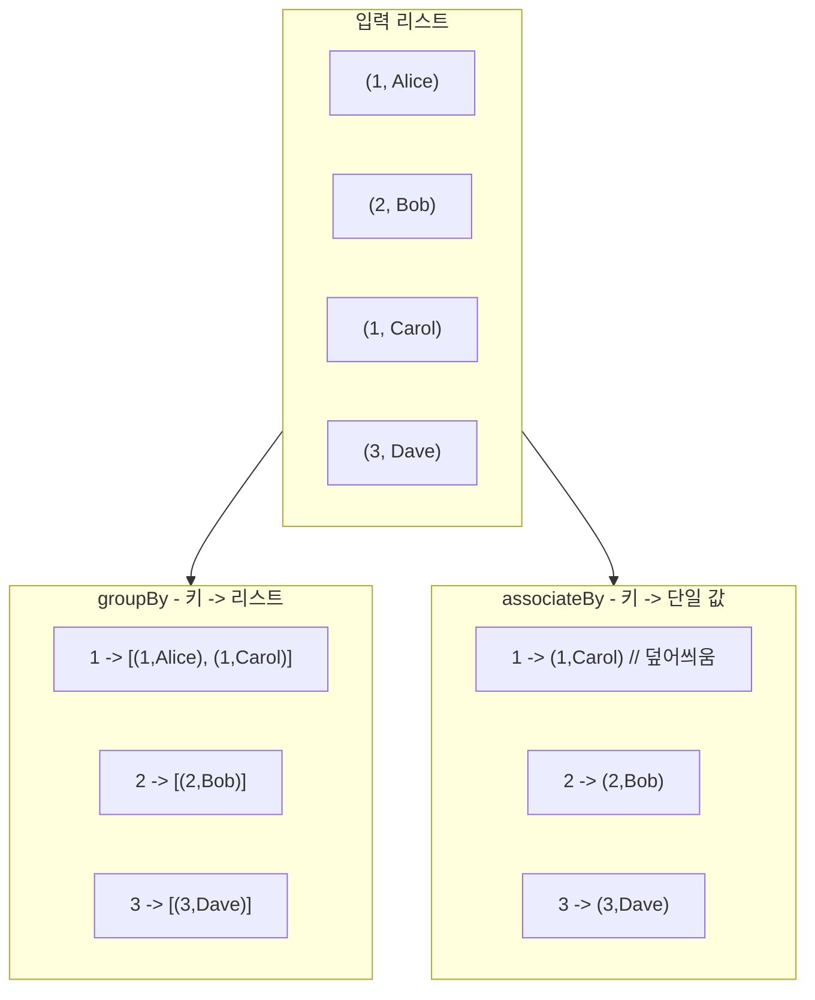
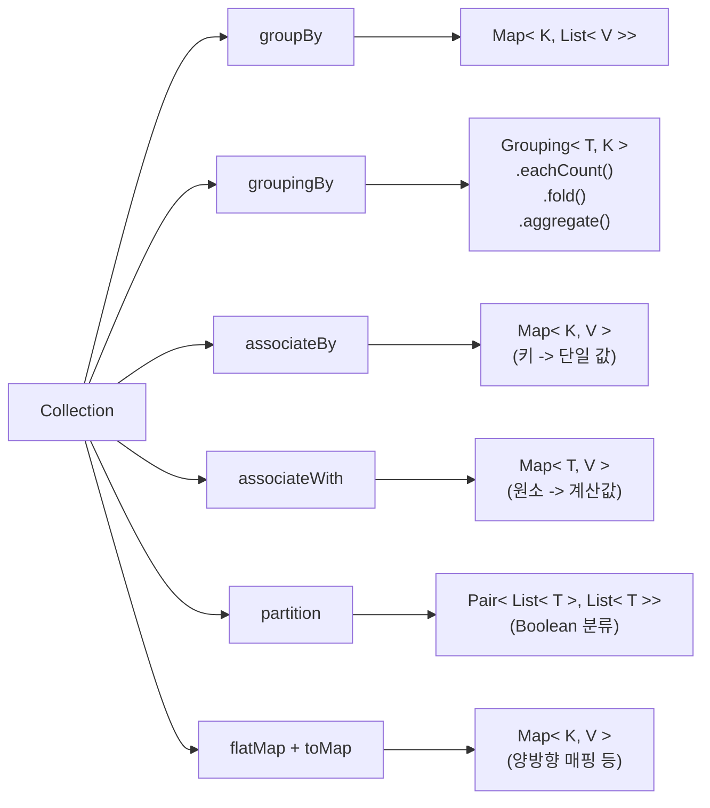
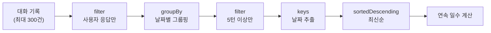
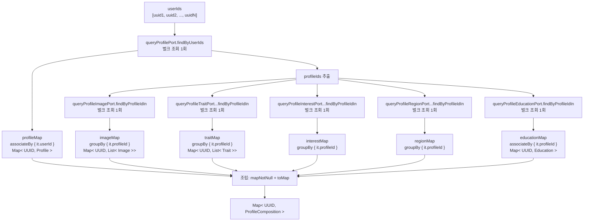
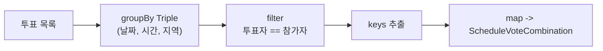
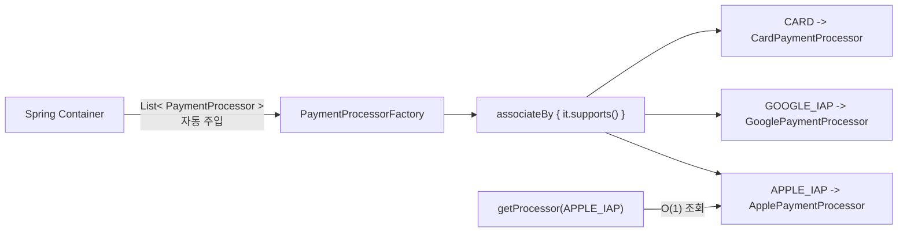

> **[시리즈] 코딩 테스트 알고리즘, 실무에서 이렇게 쓴다 -- duurian-server 편**
>
> 1. [Combination -- 조합 생성](/posts/kotlin-algorithm-01-combination/)
> 2. [Score & Range -- 점수 계산과 구간 매핑](/posts/kotlin-algorithm-02-score-range/)
> 3. [Set 연산 -- 교집합, 합집합, 차집합](/posts/kotlin-algorithm-03-set-operations/)
> 4. [Streak -- 연속 일수 계산](/posts/kotlin-algorithm-04-streak/)
> 5. [Top-K -- 상위 N개 선정](/posts/kotlin-algorithm-05-top-k/)
> 6. **[GroupBy -- 그룹핑과 분류](/posts/kotlin-algorithm-06-groupby/)**
> 7. [Rule Pattern -- 조건부 필터링과 규칙 체인](/posts/kotlin-algorithm-07-rule-pattern/)
> 8. [충돌 감지 -- 중복 방지와 양방향 확인](/posts/kotlin-algorithm-08-conflict-detection/)

---

## 1. 들어가며

코딩 테스트에서 "해시맵을 활용하라"는 힌트가 나오면 대부분 그룹핑이나 빈도 카운팅 문제입니다. 입력 데이터를 특정 키로 묶고, 그룹별로 집계하거나 필터링하는 것이 핵심입니다.

실무에서는 이 패턴이 더욱 다양하게 확장됩니다. duurian-server에서는 다음과 같은 상황에서 그룹핑이 사용됩니다.

- 날짜별로 대화를 묶어 연속 대화 일수를 계산
- 수백 명의 프로필을 벌크 조회하여 사용자별로 조립
- 투표 데이터를 (날짜, 시간, 지역) 조합별로 묶어 전원 합의 여부를 판별
- 메시지 내용별로 묶어 반복 메시지를 감지
- 결제 수단별로 프로세서를 매핑하는 전략 팩토리
- 이미지 타입별로 프로필 이미지와 취향 이미지를 분류

이 글에서는 Kotlin이 제공하는 `groupBy`, `associateBy`, `associateWith`, `partition` 등 그룹핑 API의 차이를 명확히 하고, duurian-server 실제 코드에서의 적용 패턴을 상세히 분석하겠습니다.

---

## 2. 알고리즘 원리

### 그룹핑의 본질

그룹핑은 n개의 원소를 특정 키 함수에 따라 분류하는 연산입니다. 해시맵을 기반으로 동작하며, 시간 복잡도는 O(n)입니다.

```
입력: [("Alice", "A"), ("Bob", "B"), ("Carol", "A"), ("Dave", "B"), ("Eve", "A")]
키: 두 번째 원소 (그룹)

결과: {
    "A" -> [("Alice","A"), ("Carol","A"), ("Eve","A")],
    "B" -> [("Bob","B"), ("Dave","B")]
}
```

### 그룹핑 vs 연관(Association)의 차이



- **groupBy**: 하나의 키에 여러 값이 매핑됩니다 -> `Map<K, List<V>>`
- **associateBy**: 하나의 키에 하나의 값만 매핑됩니다 -> `Map<K, V>` (중복 키 시 마지막 값으로 덮어씌움)

### Kotlin 그룹핑 API 전체 지도



### API 비교 테이블

| API | 시그니처 | 반환 타입 | 키 중복 시 | 용도 |
|-----|---------|----------|-----------|------|
| `groupBy` | `(T) -> K` | `Map<K, List<T>>` | 리스트에 누적 | 1:N 그룹핑 |
| `groupBy` (2인자) | `(T) -> K, (T) -> V` | `Map<K, List<V>>` | 리스트에 누적 | 1:N 그룹핑 + 값 변환 |
| `groupingBy` | `(T) -> K` | `Grouping<T, K>` | fold/aggregate로 처리 | 집계 연산 |
| `associateBy` | `(T) -> K` | `Map<K, T>` | 마지막 값으로 덮어씌움 | 1:1 인덱싱 |
| `associateWith` | `(T) -> V` | `Map<T, V>` | 원소 자체가 키 | 원소별 계산값 매핑 |
| `partition` | `(T) -> Boolean` | `Pair<List<T>, List<T>>` | N/A | 이분 분류 |
| `associate` | `(T) -> Pair<K, V>` | `Map<K, V>` | 마지막 값으로 덮어씌움 | 자유형 매핑 |

---

## 3. Kotlin 구현 / 언어 특성

### groupBy: 1:N 그룹핑의 기본

```kotlin
val conversations = listOf(
    Conversation("2026-02-10", "Hello"),
    Conversation("2026-02-10", "Hi there"),
    Conversation("2026-02-11", "Good morning"),
)

val byDate: Map<String, List<Conversation>> = conversations.groupBy { it.date }
// {"2026-02-10" -> [Conversation(...), Conversation(...)], "2026-02-11" -> [Conversation(...)]}
```

키 함수가 반환하는 값이 같은 원소들이 하나의 리스트로 묶입니다. 내부적으로 `LinkedHashMap`을 사용하므로 삽입 순서가 보존됩니다.

### associateBy: 1:1 인덱싱

```kotlin
val users = listOf(User(id=1, name="Alice"), User(id=2, name="Bob"))
val userMap: Map<Int, User> = users.associateBy { it.id }
// {1 -> User(1, "Alice"), 2 -> User(2, "Bob")}
```

키가 유일할 것으로 보장될 때 사용합니다. 중복 키가 있으면 나중에 나오는 값으로 덮어씌워지므로 주의가 필요합니다.

### associateWith: 원소를 키로, 계산값을 값으로

```kotlin
val userIds = listOf(uuid1, uuid2, uuid3)
val rejectionMap: Map<UUID, List<UUID>> = userIds.associateWith { userId ->
    queryRecommendationPort.findRejectedUserIds(userId)
}
```

원소 자체가 키가 되고, lambda의 반환값이 값이 됩니다. `associateBy`와 방향이 반대라는 점에 주의합니다.

### partition: Boolean 기반 이분 분류

```kotlin
val (even, odd) = listOf(1, 2, 3, 4, 5).partition { it % 2 == 0 }
// even = [2, 4], odd = [1, 3, 5]
```

Kotlin의 구조 분해 선언(destructuring declaration)과 결합하면 매우 직관적인 코드가 됩니다.

### flatMap + toMap: 양방향 매핑

```kotlin
val pairs = listOf(Pair("A", "B"), Pair("C", "D"))
val bidirectionalMap = pairs.flatMap { (a, b) ->
    listOf(a to b, b to a)
}.toMap()
// {"A" -> "B", "B" -> "A", "C" -> "D", "D" -> "C"}
```

`groupBy`로는 표현하기 어려운 양방향 관계를 `flatMap + toMap`으로 구성할 수 있습니다.

### Kotlin만의 장점

**1. 구조 분해 선언 (Destructuring)**

```kotlin
val (tasteImages, profileImages) = allImages.partition { it.type == TASTE }
```

Pair의 first/second 대신 의미 있는 이름을 바로 부여할 수 있습니다.

**2. orEmpty() 안전 접근**

```kotlin
val images = imageMap[profileId].orEmpty()  // null이면 빈 리스트 반환
```

`Map<K, List<V>>`에서 키가 없을 때 null 대신 빈 리스트를 반환하여 NPE를 방지합니다.

**3. mapNotNull과의 조합**

```kotlin
userIds.mapNotNull { userId ->
    val profile = profileMap[userId] ?: return@mapNotNull null
    userId to ProfileComposition(profile = profile, ...)
}.toMap()
```

`mapNotNull`은 null을 반환하는 원소를 자동으로 제외합니다. 그룹핑 결과를 조합할 때 누락 데이터를 우아하게 처리할 수 있습니다.

---

## 4. 실무 적용 사례

### 사례 1: ConversationDaysCalculator -- groupBy + filter로 날짜별 완료 대화 집계

연속 대화 일수를 계산하기 위해, 대화 기록을 날짜별로 묶고 5턴 이상 완료한 날짜만 추출합니다.

**파일**: `core/.../conversation/conversation/service/ConversationDaysCalculator.kt`

```kotlin
fun calculateConsecutiveDays(userId: UUID): Int {
    val conversations = queryConversationPort.findByUserId(userId, MAX_CONVERSATIONS_FOR_STREAK)
    val completedDates = conversations
        .filter { !it.isAiModel && it.questionId == null }       // 사용자 응답만 추출
        .groupBy { convertUtcToSeoulDate(it.createdAt) }         // 날짜별 그룹핑
        .filter { (_, turns) -> turns.size >= REQUIRED_TURNS_FOR_COMPLETION }  // 5턴 이상만
        .keys                                                     // 완료된 날짜 집합
        .sortedDescending()                                       // 최신순 정렬

    if (completedDates.isEmpty()) return 0

    val today = LocalDate.now(SEOUL_ZONE)

    if (completedDates.first() != today && completedDates.first() != today.minusDays(1)) {
        return 0
    }

    var consecutiveDays = 1
    var currentDate = completedDates.first()

    for (i in 1 until completedDates.size) {
        val expectedPrevDate = currentDate.minusDays(1)
        if (completedDates[i] == expectedPrevDate) {
            consecutiveDays++
            currentDate = completedDates[i]
        } else {
            break
        }
    }

    return consecutiveDays
}
```

**핵심 분석**:

- `groupBy { convertUtcToSeoulDate(it.createdAt) }`: UTC로 저장된 시간을 KST 날짜로 변환하여 그룹핑합니다. 같은 날(한국 기준)에 발생한 대화가 하나의 그룹이 됩니다.
- `.filter { (_, turns) -> turns.size >= 5 }`: 그룹핑 결과의 Map에 대해 filter를 적용합니다. Map의 `filter`는 `(key, value)` 쌍을 받으므로, 구조 분해로 `turns`만 추출합니다.
- `.keys.sortedDescending()`: 완료된 날짜 목록을 최신순으로 정렬하여, 오늘부터 거슬러 올라가며 연속성을 확인합니다.
- 이 패턴은 "그룹핑 -> 그룹별 조건 필터 -> 키 추출"이라는 전형적인 집계 파이프라인입니다.



### 사례 2: ProfileCompositionFactory -- groupBy + associateBy로 N+1 문제 방지 벌크 조립

수백 명의 프로필 데이터를 벌크 조회하여 사용자별로 조립하는 패턴입니다. groupBy와 associateBy를 적절히 구분하여 사용합니다.

**파일**: `core/.../profile/profile/factory/ProfileCompositionFactory.kt`

```kotlin
fun createInBulk(userIds: List<UUID>): Map<UUID, ProfileComposition> {
    // 1. Profile 조회
    val profiles = queryProfilePort.findByUserIds(userIds)
    val profileMap = profiles.associateBy { it.userId }
    val profileIds = profiles.map { it.id }

    // 2. 각 컴포넌트 벌크 조회 (groupBy or associateBy)
    val jobMap = queryJobPort.findByIds(profiles.map { it.jobId }.distinct())
        .associateBy { it.id }

    val imageMap = queryProfileImagePort.findByProfileIdIn(profileIds)
        .groupBy { it.profileId }

    val traitMap = queryProfileTraitPort.findActiveTraitsByProfileIdIn(profileIds)
        .groupBy { it.profileId }

    val interestMap = queryProfileInterestPort.findActiveInterestsByProfileIdIn(profileIds)
        .groupBy { it.profileId }

    val regionMap = queryProfileRegionPort.findActiveRegionsByProfileIdIn(profileIds)
        .groupBy { it.profileId }

    val educationMap = queryProfileEducationPort.findByProfileIdIn(profileIds)
        .associateBy { it.profileId }

    // 3. 조립
    return userIds.mapNotNull { userId ->
        val profile = profileMap[userId] ?: return@mapNotNull null
        val profileId = profile.id

        val education = educationMap[profileId] ?: return@mapNotNull null

        userId to ProfileComposition(
            profile = profile,
            job = jobMap[profile.jobId],
            profileImageList = imageMap[profileId].orEmpty(),
            traitList = traitMap[profileId].orEmpty(),
            interestList = interestMap[profileId].orEmpty(),
            regionList = regionMap[profileId].orEmpty(),
            education = education
        )
    }.toMap()
}
```

**데이터 흐름 다이어그램**:



**핵심 분석**:

- **groupBy vs associateBy 선택 기준**: 1:N 관계(이미지, 특성, 관심사, 지역)에는 `groupBy`를, 1:1 관계(프로필, 교육, 직업)에는 `associateBy`를 사용합니다.
- **N+1 문제 방지**: 만약 `createInBulk` 대신 `create`를 N번 호출하면, 프로필 조회 N회 + 이미지 조회 N회 + ... = 최소 7N회의 쿼리가 발생합니다. 벌크 조회 + 그룹핑으로 총 7회의 쿼리로 줄입니다.
- **orEmpty() 패턴**: `imageMap[profileId].orEmpty()`는 해당 프로필에 이미지가 없을 때 null 대신 빈 리스트를 반환합니다. `Map<K, List<V>>`의 기본 동작인 `null` 반환을 안전하게 처리합니다.
- **mapNotNull + return@mapNotNull null**: 프로필이나 교육 정보가 없는 사용자는 결과에서 제외합니다. `filterNotNull`과 달리, 변환과 필터링을 동시에 수행합니다.
- **쿼리 횟수 비교**:

| 방식 | 쿼리 횟수 (N=100) |
|------|-------------------|
| 개별 조회 (N+1) | 700회 |
| 벌크 조회 + groupBy | 7회 |

### 사례 3: ConfirmMatchGroupScheduleService -- groupBy(Triple)로 복합 키 그룹핑

투표 데이터를 (날짜, 시간, 지역) 3차원 키로 그룹핑하여, 모든 참가자가 동의한 조합을 찾습니다.

**파일**: `core/.../match/service/ConfirmMatchGroupScheduleService.kt`

```kotlin
private fun findAllAgreedCombos(
    votes: List<ScheduleVote>,
    participants: Set<UUID>
): List<ScheduleVoteCombination> {
    return votes
        .groupBy { Triple(it.dateOptionId, it.timeOptionId, it.regionOptionId) }
        .filter { (_, vs) -> vs.map { it.userId }.toSet() == participants }
        .keys
        .map { (d, t, r) -> ScheduleVoteCombination(d, t, r) }
}
```

**핵심 분석**:

- `Triple(it.dateOptionId, it.timeOptionId, it.regionOptionId)`를 그룹핑 키로 사용합니다. Kotlin의 `Triple`은 `equals`와 `hashCode`가 자동 구현되어 있어 Map의 키로 사용할 수 있습니다.
- `.filter { (_, vs) -> vs.map { it.userId }.toSet() == participants }`: 그룹 내 투표자 집합이 전체 참가자 집합과 일치하는지 확인합니다. Set의 `==` 비교로 순서 무관 일치를 검사합니다(Set 연산 패턴).
- `.keys.map { (d, t, r) -> ... }`: Triple의 구조 분해로 각 컴포넌트를 추출하여 도메인 객체를 생성합니다.
- 이 패턴은 "다차원 그룹핑 -> 전원 합의 필터 -> 결과 추출"이라는 합의 탐색(consensus finding) 알고리즘입니다.



### 사례 4: LowQualityConversationDetector -- groupBy { it }으로 동일 값 빈도 분석

메시지 내용을 키로 그룹핑하여, 동일한 메시지가 3번 이상 반복되는지 감지합니다.

**파일**: `core/.../conversation/qualitycheck/service/LowQualityConversationDetector.kt`

```kotlin
fun check(userId: UUID, summaryContents: List<String>?): LowQualityCheckResult {
    val todayUtcRange = TimezoneConverter.calculateTimeRangeInUtc()
    val todayConversations = queryConversationPort.findAllByUserIdAndCreatedAtInRange(userId, todayUtcRange)

    val userMessages = todayConversations
        .filter { !it.isAiModel && it.questionId == null }
        .map { it.content }

    if (userMessages.isEmpty()) return LowQualityCheckResult(isLowQuality = false, reasons = emptyList())

    val reasons = mutableListOf<LowQualityReason>()

    // 조건 1: 모든 사용자 메시지 글자 수 5자 이하
    if (userMessages.all { it.length <= SHORT_MESSAGE_THRESHOLD }) {
        reasons.add(LowQualityReason.SHORT_MESSAGES)
    }

    // 조건 2: 동일 답변 3회 이상 반복
    if (userMessages.groupBy { it }.any { it.value.size >= REPEATED_MESSAGE_THRESHOLD }) {
        reasons.add(LowQualityReason.REPEATED_MESSAGES)
    }

    // 조건 3: 페르소나(요약) 미추출
    if (summaryContents != null && summaryContents.all { it.isBlank() }) {
        reasons.add(LowQualityReason.NO_PERSONA_EXTRACTED)
    }

    val isLowQuality = reasons.size >= LOW_QUALITY_CONDITION_THRESHOLD

    return LowQualityCheckResult(isLowQuality = isLowQuality, reasons = reasons)
}
```

**핵심 분석**:

- `userMessages.groupBy { it }`: **값 자체를 키**로 사용하는 특수 패턴입니다. 결과는 `Map<String, List<String>>`으로, 동일한 메시지가 몇 번 나왔는지 알 수 있습니다.
- `.any { it.value.size >= 3 }`: 어떤 메시지든 3번 이상 반복되면 조건 충족입니다.
- 이 패턴은 코딩 테스트의 "빈도 카운팅" 문제와 정확히 동일합니다. `groupBy { it }`은 `groupingBy { it }.eachCount()`로 대체할 수 있지만, 여기서는 빈도만 필요하므로 `any`와 결합하여 early termination의 이점을 가집니다.

```kotlin
// 동등한 표현 (eachCount 사용)
if (userMessages.groupingBy { it }.eachCount().any { it.value >= 3 }) {
    reasons.add(LowQualityReason.REPEATED_MESSAGES)
}
```

### 사례 5: PaymentProcessorFactory -- associateBy로 전략 팩토리 패턴

Spring의 `List<PaymentProcessor>` 자동 주입을 활용하여, 결제 수단별 프로세서 매핑을 구성합니다.

**파일**: `core/.../payment/factory/PaymentProcessorFactory.kt`

```kotlin
@Component
class PaymentProcessorFactory(
    processors: List<PaymentProcessor>
) {
    private val processorMap: Map<PaymentMethod, PaymentProcessor> =
        processors.associateBy { it.supports() }

    fun getProcessor(method: PaymentMethod): PaymentProcessor {
        return processorMap[method] ?: throw UnSupportedPaymentTypeException()
    }
}
```

**핵심 분석**:

- `processors.associateBy { it.supports() }`: 각 프로세서가 지원하는 결제 수단을 키로 하여 Map을 구성합니다.
- 이 패턴은 Strategy 패턴의 팩토리 구현입니다. `when` 분기문 대신 Map 기반 O(1) 조회로 전략을 선택합니다.
- Spring이 `List<PaymentProcessor>`를 자동 주입하므로, 새 결제 수단을 추가할 때 팩토리 코드를 수정할 필요가 없습니다. 새 `PaymentProcessor` 구현체를 `@Component`로 등록하면 자동으로 Map에 포함됩니다.
- `associateBy`를 사용한 이유: 하나의 결제 수단에 하나의 프로세서만 대응되는 1:1 관계이기 때문입니다.



### 사례 6: RejectedMatchRule -- associateWith로 거절 이력 맵

각 사용자 ID에 대해 거절한 상대방 ID 목록을 조회하여 매핑합니다.

**파일**: `core/.../match/rule/RejectedMatchRule.kt`

```kotlin
override fun isSatisfied(pairs: List<MatchingPair>): Boolean {
    if (pairs.size == 1) return true

    val allUserIds: Set<UUID> = pairs.flatMap { listOf(it.maleUserId, it.femaleUserId) }.toSet()

    val rejectionMap: Map<UUID, List<UUID>> = allUserIds.associateWith { userId ->
        queryRecommendationPort.findRejectedUserIds(userId)
    }

    return pairs.none { pair ->
        val maleRejections = rejectionMap[pair.maleUserId].orEmpty()
        val femaleRejections = rejectionMap[pair.femaleUserId].orEmpty()

        pair.femaleUserId in maleRejections || pair.maleUserId in femaleRejections
    }
}
```

**핵심 분석**:

- `allUserIds.associateWith { userId -> findRejectedUserIds(userId) }`: 원소(사용자 ID) 자체를 키로, 조회 결과를 값으로 매핑합니다.
- `associateBy`와의 차이: `associateBy`는 "리스트 원소에서 키를 추출"하고, `associateWith`는 "리스트 원소를 키로 사용하고 값을 계산"합니다.
- 미리 모든 사용자의 거절 이력을 조회하여 Map으로 캐싱한 뒤, 각 페어에 대해 O(1)로 확인합니다. 이 캐싱이 없으면 각 페어마다 DB 조회가 발생합니다.

### 사례 7: GetProfileService -- partition으로 이미지 타입 분류

프로필 이미지를 타입에 따라 취향 이미지와 프로필 이미지로 이분 분류합니다.

**파일**: `core/.../profile/profile/service/GetProfileService.kt`

```kotlin
val allProfileImages = queryProfileImagePort.findByProfileIdAndStatuses(
    profileComposition.profile.id,
    statuses = listOf(ProfileImageStatus.PENDING, ProfileImageStatus.APPROVED)
)
val (tasteImages, profileImages) = allProfileImages.partition { it.type == ProfileImageType.TASTE }
```

**핵심 분석**:

- `partition`은 Boolean 조건에 따라 리스트를 정확히 두 그룹으로 나눕니다.
- 구조 분해 선언으로 `Pair<List<T>, List<T>>`의 first와 second에 의미 있는 이름을 부여합니다.
- `first`가 조건을 만족하는 원소, `second`가 만족하지 않는 원소입니다.
- `groupBy { it.type }`으로도 같은 결과를 얻을 수 있지만, 정확히 두 가지 분류일 때는 `partition`이 더 의미적으로 명확합니다.

```kotlin
// groupBy로 같은 결과를 얻는 경우
val grouped = allProfileImages.groupBy { it.type }
val tasteImages = grouped[ProfileImageType.TASTE].orEmpty()
val profileImages = grouped[ProfileImageType.MAIN].orEmpty() +
                    grouped[ProfileImageType.SUB].orEmpty()
// partition이 훨씬 간결하다
```

### 사례 8: ConfirmMatchGroupScheduleService -- associateBy + flatMap.toMap으로 양방향 파트너 매핑

알림 발송을 위해 사용자별 파트너를 양방향으로 매핑합니다.

**파일**: `core/.../match/service/ConfirmMatchGroupScheduleService.kt`

```kotlin
private fun sendScheduleConfirmedNotifications(matchGroupId: Long) {
    val participatingUsers = queryMatchGroupUserPort.findUsersByGroupIdAndStatus(
        groupId = matchGroupId,
        status = MatchGroupUserStatus.PARTICIPATING
    )
    if (participatingUsers.isEmpty()) return

    val allUserIds = participatingUsers
        .flatMap { listOf(it.userId, it.pairedUserId) }
        .distinct()

    val users = queryUserPort.findByIdIn(allUserIds)
    val userById = users.associateBy { it.id }

    val userToPartnerMap = participatingUsers.flatMap { participating ->
        listOf(
            participating.userId to participating.pairedUserId,
            participating.pairedUserId to participating.userId
        )
    }.toMap()

    users.forEach { user ->
        val partnerId = userToPartnerMap[user.id]
        val partner = partnerId?.let { userById[it] }
        val partnerName = partner?.nickname.toString()
        // 알림 발송...
    }
}
```

**핵심 분석**:

- `users.associateBy { it.id }`: 사용자 목록을 ID 기반 Map으로 변환하여 O(1) 조회를 가능하게 합니다.
- `flatMap { listOf(a to b, b to a) }.toMap()`: 각 참가 관계를 양방향 쌍으로 확장한 뒤 Map으로 변환합니다. 결과: `{userA -> partnerB, partnerB -> userA, ...}`
- 두 개의 Map(`userById`, `userToPartnerMap`)을 조합하여 "사용자 ID -> 파트너 닉네임"을 O(1)에 해결합니다.
- `flatMap + toMap` 패턴은 `groupBy`와 달리 1:1 양방향 매핑에 적합합니다.

---

## 5. 시간 복잡도와 실무 주의점

### 시간 복잡도 정리

| 연산 | 복잡도 | 공간 복잡도 |
|------|--------|-----------|
| `groupBy` | O(n) | O(n) |
| `associateBy` | O(n) | O(n) |
| `associateWith` | O(n) | O(n) |
| `partition` | O(n) | O(n) |
| `groupBy + filter` | O(n + g), g = 그룹 수 | O(n) |
| Map 조회 (`map[key]`) | O(1) 평균 | O(1) |

모든 그룹핑 연산은 단일 순회 O(n)으로 완료됩니다. 핵심 성능 이점은 그룹핑 자체가 아니라, 그룹핑된 Map을 통한 **O(1) 조회**에 있습니다.

### 실무 주의점

**1. associateBy의 중복 키 경고**

```kotlin
val list = listOf(User(1, "Alice"), User(1, "Bob"))
val map = list.associateBy { it.id }
// map = {1 -> User(1, "Bob")}  -- Alice가 사라진다!
```

키의 유일성이 보장되지 않을 때는 `groupBy`를 사용해야 합니다. `associateBy`는 중복 키 시 경고 없이 마지막 값으로 덮어씌웁니다.

**2. groupBy의 메모리 사용량**

```kotlin
// 원본 리스트의 원소가 그룹별 리스트에 참조로 복사된다
val grouped = largeList.groupBy { it.category }
// 메모리: 원본 리스트 + 그룹별 리스트들의 참조 + Map 오버헤드
```

원본 리스트가 매우 크고 그룹 수가 많은 경우, `groupingBy`와 `fold`/`aggregate`를 사용하여 중간 리스트 생성 없이 바로 집계하는 것이 메모리 효율적입니다.

```kotlin
// groupBy + map 대신
val counts = items.groupBy { it.key }.mapValues { it.value.size }

// groupingBy + eachCount 사용 (중간 리스트 없음)
val counts = items.groupingBy { it.key }.eachCount()
```

**3. N+1 문제 해결 패턴**

```kotlin
// BAD: N+1 쿼리
userIds.map { userId ->
    val images = queryImagePort.findByUserId(userId)  // N번 호출
    userId to images
}

// GOOD: 벌크 조회 + groupBy
val allImages = queryImagePort.findByUserIdIn(userIds)  // 1번 호출
val imageMap = allImages.groupBy { it.userId }           // O(n) 그룹핑
userIds.map { userId ->
    userId to imageMap[userId].orEmpty()                 // O(1) 조회
}
```

이 패턴은 `ProfileCompositionFactory.createInBulk`에서 7개 테이블에 동시에 적용되어, 700번의 쿼리를 7번으로 줄입니다.

**4. Triple 키의 한계**

```kotlin
// Triple은 component1, component2, component3으로만 접근한다
val grouped = votes.groupBy { Triple(it.dateOptionId, it.timeOptionId, it.regionOptionId) }
```

3개를 초과하는 복합 키가 필요하면 data class를 정의하는 것이 가독성과 유지보수 면에서 좋습니다.

```kotlin
data class VoteCombinationKey(
    val dateOptionId: Long,
    val timeOptionId: Long,
    val regionOptionId: Long,
    val extraOptionId: Long
)

val grouped = votes.groupBy {
    VoteCombinationKey(it.dateOptionId, it.timeOptionId, it.regionOptionId, it.extraOptionId)
}
```

**5. partition vs groupBy 선택**

| 상황 | 선택 | 이유 |
|------|------|------|
| 정확히 2그룹 (Boolean 조건) | `partition` | 구조 분해로 직관적 |
| 2그룹 이상 가능 | `groupBy` | 확장성 |
| enum 타입별 분류 | `groupBy` | 모든 케이스 처리 |
| 성공/실패 분류 | `partition` | Boolean 의미 |

---

## 6. 관련 코딩 테스트 유형

### 문제 1: 프로그래머스 -- 완주하지 못한 선수

참가자 목록과 완주자 목록에서 완주하지 못한 한 명을 찾는 문제입니다. 빈도 카운팅의 기본입니다.

```kotlin
fun solution(participant: Array<String>, completion: Array<String>): String {
    val countMap = participant.groupingBy { it }.eachCount().toMutableMap()
    completion.forEach { countMap[it] = countMap[it]!! - 1 }
    return countMap.entries.first { it.value > 0 }.key
}
```

실무 연결: `LowQualityConversationDetector`의 `groupBy { it }` 빈도 분석

### 문제 2: 백준 10816 -- 숫자 카드 2

각 숫자가 몇 장 있는지 세는 문제입니다.

```kotlin
fun main() {
    val n = readLine()!!.toInt()
    val cards = readLine()!!.split(" ").map { it.toInt() }
    val countMap = cards.groupingBy { it }.eachCount()

    val m = readLine()!!.toInt()
    val queries = readLine()!!.split(" ").map { it.toInt() }
    println(queries.joinToString(" ") { (countMap[it] ?: 0).toString() })
}
```

실무 연결: `groupingBy { }.eachCount()`로 빈도 Map을 구성하고 O(1) 조회

### 문제 3: 프로그래머스 -- 의상

카테고리별 의상 수를 세고, 조합의 수를 구하는 문제입니다.

```kotlin
fun solution(clothes: Array<Array<String>>): Int {
    return clothes.groupBy { it[1] }
        .values
        .fold(1) { acc, list -> acc * (list.size + 1) } - 1
}
```

실무 연결: `groupBy`로 카테고리별 그룹핑 후 그룹별 집계 연산

### 문제 4: 백준 1620 -- 나는야 포켓몬마스터

이름으로 번호를, 번호로 이름을 찾는 양방향 조회 문제입니다.

```kotlin
fun main() {
    val (n, m) = readLine()!!.split(" ").map { it.toInt() }
    val nameToNum = mutableMapOf<String, Int>()
    val numToName = mutableMapOf<Int, String>()
    repeat(n) { i ->
        val name = readLine()!!
        nameToNum[name] = i + 1
        numToName[i + 1] = name
    }
    val sb = StringBuilder()
    repeat(m) {
        val query = readLine()!!
        val num = query.toIntOrNull()
        sb.appendLine(if (num != null) numToName[num] else nameToNum[query])
    }
    print(sb)
}
```

실무 연결: `associateBy { it.id }`와 `flatMap + toMap`으로 양방향 매핑 구성

### 문제 5: 프로그래머스 -- 베스트 앨범 (심화)

장르별 재생 수 합계로 정렬한 뒤, 장르별 Top-2를 선정하는 복합 문제입니다. groupBy + sortedByDescending + take의 조합입니다.

```kotlin
fun solution(genres: Array<String>, plays: IntArray): IntArray {
    val songs = genres.indices.map { Triple(it, genres[it], plays[it]) }

    val genreTotal = songs.groupBy { it.second }
        .mapValues { (_, v) -> v.sumOf { it.third } }

    return songs.groupBy { it.second }
        .entries
        .sortedByDescending { genreTotal[it.key] }
        .flatMap { (_, songs) ->
            songs.sortedByDescending { it.third }.take(2).map { it.first }
        }
        .toIntArray()
}
```

실무 연결: `ProfileCompositionFactory`의 groupBy + 조립 패턴과 Top-K의 take 패턴이 결합된 형태

---

## 7. 정리

### 요약 테이블

| 사례 | 패턴 | Kotlin API | 키 타입 | 용도 |
|------|------|-----------|---------|------|
| 날짜별 대화 집계 | groupBy + filter | `groupBy { date }.filter { size >= 5 }` | LocalDate | 연속 대화 일수 계산 |
| 벌크 프로필 조립 | groupBy + associateBy | `groupBy { profileId }` / `associateBy { profileId }` | UUID | N+1 방지, 1:N vs 1:1 구분 |
| 복합 키 투표 그룹핑 | groupBy(Triple) | `groupBy { Triple(d, t, r) }` | Triple | 전원 합의 조합 탐색 |
| 반복 메시지 감지 | groupBy(identity) | `groupBy { it }.any { size >= 3 }` | String | 빈도 기반 이상 감지 |
| 전략 팩토리 | associateBy | `associateBy { it.supports() }` | Enum | O(1) 전략 디스패치 |
| 거절 이력 매핑 | associateWith | `associateWith { findRejected(it) }` | UUID | 원소별 외부 데이터 매핑 |
| 이미지 타입 분류 | partition | `partition { it.type == TASTE }` | Boolean | 이분 분류 |
| 양방향 파트너 매핑 | flatMap + toMap | `flatMap { listOf(a to b, b to a) }.toMap()` | UUID | 양방향 관계 구성 |

### 핵심 포인트

1. **groupBy는 1:N, associateBy는 1:1입니다.** 데이터 관계에 따라 정확한 API를 선택하지 않으면 데이터 유실(associateBy 중복 키)이나 불필요한 메모리 사용(groupBy를 1:1에 사용)이 발생합니다.

2. **N+1 문제의 해결 공식은 "벌크 조회 + groupBy/associateBy + O(1) 조회"입니다.** `ProfileCompositionFactory`는 이 패턴의 교과서적 사례로, 7N번의 쿼리를 7번으로 줄입니다.

3. **groupBy { it }은 빈도 카운팅의 핵심 패턴입니다.** 코딩 테스트의 해시맵 문제 대부분이 이 패턴으로 귀결됩니다. 실무에서는 반복 메시지 감지, 중복 데이터 탐지 등에 활용됩니다.

4. **partition은 Boolean 분류에 최적화되어 있습니다.** 정확히 두 가지 분류일 때 `groupBy`보다 의미적으로 명확하고, Kotlin의 구조 분해 선언과 결합하면 가독성이 높습니다.

5. **flatMap + toMap으로 양방향 매핑을 구성할 수 있습니다.** `groupBy`로는 어려운 관계 역전이나 양방향 인덱싱에 유용합니다.

6. **orEmpty()는 그룹핑 결과 조회의 필수 안전 장치입니다.** `Map<K, List<V>>`에서 키가 없을 때 null 대신 빈 리스트를 반환하여, downstream 로직에서 null 처리를 제거합니다.

---

*이전 글: [Top-K -- 상위 N개 선정](/posts/kotlin-algorithm-05-top-k/)*

*다음 글: [Rule Pattern -- 조건부 필터링과 규칙 체인](/posts/kotlin-algorithm-07-rule-pattern/)에서는 Strategy + Chain of Responsibility 패턴이 추천 필터링, 매칭 조건 검증, 품질 감지에서 어떻게 활용되는지 살펴보겠습니다.*

*정지원 (duurian 백엔드 개발자)*
