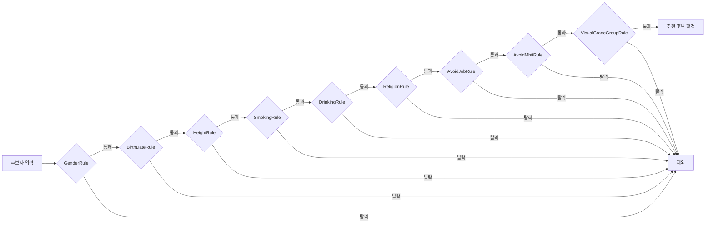
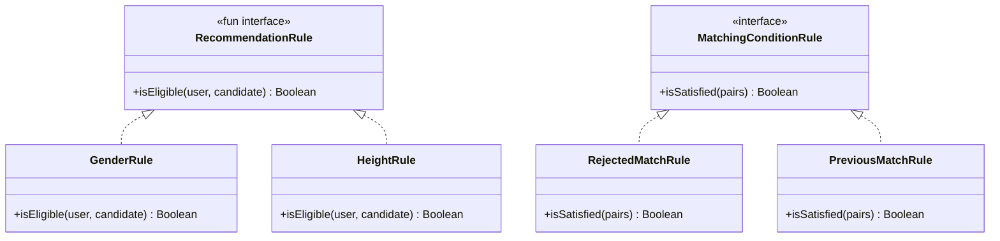

> **[시리즈] 코딩 테스트 알고리즘, 실무에서 이렇게 쓴다 -- duurian-server 편**
>
> 1. [Combination -- 조합 생성](/posts/kotlin-algorithm-01-combination/)
> 2. [Score & Range -- 점수 계산과 구간 매핑](/posts/kotlin-algorithm-02-score-range/)
> 3. [Set 연산 -- 교집합, 합집합, 차집합](/posts/kotlin-algorithm-03-set-operations/)
> 4. [Streak -- 연속 일수 계산](/posts/kotlin-algorithm-04-streak/)
> 5. [Top-K -- 상위 N개 선정](/posts/kotlin-algorithm-05-top-k/)
> 6. [GroupBy -- 그룹핑과 분류](/posts/kotlin-algorithm-06-groupby/)
> 7. **[Rule Pattern -- 조건부 필터링과 규칙 체인](/posts/kotlin-algorithm-07-rule-pattern/)**
> 8. [충돌 감지 -- 중복 방지와 양방향 확인](/posts/kotlin-algorithm-08-conflict-detection/)

---

## 1. 들어가며

코딩 테스트에서 "조건에 맞는 요소만 걸러내라"는 문제는 거의 매번 등장합니다. 단순한 `if` 문 하나로 해결되는 경우도 있지만, 조건이 5개, 10개로 늘어나면 이야기가 달라집니다. 조건들을 어떻게 구조화하느냐에 따라 코드의 유지보수성과 확장성이 결정됩니다.

duurian-server는 소셜 매칭 + AI 대화 서비스입니다. 사용자에게 이상형에 맞는 상대를 추천하려면 성별, 나이, 키, 흡연, 음주, 종교, 직업, MBTI, 외모 등급 등 수많은 조건을 동시에 평가해야 합니다. 이때 각 조건을 독립된 Rule 객체로 분리하고, 이를 체인으로 연결하는 패턴이 바로 **Rule Pattern**입니다.

이 글에서는 GoF의 Strategy 패턴과 Chain of Responsibility 패턴이 결합된 Rule Pattern이 실무에서 어떻게 활용되는지, duurian-server의 실제 코드를 기반으로 분석하겠습니다.

---

## 2. 알고리즘 원리

### 2.1 핵심 개념

Rule Pattern은 두 가지 GoF 디자인 패턴의 결합입니다.

| 패턴 | 역할 | 적용 |
|------|------|------|
| **Strategy** | 동일한 인터페이스를 구현하는 여러 알고리즘을 교체 가능하게 만듭니다 | 각 Rule이 독립된 Strategy |
| **Chain of Responsibility** | 요청을 처리할 수 있는 객체의 체인을 따라 전달합니다 | `rules.all { }` 로 체인 평가 |

핵심 아이디어는 단순합니다. **하나의 조건 = 하나의 클래스**, 그리고 **모든 조건을 순회하며 AND/OR로 결합**합니다.

```
규칙 체인 = Rule1 AND Rule2 AND Rule3 AND ... AND RuleN
```

### 2.2 AND 체인 vs OR 체인 vs Threshold 체인

실무에서 규칙을 결합하는 방식은 크게 세 가지로 나뉩니다.

| 결합 방식 | Kotlin 표현 | 의미 |
|-----------|-------------|------|
| **AND 체인** | `rules.all { it.check() }` | 모든 조건을 만족해야 통과 |
| **OR 체인** | `rules.any { it.check() }` | 하나라도 만족하면 통과 |
| **Threshold** | `rules.count { it.check() } >= N` | N개 이상 만족하면 통과 |

### 2.3 규칙 체인 흐름도



`rules.all { }` 을 사용하면 Kotlin의 **단축 평가(short-circuit evaluation)**가 적용됩니다. 첫 번째 Rule에서 `false`가 반환되면 나머지 Rule은 평가하지 않고 즉시 해당 후보를 탈락시킵니다. 이는 불필요한 연산을 줄이는 핵심적인 성능 최적화입니다.

---

## 3. Kotlin 구현 / 언어 특성

### 3.1 fun interface (SAM: Single Abstract Method)

Kotlin의 `fun interface`는 단일 추상 메서드를 가진 인터페이스를 선언하는 문법입니다. Java의 `@FunctionalInterface`와 동일한 역할을 하지만 Kotlin만의 간결한 표현이 가능합니다.

```kotlin
// duurian-server: domain/.../recommendation/rule/RecommendationRule.kt

fun interface RecommendationRule {
    fun isEligible(
        user: RecommendationTarget,
        candidate: RecommendationTarget
    ): Boolean
}
```

`fun` 키워드가 붙은 interface는 람다로 즉시 인스턴스화할 수 있습니다.

```kotlin
// fun interface가 있으면 이렇게 람다로 생성 가능
val customRule = RecommendationRule { user, candidate ->
    user.profileComposition.profile.gender != candidate.profileComposition.profile.gender
}

// fun interface가 없으면 object 표현식이 필요
val customRule = object : RecommendationRule {
    override fun isEligible(user: RecommendationTarget, candidate: RecommendationTarget): Boolean {
        return user.profileComposition.profile.gender != candidate.profileComposition.profile.gender
    }
}
```

### 3.2 fun interface vs 일반 interface 비교



duurian-server에서는 두 가지 인터페이스를 사용합니다.

| 인터페이스 | 종류 | 사용처 | 이유 |
|-----------|------|--------|------|
| `RecommendationRule` | `fun interface` | 추천 필터링 | 단일 메서드, 향후 람다 테스트 편의 |
| `MatchingConditionRule` | 일반 `interface` | 매칭 조건 검증 | 향후 메서드 확장 가능성 |

### 3.3 Spring의 List<Interface> 자동 주입

Spring은 특정 인터페이스의 모든 구현체를 `List`로 자동 주입해줍니다. 이것이 Rule Pattern의 핵심 인프라입니다.

```kotlin
@Component
class BasicRecommendationAlgorithm(
    private val rules: List<RecommendationRule>,  // 9개 구현체 자동 주입
    // ...
)
```

별도의 수동 등록 코드 없이, `@Component`가 붙은 `RecommendationRule` 구현체는 모두 이 `rules` 리스트에 포함됩니다. 새로운 규칙을 추가할 때 기존 코드를 수정할 필요가 없습니다. 이것이 바로 **OCP(개방-폐쇄 원칙)**의 실현입니다.

### 3.4 in 연산자와 Range

Kotlin의 `in` 연산자는 범위 검사를 직관적으로 만듭니다.

```kotlin
// Java 방식
if (height >= minHeight && height <= maxHeight)

// Kotlin 방식
if (height in minHeight..maxHeight)
```

`..` 연산자는 `ClosedRange`를 생성하고, `in`은 `contains()`를 호출합니다. 코딩 테스트에서도 범위 판별 문제에 바로 적용할 수 있습니다.

---

## 4. 실무 적용 사례

### 4.1 사례 1: RecommendationRule -- 9개 독립 규칙의 AND 체인

duurian의 추천 시스템은 사용자에게 조건에 맞는 상대를 추천합니다. 9개의 독립된 규칙이 모두 `true`를 반환해야만 추천 후보로 확정됩니다.

**인터페이스 정의 (domain 계층)**

```kotlin
// domain/src/.../recommendation/rule/RecommendationRule.kt
fun interface RecommendationRule {
    fun isEligible(
        user: RecommendationTarget,
        candidate: RecommendationTarget
    ): Boolean
}
```

**구현체 예시 -- GenderRule (가장 단순한 규칙)**

```kotlin
// core/src/.../recommendation/rule/GenderRule.kt
@Component
class GenderRule : RecommendationRule {
    override fun isEligible(
        user: RecommendationTarget,
        candidate: RecommendationTarget
    ): Boolean {
        return user.profileComposition.profile.gender != candidate.profileComposition.profile.gender
    }
}
```

성별이 다른 후보만 통과시킵니다. 한 줄짜리 로직이지만, 독립된 클래스로 분리함으로써 단위 테스트가 용이하고 다른 규칙에 영향을 주지 않습니다.

**구현체 예시 -- HeightRule (비즈니스 예외를 포함하는 규칙)**

```kotlin
// core/src/.../recommendation/rule/HeightRule.kt
@Component
class HeightRule : RecommendationRule {
    override fun isEligible(
        user: RecommendationTarget,
        candidate: RecommendationTarget
    ): Boolean {
        val height = candidate.profileComposition.profile.height
        val pref = user.preferenceComposition.preference
        val userVisualGrade = user.profileComposition.profile.visualGrade
        val candidateVisualGrade = candidate.profileComposition.profile.visualGrade

        var (minHeight, maxHeight) = listOf(pref.minHeight, pref.maxHeight).sorted()

        val isHigherOrEqualGrade = userVisualGrade != null &&
            candidateVisualGrade != null &&
            candidateVisualGrade.isEqualOrHigherThan(userVisualGrade)
        if (isHigherOrEqualGrade) {
            minHeight = kotlin.math.max(minHeight - 2, 0) // 외모 등급이 높으면 2cm 허용
        }

        return height in minHeight..maxHeight
    }
}
```

여기서 주목할 점은 **비즈니스 예외 처리**입니다. 단순한 키 범위 비교가 아니라, 후보자의 외모 등급이 사용자보다 같거나 높을 경우 최소 키 기준을 2cm 완화합니다. 이러한 비즈니스 로직이 독립된 Rule 내에 캡슐화되어 있으므로, 변경 시 HeightRule.kt 파일만 수정하면 됩니다.

**구현체 예시 -- SmokingRule (회피 목록 패턴)**

```kotlin
// core/src/.../recommendation/rule/SmokingRule.kt
@Component
class SmokingRule : RecommendationRule {
    override fun isEligible(
        user: RecommendationTarget,
        candidate: RecommendationTarget
    ): Boolean {
        val avoided = setOfNotNull(user.preferenceComposition.preferenceSmoking?.smoking)
        return avoided.isEmpty() || candidate.profileComposition.profile.smoking !in avoided
    }
}
```

SmokingRule, DrinkingRule, ReligionRule, AvoidJobRule, AvoidMbtiRule은 모두 같은 패턴을 따릅니다: **회피 목록이 비어 있으면 모두 허용, 회피 목록에 포함되면 탈락**. 패턴이 동일하더라도 각각 독립된 클래스로 분리하는 것이 규칙 관리 측면에서 유리합니다.

**구현체 예시 -- VisualGradeGroupRule (그룹 분류 규칙)**

```kotlin
// core/src/.../recommendation/rule/VisualGradeGroupRule.kt
@Component
class VisualGradeGroupRule : RecommendationRule {

    private val highGradeGroup = setOf(VisualGrade.A, VisualGrade.B, VisualGrade.C)
    private val lowGradeGroup = setOf(VisualGrade.D, VisualGrade.E)

    override fun isEligible(
        user: RecommendationTarget,
        candidate: RecommendationTarget
    ): Boolean {
        val userGrade = user.profileComposition.profile.visualGrade ?: return false
        val candidateGrade = candidate.profileComposition.profile.visualGrade ?: return false

        return when (userGrade) {
            in highGradeGroup -> candidateGrade in highGradeGroup
            in lowGradeGroup -> candidateGrade in lowGradeGroup
            else -> false
        }
    }
}
```

A/B/C 그룹과 D/E 그룹을 분리하여 같은 그룹 내에서만 추천합니다. `when` + `in Set` 조합으로 그룹 멤버십을 O(1)로 판별합니다.

**규칙 체인 적용 -- BasicRecommendationAlgorithm**

```kotlin
// core/src/.../recommendation/algorithm/BasicRecommendationAlgorithm.kt
@Component
class BasicRecommendationAlgorithm(
    private val rules: List<RecommendationRule>,
    private val calculatorRegistry: ScoreCalculatorRegistry,
    private val reasonGenerator: ReasonTagGenerator
) : RecommendationAlgorithm {

    override suspend fun recommend(
        targetUser: RecommendationTarget,
        candidates: List<RecommendationTarget>
    ): AlgorithmResult {

        val evaluatedCandidates = candidates
            .asSequence()
            .filter { candidate ->
                rules.all { rule -> rule.isEligible(targetUser, candidate) }
            }
            .map { candidate -> evaluateCandidate(targetUser, candidate) }
            .sortedByDescending { it.candidateInfo.score }
            .toList()

        val topK = evaluatedCandidates.take(RecommendationConstants.TOP_K_CANDIDATES)

        return AlgorithmResult(
            candidates = topK.map { it.candidateInfo },
            recommendations = topK.map { it.recommendedProfile }
        )
    }
}
```

`rules.all { rule -> rule.isEligible(targetUser, candidate) }` -- 이 한 줄이 9개 규칙의 AND 체인입니다. `asSequence()`를 사용하여 지연 평가(lazy evaluation)를 적용하고, `all`의 단축 평가로 불필요한 규칙 평가를 건너뜁니다.

**9개 Rule 구현체 요약**

| Rule | 검사 대상 | 판별 방식 |
|------|-----------|-----------|
| GenderRule | 성별 | `!=` (이성만 통과) |
| BirthDateRule | 나이 | 선호 범위 내 `in from..to` |
| HeightRule | 키 | 범위 + 외모 등급 보정 |
| VisualGradeGroupRule | 외모 등급 | 그룹 멤버십 |
| SmokingRule | 흡연 | 회피 목록 `!in` |
| DrinkingRule | 음주 | 회피 목록 `!in` |
| ReligionRule | 종교 | 회피 목록 `!in` |
| AvoidJobRule | 직업 | 회피 그룹 `!in` |
| AvoidMbtiRule | MBTI | 회피 목록 `!in` |

### 4.2 사례 2: MatchingConditionRule -- 별도 도메인의 규칙 체인

추천(Recommendation)과 매칭(Matching)은 duurian에서 서로 다른 도메인입니다. 매칭 조건 검증에도 동일한 Rule Pattern이 적용되지만, 인터페이스와 컨텍스트가 다릅니다.

**인터페이스 정의**

```kotlin
// domain/src/.../match/model/rule/MatchingConditionRule.kt
interface MatchingConditionRule {
    fun isSatisfied(pairs: List<MatchingPair>): Boolean
}
```

`RecommendationRule`은 (user, candidate) 쌍을 받지만, `MatchingConditionRule`은 여러 MatchingPair의 리스트를 받습니다. 같은 패턴이지만 입력 타입이 도메인에 맞게 다릅니다.

**체인 평가기 -- MatchingConditionRuleEvaluator**

```kotlin
// core/src/.../match/evaluator/MatchingConditionRuleEvaluator.kt
@Component
class MatchingConditionRuleEvaluator(
    private val conditionRules: List<MatchingConditionRule>,
    @Value("\${match.condition.enabled:true}")
    private val conditionEnabled: Boolean
) {
    fun isValid(pairs: List<MatchingPair>): Boolean {
        if (!conditionEnabled) return true
        return conditionRules.all { it.isSatisfied(pairs) }
    }
}
```

여기서 핵심적인 실무 패턴이 등장합니다: **Feature Flag**. `@Value("\${match.condition.enabled:true}")`로 외부 설정에서 규칙 체인 전체를 on/off 할 수 있습니다. 배포 시 문제가 생기면 설정 하나로 규칙 체인을 비활성화하여 긴급 대응이 가능합니다.

**구현체 예시 -- RejectedMatchRule**

```kotlin
// core/src/.../match/rule/RejectedMatchRule.kt
@Component
class RejectedMatchRule(
    private val queryRecommendationPort: QueryRecommendationPort
) : MatchingConditionRule {

    override fun isSatisfied(pairs: List<MatchingPair>): Boolean {
        if (pairs.size == 1) return true

        val allUserIds: Set<UUID> = pairs
            .flatMap { listOf(it.maleUserId, it.femaleUserId) }
            .toSet()

        val rejectionMap: Map<UUID, List<UUID>> = allUserIds.associateWith { userId ->
            queryRecommendationPort.findRejectedUserIds(userId)
        }

        return pairs.none { pair ->
            val maleRejections = rejectionMap[pair.maleUserId].orEmpty()
            val femaleRejections = rejectionMap[pair.femaleUserId].orEmpty()
            pair.femaleUserId in maleRejections || pair.maleUserId in femaleRejections
        }
    }
}
```

`associateWith`로 각 사용자의 거절 이력을 미리 조회하여 Map에 캐싱하고, `pairs.none { }`으로 양방향 거절 충돌이 **하나도 없어야** 통과시킵니다. 이 패턴은 N+1 쿼리 문제를 방지하는 실무적 최적화입니다.

### 4.3 사례 3: LowQualityConversationDetector -- Threshold 방식 다중 조건

모든 규칙 체인이 AND 방식인 것은 아닙니다. 대화 품질 검사에서는 **3가지 조건 중 2개 이상 충족 시** 저품질로 분류하는 Threshold 방식을 사용합니다.

```kotlin
// core/src/.../conversation/qualitycheck/service/LowQualityConversationDetector.kt

private const val SHORT_MESSAGE_THRESHOLD = 5
private const val REPEATED_MESSAGE_THRESHOLD = 3
private const val LOW_QUALITY_CONDITION_THRESHOLD = 2

@Component
class LowQualityConversationDetector(
    private val queryConversationPort: QueryConversationPort,
) {
    fun check(userId: UUID, summaryContents: List<String>?): LowQualityCheckResult {
        val todayUtcRange = TimezoneConverter.calculateTimeRangeInUtc()
        val todayConversations = queryConversationPort
            .findAllByUserIdAndCreatedAtInRange(userId, todayUtcRange)

        val userMessages = todayConversations
            .filter { !it.isAiModel && it.questionId == null }
            .map { it.content }

        if (userMessages.isEmpty()) return LowQualityCheckResult(
            isLowQuality = false, reasons = emptyList()
        )

        val reasons = mutableListOf<LowQualityReason>()

        // 조건 1: 모든 사용자 메시지 글자 수 5자 이하
        if (userMessages.all { it.length <= SHORT_MESSAGE_THRESHOLD }) {
            reasons.add(LowQualityReason.SHORT_MESSAGES)
        }

        // 조건 2: 동일 답변 3회 이상 반복
        if (userMessages.groupBy { it }.any { it.value.size >= REPEATED_MESSAGE_THRESHOLD }) {
            reasons.add(LowQualityReason.REPEATED_MESSAGES)
        }

        // 조건 3: 페르소나(요약) 미추출
        if (summaryContents != null && summaryContents.all { it.isBlank() }) {
            reasons.add(LowQualityReason.NO_PERSONA_EXTRACTED)
        }

        val isLowQuality = reasons.size >= LOW_QUALITY_CONDITION_THRESHOLD

        return LowQualityCheckResult(isLowQuality = isLowQuality, reasons = reasons)
    }
}
```

이 코드에서 사용된 알고리즘적 기법들:

- `all { it.length <= 5 }`: 전체 조건 만족 판별
- `groupBy { it }.any { it.value.size >= 3 }`: 빈도 계산 + 임계값 초과 판별
- `reasons.size >= 2`: Threshold 방식의 최종 결합

3개 조건 중 2개 이상이면 저품질 -- 이는 AND도 OR도 아닌 **K-of-N 판별**입니다. 코딩 테스트에서도 "여러 조건 중 N개 이상 만족하는 경우"를 물어보는 문제에 직결됩니다.

### 4.4 사례 4: Coupon.validateCoupon() -- require 기반 유효성 체인

도메인 객체의 생성 시 유효성 검증도 Rule Pattern의 변형입니다. Kotlin의 `require` 함수를 활용합니다.

```kotlin
// domain/src/.../coupon/coupon/model/Coupon.kt

private fun validateCoupon() {
    if (benefitType == CouponBenefitType.PERCENT) {
        require(discountPercentage != null) {
            "Discount percentage is required for PERCENT benefit type"
        }
    }

    if (benefitType == CouponBenefitType.AMOUNT) {
        require(discountAmount != null) {
            "Discount amount is required for AMOUNT benefit type"
        }
    }

    if (benefitType == CouponBenefitType.REWARD) {
        require(rewardType != null && rewardId != null) {
            "Reward type and reward ID are required for REWARD benefit type"
        }
    }

    require(registrationStartAt.isBefore(registrationEndAt)) {
        "Start date must be before end date"
    }
    require(usageStartAt.isBefore(usageEndAt)) {
        "Start date must be before end date"
    }

    minOrderAmount?.let {
        require(it >= BigDecimal.ZERO) { "Minimum order amount must be non-negative" }
    }
    maxDiscountAmount?.let {
        require(it >= BigDecimal.ZERO) { "Maximum discount amount must be non-negative" }
    }
    maxRegistrableCount?.let {
        require(it > 0) { "Maximum registrable count must be positive" }
    }
}
```

`require`는 조건이 `false`이면 `IllegalArgumentException`을 던집니다. 규칙 체인의 인터페이스 기반 분리와는 달리, 하나의 메서드 내에서 순차적으로 검증합니다. 이것이 적합한 경우는 다음과 같습니다.

| 기준 | 인터페이스 기반 Rule | require 기반 검증 |
|------|---------------------|-------------------|
| 규칙 수 | 많음 (5개 이상) | 적음 (2-5개) |
| 규칙 변동성 | 자주 추가/삭제 | 거의 고정 |
| 규칙 간 의존성 | 독립 | 타입에 따라 조건부 |
| 실패 시 동작 | false 반환 | 예외 발생 |

### 4.5 사례 5: DefaultAlgorithmRouter -- 전략 라우팅

Rule Pattern의 상위 레벨에서는 어떤 전략(알고리즘)을 사용할지 라우팅하는 패턴이 있습니다.

```kotlin
// core/src/.../recommendation/router/DefaultAlgorithmRouter.kt
@Component
class DefaultAlgorithmRouter(
    private val basicAlgorithm: BasicRecommendationAlgorithm,
    private val explanatoryAlgorithm: ExplanatoryRecommendationAlgorithm
) : RecommendationAlgorithmRouter {

    override fun resolve(userProfile: Profile): RecommendationAlgorithm {
        return when (RecommendationConstants.ALGORITHM_CODE) {
            RecommendationAlgorithmCode.BASIC -> basicAlgorithm
            RecommendationAlgorithmCode.EXPLANATORY -> explanatoryAlgorithm
        }
    }
}
```

`when` 표현식으로 전략을 선택합니다. BASIC은 Rule 기반 필터링 + Calculator 점수 계산이고, EXPLANATORY는 여기에 OpenAI 기반 설명 생성이 추가됩니다. 새로운 알고리즘 타입이 추가되면 `when`에 분기를 추가하고 새 구현체를 작성하면 됩니다.

---

## 5. 시간 복잡도와 실무 주의점

### 5.1 시간 복잡도 분석

규칙 체인의 시간 복잡도는 **후보 수(N)** x **규칙 수(R)** x **개별 규칙 복잡도**로 결정됩니다.

| 항목 | 복잡도 | 설명 |
|------|--------|------|
| 전체 필터링 | O(N * R) | N명의 후보에 R개 규칙 적용 |
| 개별 Rule (대부분) | O(1) | 필드 비교, Set 조회 |
| AvoidJobRule | O(J) | J = 회피 직업 수 (flatMap) |
| RejectedMatchRule | O(U) | U = 전체 유저 수 (거절 이력 조회) |
| 단축 평가 효과 | 최선 O(N) | 첫 규칙에서 대부분 탈락 |

### 5.2 규칙 순서 최적화

`rules.all { }` 의 단축 평가를 최대한 활용하려면, **탈락률이 높은 규칙을 앞에 배치**해야 합니다.

```
탈락률 높은 순서: GenderRule(50%) > VisualGradeGroupRule(40%) > BirthDateRule(30%) > ...
```

duurian-server에서는 Spring의 List 주입 순서에 따라 규칙이 결정되므로, `@Order` 어노테이션이나 `@Priority`로 순서를 제어할 수 있습니다.

### 5.3 실무 주의점

**1. 규칙 간 독립성 보장**

각 Rule은 서로의 결과에 의존하면 안 됩니다. HeightRule이 GenderRule의 결과를 참조하거나, SmokingRule이 DrinkingRule의 상태를 변경하면 체인의 예측 가능성이 깨집니다.

**2. null 안전성**

```kotlin
// 좋은 예: null이면 기본 동작 결정
val avoidMbtiList = user.preferenceComposition.preferenceAvoidMbtiTypeList.map { it.mbti }
if (avoidMbtiList.isEmpty()) return true  // 회피 목록이 없으면 허용
```

null이 가능한 필드에 대해 각 Rule이 자체적으로 null 처리를 해야 합니다. null이 "기본 허용"인지 "기본 차단"인지는 비즈니스 요구에 따라 결정합니다.

**3. require vs check vs assert**

Kotlin은 세 가지 유효성 검사 함수를 제공합니다.

| 함수 | 던지는 예외 | 사용 시점 |
|------|------------|-----------|
| `require` | `IllegalArgumentException` | 함수 인자/입력값 검증 |
| `check` | `IllegalStateException` | 객체 상태 검증 |
| `assert` | `AssertionError` | 개발 중 불변 조건 확인 |

duurian-server의 `Coupon.validateCoupon()`은 생성 시 입력값 검증이므로 `require`를 사용합니다.

---

## 6. 관련 코딩 테스트 유형

Rule Pattern의 핵심 기법인 조건부 필터링, 상태 전이, 규칙 체인은 다음과 같은 코딩 테스트 문제에서 자주 등장합니다.

### 6.1 프로그래머스 -- 다리를 지나는 트럭

트럭이 다리를 건너는 과정에서 **무게 제한 조건**과 **시간에 따른 상태 전이**를 모두 관리해야 합니다. 큐에서 트럭을 꺼내며 조건을 확인하는 로직이 Rule Pattern과 유사합니다.

```kotlin
// 핵심 패턴: 조건 확인 + 상태 전이
while (queue.isNotEmpty()) {
    if (currentWeight + nextTruck <= maxWeight) {  // Rule: 무게 조건
        bridge.add(nextTruck)                       // 상태 전이: 대기 -> 다리 위
    }
}
```

### 6.2 백준 2178 -- 미로 탐색

BFS에서 다음 칸으로 이동할 수 있는지 판별하는 조건(벽인지, 방문했는지, 범위 내인지)이 규칙 체인입니다.

```kotlin
// 핵심 패턴: 다중 조건 AND 체인
val canMove = nx in 0 until N && ny in 0 until M  // Rule 1: 범위
    && maze[nx][ny] == 1                            // Rule 2: 벽 아님
    && !visited[nx][ny]                             // Rule 3: 미방문
```

### 6.3 프로그래머스 -- 기능 개발

각 기능의 진도율이 100%를 넘었는지 확인하고, 앞선 기능이 완료되어야만 배포할 수 있는 조건부 필터링입니다.

### 6.4 코딩 테스트 "필터링 구현" 패턴

데이터 목록에서 여러 조건을 적용하여 필터링하는 문제는 매우 빈번합니다. 핵심은 `filter { }` 내에서 여러 조건을 결합하는 방식입니다.

```kotlin
// 코딩 테스트 전형적 패턴
val result = items.filter { item ->
    conditions.all { condition -> condition(item) }
}
```

### 6.5 프로그래머스 -- 방문 길이

이미 방문한 경로인지 확인하는 조건 + 범위 내에 있는지 확인하는 조건을 결합하는 문제입니다. Set을 활용한 중복 방문 체크가 Rule의 역할을 합니다.

---

## 7. 정리

### 요약 테이블

| 적용 사례 | 인터페이스 | 결합 방식 | 규칙 수 | 핵심 기법 |
|-----------|-----------|-----------|---------|-----------|
| 추천 필터링 | `RecommendationRule` (fun interface) | AND (`all`) | 9개 | Sequence + 단축 평가 |
| 매칭 조건 검증 | `MatchingConditionRule` (interface) | AND (`all`) | 2개+ | Feature Flag on/off |
| 대화 품질 감지 | 내부 로직 | Threshold (2/3) | 3개 | K-of-N 판별 |
| 쿠폰 유효성 | require 체인 | AND (순차) | 8개+ | 예외 기반 검증 |
| 알고리즘 라우팅 | Router | 분기 (when) | - | Strategy 선택 |

### 핵심 포인트

1. **하나의 조건 = 하나의 클래스**: Rule을 독립 클래스로 분리하면 단위 테스트, 재사용, 확장이 모두 쉬워집니다.

2. **Spring List<Interface> 주입**: `@Component`만 붙이면 규칙 체인에 자동 등록됩니다. 기존 코드 수정 없이 새 규칙 추가 -- OCP 준수.

3. **fun interface로 람다 호환**: Kotlin의 `fun interface`는 테스트 코드에서 람다로 Rule을 즉석 생성할 수 있게 해줍니다.

4. **all, any, count로 결합 방식 선택**: AND, OR, Threshold를 표준 라이브러리 함수 하나로 표현합니다.

5. **단축 평가가 성능의 핵심**: `all`은 첫 `false`에서, `any`는 첫 `true`에서 즉시 반환합니다. 탈락률 높은 규칙을 앞에 배치하면 불필요한 연산을 최소화할 수 있습니다.

6. **Feature Flag로 긴급 대응**: `@Value` 기반 설정으로 규칙 체인 전체를 on/off 하면 배포 후 문제 발생 시 빠르게 롤백할 수 있습니다.

---

*이전 글: [GroupBy -- 그룹핑과 분류](/posts/kotlin-algorithm-06-groupby/)*

*다음 글: [충돌 감지 -- 중복 방지와 양방향 확인](/posts/kotlin-algorithm-08-conflict-detection/)에서는 양방향 충돌 감지, 중복 보상 방지, 멱등성 설계가 매칭 시스템과 보상 시스템에서 어떻게 활용되는지 살펴보겠습니다.*

*정지원 (duurian 백엔드 개발자)*
