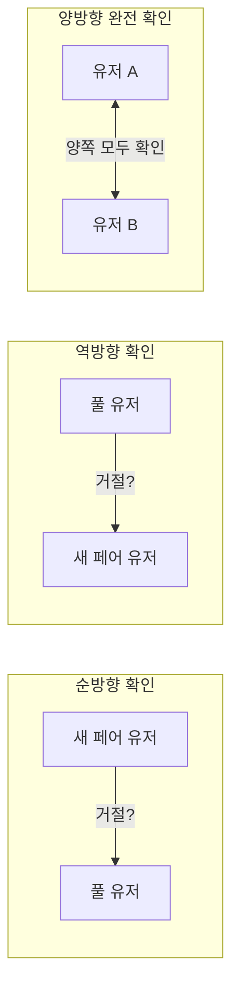
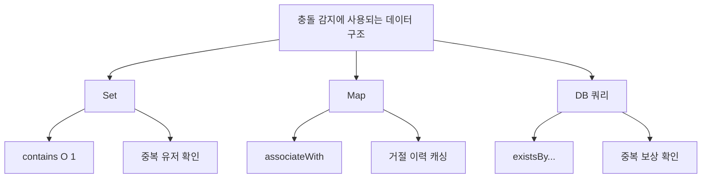
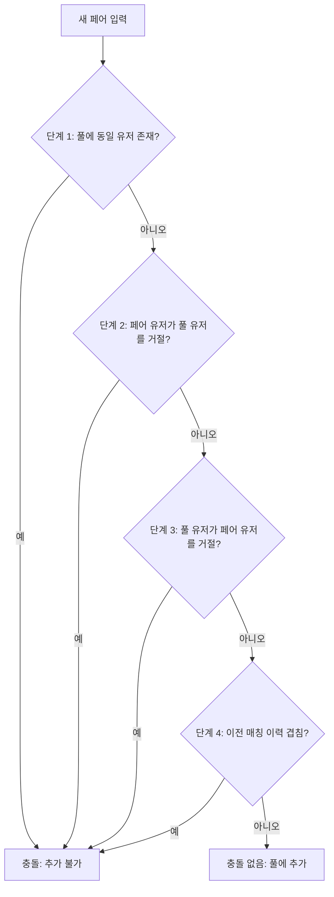
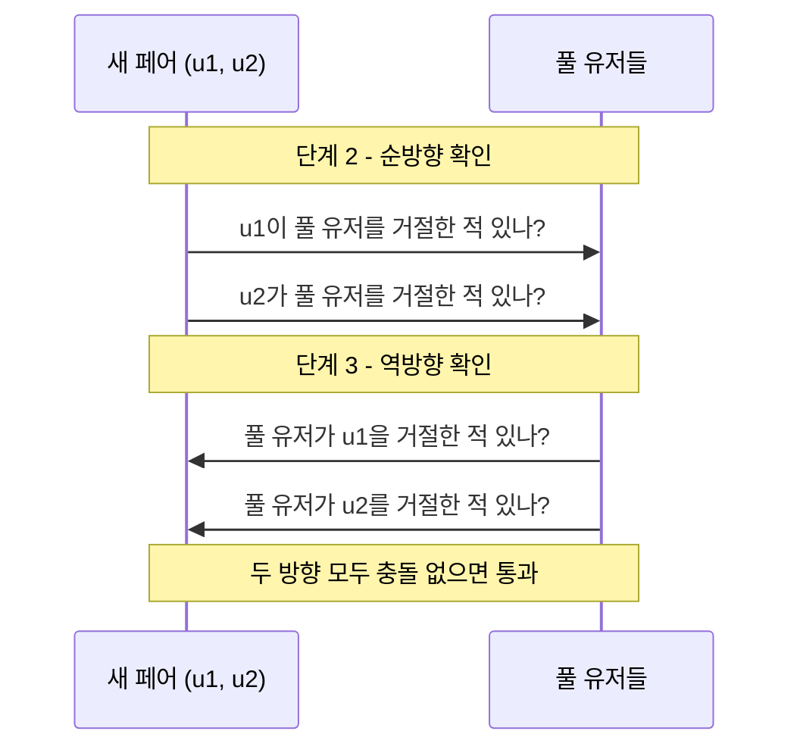
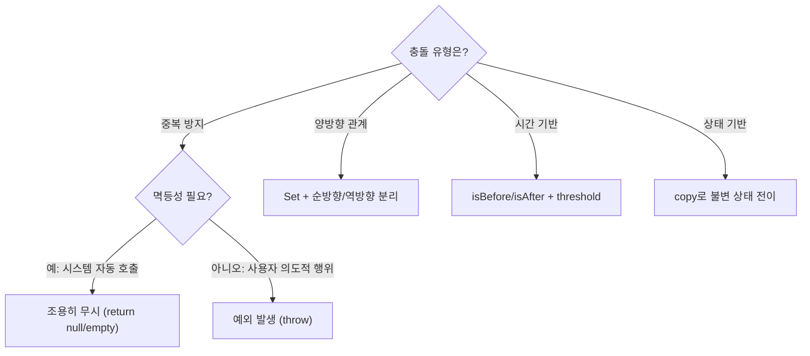

> **[시리즈] 코딩 테스트 알고리즘, 실무에서 이렇게 쓴다 -- duurian-server 편**
>
> 1. [Combination -- 조합 생성](/posts/kotlin-algorithm-01-combination/)
> 2. [Score & Range -- 점수 계산과 구간 매핑](/posts/kotlin-algorithm-02-score-range/)
> 3. [Set 연산 -- 교집합, 합집합, 차집합](/posts/kotlin-algorithm-03-set-operations/)
> 4. [Streak -- 연속 일수 계산](/posts/kotlin-algorithm-04-streak/)
> 5. [Top-K -- 상위 N개 선정](/posts/kotlin-algorithm-05-top-k/)
> 6. [GroupBy -- 그룹핑과 분류](/posts/kotlin-algorithm-06-groupby/)
> 7. [Rule Pattern -- 조건부 필터링과 규칙 체인](/posts/kotlin-algorithm-07-rule-pattern/)
> 8. **[충돌 감지 -- 중복 방지와 양방향 확인](/posts/kotlin-algorithm-08-conflict-detection/)**

---

## 1. 들어가며

코딩 테스트에서 "겹치는 구간을 찾아라", "중복을 제거하라", "이미 방문한 노드인지 확인하라"는 유형의 문제를 만나면, 본질적으로 모두 같은 질문을 하고 있습니다: **충돌(conflict)이 있는가?**

소셜 매칭 서비스인 duurian에서 충돌 감지는 서비스의 핵심 안전장치입니다. 이미 거절한 상대를 다시 매칭하면 사용자 경험이 망가지고, 보상을 중복 지급하면 비즈니스 손실이 발생하며, 만료된 메시지를 표시하면 신뢰도가 떨어집니다. 이 모든 상황을 방지하는 것이 충돌 감지 알고리즘입니다.

이 글에서는 충돌 감지의 다섯 가지 유형을 분류하고, duurian-server의 실제 코드에서 각 유형이 어떻게 구현되는지 분석하겠습니다.

---

## 2. 알고리즘 원리

### 2.1 충돌 감지의 5가지 유형

실무에서 마주치는 충돌 감지는 크게 다섯 가지로 분류할 수 있습니다.

| 유형 | 설명 | 핵심 질문 |
|------|------|-----------|
| **중복 방지** | 동일한 작업이 두 번 수행되는 것을 막음 | "이미 했는가?" |
| **양방향 관계 확인** | A->B뿐 아니라 B->A도 확인 | "상대방도 동의하는가?" |
| **시간 겹침** | 시간 구간이 서로 겹치는지 확인 | "시간이 충돌하는가?" |
| **상태 기반 만료** | 현재 시간과 만료 시간을 비교 | "아직 유효한가?" |
| **멱등성** | 같은 요청을 여러 번 보내도 결과 동일 | "반복해도 안전한가?" |

### 2.2 양방향 확인의 핵심

양방향 확인은 그래프 이론에서 **무방향 간선(undirected edge)**의 개념과 동일합니다. A가 B를 거절했다면 A->B 관계가 존재하지만, 반드시 B->A도 확인해야 합니다.



순방향만 확인하면 "A가 B를 거절하지 않았지만 B가 A를 거절한" 경우를 놓칩니다. 실무에서 이 실수는 매우 빈번하게 발생하며, duurian-server에서는 이를 명시적으로 분리하여 처리합니다.

### 2.3 충돌 감지 데이터 구조 비교



| 데이터 구조 | 조회 복잡도 | 사용 사례 |
|------------|------------|-----------|
| `Set<UUID>` | O(1) contains | 풀 내 유저 중복 확인 |
| `Map<UUID, List<UUID>>` | O(1) get + O(n) contains | 거절 이력 캐싱 |
| DB existsBy 쿼리 | 인덱스에 따라 다름 | 보상 중복 확인 |

---

## 3. Kotlin 구현 / 언어 특성

### 3.1 Set.contains() vs List.contains()

충돌 감지에서 "포함 여부" 확인은 가장 빈번한 연산입니다. Kotlin에서 자료구조 선택에 따라 성능이 극적으로 달라집니다.

```kotlin
// List.contains() -> O(n): 처음부터 끝까지 순회
val userIds: List<UUID> = listOf(...)
if (userId in userIds) { ... }  // 최악 O(n)

// Set.contains() -> O(1): 해시 기반 즉시 조회
val userIds: Set<UUID> = setOf(...)
if (userId in userIds) { ... }  // 평균 O(1)
```

duurian-server에서는 충돌 감지 시 일관되게 `toSet()`을 사용합니다.

```kotlin
// NoConflictWithPoolRule.kt
val u1Rejected = queryRecommendationPort.findRejectedUserIds(u1).toSet()
```

`findRejectedUserIds()`가 `List<UUID>`를 반환하더라도, 충돌 확인 전에 `.toSet()`으로 변환하여 O(1) 조회를 보장합니다.

### 3.2 data class의 copy()와 불변 상태 전이

Kotlin의 `data class`는 `copy()` 메서드를 자동 생성합니다. 이를 활용하면 **원본을 변경하지 않고** 상태가 바뀐 새 객체를 생성할 수 있습니다.

```kotlin
// 원본은 그대로, 상태만 바뀐 새 객체 생성
fun expireIfDue(now: LocalDateTime): Message {
    return if (status == MessageStatus.SENT && expiresAt?.isBefore(now) == true) {
        this.copy(status = MessageStatus.EXPIRED, updatedAt = now)
    } else this
}
```

불변 객체(immutable object)를 사용하면 동시성 문제를 원천적으로 방지할 수 있습니다. 상태 전이가 필요할 때 원본을 수정하는 것이 아니라 새 객체를 만들기 때문에, 여러 스레드가 동시에 같은 객체를 참조해도 안전합니다.

### 3.3 none, any, all의 의미론적 차이

충돌 감지에서 Kotlin의 컬렉션 함수들은 각각 다른 의미를 표현합니다.

```kotlin
// "하나도 없어야 통과" (충돌이 없어야 함)
pairs.none { pair -> isConflicting(pair) }

// "하나라도 있으면 실패" (위와 동치)
!pairs.any { pair -> isConflicting(pair) }

// "모두 만족해야 통과" (모든 규칙 충족)
rules.all { rule -> rule.isEligible() }
```

duurian-server의 RejectedMatchRule에서는 `pairs.none { }` 을 사용하여 "거절 충돌이 단 한 건도 없어야 한다"는 의도를 코드로 명확히 표현합니다.

### 3.4 orEmpty()로 null 안전하게 처리

```kotlin
val maleRejections = rejectionMap[pair.maleUserId].orEmpty()
```

Map에서 키가 없을 때 `null` 대신 빈 리스트를 반환하게 하여, 이후 `in` 연산에서 NPE를 방지합니다. 충돌 감지 로직에서는 "데이터가 없음 = 충돌 없음"이므로 빈 컬렉션이 의미적으로 정확합니다.

---

## 4. 실무 적용 사례

### 4.1 사례 1: NoConflictWithPoolRule -- 4단계 양방향 충돌 감지

duurian의 매칭 시스템은 매칭 "풀(pool)"에 페어를 추가하기 전에 기존 풀 유저들과 충돌이 없는지 확인합니다. 이 규칙은 4단계의 순차적 충돌 감지를 수행합니다.

```kotlin
// core/src/.../match/pool/NoConflictWithPoolRule.kt
@Component
class NoConflictWithPoolRule(
    private val queryRecommendationPort: QueryRecommendationPort,
    private val queryMatchGroupUserPort: QueryMatchGroupUserPort
) : PoolEligibilityRule {

    override fun isEligible(pair: MatchingPair, poolUserIds: Set<UUID>): Boolean {
        if (poolUserIds.isEmpty()) return true

        val u1 = pair.maleUserId
        val u2 = pair.femaleUserId

        // [단계 1] 풀에 이미 같은 유저가 있는지 확인
        if (poolUserIds.contains(u1) || poolUserIds.contains(u2)) {
            return false
        }

        // [단계 2] 순방향: 새 페어 유저 -> 풀 유저 거절 확인
        val u1Rejected = queryRecommendationPort.findRejectedUserIds(u1).toSet()
        val u2Rejected = queryRecommendationPort.findRejectedUserIds(u2).toSet()
        if (poolUserIds.any { it in u1Rejected || it in u2Rejected }) return false

        // [단계 3] 역방향: 풀 유저 -> 새 페어 유저 거절 확인
        for (poolUser in poolUserIds) {
            val poolRejected = queryRecommendationPort
                .findRejectedUserIds(poolUser).toSet()
            if (u1 in poolRejected || u2 in poolRejected) return false
        }

        // [단계 4] 이전 매칭 겹침 확인
        val pairUsers = setOf(u1, u2)
        val matchedHit = queryMatchGroupUserPort
            .hasAnyPreviousMatchBetween(pairUsers, poolUserIds)
        if (matchedHit) return false

        return true
    }
}
```

**4단계 충돌 감지 플로우차트**



이 코드에서 주목할 점은 **단계 순서가 비용 순으로 배치**되어 있다는 것입니다.

| 단계 | 비용 | 설명 |
|------|------|------|
| 1단계 | O(1) | Set.contains -- 가장 저렴 |
| 2단계 | O(P) | P = 풀 유저 수, 순방향 2회 조회 |
| 3단계 | O(P * Q) | 풀 유저마다 거절 이력 조회 |
| 4단계 | DB 조회 | 가장 비싼 연산 |

1단계에서 즉시 탈락시키면 2~4단계의 비용을 아낄 수 있습니다. 이것은 Rule Pattern에서의 "탈락률 높은 규칙을 앞에 배치"하는 원칙과 동일합니다.

**양방향 확인의 필요성**

단계 2는 "새 페어의 유저가 풀 유저를 거절했는지" 확인하고, 단계 3은 "풀 유저가 새 페어의 유저를 거절했는지" 확인합니다. 이 두 단계가 모두 필요한 이유를 다이어그램으로 표현하면:



### 4.2 사례 2: RejectedMatchRule -- 양방향 거절 이력 충돌

매칭 그룹에 포함된 모든 페어 간의 거절 이력을 교차 확인하는 규칙입니다.

```kotlin
// core/src/.../match/rule/RejectedMatchRule.kt
@Component
class RejectedMatchRule(
    private val queryRecommendationPort: QueryRecommendationPort
) : MatchingConditionRule {

    override fun isSatisfied(pairs: List<MatchingPair>): Boolean {
        if (pairs.size == 1) return true

        val allUserIds: Set<UUID> = pairs
            .flatMap { listOf(it.maleUserId, it.femaleUserId) }
            .toSet()

        val rejectionMap: Map<UUID, List<UUID>> = allUserIds
            .associateWith { userId ->
                queryRecommendationPort.findRejectedUserIds(userId)
            }

        return pairs.none { pair ->
            val maleRejections = rejectionMap[pair.maleUserId].orEmpty()
            val femaleRejections = rejectionMap[pair.femaleUserId].orEmpty()
            pair.femaleUserId in maleRejections || pair.maleUserId in femaleRejections
        }
    }
}
```

**핵심 알고리즘 분석**

1. **조기 종료**: `pairs.size == 1` 이면 교차 확인할 대상이 없으므로 즉시 `true`.
2. **배치 조회**: `associateWith`로 모든 유저의 거절 이력을 한 번에 조회하여 Map에 캐싱. 이렇게 하면 반복문 안에서 매번 DB를 조회하는 N+1 문제를 방지합니다.
3. **양방향 확인**: 남성이 여성을 거절했는지(`femaleUserId in maleRejections`)와 여성이 남성을 거절했는지(`maleUserId in femaleRejections`)를 모두 확인.
4. **none**: 한 쌍이라도 충돌이 있으면 전체가 `false`.

### 4.3 사례 3: PreviousMatchRule -- 진행 중 매칭 + 과거 만남 충돌

```kotlin
// core/src/.../match/rule/PreviousMatchRule.kt
@Component
class PreviousMatchRule(
    private val queryMatchGroupUserPort: QueryMatchGroupUserPort
) : MatchingConditionRule {

    override fun isSatisfied(pairs: List<MatchingPair>): Boolean {
        val activeMatchedUserIds = queryMatchGroupUserPort
            .findActiveMatchedUserIds()
        val previousMetPairs = queryMatchGroupUserPort
            .findPreviouslyMatchedPairs(
                pairs.map { Pair(it.maleUserId, it.femaleUserId) }
            ).map { setOf(it.first, it.second) }.toSet()

        val currentUserIds = pairs
            .flatMap { listOf(it.maleUserId, it.femaleUserId) }

        // 조건 1: 진행 중인 매칭 유저와 겹침
        if (currentUserIds.any { it in activeMatchedUserIds }) return false

        // 조건 2: 과거 실제 만남 페어와 겹침
        val currentPairUserSets = pairs
            .map { setOf(it.maleUserId, it.femaleUserId) }
        if (currentPairUserSets.any { it in previousMetPairs }) return false

        return true
    }
}
```

여기서 `setOf(it.maleUserId, it.femaleUserId)`로 페어를 Set으로 변환하는 것이 핵심입니다. Set은 순서가 없으므로, (A, B)와 (B, A)가 동일한 페어로 인식됩니다. 이것은 양방향 관계를 자연스럽게 표현하는 Kotlin의 방법입니다.

```kotlin
// Set을 사용한 양방향 페어 비교
setOf(UUID_A, UUID_B) == setOf(UUID_B, UUID_A)  // true
// Pair를 사용하면 방향이 구분됨
Pair(UUID_A, UUID_B) == Pair(UUID_B, UUID_A)    // false
```

이 차이는 코딩 테스트에서 "무방향 그래프의 간선 중복 제거" 문제와 직결됩니다.

### 4.4 사례 4: SubmitFinalChoiceService -- 중복 선택 방지

매칭 그룹에서 최종 선택을 제출할 때, 이미 투표한 사용자가 다시 투표하는 것을 방지합니다.

```kotlin
// core/src/.../match/service/SubmitFinalChoiceService.kt
@Service
@Transactional
class SubmitFinalChoiceService(
    private val queryMatchGroupsPort: QueryMatchGroupsPort,
    private val commandMatchGroupChoicePort: CommandMatchGroupChoicePort,
    private val queryMatchGroupChoicePort: QueryMatchGroupChoicePort
) : SubmitMatchGroupChoiceUseCase {

    override fun submitChoice(command: SubmitMatchGroupChoiceCommand) {
        val groupId = command.groupId
        val userId = command.userId

        val group = queryMatchGroupsPort.getMatchGroupById(groupId)

        // 상태 검증: MEET 상태가 아니면 투표 불가
        if (group.status != MatchStatus.MEET) {
            throw MatchGroupNotInMeetStatusException()
        }

        // 중복 검증: 이미 투표했으면 중복 투표 방지
        if (queryMatchGroupChoicePort.findByVoter(groupId, userId) != null) {
            throw DuplicateFinalChoiceException()
        }

        val choice = MatchGroupChoice.create(
            groupId = groupId,
            voterUserId = userId,
            selectedUserId = command.targetUserId,
            message = command.message
        )
        commandMatchGroupChoicePort.save(choice)
    }
}
```

이 코드는 중복 방지의 **findByX != null** 패턴입니다. DB에서 기존 데이터를 조회하고, 존재하면 예외를 던집니다. 단순하지만 가장 빈번하게 사용되는 충돌 감지 방식입니다.

**중복 방지 3가지 패턴 비교**

| 패턴 | 코드 예시 | 장점 | 단점 |
|------|-----------|------|------|
| `findByX != null` | `findByVoter(groupId, userId) != null` | 명시적, 커스텀 예외 가능 | 조회 비용 |
| `existsBy...` | `existsByUserIdAndTypeAndDate(...)` | 조회보다 가벼움 | boolean만 반환 |
| DB 유니크 제약 | `@Column(unique = true)` | DB 레벨 보장 | 예외 처리 복잡 |

### 4.5 사례 5: CreateRescheduleProposalService -- 중복 + 시간 검증

일정 재투표 요청에서는 중복 검증과 시간 기반 검증이 결합됩니다.

```kotlin
// core/src/.../schedule/scheduleProposal/service/CreateRescheduleProposalService.kt
@Service
class CreateRescheduleProposalService(
    private val eventPublisher: ApplicationEventPublisher,
    private val queryScheduleProposalPort: QueryScheduleProposalPort,
    private val queryMatchGroupsPort: QueryMatchGroupsPort,
    private val queryMatchGroupSchedulePort: QueryMatchGroupSchedulePort,
    private val commandMatchGroups: CommandMatchGroupPort,
) : CreateRescheduleProposalUseCase {

    @Transactional
    override fun create(command: CreateRescheduleProposalCommand) {
        val matchGroup = queryMatchGroupsPort.getMatchGroupById(command.groupId)
        validateScheduleProposalStatus(command)  // 진행 중인 투표 충돌
        validateMatchGroupStatus(matchGroup)      // 상태 충돌
        validateRescheduleDuplication(command)     // 중복 요청 충돌
        validateScheduleProposalTime(command)      // 시간 임계값 충돌
        // ... 이벤트 발행
    }

    private fun validateScheduleProposalTime(
        command: CreateRescheduleProposalCommand
    ) {
        val latestScheduleDetail = queryMatchGroupSchedulePort
            .findLatestDetailByMatchGroupId(command.groupId) ?: return

        val meetingDate = latestScheduleDetail.dateValue
        val meetingTime = LocalTime.parse(latestScheduleDetail.timeValue)
        val meetingAt = ZonedDateTime.of(meetingDate, meetingTime, KST)

        val meetingAtUtc = meetingAt.withZoneSameInstant(ZoneOffset.UTC).toInstant()
        val threshold = meetingAtUtc.minus(24, ChronoUnit.HOURS)
        val now = Instant.now()

        // 만남 24시간 전부터는 재투표 불가
        if (!now.isBefore(threshold)) {
            throw RescheduleProposalNotAllowedException()
        }
    }

    private fun validateRescheduleDuplication(
        command: CreateRescheduleProposalCommand
    ) {
        val alreadyRequestedUser = queryScheduleProposalPort
            .existsByMatchGroupIdAndCreatorId(command.groupId, command.user.id)
        if (alreadyRequestedUser) throw AlreadyRequestedRescheduleProposalException()
    }

    private fun validateMatchGroupStatus(matchGroup: MatchGroups) {
        if (matchGroup.status !== MatchStatus.SCHEDULED)
            throw InvalidMatchGroupStatusException()
    }
}
```

이 서비스는 4가지 종류의 충돌을 순차적으로 확인합니다:

1. **진행 상태 충돌**: 이미 투표가 진행 중인지 (`ScheduleProposalStatus.CLOSED`가 아닌지)
2. **상태 충돌**: 매칭 그룹이 `SCHEDULED` 상태인지
3. **중복 요청 충돌**: 같은 유저가 이미 재투표를 요청했는지
4. **시간 임계값 충돌**: 만남 24시간 전인지

시간 기반 충돌에서 `threshold` 변수는 "이 시점 이후로는 재투표가 불가능하다"는 임계값입니다. `Instant.now().isBefore(threshold)`로 현재 시간이 임계값 이전인지 확인합니다.

### 4.6 사례 6: CreateRewardService -- 중복 보상 방지

보상 지급에서 중복은 직접적인 금전 손실로 이어집니다. duurian에서는 여러 층위에서 중복을 방지합니다.

```kotlin
// core/src/.../reward/service/CreateRewardService.kt

// 대화 보상: 오늘 이미 지급했으면 중복 방지
if (queryRewardPort.existsByUserIdAndTypeAndDate(
    command.userId, RewardType.CONVERSATION, today
)) {
    return emptyList()  // 이미 보상 받음 -> 빈 리스트 반환 (예외 아님)
}

// 레벨업 보상: 동일 상품의 레벨업 보상이 이미 존재하면 중복 방지
if (queryRewardPort.existsByUserIdAndTypeAndDurianProductId(
    command.userId, RewardType.LEVEL_UP, durianProduct.id
)) {
    return null  // 이미 지급됨 -> null 반환 (예외 아님)
}

// 페르소나 보상: 이미 PERSONA 보상을 받은 적이 있는지 확인
val existingRewards = queryRewardPort.findAllByUserIdAndType(
    command.userId, RewardType.PERSONA
)
if (existingRewards.isNotEmpty()) {
    return null  // 이미 지급됨
}
```

여기서 중요한 설계 결정이 있습니다. 중복 보상 시도는 **예외를 던지지 않고 조용히 무시**합니다. SubmitFinalChoiceService에서는 `DuplicateFinalChoiceException`을 던졌지만, 보상 서비스에서는 `emptyList()`나 `null`을 반환합니다. 이것이 **멱등성(Idempotency)**입니다.

```
멱등적 처리: f(x) = f(f(x))
같은 보상 요청을 두 번 보내도 결과는 한 번 보낸 것과 동일
```

멱등성이 중요한 이유는 분산 시스템에서 네트워크 재시도, 메시지 중복 전달 등이 불가피하기 때문입니다. "이미 처리됨"을 에러로 취급하면 재시도 시 불필요한 에러 로그가 쌓이고, 클라이언트가 에러를 처리해야 하는 부담이 생깁니다.

### 4.7 사례 7: Message.expireIfDue -- 시간 기반 만료와 불변 상태 전이

```kotlin
// domain/src/.../message/model/Message.kt

fun expireIfDue(now: LocalDateTime): Message {
    return if (status == MessageStatus.SENT && expiresAt?.isBefore(now) == true) {
        this.copy(status = MessageStatus.EXPIRED, updatedAt = now)
    } else this
}
```

이 메서드는 두 가지 충돌 감지 기법을 결합합니다:

1. **상태 충돌**: `status == MessageStatus.SENT`인 경우에만 만료 처리. 이미 EXPIRED, ACCEPTED, REJECTED 상태면 건드리지 않습니다.
2. **시간 충돌**: `expiresAt?.isBefore(now)` -- 만료 시간이 현재 시간보다 이전이면 충돌(만료).

`copy()`를 사용하여 원본 Message 객체는 변경하지 않고, 상태가 바뀐 새 Message를 반환합니다. `else this`는 조건을 만족하지 않으면 **자기 자신을 그대로 반환**하여, 호출하는 쪽에서 별도의 null 처리가 필요 없게 만듭니다.

```kotlin
// 호출부: 만료 처리 결과를 바로 사용
val updatedMessage = message.expireIfDue(LocalDateTime.now())
// updatedMessage가 원본과 같은 인스턴스일 수도, 새 인스턴스일 수도 있음
```

### 4.8 사례 8: PersonaSnapshot.isExpired -- 열람권 만료

```kotlin
// domain/src/.../persona/model/PersonaSnapshot.kt

fun isExpired(now: LocalDateTime = LocalDateTime.now()): Boolean {
    return now.isAfter(expiresAt)
}

fun isViewable(now: LocalDateTime = LocalDateTime.now()): Boolean {
    return !isExpired(now) && deletedAt == null
}
```

PersonaSnapshot(페르소나 열람권)의 만료 확인은 가장 단순한 형태의 시간 기반 충돌 감지입니다. `isViewable()`은 두 가지 조건을 AND로 결합합니다: 만료되지 않았고 삭제되지 않았으면 열람 가능.

기본 파라미터 `now: LocalDateTime = LocalDateTime.now()`는 테스트 용이성을 위한 설계입니다. 프로덕션에서는 기본값이 사용되고, 테스트에서는 원하는 시간을 주입할 수 있습니다.

```kotlin
// 테스트에서 시간 주입
val futureTime = LocalDateTime.of(2026, 12, 31, 23, 59)
val isExpired = snapshot.isExpired(futureTime)  // 미래 시간으로 테스트
```

### 4.9 사례 9: Coupon.validateCoupon -- 날짜 범위 검증

```kotlin
// domain/src/.../coupon/coupon/model/Coupon.kt

require(registrationStartAt.isBefore(registrationEndAt)) {
    "Start date must be before end date"
}
require(usageStartAt.isBefore(usageEndAt)) {
    "Start date must be before end date"
}
```

시작일이 종료일보다 앞서야 한다는 것은 "시간 구간의 자기 충돌(self-conflict)" 검사입니다. 시작일과 종료일이 역전되면 무한 기간이나 음의 기간이 되어 모든 시간 비교 로직이 깨집니다.

---

## 5. 시간 복잡도와 실무 주의점

### 5.1 시간 복잡도 분석

| 사례 | 시간 복잡도 | 핵심 연산 |
|------|------------|-----------|
| NoConflictWithPoolRule | O(P^2) 최악 | P = 풀 유저 수, 역방향 확인 |
| RejectedMatchRule | O(U * R) | U = 유저 수, R = 평균 거절 수 |
| PreviousMatchRule | O(P + DB) | P = 페어 수 + DB 조회 |
| SubmitFinalChoiceService | O(1) + DB | 단일 조회 |
| CreateRewardService | O(1) + DB | existsBy 단일 조회 |
| Message.expireIfDue | O(1) | 시간 비교 |
| PersonaSnapshot.isExpired | O(1) | 시간 비교 |

### 5.2 Set vs List 성능 차이의 실무 임팩트

풀 유저가 100명일 때의 차이를 계산해보겠습니다:

```
List.contains 사용 시:
  - 단계 2: poolUserIds(100) * (u1Rejected + u2Rejected) 각각 O(100) = O(10,000)
  - 단계 3: poolUsers(100) * poolRejected * 2 = O(100 * 100 * 2) = O(20,000)

Set.contains 사용 시:
  - 단계 2: poolUserIds(100) * 2회 O(1) = O(200)
  - 단계 3: poolUsers(100) * 2회 O(1) = O(200)
```

풀 유저 100명 기준으로 약 **50~100배의 성능 차이**가 발생합니다. 이것이 duurian-server에서 `toSet()`을 일관되게 사용하는 이유입니다.

### 5.3 실무 주의점

**1. 멱등성 설계 원칙**

```
예외를 던져야 하는 경우: 사용자가 의도적으로 중복 행위를 시도 (투표 중복)
조용히 무시해야 하는 경우: 시스템 내부에서 자동 재시도 가능성 (보상 지급)
```

**2. 시간대(timezone) 처리**

duurian-server에서 시간 비교는 항상 UTC로 통일하거나, 명시적으로 timezone을 지정합니다.

```kotlin
// 서울 시간대 명시
private val KST = ZoneId.of("Asia/Seoul")
val meetingAt = ZonedDateTime.of(meetingDate, meetingTime, KST)
val meetingAtUtc = meetingAt.withZoneSameInstant(ZoneOffset.UTC).toInstant()
```

시간 기반 충돌 감지에서 timezone 불일치는 가장 흔한 버그 원인 중 하나입니다.

**3. Race Condition 방지**

`findByVoter() != null` 체크와 `save()` 사이에 다른 요청이 끼어들 수 있습니다. 이를 방지하기 위해:

- `@Transactional`로 DB 레벨 격리
- DB 유니크 제약 조건으로 최종 방어선
- 분산 잠금(distributed lock)으로 다중 서버 환경 대응

### 5.4 충돌 감지 전략 선택 가이드



---

## 6. 관련 코딩 테스트 유형

충돌 감지의 핵심 기법인 구간 겹침, 중복 확인, 양방향 탐색은 다양한 코딩 테스트 문제에서 등장합니다.

### 6.1 프로그래머스 -- 호텔 대실

호텔 객실의 사용 시간이 겹치는지 확인하여 최소 객실 수를 구하는 문제입니다. 시간 구간의 충돌 감지가 핵심입니다.

```kotlin
// 핵심 패턴: 시간 구간 겹침 확인
// 구간 [s1, e1]과 [s2, e2]가 겹치는 조건:
// s1 < e2 && s2 < e1
val isOverlapping = checkIn < otherCheckOut && otherCheckIn < checkOut
```

duurian의 `Coupon.validateCoupon()`에서 `registrationStartAt.isBefore(registrationEndAt)`과 동일한 시간 비교 패턴입니다.

### 6.2 백준 2110 -- 공유기 설치

집 사이의 간격(distance)이 충분한지 확인하는 문제입니다. 이분 탐색으로 최소 간격을 찾으면서, 각 후보 간격에 대해 "충돌(간격 부족)이 있는가"를 판별합니다.

```kotlin
// 핵심 패턴: 간격 기반 충돌
if (houses[i] - lastInstalled >= minGap) {
    // 충돌 없음: 설치 가능
}
```

duurian의 24시간 임계값 확인(`now.isBefore(threshold)`)과 유사한 "거리/간격 기반 충돌" 패턴입니다.

### 6.3 프로그래머스 -- 주차 요금 계산

입차/출차 시간을 매칭하고, 주차 시간을 계산하는 문제입니다. Map을 사용하여 차량번호별 입차 기록을 관리하고, 출차 시 매칭하여 삭제합니다.

```kotlin
// 핵심 패턴: Map 기반 상태 추적
val parkingMap = mutableMapOf<String, Int>()  // 차량번호 -> 입차시간
if (type == "IN") parkingMap[carNumber] = time
if (type == "OUT") {
    val entryTime = parkingMap.remove(carNumber)!!
    totalTime += time - entryTime
}
```

duurian의 `rejectionMap`(`associateWith`로 구축)과 동일한 Map 기반 상태 관리 패턴입니다.

### 6.4 백준 1806 -- 부분합

연속 부분 배열의 합이 목표값 이상인 최소 길이를 구하는 문제입니다. 투 포인터로 구간을 관리하며, 구간의 합이 목표값과 "충돌(이상)"하는 지점을 찾습니다.

```kotlin
// 핵심 패턴: 구간 조건 충족 확인
while (right < n) {
    sum += arr[right++]
    while (sum >= target) {  // 구간 합이 목표 이상 = "충돌" 감지
        minLen = minOf(minLen, right - left)
        sum -= arr[left++]
    }
}
```

### 6.5 프로그래머스 -- 방문 길이

이미 방문한 경로(간선)인지 확인하는 문제입니다. Set에 양방향 경로를 모두 저장하여 중복을 판별합니다.

```kotlin
// 핵심 패턴: 양방향 경로 중복 확인
val visited = mutableSetOf<String>()
val edge1 = "$x1,$y1->$x2,$y2"
val edge2 = "$x2,$y2->$x1,$y1"
if (edge1 !in visited) {
    visited.add(edge1)
    visited.add(edge2)  // 양방향 모두 등록
    count++
}
```

duurian의 `setOf(u1, u2)`를 사용한 양방향 페어 비교와 본질적으로 같은 패턴입니다.

---

## 7. 정리

### 요약 테이블

| 적용 사례 | 충돌 유형 | 감지 방식 | 충돌 시 동작 | 복잡도 |
|-----------|-----------|-----------|-------------|--------|
| NoConflictWithPoolRule | 양방향 관계 | 4단계 순차 확인 | `return false` | O(P^2) |
| RejectedMatchRule | 양방향 거절 | Map 캐싱 + none | `return false` | O(U * R) |
| PreviousMatchRule | 상태 + 이력 | Set 멤버십 | `return false` | O(P + DB) |
| SubmitFinalChoiceService | 중복 방지 | findByX != null | 예외 발생 | O(1) + DB |
| CreateRescheduleProposalService | 중복 + 시간 | 4단계 validate | 예외 발생 | O(1) + DB |
| CreateRewardService | 중복 방지 | existsBy 쿼리 | 조용히 무시 | O(1) + DB |
| Message.expireIfDue | 시간 만료 | isBefore + 상태 | copy 상태 전이 | O(1) |
| PersonaSnapshot.isExpired | 시간 만료 | isAfter | boolean 반환 | O(1) |
| Coupon.validateCoupon | 날짜 역전 | isBefore + require | 예외 발생 | O(1) |

### 핵심 포인트

1. **양방향 확인은 필수**: A->B 확인만으로는 불충분합니다. B->A도 반드시 확인해야 합니다. 특히 소셜 서비스에서 거절 이력은 양쪽 모두에서 발생할 수 있습니다.

2. **Set.contains() O(1)을 활용하라**: 충돌 감지는 "포함 여부" 확인의 반복입니다. List 대신 Set을 사용하면 풀 유저 100명 기준 50~100배의 성능 향상을 얻습니다.

3. **멱등성을 고려하여 충돌 대응을 결정하라**: 사용자 의도적 중복은 예외를, 시스템 자동 재시도는 조용한 무시를 선택합니다.

4. **비용이 낮은 검사를 먼저 수행하라**: NoConflictWithPoolRule에서 O(1) Set.contains를 먼저, DB 조회를 마지막에 배치한 것처럼, 비용 순으로 검사를 배치하면 불필요한 연산을 줄일 수 있습니다.

5. **copy()로 불변 상태 전이**: 원본 객체를 변경하지 않고 새 객체를 생성하면 동시성 문제를 원천 차단합니다. `else this` 패턴으로 변경이 없는 경우 자기 자신을 반환하여 호출부의 null 처리를 제거합니다.

6. **시간 비교는 timezone을 명시하라**: UTC와 KST가 혼재하면 충돌 감지 로직이 9시간 어긋납니다. 모든 시간 비교에서 timezone을 명시적으로 처리해야 합니다.

---

*이전 글: [Rule Pattern -- 조건부 필터링과 규칙 체인](/posts/kotlin-algorithm-07-rule-pattern/)*

*정지원 (duurian 백엔드 개발자)*
