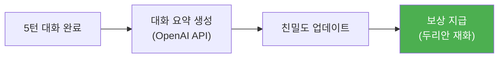
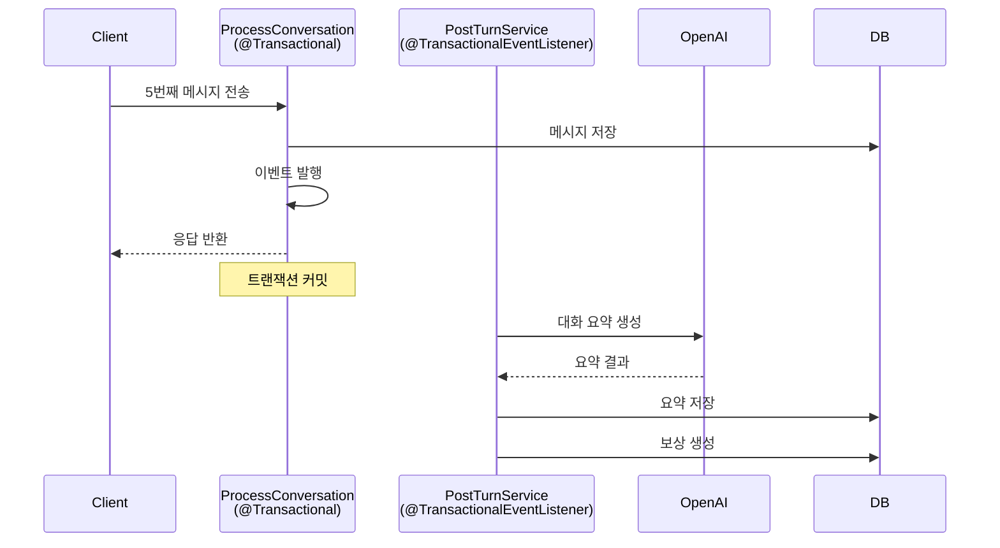
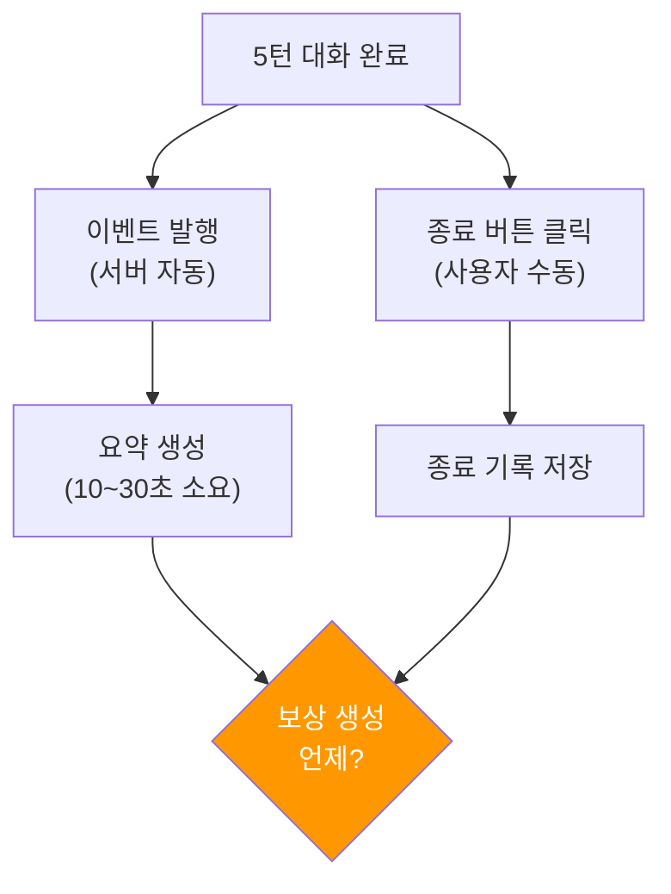
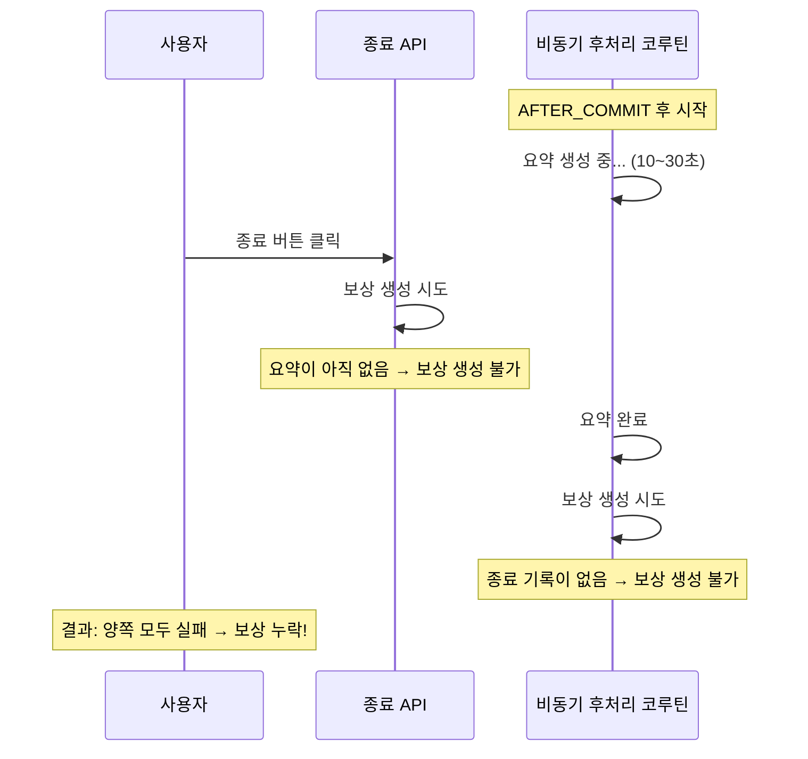
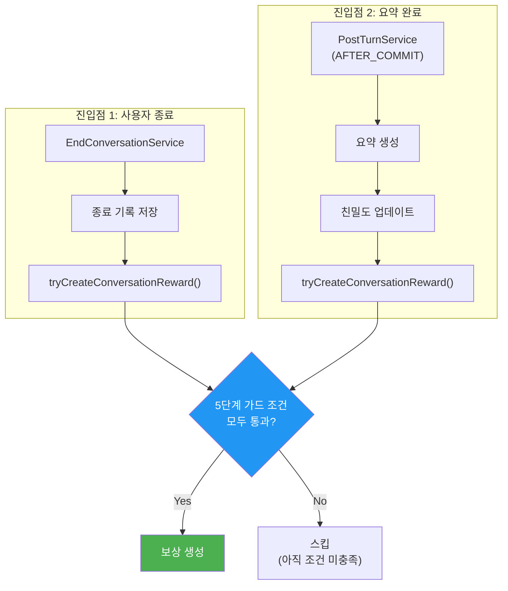
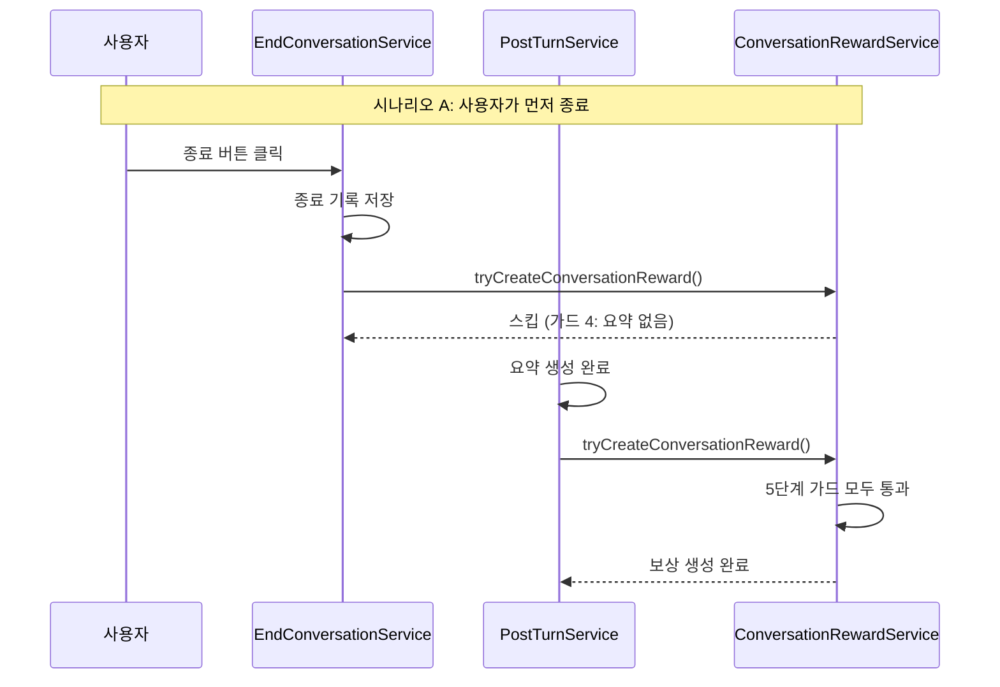

# [Spring/Kotlin] 비동기 보상 시스템에서 만난 트랜잭션 가시성 문제 — 대화 종료와 보상 생성의 책임 분리

안녕하세요. duurian 팀에서 백엔드 개발을 담당하고 있는 정지원입니다.

이전 글 [[Spring/Kotlin] @Transactional 내부 코루틴의 트랜잭션 가시성 문제](/2026-02-09-spring-transactional-event-listener-coroutine-visibility)에서는 `@Transactional` 메서드 내부 코루틴이 미커밋 데이터를 읽지 못하는 문제와 `@TransactionalEventListener(AFTER_COMMIT)`로 해결하는 과정을 다뤘습니다.

이번 글에서는 한 단계 더 나아갑니다. 트랜잭션 가시성 문제를 해결한 뒤 **비동기 후처리의 실행 순서가 보장되지 않아** 발생한 새로운 문제, 그리고 이를 **대화 종료와 보상 생성의 책임 분리**로 해결한 과정을 공유합니다.

---

## 1. 들어가며

duurian은 AI 캐릭터 '듀리'와 대화하는 서비스입니다. 사용자가 매일 5턴의 대화를 완료하면 다음과 같은 후처리가 이루어집니다.



어느 날 QA 팀에서 리포트가 올라왔습니다.

> "대화를 끝까지 했는데 보상이 안 들어와요."

간헐적으로 발생했고, 재현이 어려웠습니다. 로그를 뒤져보니 대화 데이터는 정상 저장되어 있었고, 요약도 생성되어 있었지만 보상만 누락된 상태였습니다.

---

## 2. 문제 상황: 대화는 끝났는데 보상이 안 생긴다

### 2.1 기존 흐름

기존에는 5턴 대화가 완료되면 `ConversationCompletedEvent`를 발행하고, 이벤트 리스너가 요약 생성부터 보상 지급까지 순차적으로 처리했습니다.



여기서 문제는 **사용자의 "종료" 행위가 고려되지 않았다는 점**입니다.

### 2.2 증상: 두 가지 타이밍 불일치

사용자가 대화를 마치는 흐름에는 두 가지 독립적인 시점이 있습니다.



- **시나리오 A**: 사용자가 바로 종료 → 요약은 아직 생성 중 → 보상 생성 시점이 불명확
- **시나리오 B**: 사용자가 앱을 닫았다가 나중에 종료 → 요약은 이미 완료 → 종료 시점에 보상 생성 가능
- **시나리오 C**: 요약 생성이 완료되었지만 사용자가 종료하지 않음 → 보상을 줘야 하나?

기존 구조에서는 요약 완료 후 무조건 보상을 생성했기 때문에 **"종료하지 않은 사용자에게도 보상이 지급"**되거나, 반대로 **타이밍 이슈로 보상이 누락**되는 경우가 발생했습니다.

---

## 3. 원인 분석: AFTER_COMMIT이 해결해주지 못한 것

[이전 글](/2026-02-09-spring-transactional-event-listener-coroutine-visibility)에서 `@TransactionalEventListener(AFTER_COMMIT)`을 도입하여 **미커밋 데이터를 코루틴에서 읽지 못하는 문제**는 해결했습니다.

하지만 새로운 문제가 남아 있었습니다. `AFTER_COMMIT` 이후 실행되는 코루틴은 **fire-and-forget** 방식이기 때문에, 코루틴의 완료 시점을 외부에서 알 수 없습니다.



문제의 본질은 **"요약 완료"와 "사용자 종료"라는 두 개의 독립적인 시점이 서로를 모른다**는 것이었습니다. `AFTER_COMMIT`은 트랜잭션 가시성을 해결해줬지만, 비동기 작업 간의 순서 조율까지는 해결해주지 않습니다.

---

## 4. 해결: 대화 종료와 보상 생성의 책임 분리

### 4.1 설계 원칙: 누가 먼저 오든 동작하는 구조

핵심 아이디어는 간단합니다. **보상 생성을 하나의 독립 서비스로 분리**하고, 두 진입점(종료 API, 요약 완료 이벤트) 중 **나중에 오는 쪽에서 실제 보상을 생성**하게 만드는 것입니다.



### 4.2 EndConversationService: 종료 기록 분리

대화 종료를 별도 API로 분리하고, `ConversationEndHistory` 엔티티를 도입했습니다.

```kotlin
@Service
class EndConversationService(
    private val commandConversationEndHistoryPort: CommandConversationEndHistoryPort,
    private val queryConversationEndHistoryPort: QueryConversationEndHistoryPort,
    private val conversationRewardService: ConversationRewardService,
) : EndConversationUseCase {

    @Transactional
    override fun endConversation(command: EndConversationCommand) {
        val userId = command.userId
        val today = LocalDate.now(SEOUL_ZONE)

        // 멱등성: 이미 종료 기록이 있으면 스킵
        if (queryConversationEndHistoryPort.existsByUserIdAndDate(userId, today)) {
            log.info { "대화 종료 처리 스킵 (이미 종료됨): userId=$userId" }
            return
        }

        // 종료 기록 저장
        commandConversationEndHistoryPort.save(ConversationEndHistory.create(userId))

        // 요약이 이미 있으면 보상 생성 시도 (없으면 스킵)
        conversationRewardService.tryCreateConversationReward(userId)
    }
}
```

**멱등성**이 핵심입니다. 사용자가 종료 버튼을 여러 번 누르더라도 종료 기록은 하루에 하나만 생성됩니다.

### 4.3 ConversationRewardService: 5단계 가드 패턴

보상 생성의 핵심은 `tryCreateConversationReward()` 메서드입니다. 두 진입점에서 동일한 메서드를 호출하되, **5단계 가드 조건**으로 실행 시점을 제어합니다.

```kotlin
@Service
class ConversationRewardService(
    private val lowQualityConversationDetector: LowQualityConversationDetector,
    private val queryConversationSummaryPort: QueryConversationSummaryPort,
    private val queryConversationEndHistoryPort: QueryConversationEndHistoryPort,
    private val queryRewardPort: QueryRewardPort,
    private val queryRewardSkipHistoryPort: QueryRewardSkipHistoryPort,
    private val createRewardUseCase: CreateRewardUseCase,
) {
    fun tryCreateConversationReward(userId: UUID) {
        val today = LocalDate.now(SEOUL_ZONE)

        // 가드 1: 이미 보상 처리됨 → 중복 지급 방지
        if (queryRewardPort.existsByUserIdAndTypeAndDate(
                userId, RewardType.CONVERSATION, today)) {
            return
        }

        // 가드 2: 이미 스킵 처리됨 → 저품질로 미지급 판정 완료
        if (queryRewardSkipHistoryPort
                .findAllByUserIdAndDate(userId, today).isNotEmpty()) {
            return
        }

        // 가드 3: 종료 안 했으면 스킵 → 사용자가 아직 종료 버튼을 안 눌렀음
        if (!queryConversationEndHistoryPort
                .existsByUserIdAndDate(userId, today)) {
            return
        }

        // 가드 4: 요약 없으면 스킵 → 아직 AI 요약 생성 중
        val todaySummaries = queryConversationSummaryPort
            .findAllByUserIdAndCreatedAtInRange(userId, todayUtcRange)
        if (todaySummaries.isEmpty()) {
            return
        }

        // 가드 5: 빈 요약이면 저품질 스킵 처리
        val summaryContents = todaySummaries
            .map { it.content }.filter { it.isNotBlank() }
        if (summaryContents.isEmpty()) {
            createRewardUseCase.createConversationReward(
                CreateRewardCommand(
                    userId = userId,
                    skipDailyReward = true,
                    skipReasons = listOf(LowQualityReason.EMPTY_SUMMARY),
                )
            )
            return
        }

        // 모든 가드 통과 → 저품질 판별 후 보상 생성
        val qualityResult = lowQualityConversationDetector
            .check(userId, summaryContents)
        createRewardUseCase.createConversationReward(
            CreateRewardCommand(
                userId = userId,
                skipDailyReward = qualityResult.isLowQuality,
                skipReasons = qualityResult.reasons,
            )
        )
    }
}
```

각 가드가 담당하는 역할을 정리하면 다음과 같습니다.

| 가드 | 조건 | 의미 |
|------|------|------|
| 1 | `Reward` 존재 여부 | 이미 보상 지급 완료 → 중복 방지 |
| 2 | `RewardSkipHistory` 존재 여부 | 이미 미지급 판정 완료 → 중복 방지 |
| 3 | `ConversationEndHistory` 존재 여부 | 사용자가 종료했는가? |
| 4 | 요약 레코드 존재 여부 | AI 요약이 생성되었는가? |
| 5 | 요약 content 비어있는지 | 빈 요약이면 저품질 처리 |

### 4.4 시나리오별 동작

이 설계로 앞서 언급한 세 가지 시나리오가 모두 해결됩니다.



시나리오 B(요약이 먼저 완료)에서는 반대로 동작합니다. 요약 완료 시점에는 가드 3(종료 기록 없음)에서 스킵하고, 이후 사용자가 종료하면 모든 가드를 통과하여 보상이 생성됩니다.

어느 쪽이 먼저 실행되든, **나중에 오는 호출에서 모든 조건이 충족되어 보상이 생성**됩니다.

---

## 5. 저품질 대화 보상 미지급

보상 시스템을 분리하면서 **성의 없는 대화에는 보상을 주지 말자**는 요구사항도 함께 구현했습니다. 3가지 조건(모든 메시지 5자 이하, 동일 답변 3회 이상 반복, 페르소나 미추출) 중 **2개 이상 충족 시** 저품질로 분류합니다.

```kotlin
@Component
class LowQualityConversationDetector(
    private val queryConversationPort: QueryConversationPort,
) {
    fun check(userId: UUID, summaryContents: List<String>?): LowQualityCheckResult {
        val userMessages = todayConversations
            .filter { !it.isAiModel && it.questionId == null }
            .map { it.content }

        val reasons = mutableListOf<LowQualityReason>()

        // 조건 1: 모든 메시지 5자 이하
        if (userMessages.all { it.length <= 5 })
            reasons.add(LowQualityReason.SHORT_MESSAGES)

        // 조건 2: 동일 답변 3회 이상 반복
        if (userMessages.groupBy { it }.any { it.value.size >= 3 })
            reasons.add(LowQualityReason.REPEATED_MESSAGES)

        // 조건 3: 페르소나(요약) 미추출
        if (summaryContents != null && summaryContents.all { it.isBlank() })
            reasons.add(LowQualityReason.NO_PERSONA_EXTRACTED)

        return LowQualityCheckResult(
            isLowQuality = reasons.size >= 2,
            reasons = reasons
        )
    }
}
```

보상을 미지급할 때는 `RewardSkipHistory`에 사유를 저장합니다. CS 대응("왜 보상을 못 받았나요?")과 가드 2번의 중복 방지에 활용됩니다.

저품질 대화여도 "대화를 한 것"으로 카운트하여 연속일수는 유지합니다. 매일 보상(DAY1)만 미지급하고, 7일/14일/28일 연속 보상은 정상 지급합니다.

```kotlin
// CreateRewardService.kt
if (command.skipDailyReward) {
    commandRewardSkipHistoryPort.save(
        RewardSkipHistory.create(userId = command.userId, reasons = command.skipReasons)
    )
} else {
    createRewardIfExists(command, RewardFeature.CONVERSATION, RewardCondition.DAY1)
}

// 연속 보상 (DAY7, DAY14, DAY28)은 저품질 여부와 무관하게 지급
val streakCondition = RewardCondition.fromConversationDays(consecutiveDaysInCycle)
if (streakCondition != null && streakCondition != RewardCondition.DAY1) {
    createRewardIfExists(command, RewardFeature.CONVERSATION, streakCondition)
}
```

---

## 6. 정리

### 체크리스트

- [ ] **하나의 결과를 만드는 진입점이 여러 개인가?** 순서가 보장되지 않는다면 가드 패턴으로 "누가 먼저 오든 동작하는" 구조를 설계하세요.
- [ ] **실패 시 추적 가능한 이력을 남기는가?** "안 준 이유"도 기록하면 CS 대응과 데이터 분석에 활용할 수 있습니다.

### 교훈

1. **비동기 처리에서 `AFTER_COMMIT`은 가시성만 해결합니다.** 실행 순서까지 보장하려면 가드 패턴이 필요합니다.
2. **"안 준 이유"를 기록하는 것도 중요한 비즈니스 로직입니다.** `RewardSkipHistory`는 CS 대응과 데이터 분석의 기반이 됩니다.

---

읽어주셔서 감사합니다. 질문이나 피드백은 댓글로 남겨주세요.
