# App Store 1위 만보기 앱 '찰리와 걷기' — 백엔드 인프라와 데이터 레이어 개선기

안녕하세요. 백엔드 개발자 정지원입니다.

2022년 6월부터 12월까지, 약 6개월간 **찰리와 걷기**라는 소셜 만보기 앱의 백엔드를 개발하고 운영했습니다. App Store 건강 카테고리 1위를 달성하기도 했는데요, 저는 그 중에서도 **인증 시스템 구축**, **데이터 레이어 개선**, **캐시 서버 구축**, **인프라/배포 자동화**, **모니터링/APM 구축**을 담당했습니다.

이 글에서는 제가 직접 기여한 부분들을 중심으로, **왜 그 기술을 선택했는지**, **어떤 문제가 있었는지**, **어떻게 해결했는지**를 정리해 보려고 합니다.

---

## 목차

1. [찰리와 걷기 — 서비스와 기술 스택](#1-찰리와-걷기--서비스와-기술-스택)
2. [인증 시스템: JWT 토큰 기반 인증과 Apple 소셜 로그인 구현](#2-인증-시스템-jwt-토큰-기반-인증과-apple-소셜-로그인-구현)
3. [사용자 통계 로직 개선: 증분 집계에서 전체 재계산으로의 전환](#3-사용자-통계-로직-개선-증분-집계에서-전체-재계산으로의-전환)
4. [달력 기능: 월별 로그 그루핑 API 개발과 Locale 버그 수정](#4-달력-기능-월별-로그-그루핑-api-개발과-locale-버그-수정)
5. [캐시 서버 구축: Redis OM 기반 Cache-Aside 패턴으로 N+1 쿼리 해결](#5-캐시-서버-구축-redis-om-기반-cache-aside-패턴으로-n1-쿼리-해결)
6. [인프라 자동화: Docker + GitHub Actions CI/CD 파이프라인 구성](#6-인프라-자동화-docker--github-actions-cicd-파이프라인-구성)
7. [모니터링 체계 구축: Sentry 에러 추적에서 NewRelic APM으로의 전환](#7-모니터링-체계-구축-sentry-에러-추적에서-newrelic-apm으로의-전환)
8. [회고: 배운 것들과 다음 단계](#8-회고-배운-것들과-다음-단계)

---

## 1. 찰리와 걷기 — 서비스와 기술 스택

찰리와 걷기는 "걸으면 캐릭터가 건강해지는" 소셜 만보기 앱이었습니다. 사용자가 걸음수를 기록하면 찰리라는 캐릭터의 건강 상태가 5단계로 변하고, 친구들과 "하우스"라는 그룹을 만들어 주간 걸음수를 경쟁하는 구조였습니다.

저와 팀원이 이 서비스의 백엔드를 담당했습니다. NestJS + Prisma + MySQL이라는 스택을 선택했습니다.

### 기술 스택

| 카테고리 | 기술 | 선택 이유 |
|:---|:---|:---|
| **Runtime** | Node.js + TypeScript | 팀 내 가장 익숙한 언어, iOS 클라이언트와의 JSON 통신에 적합 |
| **Framework** | NestJS | 모듈 기반 아키텍처로 기능별 분리 용이, DI(Dependency Injection) 지원 |
| **ORM** | Prisma | 타입 안전한 쿼리, 스키마 기반 마이그레이션, 러닝 커브가 낮음 |
| **Database** | MySQL (AWS RDS) | 관계형 데이터 모델에 적합, RDS 관리형 서비스로 운영 부담 감소 |
| **Cache** | Redis (ioredis + Redis OM) | 하우스 랭킹 캐싱, Redis OM으로 객체 매핑 + 정렬 가능 |
| **Auth** | JWT + Apple Sign-In | 토큰 기반 인증, iOS 앱의 소셜 로그인 |
| **Process Manager** | PM2 (클러스터 모드) | 무중단 배포, 멀티 코어 활용 |
| **CI/CD** | GitHub Actions | GitHub 기반 워크플로우, Docker 빌드 → 배포 자동화 |
| **Container** | Docker | 환경 일관성, ECS 배포 용이 |
| **Monitoring** | Sentry → NewRelic APM | 에러 추적 → 성능 모니터링으로 확장 |

### 나의 역할

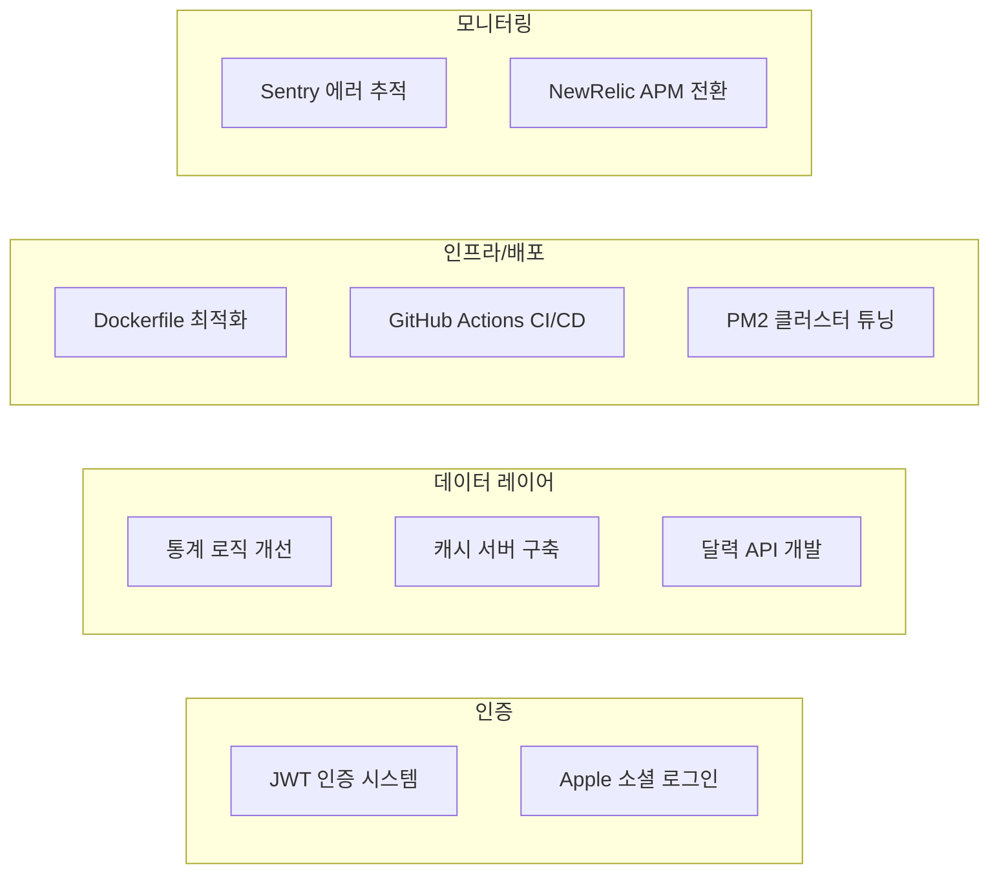

---

## 2. 인증 시스템: JWT 토큰 기반 인증과 Apple 소셜 로그인 구현

### 왜 JWT를 선택했는가

인증 방식을 결정할 때 세션 기반과 토큰 기반을 비교했습니다. 결론적으로 **JWT(JSON Web Token)**를 선택했는데, 가장 큰 이유는 **PM2 클러스터 모드**와의 호환성이었습니다.

| 비교 항목 | 세션 기반 | JWT 토큰 기반 |
|:---|:---|:---|
| **상태 관리** | 서버에 세션 저장 (Stateful) | 토큰에 정보 포함 (Stateless) |
| **클러스터 호환** | 세션 공유 스토어 필요 (Redis 등) | **별도 스토어 불필요** |
| **모바일 앱** | 쿠키 관리 번거로움 | **Authorization 헤더로 간편** |
| **확장성** | 서버 간 세션 동기화 필요 | 토큰 자체가 인증 정보 |

PM2 클러스터 모드에서 여러 워커 프로세스가 요청을 분산 처리하기 때문에, 세션 기반이면 모든 워커가 세션 스토어를 공유해야 합니다. JWT는 토큰 자체에 사용자 정보가 포함되어 있어서 이 문제가 없었습니다. 또한 iOS 앱이 클라이언트였기 때문에 브라우저 쿠키 대신 `Authorization` 헤더로 토큰을 전달하는 방식이 훨씬 자연스러웠습니다.

### AuthService — JWT 생성과 검증

```typescript
// src/auth/auth.service.ts
@Injectable()
export class AuthService {
  constructor(@Inject(authConfig.KEY) private config: ConfigType<typeof authConfig>) {}

  async transformPassword(user: CreateUserDto): Promise<void> {
    user.password = await bcrypt.hash(user.password, 10);
    return Promise.resolve();
  }

  async createJWT(userId: string): Promise<string> {
    const payload = { id: userId };
    return jwt.sign(payload, this.config.secret, {
      expiresIn: "1y",
    });
  }

  verify(jwtString: string) {
    try {
      const payload = jwt.verify(jwtString, this.config.secret) as
        (jwt.JwtPayload | string) & User;
      const { id } = payload;
      return { userId: id };
    } catch (e) {
      throw new HttpException({
        status: HttpStatus.UNAUTHORIZED,
        message: ["User Not Found By JWT"],
        error: "UNAUTHORIZED",
      }, HttpStatus.UNAUTHORIZED);
    }
  }
}
```

**설계 결정 포인트들:**

- **비밀번호 해싱**: `bcrypt`의 salt rounds를 `10`으로 설정했습니다. 보안성과 성능 사이의 트레이드오프인데, 10이면 해싱에 약 100ms 정도 걸립니다. 회원가입/로그인 시에만 실행되므로 충분히 감당 가능한 수준이었습니다.
- **페이로드 최소화**: `{ id: userId }`만 담았습니다. JWT는 Base64 인코딩이라 누구나 디코딩할 수 있기 때문에, 민감 정보(이메일, 닉네임 등)는 넣지 않았습니다.

### JWT 만료 기간 1년, Refresh Token 없는 구조의 선택과 한계

`expiresIn: "1y"`는 보안 리스크를 인지한 상태에서 내린 트레이드오프였습니다.

**당시 판단의 맥락:**

먼저 데이터 유실 측면에서는, 토큰이 만료되더라도 걸음수 데이터가 사라지지는 않습니다. 클라이언트가 마지막 로그인 날짜부터 오늘까지의 걸음수를 배치로 전송하는 구조이기 때문에, 재로그인 후에 밀린 데이터를 일괄 동기화할 수 있었습니다. 서버에서도 `upsert`로 처리하므로 중복 문제도 없었습니다.

그렇다면 왜 1년으로 설정했는가? **재로그인 자체가 이탈 포인트**가 될 수 있다고 판단했기 때문입니다. 토큰이 만료되면 사용자는 앱을 열었을 때 로그인 화면을 만나게 되는데, 이때 "귀찮아서 그냥 안 쓰지"라는 이탈이 걱정됐습니다. Apple Sign-In은 Face ID 한 번이면 되지만, 일반 이메일 가입자는 비밀번호를 기억해야 합니다.

**하지만 이건 Refresh Token으로 해결할 수 있는 문제였습니다.** Access Token을 짧게 설정하고, 클라이언트에서 401 응답 시 Refresh Token으로 자동 갱신하면 사용자는 재로그인을 경험하지 않습니다. 당시에도 이 방식을 알고 있었지만, 구현 범위가 서버와 클라이언트 양쪽에 걸쳐 있었습니다:

| 구현 항목 | 담당 | 설명 |
|:---|:---|:---|
| Refresh Token 저장소 | 서버 | Redis 또는 DB에 토큰 저장/관리 |
| 토큰 갱신 API | 서버 | `/auth/refresh` 엔드포인트 추가 |
| 401 자동 갱신 인터셉터 | **iOS** | 만료 시 Refresh → 원래 요청 재시도 |
| Token Rotation | 서버 | 갱신 시 Refresh Token도 재발급 |
| 토큰 무효화 | 서버 | 로그아웃/비밀번호 변경 시 폐기 |

백엔드 2명, iOS 1명인 팀에서 출시 일정을 맞추면서 **서버-클라이언트 양쪽의 변경**을 동시에 진행하기엔 현실적으로 어려웠습니다. 

결국 "**출시 후 사용자가 늘면 Refresh Token을 추가하자**"는 판단을 내렸고, 그 사이의 보안 리스크는 `AuthGuard`의 매 요청 DB 조회로 부분적으로 커버하기로 했습니다.

**이 선택의 보안 리스크는 명확했습니다:**

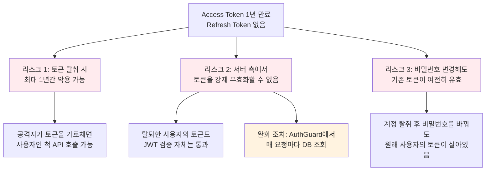

리스크 2에 대해서는 `AuthGuard`에서 **매 요청마다 DB에서 사용자 존재 여부를 조회**하는 것으로 부분적으로 방어했습니다. JWT의 Stateless 장점을 일부 포기한 셈이지만, 탈퇴/차단된 사용자의 API 호출을 막으려면 이 검증이 필요했습니다. 다만 리스크 1, 3은 이 방법으로 커버되지 않았고, 서비스가 장기 운영됐다면 반드시 해결해야 할 부분이었습니다.

**지금 다시 설계한다면:**

| 항목 | 당시 구현 | 개선 방향 |
|:---|:---|:---|
| **Access Token 만료** | 1년 | **15분 ~ 1시간** |
| **Refresh Token** | 없음 | **Redis에 저장, 2주 만료** |
| **토큰 갱신** | 없음 | **iOS 인터셉터에서 401 시 자동 갱신** |
| **토큰 무효화** | 불가 (DB 조회로 우회) | **Redis에서 Refresh Token 삭제** |
| **Rotation** | 없음 | **갱신 시 Refresh Token도 재발급** |

Refresh Token 방식이면 사용자 경험은 동일하게 유지하면서 토큰 탈취 피해를 15분~1시간으로 제한할 수 있습니다. 서비스 초기라도 인증은 처음부터 제대로 설계하는 게 맞았다고 생각합니다. "나중에 개선하자"는 판단은 결국 제 참여 기간 내에 실행되지 못했습니다.

### AuthGuard — 라우트 보호

NestJS의 `CanActivate` 인터페이스를 구현해서, 보호가 필요한 모든 API에 `@UseGuards(AuthGuard)`를 붙이는 방식으로 인증을 적용했습니다:

```typescript
// src/auth.guard.ts
@Injectable()
export class AuthGuard implements CanActivate {
  constructor(
    private readonly authService: AuthService,
    private readonly userService: UserService,
  ) {}

  async canActivate(context: ExecutionContext) {
    try {
      const request = context.switchToHttp().getRequest();
      const userId = this.validateRequest(request);
      const user: User = await this.userService.getUserInfo(userId, true);
      if (!user) { return false; }
      request.headers.user = { id: user.id };
      return true;
    } catch (e) { throw e; }
  }

  private validateRequest(request: Request) {
    try {
      const jwtString = request.headers.authorization.split("Bearer ")[1];
      const { userId } = this.authService.verify(jwtString);
      return userId;
    } catch (e) {
      if (e instanceof TypeError) {
        throw new HttpException({
          status: HttpStatus.NOT_FOUND,
          message: ["No 'Authorization' Header Found"],
          error: "Not Found",
        }, HttpStatus.UNAUTHORIZED);
      } else { throw e; }
    }
  }
}
```

AuthGuard의 동작 흐름은 다음과 같습니다:

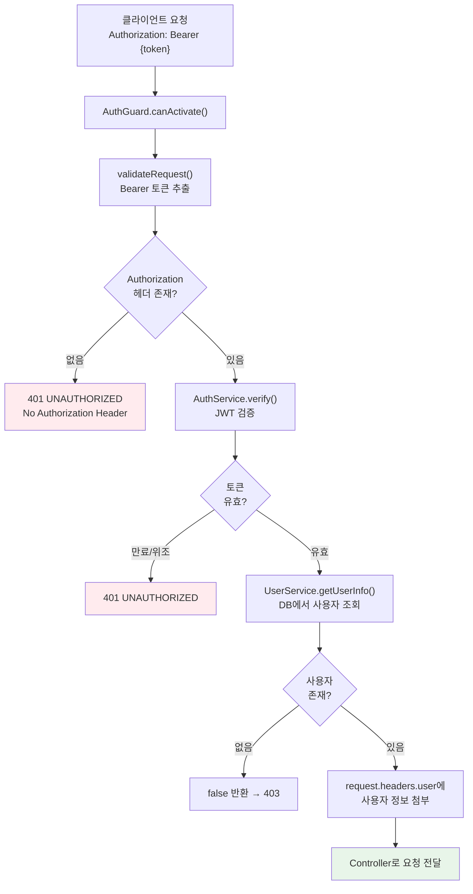

**여기서 고민했던 점**은 `getUserInfo()` 호출이 **매 요청마다 DB 조회**를 발생시킨다는 것이었습니다. [앞서 JWT 섹션](#jwt-만료-기간-1년-refresh-token-없는-구조의-선택과-한계)에서 언급한 "서버 측에서 토큰을 강제 무효화할 수 없는" 문제를 이 DB 조회로 부분적으로 방어하는 구조입니다. 사용자 수가 더 많았다면 Redis에 사용자 존재 여부를 캐싱하는 방식을 고려했을 것 같습니다.

### 회원가입 플로우

회원가입 시 단순히 사용자만 생성하는 게 아니라, **통계 초기화 → 기본 하우스 입장 → JWT 발급 → 캐릭터 지급**까지 여러 서비스를 연쇄 호출하는 구조였습니다:

```typescript
// src/user/user.service.ts
async create(createUserDto: CreateUserDto): Promise<userToken> {
  const result: userToken = { created: true, accessToken: "" };
  await this.authService.transformPassword(createUserDto);        // 1. 비밀번호 해싱
  const createdUser = await this.prisma.user.create({             // 2. User 생성
    data: { ...createUserDto, nickname: createUserDto.userId },
  });
  await this.logService.createUserStats(createdUser.id);          // 3. UserStats 초기화
  await this.houseSerivce.enterHouse(111111, createdUser.id);     // 4. 기본 하우스 입장
  result.accessToken = await this.authService.createJWT(createdUser.id);  // 5. JWT 발급
  if (process.env.NODE_ENV === "production") {
    discoard(createdUser.userId);                                 // 6. Discord 알림
  }
  await this.charlieService.mintCharlie(createdUser.id);          // 7. 기본 캐릭터 지급
  return result;
}
```

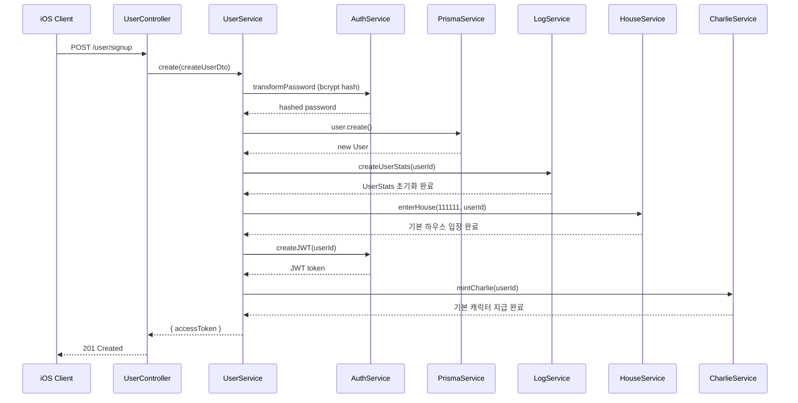

**기본 하우스(code: 111111)**: 모든 사용자가 가입하면 자동으로 입장하는 공용 하우스입니다. "소셜" 앱인데 처음 가입하면 친구가 아무도 없어서 쓸쓸할 수 있으니, 모든 사용자가 공유하는 하우스를 만들어서 바로 랭킹 경쟁을 경험할 수 있게 했습니다.

**Discord 웹훅 알림**: Production 환경에서만 신규 가입자가 생기면 Discord 채널에 알림을 보냈습니다. 초기 스타트업이라 "오늘 몇 명이 가입했나"를 실시간으로 확인하는 게 팀 분위기에 중요했거든요.

### Apple 소셜 로그인

iOS 앱이다 보니 Apple Sign-In 지원은 필수였습니다. `apple-signin-auth` 라이브러리를 사용해서 구현했습니다.

**Apple Client Secret 자동 생성:**

```typescript
// src/apple/apple.strategy.ts
@Injectable()
export class appleSignConfig {
  constructor(
    @Inject(appleConfig.KEY) private config: ConfigType<typeof appleConfig>,
  ) {}

  init() {
    const clientSecret = appleSignin.getClientSecret({
      clientID: this.config.APPLE_CLIENTID,
      teamID: this.config.APPLE_TEAMID,
      keyIdentifier: this.config.APPLE_KEYID,
      privateKey: this.config.APPLE_PRIVATE_KEY.replace(/\\n/gm, '\n'),
      expAfter: 15777000,  // 약 6개월
    });
    return clientSecret;
  }
}
```

Apple Sign-In에서 가장 까다로웠던 부분은 **Private Key 관리**였습니다. Apple Developer Console에서 다운받은 `.p8` 파일의 내용을 환경변수로 넘겨야 하는데, 줄바꿈(`\n`)이 포함된 PEM 형식이라 환경변수에 그대로 넣으면 깨지는 문제가 있었습니다. `.replace(/\\n/gm, '\n')`으로 이스케이프된 줄바꿈을 실제 줄바꿈으로 변환하는 처리를 추가했습니다.

**Authorization Code → 토큰 교환 → ID Token 검증:**

```typescript
// src/apple/apple.service.ts
@Injectable()
export class AppleService {
  async getAuthorizationToken(authorizationCode: string) {
    const options = {
      clientID: this.config.APPLE_CLIENTID,
      redirectUri: this.config.APPLE_CALLBACK,
      clientSecret: this.appleSecret.init(),
    };
    const tokenResponse = await appleSignin.getAuthorizationToken(
      authorizationCode, options
    );
    if (tokenResponse.refresh_token) {
      return tokenResponse;
    } else {
      throw new HttpException(/* ... */, HttpStatus.UNAUTHORIZED);
    }
  }

  async verifyIdToken(identityToken: string) {
    const verifyResponse = await appleSignin.verifyIdToken(identityToken, {
      audience: this.config.APPLE_CLIENTID,
      ignoreExpiration: true,
    });
    return verifyResponse;
  }
}
```

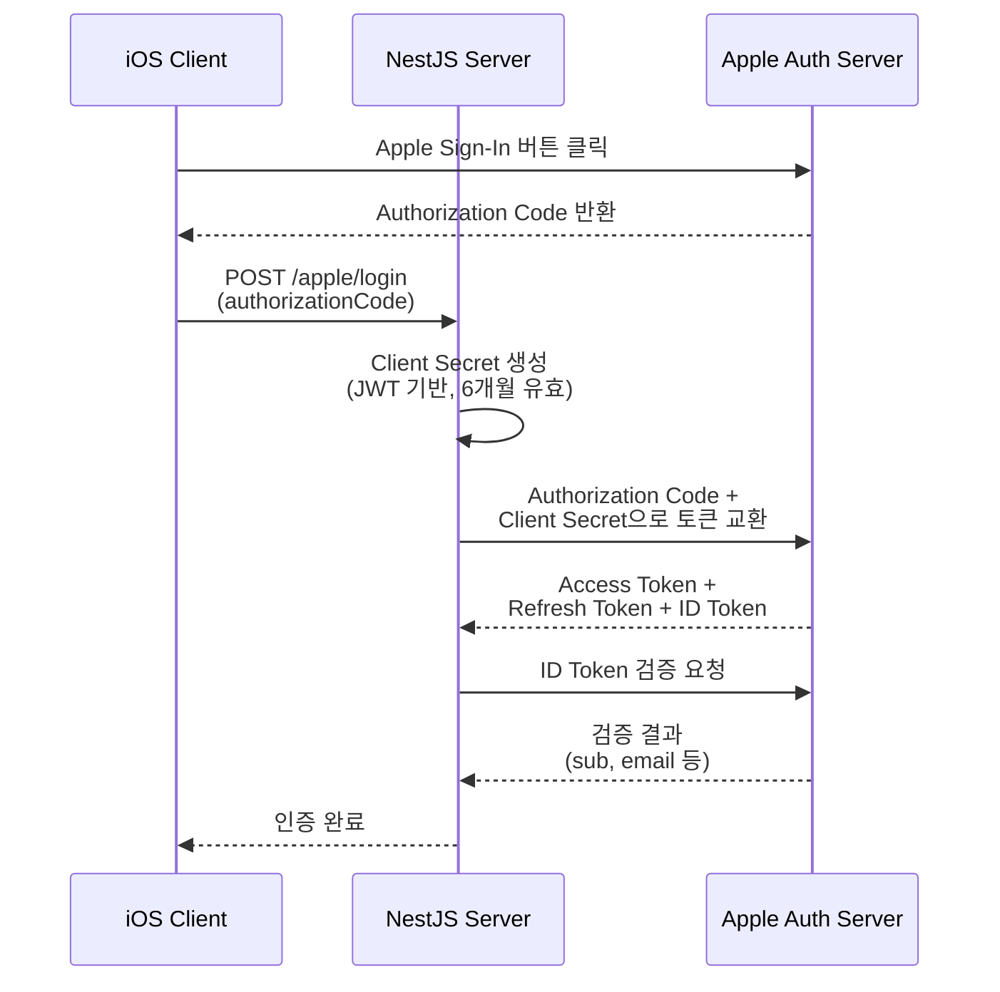

Apple Sign-In 구현에서 고민했던 점들:

- **`ignoreExpiration: true`**: ID Token 검증 시 만료 시간을 무시하도록 설정했습니다. 네트워크 지연이나 시간차로 인해 검증 시점에 이미 만료되는 경우가 있었기 때문입니다.
- **Client Secret 갱신**: Apple Client Secret은 최대 6개월까지 유효한데, 서버가 재시작될 때마다 `init()`으로 새로 생성하는 방식으로 처리했습니다. 만료된 secret으로 토큰 교환을 시도하면 Apple 서버에서 에러가 반환됩니다.
- **환경변수 관리**: `APPLE_CLIENTID`, `APPLE_TEAMID`, `APPLE_KEYID`, `APPLE_PRIVATE_KEY` 총 4개의 환경변수를 GitHub Secrets와 Docker build-args로 관리했습니다. 특히 Private Key는 여러 줄짜리 문자열이라 환경변수 설정 시 주의가 필요했습니다.

---

## 3. 사용자 통계 로직 개선: 증분 집계에서 전체 재계산으로의 전환

이 섹션이 제가 가장 많은 시간을 들인 부분입니다. 사용자 통계(누적 걸음수, 주간 걸음수, 최대 일일 걸음수 등)를 어떻게 집계할 것인가에 대한 고민이었습니다.

### 배경: 걸음수 데이터 흐름

서비스의 핵심 데이터 흐름은, 클라이언트(iOS)에서 며칠치 걸음수를 모아서 한 번에 `POST /log`로 보내는 **Write-Behind 배치 전송** 방식이었습니다. 각 걸음수 기록은 Prisma의 `upsert`로 DB에 저장되고, `@@unique([date, userId])`로 날짜+사용자 조합의 유일성을 보장했습니다.

```prisma
// prisma/schema.prisma
model Log {
  id        Int           @id @default(autoincrement())
  date      DateTime      @default(now())
  steps     Int
  level     Level
  initLevel Log_initLevel
  userId    String
  loggedIn  Boolean
  user      User          @relation(fields: [userId], references: [id], onDelete: Cascade)

  @@unique([date, userId], name: "userDate")
  @@index([userId], map: "Log_userId_fkey")
}
```

이 Log 데이터를 기반으로 사용자 통계를 계산해야 했는데, 여기서 문제가 시작됐습니다.

### 레벨 계산 규칙: 걸음수 → 캐릭터 건강 상태

통계 문제를 이야기하기 전에, 핵심 비즈니스 로직인 **레벨 계산**을 먼저 설명해야 할 것 같습니다. 레벨은 로그가 생성되는 시점에 두 단계로 계산됩니다.

**1단계 — initLevel 계산** (전날 로그 기준):

```typescript
// src/log/log.service.ts
private calculateCurrentInitLevel(previousLog: Log): Level {
  let currentInitLevelIndex: number;
  const previousLevel = previousLog ? previousLog.level : "overweight";
  const previousLevelIndex = Object.keys(Level).indexOf(previousLevel);
  if (previousLog) {
    if (previousLog.steps < 6000) {
      // 전날 6000보 미만이면 레벨 1단계 하락
      currentInitLevelIndex = previousLevelIndex > 0
        ? previousLevelIndex - 1 : previousLevelIndex;
    }
  }
  currentInitLevelIndex = currentInitLevelIndex !== undefined
    ? currentInitLevelIndex : previousLevelIndex;
  return Level[Object.keys(Level)[currentInitLevelIndex]];
}
```

전날 걸음수가 **6,000보 미만**이면 레벨이 1단계 하락합니다. `Level` enum은 `veryObese(0) → obese(1) → overweight(2) → healthy(3) → veryHealthy(4)` 순서라서, 인덱스를 1 줄이는 것이 곧 하락입니다.

**2단계 — level 계산** (오늘 걸음수 기준):

```typescript
// src/log/log.service.ts
private calculateLevel(currentLog: LogEntity): Level {
  let currentLevelIndex: number;
  const currentInitLevelIndex = Object.keys(Level).indexOf(currentLog.initLevel);
  if (currentLog.steps >= 10000) {
    // 오늘 10000보 이상이면 레벨 1단계 상승
    currentLevelIndex = currentInitLevelIndex < 4
      ? currentInitLevelIndex + 1 : currentInitLevelIndex;
  } else {
    currentLevelIndex = currentInitLevelIndex;
  }
  return Level[Object.keys(Level)[currentLevelIndex]];
}
```

오늘 걸음수가 **10,000보 이상**이면 레벨이 1단계 상승합니다.

이 두 규칙을 예시로 보면:

| 시나리오 | 전날 상태 | 오늘 걸음수 | initLevel 계산 | level 계산 |
|:---|:---|:---|:---|:---|
| **A: 전날 부족 → 하락** | steps=5,000, level=healthy | 9,000 | healthy→**overweight** (6000 미만→하락) | overweight 유지 (10000 미만) |
| **B: 오늘 충분 → 상승** | steps=7,000, level=overweight | 10,500 | overweight 유지 (6000 이상) | overweight→**healthy** (10000 이상→상승) |

### 로그 생성 시 핵심 고민: 동일 날짜 재업로드 대응

이 레벨 계산이 복잡해지는 건, 클라이언트가 **같은 날짜의 걸음수를 여러 번 전송**할 수 있기 때문이었습니다. 앱 재실행, 네트워크 재시도, 며칠치 일괄 전송 등의 상황에서 동일 날짜 로그가 다시 들어올 수 있었는데요.

이 문제를 `create()` 메서드에서 이렇게 대응했습니다:

```typescript
// src/log/log.service.ts — create() 메서드 핵심 부분
const currentLogExist = await this.prisma.log.findFirst({
  where: { userId: userId, date: log.date },
});

// 같은 날짜 로그가 이미 있으면 → 걸음수는 더 큰 값으로 갱신
if (currentLogExist) {
  log.steps = log.steps > currentLogExist.steps ? log.steps : currentLogExist.steps;
}

// 이전 로그 조회 시, 같은 날짜 로그가 있으면 offset=1로 "진짜 전날"을 찾음
const previousLogList = await this.findByUserId(
  "service", userId, "1",
  currentLogExist ? "1" : "0",  // ← 핵심: offset으로 전날 로그 참조
  "desc"
);
const previousLog = previousLogList[0];
log.initLevel = this.calculateCurrentInitLevel(previousLog);
log.level = this.calculateLevel(log);
```

여기서 제가 가장 오래 고민한 부분은 **`offset` 처리**였습니다. 같은 날짜 로그가 이미 DB에 있을 때, 가장 최근 로그를 가져오면 "오늘 로그"가 잡히게 됩니다. 그래서 `offset=1`을 적용해서 "**진짜 전날 로그**"를 기준으로 initLevel을 계산하도록 했습니다. 이 offset 하나 때문에 **레벨 계산의 일관성**이 유지되었습니다.

또한 걸음수는 기존 값과 새 값을 비교해 **더 큰 값을 취하는 로직**으로 **하루의 최고 활동량**을 반영하도록 했습니다. 아침에 3,000보를 기록하고 저녁에 12,000보를 기록하면, 최종 값은 12,000이 됩니다.

이 로직을 설계하면서 느낀 점은, **운영 환경에서는 데이터가 항상 깔끔하게 들어오지 않는다**는 것이었습니다. 정상적인 흐름만 생각하면 간단한 문제인데, 중복/재전송/순서 뒤섞임까지 고려하면 복잡도가 크게 올라갔습니다.

### Before: 증분(Incremental) 통계 — 처음엔 당연한 선택이었습니다

처음에는 `UserStats` 테이블에 미리 계산된 통계를 저장하고, 새 로그가 들어올 때마다 차분만 더하는 O(1) 방식을 사용했습니다:

```prisma
// prisma/schema.prisma
model UserStats {
  id                 Int      @id @default(autoincrement())
  accumSteps         Int              // 누적 걸음수
  maxDailySteps      Int              // 최대 일일 걸음수
  maxLoginStreak     Int      @default(1)
  todaySteps         Int      @default(0)
  weeklySteps        Int      @default(0)
  lastLoggedInDate   DateTime
  reachedVeryHealthy Boolean
  reachedVeryObese   Boolean
  userId             String   @unique
  user               User     @relation(fields: [userId], references: [id], onDelete: Cascade)
}
```

증분 업데이트 로직은 7개 통계 필드 각각에 대해 헬퍼 메서드가 있었습니다. 예를 들어 `updateWeeklySteps` 하나만 봐도 이렇게 복잡했습니다:

```typescript
// src/log/log.service.ts (현재 주석 처리됨)
updateWeeklySteps(weeklySteps, log, todayLogSteps, lastedLogSteps, sameDateUpdated, caller) {
  let todayIsMonday;
  if (caller === "migrate") {
    todayIsMonday = moment(log.date).day() === 1;
  } else {
    todayIsMonday = moment().day() === 1;
  }
  if (todayIsMonday) {
    weeklySteps = caller === "migrate" ? log.steps : todayLogSteps;
  } else {
    if (sameDateUpdated) {
      const stepDiff = log.steps > lastedLogSteps ? log.steps - lastedLogSteps : 0;
      weeklySteps = weeklySteps + stepDiff;
    } else {
      weeklySteps = weeklySteps + log.steps;
    }
  }
  return weeklySteps;
}
```

`caller`라는 문자열 파라미터로 "API 호출인지 마이그레이션인지"를 구분하는 것부터가 코드 스멜이었는데, 당시에는 "일단 돌아가니까" 넘어갔습니다.

### 무너지기 시작한 순간

서비스 출시 후 한 달쯤 지나니까 "통계가 이상하다"는 제보가 들어오기 시작했습니다:

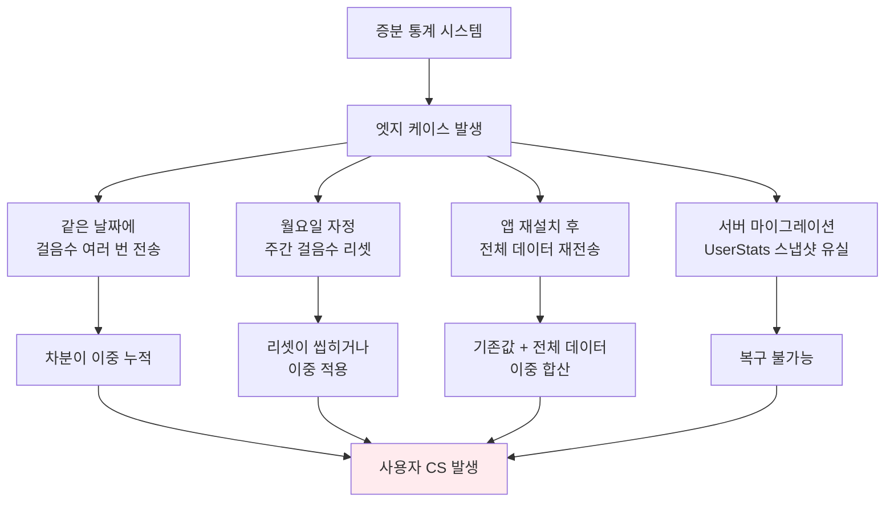

**구체적인 예를 들어보겠습니다.** 사용자가 3일치 걸음수를 정상 기록한 상태에서:

```
D1(월): steps=4,000
D2(화): steps=8,000
D3(수): steps=9,000
```

이후 앱 재시작 등으로 **D2 로그가 더 큰 값으로 재업로드**되면:

| 시점 | 증분 방식 (Before) | 전체 재계산 (After) |
|:---|:---|:---|
| 정상 기록 | accumSteps = 4,000+8,000+9,000 = **21,000** | 동일 |
| D2 재업로드 (10,000보) | 기존 21,000 + 10,000 = **31,000** ❌ | 4,000+10,000+9,000 = **23,000** ✅ |

증분 방식에서는 **재업로드된 로그가 기존 누적값에 그대로 더해져서** 실제보다 8,000보나 더 많은 31,000이 됩니다. 이런 오차가 주간 걸음수, 연속 로그인 등 7개 필드 전부에서 발생할 수 있었습니다.

| 엣지 케이스 | 원인 | 증상 |
|:---|:---|:---|
| 같은 날짜에 걸음수 여러 번 전송 | `sameDateUpdated` 판단 로직 오류 | 차분이 이중 누적 |
| 월요일 자정 전후 sync | `todayIsMonday`가 API 호출 시점 기준 | 주간 리셋 누락 or 이중 적용 |
| 앱 재설치 후 전체 재전송 | 이미 누적된 UserStats에 전체 데이터 합산 | 통계 2배 |
| 서버 마이그레이션 | Log만으로는 UserStats 스냅샷 복원 불가 | 데이터 유실 |

7개 통계 필드 × 여러 엣지 케이스의 조합은 관리할 수 없는 복잡도였습니다. 한 필드를 고치면 다른 필드가 깨지는 두더지 잡기가 반복됐습니다.

### After: 전체 재계산(Full Recalculation)으로 전환

결국 `updateUserStats()`를 주석 처리하고, 통계를 **요청할 때마다 Log 테이블에서 전체 재계산**하는 `calcUserStats()`로 교체했습니다:

```typescript
// src/log/log.service.ts
async calcUserStats(userId: string): Promise<UserStatsEntity> {
  const thisWeekStartDate = moment().startOf("isoWeek").format("YYYY-MM-DD");
  const userLogs = await this.findByUserId("service", userId, "10000", "0", "asc");
  let accumSteps = 0, maxDailySteps = 0, todaySteps = 0,
      weeklySteps = 0, maxLoginStreak = 0,
      reachedVeryObese = false, reachedVeryHealthy = false,
      logStreak = 0;
  userLogs.forEach((log: Log) => {
    const logDate = new Date(log.date).toJSON().split("T")[0];
    accumSteps = accumSteps + log.steps;
    maxDailySteps = maxDailySteps > log.steps ? maxDailySteps : log.steps;
    logStreak = log.loggedIn ? logStreak + 1 : 0;
    maxLoginStreak = logStreak > maxLoginStreak ? logStreak : maxLoginStreak;
    if (!reachedVeryObese) {
      reachedVeryObese = log.level === "veryObese" ? true : false;
    }
    if (!reachedVeryHealthy) {
      reachedVeryHealthy = log.level === "veryHealthy" ? true : false;
    }
    if (logDate === moment().format("YYYY-MM-DD")) {
      todaySteps = log.steps;
    }
    if (logDate >= thisWeekStartDate) {
      weeklySteps = weeklySteps + log.steps;
    }
  });
  return { accumSteps, maxDailySteps, todaySteps, weeklySteps,
           maxLoginStreak, reachedVeryObese, reachedVeryHealthy };
}
```

반환하는 필드들은 `UserStats` 인터페이스에 정의되어 있습니다:

```typescript
// src/log/entities/log.entity.ts
export interface UserStats {
  accumSteps: number;       // 누적 걸음수
  maxDailySteps: number;    // 최대 일일 걸음수
  todaySteps: number;       // 오늘 걸음수
  weeklySteps: number;      // 주간 걸음수
  maxLoginStreak: number;   // 최대 연속 로그인
  reachedVeryObese: boolean;    // veryObese 도달 여부 (캐릭터 해금)
  reachedVeryHealthy: boolean;  // veryHealthy 도달 여부 (캐릭터 해금)
}
```

이 로직의 흐름을 다이어그램으로 표현하면:

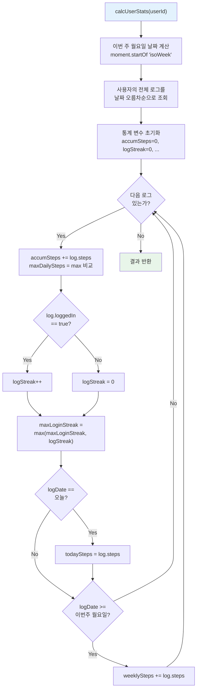

### 왜 전체 재계산을 선택했는가

|  | 증분 방식 | 전체 재계산 |
|:---|:---|:---|
| **시간 복잡도** | O(1) per write | O(N) per read |
| **정확성** | 엣지 케이스에서 부정확 | **항상 정확** |
| **코드 복잡도** | 높음 (7필드 × 조건분기 × caller분기) | **낮음** (단순 합산 루프) |
| **추가 테이블** | UserStats 필요 | 불필요 |
| **장애 복구** | 스냅샷 유실 시 복구 불가 | **Log만 있으면 언제든 복구** |
| **실측 성능** | — | **200ms 이내** |

"O(N)이면 너무 느리지 않을까?"라는 걱정이 가장 컸는데, 실측해보니:
- 1년 활동 사용자: 하루 1건 × 365일 = **365건** 순회
- `forEach` + 단순 합산/비교 = 메모리 내 연산 → **수 ms**
- DB 조회가 병목이지만 `@@index([userId])` 인덱스 스캔 → 빠른 조회
- 전체 API 응답: **200ms 이내**

스타트업에서 O(N) 성능 비용보다 **버그로 인한 사용자 이탈 비용이 훨씬 컸습니다.** 전환 후 통계 관련 CS는 **0건**이 됐습니다. "추측하지 말고, 측정하라"는 말을 이때 처음으로 진짜 실감했습니다.

### maxLogStreak 버그 수정

`calcUserStats()` 전환 후에도 한 가지 버그를 더 잡아야 했습니다. `logStreak`과 `maxLoginStreak`의 분리 문제였는데요:

| 날짜 | loggedIn | Before (버그) | After (수정) |
|:---|:---|:---|:---|
| 10/01 | true | streak=1 | streak=1, **max=1** |
| 10/02 | true | streak=2 | streak=2, **max=2** |
| 10/03 | false | streak=0 | streak=0, **max=2 유지** |
| 10/04 | true | streak=1, maxLoginStreak=**1** ❌ | streak=1, maxLoginStreak=**2** ✅ |

핵심은 `logStreak`(현재 연속)과 `maxLoginStreak`(역대 최대)를 분리하는 것이었습니다:

```typescript
logStreak = log.loggedIn ? logStreak + 1 : 0;
maxLoginStreak = logStreak > maxLoginStreak ? logStreak : maxLoginStreak;
```

`loggedIn`이 `false`인 날이 나오면 `logStreak`은 0으로 초기화되지만, `maxLoginStreak`은 이전까지의 최대값을 보존합니다.

### reachedVery* 필드 추가

특정 레벨에 도달하면 캐릭터가 해금되는 게임적 요소가 있었는데, 이를 위해 `reachedVeryObese`와 `reachedVeryHealthy` 가드 로직을 추가했습니다:

```typescript
if (!reachedVeryObese) {
  reachedVeryObese = log.level === "veryObese" ? true : false;
}
if (!reachedVeryHealthy) {
  reachedVeryHealthy = log.level === "veryHealthy" ? true : false;
}
```

| 시나리오 | `!reachedVeryObese` 가드 없이 | 가드 있을 때 |
|:---|:---|:---|
| log[0]: level=veryObese | `true` | `true` |
| log[1]: level=overweight | `false` ❌ (덮어쓰기) | `true` ✅ (유지) |
| log[2]: level=healthy | `false` ❌ | `true` ✅ |

가드가 없으면 가장 마지막 로그의 레벨에 의해 결과가 결정돼서, "과거에 도달했지만 현재는 아닌" 상태를 추적할 수 없었습니다.

---

## 4. 달력 기능: 월별 로그 그루핑 API 개발과 Locale 버그 수정

### Calendar View API

사용자의 걸음수 기록을 월별 달력 형태로 보여주는 API를 개발했습니다. 로그 데이터를 월별로 그루핑하고, 각 월의 메타 정보를 함께 반환합니다:

```typescript
// src/log/log.service.ts
async getByCalendar(userId: string): Promise<any> {
  const logs = await this.prisma.log.findMany({
    where: { userId },
    select: { level: true, initLevel: true, id: true, steps: true, userId: true, loggedIn: true, date: true },
    orderBy: { date: "asc" },
  });
  const result = logs.reduce((result, value) => {
    value["formattedDate"] = `${value.date.toLocaleString("en-US", {
      month: "long",
    })} ${value.date.getDate()}, ${value.date.getFullYear()}`;
    const month = value["formattedDate"].split(" ")[0] + " " + value["formattedDate"].split(" ")[2];
    const existMonth = result.find((c) => c.info.month === month);
    if (existMonth === undefined) {
      let calendar = {};
      const momentMonth = moment(value["date"]);
      const firstLogDate = moment(momentMonth.startOf("month")).isBefore(value.date)
        || moment(momentMonth.startOf("month")).isSame(value.date)
        ? moment(value["date"]).date() : null;
      const startDayOfMonth = momentMonth.startOf("month").weekday();
      const endDateOfMonth = momentMonth.endOf("month").date();
      calendar["info"] = { month, startDayOfMonth, endDateOfMonth, firstLogDate };
      calendar["logs"] = [];
      result.push(calendar);
    }
    delete value.date;
    const sameMonthCalendar = result.find((c) => c.info.month === month);
    sameMonthCalendar.logs.push(value);
    return result;
  }, []);
  return { calendar: result };
}
```

각 월의 `startDayOfMonth`(시작 요일), `endDateOfMonth`(마지막 날짜), `firstLogDate`(첫 로그 날짜)를 함께 반환해서 iOS 클라이언트에서 달력 UI를 렌더링할 때 사용합니다.

### 월 시작일 버그 수정

달력 계산에서 **주 시작일이 일요일(moment 기본값)로 설정되어 있어서** 한국 사용자에게 달력이 어긋나는 버그가 있었습니다:

| | Before | After |
|:---|:---|:---|
| 주 시작일 | 일요일 (moment 기본값) | **월요일 (ISO 8601)** |
| 설정 | 없음 (기본값 사용) | `moment.updateLocale("ko", { week: { dow: 1 } })` |
| 영향 범위 | 달력 UI 어긋남 | 달력 정상 + `calcUserStats`의 주간 걸음수도 월요일 기준 |

```typescript
// src/log/log.service.ts 상단
import * as moment from "moment-timezone";
moment.updateLocale("ko", {
  week: {
    dow: 1,  // 0=일요일, 1=월요일
  },
});
```

이 설정은 `startOf("isoWeek")`에도 영향을 주기 때문에, `calcUserStats()`의 주간 걸음수 계산에서도 월요일 기준으로 정확하게 동작하게 됩니다.

---

## 5. 캐시 서버 구축: Redis OM 기반 Cache-Aside 패턴으로 N+1 쿼리 해결

### 문제 상황: N+1 쿼리

서비스에서 가장 인기 있었던 기능은 "하우스" 랭킹이었습니다. 하우스 조회 시 각 멤버의 주간 걸음수를 계산해서 랭킹을 보여줘야 하는데, 멤버 목록을 가져오는 **1번 쿼리** + 각 멤버마다 `calcUserStats()`를 호출하는 **N번 쿼리** = **N+1 쿼리 문제**가 있었습니다.

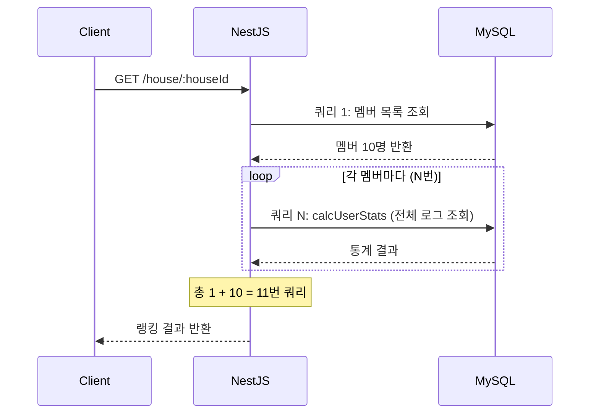

사용자가 적을 때는 괜찮았지만, App Store 1위를 달성하면서 피크 시간에 응답이 **수 초까지 느려지기 시작**했습니다. NewRelic APM에서 하우스 조회 API의 DB 쿼리 시간이 비정상적으로 높은 것을 확인할 수 있었습니다.

### 기술 선정: 왜 Redis + Cache-Aside인가

| 옵션 | 장점 | 단점 | 판단 |
|:---|:---|:---|:---|
| **인메모리 캐시** (Map) | 구현 간단, 외부 의존성 없음 | PM2 클러스터 간 공유 불가 | ❌ |
| **Redis + Cache-Aside** | 프로세스 간 공유, 정렬/검색 지원 | 외부 인프라 추가 필요 | ✅ |
| **DB 쿼리 최적화** | 인프라 변경 없음 | N+1 구조 대규모 리팩토링 필요 | ⏳ |

Redis를 선택한 결정적 이유는 **PM2 클러스터 모드**였습니다. `instances: 0`으로 여러 워커 프로세스가 돌아가고 있었기 때문에, 인메모리 캐시(예: `Map`)는 프로세스마다 따로 관리해야 해서 일관성 문제가 있었습니다. 워커 A에서 캐시를 갱신해도 워커 B에서는 여전히 오래된 데이터를 읽는 상황이 발생할 수 있었거든요. Redis는 외부 프로세스이므로 모든 워커가 동일한 캐시를 공유할 수 있었습니다.

또 하나 고민했던 점은 **단순 key-value 캐싱이 아니라 "정렬된 랭킹"이 필요**했다는 것입니다. 일반적인 Redis `GET/SET`으로는 랭킹 정렬을 할 수 없어서, Redis OM(`redis-om` v0.3.6)을 도입했습니다. Redis OM은 RediSearch 모듈을 활용해서 필드 단위 검색과 **인덱스 기반 정렬**을 지원합니다. 처음에는 Redis Sorted Set을 고려했지만, 사용자별 여러 필드(nickname, charlieImageNo 등)를 함께 저장해야 했기 때문에 Redis OM의 Entity 모델이 더 적합했습니다.

### Cache-Aside 패턴 구현

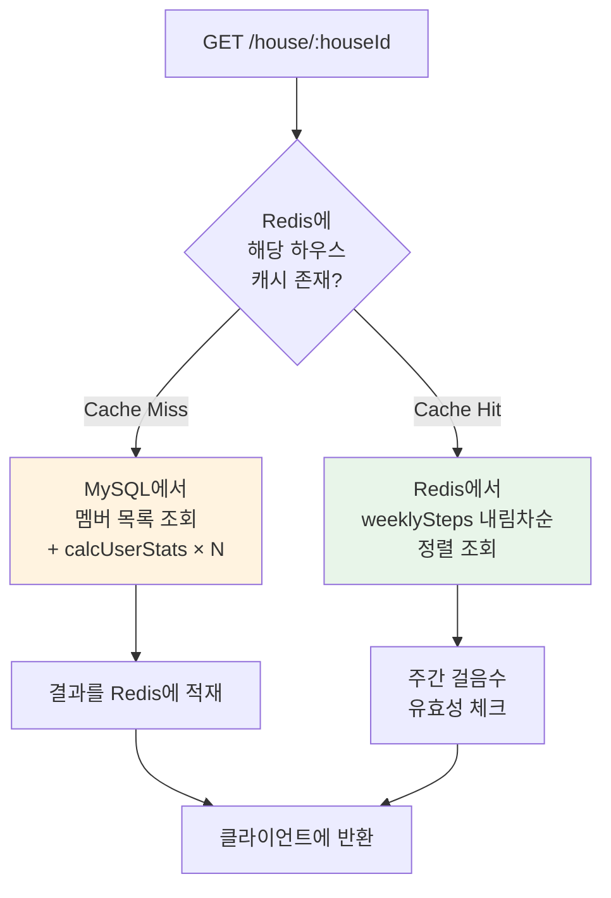

### Redis OM 스키마 설계

일반 Redis는 key-value 저장소라서 복잡한 쿼리가 어렵지만, **Redis OM(Object Mapping)**을 사용하면 RediSearch 모듈을 활용해서 필드 단위 검색과 정렬이 가능합니다:

```typescript
// dist/cache/houseUser.repository.js (원본 TS 소스에서 복원)
const houseUserSchema = new Schema(HouseUser, {
  userId: { type: "string" },
  charlieImageNo: { type: "string" },
  weeklySteps: { type: "number", sortable: true },  // ← 핵심!
  houseId: { type: "number" },
  lastLoggedDate: { type: "string" },
  nickname: { type: "string" },
});
```

| 필드 | 타입 | 설명 |
|:---|:---|:---|
| `userId` | string | 사용자 식별자 |
| `weeklySteps` | number, **sortable** | 주간 걸음수 — Redis 내 정렬 인덱스 생성 |
| `houseId` | number | 하우스 식별자 — 검색 조건으로 사용 |
| `lastLoggedDate` | string | 마지막 로그 날짜 — 캐시 유효성 체크에 사용 |

`weeklySteps: { type: "number", sortable: true }`가 핵심입니다. `sortable: true`로 설정하면 Redis 내부적으로 해당 필드에 대한 **정렬 인덱스**를 생성합니다. 이 덕분에 `.sortDescending("weeklySteps")`으로 Redis 안에서 바로 랭킹 정렬이 가능합니다.

### 캐시 서비스 주요 메서드

**Cache Hit — Redis에서 정렬된 랭킹 조회:**

```typescript
// dist/cache/cache.service.js (원본 TS 소스에서 복원)
async getHouseUsers(houseId) {
  await this.houseUserRepository.createIndex();
  const townUsers = await this.houseUserRepository.search()
    .where("houseId").eq(houseId)
    .sortDescending("weeklySteps")  // Redis 내부에서 정렬!
    .return.all();
  const townUserJsonList = [];
  for (const townUser of townUsers) {
    townUser.updateUserSteps;       // 주간 걸음수 유효성 체크
    const townUserJson = townUser.toJSON();
    townUserJson.rank = townUsers.indexOf(townUser) + 1;
    townUserJsonList.push(townUserJson);
  }
  return townUserJsonList;
}
```

SQL로 치면 `SELECT * FROM houseUsers WHERE houseId = ? ORDER BY weeklySteps DESC`에 해당하는 쿼리를 **Redis 안에서 바로 수행**합니다.

**주간 걸음수 유효성 체크:**

```typescript
// dist/cache/houseUser.repository.js (원본 TS 소스에서 복원)
class HouseUser extends Entity {
  get updateUserSteps() {
    const thisWeekStartDate = moment().startOf("isoWeek").format("YYYY-MM-DD");
    this.weeklySteps = moment(this.lastLoggedDate).format("YYYY-MM-DD") >= thisWeekStartDate
      ? this.weeklySteps
      : 0;  // 지난 주 데이터면 0으로 처리
    return;
  }
}
```

`lastLoggedDate`가 이번 주 월요일 이전이면 `weeklySteps`를 0으로 처리합니다. 캐시에 저장된 값이 지난 주 데이터일 수 있기 때문입니다.

**Cache Miss — DB 조회 후 Redis에 적재:**

```typescript
// dist/cache/cache.service.js (원본 TS 소스에서 복원)
async initHouseUsers(houseId, houseUsers) {
  let count = 0;
  for await (const houseUser of houseUsers) {
    const userEntity = this.houseUserRepository.createEntity({
      ...houseUser,
      houseId,
    });
    await this.houseUserRepository.save(userEntity);
    count += 1;
  }
  return count;
}
```

### 성능 개선 결과

|  | Before (MySQL 직접 조회) | After (Redis Cache-Aside) |
|:---|:---|:---|
| **Cache Hit 시** | N+1 쿼리 × 전체 로그 순회 | Redis 단일 조회 + 정렬 |
| **Cache Miss 시** | 동일 | 최초 1회만 → 이후 캐시 |
| **응답 시간** | 수 초 (피크 시간) | ms 단위 (Cache Hit) |

### 솔직히 말하면, 빠져있는 것들

이 구현에는 **명시적인 캐시 무효화(invalidation) 로직이 없습니다.** 걸음수가 업데이트돼도 Redis 랭킹 데이터는 그대로인데요, 당시에는:
- 하우스 랭킹이 몇 분 지연되는 건 UX에 큰 영향이 없다고 판단했고
- 캐시 무효화를 하려면 쓰기 경로에 Redis 의존성이 추가되어 복잡도가 크게 올라갔습니다

"나중에 추가하자"고 미뤘는데, 결국 제 참여 기간 내에는 추가하지 못했습니다. 또한 원본 TypeScript 소스가 어느 시점에 삭제되어 `dist/` 빌드 결과만 남아있는 것도 반성할 부분입니다.

---

## 6. 인프라 자동화: Docker + GitHub Actions CI/CD 파이프라인 구성

### 문제 상황

프로젝트 초기에는 배포 프로세스가 수동이었습니다. 코드를 수정하고, Docker 이미지를 빌드하고, 서버에 올리는 과정을 매번 직접 해야 했는데요. 이 과정에서 **환경변수 누락**, **빌드 실패**, **이전 컨테이너 정리 실패** 같은 문제가 자주 발생했습니다.

특히 걱정됐던 점들은:
- **배포 안정성**: 수동 배포는 실수의 여지가 너무 많았습니다
- **환경변수/시크릿 관리**: DB URL, API 키 같은 민감한 정보를 안전하게 전달해야 했습니다
- **롤백**: 문제가 생겼을 때 빠르게 이전 버전으로 돌릴 수 있어야 했습니다

### Dockerfile 최적화

처음 작성한 Dockerfile에서 겪었던 시행착오가 꽤 있었습니다.

**이슈 1: ENV vs ARG 혼동**

처음에는 환경변수를 `ENV`로만 하드코딩했더니, Docker 이미지에 민감한 정보가 그대로 박히는 문제가 있었습니다. `ARG`로 빌드 시점에 주입하고, `ENV`로 런타임에 사용하도록 분리했습니다:

```dockerfile
# Dockerfile
ARG DATABASE_URL_ARG
ENV DATABASE_URL=$DATABASE_URL_ARG

ARG NODE_ENV_ARG
ENV NODE_ENV=$NODE_ENV_ARG
```

| 구분 | `ARG` | `ENV` |
|:---|:---|:---|
| **존재 시점** | 빌드 시점에만 | 빌드 + 런타임 |
| **이미지에 남는가** | 아니오 | 예 |
| **용도** | 외부에서 값 주입 | 컨테이너 내 환경변수 |

이 둘을 연결해서 "빌드할 때 외부에서 주입 → 런타임에서 사용"하는 패턴을 적용했습니다.

**이슈 2: PM2 CMD 실행 방식**

```dockerfile
# Before: 쉘 변수 치환이 안 됨
CMD ["pm2-runtime", "start", "ecosystem.config.js", "--env", ${NODE_ENV_ARG}]

# After: sh -c로 감싸서 변수 치환 가능
CMD ["sh", "-c", "pm2-runtime start ecosystem.config.js --env ${NODE_ENV}"]
```

Docker의 exec form(`["cmd", "arg"]`)에서는 쉘 변수 치환이 되지 않습니다. `sh -c`로 감싸야 `${NODE_ENV}` 같은 환경변수가 런타임에 치환됩니다. 처음에 이걸 몰라서 PM2가 항상 development 모드로 실행되는 문제를 한참 디버깅했습니다.

### GitHub Actions CI/CD 파이프라인

수동 배포의 고통에서 벗어나기 위해 GitHub Actions로 CI/CD를 구성했습니다:

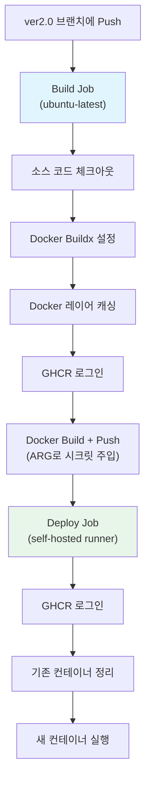

핵심 설계 결정들:

**GHCR(GitHub Container Registry) 선택 이유**: Docker Hub 대신 GHCR을 쓴 건, GitHub Actions와의 통합이 자연스럽고 Private 레포지토리의 이미지를 무료로 저장할 수 있었기 때문입니다.

**시크릿 관리**: `build-args`를 통해 GitHub Secrets에 저장된 환경변수를 Docker 빌드 시점에 주입합니다:

```yaml
# .github/workflows/main.yml
- name: Build and push
  uses: docker/build-push-action@v3
  with:
    push: ${{ github.event_name != 'pull_request' }}
    tags: ${{ env.DOCKER_IMAGE }}:${{ env.VERSION }}
    build-args: |
      "PORT_ARG=${{ secrets.PROD_PORT_ARG }}"
      "NODE_ENV_ARG=${{ secrets.PROD_NODE_ENV_ARG }}"
      "DATABASE_URL_ARG=${{ secrets.DATABASE_URL }}"
      "SECRET_ARG=${{ secrets.SECRET }}"
```

**Self-hosted Runner**: 배포 대상 서버에 GitHub Actions Runner를 설치해서 `runs-on: [self-hosted, label-production]`으로 직접 배포합니다. 별도의 SSH 연결이나 배포 스크립트 없이 Runner가 서버에서 직접 Docker 명령을 실행하는 구조입니다.

**Docker 레이어 캐싱**: `actions/cache`를 활용해서 Docker 빌드 레이어를 캐싱했습니다. `npm install` 같은 느린 단계를 캐싱해서 빌드 시간을 줄일 수 있었습니다.

### PM2 클러스터 모드 튜닝

PM2는 Node.js 프로세스 매니저인데, 클러스터 모드로 설정하면 CPU 코어 수만큼 워커 프로세스를 생성해서 요청을 분산 처리합니다:

```javascript
// ecosystem.config.js
module.exports = {
  apps: [
    {
      name: "charlie-server",
      script: "dist/main.js",
      instances: 0,         // 0 = CPU 코어 수만큼 자동 생성
      exec_mode: "cluster", // 클러스터 모드
      merge_logs: true,     // 각 워커의 로그를 하나로 합침
      autorestart: false,
      watch: true,
    },
  ],
};
```

**`instances: 0`의 의미**: PM2에서 `0`은 "사용 가능한 CPU 코어 수만큼 워커를 생성하라"는 의미입니다.

**겪었던 문제**: 처음에 `instances`를 고정 숫자로 설정했는데, ECS 인스턴스 타입을 변경할 때마다 수동으로 수정해야 하는 문제가 있었습니다. `0`으로 바꾸면서 해결했습니다.

| 설정 | Before | After |
|:---|:---|:---|
| `instances` | 고정 숫자 (예: 2) | `0` (자동 감지) |
| 문제 | 인스턴스 타입 변경 시 수동 수정 필요 | 코어 수에 맞게 자동 조절 |

---

## 7. 모니터링 체계 구축: Sentry 에러 추적에서 NewRelic APM으로의 전환

### 왜 모니터링이 필요했는가

서비스 초기에는 에러가 발생해도 **사용자가 알려줘야 알 수 있었습니다**. 서버 로그를 직접 SSH로 접속해서 확인해야 했는데, App Store 1위를 달성하고 사용자가 급증하면서 이 방식은 한계에 부딪혔습니다.

### Phase 1: Sentry 도입

**Sentry를 먼저 선택한 이유:**
- NestJS 생태계에서 가장 널리 사용되는 에러 추적 도구
- 무료 티어로 시작 가능
- 에러 발생 시 슬랙 알림 연동이 간편

Sentry 도입은 단계적으로 진행했습니다:

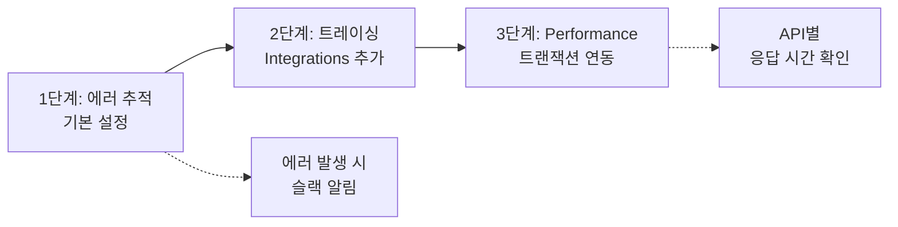

처음에는 단순 에러 추적만 설정했다가, `Sentry Tracing Integrations`를 추가해서 API 요청별 트랜잭션 추적과 성능 모니터링까지 확장했습니다.

### Phase 2: NewRelic APM으로 전환

**왜 전환했는가?**

서비스가 성장하면서 "에러는 잡았는데, 왜 느린지 모르겠다"는 상황이 많아졌습니다. 특히 하우스 랭킹 조회가 느려지는 문제를 추적하려면 **DB 쿼리 단위의 성능 분석**이 필요했는데, Sentry로는 이게 어려웠습니다.

| 비교 항목 | Sentry | NewRelic APM |
|:---|:---|:---|
| **주 역할** | 에러 추적 (Error Tracking) | 성능 모니터링 (APM) |
| **성능 분석** | 트랜잭션 기반 (제한적) | 실시간 서버 메트릭 + DB 쿼리 분석 |
| **DB 쿼리 추적** | 없음 | **쿼리별 응답 시간, 느린 쿼리 식별** |
| **인프라 모니터링** | 없음 | CPU, 메모리, 디스크 I/O |
| **무료 티어** | 5K errors/month | 100GB data ingest/month |

NewRelic APM은 Docker 환경변수만 추가하면 자동으로 에이전트가 동작합니다:

```dockerfile
# Dockerfile
ENV NEW_RELIC_LICENSE_KEY=...
ENV NEW_RELIC_APP_NAME=charlie
ENV NEW_RELIC_DISTRIBUTED_TRACING_ENABLED=true
ENV NEW_RELIC_LOG=stdout
```

**전환 시 걱정됐던 점:** Sentry에서 NewRelic으로 전환하면서 기존 에러 추적 히스토리가 사라질 수 있다는 게 가장 걱정이었습니다. 하지만 NewRelic도 에러 추적 기능이 있었고, 무엇보다 **DB 쿼리 성능 가시성**이 훨씬 중요했기 때문에 전환을 결정했습니다.

### 모니터링 인프라 구현: Interceptor & Exception Filter

APM 에이전트만 설정하는 것으로는 충분하지 않았습니다. NestJS의 Interceptor와 Exception Filter 패턴을 활용해서 **요청-응답 전체 라이프사이클**을 추적하는 구조를 만들어야 했습니다. 이 부분은 저 혼자 고민하면서 설계한 건데, NestJS의 미들웨어 파이프라인을 이해하는 데 꽤 시간이 걸렸습니다.

**NewRelicInterceptor — APM 트랜잭션 래핑:**

```typescript
// src/newrelic.interceptor.ts
@Injectable()
export class NewrelicInterceptor implements NestInterceptor {
  intercept(context: ExecutionContext, next: CallHandler): Observable<any> {
    return newrelic.startWebTransaction(context.getHandler().name, function () {
      const transaction = newrelic.getTransaction();
      return next.handle().pipe(
        tap(() => {
          return transaction.end();
        })
      );
    });
  }
}
```

`newrelic.startWebTransaction()`으로 각 요청을 트랜잭션으로 래핑하고, RxJS `tap()` 연산자로 응답이 완료되면 트랜잭션을 종료합니다. `context.getHandler().name`으로 트랜잭션 이름을 컨트롤러 핸들러 이름(예: `getHouseInfo`, `calcUserStats`)으로 설정해서, NewRelic 대시보드에서 **API별 성능을 바로 확인**할 수 있었습니다. 이 덕분에 나중에 하우스 랭킹 API가 느리다는 걸 빠르게 발견할 수 있었습니다.

**LoggingInterceptor — 요청 메타데이터 기록:**

```typescript
// src/logging/logging.interceptor.ts
@Injectable()
export class LoggingInterceptor implements NestInterceptor {
  constructor(private logger: Logger) {}

  intercept(context: ExecutionContext, next: CallHandler): Observable<any> {
    const { ip, method, url, params, query, body, headers, res } =
      context.getArgByIndex(0);
    const now = Date.now();
    return next.handle().pipe(
      tap(() =>
        this.logger.log(
          `${ip} Request to ${method} ${url} ${res.statusCode} ${
            Date.now() - now
          }ms user: ${JSON.stringify(headers.user)}`,
        ),
      ),
    );
  }
}
```

모든 요청에 대해 **IP, HTTP 메서드, URL, 상태코드, 응답시간(ms), 인증 사용자 ID**를 기록합니다. 이 로그 덕분에 "어떤 사용자가, 어떤 API를, 얼마나 자주, 얼마나 느리게" 호출하는지 파악할 수 있었고, 나중에 캐시 서버 도입을 결정할 때 근거 데이터로 활용했습니다.

**HttpExceptionFilter — 글로벌 예외 핸들러:**

```typescript
// src/exception/http-exception.filter.ts
@Catch()
export class HttpExceptionFilter implements ExceptionFilter {
  constructor(private logger: Logger) {}

  catch(exception: Error, host: ArgumentsHost) {
    const ctx = host.switchToHttp();
    const res = ctx.getResponse<Response>();
    const req = ctx.getRequest<Request>();

    if (!(exception instanceof HttpException)) {
      exception = new InternalServerErrorException();
    }

    const log = {
      timestamp: new Date(),
      url: req.url,
      response: (exception as HttpException).getResponse(),
      stack: exception.stack,
    };
    this.logger.log(log);

    res.status((exception as HttpException).getStatus()).json(
      (exception as HttpException).getResponse()
    );
  }
}
```

`@Catch()` 데코레이터로 **모든 예외**를 잡아서, `HttpException`이 아닌 예외는 `InternalServerErrorException`으로 변환합니다. 이렇게 하면 예상치 못한 에러가 발생해도 클라이언트에 일관된 형식의 응답이 반환되고, **스택 트레이스가 로그에 기록**되어 디버깅이 훨씬 수월해졌습니다.

이 세 가지 컴포넌트가 결합되면서 요청의 전체 라이프사이클을 추적할 수 있게 됐습니다:

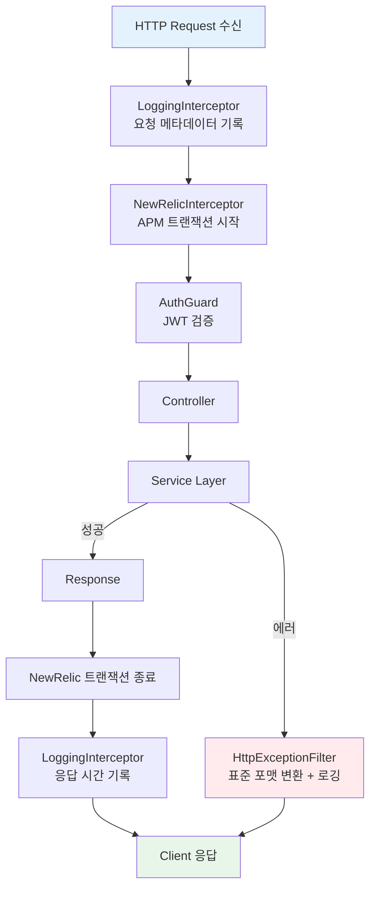

여기서 고민했던 점은 **민감 정보 필터링**이었습니다. NewRelic 에이전트가 수집하는 HTTP 헤더 중에 `Authorization`, `Cookie` 같은 민감 정보가 포함될 수 있었습니다. NewRelic 설정에서 `distributed_tracing: { enabled: true }`로 분산 추적을 활성화하되, 민감 헤더(`cookies`, `authorization`, `proxy-auth`)는 수집에서 제외하도록 설정했습니다. 서비스 모니터링도 중요하지만 사용자 개인정보 보호도 놓치면 안 된다고 생각했습니다.

---

## 8. 회고: 배운 것들과 다음 단계

제가 참여한 6개월을 돌아보며 정리합니다.

### 이 프로젝트에서 배운 교훈

**1. 추측하지 말고, 측정하라**

증분 통계에서 전체 재계산으로 전환할 때 "O(N)이면 느리지 않을까?"라는 걱정이 가장 컸습니다. 하지만 실측 결과 200ms 이내였고, 전환 후 통계 관련 CS는 0건이 됐습니다. 성능 최적화는 실제 병목이 확인된 후에 해도 늦지 않다는 걸 몸으로 배웠습니다.

**2. 단순한 해결책이 복잡한 해결책보다 낫다**

7개 필드 × 여러 엣지 케이스를 각각 처리하는 증분 로직보다, 로그를 처음부터 다시 합산하는 단순한 루프가 정확하고 유지보수도 쉬웠습니다. 복잡도를 줄이는 것 자체가 버그를 줄이는 가장 효과적인 방법이었습니다.

**3. 운영 환경의 데이터는 깔끔하지 않다**

동일 날짜 재업로드, 순서 뒤섞임, 네트워크 재시도 — 정상 흐름만 생각하면 간단한 문제가 엣지 케이스를 고려하면 복잡도가 급격히 올라갔습니다. 클라이언트에서 보내는 데이터를 신뢰하지 말고, 서버에서 멱등성을 보장하는 설계가 먼저라는 걸 배웠습니다.

**4. "나중에"는 오지 않는다**

캐시 무효화, Refresh Token 도입 모두 "사용자가 늘면 추가하자"고 미뤘지만, 제 참여 기간 내에 실행되지 못했습니다. 기술 부채는 인지하는 순간 일정에 반영하거나, 최소한 문서화해서 다음 사람이 이어갈 수 있게 해야 합니다.

**5. 모니터링은 선택이 아니라 필수다**

Sentry로 에러를 잡기 시작하고 나서야 "이렇게 많은 에러가 있었나"를 알게 됐고, NewRelic APM으로 전환하고 나서야 하우스 랭킹 API의 N+1 쿼리 병목을 발견할 수 있었습니다. 모니터링 없이는 문제가 있는지조차 모릅니다.

### 다시 한다면

| 항목 | 당시 선택 | 지금이라면 |
|:---|:---|:---|
| 인증 | Access Token only (1년 만료) | **Access + Refresh Token** 분리 |
| 통계 집계 | 앱에서 forEach 순회 | **DB 집계 함수** (SUM, MAX) 활용 |
| 캐시 전략 | Cache-Aside (무효화 없음) | Cache-Aside + **TTL 기반 자동 만료** |
| 모니터링 | Sentry → NewRelic (순차 도입) | **처음부터 APM 포함** 도구 선택 |
| 소스 관리 | dist/ 포함 커밋 | **.gitignore에 dist/ 추가** |

### Java/Spring으로의 전환 — 객체지향과 아키텍처에 대한 갈증

이 프로젝트를 통해 NestJS의 DI, Guard, Interceptor 같은 아키텍처 패턴을 경험하면서, "**왜 이렇게 설계하는가**"에 대한 관심이 깊어졌습니다. 동시에, 코드가 커질수록 **구조적인 한계**를 느끼기 시작했습니다.

**객체지향의 부재가 가장 큰 갈증이었습니다.** 예를 들어, `calcUserStats()`는 로그 배열을 받아서 7개 값을 계산하는 절차적 함수입니다. 레벨 계산도 `Object.keys(Level).indexOf()`로 enum 인덱스를 직접 조작하는 방식이었습니다. 기능이 추가될 때마다 서비스 클래스에 메서드가 계속 쌓이고, "이 로직이 어디에 속해야 하는가"에 대한 기준이 없었습니다.

TypeScript에서도 객체지향은 가능하지만, NestJS + Prisma 조합에서는 서비스 클래스가 비즈니스 로직과 인프라 로직을 모두 담당하는 **트랜잭션 스크립트 패턴**에 자연스럽게 빠지게 됐습니다. 레이어 간 경계가 모호해지면서, 코드가 커질수록 "어디를 고쳐야 하는지" 찾는 시간이 늘어갔습니다.

Java/Spring 생태계로 전환하면서 이런 고민들에 대한 답을 찾을 수 있었습니다:

- **JPA 엔티티**: DB 매핑뿐 아니라 도메인 로직을 엔티티 안에 담을 수 있어서, "이 로직이 어디에 있어야 하는가"에 대한 기준이 명확해졌습니다.
- **Spring의 레이어드 아키텍처**: Controller → Service → Repository의 책임 분리가 컨벤션으로 확립되어 있어서, 팀원 간의 코드 구조에 대한 합의 비용이 줄었습니다.
- **AOP와 선언적 프로그래밍**: `@Transactional`, `@Cacheable`, `@PreAuthorize` 같은 선언적 방식으로, 비즈니스 로직에 인프라 관심사가 침투하는 걸 막을 수 있었습니다. 찰리와 걷기에서 NewRelicInterceptor를 직접 구현했던 것과 비교하면, 관심사 분리의 수준이 달랐습니다.

찰리와 걷기에서 "**코드가 커지면 어떤 문제가 생기는가**"를 직접 경험했기 때문에, Spring의 아키텍처 패턴들이 왜 필요한지를 이해한 상태에서 학습할 수 있었습니다. NestJS에서의 6개월이 단순히 하나의 프로젝트 경험이 아니라, 객체지향과 아키텍처에 대한 고민을 시작하게 만든 시간이었다고 생각합니다.

---

**기술 스택:** Node.js, TypeScript, NestJS, Prisma, MySQL (AWS RDS), Redis (ioredis + Redis OM), PM2, Docker, GitHub Actions, Sentry, NewRelic APM, JWT, Apple Sign-In
**서비스:** 찰리와 걷기 — App Store 건강 카테고리 1위
**참여 기간:** 2022.06 ~ 2022.12
