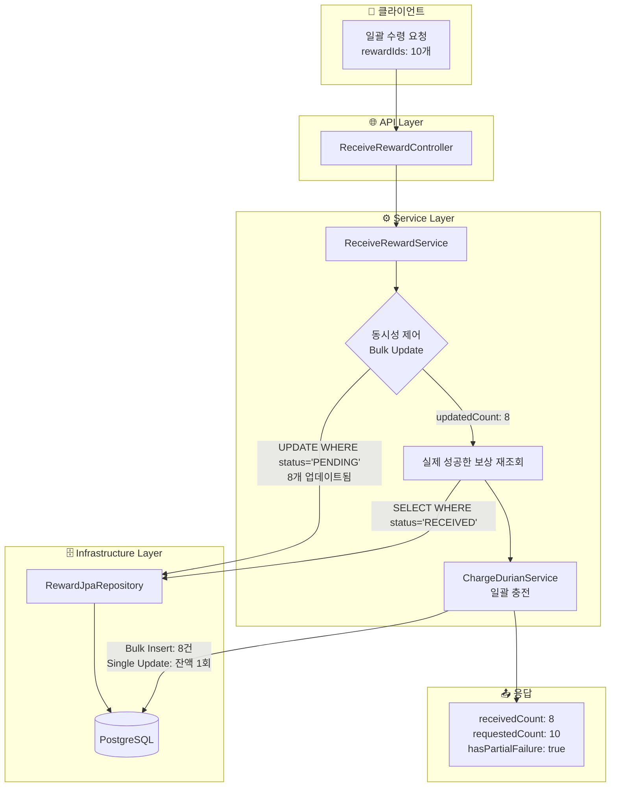
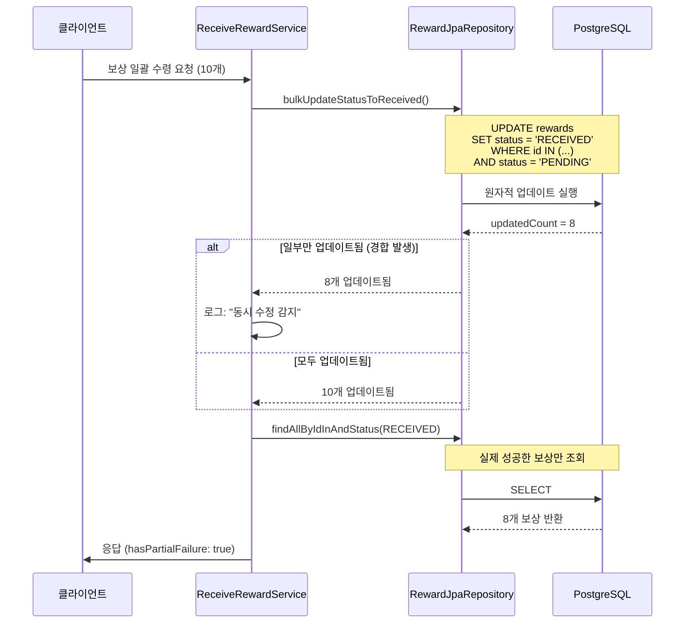
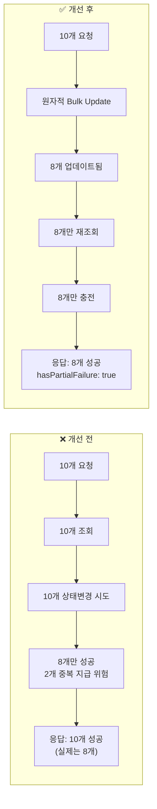

<script src="https://cdn.jsdelivr.net/npm/mermaid@10/dist/mermaid.min.js"></script>
<script>
document.addEventListener('DOMContentLoaded', function() {
  // 마크다운 ```mermaid 블록을 mermaid 클래스로 변환
  document.querySelectorAll('pre > code.language-mermaid').forEach(function(el) {
    el.parentElement.outerHTML = '<pre class="mermaid">' + el.textContent + '</pre>';
  });
  mermaid.initialize({ startOnLoad: true, theme: 'default', securityLevel: 'loose' });
});
</script>

## 1. 문제 상황

저희 서비스에서는 사용자가 여러 개의 보상(두리안이라는 가상 재화)을 일괄 수령할 수 있는 기능을 제공합니다. 기존 구현에서는 몇 가지 심각한 문제가 있었습니다.

### 1.1 동시성 경합 문제

```
[사용자 A의 요청 1] ─────┐
                       ├──→ 같은 보상 ID 목록 조회 → 중복 수령 발생!
[사용자 A의 요청 2] ─────┘
```

모바일 앱에서 네트워크 지연이나 사용자의 빠른 더블 탭으로 인해 동일한 보상에 대한 수령 요청이 거의 동시에 들어오는 상황이 빈번하게 발생했습니다. 기존 코드는 이런 경합 상황을 제대로 처리하지 못해 **중복 재화 지급**이 발생할 수 있었습니다.

### 1.2 데이터 불일치 문제

`@Modifying` 쿼리로 DB를 직접 수정한 후, 응답에 포함될 `updatedAt` 값이 서비스에서 생성한 시간과 DB에 실제 저장된 시간이 달랐습니다.

```kotlin
// ❌ 기존 코드: 서비스에서 시간을 임의로 생성
val now = LocalDateTime.now(SEOUL_ZONE)
ReceivedRewardInfo(
    // ...
    updatedAt = now  // DB에 저장된 값과 다를 수 있음!
)
```

### 1.3 부분 실패 무시 문제

10개의 보상 수령을 요청했는데 동시성 경합으로 8개만 성공한 경우, 클라이언트에게 이 사실을 알려주지 않았습니다.

---

## 2. 해결 과정

### 2.1 전체 아키텍처 개선 흐름

아래 다이어그램은 이번 개선의 전체 흐름을 보여줍니다.



### 2.2 낙관적 업데이트 패턴 적용

핵심 아이디어는 **"먼저 업데이트하고, 업데이트된 행 수로 성공 여부를 판단"**하는 것입니다.



---

## 3. 코드 예시

### 3.1 Repository: 원자적 Bulk Update

```kotlin
// RewardJpaRepository.kt
interface RewardJpaRepository : JpaRepository<RewardEntity, UUID> {

    /**
     * 여러 보상의 상태를 PENDING에서 RECEIVED로 원자적으로 일괄 변경합니다.
     *
     * clearAutomatically = true 설정 이유:
     * - @Modifying 쿼리는 영속성 컨텍스트를 거치지 않고 DB를 직접 수정합니다.
     * - 이로 인해 1차 캐시에 로드된 엔티티와 DB 상태가 불일치할 수 있습니다.
     * - clearAutomatically = true로 쿼리 실행 후 영속성 컨텍스트를 자동 클리어하여
     *   후속 조회 시 DB의 최신 데이터를 가져오도록 보장합니다.
     *
     * WHERE status = PENDING 조건 이유:
     * - 동시성 제어를 위한 낙관적 업데이트 패턴입니다.
     * - 이미 RECEIVED 상태인 보상은 업데이트되지 않아 중복 수령을 방지합니다.
     * - 반환값(업데이트된 행 수)으로 성공 여부를 판단할 수 있습니다.
     */
    @Modifying(clearAutomatically = true)
    @Query("""
        UPDATE RewardEntity r
        SET r.status = :receivedStatus, r.baseEntity.updatedAt = :updatedAt
        WHERE r.id IN :ids
        AND r.status = :pendingStatus
    """)
    fun bulkUpdateStatusToReceived(
        ids: List<UUID>,
        receivedStatus: RewardStatus,
        pendingStatus: RewardStatus,
        updatedAt: LocalDateTime
    ): Int

    /**
     * ID 목록과 상태로 보상 목록을 조회합니다.
     * 동시성 제어 후 실제 업데이트된 보상을 확인하는 데 사용됩니다.
     */
    fun findAllByIdInAndStatus(ids: List<UUID>, status: RewardStatus): List<RewardEntity>
}
```

### 3.2 Service: 동시성 처리 로직

```kotlin
// ReceiveRewardService.kt
@Service
class ReceiveRewardService(
    private val queryRewardPort: QueryRewardPort,
    private val commandRewardPort: CommandRewardPort,
    private val queryProductDurianPort: QueryProductDurianPort,
    private val chargeDurianUseCase: ChargeDurianUseCase
) : ReceiveRewardUseCase {

    private val logger = KotlinLogging.logger {}

    @Transactional
    override fun receiveAllRewards(command: ReceiveAllRewardsCommand): ReceiveRewardsResult {
        // 1. 사용자의 PENDING 상태 보상 조회
        val pendingRewards = queryRewardPort.findAllByUserIdAndStatus(
            command.userId, 
            RewardStatus.PENDING
        )

        if (pendingRewards.isEmpty()) {
            return createEmptyResult(command.userId)
        }

        val rewardIds = pendingRewards.map { it.id }
        
        // 2. 상품 정보 Batch 조회 (N+1 방지)
        val productIds = pendingRewards.map { it.durianProductId }.distinct()
        val productMap = queryProductDurianPort.findAllByIdIn(productIds)
            .associateBy { it.id }

        // 3. 원자적 Bulk Update 실행
        val updatedCount = commandRewardPort.bulkUpdateStatusToReceived(rewardIds)

        // 4. 모든 보상이 이미 처리된 경우
        if (updatedCount == 0) {
            logger.warn { "${command.userId}의 모든 보상은 이미 처리되었습니다." }
            return createEmptyResult(command.userId)
        }

        // 5. 부분 실패 감지 및 로깅
        if (updatedCount < rewardIds.size) {
            logger.warn {
                "동시 수정 감지 : ${rewardIds.size}개의 업데이트가 예상되었지만 ${updatedCount}만 발생했습니다."
            }
        }

        // 6. 실제로 RECEIVED 상태로 변경된 보상만 재조회
        // - 동시성 경합으로 다른 요청이 먼저 수령한 보상은 제외
        // - DB에 저장된 실제 updatedAt 값을 응답에 사용
        val successfulRewards = queryRewardPort.findAllByIdInAndStatus(
            ids = rewardIds,
            status = RewardStatus.RECEIVED
        )

        // 7. 성공한 보상에 대해서만 두리안 충전
        val successfulProductIds = successfulRewards.map { it.durianProductId }
        val chargeCommand = ChargeDurianBulkCommand(command.userId, successfulProductIds)
        val finalBalance = chargeDurianUseCase.chargeDurianBulk(chargeCommand)

        // 8. 응답 생성 (부분 실패 여부 포함)
        return ReceiveRewardsResult(
            receivedCount = successfulRewards.size,
            requestedCount = rewardIds.size,
            receiveTotalQuantity = calculateTotalQuantity(successfulRewards, productMap),
            results = buildResults(successfulRewards, productMap, finalBalance),
            userDurianBalance = finalBalance
            // hasPartialFailure는 receivedCount < requestedCount로 자동 계산
        )
    }
}
```

### 3.3 DTO: 부분 실패 명시적 표현

```kotlin
// ReceiveRewardsResult.kt
/**
 * 보상 수령 결과
 *
 * @property receivedCount 실제로 수령된 보상 개수
 * @property requestedCount 수령 요청한 보상 개수 (일괄 수령 시에만 의미 있음)
 * @property receiveTotalQuantity 수령한 총 듀리안 수량
 * @property userDurianBalance 수령 후 사용자 듀리안 잔액
 * @property results 수령된 보상 상세 정보 목록
 * @property hasPartialFailure 동시성 경합으로 인한 부분 실패 발생 여부
 */
data class ReceiveRewardsResult(
    val receivedCount: Int,
    val requestedCount: Int = receivedCount,
    val receiveTotalQuantity: Int,
    val userDurianBalance: GetUserDurianBalanceResult,
    val results: List<ReceivedRewardInfo>,
    // Kotlin의 기본값 파라미터를 활용한 자동 계산
    val hasPartialFailure: Boolean = receivedCount < requestedCount,
)
```

### 3.4 ChargeDurianService: 일괄 충전 최적화

```kotlin
// ChargeDurianService.kt
/**
 * 다수의 상품에 대한 두리안 충전을 일괄 처리하는 메서드입니다.
 *
 * 최적화 전략:
 * 1. Batch Data Fetching (N+1 방지): 모든 상품 ID를 한 번에 조회
 * 2. In-Memory Calculation: 만료일 계산과 객체 생성을 메모리에서 수행
 * 3. Bulk Insert (Transaction Log): saveAll로 일괄 저장
 * 4. Single Update (User Balance): 잔액 업데이트는 1회만 실행
 */
@Transactional
override fun chargeDurianBulk(command: ChargeDurianBulkCommand): GetUserDurianBalanceResult {
    val uniqueProductIds = command.productIds.distinct()
    val productsMap = queryProductDurianPort.findAllByIdIn(uniqueProductIds)
        .associateBy { it.id }

    val userDurian = queryUserDurianPort.findByUserId(command.userId)
        ?: UserDurian.create(command.userId)

    var currentBalanceFree = userDurian.balanceFree
    var currentTotalBalance = userDurian.balanceTotal
    val transactions = mutableListOf<UserDurianTransaction>()

    // 메모리에서 계산 수행
    for (productId in command.productIds) {
        val product = productsMap[productId] ?: continue
        val totalAmount = product.durianBase + product.durianBonus
        val expirationDate = calculateExpirationDate(product.expirationPeriod)

        val chargeTransaction = UserDurianTransaction.createCharge(
            userId = command.userId,
            durianProductId = productId,
            amount = totalAmount,
            durianType = DurianType.FREE,
            expirationDate = expirationDate
        )
        transactions.add(chargeTransaction)

        currentBalanceFree += totalAmount
        currentTotalBalance += totalAmount
    }

    // Bulk Insert: 트랜잭션 로그 일괄 저장
    commandUserDurianTransactionPort.saveAll(transactions)

    // Single Update: 잔액 1회만 업데이트
    val updatedUserDurian = userDurian.copy(balanceFree = currentBalanceFree)
    commandUserDurianPort.save(updatedUserDurian)

    return GetUserDurianBalanceResult(
        balancePaid = userDurian.balancePaid,
        balanceFree = currentBalanceFree,
        balanceTotal = currentTotalBalance
    )
}
```

---

## 4. 결과 및 검증

### 4.1 Before / After 비교



### 4.2 API 응답 예시

```json
{
  "receivedCount": 8,
  "receiveTotalQuantity": 240,
  "hasPartialFailure": true,
  "userDurianBalance": {
    "balancePaid": 0,
    "balanceFree": 740,
    "balanceTotal": 740
  },
  "receivedRewards": [
    {
      "id": "550e8400-e29b-41d4-a716-446655440001",
      "type": "CONVERSATION",
      "status": "RECEIVED",
      "quantity": 30,
      "description": "대화 보상",
      "createdAt": "2025-01-23T14:00:00",
      "updatedAt": "2025-01-23T15:17:13"
    }
  ]
}
```

### 4.3 성능 개선 수치

| 항목 | 개선 전 | 개선 후 | 개선율 |
|------|---------|---------|--------|
| DB 쿼리 수 (10개 보상) | UPDATE 10회 + SELECT 10회 | UPDATE 1회 + SELECT 2회 | **90% 감소** |
| 트랜잭션 로그 INSERT | 10회 | 1회 (Bulk) | **90% 감소** |
| 잔액 UPDATE | 10회 | 1회 | **90% 감소** |
| Row Lock 점유 시간 | 길음 | 짧음 | **데드락 위험 감소** |

---

## 5. 추가 팁

### 5.1 `clearAutomatically = true`의 중요성

```mermaid
graph TB
    subgraph Problem["❌ clearAutomatically = false"]
        P1["1차 캐시: status=PENDING"] --> P2["@Modifying: DB 직접 수정"]
        P2 --> P3["DB: status=RECEIVED"]
        P3 --> P4["findById() 호출"]
        P4 --> P5["1차 캐시에서 반환:<br/>status=PENDING ⚠️"]
    end

    subgraph Solution["✅ clearAutomatically = true"]
        S1["1차 캐시: status=PENDING"] --> S2["@Modifying: DB 직접 수정"]
        S2 --> S3["DB: status=RECEIVED"]
        S3 --> S4["영속성 컨텍스트 자동 클리어"]
        S4 --> S5["findById() 호출"]
        S5 --> S6["DB에서 조회:<br/>status=RECEIVED ✅"]
    end
```



### 5.2 도메인 모델 단순화

비즈니스 로직에서 필요하지 않은 메서드는 과감히 제거했습니다.

```kotlin
// ❌ Before: 사용되지 않는 메서드들
data class Reward(/* ... */) {
    fun update(type: RewardType?, durianProductId: UUID?): Reward { /* ... */ }
    fun receive(): Reward { /* ... */ }  // DB 직접 수정으로 불필요해짐
}

// ✅ After: 실제 필요한 것만 유지
data class Reward(/* ... */) {
    /**
     * 해당 사용자의 보상인지 확인합니다.
     */
    fun isOwnedBy(userId: UUID): Boolean = this.userId == userId
}
```

### 5.3 로깅 개선: KotlinLogging 사용

```kotlin
// ❌ Before: SLF4J 직접 사용
private val logger = LoggerFactory.getLogger(ReceiveRewardService::class.java)
logger.warn("userId=${command.userId} 모든 보상은 이미 처리되었습니다.")

// ✅ After: KotlinLogging (Lazy Evaluation)
private val logger = KotlinLogging.logger {}
logger.warn { "${command.userId}의 모든 보상은 이미 처리되었습니다." }
```

KotlinLogging의 람다 문법을 사용하면 로그 레벨이 비활성화된 경우 문자열 연산 자체가 수행되지 않아 성능상 이점이 있습니다.

---

### 참고 자료

- [Spring Data JPA @Modifying 공식 문서](https://docs.spring.io/spring-data/jpa/reference/jpa/query-methods.html#jpa.modifying-queries)
- [낙관적 락 vs 비관적 락](https://www.baeldung.com/jpa-optimistic-locking)
- [KotlinLogging GitHub](https://github.com/oshai/kotlin-logging)

---

<div class="info-box">
💡 <strong>핵심 요약:</strong> 동시성 문제는 "먼저 업데이트하고 결과로 판단"하는 낙관적 패턴으로 해결하고, @Modifying 쿼리 사용 시 반드시 clearAutomatically = true를 설정하여 영속성 컨텍스트와 DB의 불일치를 방지하세요.
</div>
