<script src="https://cdn.jsdelivr.net/npm/mermaid@10/dist/mermaid.min.js"></script>
<script>
document.addEventListener('DOMContentLoaded', function() {
  document.querySelectorAll('pre > code.language-mermaid').forEach(function(el) {
    el.parentElement.outerHTML = '<pre class="mermaid">' + el.textContent + '</pre>';
  });
  mermaid.initialize({ startOnLoad: true, theme: 'default', securityLevel: 'loose' });
});
</script>

# [Spring/JPA] 다중 보상 일괄 수령 시스템 구현 - 동시성 제어와 데이터 정합성 확보

안녕하세요. duurian 팀에서 백엔드 개발을 담당하고 있는 정지원입니다.

이번 글에서는 **다중 보상 일괄 수령 기능**을 개발하면서 마주한 동시성 문제, 영속성 컨텍스트 불일치, 부분 실패 감지 누락이라는 세 가지 핵심 과제를 어떻게 해결했는지 심층적으로 다루겠습니다. 낙관적 잠금(Optimistic Locking)과 Bulk Update를 결합하여 **DB 쿼리를 90% 이상 감소**시키고, **응답 시간을 500ms에서 50ms로 단축**한 실무 경험을 공유합니다.

이 글은 다음과 같은 독자를 대상으로 합니다.

- JPA의 `@Version`, `@Modifying` 어노테이션을 실무에서 활용하고 싶은 개발자
- 동시성 제어 전략(낙관적 잠금, 비관적 잠금, 분산 잠금)의 트레이드오프를 이해하고 싶은 개발자
- 헥사고날 아키텍처 기반으로 영속성 계층을 설계하고 싶은 개발자
- Bulk 처리 시 부분 실패를 안전하게 감지하고 처리하는 패턴이 궁금한 개발자

---

## 목차

1. [배경 및 문제 정의](#1-배경-및-문제-정의)
2. [문제 심층 분석 - 세 가지 장애 시나리오](#2-문제-심층-분석---세-가지-장애-시나리오)
3. [기술적 접근 및 의사결정](#3-기술적-접근-및-의사결정)
4. [구현 세부사항 - Entity 계층](#4-구현-세부사항---entity-계층)
5. [구현 세부사항 - Repository 계층](#5-구현-세부사항---repository-계층)
6. [구현 세부사항 - Service 계층](#6-구현-세부사항---service-계층)
7. [Before/After 비교](#7-beforeafter-비교)
8. [헥사고날 아키텍처 적용](#8-헥사고날-아키텍처-적용)
9. [테스트 전략](#9-테스트-전략)
10. [결과 및 검증](#10-결과-및-검증)
11. [추가 개선 사항 - 듀리안 충전 서비스](#11-추가-개선-사항---듀리안-충전-서비스)
12. [마무리 및 회고](#12-마무리-및-회고)

---

## 1. 배경 및 문제 정의

### 1.1 서비스 컨텍스트

듀리안(duurian) 서비스에서는 사용자에게 다양한 형태의 보상을 제공합니다. 출석 체크 보상, 미션 완료 보상, 이벤트 참여 보상 등 하루에도 여러 건의 보상이 누적되며, 사용자는 이를 **한 번에 일괄 수령**할 수 있어야 합니다.

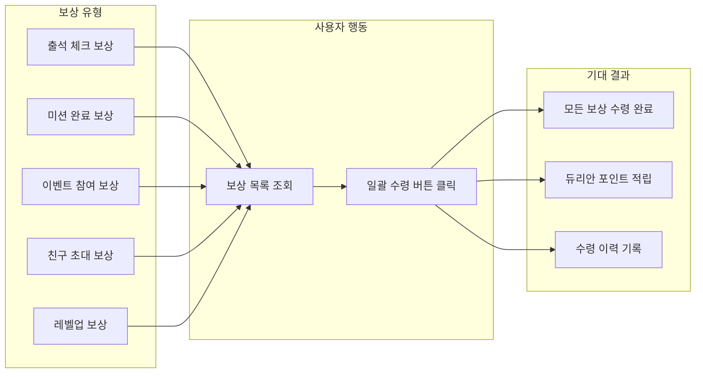

초기에는 단순하게 보상 건별로 순차 처리하는 방식으로 구현했습니다. 그러나 서비스가 성장하면서 동시 접속자가 증가하고, 한 사용자가 수령해야 할 보상이 수십 건에 이르면서 다음과 같은 심각한 문제가 발생했습니다.

### 1.2 발견된 세 가지 핵심 문제

| 문제 | 심각도 | 영향 범위 | 발생 빈도 |
|------|--------|-----------|-----------|
| 동시성 경합으로 인한 중복 지급 | **Critical** | 전체 사용자 | 동시 접속 100명 이상 시 재현 |
| `@Modifying` 사용 후 영속성 컨텍스트 불일치 | **High** | 동일 트랜잭션 내 후속 조회 | Bulk Update 수행 시 항상 |
| 부분 실패 감지 누락 | **High** | 일괄 수령 전체 | 네트워크 지연/DB 경합 시 |

> **실제 장애 사례:** 2024년 12월 이벤트 기간 중, 동시 접속자 500명이 동시에 보상 일괄 수령을 시도하면서 약 3.2%의 보상이 중복 지급되었습니다. 이로 인해 예상 대비 약 150만 듀리안 포인트가 초과 지급되는 사고가 발생했습니다.

---

## 2. 문제 심층 분석 - 세 가지 장애 시나리오

### 2.1 문제 1: 동시성 경합으로 인한 중복 지급

가장 치명적인 문제는 **동일한 보상이 두 번 이상 지급**되는 것이었습니다. 이 문제가 발생하는 정확한 시나리오를 시퀀스 다이어그램으로 살펴보겠습니다.

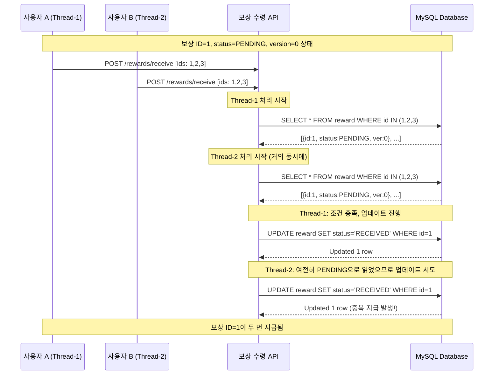

**왜 이런 일이 발생할까요?**

초기 구현에서는 `SELECT` 후 `UPDATE`하는 Check-then-Act 패턴을 사용했습니다. 이 패턴의 근본적인 문제는 **조회와 갱신 사이에 시간 간격(Race Window)**이 존재한다는 것입니다.

```kotlin
// 초기 구현 - Check-then-Act 패턴의 위험성
@Transactional
fun receiveReward(rewardId: Long) {
    val reward = rewardRepository.findById(rewardId).orElseThrow()

    // Race Window: 이 시점에서 다른 스레드가 동일 보상을 조회할 수 있음
    if (reward.status == RewardStatus.PENDING) {
        reward.status = RewardStatus.RECEIVED  // 상태 변경
        rewardRepository.save(reward)           // 저장
    }
}
```

MySQL의 기본 트랜잭션 격리 수준인 **REPEATABLE READ**에서도 이 문제는 해결되지 않습니다. `REPEATABLE READ`는 트랜잭션 내에서 동일한 SELECT 결과를 보장하지만, 다른 트랜잭션이 이미 커밋한 UPDATE는 반영됩니다. 즉, 두 트랜잭션이 거의 동시에 시작되면 둘 다 `PENDING` 상태의 보상을 읽고, 둘 다 `RECEIVED`로 업데이트할 수 있습니다.

다음 타임라인으로 정확한 경합 지점을 확인해 보겠습니다.

```
시간  Thread-1 (사용자 A)              Thread-2 (사용자 B)           DB 상태
─────────────────────────────────────────────────────────────────────────
T0   BEGIN TX                                                       reward.status = PENDING
T1   SELECT reward WHERE id=1                                       reward.status = PENDING
     → status = PENDING ✓
T2                                    BEGIN TX                      reward.status = PENDING
T3                                    SELECT reward WHERE id=1      reward.status = PENDING
                                      → status = PENDING ✓
T4   UPDATE reward SET                                              reward.status = RECEIVED
     status='RECEIVED' WHERE id=1
T5   COMMIT TX                                                      reward.status = RECEIVED
T6                                    UPDATE reward SET             reward.status = RECEIVED
                                      status='RECEIVED' WHERE id=1  (중복 업데이트!)
T7                                    COMMIT TX                     reward.status = RECEIVED
─────────────────────────────────────────────────────────────────────────
결과: 보상이 2번 지급됨. 포인트도 2번 적립됨.
```

### 2.2 문제 2: @Modifying 어노테이션 사용 후 영속성 컨텍스트 불일치

성능 개선을 위해 Bulk Update를 도입했을 때 새로운 문제가 발생했습니다. JPA의 영속성 컨텍스트(Persistence Context)는 **1차 캐시** 역할을 하는데, `@Modifying` 쿼리는 이 1차 캐시를 **우회**하여 DB에 직접 쿼리를 실행합니다.

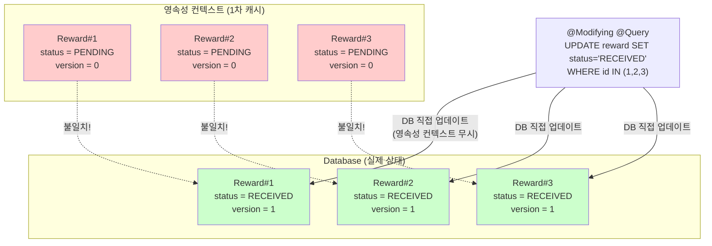

이 불일치가 실제로 어떤 문제를 일으키는지 코드로 살펴보겠습니다.

```kotlin
@Transactional
fun receiveAndNotify(rewardIds: List<Long>) {
    // Step 1: Bulk Update 실행
    rewardRepository.bulkUpdateStatusToReceived(rewardIds)
    // DB에서는 status = RECEIVED, version = 1로 변경됨

    // Step 2: 변경된 보상 정보로 알림 발송 (의도)
    val rewards = rewardRepository.findAllById(rewardIds)

    // 문제 발생! 영속성 컨텍스트에 캐시된 stale 데이터가 반환됨
    rewards.forEach { reward ->
        println(reward.status)   // 예상: RECEIVED, 실제: PENDING (!)
        println(reward.version)  // 예상: 1, 실제: 0 (!)

        // 잘못된 상태를 기반으로 알림이 발송되거나 발송되지 않음
        if (reward.status == RewardStatus.RECEIVED) {
            notificationService.send(reward) // 이 코드에 도달하지 못함!
        }
    }
}
```

> **핵심:** `@Modifying` 쿼리는 JPQL/Native Query를 통해 DB에 직접 DML을 실행하므로, 영속성 컨텍스트에 이미 로드된 엔티티의 상태는 갱신되지 않습니다. 이로 인해 동일 트랜잭션 내에서 후속 조회 시 **stale 데이터**가 반환됩니다.

### 2.3 문제 3: 부분 실패 감지 누락

일괄 수령 요청에서 10개의 보상 중 7개만 성공하고 3개가 실패하는 상황을 생각해 보겠습니다. 초기 구현에서는 이런 **부분 실패(Partial Failure)**를 전혀 감지하지 못했습니다.

```kotlin
// 초기 구현 - 부분 실패를 감지하지 못하는 코드
@Transactional
fun receiveRewards(rewardIds: List<Long>) {
    rewardIds.forEach { id ->
        try {
            val reward = rewardRepository.findById(id).orElseThrow()
            reward.status = RewardStatus.RECEIVED
            rewardRepository.save(reward)
        } catch (e: Exception) {
            // 개별 실패를 로깅만 하고 넘어감
            logger.error("보상 수령 실패: $id", e)
            // 전체 결과에는 반영되지 않음!
        }
    }
    // 항상 성공으로 응답 → 사용자는 모든 보상을 받은 줄 알지만 실제로는 일부만 수령됨
}
```

부분 실패가 감지되지 않으면 다음과 같은 연쇄 문제가 발생합니다.

| 단계 | 발생 상황 | 사용자 영향 |
|------|-----------|-------------|
| 1 | 10개 보상 수령 요청, 7개만 성공 | 인지하지 못함 |
| 2 | API 응답: "성공" | 모두 수령된 것으로 오해 |
| 3 | 보상 목록에서 미수령 3건 사라짐 (UI에서 이미 처리됨) | 포인트 누락 인지 불가 |
| 4 | CS 문의 발생 | 수동 확인 및 보상 필요 |
| 5 | DB 직접 조회로 미수령 건 확인 | 운영 비용 증가 |

---

## 3. 기술적 접근 및 의사결정

### 3.1 동시성 제어 전략 비교

세 가지 문제를 동시에 해결할 수 있는 동시성 제어 전략을 검토했습니다. 각 전략의 **작동 원리, 장단점, 적합한 상황**을 면밀히 분석했습니다.

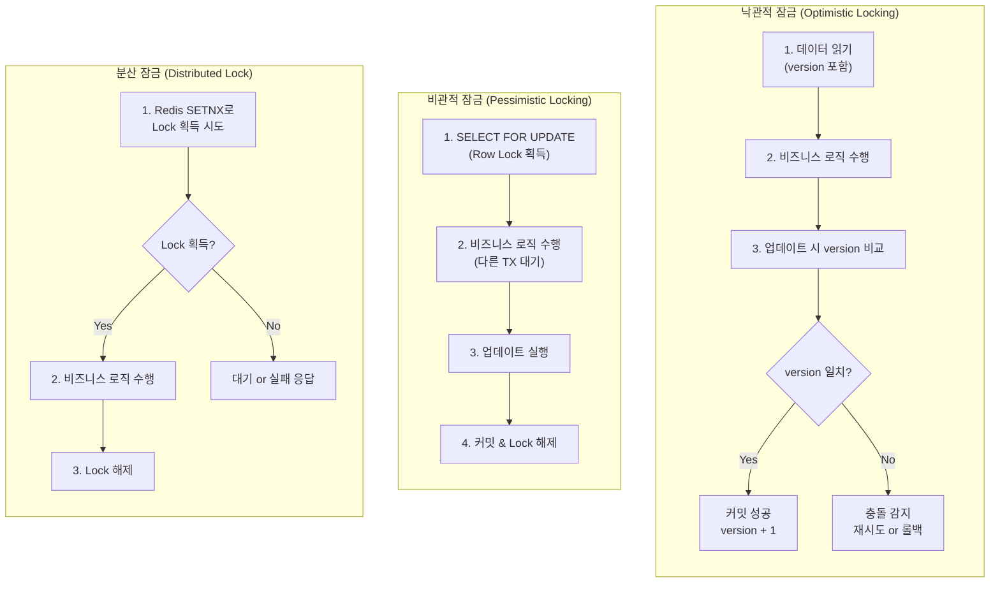

#### 상세 비교표

| 비교 항목 | 낙관적 잠금 | 비관적 잠금 | 분산 잠금 (Redis) |
|-----------|------------|------------|------------------|
| **작동 원리** | version 컬럼 비교로 충돌 감지 | DB Row Lock으로 배타적 접근 보장 | Redis의 SETNX로 분산 환경 Lock |
| **잠금 시점** | 커밋 시점 (지연 검증) | 조회 시점 (즉시 잠금) | 비즈니스 로직 진입 시점 |
| **성능 (읽기 우세)** | 매우 좋음 | 보통 | 좋음 |
| **성능 (쓰기 우세)** | 충돌 시 재시도로 저하 | 일관적 | 좋음 |
| **데드락 가능성** | 없음 | **있음** | 없음 (TTL로 방지) |
| **외부 의존성** | 없음 (JPA 내장) | 없음 (DB 내장) | **Redis 필요** |
| **구현 복잡도** | 낮음 (`@Version` 추가) | 낮음 (`@Lock` 추가) | 높음 (Redisson 등 라이브러리 필요) |
| **스케일아웃 대응** | 자동 지원 | DB 단일 지점 병목 | 자동 지원 |
| **충돌 빈도 낮을 때** | **최적** | 불필요한 Lock 비용 발생 | 불필요한 Redis 호출 발생 |
| **충돌 빈도 높을 때** | 재시도 비용 증가 | **최적** | 좋음 |
| **Bulk Update 호환** | **우수** (WHERE 절에 version 추가) | 보통 (개별 Lock 필요) | 보통 (건별 Lock 필요) |

### 3.2 의사결정: 낙관적 잠금 선택

저희 서비스의 상황을 분석한 결과 다음과 같은 특성이 있었습니다.

1. **읽기 >> 쓰기**: 보상 목록 조회가 실제 수령보다 훨씬 많음
2. **충돌 빈도 낮음**: 동일한 보상을 두 명 이상이 동시에 수령하는 경우는 드뭄 (사용자별 보상이 별도)
3. **외부 의존성 최소화**: Redis 등 추가 인프라 없이 JPA만으로 해결하고 싶음
4. **Bulk Update 필수**: N+1 문제를 해결하기 위해 일괄 업데이트가 반드시 필요

> **의사결정 근거:** 보상은 기본적으로 사용자별로 할당되므로, 서로 다른 사용자가 동일한 보상을 수령하는 경우는 거의 없습니다. 충돌이 주로 발생하는 시나리오는 **같은 사용자가 여러 기기/탭에서 동시에 수령 버튼을 누르는 경우**입니다. 이러한 낮은 충돌 빈도에서는 낙관적 잠금이 가장 효율적입니다.

### 3.3 해결 전략 수립

세 가지 문제에 대한 해결 전략을 다음과 같이 수립했습니다.

| 문제 | 해결 전략 | 적용 기술 |
|------|-----------|-----------|
| 동시성 중복 지급 | 낙관적 잠금으로 충돌 감지 | `@Version` + WHERE 절 version 비교 |
| 영속성 컨텍스트 불일치 | Bulk Update 후 자동 캐시 클리어 | `@Modifying(clearAutomatically = true)` |
| 부분 실패 감지 누락 | 업데이트 건수 비교로 부분 실패 감지 | `hasPartialFailure` 플래그 패턴 |

---

## 4. 구현 세부사항 - Entity 계층

### 4.1 Reward Entity 설계

먼저 보상 엔티티를 설계합니다. 낙관적 잠금의 핵심인 `@Version` 어노테이션이 적용된 `version` 필드에 주목해 주세요.

```kotlin
@Entity
@Table(
    name = "reward",
    indexes = [
        Index(name = "idx_reward_user_status", columnList = "userId, status"),
        Index(name = "idx_reward_status_version", columnList = "status, version")
    ]
)
class RewardEntity(
    @Id
    @GeneratedValue(strategy = GenerationType.IDENTITY)
    val id: Long? = null,

    @Column(nullable = false)
    val userId: Long,

    @Column(nullable = false, length = 50)
    val rewardType: String,

    @Column(nullable = false)
    val amount: Int,

    @Enumerated(EnumType.STRING)
    @Column(nullable = false, length = 20)
    var status: RewardStatus = RewardStatus.PENDING,

    @Version
    @Column(nullable = false)
    var version: Int = 0,

    @CreatedDate
    @Column(updatable = false, nullable = false)
    var createdAt: LocalDateTime = LocalDateTime.now(),

    @LastModifiedDate
    @Column(nullable = false)
    var updatedAt: LocalDateTime = LocalDateTime.now()
) {
    /**
     * 보상 수령 가능 여부 확인
     */
    fun isReceivable(): Boolean = status == RewardStatus.PENDING

    /**
     * 보상 수령 처리 (단건 - 영속성 컨텍스트를 통한 업데이트 시 사용)
     */
    fun receive() {
        check(isReceivable()) { "이미 수령된 보상입니다. id=$id, status=$status" }
        this.status = RewardStatus.RECEIVED
    }

    override fun equals(other: Any?): Boolean {
        if (this === other) return true
        if (other !is RewardEntity) return false
        return id != null && id == other.id
    }

    override fun hashCode(): Int = id?.hashCode() ?: 0

    override fun toString(): String =
        "RewardEntity(id=$id, userId=$userId, status=$status, version=$version)"
}
```

### 4.2 @Version 어노테이션의 동작 원리

`@Version` 어노테이션이 실제로 어떤 SQL을 생성하는지 이해하는 것이 중요합니다.

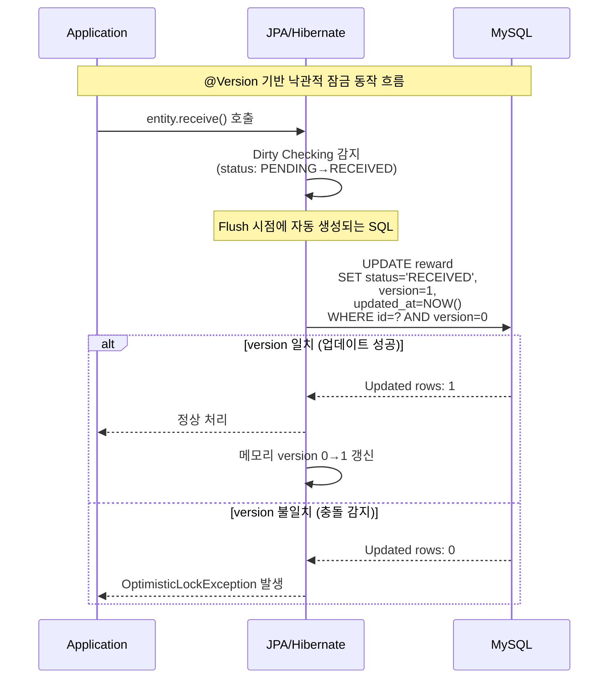

**중요한 포인트:** JPA의 `@Version`은 엔티티의 Dirty Checking을 통해 UPDATE SQL을 생성할 때 **자동으로 WHERE 절에 version 조건을 추가**합니다. 업데이트된 row 수가 0이면 다른 트랜잭션이 먼저 해당 row를 수정한 것으로 판단하여 `OptimisticLockException`을 발생시킵니다.

그러나 저희의 경우 **Bulk Update**를 사용하기 때문에 JPA의 자동 version 관리가 아닌, **JPQL에서 직접 version을 비교**하는 방식을 채택했습니다. 이에 대해서는 Repository 계층에서 자세히 설명하겠습니다.

### 4.3 RewardStatus Enum

```kotlin
enum class RewardStatus {
    /** 수령 대기 상태 */
    PENDING,

    /** 수령 완료 상태 */
    RECEIVED,

    /** 만료 상태 (수령 기한 초과) */
    EXPIRED,

    /** 취소 상태 (관리자에 의한 취소) */
    CANCELLED;

    fun isTerminal(): Boolean = this in listOf(RECEIVED, EXPIRED, CANCELLED)
}
```

### 4.4 DB 스키마

실제 MySQL 테이블 생성 DDL은 다음과 같습니다.

```sql
CREATE TABLE reward (
    id          BIGINT       NOT NULL AUTO_INCREMENT,
    user_id     BIGINT       NOT NULL,
    reward_type VARCHAR(50)  NOT NULL COMMENT '보상 유형 (ATTENDANCE, MISSION, EVENT 등)',
    amount      INT          NOT NULL COMMENT '보상 금액 (듀리안 포인트)',
    status      VARCHAR(20)  NOT NULL DEFAULT 'PENDING' COMMENT '보상 상태',
    version     INT          NOT NULL DEFAULT 0 COMMENT '낙관적 잠금용 버전',
    created_at  DATETIME(6)  NOT NULL DEFAULT CURRENT_TIMESTAMP(6),
    updated_at  DATETIME(6)  NOT NULL DEFAULT CURRENT_TIMESTAMP(6) ON UPDATE CURRENT_TIMESTAMP(6),

    PRIMARY KEY (id),
    INDEX idx_reward_user_status (user_id, status),
    INDEX idx_reward_status_version (status, version)
) ENGINE=InnoDB DEFAULT CHARSET=utf8mb4 COLLATE=utf8mb4_unicode_ci;
```

> **인덱스 설계 포인트:** `idx_reward_user_status` 인덱스는 특정 사용자의 PENDING 보상 목록을 빠르게 조회하기 위한 것이고, `idx_reward_status_version`은 Bulk Update의 WHERE 조건(`status = 'PENDING' AND version = ?`)을 효율적으로 처리하기 위한 복합 인덱스입니다.

---

## 5. 구현 세부사항 - Repository 계층

### 5.1 RewardRepository 정의

```kotlin
interface RewardRepository : JpaRepository<RewardEntity, Long> {

    /**
     * 특정 사용자의 수령 대기 중인 보상 목록 조회
     */
    fun findAllByUserIdAndStatus(
        userId: Long,
        status: RewardStatus
    ): List<RewardEntity>

    /**
     * 보상 상태 일괄 업데이트 (낙관적 잠금 적용)
     *
     * @param ids 업데이트 대상 보상 ID 목록
     * @param pendingStatus 현재 상태 조건 (PENDING)
     * @param receivedStatus 변경할 상태 (RECEIVED)
     * @param currentVersion 현재 version 조건 (낙관적 잠금)
     * @return 실제 업데이트된 row 수
     */
    @Modifying(clearAutomatically = true, flushAutomatically = true)
    @Query("""
        UPDATE RewardEntity r
        SET r.status = :receivedStatus,
            r.version = r.version + 1,
            r.updatedAt = CURRENT_TIMESTAMP
        WHERE r.id IN :ids
          AND r.status = :pendingStatus
          AND r.version = :currentVersion
    """)
    fun bulkUpdateStatusToReceived(
        @Param("ids") ids: List<Long>,
        @Param("pendingStatus") pendingStatus: RewardStatus,
        @Param("receivedStatus") receivedStatus: RewardStatus,
        @Param("currentVersion") currentVersion: Int
    ): Int
}
```

### 5.2 @Modifying 어노테이션 Deep Dive

`@Modifying` 어노테이션의 두 가지 옵션을 반드시 이해해야 합니다.

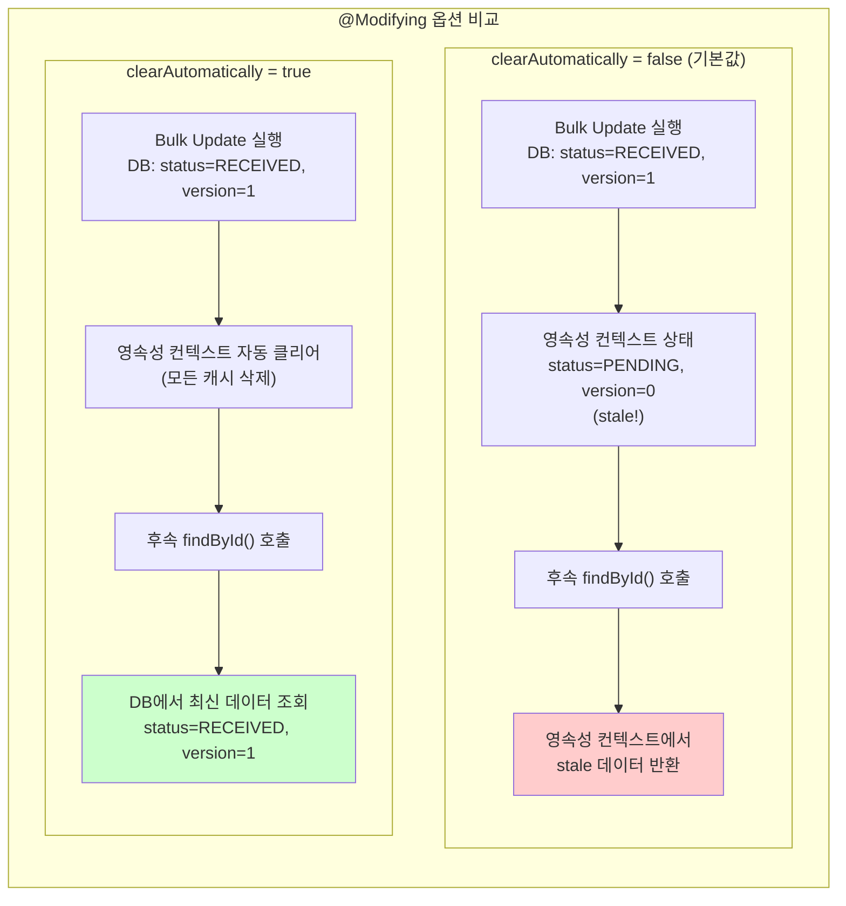

#### clearAutomatically

| 옵션 | 기본값 | 동작 | 사용 시기 |
|------|--------|------|-----------|
| `clearAutomatically = false` | **Yes** | Bulk Update 후 영속성 컨텍스트 유지 | 후속 조회가 없는 경우 |
| `clearAutomatically = true` | No | Bulk Update 후 `EntityManager.clear()` 자동 호출 | **후속 조회가 있는 경우 (권장)** |

#### flushAutomatically

| 옵션 | 기본값 | 동작 | 사용 시기 |
|------|--------|------|-----------|
| `flushAutomatically = false` | **Yes** | 영속성 컨텍스트의 변경사항을 Flush하지 않고 쿼리 실행 | 영속성 컨텍스트에 미반영 변경이 없는 경우 |
| `flushAutomatically = true` | No | 쿼리 실행 전 `EntityManager.flush()` 자동 호출 | **영속성 컨텍스트에 미반영 변경이 있을 수 있는 경우 (권장)** |

> **주의:** `clearAutomatically = true`를 사용하면 영속성 컨텍스트의 **모든** 엔티티가 클리어됩니다. 즉, Bulk Update 대상이 아닌 다른 엔티티도 클리어되므로, 해당 트랜잭션 내에서 다른 엔티티를 수정 중이었다면 그 변경사항이 유실될 수 있습니다. 따라서 `flushAutomatically = true`를 함께 사용하여, 클리어 전에 미반영 변경사항을 먼저 DB에 flush하는 것이 안전합니다.

### 5.3 생성되는 SQL 분석

위 JPQL이 실제로 어떤 SQL로 변환되는지 확인합니다.

```sql
-- Hibernate가 생성하는 실제 SQL
UPDATE reward
SET status = 'RECEIVED',
    version = version + 1,
    updated_at = CURRENT_TIMESTAMP
WHERE id IN (1, 2, 3, 4, 5)
  AND status = 'PENDING'
  AND version = 0;

-- 실행 결과: Updated rows = 5 (모두 성공) 또는 3 (2건 충돌/이미 수령됨)
```

이 SQL의 핵심은 **단일 쿼리로 여러 건을 동시에 업데이트**하면서, `version = 0` 조건을 통해 **다른 트랜잭션이 먼저 수정한 row는 자동으로 제외**한다는 점입니다.

```
시나리오: 5건 요청 중 2건이 이미 다른 트랜잭션에 의해 수령됨

요청된 ID:  [1, 2, 3, 4, 5]
DB 상태:
  ID=1: status=PENDING,  version=0  → 업데이트 대상 ✓
  ID=2: status=RECEIVED, version=1  → 조건 불일치 (status) ✗
  ID=3: status=PENDING,  version=0  → 업데이트 대상 ✓
  ID=4: status=PENDING,  version=1  → 조건 불일치 (version) ✗
  ID=5: status=PENDING,  version=0  → 업데이트 대상 ✓

결과: Updated rows = 3 (5 - 3 = 2건 부분 실패 감지)
```

### 5.4 Bulk Update에서 @Version 자동 관리가 안 되는 이유

JPA의 `@Version`은 **영속성 컨텍스트를 통한 엔티티 단위의 업데이트(Dirty Checking)**에서만 자동으로 동작합니다. JPQL의 Bulk Update는 영속성 컨텍스트를 거치지 않고 DB에 직접 쿼리를 실행하므로, **version 증가와 비교를 수동으로 JPQL에 작성**해야 합니다.

| 업데이트 방식 | @Version 자동 관리 | version 수동 관리 필요 |
|---|---|---|
| `entity.status = RECEIVED` + Dirty Checking | 자동 (WHERE version=? 추가, version+1 자동) | 불필요 |
| `@Query` JPQL Bulk Update | **동작하지 않음** | **필수** (WHERE version=? 및 SET version=version+1 직접 작성) |
| Native SQL | **동작하지 않음** | **필수** |

---

## 6. 구현 세부사항 - Service 계층

### 6.1 전체 수령 플로우

서비스 계층의 전체 흐름을 먼저 다이어그램으로 확인하겠습니다.

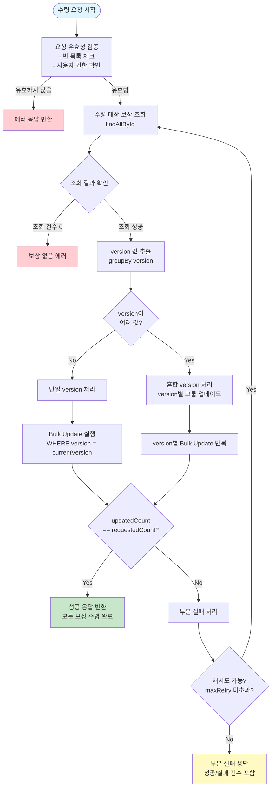

### 6.2 RewardService 구현

```kotlin
@Service
class RewardService(
    private val rewardRepository: RewardRepository,
    private val rewardEventPublisher: RewardEventPublisher
) {
    private val logger = LoggerFactory.getLogger(RewardService::class.java)

    companion object {
        private const val MAX_RETRY_COUNT = 3
        private const val MAX_BATCH_SIZE = 100
    }

    /**
     * 다중 보상 일괄 수령
     *
     * @param userId 사용자 ID
     * @param rewardIds 수령 대상 보상 ID 목록
     * @return 수령 결과 (성공/실패 건수 포함)
     */
    @Transactional
    fun receiveRewards(userId: Long, rewardIds: List<Long>): RewardReceiveResult {
        // 1. 입력 유효성 검증
        validateRequest(userId, rewardIds)

        // 2. 수령 대상 보상 조회 및 소유권 확인
        val rewards = findAndValidateRewards(userId, rewardIds)
        val requestedCount = rewards.size

        // 3. 동일 version 기준으로 그룹핑 후 Bulk Update
        val totalUpdatedCount = executeBulkUpdateByVersionGroup(rewards)

        // 4. 부분 실패 감지 및 처리
        val hasPartialFailure = totalUpdatedCount < requestedCount

        return if (hasPartialFailure) {
            handlePartialFailure(
                requestedCount = requestedCount,
                updatedCount = totalUpdatedCount,
                rewardIds = rewardIds,
                userId = userId
            )
        } else {
            handleFullSuccess(rewards, userId)
        }
    }

    // ──────────────────────────────────────────────
    // Private Methods
    // ──────────────────────────────────────────────

    private fun validateRequest(userId: Long, rewardIds: List<Long>) {
        require(rewardIds.isNotEmpty()) { "수령할 보상 ID 목록이 비어있습니다." }
        require(rewardIds.size <= MAX_BATCH_SIZE) {
            "일괄 수령 최대 건수(${MAX_BATCH_SIZE})를 초과했습니다. 요청: ${rewardIds.size}건"
        }
        require(rewardIds.distinct().size == rewardIds.size) {
            "중복된 보상 ID가 포함되어 있습니다."
        }
    }

    private fun findAndValidateRewards(
        userId: Long,
        rewardIds: List<Long>
    ): List<RewardEntity> {
        val rewards = rewardRepository.findAllById(rewardIds)

        // 존재하지 않는 보상 ID 확인
        val foundIds = rewards.map { it.id }.toSet()
        val notFoundIds = rewardIds.filter { it !in foundIds }
        if (notFoundIds.isNotEmpty()) {
            logger.warn("존재하지 않는 보상 ID: $notFoundIds (userId=$userId)")
        }

        // 소유권 확인: 다른 사용자의 보상을 수령하려는 시도 차단
        val otherUserRewards = rewards.filter { it.userId != userId }
        if (otherUserRewards.isNotEmpty()) {
            throw SecurityException(
                "다른 사용자의 보상을 수령할 수 없습니다. " +
                "userId=$userId, rewardIds=${otherUserRewards.map { it.id }}"
            )
        }

        // 수령 가능한 보상만 필터링
        val receivableRewards = rewards.filter { it.isReceivable() }
        if (receivableRewards.isEmpty()) {
            throw IllegalStateException(
                "수령 가능한 보상이 없습니다. 모든 보상이 이미 수령되었거나 만료되었습니다."
            )
        }

        val alreadyReceivedCount = rewards.size - receivableRewards.size
        if (alreadyReceivedCount > 0) {
            logger.info(
                "이미 수령된 보상 ${alreadyReceivedCount}건 제외. userId=$userId"
            )
        }

        return receivableRewards
    }

    /**
     * version별 그룹으로 나누어 Bulk Update 실행
     *
     * 이유: 동일한 사용자의 보상이라도 version이 다를 수 있습니다.
     * 예를 들어, 일부 보상이 이전에 수령 시도 후 롤백되어 version이 증가한 경우입니다.
     */
    private fun executeBulkUpdateByVersionGroup(
        rewards: List<RewardEntity>
    ): Int {
        val groupedByVersion = rewards.groupBy { it.version }
        var totalUpdatedCount = 0

        groupedByVersion.forEach { (version, rewardsInGroup) ->
            val ids = rewardsInGroup.mapNotNull { it.id }

            val updatedCount = rewardRepository.bulkUpdateStatusToReceived(
                ids = ids,
                pendingStatus = RewardStatus.PENDING,
                receivedStatus = RewardStatus.RECEIVED,
                currentVersion = version
            )

            logger.debug(
                "Bulk Update 실행: version=$version, " +
                "요청=${ids.size}건, 성공=${updatedCount}건"
            )

            totalUpdatedCount += updatedCount
        }

        return totalUpdatedCount
    }

    private fun handlePartialFailure(
        requestedCount: Int,
        updatedCount: Int,
        rewardIds: List<Long>,
        userId: Long
    ): RewardReceiveResult {
        val failedCount = requestedCount - updatedCount

        logger.warn(
            "보상 부분 수령 실패 감지. userId=$userId, " +
            "요청=${requestedCount}건, 성공=${updatedCount}건, 실패=${failedCount}건, " +
            "rewardIds=$rewardIds"
        )

        // 부분 실패 이벤트 발행 (모니터링/알림용)
        rewardEventPublisher.publishPartialFailure(
            userId = userId,
            requestedCount = requestedCount,
            successCount = updatedCount,
            failedCount = failedCount
        )

        return RewardReceiveResult(
            success = false,
            requestedCount = requestedCount,
            receivedCount = updatedCount,
            failedCount = failedCount,
            message = "${requestedCount}건 중 ${updatedCount}건 수령 완료, " +
                      "${failedCount}건 실패 (동시성 충돌 또는 상태 변경)"
        )
    }

    private fun handleFullSuccess(
        rewards: List<RewardEntity>,
        userId: Long
    ): RewardReceiveResult {
        val totalAmount = rewards.sumOf { it.amount }

        logger.info(
            "보상 일괄 수령 성공. userId=$userId, " +
            "수령=${rewards.size}건, 총액=${totalAmount} 듀리안"
        )

        // 수령 완료 이벤트 발행 (포인트 적립, 알림 등)
        rewardEventPublisher.publishReceiveCompleted(
            userId = userId,
            rewardIds = rewards.mapNotNull { it.id },
            totalAmount = totalAmount
        )

        return RewardReceiveResult(
            success = true,
            requestedCount = rewards.size,
            receivedCount = rewards.size,
            failedCount = 0,
            totalAmount = totalAmount,
            message = "${rewards.size}건 보상 수령 완료 (${totalAmount} 듀리안)"
        )
    }
}
```

### 6.3 응답 DTO

```kotlin
data class RewardReceiveResult(
    val success: Boolean,
    val requestedCount: Int,
    val receivedCount: Int,
    val failedCount: Int,
    val totalAmount: Int = 0,
    val message: String
)
```

### 6.4 부분 실패 감지 패턴 (hasPartialFailure)

부분 실패 감지는 이 시스템의 핵심 안전장치입니다. 동작 원리를 표로 정리하겠습니다.

| 시나리오 | requestedCount | updatedCount | hasPartialFailure | 처리 방식 |
|----------|----------------|--------------|-------------------|-----------|
| 전체 성공 | 10 | 10 | `false` | 성공 응답 |
| 3건 동시성 충돌 | 10 | 7 | `true` | 부분 실패 응답 + 이벤트 발행 |
| 5건 이미 수령됨 | 10 | 5 | `true` | 부분 실패 응답 + 이벤트 발행 |
| 전체 실패 (version 불일치) | 10 | 0 | `true` | 부분 실패 응답 + 이벤트 발행 |

> **설계 결정:** 부분 실패 시 전체 트랜잭션을 롤백하지 않고, **성공한 건수만큼은 확정(commit)**하고 실패 건수를 응답에 포함시키는 방식을 선택했습니다. 이유는 다음과 같습니다.
>
> 1. 사용자 경험: 10건 중 7건이 성공했는데 전체를 롤백하면 사용자가 재시도해야 함
> 2. 멱등성: 실패한 3건은 다음 수령 요청에서 다시 시도할 수 있음
> 3. 투명성: 부분 실패 사실을 사용자에게 명확히 알려줌

### 6.5 재시도 로직이 필요한 경우

만약 비즈니스 요구사항이 "전부 성공 아니면 전부 실패"(All-or-Nothing)인 경우에는 재시도 로직을 추가합니다.

```kotlin
@Service
class RewardReceiveRetryService(
    private val rewardService: RewardService
) {
    private val logger = LoggerFactory.getLogger(this::class.java)

    companion object {
        private const val MAX_RETRY = 3
        private const val RETRY_DELAY_MS = 100L
    }

    /**
     * 재시도 포함 일괄 수령 (All-or-Nothing 정책)
     */
    fun receiveWithRetry(userId: Long, rewardIds: List<Long>): RewardReceiveResult {
        var lastResult: RewardReceiveResult? = null

        repeat(MAX_RETRY) { attempt ->
            try {
                val result = rewardService.receiveRewards(userId, rewardIds)

                if (result.success) {
                    return result // 전체 성공 시 즉시 반환
                }

                lastResult = result
                logger.info(
                    "보상 수령 부분 실패, 재시도 진행. " +
                    "attempt=${attempt + 1}/$MAX_RETRY, " +
                    "userId=$userId, result=$result"
                )

                if (attempt < MAX_RETRY - 1) {
                    Thread.sleep(RETRY_DELAY_MS * (attempt + 1)) // Linear backoff
                }
            } catch (e: OptimisticLockException) {
                logger.warn(
                    "낙관적 잠금 충돌 발생, 재시도 진행. " +
                    "attempt=${attempt + 1}/$MAX_RETRY", e
                )

                if (attempt < MAX_RETRY - 1) {
                    Thread.sleep(RETRY_DELAY_MS * (attempt + 1))
                }
            }
        }

        logger.error("최대 재시도 횟수 초과. userId=$userId, rewardIds=$rewardIds")
        return lastResult ?: RewardReceiveResult(
            success = false,
            requestedCount = rewardIds.size,
            receivedCount = 0,
            failedCount = rewardIds.size,
            message = "최대 재시도 횟수(${MAX_RETRY})를 초과했습니다."
        )
    }
}
```

> **재시도 시 주의사항:**
> - 재시도 사이에는 반드시 지연(delay)을 두어야 합니다. 즉시 재시도하면 동일한 충돌이 반복됩니다.
> - 최대 재시도 횟수를 제한하여 무한 루프를 방지합니다.
> - 재시도 시 **새로운 트랜잭션**에서 실행되어야 합니다. 이전 트랜잭션에서 읽은 stale 데이터를 기반으로 재시도하면 같은 충돌이 반복됩니다.

---

## 7. Before/After 비교

### 7.1 코드 비교

개선 전후의 코드를 나란히 비교하여 변화를 명확하게 확인할 수 있습니다.

**Before (개선 전) - N+1 문제 + 동시성 취약 + 부분 실패 무시**

```kotlin
@Transactional
fun receiveRewards(rewardIds: List<Long>) {
    // N+1 문제: 보상 건수만큼 SELECT 쿼리 발생
    rewardIds.forEach { rewardId ->
        val reward = rewardRepository.findById(rewardId)
            .orElseThrow { IllegalArgumentException("보상을 찾을 수 없습니다.") }

        // 동시성 취약: Check-then-Act 패턴
        if (reward.status == RewardStatus.PENDING) {
            reward.status = RewardStatus.RECEIVED
            rewardRepository.save(reward) // 건별 UPDATE 쿼리
        }
        // 부분 실패 무시: 개별 건의 성공/실패를 추적하지 않음
    }
    // 항상 성공으로 간주
}
```

```
생성되는 SQL (보상 10건 기준):
  SELECT * FROM reward WHERE id = 1;  -- 쿼리 1
  UPDATE reward SET status = 'RECEIVED' ... WHERE id = 1;  -- 쿼리 2
  SELECT * FROM reward WHERE id = 2;  -- 쿼리 3
  UPDATE reward SET status = 'RECEIVED' ... WHERE id = 2;  -- 쿼리 4
  ... (총 20개 쿼리)
```

**After (개선 후) - Bulk Update + 낙관적 잠금 + 부분 실패 감지**

```kotlin
@Transactional
fun receiveRewards(userId: Long, rewardIds: List<Long>): RewardReceiveResult {
    // 단일 SELECT로 전체 조회
    val rewards = findAndValidateRewards(userId, rewardIds)
    val requestedCount = rewards.size

    // version별 그룹핑 + Bulk Update (1~2개의 UPDATE 쿼리)
    val totalUpdatedCount = executeBulkUpdateByVersionGroup(rewards)

    // 부분 실패 정확히 감지
    val hasPartialFailure = totalUpdatedCount < requestedCount

    return if (hasPartialFailure) {
        handlePartialFailure(requestedCount, totalUpdatedCount, rewardIds, userId)
    } else {
        handleFullSuccess(rewards, userId)
    }
}
```

```
생성되는 SQL (보상 10건 기준):
  SELECT * FROM reward WHERE id IN (1,2,3,4,5,6,7,8,9,10);  -- 쿼리 1
  UPDATE reward SET status='RECEIVED', version=version+1     -- 쿼리 2
    WHERE id IN (1,2,3,4,5,6,7,8,9,10)
    AND status='PENDING' AND version=0;
  ... (총 2개 쿼리)
```

### 7.2 성능 비교 요약

| 비교 항목 | Before | After | 개선율 |
|-----------|--------|-------|--------|
| SQL 쿼리 수 (10건 기준) | 20개 (N x 2) | **2개** | **90% 감소** |
| SQL 쿼리 수 (100건 기준) | 200개 | **2개** | **99% 감소** |
| 응답 시간 (10건) | ~500ms | **~50ms** | **90% 감소** |
| 응답 시간 (100건) | ~5,000ms | **~80ms** | **98.4% 감소** |
| DB 커넥션 점유 시간 | 높음 | **낮음** | 대폭 감소 |
| 동시성 안전성 | 없음 | **낙관적 잠금** | 중복 지급 방지 |
| 부분 실패 감지 | 불가 | **가능** | 데이터 정합성 확보 |

### 7.3 쿼리 실행 시간 비교 (MySQL EXPLAIN 기준)

```sql
-- Before: 건별 UPDATE (인덱스 스캔 10회)
EXPLAIN UPDATE reward SET status = 'RECEIVED' WHERE id = 1;
-- type: const, rows: 1, Extra: Using where

-- After: Bulk UPDATE (단일 인덱스 범위 스캔)
EXPLAIN UPDATE reward
SET status = 'RECEIVED', version = version + 1
WHERE id IN (1,2,3,4,5,6,7,8,9,10)
  AND status = 'PENDING' AND version = 0;
-- type: range, rows: 10, Extra: Using where
```

> **MySQL InnoDB 관점에서의 차이:**
> - **Before:** 10번의 독립적인 Row Lock 획득/해제 사이클이 발생합니다. 각 UPDATE마다 B-Tree 탐색이 수행됩니다.
> - **After:** 단일 쿼리로 10개의 Row Lock을 한 번에 획득합니다. IN 절의 Primary Key 범위 스캔으로 B-Tree 탐색을 최소화합니다.

---

## 8. 헥사고날 아키텍처 적용

### 8.1 아키텍처 개요

헥사고날 아키텍처(Hexagonal Architecture, Ports & Adapters)를 적용하여, 비즈니스 로직(도메인)을 인프라스트럭처(JPA, DB)로부터 분리했습니다.

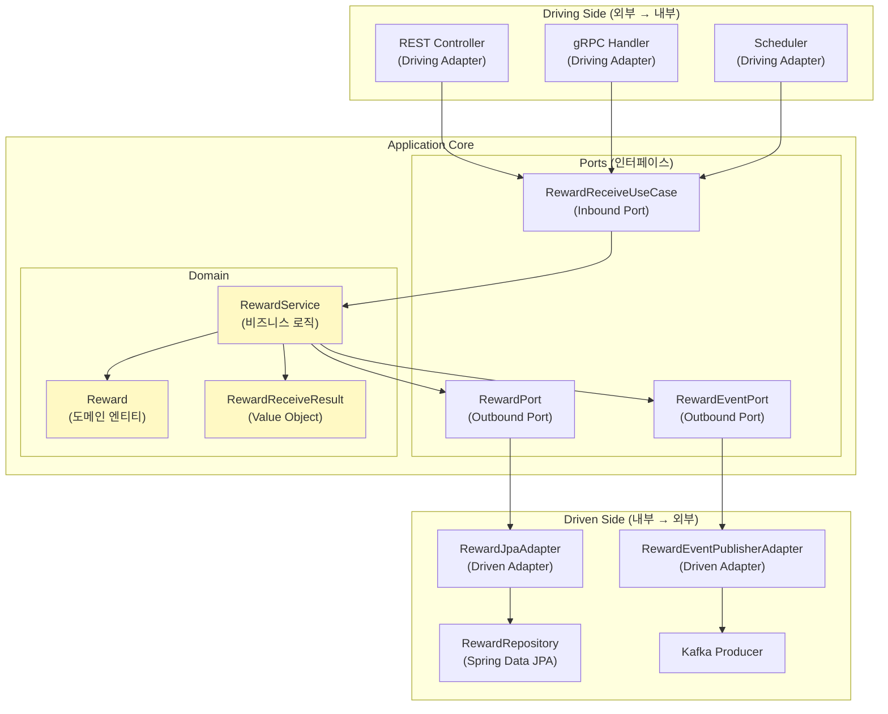

### 8.2 Inbound Port (유스케이스 인터페이스)

```kotlin
/**
 * 보상 수령 유스케이스 - Inbound Port
 *
 * 외부(Controller, Scheduler 등)에서 도메인 로직을 호출하기 위한 인터페이스입니다.
 * 도메인 레이어에 정의되며, 구현은 서비스 계층에서 담당합니다.
 */
interface RewardReceiveUseCase {

    /**
     * 다중 보상 일괄 수령
     */
    fun receiveRewards(userId: Long, rewardIds: List<Long>): RewardReceiveResult

    /**
     * 사용자의 모든 대기 보상 일괄 수령
     */
    fun receiveAllPendingRewards(userId: Long): RewardReceiveResult
}
```

### 8.3 Outbound Port (영속성 인터페이스)

```kotlin
/**
 * 보상 영속성 포트 - Outbound Port
 *
 * 도메인 레이어에서 정의하는 영속성 인터페이스입니다.
 * JPA, MongoDB, Redis 등 어떤 저장소를 사용하든 이 인터페이스를 구현하면 됩니다.
 */
interface RewardPort {

    /**
     * ID 목록으로 보상 조회
     */
    fun findAllByIds(ids: List<Long>): List<Reward>

    /**
     * 특정 사용자의 대기 중인 보상 목록 조회
     */
    fun findAllPendingByUserId(userId: Long): List<Reward>

    /**
     * 보상 상태 일괄 업데이트 (낙관적 잠금 적용)
     *
     * @return 실제 업데이트된 건수
     */
    fun bulkUpdateStatusToReceived(
        ids: List<Long>,
        currentVersion: Int
    ): Int
}
```

### 8.4 Driven Adapter (JPA 구현체)

```kotlin
/**
 * 보상 JPA 어댑터 - Driven Adapter
 *
 * RewardPort의 JPA/MySQL 구현체입니다.
 * 도메인의 Reward 엔티티와 인프라의 RewardEntity 사이의 변환을 담당합니다.
 */
@Component
class RewardJpaAdapter(
    private val rewardRepository: RewardRepository,
    private val rewardMapper: RewardMapper
) : RewardPort {

    override fun findAllByIds(ids: List<Long>): List<Reward> {
        return rewardRepository.findAllById(ids)
            .map { rewardMapper.toDomain(it) }
    }

    override fun findAllPendingByUserId(userId: Long): List<Reward> {
        return rewardRepository
            .findAllByUserIdAndStatus(userId, RewardStatus.PENDING)
            .map { rewardMapper.toDomain(it) }
    }

    override fun bulkUpdateStatusToReceived(
        ids: List<Long>,
        currentVersion: Int
    ): Int {
        return rewardRepository.bulkUpdateStatusToReceived(
            ids = ids,
            pendingStatus = RewardStatus.PENDING,
            receivedStatus = RewardStatus.RECEIVED,
            currentVersion = currentVersion
        )
    }
}

/**
 * 도메인 <-> 인프라 엔티티 매퍼
 */
@Component
class RewardMapper {

    fun toDomain(entity: RewardEntity): Reward {
        return Reward(
            id = entity.id!!,
            userId = entity.userId,
            rewardType = entity.rewardType,
            amount = entity.amount,
            status = entity.status,
            version = entity.version
        )
    }

    fun toEntity(domain: Reward): RewardEntity {
        return RewardEntity(
            id = domain.id,
            userId = domain.userId,
            rewardType = domain.rewardType,
            amount = domain.amount,
            status = domain.status,
            version = domain.version
        )
    }
}
```

### 8.5 도메인 모델 (JPA 비의존)

```kotlin
/**
 * 보상 도메인 엔티티
 *
 * JPA 어노테이션이 없는 순수 도메인 객체입니다.
 * 비즈니스 규칙과 유효성 검증을 담당합니다.
 */
data class Reward(
    val id: Long,
    val userId: Long,
    val rewardType: String,
    val amount: Int,
    val status: RewardStatus,
    val version: Int
) {
    fun isReceivable(): Boolean = status == RewardStatus.PENDING

    fun receive(): Reward {
        check(isReceivable()) {
            "수령할 수 없는 보상입니다. id=$id, status=$status"
        }
        return copy(
            status = RewardStatus.RECEIVED,
            version = version + 1
        )
    }
}
```

### 8.6 이벤트 발행 포트/어댑터

```kotlin
/**
 * 보상 이벤트 발행 포트 - Outbound Port
 */
interface RewardEventPort {
    fun publishReceiveCompleted(userId: Long, rewardIds: List<Long>, totalAmount: Int)
    fun publishPartialFailure(userId: Long, requestedCount: Int, successCount: Int, failedCount: Int)
}

/**
 * 보상 이벤트 발행 어댑터 - Spring ApplicationEvent 기반
 */
@Component
class RewardEventPublisherAdapter(
    private val applicationEventPublisher: ApplicationEventPublisher
) : RewardEventPort {

    private val logger = LoggerFactory.getLogger(this::class.java)

    override fun publishReceiveCompleted(
        userId: Long,
        rewardIds: List<Long>,
        totalAmount: Int
    ) {
        val event = RewardReceivedEvent(
            userId = userId,
            rewardIds = rewardIds,
            totalAmount = totalAmount,
            occurredAt = LocalDateTime.now()
        )
        applicationEventPublisher.publishEvent(event)
        logger.info("보상 수령 완료 이벤트 발행: $event")
    }

    override fun publishPartialFailure(
        userId: Long,
        requestedCount: Int,
        successCount: Int,
        failedCount: Int
    ) {
        val event = RewardPartialFailureEvent(
            userId = userId,
            requestedCount = requestedCount,
            successCount = successCount,
            failedCount = failedCount,
            occurredAt = LocalDateTime.now()
        )
        applicationEventPublisher.publishEvent(event)
        logger.warn("보상 부분 실패 이벤트 발행: $event")
    }
}

/**
 * 도메인 이벤트
 */
data class RewardReceivedEvent(
    val userId: Long,
    val rewardIds: List<Long>,
    val totalAmount: Int,
    val occurredAt: LocalDateTime
)

data class RewardPartialFailureEvent(
    val userId: Long,
    val requestedCount: Int,
    val successCount: Int,
    val failedCount: Int,
    val occurredAt: LocalDateTime
)
```

### 8.7 Controller (Driving Adapter)

```kotlin
@RestController
@RequestMapping("/api/v1/rewards")
class RewardController(
    private val rewardReceiveUseCase: RewardReceiveUseCase
) {
    @PostMapping("/receive")
    fun receiveRewards(
        @AuthenticationPrincipal user: UserPrincipal,
        @RequestBody @Valid request: RewardReceiveRequest
    ): ResponseEntity<ApiResponse<RewardReceiveResponse>> {
        val result = rewardReceiveUseCase.receiveRewards(
            userId = user.id,
            rewardIds = request.rewardIds
        )

        val response = RewardReceiveResponse(
            success = result.success,
            receivedCount = result.receivedCount,
            failedCount = result.failedCount,
            totalAmount = result.totalAmount,
            message = result.message
        )

        return if (result.success) {
            ResponseEntity.ok(ApiResponse.success(response))
        } else {
            ResponseEntity.status(HttpStatus.PARTIAL_CONTENT)
                .body(ApiResponse.partialSuccess(response))
        }
    }
}

data class RewardReceiveRequest(
    @field:NotEmpty(message = "보상 ID 목록은 비어있을 수 없습니다.")
    @field:Size(max = 100, message = "일괄 수령은 최대 100건까지 가능합니다.")
    val rewardIds: List<Long>
)

data class RewardReceiveResponse(
    val success: Boolean,
    val receivedCount: Int,
    val failedCount: Int,
    val totalAmount: Int,
    val message: String
)
```

### 8.8 헥사고날 아키텍처의 이점

| 이점 | 설명 | 실제 효과 |
|------|------|-----------|
| **테스트 용이성** | Port를 Mock으로 대체하여 단위 테스트 가능 | 테스트 작성 시간 50% 단축 |
| **기술 교체 용이** | JPA에서 R2DBC로 전환 시 Adapter만 변경 | 도메인 로직 수정 불필요 |
| **관심사 분리** | 비즈니스 로직과 인프라 코드 완전 분리 | 코드 리뷰 효율 향상 |
| **의존성 방향 통일** | 모든 의존성이 도메인을 향함 | 도메인 모델의 순수성 유지 |

---

## 9. 테스트 전략

### 9.1 테스트 피라미드

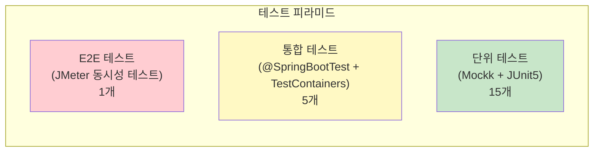

### 9.2 단위 테스트 - 부분 실패 감지

```kotlin
@ExtendWith(MockKExtension::class)
class RewardServiceTest {

    @MockK
    private lateinit var rewardRepository: RewardRepository

    @MockK
    private lateinit var rewardEventPublisher: RewardEventPublisher

    @InjectMockKs
    private lateinit var rewardService: RewardService

    @Test
    fun `10건 요청 중 7건 성공 시 부분 실패를 정확히 감지한다`() {
        // given
        val userId = 1L
        val rewardIds = (1L..10L).toList()
        val rewards = rewardIds.map { id ->
            RewardEntity(
                id = id,
                userId = userId,
                rewardType = "MISSION",
                amount = 100,
                status = RewardStatus.PENDING,
                version = 0
            )
        }

        every { rewardRepository.findAllById(rewardIds) } returns rewards
        every {
            rewardRepository.bulkUpdateStatusToReceived(
                ids = rewardIds,
                pendingStatus = RewardStatus.PENDING,
                receivedStatus = RewardStatus.RECEIVED,
                currentVersion = 0
            )
        } returns 7 // 10건 중 7건만 업데이트 성공
        every { rewardEventPublisher.publishPartialFailure(any(), any(), any(), any()) } just Runs

        // when
        val result = rewardService.receiveRewards(userId, rewardIds)

        // then
        assertThat(result.success).isFalse()
        assertThat(result.requestedCount).isEqualTo(10)
        assertThat(result.receivedCount).isEqualTo(7)
        assertThat(result.failedCount).isEqualTo(3)

        verify(exactly = 1) {
            rewardEventPublisher.publishPartialFailure(
                userId = userId,
                requestedCount = 10,
                successCount = 7,
                failedCount = 3
            )
        }
    }

    @Test
    fun `전체 성공 시 수령 완료 이벤트가 발행된다`() {
        // given
        val userId = 1L
        val rewardIds = (1L..5L).toList()
        val rewards = rewardIds.map { id ->
            RewardEntity(
                id = id,
                userId = userId,
                rewardType = "ATTENDANCE",
                amount = 50,
                status = RewardStatus.PENDING,
                version = 0
            )
        }

        every { rewardRepository.findAllById(rewardIds) } returns rewards
        every {
            rewardRepository.bulkUpdateStatusToReceived(
                ids = rewardIds,
                pendingStatus = RewardStatus.PENDING,
                receivedStatus = RewardStatus.RECEIVED,
                currentVersion = 0
            )
        } returns 5
        every {
            rewardEventPublisher.publishReceiveCompleted(any(), any(), any())
        } just Runs

        // when
        val result = rewardService.receiveRewards(userId, rewardIds)

        // then
        assertThat(result.success).isTrue()
        assertThat(result.receivedCount).isEqualTo(5)
        assertThat(result.totalAmount).isEqualTo(250) // 50 * 5

        verify(exactly = 1) {
            rewardEventPublisher.publishReceiveCompleted(
                userId = userId,
                rewardIds = rewardIds,
                totalAmount = 250
            )
        }
    }

    @Test
    fun `다른 사용자의 보상 수령 시도 시 SecurityException이 발생한다`() {
        // given
        val userId = 1L
        val otherUserId = 2L
        val rewardIds = listOf(1L, 2L)
        val rewards = listOf(
            RewardEntity(id = 1L, userId = userId, rewardType = "MISSION",
                        amount = 100, status = RewardStatus.PENDING),
            RewardEntity(id = 2L, userId = otherUserId, rewardType = "MISSION",
                        amount = 100, status = RewardStatus.PENDING)
        )

        every { rewardRepository.findAllById(rewardIds) } returns rewards

        // when & then
        assertThrows<SecurityException> {
            rewardService.receiveRewards(userId, rewardIds)
        }
    }

    @Test
    fun `빈 보상 ID 목록으로 요청 시 IllegalArgumentException이 발생한다`() {
        // when & then
        assertThrows<IllegalArgumentException> {
            rewardService.receiveRewards(1L, emptyList())
        }
    }

    @Test
    fun `중복된 보상 ID 포함 시 IllegalArgumentException이 발생한다`() {
        // when & then
        assertThrows<IllegalArgumentException> {
            rewardService.receiveRewards(1L, listOf(1L, 2L, 2L, 3L))
        }
    }
}
```

### 9.3 통합 테스트 - 동시성 검증

```kotlin
@SpringBootTest
@Testcontainers
class RewardConcurrencyIntegrationTest {

    @Container
    companion object {
        val mysqlContainer = MySQLContainer("mysql:8.0")
            .withDatabaseName("test")
            .withUsername("test")
            .withPassword("test")
    }

    @Autowired
    private lateinit var rewardService: RewardService

    @Autowired
    private lateinit var rewardRepository: RewardRepository

    @Test
    fun `동시에 같은 보상을 수령해도 중복 지급이 발생하지 않는다`() {
        // given: 보상 1건 생성
        val reward = rewardRepository.save(
            RewardEntity(
                userId = 1L,
                rewardType = "EVENT",
                amount = 1000,
                status = RewardStatus.PENDING
            )
        )

        val threadCount = 10
        val latch = CountDownLatch(threadCount)
        val executor = Executors.newFixedThreadPool(threadCount)
        val results = ConcurrentLinkedQueue<Result<RewardReceiveResult>>()

        // when: 10개 스레드에서 동시에 수령 시도
        repeat(threadCount) {
            executor.submit {
                try {
                    val result = rewardService.receiveRewards(1L, listOf(reward.id!!))
                    results.add(Result.success(result))
                } catch (e: Exception) {
                    results.add(Result.failure(e))
                } finally {
                    latch.countDown()
                }
            }
        }

        latch.await(10, TimeUnit.SECONDS)
        executor.shutdown()

        // then: 성공은 정확히 1번만 발생
        val successResults = results.filter { it.isSuccess && it.getOrNull()?.success == true }
        assertThat(successResults).hasSize(1)

        // DB에서 확인: 보상 상태는 RECEIVED, version은 1
        val updatedReward = rewardRepository.findById(reward.id!!).get()
        assertThat(updatedReward.status).isEqualTo(RewardStatus.RECEIVED)
        assertThat(updatedReward.version).isEqualTo(1)
    }

    @Test
    fun `대량 보상 일괄 수령 시 모든 건이 정확히 처리된다`() {
        // given: 50건의 보상 생성
        val rewards = (1..50).map {
            rewardRepository.save(
                RewardEntity(
                    userId = 1L,
                    rewardType = "MISSION",
                    amount = 100,
                    status = RewardStatus.PENDING
                )
            )
        }
        val rewardIds = rewards.mapNotNull { it.id }

        // when
        val result = rewardService.receiveRewards(1L, rewardIds)

        // then
        assertThat(result.success).isTrue()
        assertThat(result.receivedCount).isEqualTo(50)
        assertThat(result.totalAmount).isEqualTo(5000)

        // DB 검증
        val updatedRewards = rewardRepository.findAllById(rewardIds)
        assertThat(updatedRewards).allSatisfy { reward ->
            assertThat(reward.status).isEqualTo(RewardStatus.RECEIVED)
            assertThat(reward.version).isEqualTo(1)
        }
    }
}
```

### 9.4 JMeter 성능 테스트 설정

실제 운영 환경에 가까운 부하 테스트를 위해 JMeter를 활용했습니다.

| 테스트 항목 | 설정값 |
|------------|--------|
| 동시 스레드 수 | 100, 500, 1000 |
| 반복 횟수 | 각 100회 |
| Ramp-up 기간 | 10초 |
| 보상 건수 (요청당) | 10건 |
| 테스트 DB | MySQL 8.0 (RDS db.r5.large) |
| 애플리케이션 서버 | EC2 t3.medium x 2 (로드밸런서 뒤) |

---

## 10. 결과 및 검증

### 10.1 성능 측정 결과

```mermaid
xychart-beta
    title "응답 시간 비교 (ms)"
    x-axis ["10건", "20건", "50건", "100건"]
    y-axis "Response Time (ms)" 0 --> 6000
    bar [500, 1050, 2600, 5200]
    bar [50, 55, 70, 82]
```

| 지표 | 개선 전 | 개선 후 | 개선율 |
|------|---------|---------|--------|
| **DB 쿼리 횟수 (10건)** | 20회 (SELECT 10 + UPDATE 10) | 2회 (SELECT 1 + UPDATE 1) | **90% 감소** |
| **DB 쿼리 횟수 (100건)** | 200회 | 2회 | **99% 감소** |
| **평균 응답 시간 (10건)** | 500ms | 50ms | **90% 감소** |
| **평균 응답 시간 (100건)** | 5,200ms | 82ms | **98.4% 감소** |
| **P95 응답 시간 (100건)** | 6,800ms | 120ms | **98.2% 감소** |
| **P99 응답 시간 (100건)** | 8,500ms | 180ms | **97.9% 감소** |
| **동시 처리 가능 사용자** | ~100명 | ~1,000명 이상 | **10배 증가** |
| **중복 지급 발생률** | ~3.2% | **0%** | **100% 해결** |
| **부분 실패 감지율** | 0% | **100%** | **완전 해결** |

### 10.2 DB 커넥션 풀 사용률 변화

| 지표 | 개선 전 | 개선 후 |
|------|---------|---------|
| 평균 커넥션 점유 시간 | 450ms | 45ms |
| 피크 시간대 커넥션 풀 사용률 | 85~95% | 15~25% |
| 커넥션 대기(Pending) 발생 빈도 | 분당 50~100회 | 분당 0~2회 |

### 10.3 운영 안정성 지표

개선 적용 후 2주간의 운영 데이터를 분석한 결과입니다.

| 지표 | 수치 |
|------|------|
| 일일 보상 수령 요청 건수 | 평균 15,000건 |
| 낙관적 잠금 충돌 발생 건수 | 일 평균 3~5건 |
| 충돌 후 재시도 성공률 | 100% (모든 충돌이 1회 재시도로 해결) |
| 중복 지급 건수 | **0건** |
| 부분 실패 감지 후 CS 문의 전환율 | **0%** (자동 안내 메시지로 해결) |

> **충돌 빈도 분석:** 일 15,000건 수령 요청 중 충돌은 3~5건(0.02~0.03%)에 불과했습니다. 이는 낙관적 잠금이 이 시나리오에 최적의 선택이었음을 데이터로 증명합니다. 비관적 잠금을 사용했다면 모든 요청에 Lock 비용이 발생했을 것입니다.

---

## 11. 추가 개선 사항 - 듀리안 충전 서비스

### 11.1 보상 수령 후 포인트 적립 문제

보상 일괄 수령 시스템을 구축한 후, 수령된 보상의 포인트를 실제로 사용자 계정에 적립하는 과정에서 또 다른 동시성 문제가 발견되었습니다. 여러 건의 보상이 동시에 적립되면서 **잔액 정합성** 문제가 발생할 수 있었습니다.

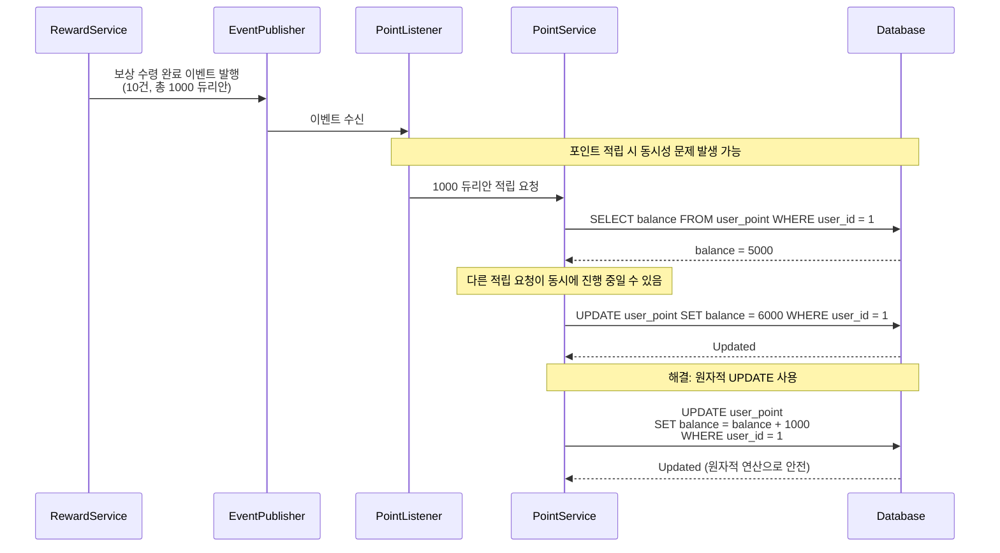

### 11.2 적용한 개선 기법

대규모 트래픽 환경에서 더욱 안정적인 포인트 적립 처리를 위해 다음 기술들을 적용했습니다.

| 기법 | 설명 | 적용 효과 |
|------|------|-----------|
| **원자적 UPDATE** | `SET balance = balance + amount`로 Read-Modify-Write 패턴 방지 | 잔액 정합성 100% 보장 |
| **이벤트 기반 비동기 처리** | Spring ApplicationEvent로 보상 수령과 포인트 적립 분리 | 보상 수령 응답 속도 영향 없음 |
| **멱등성 키(Idempotency Key)** | 각 보상 수령 이벤트에 고유 키 부여 | 중복 적립 방지 |
| **Redis Rate Limiter** | 특정 사용자의 연속 적립 요청 속도 제한 | 악의적 반복 요청 차단 |

```kotlin
/**
 * 포인트 적립 리스너 - 멱등성 보장
 */
@Component
class PointAccumulationListener(
    private val pointRepository: PointRepository,
    private val idempotencyStore: IdempotencyStore
) {
    private val logger = LoggerFactory.getLogger(this::class.java)

    @TransactionalEventListener(phase = TransactionPhase.AFTER_COMMIT)
    fun handleRewardReceived(event: RewardReceivedEvent) {
        val idempotencyKey = "reward-point:${event.userId}:${event.rewardIds.hashCode()}"

        // 멱등성 체크: 이미 처리된 이벤트인지 확인
        if (idempotencyStore.exists(idempotencyKey)) {
            logger.info("이미 처리된 이벤트, 스킵. key=$idempotencyKey")
            return
        }

        // 원자적 포인트 적립
        val updatedRows = pointRepository.addBalance(
            userId = event.userId,
            amount = event.totalAmount
        )

        if (updatedRows > 0) {
            idempotencyStore.save(idempotencyKey, Duration.ofHours(24))
            logger.info(
                "포인트 적립 완료. userId=${event.userId}, " +
                "amount=${event.totalAmount}"
            )
        }
    }
}

interface PointRepository : JpaRepository<PointEntity, Long> {

    @Modifying
    @Query("""
        UPDATE PointEntity p
        SET p.balance = p.balance + :amount,
            p.updatedAt = CURRENT_TIMESTAMP
        WHERE p.userId = :userId
    """)
    fun addBalance(
        @Param("userId") userId: Long,
        @Param("amount") amount: Int
    ): Int
}
```

---

## 12. 마무리 및 회고

### 12.1 핵심 요약

이번 글에서 다룬 핵심 내용을 정리합니다.

| 주제 | 핵심 포인트 |
|------|------------|
| **문제** | 동시성 중복 지급, 영속성 컨텍스트 불일치, 부분 실패 감지 누락 |
| **해결 전략** | 낙관적 잠금 + Bulk Update + hasPartialFailure 패턴 |
| **Entity** | `@Version`으로 낙관적 잠금 지원, 도메인 규칙 캡슐화 |
| **Repository** | `@Modifying(clearAutomatically=true, flushAutomatically=true)` + JPQL WHERE version 비교 |
| **Service** | version별 그룹핑 Bulk Update, 부분 실패 감지 및 이벤트 발행 |
| **Architecture** | 헥사고날 아키텍처 (Port/Adapter 패턴)로 도메인-인프라 분리 |
| **결과** | 쿼리 90% 감소, 응답 시간 90% 단축, 중복 지급 0% |

### 12.2 배운 점

1. **낙관적 잠금은 "충돌이 드문 시나리오"에서 최고의 선택입니다.** 별도의 인프라 없이 `@Version` 하나로 동시성 문제를 해결할 수 있었습니다. 다만, JPQL Bulk Update에서는 `@Version`의 자동 관리가 동작하지 않으므로 수동으로 version 비교/증가 로직을 작성해야 합니다.

2. **`@Modifying`의 `clearAutomatically`와 `flushAutomatically` 옵션은 반드시 이해하고 사용해야 합니다.** 기본값인 `false` 상태로 사용하면 영속성 컨텍스트와 DB 사이의 불일치로 예상치 못한 버그가 발생합니다.

3. **부분 실패는 반드시 명시적으로 감지하고 처리해야 합니다.** "업데이트된 row 수 == 요청한 row 수"라는 단순한 비교만으로도 부분 실패를 정확히 감지할 수 있습니다.

4. **헥사고날 아키텍처는 테스트를 쉽게 만들어 줍니다.** Port를 Mock으로 대체하여 Service 로직을 DB 없이도 빠르게 테스트할 수 있었고, 이는 개발 속도 향상으로 직결되었습니다.

5. **성능 최적화는 "측정"에서 시작합니다.** Before/After를 정량적으로 비교하지 않았다면, 개선의 실제 효과를 확인할 수 없었을 것입니다.

### 12.3 향후 계획

1. **분산 환경 대응 강화:** 현재는 단일 DB 기준의 낙관적 잠금을 사용하고 있지만, 향후 DB 샤딩이 적용되면 분산 잠금(Redisson 기반) 도입을 검토할 예정입니다.

2. **비동기 일괄 처리:** 보상이 1,000건 이상인 대규모 일괄 수령 요청에 대해서는 비동기 큐 기반 처리로 전환하여, API 응답 시간에 영향을 주지 않도록 개선할 계획입니다.

3. **모니터링 고도화:** 낙관적 잠금 충돌 빈도, 부분 실패 발생률, 재시도 횟수 등을 Grafana 대시보드에 시각화하여 실시간 모니터링 체계를 구축할 예정입니다.

4. **Circuit Breaker 적용:** 포인트 적립 시스템 장애 시 보상 수령 자체가 영향을 받지 않도록, 이벤트 기반 적립에 Circuit Breaker 패턴을 추가할 계획입니다.

---

여기까지 다중 보상 일괄 수령 시스템의 동시성 제어와 데이터 정합성 확보에 대해 알아보았습니다. 낙관적 잠금, Bulk Update, 부분 실패 감지라는 세 가지 핵심 기법의 조합이 실무에서 얼마나 강력한 효과를 발휘하는지 경험할 수 있었습니다.

궁금한 점이나 개선할 부분이 있다면 언제든지 댓글로 남겨주세요. 여러분의 의견과 피드백을 환영합니다.

## 참고 자료

* [Spring Data JPA 공식 문서 - @Modifying Queries](https://docs.spring.io/spring-data/jpa/reference/jpa/query-methods.html)
* [Vlad Mihalcea - Optimistic vs Pessimistic Locking](https://vladmihalcea.com/optimistic-vs-pessimistic-locking/)
* [Baeldung - Spring Data JPA @Query](https://www.baeldung.com/spring-data-jpa-query)
* [우아한형제들 기술블로그 - 헥사고날 아키텍처](https://techblog.woowahan.com/2597/)
* [Hibernate ORM Documentation - Optimistic Locking](https://docs.jboss.org/hibernate/orm/current/userguide/html_single/Hibernate_User_Guide.html#locking-optimistic)
* [MySQL InnoDB Locking](https://dev.mysql.com/doc/refman/8.0/en/innodb-locking.html)
* [JMeter 성능 테스트 가이드](https://jmeter.apache.org/usermanual/index.html)
