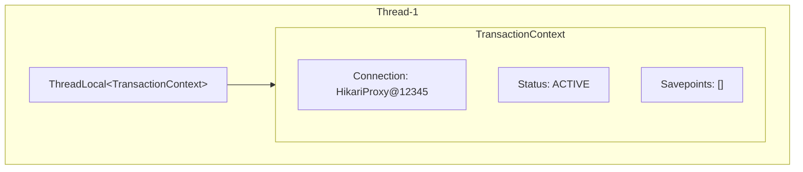
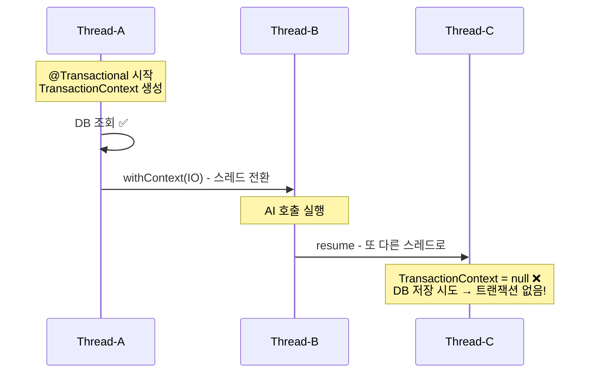
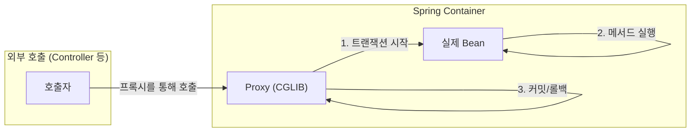
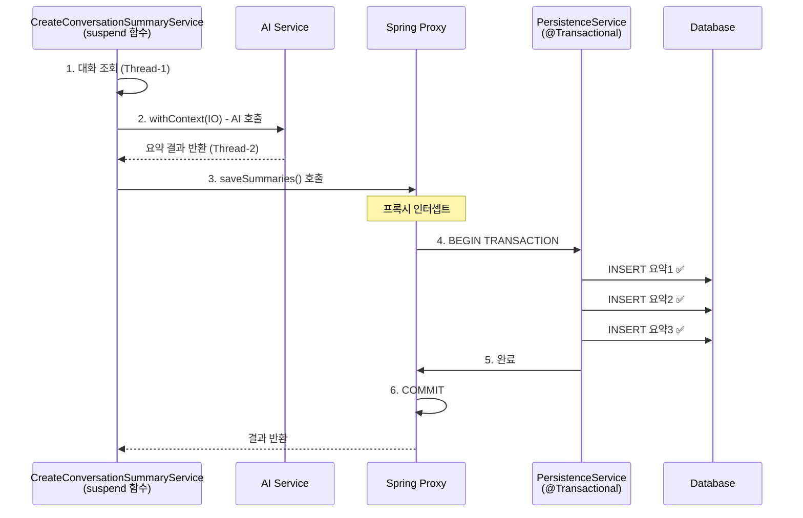

<script src="https://cdn.jsdelivr.net/npm/mermaid@10/dist/mermaid.min.js"></script>
<script>
document.addEventListener('DOMContentLoaded', function() {
  document.querySelectorAll('pre > code.language-mermaid').forEach(function(el) {
    el.parentElement.outerHTML = '<pre class="mermaid">' + el.textContent + '</pre>';
  });
  mermaid.initialize({ startOnLoad: true, theme: 'default', securityLevel: 'loose' });
});
</script>

## 1. 문제 상황

Kotlin 코루틴을 사용하면서 Spring의 `@Transactional`을 함께 사용할 때, 예상치 못한 트랜잭션 유실 문제를 겪으신 적이 있으신가요?

```kotlin
// ❌ 이 코드는 위험합니다!
@Transactional
override suspend fun createConversationSummary(command: CreateConversationSummaryCommand): Int {
    val todayConversations = queryConversationPort.findAllTodayUserConversations(...)
    
    val summaries = withContext(Dispatchers.IO) {  // 💥 스레드 전환!
        handleSummary(todayConversations)
    }
    
    // 여기서 트랜잭션이 없을 수 있습니다!
    for (summary in summaries) {
        commandConversationSummaryPort.saveConversationSummary(...)
    }
}
```

핵심 문제는 간단합니다. **Spring의 `@Transactional`은 ThreadLocal 기반**으로 동작하는데, **코루틴은 스레드를 전환**할 수 있기 때문입니다. 스레드가 바뀌면 ThreadLocal에 저장된 트랜잭션 컨텍스트에 접근할 수 없게 됩니다.

---

## 2. 해결 과정

### 2.1 Spring @Transactional의 동작 원리 이해

먼저 `@Transactional`이 어떻게 동작하는지 이해해야 합니다.



`TransactionSynchronizationManager`가 현재 스레드의 ThreadLocal에 트랜잭션 정보(Connection, Status 등)를 저장합니다. 같은 스레드 내에서만 이 정보에 접근할 수 있고, 다른 스레드로 전환되면 트랜잭션 정보가 없는 것처럼 동작합니다.

### 2.2 코루틴의 스레드 전환 문제

코루틴에서 `withContext(Dispatchers.IO)`를 사용하면 실행 스레드가 바뀔 수 있습니다.



**결과적으로 다음과 같은 문제가 발생합니다:**
- DB 저장이 새로운 트랜잭션에서 실행되거나
- 트랜잭션 없이 실행됨
- 롤백이 필요한 상황에서 롤백 불가

### 2.3 private 메서드에 @Transactional이 동작하지 않는 이유

이 문제를 해결하기 전에, Spring AOP의 프록시 동작 방식도 이해해야 합니다.



**프록시가 동작하지 않는 경우:**

```kotlin
@Service
class MyService {
    @Transactional
    fun publicMethod() {
        // ✅ 외부에서 프록시를 통해 호출됨 → 트랜잭션 동작
        privateMethod()  // ❌ 내부 호출 → 프록시 우회!
    }
    
    @Transactional  // 🚫 무시됨!
    private fun privateMethod() {
        // 트랜잭션 없이 실행됨
    }
}
```

- **CGLIB 프록시는 상속 기반** → private 메서드는 상속 불가
- **내부 호출은 `this`를 통해 직접 호출** → 프록시를 거치지 않음
- **Kotlin은 기본이 final** → `spring-kotlin-allopen` 플러그인이 필요

---

## 3. 코드 예시: 4가지 해결 방안

### 방안 1: 트랜잭션 범위 분리 (권장 ⭐)

가장 명확하고 안전한 방법입니다. 트랜잭션을 담당하는 별도 서비스를 만들어 책임을 분리합니다.

```kotlin
// 트랜잭션 전담 서비스 - 일반 함수로 안전하게 처리
@Service
class ConversationSummaryPersistenceService(
    private val commandConversationSummaryPort: CommandConversationSummaryPort
) {
    @Transactional  // ✅ 일반 함수 + 외부 호출 → 트랜잭션 정상 동작
    fun saveSummaries(userId: UUID, summaryContents: List<String>): Int {
        summaryContents.forEach { content ->
            val newSummary = ConversationSummary.create(userId, content)
            commandConversationSummaryPort.saveConversationSummary(newSummary)
        }
        return summaryContents.size
    }
}

// 메인 서비스 - 코루틴 처리
@Service
class CreateConversationSummaryService(
    private val persistenceService: ConversationSummaryPersistenceService,
    private val queryConversationPort: QueryConversationPort
) : CreateConversationSummaryUseCase {
    
    // ✅ @Transactional 없음 - suspend 함수에서 안전
    override suspend fun createConversationSummary(
        command: CreateConversationSummaryCommand
    ): Int {
        val todayConversations = queryConversationPort.findAllTodayUserConversations(
            command.userId, command.targetDate
        )
        
        if (todayConversations.isEmpty()) return 0
        
        // AI 호출은 IO 디스패처에서 (스레드 전환 발생)
        val summaries = withContext(Dispatchers.IO) {
            handleSummary(todayConversations)
        }
        
        // ✅ 외부 빈 호출 → 프록시 통과 → 트랜잭션 동작 보장
        return withContext(Dispatchers.IO) {
            persistenceService.saveSummaries(command.userId, summaries)
        }
    }
}
```

### 방안 2: TransactionalOperator 사용

Spring 5.2+에서 제공하는 리액티브 트랜잭션 관리자입니다.

```kotlin
@Service
class CreateConversationSummaryService(
    private val transactionalOperator: TransactionalOperator
) : CreateConversationSummaryUseCase {
    
    override suspend fun createConversationSummary(
        command: CreateConversationSummaryCommand
    ): Int {
        val summaries = withContext(Dispatchers.IO) {
            handleSummary(todayConversations)
        }
        
        // TransactionalOperator로 명시적 트랜잭션 관리
        return transactionalOperator.executeAndAwait {
            summaries.forEach { summaryText ->
                val newSummary = ConversationSummary.create(command.userId, summaryText)
                commandConversationSummaryPort.saveConversationSummary(newSummary)
            }
            summaries.size
        }
    }
}

// Configuration에서 Bean 등록
@Configuration
class TransactionConfig {
    @Bean
    fun transactionalOperator(tm: PlatformTransactionManager): TransactionalOperator {
        return TransactionalOperator.create(tm)
    }
}
```

### 방안 3: Self-Injection

자기 자신을 주입받아 프록시를 통해 호출하는 방법입니다.

```kotlin
@Service
class CreateConversationSummaryService(
    private val commandConversationSummaryPort: CommandConversationSummaryPort
) {
    @Autowired
    private lateinit var self: CreateConversationSummaryService  // 자기 자신 주입
    
    suspend fun createConversationSummary(command: CreateConversationSummaryCommand): Int {
        val summaries = withContext(Dispatchers.IO) {
            handleSummary(todayConversations)
        }
        
        // ✅ self를 통해 호출 → 프록시 경유 → 트랜잭션 동작
        return withContext(Dispatchers.IO) {
            self.saveSummaries(command.userId, summaries)
        }
    }
    
    @Transactional
    fun saveSummaries(userId: UUID, summaries: List<String>): Int {
        summaries.forEach { summaryText ->
            commandConversationSummaryPort.saveConversationSummary(...)
        }
        return summaries.size
    }
}
```

> ⚠️ Self-Injection은 순환 참조처럼 보여 코드 가독성이 떨어질 수 있습니다.

### 방안 4: TransactionTemplate (동기 방식)

가장 기본적인 프로그래매틱 트랜잭션 관리입니다.

```kotlin
@Service
class CreateConversationSummaryService(
    private val transactionTemplate: TransactionTemplate
) {
    suspend fun createConversationSummary(command: CreateConversationSummaryCommand): Int {
        val summaries = withContext(Dispatchers.IO) {
            handleSummary(todayConversations)
        }
        
        return withContext(Dispatchers.IO) {
            transactionTemplate.execute { status ->
                summaries.forEach { summaryText ->
                    commandConversationSummaryPort.saveConversationSummary(...)
                }
                summaries.size
            } ?: 0
        }
    }
}
```

---

## 4. 결과 및 검증

### 4.1 방안별 비교

| 방안 | 장점 | 단점 | 권장 상황 |
|------|------|------|----------|
| **별도 서비스 분리** | 명확한 책임 분리, 테스트 용이 | 클래스 증가 | ✅ 대부분의 경우 |
| **TransactionalOperator** | 코루틴 네이티브 지원 | Spring 5.2+ 필요 | 코루틴 중심 코드 |
| **Self-Injection** | 클래스 분리 불필요 | 코드 가독성 저하 | 간단한 경우 |
| **TransactionTemplate** | 간단, 명시적 | 동기 방식 | 레거시 코드 |

### 4.2 최종 실행 흐름 (방안 1 적용 시)



### 4.3 핵심 검증 포인트

| 검증 항목 | 설명 |
|----------|------|
| **트랜잭션 범위** | `saveSummaries()` 메서드 전체가 하나의 트랜잭션 |
| **롤백 보장** | 저장 중 예외 발생 시 모든 저장이 롤백됨 |
| **프록시 동작** | 외부 Bean 호출이므로 Spring AOP 프록시가 정상 작동 |
| **스레드 안전성** | `PersistenceService`는 일반 함수이므로 스레드 전환 없음 |

---

## 5. 추가 팁

### 5.1 Kotlin에서 주의할 점

Kotlin 클래스와 함수는 기본이 `final`입니다. Spring이 CGLIB 프록시를 만들려면 `open`이어야 하는데, `spring-kotlin-allopen` 플러그인이 `@Service`, `@Transactional` 등이 붙은 클래스를 자동으로 `open`으로 만들어줍니다.

```kotlin
// build.gradle.kts
plugins {
    kotlin("plugin.spring") version "1.9.0"  // allopen 포함
}
```

### 5.2 절대 하지 말아야 할 것들

```kotlin
@Service
class MyService {
    // ❌ protected도 권장하지 않음
    @Transactional
    protected fun protectedMethod() { }
    
    // ❌ 같은 클래스 내 public 메서드도 내부 호출이면 트랜잭션 없음
    fun methodA() {
        methodB()  // 내부 호출 → 프록시 우회
    }
    
    @Transactional
    fun methodB() { }  // methodA에서 호출 시 트랜잭션 없음
    
    // ❌ final 메서드는 CGLIB가 오버라이드 못 함
    @Transactional
    final fun finalMethod() { }
}
```

### 5.3 디버깅 팁

트랜잭션이 제대로 동작하는지 확인하려면 로깅 레벨을 조정하세요:

```yaml
# application.yml
logging:
  level:
    org.springframework.transaction: DEBUG
    org.springframework.orm.jpa: DEBUG
```

---

## 참고 자료

- [Spring Framework - Reactive Transaction Management](https://docs.spring.io/spring-framework/reference/data-access/transaction/programmatic.html#transaction-programmatic-operator)
- [Kotlin Coroutines - Thread Safety and Shared Mutable State](https://kotlinlang.org/docs/shared-mutable-state-and-concurrency.html)
- [Kotlin Coding Conventions](https://kotlinlang.org/docs/coding-conventions.html)
