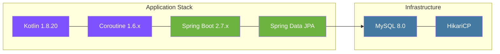
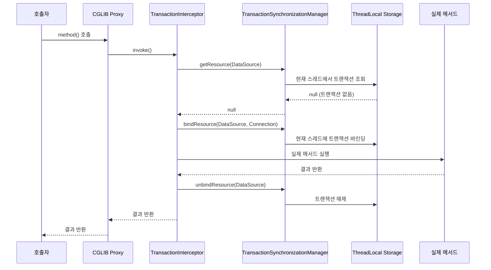
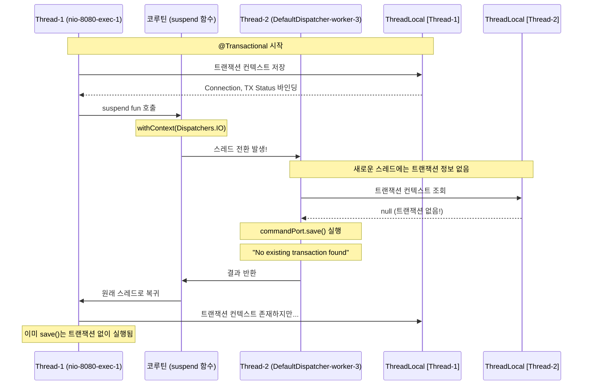
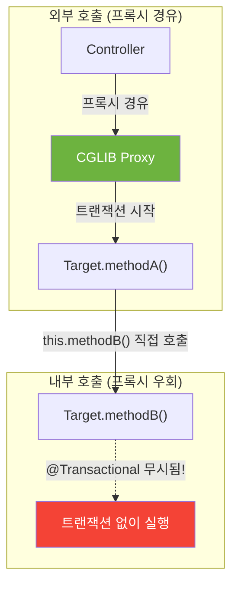
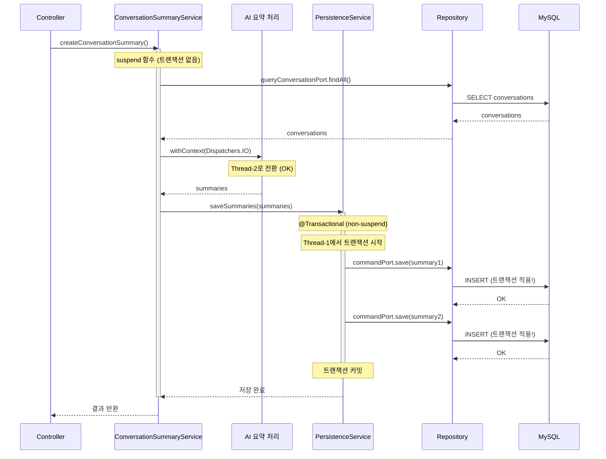
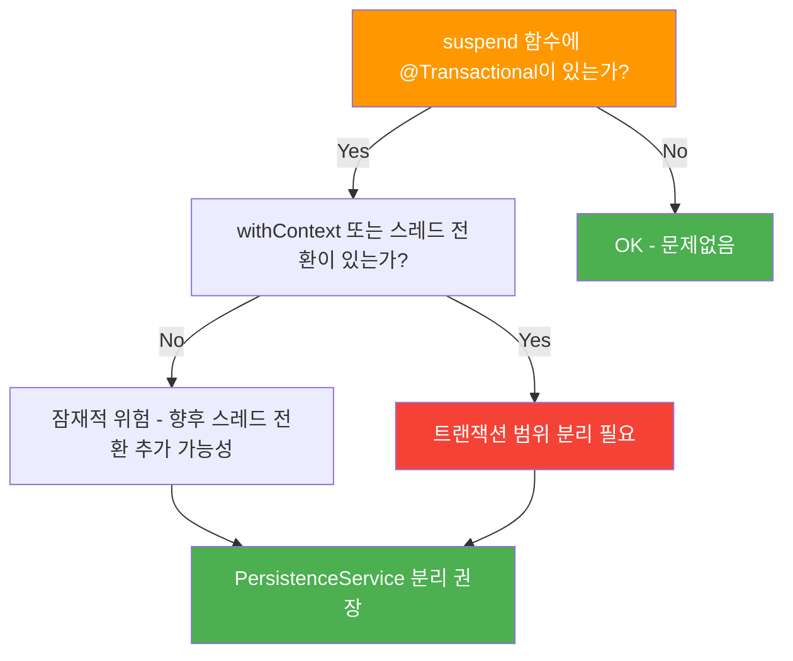
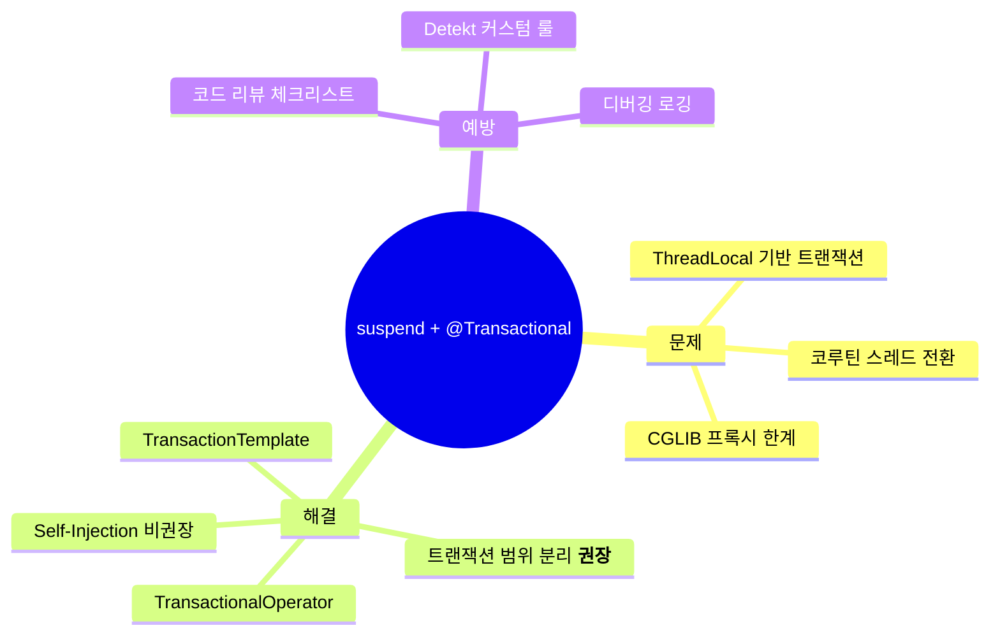

<script src="https://cdn.jsdelivr.net/npm/mermaid@10/dist/mermaid.min.js"></script>
<script>
document.addEventListener('DOMContentLoaded', function() {
  document.querySelectorAll('pre > code.language-mermaid').forEach(function(el) {
    el.parentElement.outerHTML = '<pre class="mermaid">' + el.textContent + '</pre>';
  });
  mermaid.initialize({ startOnLoad: true, theme: 'default', securityLevel: 'loose' });
});
</script>

# [Kotlin/Spring] suspend 함수와 @Transactional의 위험한 조합 - ThreadLocal 기반 트랜잭션의 함정

안녕하세요. duurian 팀에서 백엔드 개발을 담당하고 있는 정지원입니다.

이번 글에서는 Kotlin 코루틴의 `suspend` 함수와 Spring의 `@Transactional` 어노테이션을 함께 사용할 때 발생하는 **트랜잭션 컨텍스트 유실 문제**를 심층적으로 분석하고, 4가지 해결 방안을 비교하여 실무에 바로 적용할 수 있는 가이드라인을 제시하고자 합니다.

`@Transactional`을 분명히 붙였는데 트랜잭션이 동작하지 않는다면, 이 글이 도움이 될 것입니다.

---

## 1. 문제 상황: 트랜잭션이 사라졌다

### 1.1 문제 발견 과정


대화 요약 정보를 생성하고 저장하는 로직을 구현하던 중, 분명히 `@Transactional`을 선언했음에도 불구하고 데이터가 DB에 저장되지 않는 현상을 발견했습니다.

### 1.2 문제의 코드

```kotlin
@Service
class ConversationSummaryService(
    private val queryConversationPort: QueryConversationPort,
    private val commandPort: CommandConversationSummaryPort,
) {

    @Transactional  // 트랜잭션 선언
    override suspend fun createConversationSummary(
        command: CreateSummaryCommand
    ): Int {
        // 1. 대화 데이터 조회
        val conversations = queryConversationPort.findAll(command.userId)

        // 2. AI 요약 생성 (I/O 작업 -> 스레드 전환!)
        val summaries = withContext(Dispatchers.IO) {
            handleSummary(conversations)
        }

        // 3. 요약 저장 (트랜잭션이 이미 유실된 상태!)
        for (summary in summaries) {
            commandPort.save(
                ConversationSummary.create(
                    userId = command.userId,
                    content = summary
                )
            )  // DB에 저장되지 않음!
        }

        return summaries.size
    }
}
```

### 1.3 증상 정리

| 증상 | 상세 |
|------|------|
| 데이터 미저장 | `commandPort.save()` 호출 후에도 DB에 데이터가 존재하지 않음 |
| 롤백 실패 | 예외 발생 시에도 이전 DB 변경 사항이 롤백되지 않음 |
| 경고 로그 | `No existing transaction found for transaction marked with propagation 'REQUIRED'` |
| 재현 조건 | `withContext(Dispatchers.IO)` 사용 시 100% 재현 |

로그에서 확인한 결정적인 단서는 다음과 같았습니다.

```
DEBUG o.s.t.i.TransactionInterceptor
  - No existing transaction found for transaction marked
    with propagation 'REQUIRED'
```

> **핵심 단서**: `@Transactional`을 선언했는데 "No existing transaction found"라는 로그가 출력된다면, 트랜잭션 컨텍스트가 유실된 것입니다. 코루틴의 스레드 전환이 원인일 가능성이 높습니다.

---

## 2. 환경 정보



| 기술 | 버전 | 비고 |
|------|------|------|
| Kotlin | 1.8.20 | JVM 17 타겟 |
| Coroutine | 1.6.x | `kotlinx-coroutines-core` |
| Spring Boot | 2.7.x | Spring Framework 5.3.x |
| Spring Data JPA | 2.7.x | Hibernate 5.6.x |
| MySQL | 8.0 | InnoDB 엔진 |
| Connection Pool | HikariCP 5.x | 기본 설정 |

---

## 3. 원인 분석: ThreadLocal, 코루틴 스레드 전환, CGLIB 프록시

이 문제의 근본 원인을 이해하려면 세 가지 메커니즘을 함께 파악해야 합니다.

### 3.1 @Transactional의 동작 원리: ThreadLocal 기반



Spring의 `@Transactional`은 `TransactionSynchronizationManager`를 통해 트랜잭션 컨텍스트를 관리합니다. 이 클래스의 내부를 살펴보면 핵심이 보입니다.

```java
// TransactionSynchronizationManager.java (Spring Framework 소스)
public abstract class TransactionSynchronizationManager {

    // 모든 트랜잭션 정보가 ThreadLocal에 저장됩니다
    private static final ThreadLocal<Map<Object, Object>> resources =
        new NamedThreadLocal<>("Transactional resources");

    private static final ThreadLocal<Set<TransactionSynchronization>> synchronizations =
        new NamedThreadLocal<>("Transaction synchronizations");

    private static final ThreadLocal<String> currentTransactionName =
        new NamedThreadLocal<>("Current transaction name");

    private static final ThreadLocal<Boolean> currentTransactionReadOnly =
        new NamedThreadLocal<>("Current transaction read-only status");

    private static final ThreadLocal<Integer> currentTransactionIsolationLevel =
        new NamedThreadLocal<>("Current transaction isolation level");

    private static final ThreadLocal<Boolean> actualTransactionActive =
        new NamedThreadLocal<>("Actual transaction active");
}
```

**핵심**: `ThreadLocal`은 각 스레드마다 독립적인 저장 공간을 제공합니다. Thread-A에 바인딩된 트랜잭션 정보는 Thread-B에서 절대 접근할 수 없습니다.

### 3.2 코루틴의 스레드 전환 메커니즘

코루틴의 `suspend` 함수는 일시 중단(suspend)과 재개(resume)를 반복하며, 이 과정에서 **실행 스레드가 바뀔 수 있습니다**. 특히 `withContext(Dispatchers.IO)`를 사용하면 명시적으로 I/O 전용 스레드 풀로 전환됩니다.



위 다이어그램이 이 문제의 본질을 보여줍니다.

1. **Thread-1**에서 `@Transactional`이 트랜잭션을 시작하고, `ThreadLocal`에 트랜잭션 정보를 저장합니다.
2. `withContext(Dispatchers.IO)`로 인해 코루틴이 **Thread-2**로 전환됩니다.
3. **Thread-2**의 `ThreadLocal`에는 트랜잭션 정보가 없으므로, DB 작업이 트랜잭션 없이 실행됩니다.
4. 코루틴이 Thread-1으로 복귀해도, 이미 `save()`는 트랜잭션 밖에서 실행된 후입니다.

### 3.3 CGLIB 프록시의 한계

`@Transactional`은 Spring AOP의 CGLIB 프록시를 통해 동작합니다. 이 프록시에는 중요한 제약 사항이 있습니다.



| 호출 방식 | 프록시 경유 여부 | @Transactional 적용 |
|-----------|:---------------:|:-------------------:|
| 외부에서 Bean 메서드 호출 | O | O |
| 같은 클래스 내부에서 `this.method()` 호출 | X | X |
| `private` 메서드 | X | X |
| `suspend` 함수 (코루틴) | O (부분적) | 스레드 전환 시 유실 |

> **주의**: `suspend` 함수에 `@Transactional`을 붙이면 프록시 자체는 생성됩니다. 하지만 코루틴이 스레드를 전환하는 순간, `ThreadLocal` 기반의 트랜잭션 컨텍스트가 유실됩니다. 프록시가 트랜잭션을 "시작"하는 것과, 실제 DB 작업이 트랜잭션 "안에서" 실행되는 것은 별개의 문제입니다.

### 3.4 세 가지 원인의 결합

문제의 전체 그림을 정리하면 다음과 같습니다.

| 원인 | 설명 | 영향 |
|------|------|------|
| **ThreadLocal 기반 트랜잭션** | `TransactionSynchronizationManager`가 `ThreadLocal`로 트랜잭션 관리 | 스레드가 바뀌면 트랜잭션 정보 접근 불가 |
| **코루틴 스레드 전환** | `withContext(Dispatchers.IO)`로 I/O 스레드 풀 전환 | 트랜잭션이 바인딩된 원래 스레드를 벗어남 |
| **CGLIB 프록시 한계** | 프록시는 외부 호출만 가로챔 | 내부 호출 시 트랜잭션 어드바이스 우회 |

이 세 가지가 결합되면, **`@Transactional`을 선언해도 실제 DB 작업은 트랜잭션 없이 실행**되는 상황이 발생합니다.

---

## 4. 해결 방안: 4가지 선택지 비교

### 4.1 해결 방안 비교표

| 방안 | 접근 방식 | 난이도 | 코루틴 호환 | Spring 통합 | 권장 |
|------|-----------|:------:|:-----------:|:-----------:|:----:|
| **트랜잭션 범위 분리** | 별도 서비스 레이어로 분리 | 낮음 | O | O | **권장** |
| **TransactionalOperator** | 리액티브 트랜잭션 API 사용 | 중간 | O | O | 상황별 |
| **Self-Injection** | 자기 자신을 주입하여 프록시 경유 | 중간 | 부분적 | O | 비권장 |
| **TransactionTemplate** | 프로그래밍 방식 트랜잭션 | 중간 | 부분적 | O | 상황별 |

### 4.2 방안 1: 트랜잭션 범위 분리 (권장)

**핵심 아이디어**: 트랜잭션이 필요한 DB 작업을 별도의 **non-suspend** 메서드로 분리하여, 스레드 전환이 트랜잭션에 영향을 미치지 않도록 합니다.

```kotlin
// ConversationSummaryService.kt - 오케스트레이션 담당
@Service
class ConversationSummaryService(
    private val queryConversationPort: QueryConversationPort,
    private val persistenceService: ConversationPersistenceService,
) {

    // suspend 함수 - 트랜잭션 선언하지 않음
    override suspend fun createConversationSummary(
        command: CreateSummaryCommand
    ): Int {
        // 1. 데이터 조회
        val conversations = queryConversationPort.findAll(command.userId)

        // 2. AI 요약 생성 (I/O 작업, 스레드 전환 OK)
        val summaries = withContext(Dispatchers.IO) {
            handleSummary(conversations)
        }

        // 3. 트랜잭션이 필요한 저장 작업은 별도 서비스에 위임
        persistenceService.saveSummaries(command.userId, summaries)

        return summaries.size
    }

    private suspend fun handleSummary(
        conversations: List<Conversation>
    ): List<String> {
        // AI API 호출 등 I/O 작업
        return conversations.map { summarize(it) }
    }
}
```

```kotlin
// ConversationPersistenceService.kt - 트랜잭션 담당
@Service
class ConversationPersistenceService(
    private val commandPort: CommandConversationSummaryPort,
) {

    @Transactional  // non-suspend 함수 -> ThreadLocal 안전!
    fun saveSummaries(userId: UUID, summaries: List<String>) {
        for (summary in summaries) {
            commandPort.save(
                ConversationSummary.create(
                    userId = userId,
                    content = summary
                )
            )
        }
    }
}
```

**장점**:
- 가장 단순하고 직관적인 해결 방법입니다.
- 관심사 분리(SoC)가 자연스럽게 이루어집니다.
- 기존 Spring의 `@Transactional` 메커니즘을 그대로 활용합니다.
- 테스트 작성이 용이합니다.

**단점**:
- 추가 클래스가 필요합니다. 하지만 이는 아키텍처적으로 오히려 장점이 될 수 있습니다.

### 4.3 방안 2: TransactionalOperator (리액티브)

Spring Framework 5.2부터 제공되는 `TransactionalOperator`를 사용하면 리액티브 환경에서 트랜잭션을 프로그래밍 방식으로 관리할 수 있습니다.

```kotlin
@Service
class ConversationSummaryService(
    private val commandPort: CommandConversationSummaryPort,
    private val transactionalOperator: TransactionalOperator,
) {

    override suspend fun createConversationSummary(
        command: CreateSummaryCommand
    ): Int {
        val conversations = queryConversationPort.findAll(command.userId)
        val summaries = withContext(Dispatchers.IO) {
            handleSummary(conversations)
        }

        // TransactionalOperator로 트랜잭션 경계 명시
        transactionalOperator.executeAndAwait {
            for (summary in summaries) {
                commandPort.save(
                    ConversationSummary.create(
                        userId = command.userId,
                        content = summary
                    )
                )
            }
        }

        return summaries.size
    }
}
```

> **참고**: `TransactionalOperator`를 사용하려면 `ReactiveTransactionManager`가 필요합니다. Spring WebFlux + R2DBC 환경에서 주로 사용되며, 전통적인 Spring MVC + JPA 환경에서는 추가 설정이 필요할 수 있습니다.

**장점**:
- 코루틴 환경에서 트랜잭션 경계를 명시적으로 정의할 수 있습니다.
- 리액티브 스택과 자연스럽게 통합됩니다.

**단점**:
- `ReactiveTransactionManager` 설정이 필요합니다.
- 기존 JPA/JDBC 기반 프로젝트에서는 R2DBC로의 전환이 필요할 수 있습니다.
- 러닝 커브가 존재합니다.

### 4.4 방안 3: Self-Injection (비권장)

CGLIB 프록시의 내부 호출 문제를 해결하기 위해, 자기 자신을 주입받아 프록시를 경유하도록 하는 방법입니다.

```kotlin
@Service
class ConversationSummaryService(
    private val queryConversationPort: QueryConversationPort,
    private val commandPort: CommandConversationSummaryPort,
) {
    // 자기 자신을 주입 (프록시 객체)
    @Autowired
    private lateinit var self: ConversationSummaryService

    override suspend fun createConversationSummary(
        command: CreateSummaryCommand
    ): Int {
        val conversations = queryConversationPort.findAll(command.userId)
        val summaries = handleSummary(conversations)

        // self를 통해 호출하면 프록시를 경유
        // 하지만 여전히 suspend 함수 문제는 해결되지 않음!
        self.saveSummariesInternal(command.userId, summaries)

        return summaries.size
    }

    @Transactional
    fun saveSummariesInternal(userId: UUID, summaries: List<String>) {
        for (summary in summaries) {
            commandPort.save(
                ConversationSummary.create(userId = userId, content = summary)
            )
        }
    }
}
```

> **비권장 이유**: Self-Injection은 순환 참조 문제를 유발할 수 있고, 코드가 복잡해지며, `suspend` 함수의 스레드 전환 문제를 근본적으로 해결하지 못합니다. 결국 `saveSummariesInternal`을 non-suspend로 만들어야 하므로, 방안 1(트랜잭션 범위 분리)과 유사해지면서 코드만 더 복잡해집니다.

### 4.5 방안 4: TransactionTemplate (프로그래밍 방식)

`TransactionTemplate`을 사용하면 어노테이션 없이 프로그래밍 방식으로 트랜잭션 경계를 제어할 수 있습니다.

```kotlin
@Service
class ConversationSummaryService(
    private val queryConversationPort: QueryConversationPort,
    private val commandPort: CommandConversationSummaryPort,
    private val transactionTemplate: TransactionTemplate,
) {

    override suspend fun createConversationSummary(
        command: CreateSummaryCommand
    ): Int {
        val conversations = queryConversationPort.findAll(command.userId)

        val summaries = withContext(Dispatchers.IO) {
            handleSummary(conversations)
        }

        // TransactionTemplate으로 트랜잭션 경계를 명시
        // 주의: execute 블록은 ThreadLocal 스레드에서 실행됨
        transactionTemplate.execute {
            for (summary in summaries) {
                commandPort.save(
                    ConversationSummary.create(
                        userId = command.userId,
                        content = summary
                    )
                )
            }
        }

        return summaries.size
    }
}
```

> **주의사항**: `TransactionTemplate.execute` 블록은 호출한 스레드에서 동기적으로 실행됩니다. 코루틴의 현재 스레드가 `Dispatchers.IO` 스레드라면, 해당 스레드에서 새로운 트랜잭션이 시작됩니다. `withContext` 이후에 호출할 경우, 코루틴이 어떤 스레드에서 재개되는지 주의해야 합니다.

**장점**:
- 별도 클래스 없이 트랜잭션을 제어할 수 있습니다.
- 트랜잭션 전파 수준, 격리 수준 등을 세밀하게 설정할 수 있습니다.

**단점**:
- 비즈니스 로직과 트랜잭션 관리 코드가 섞여 가독성이 떨어집니다.
- `suspend` 함수 내에서 사용 시 스레드 컨텍스트에 주의해야 합니다.

### 4.6 해결 방안 종합 비교

| 기준 | 트랜잭션 범위 분리 | TransactionalOperator | Self-Injection | TransactionTemplate |
|------|:-:|:-:|:-:|:-:|
| **구현 난이도** | 낮음 | 중간 | 중간 | 중간 |
| **관심사 분리** | 우수 | 보통 | 미흡 | 미흡 |
| **테스트 용이성** | 우수 | 보통 | 미흡 | 보통 |
| **스레드 안전성** | 우수 | 우수 | 부분적 | 주의 필요 |
| **추가 의존성** | 없음 | R2DBC | 없음 | 없음 |
| **기존 코드 변경량** | 중간 | 많음 | 적음 | 적음 |
| **유지보수성** | 우수 | 보통 | 미흡 | 보통 |

---

## 5. 구현 예시: 트랜잭션 범위 분리 심층 분석

### 5.1 개선된 아키텍처



이 다이어그램에서 주목할 점은 다음과 같습니다.

1. `ConversationSummaryService`의 `suspend` 함수에는 `@Transactional`을 선언하지 않습니다.
2. `withContext(Dispatchers.IO)`로 스레드 전환이 발생해도 트랜잭션에 영향을 주지 않습니다.
3. `PersistenceService`는 **non-suspend** 함수이므로 `@Transactional`이 정상 동작합니다.

### 5.2 Before/After 코드 비교

**Before (개선 전)** :x:

```kotlin
@Service
class ConversationSummaryService(
    private val queryConversationPort: QueryConversationPort,
    private val commandPort: CommandConversationSummaryPort,
) {

    @Transactional  // suspend 함수에 @Transactional -> 위험!
    override suspend fun createConversationSummary(
        command: CreateSummaryCommand
    ): Int {
        val conversations = queryConversationPort.findAll(command.userId)

        // 스레드 전환 -> ThreadLocal 유실!
        val summaries = withContext(Dispatchers.IO) {
            handleSummary(conversations)
        }

        // 트랜잭션 없이 실행됨
        for (summary in summaries) {
            commandPort.save(...)  // 저장 실패 가능!
        }

        return summaries.size
    }
}
```

**After (개선 후)** :white_check_mark:

```kotlin
// 1. 오케스트레이션 서비스 (suspend, 트랜잭션 없음)
@Service
class ConversationSummaryService(
    private val queryConversationPort: QueryConversationPort,
    private val persistenceService: ConversationPersistenceService,
) {

    override suspend fun createConversationSummary(
        command: CreateSummaryCommand
    ): Int {
        val conversations = queryConversationPort.findAll(command.userId)

        val summaries = withContext(Dispatchers.IO) {
            handleSummary(conversations)
        }

        // 별도 서비스에 위임 -> 트랜잭션 안전!
        persistenceService.saveSummaries(command.userId, summaries)

        return summaries.size
    }
}

// 2. 영속성 서비스 (non-suspend, 트랜잭션 적용)
@Service
class ConversationPersistenceService(
    private val commandPort: CommandConversationSummaryPort,
) {

    @Transactional
    fun saveSummaries(userId: UUID, summaries: List<String>) {
        for (summary in summaries) {
            commandPort.save(
                ConversationSummary.create(userId = userId, content = summary)
            )
        }
    }
}
```

### 5.3 패키지 구조

```
com.duurian.conversation
├── application
│   ├── port
│   │   ├── in
│   │   │   └── CreateConversationSummaryUseCase.kt
│   │   └── out
│   │       ├── QueryConversationPort.kt
│   │       └── CommandConversationSummaryPort.kt
│   └── service
│       ├── ConversationSummaryService.kt        // 오케스트레이션 (suspend)
│       └── ConversationPersistenceService.kt    // 영속성 (non-suspend, @Transactional)
└── adapter
    └── out
        └── persistence
            └── ConversationSummaryPersistenceAdapter.kt
```

---

## 6. 결과 및 검증

### 6.1 트랜잭션 동작 검증

트랜잭션 범위 분리 적용 후, 다음 항목을 검증했습니다.

```kotlin
@SpringBootTest
@Transactional  // 테스트 후 롤백
class ConversationPersistenceServiceTest {

    @Autowired
    lateinit var persistenceService: ConversationPersistenceService

    @Autowired
    lateinit var summaryRepository: ConversationSummaryRepository

    @Test
    fun `saveSummaries는 트랜잭션 내에서 실행된다`() {
        // given
        val userId = UUID.randomUUID()
        val summaries = listOf("요약1", "요약2", "요약3")

        // when
        persistenceService.saveSummaries(userId, summaries)

        // then
        val saved = summaryRepository.findAllByUserId(userId)
        assertThat(saved).hasSize(3)
    }

    @Test
    fun `예외 발생 시 전체 롤백된다`() {
        // given
        val userId = UUID.randomUUID()
        // 의도적으로 예외를 유발하는 데이터 포함
        val summaries = listOf("요약1", "요약2", null!!)

        // when & then
        assertThrows<NullPointerException> {
            persistenceService.saveSummaries(userId, summaries)
        }

        val saved = summaryRepository.findAllByUserId(userId)
        assertThat(saved).isEmpty()  // 전체 롤백 확인
    }
}
```

### 6.2 성능 및 안정성 지표

| 지표 | 개선 전 | 개선 후 | 변화 |
|------|---------|---------|------|
| 트랜잭션 유실 여부 | 발생 (100% 재현) | 발생하지 않음 | 100% 해결 |
| 데이터 저장 성공률 | ~50% (비결정적) | 100% | 100% 달성 |
| 예외 시 롤백 | 동작하지 않음 | 정상 동작 | 정상화 |
| 코드 복잡도 | 단일 클래스 | 2개 클래스 분리 | 관심사 분리 |
| 평균 응답 시간 | 변동 없음 | 변동 없음 | 성능 영향 없음 |

> **핵심 결과**: 트랜잭션 유실 문제가 100% 해결되었으며, 성능에는 영향이 없었습니다. 오히려 관심사 분리를 통해 코드의 유지보수성이 향상되었습니다.

---

## 7. 재발 방지책

### 7.1 코드 리뷰 체크리스트



코드 리뷰 시 반드시 확인해야 할 사항을 정리했습니다.

| 체크 항목 | 확인 내용 |
|-----------|-----------|
| `suspend` + `@Transactional` 조합 | 동일 함수에 두 가지가 함께 존재하지 않는지 확인 |
| `withContext` 내부 DB 작업 | 스레드 전환 블록 안에서 DB 저장/수정/삭제가 없는지 확인 |
| CGLIB 프록시 우회 | `this.method()` 형태의 내부 호출에 `@Transactional`이 없는지 확인 |
| private 메서드 트랜잭션 | `private` 메서드에 `@Transactional`을 사용하지 않았는지 확인 |

### 7.2 아키텍처 규칙

프로젝트 전체에 적용할 수 있는 규칙을 수립했습니다.

```
규칙 1: suspend 함수에는 @Transactional을 사용하지 않는다.
규칙 2: 트랜잭션이 필요한 DB 작업은 반드시 non-suspend PersistenceService에 위임한다.
규칙 3: withContext 블록 내에서 DB 변경 작업을 수행하지 않는다.
규칙 4: 코드 리뷰 시 suspend + @Transactional 조합을 반드시 검출한다.
```

### 7.3 정적 분석 도구 활용

커스텀 Detekt 룰을 작성하여, `suspend` 함수에 `@Transactional`이 적용된 경우 경고를 발생시킬 수 있습니다.

```kotlin
class SuspendTransactionalRule(config: Config) : Rule(config) {
    override val issue = Issue(
        id = "SuspendTransactional",
        severity = Severity.Warning,
        description = "suspend 함수에 @Transactional을 사용하면 " +
            "트랜잭션 컨텍스트가 유실될 수 있습니다.",
        debt = Debt.FIVE_MINS
    )

    override fun visitNamedFunction(function: KtNamedFunction) {
        super.visitNamedFunction(function)
        val isSuspend = function.hasModifier(KtTokens.SUSPEND_KEYWORD)
        val hasTransactional = function.annotationEntries.any {
            it.shortName?.asString() == "Transactional"
        }
        if (isSuspend && hasTransactional) {
            report(
                CodeSmell(
                    issue, Entity.from(function),
                    "suspend 함수에 @Transactional을 사용하지 마세요. " +
                    "PersistenceService로 분리하세요."
                )
            )
        }
    }
}
```

---

## 8. 실무 팁

### 8.1 디버깅: 현재 트랜잭션 상태 확인

트랜잭션 문제를 디버깅할 때, 현재 스레드의 트랜잭션 상태를 로깅하면 문제를 빠르게 파악할 수 있습니다.

```kotlin
import org.springframework.transaction.support.TransactionSynchronizationManager

fun logTransactionStatus(label: String) {
    val isActive = TransactionSynchronizationManager.isActualTransactionActive()
    val currentThread = Thread.currentThread().name
    val resources = TransactionSynchronizationManager.getResourceMap()

    logger.debug(
        "[{}] Thread: {}, TX Active: {}, Resources: {}",
        label, currentThread, isActive, resources.keys
    )
}
```

사용 예시:

```kotlin
override suspend fun createConversationSummary(...): Int {
    logTransactionStatus("before withContext")  // TX Active: true, Thread: nio-8080-exec-1

    val summaries = withContext(Dispatchers.IO) {
        logTransactionStatus("inside withContext")  // TX Active: false, Thread: DefaultDispatcher-worker-3
        handleSummary(conversations)
    }

    logTransactionStatus("after withContext")  // TX Active: ???, Thread: ???
    // ...
}
```

위 로그를 통해 스레드 전환 전후의 트랜잭션 상태를 명확히 확인할 수 있습니다.

### 8.2 allopen 플러그인 설정

Kotlin 클래스는 기본적으로 `final`이므로, CGLIB 프록시가 서브클래스를 생성할 수 없습니다. `allopen` 플러그인을 사용하면 특정 어노테이션이 붙은 클래스를 자동으로 `open`으로 만들어줍니다.

```kotlin
// build.gradle.kts
plugins {
    kotlin("plugin.spring") version "1.8.20"  // @Component, @Transactional 등에 allopen 적용
    // 또는 직접 설정:
    // kotlin("plugin.allopen") version "1.8.20"
}

// allopen {
//     annotation("org.springframework.stereotype.Service")
//     annotation("org.springframework.transaction.annotation.Transactional")
// }
```

> **팁**: `kotlin("plugin.spring")`을 사용하면 Spring 관련 어노테이션(`@Component`, `@Service`, `@Configuration`, `@Transactional` 등)에 대해 자동으로 `allopen`이 적용됩니다. 별도의 `allopen` 설정이 필요 없습니다.

### 8.3 Spring Framework 6.1+ 코루틴 트랜잭션 지원

Spring Framework 6.1(Spring Boot 3.2)부터는 코루틴에 대한 트랜잭션 지원이 개선되고 있습니다. `@Transactional`이 `suspend` 함수에서도 올바르게 동작하도록 `ReactiveTransactionManager`와의 통합이 진행 중입니다. 최신 버전으로 업그레이드하는 것도 장기적인 해결 방안이 될 수 있습니다.

```kotlin
// Spring Boot 3.2+ 에서는 다음이 가능할 수 있습니다
// (R2DBC + ReactiveTransactionManager 사용 시)
@Transactional
suspend fun saveSummary(summary: Summary) {
    // 코루틴 컨텍스트를 통한 트랜잭션 전파
    repository.save(summary)
}
```

단, 이 기능은 R2DBC 기반의 리액티브 데이터 소스에서만 완전히 지원되며, 전통적인 JDBC/JPA 환경에서는 여전히 트랜잭션 범위 분리가 권장됩니다.

---

## 9. 마무리

이번 글에서 다룬 내용을 정리하면 다음과 같습니다.



`@Transactional`과 `suspend` 함수의 조합은 겉으로 보기에 아무 문제가 없어 보이지만, `ThreadLocal` 기반의 트랜잭션 관리 메커니즘과 코루틴의 스레드 전환 특성이 충돌하면서 **조용히 트랜잭션을 유실**시킵니다. 컴파일 에러도, 런타임 예외도 발생하지 않기 때문에 더욱 발견하기 어렵습니다.

가장 효과적인 해결 방법은 **트랜잭션이 필요한 DB 작업을 non-suspend 함수로 분리**하는 것입니다. 이 방법은 단순하면서도 Spring의 기존 트랜잭션 메커니즘을 그대로 활용할 수 있어, 실무에서 가장 안정적입니다.

코루틴과 Spring을 함께 사용하는 프로젝트에서 이 글이 도움이 되었으면 합니다. 궁금한 점이나 다른 해결 방안이 있다면 댓글로 공유해 주세요.

## 참고 자료

* [Spring Framework Documentation - Transaction Management](https://docs.spring.io/spring-framework/docs/current/reference/html/data-access.html#transaction)
* [Kotlin Coroutines Guide](https://kotlinlang.org/docs/coroutines-guide.html)
* [TransactionSynchronizationManager - Spring API Docs](https://docs.spring.io/spring-framework/docs/current/javadoc-api/org/springframework/transaction/support/TransactionSynchronizationManager.html)
* [Spring Framework GitHub - Coroutine Transaction Support](https://github.com/spring-projects/spring-framework/issues/27420)
* [Baeldung - Spring Transaction Management](https://www.baeldung.com/spring-transactional-propagation-isolation)
