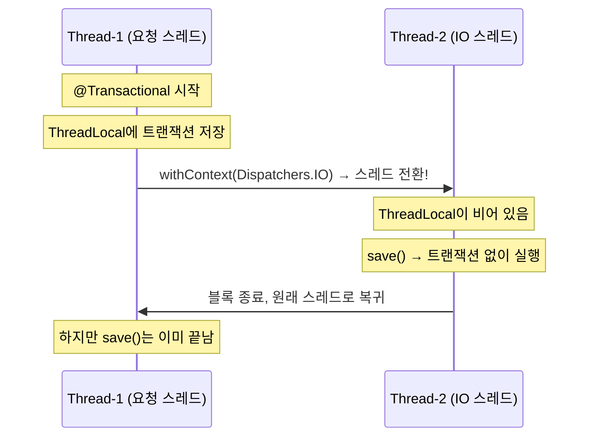

# [Kotlin/Spring] suspend 함수와 @Transactional의 위험한 조합

안녕하세요. duurian 팀에서 백엔드 개발을 하고 있는 정지원입니다.

최근에 `@Transactional`을 분명히 붙였는데 DB에 데이터가 저장되지 않는 문제를 겪었습니다. 에러도 없고 예외도 없는데 그냥 조용히 데이터가 사라지더라고요. 알고 보니 **코루틴의 `suspend` 함수와 `@Transactional`이 같이 쓰이면서 생긴 문제**였습니다.

원인을 찾는 과정에서 Spring 트랜잭션이 내부적으로 어떻게 동작하는지도 배울 수 있었는데요, 같은 문제를 겪고 계신 분들께 도움이 되길 바라며 정리해 봤습니다.

---

## 1. 문제 상황

### 1.1 발생 배경

대화 요약 정보를 생성하고 DB에 저장하는 기능을 구현하고 있었습니다. `@Transactional`을 선언했는데 데이터가 저장되지 않았고, 처음엔 쿼리 로직 문제인 줄 알고 한참 헤맸습니다.

### 1.2 문제의 코드

```kotlin
@Service
class ConversationSummaryService(
    private val queryConversationPort: QueryConversationPort,
    private val commandPort: CommandConversationSummaryPort,
) {

    @Transactional  // 트랜잭션 선언
    override suspend fun createConversationSummary(
        command: CreateSummaryCommand
    ): Int {
        val conversations = queryConversationPort.findAll(command.userId)

        // I/O 작업이라 IO 디스패처 사용 → 스레드 전환 발생!
        val summaries = withContext(Dispatchers.IO) {
            handleSummary(conversations)
        }

        // 이 시점에 트랜잭션이 이미 유실된 상태
        for (summary in summaries) {
            commandPort.save(
                ConversationSummary.create(
                    userId = command.userId,
                    content = summary
                )
            )  // DB에 저장되지 않음!
        }

        return summaries.size
    }
}
```

### 1.3 증상

| 증상 | 상세 |
|------|------|
| 데이터 미저장 | `save()` 호출 후에도 DB에 데이터 없음 |
| 롤백 실패 | 예외 발생해도 롤백 안 됨 |
| 재현 조건 | `withContext(Dispatchers.IO)` 사용 시 100% 재현 |

결정적인 단서는 디버그 로그에서 발견했습니다.

```
DEBUG o.s.t.i.TransactionInterceptor
  - No existing transaction found for transaction marked
    with propagation 'REQUIRED'
```

> `@Transactional`을 분명히 선언했는데 "No existing transaction found"라니? 이 로그를 보고 나서야 코루틴의 스레드 전환이 원인이라는 것을 알게 되었습니다.

---

## 2. 원인 분석

### 2.1 핵심: @Transactional은 ThreadLocal 기반이다

Spring의 `@Transactional`은 트랜잭션 정보를 **ThreadLocal**에 저장합니다.

```java
// Spring Framework 내부 (TransactionSynchronizationManager)
private static final ThreadLocal<Map<Object, Object>> resources =
    new NamedThreadLocal<>("Transactional resources");

private static final ThreadLocal<Boolean> actualTransactionActive =
    new NamedThreadLocal<>("Actual transaction active");
```

`ThreadLocal`은 **각 스레드마다 독립적인 저장 공간**을 가집니다. Thread-A가 저장한 트랜잭션 정보를 Thread-B에서는 볼 수 없습니다.

### 2.2 코루틴은 실행 중에 스레드를 바꾼다

코루틴의 `suspend` 함수는 `withContext(Dispatchers.IO)` 등으로 **실행 스레드가 바뀔 수 있습니다**. 이걸 합치면 문제가 명확해집니다.



1. **Thread-1**에서 `@Transactional`이 트랜잭션 정보를 `ThreadLocal`에 저장
2. `withContext(Dispatchers.IO)`로 **Thread-2**로 전환
3. **Thread-2**의 `ThreadLocal`에는 트랜잭션 정보가 없음 → `save()` 실행 시 트랜잭션 없이 동작
4. Thread-1으로 돌아와도 이미 `save()`는 트랜잭션 밖에서 실행된 후

### 2.3 왜 에러가 안 나는가

`suspend` 함수에 `@Transactional`을 붙여도 프록시 자체는 정상적으로 생성됩니다. 그래서 **컴파일 에러도, 런타임 예외도 발생하지 않습니다.** 이게 이 버그가 발견하기 어려운 이유입니다.

---

## 3. 해결 방법

### 3.1 권장: 트랜잭션 범위 분리

**핵심 아이디어**: 트랜잭션이 필요한 DB 작업을 별도의 **non-suspend** 메서드(별도 클래스)로 분리합니다.

```kotlin
// 오케스트레이션 담당 (suspend, 트랜잭션 없음)
@Service
class ConversationSummaryService(
    private val queryConversationPort: QueryConversationPort,
    private val persistenceService: ConversationPersistenceService,
) {

    override suspend fun createConversationSummary(
        command: CreateSummaryCommand
    ): Int {
        val conversations = queryConversationPort.findAll(command.userId)

        // 스레드 전환이 일어나도 트랜잭션에 영향 없음
        val summaries = withContext(Dispatchers.IO) {
            handleSummary(conversations)
        }

        // 별도 서비스에 위임
        persistenceService.saveSummaries(command.userId, summaries)

        return summaries.size
    }
}
```

```kotlin
// DB 저장 담당 (non-suspend, @Transactional 적용)
@Service
class ConversationPersistenceService(
    private val commandPort: CommandConversationSummaryPort,
) {

    @Transactional  // non-suspend → ThreadLocal 안전!
    fun saveSummaries(userId: UUID, summaries: List<String>) {
        for (summary in summaries) {
            commandPort.save(
                ConversationSummary.create(userId = userId, content = summary)
            )
        }
    }
}
```

`@Transactional`이 non-suspend 함수에서 동작하므로 스레드 전환이 일어나지 않고, `ThreadLocal`이 정상적으로 유지됩니다.

### 3.2 다른 방법들 (참고)

| 방법 | 설명 | 단점 |
|------|------|------|
| **TransactionalOperator** | 리액티브 API로 트랜잭션 제어 | R2DBC 필요, JPA 환경에서 쓰기 어려움 |
| **Self-Injection** | 자기 자신을 주입해서 프록시 경유 | 순환 참조 우려, 결국 non-suspend 분리 필요 |
| **TransactionTemplate** | 코드로 직접 트랜잭션 제어 | 가독성 저하, 스레드 컨텍스트 주의 필요 |

저는 **트랜잭션 범위 분리**가 가장 간단하고 안전해서 이 방법을 선택했습니다.

---

## 4. 적용 결과

### 4.1 Before / After

**Before** ❌

```kotlin
@Transactional  // suspend 함수에 붙이면 위험!
override suspend fun createConversationSummary(...): Int {
    val summaries = withContext(Dispatchers.IO) { handleSummary() }
    commandPort.save(...)  // 트랜잭션 없이 실행됨
}
```

**After** ✅

```kotlin
// suspend 함수 - 트랜잭션 없음
override suspend fun createConversationSummary(...): Int {
    val summaries = withContext(Dispatchers.IO) { handleSummary() }
    persistenceService.saveSummaries(userId, summaries)  // 위임
}

// non-suspend 함수 - @Transactional 정상 동작
@Transactional
fun saveSummaries(userId: UUID, summaries: List<String>) { ... }
```

### 4.2 검증 결과

| 항목 | 개선 전 | 개선 후 |
|------|---------|---------|
| 트랜잭션 유실 | 100% 재현 | 발생하지 않음 |
| 데이터 저장 | 실패 | 정상 |
| 예외 시 롤백 | 안 됨 | 정상 동작 |
| 성능 영향 | - | 없음 |

---

## 5. 재발 방지 체크리스트

PR 리뷰할 때 아래 항목만 챙겨도 같은 실수를 방지할 수 있습니다.

```
✅ suspend 함수에 @Transactional을 붙이지 않았는가?
✅ withContext 블록 안에서 DB 변경 작업을 하지 않는가?
✅ 트랜잭션이 필요한 로직은 non-suspend 함수로 분리했는가?
```

---

## 6. 디버깅 팁

트랜잭션이 정말로 유실되는지 확인하고 싶을 때, 이 유틸을 넣어서 로그를 찍어보면 바로 보입니다.

```kotlin
fun logTransactionStatus(label: String) {
    val isActive = TransactionSynchronizationManager.isActualTransactionActive()
    val thread = Thread.currentThread().name
    logger.debug("[$label] thread=$thread, txActive=$isActive")
}

// 사용
override suspend fun createConversationSummary(...): Int {
    logTransactionStatus("before withContext")  // txActive=true,  thread=nio-8080-exec-1
    val summaries = withContext(Dispatchers.IO) {
        logTransactionStatus("inside withContext")  // txActive=false, thread=DefaultDispatcher-worker-3
        handleSummary(conversations)
    }
}
```

---

## 7. 마무리

정리하면 이 문제의 핵심은:

- `@Transactional`은 트랜잭션 정보를 **ThreadLocal**(스레드별 저장소)에 보관한다
- 코루틴의 `withContext`는 **실행 스레드를 바꿔버린다**
- 바뀐 스레드에는 트랜잭션 정보가 없으므로 **조용히 트랜잭션이 사라진다**
- 컴파일 에러도, 런타임 예외도 없어서 **발견하기 어렵다**

해결 방법은 간단합니다. **트랜잭션이 필요한 DB 작업을 non-suspend 함수로 분리**하면 됩니다.

비슷한 문제를 겪고 계신 분들께 이 글이 도움이 되었으면 합니다. 궁금한 점이 있으시면 댓글로 남겨 주세요!

## 참고 자료

* [Spring Framework - Transaction Management](https://docs.spring.io/spring-framework/docs/current/reference/html/data-access.html#transaction)
* [Kotlin Coroutines Guide](https://kotlinlang.org/docs/coroutines-guide.html)
* [Spring Framework GitHub - Coroutine Transaction Support](https://github.com/spring-projects/spring-framework/issues/27420)