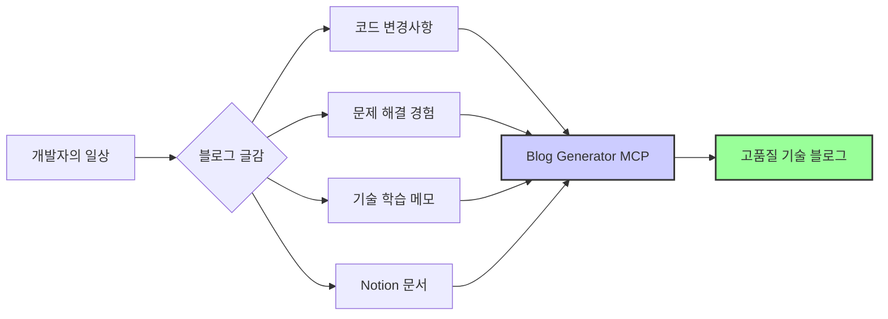
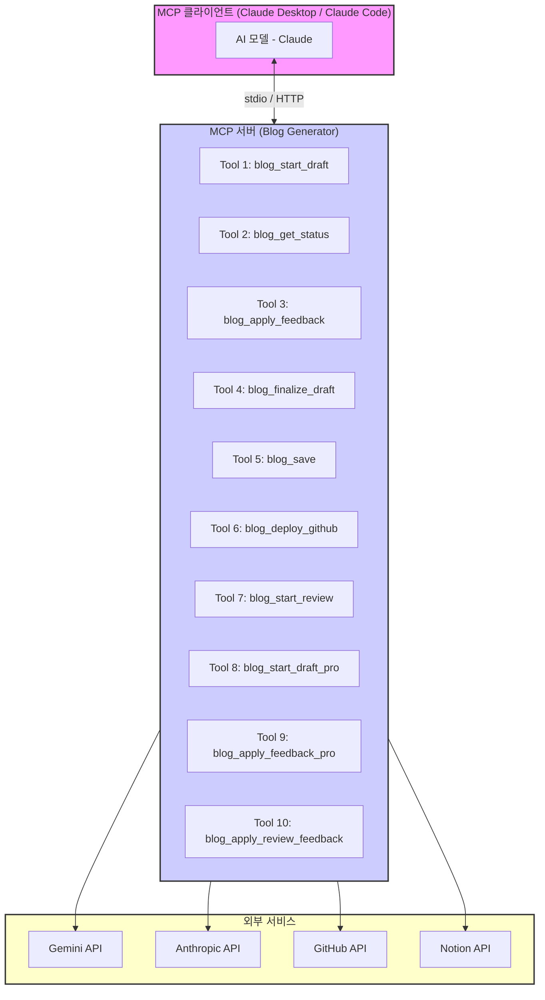
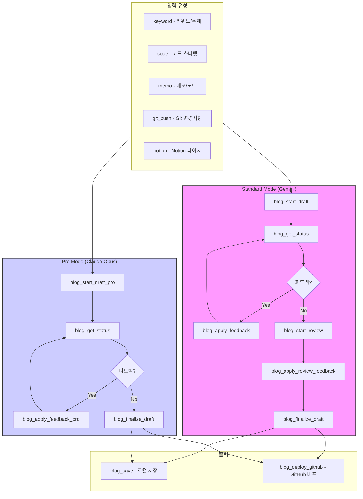
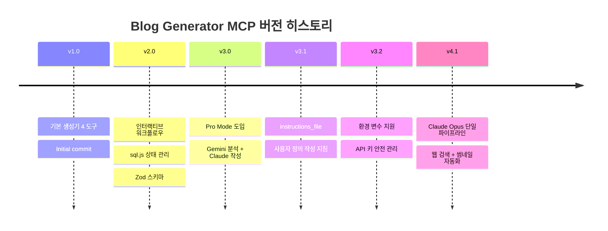
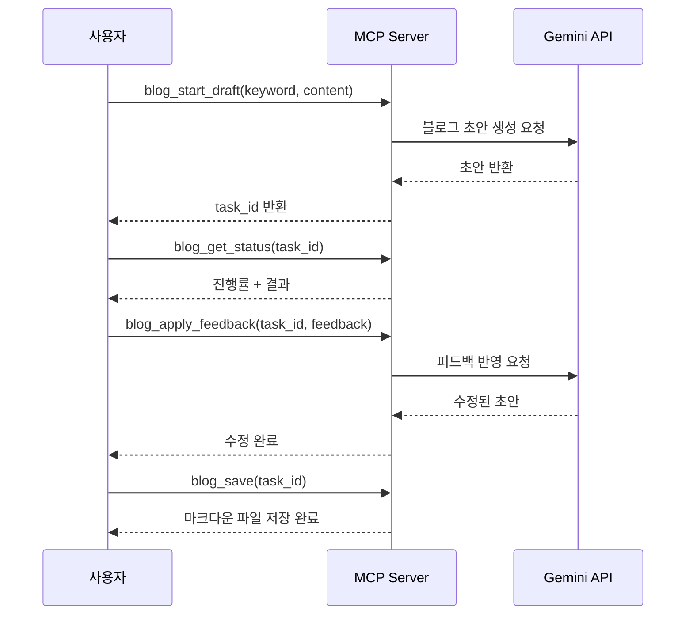
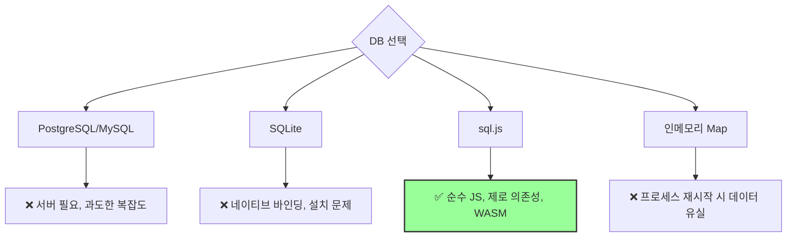
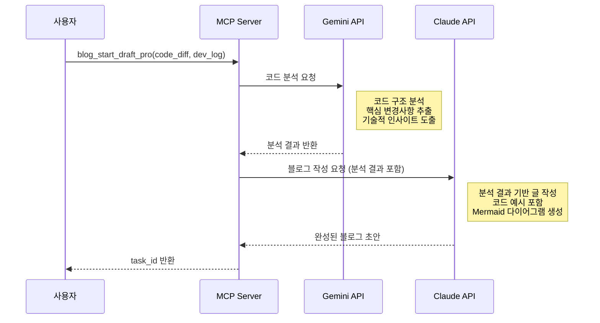
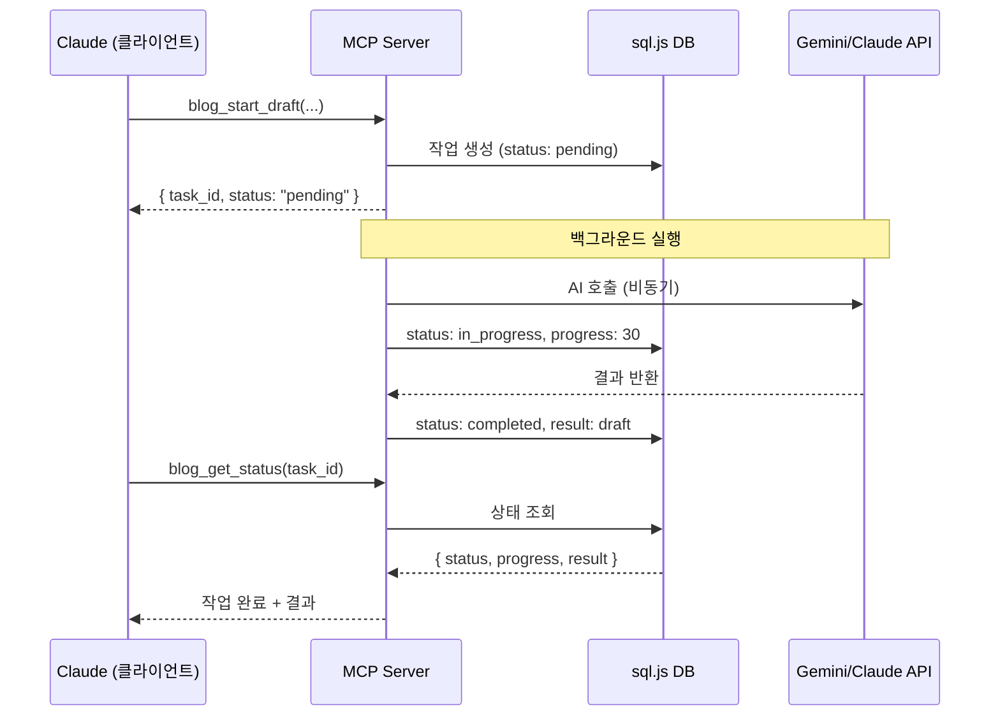
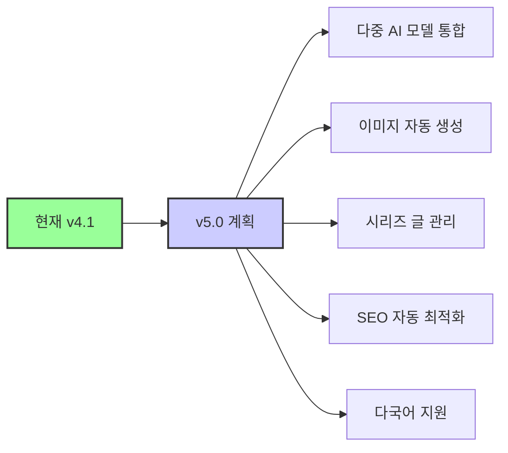

# [MCP] Blog Generator MCP 개발 심층 분석: AI로 기술 블로그 자동 생성 서버 구축기

안녕하세요. 백엔드 개발자 정지원입니다. 현재 AI를 활용한 개발 자동화 도구 개발에 몰두하고 있습니다. 이 글은 Blog Generator MCP의 설계부터 6번의 메이저 버전 업그레이드까지의 여정을 심층적으로 다룹니다. 재미있는 점은, 이 글 또한 MCP의 도움을 받아 작성되었다는 것입니다!

## 목차

1. 배경 및 문제 정의: 블로그, 쓰고는 싶은데...
2. MCP란 무엇인가: Anthropic의 오픈 프로토콜 활용
3. 전체 아키텍처: 10개의 도구, Standard/Pro Mode
4. 버전 진화: 좌충우돌 성장기
5. 주요 학습 내용: 개발하며 얻은 인사이트
6. MCP 서버 만들기: 핵심 코드 살펴보기
7. 결론 및 회고: 앞으로의 계획
8. 참고 자료

## 1. 배경 및 문제 정의: 블로그, 쓰고는 싶은데...

기술 블로그를 운영하는 것은 개발자에게 여러모로 유익합니다. 자신의 지식을 정리하고 공유하며, 다른 개발자들과 소통할 수 있는 기회를 제공합니다. 하지만 현실은 녹록지 않습니다.

| 블로그 운영의 어려움 | 구체적 상황 | 결과 |
|---|---|---|
| 시간 부족 | 업무 + 코딩 + 학습으로 글 쓸 여유 없음 | 블로그 방치 |
| 글쓰기 진입 장벽 | 빈 에디터 앞에서 막막함 | 시작조차 못함 |
| 품질 고민 | "이 정도로 올려도 될까?" 고민 | 완성 후에도 게시 망설임 |
| 반복 작업 | frontmatter, 이미지, 태그 등 매번 수동 설정 | 귀찮음 누적 |

> **💡 핵심 동기**: 개발 과정에서 이미 코드를 작성하고, 의사결정을 하고, 문제를 해결하고 있습니다. 이 과정을 자동으로 블로그 글로 변환할 수 있다면?

이러한 문제를 해결하기 위해, **AI를 활용하여 기술 블로그를 자동으로 생성해주는 도구**를 개발하기로 결심했습니다. 그것이 바로 Blog Generator MCP의 시작입니다.



## 2. MCP란 무엇인가: Anthropic의 오픈 프로토콜 활용

MCP(Model Context Protocol)는 Anthropic에서 공개한 오픈 프로토콜로, AI 모델이 외부 서비스와 상호작용할 수 있도록 표준화된 인터페이스를 제공합니다.



### MCP의 핵심 개념

| 개념 | 설명 | Blog Generator에서의 활용 |
|---|---|---|
| **Tool** | AI가 호출할 수 있는 함수 | `blog_start_draft`, `blog_save` 등 10개 도구 |
| **Transport** | 클라이언트-서버 통신 방식 | stdio (로컬) / HTTP (원격) |
| **Schema** | 도구의 입출력 정의 | Zod 스키마로 타입 안전성 확보 |
| **Resource** | AI에게 제공하는 데이터 | 작업 상태, 초안 내용 등 |

> **📝 참고**: MCP는 단순히 API를 호출하는 것이 아니라, AI 모델이 "도구를 사용하는 방법"을 이해할 수 있도록 설계되었습니다. Zod 스키마의 `description` 필드가 AI에게 도구 사용법을 설명하는 핵심 역할을 합니다.

## 3. 전체 아키텍처: 10개의 도구, Standard/Pro Mode

MCP는 현재 10개의 도구로 구성되어 있으며, 크게 **Standard Mode**와 **Pro Mode** 두 가지 모드를 제공합니다.



### Standard Mode vs Pro Mode 비교

| 특성 | Standard Mode | Pro Mode |
|---|---|---|
| AI 모델 | Google Gemini (Flash/Pro) | Anthropic Claude Opus |
| 입력 방식 | keyword, code, memo, git_push, notion | code_diff + dev_log |
| 글 스타일 | tutorial, til, deep-dive, troubleshooting | deep-dive 중심 |
| 웹 검색 | 선택적 활성화 | 기본 활성화 |
| 검수 기능 | blog_start_review로 별도 검수 | 작성 시 자체 검수 |
| 비용 | Gemini API 비용 (저렴) | Anthropic API 비용 (고가) |
| 품질 | 양호 | 최상급 |
| 속도 | 빠름 (Flash 기준 30초~1분) | 느림 (2~5분) |

## 4. 버전 진화: 좌충우돌 성장기

MCP는 처음부터 완벽한 모습이 아니었습니다. 수많은 시행착오와 개선을 거쳐 현재의 모습으로 발전해왔습니다.



### v1.0: 기본 생성기 — 4개의 도구로 시작

MCP의 첫 번째 버전은 가장 기본적인 파이프라인을 구현했습니다.



이 시점의 핵심 도전 과제는 **장시간 소요되는 AI 작업을 어떻게 처리할 것인가**였습니다. MCP 도구 호출은 기본적으로 동기적이지만, Gemini API 호출은 수십 초가 걸릴 수 있습니다.

### v2.0: 인터랙티브 워크플로우, sql.js, Zod 스키마

v2.0에서는 사용자 경험을 크게 개선했습니다.

| 기능 | 도입 이유 | 구현 방식 |
|---|---|---|
| **sql.js** | 작업 상태 영속화 필요 | 서버리스 SQLite, 메모리 DB |
| **백그라운드 작업** | AI 호출 대기 시간 해결 | 비동기 실행 + 폴링 |
| **Zod 스키마** | 타입 안전성 + AI UX | 입력 검증 + description |
| **인터랙티브 피드백** | 사용자 개입도 향상 | 피드백 히스토리 관리 |
| **다중 입력 유형** | 다양한 글감 지원 | keyword, code, memo, git_push |

**sql.js를 선택한 이유:**



### v3.0: Pro Mode — Gemini 분석 + Claude 작성

v3.0에서 가장 큰 변화는 **AI 분업** 패턴의 도입이었습니다.



> **🔥 핵심 인사이트**: Gemini는 대용량 코드 분석에 강하고, Claude는 구조화된 글쓰기에 강합니다. 각 모델의 장점을 조합하면 단일 모델보다 훨씬 높은 품질의 결과물을 얻을 수 있었습니다.

### v3.1 ~ v3.2: instructions_file과 환경 변수

| 버전 | 기능 | 해결한 문제 |
|---|---|---|
| v3.1 | `instructions_file` 파라미터 | 매번 스타일 가이드를 복붙하는 번거로움 해소 |
| v3.2 | 환경 변수 지원 | API 키를 파라미터로 전달하는 보안 위험 제거 |

`instructions_file`은 마크다운 파일 경로를 지정하면 해당 파일의 내용을 작성 지침으로 사용합니다. 이를 통해 팀 단위의 글쓰기 스타일 가이드를 공유하고, 일관된 품질의 블로그 글을 생성할 수 있게 되었습니다.

### v4.1: Claude Opus 단일 파이프라인

최신 버전에서는 Claude Opus의 성능 향상으로 **분석과 작성을 하나의 모델에서 처리**하도록 변경되었습니다.

| 비교 항목 | v3.0 (Gemini + Claude) | v4.1 (Claude Opus 단일) |
|---|---|---|
| API 호출 횟수 | 2회 (분석 + 작성) | 1회 |
| 총 소요 시간 | 3~5분 | 2~3분 |
| 컨텍스트 유실 | 분석→작성 전달 시 일부 유실 | 없음 (단일 컨텍스트) |
| 비용 | Gemini + Claude | Claude만 |
| 글 품질 | 우수 | 최우수 |

## 5. 주요 학습 내용: 개발하며 얻은 인사이트

### 5.1 Zod 스키마 = MCP UX

Zod 스키마를 어떻게 정의하느냐가 MCP의 사용자 경험을 결정합니다. AI 모델은 스키마의 `description`을 읽고 도구를 어떻게 사용할지 결정하기 때문입니다.

```typescript
// ❌ 나쁜 예 - AI가 이해하기 어려움
const BadSchema = z.object({
  type: z.string(),
  data: z.string(),
});

// ✅ 좋은 예 - AI가 정확하게 이해
const GoodSchema = z.object({
  input_type: z.enum(["keyword", "code", "memo", "git_push", "notion"])
    .describe("입력 유형: keyword(키워드/주제), code(코드 스니펫), memo(메모/노트), git_push(git 변경사항), notion(Notion 페이지 URL)"),
  content: z.string()
    .min(1).max(50000)
    .describe("블로그 글 생성에 사용할 입력 내용"),
  style: z.enum(["tutorial", "til", "deep-dive", "troubleshooting"])
    .default("tutorial")
    .describe("블로그 글 스타일"),
});
```

> **💡 핵심 포인트**: `describe()`에 작성하는 설명은 사용자가 아닌 **AI 모델**을 위한 것입니다. AI가 어떤 상황에서 이 도구를 사용해야 하는지, 각 파라미터에 어떤 값을 넣어야 하는지 명확히 안내해야 합니다.

### 5.2 백그라운드 작업 + 폴링 패턴

AI API 호출은 수십 초가 걸릴 수 있습니다. MCP 도구 호출 시 즉시 응답하고, 백그라운드에서 작업을 처리한 뒤 폴링으로 상태를 확인하는 패턴을 사용했습니다.



### 5.3 에러 메시지에 해결 방법 제시

MCP 도구에서 에러가 발생했을 때, 단순히 에러 내용만 표시하는 것이 아니라 해결 방법까지 함께 제시하면 AI가 자동으로 문제를 해결할 수 있습니다.

```typescript
// ❌ 나쁜 에러 메시지
throw new Error("API key invalid");

// ✅ 좋은 에러 메시지 - AI가 사용자에게 안내 가능
throw new Error(
  "Gemini API 키가 유효하지 않습니다. " +
  "다음 방법으로 해결할 수 있습니다:\n" +
  "1. GEMINI_API_KEY 환경변수가 올바르게 설정되어 있는지 확인\n" +
  "2. Google AI Studio에서 새 API 키 발급: https://aistudio.google.com/\n" +
  "3. claude_desktop_config.json의 env 섹션에 키 추가"
);
```

### 5.4 환경 변수의 중요성

| 관리 방식 | 보안 | 편의성 | 적용 |
|---|---|---|---|
| 파라미터 직접 전달 | ❌ 대화 기록에 노출 | ❌ 매번 입력 | v1.0~v3.1 |
| 환경 변수 | ✅ 프로세스 내부에서만 접근 | ✅ 한번 설정으로 영구 | v3.2+ |
| .env 파일 | ⚠️ 실수로 커밋 가능 | ✅ 편리 | 지원 |

## 6. MCP 서버 만들기: 핵심 코드 살펴보기

### 서버 초기화

MCP 서버는 `@modelcontextprotocol/sdk`를 사용하여 구축됩니다.

```typescript
import { McpServer } from "@modelcontextprotocol/sdk/server/mcp.js";
import { StdioServerTransport } from "@modelcontextprotocol/sdk/server/stdio.js";

// 1. 서버 인스턴스 생성
const server = new McpServer({
  name: "blog-generator",
  version: "4.1.0",
});

// 2. 도구 등록
registerStartDraftTool(server);      // blog_start_draft
registerGetStatusTool(server);       // blog_get_status
registerApplyFeedbackTool(server);   // blog_apply_feedback
registerFinalizeDraftTool(server);   // blog_finalize_draft
registerSaveBlogTool(server);        // blog_save
registerDeployGithubTool(server);    // blog_deploy_github
registerStartReviewTool(server);     // blog_start_review
registerStartDraftProTool(server);   // blog_start_draft_pro
registerApplyFeedbackProTool(server);// blog_apply_feedback_pro
registerApplyReviewFeedbackTool(server); // blog_apply_review_feedback

// 3. Transport 연결 및 실행
const transport = new StdioServerTransport();
await server.connect(transport);
```

### 도구 등록 패턴

각 도구는 `server.registerTool()` 또는 `server.tool()`로 등록합니다.

```typescript
import { z } from "zod";

server.tool(
  "blog_start_draft",  // 도구 이름
  {
    // Zod 스키마로 입력 정의
    input_type: z.enum(["keyword", "code", "memo", "git_push", "notion"])
      .describe("입력 유형"),
    content: z.string().min(1).max(50000)
      .describe("블로그 글 생성에 사용할 입력 내용"),
    style: z.enum(["tutorial", "til", "deep-dive", "troubleshooting"])
      .default("tutorial")
      .describe("블로그 글 스타일"),
    model: z.enum(["gemini-1.5-flash", "gemini-1.5-pro", "gemini-2.0-flash"])
      .default("gemini-1.5-flash")
      .describe("사용할 Gemini 모델"),
    web_search: z.boolean().default(false)
      .describe("웹 검색 활용 여부"),
  },
  async (params) => {
    // 1. 작업 생성
    const taskId = generateTaskId();
    await createTask(taskId, params);

    // 2. 백그라운드 실행
    generateDraftInBackground(taskId, params);

    // 3. 즉시 응답
    return {
      content: [{
        type: "text",
        text: JSON.stringify({
          task_id: taskId,
          status: "pending",
          message: "블로그 생성이 시작되었습니다."
        })
      }]
    };
  }
);
```

### 프로젝트 구조

```
blog-generator-mcp/
├── src/
│   ├── index.ts              # 서버 진입점
│   ├── types.ts              # Zod 스키마 + 타입 정의
│   ├── tools/
│   │   ├── startDraft.ts     # Standard Mode 초안 생성
│   │   ├── startDraftPro.ts  # Pro Mode 초안 생성
│   │   ├── getStatus.ts      # 작업 상태 조회
│   │   ├── applyFeedback.ts  # 피드백 반영
│   │   ├── finalizeDraft.ts  # 초안 확정
│   │   ├── saveBlog.ts       # 로컬 저장
│   │   ├── deployGithub.ts   # GitHub 배포
│   │   └── startReview.ts    # 검수
│   └── services/
│       ├── database.ts       # sql.js DB 관리
│       ├── gemini.ts         # Gemini API 클라이언트
│       ├── claude.ts         # Claude API 클라이언트
│       ├── github.ts         # GitHub API 클라이언트
│       ├── env.ts            # 환경 변수 관리
│       ├── instructions.ts   # 작성 지침 로더
│       └── thumbnail.ts      # 썸네일 이미지 검색
├── data/
│   └── tasks.db              # sql.js 데이터베이스
├── posts/                    # 생성된 블로그 글 저장
├── example-instructions.md   # 기본 작성 지침
├── package.json
└── tsconfig.json
```

## 7. 결론 및 회고: 앞으로의 계획

Blog Generator MCP는 "블로그 쓰기가 귀찮다"는 단순한 불편함에서 시작하여, 6번의 메이저 버전 업그레이드를 거치며 10개의 도구를 갖춘 본격적인 AI 블로그 자동화 시스템으로 성장했습니다.

### 개발을 통해 배운 점

| 학습 포인트 | 내용 |
|---|---|
| **MCP 설계** | Zod 스키마의 description이 AI UX를 결정한다 |
| **AI 분업** | 각 모델의 강점을 조합하면 단일 모델보다 나은 결과를 얻는다 |
| **비동기 패턴** | 백그라운드 작업 + 폴링이 장시간 AI 작업의 해법이다 |
| **에러 설계** | 에러 메시지에 해결 방법을 포함하면 AI가 자동 복구할 수 있다 |
| **환경 변수** | 민감 정보는 반드시 환경 변수로 관리해야 한다 |
| **지침 파일** | 글쓰기 스타일을 파일로 외부화하면 품질 일관성을 유지할 수 있다 |

### 향후 계획



- **다중 AI 모델 통합**: OpenAI GPT, Google Gemini, Anthropic Claude를 상황에 맞게 자동 선택
- **이미지 자동 생성**: DALL-E, Midjourney 등을 활용한 블로그 삽화 자동 생성
- **시리즈 글 관리**: 연재물의 이전/다음 편 자동 연결 및 목차 관리
- **SEO 자동 최적화**: 키워드 분석, 메타 태그 자동 생성, 내부 링크 추천

## 8. 참고 자료

📚 **공식 문서**
- [Model Context Protocol](https://modelcontextprotocol.io/) — MCP 공식 사양
- [Zod 공식 문서](https://zod.dev/) — TypeScript 스키마 검증
- [Google AI Platform](https://ai.google.dev/) — Gemini API

📝 **기술 블로그**
- [sql.js GitHub 저장소](https://github.com/sql-js/sql.js) — 브라우저/Node.js용 SQLite
- [Anthropic API Documentation](https://docs.anthropic.com/) — Claude API

🎓 **튜토리얼 가이드**
- [MCP TypeScript SDK](https://github.com/modelcontextprotocol/typescript-sdk) — MCP 서버 구축 SDK

---

> 이 글은 Blog Generator MCP의 도움을 받아 작성되었습니다. 궁금한 점이나 피드백이 있다면 언제든지 댓글로 남겨주세요!
