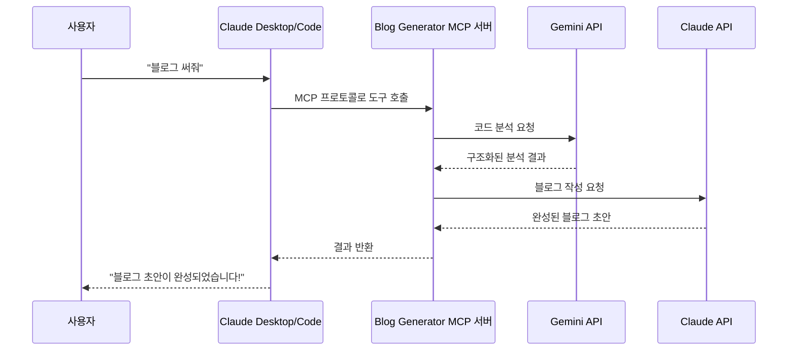
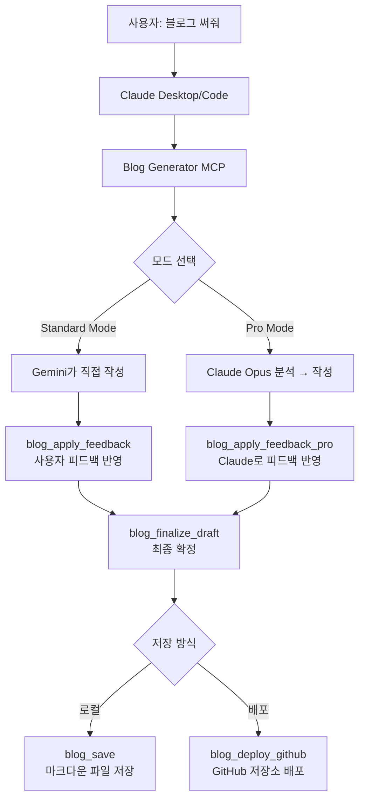
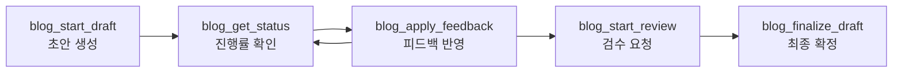

# Blog Generator MCP 개발기: "블로그 써줘" 한 마디로 기술 블로그가 만들어지기까지

코드를 커밋하면 개발일지가 자동으로 생성된다면 어떨까요? MCP(Model Context Protocol) 서버를 만들어 Gemini와 Claude를 조합한 블로그 자동 생성 시스템을 구축한 과정을 공유합니다.

---

## 배경: 기술 블로그, 쓰고 싶지만 쓸 시간이 없다

기술 블로그를 꾸준히 쓰고 싶었습니다. 코드를 작성하고, 리뷰하고, 배포하다 보면 하루가 끝나 있었습니다. 블로그 글 하나를 쓰려면 코드를 다시 들여다보고, 맥락을 정리하고, 서사를 만들어야 합니다. 코드 작성과는 전혀 다른 종류의 에너지가 필요한 작업이었습니다.

그러던 중 **MCP(Model Context Protocol)**를 알게 되었습니다. "코드를 커밋하면 자동으로 개발일지가 생성되면 좋겠다"는 아이디어가 떠올랐습니다. 그렇게 시작된 것이 **Blog Generator MCP** — AI를 활용한 기술 블로그 자동 생성 MCP 서버입니다.

> 이 블로그 포스트 자체가 Blog Generator MCP를 사용해서 생성되었습니다. 자기 자신의 개발기를 자기 자신이 쓰는 셈이죠.

---

## MCP(Model Context Protocol)란?

본격적인 개발기에 앞서, MCP가 무엇인지 설명하겠습니다.

USB-C 케이블 하나로 충전기, 모니터, 외장 하드를 모두 연결하듯이, **MCP는 AI 모델과 다양한 외부 서비스를 하나의 표준 프로토콜로 연결하는 기술**입니다.

MCP는 **Anthropic이 만든 오픈 프로토콜**입니다. LLM 애플리케이션(Claude Desktop, Claude Code 등)이 외부 **도구(Tool)**와 **데이터 소스**에 접근할 수 있게 해줍니다. MCP 서버를 한 번 만들어두면 Claude Desktop에서 "도구"로 바로 사용할 수 있습니다. 별도의 웹 UI나 REST API를 만들 필요가 없습니다.



REST API와 프론트엔드를 따로 만들 필요 없이, Claude 안에서 자연어로 동작하는 도구를 만들 수 있다는 점이 매력적이었습니다.

---

## 전체 아키텍처: 10개의 MCP 도구로 이루어진 블로그 파이프라인

먼저 완성된 프로젝트의 전체 구조를 살펴보겠습니다.



프로젝트의 디렉토리 구조는 다음과 같습니다:

```text
src/
├── index.ts              # CLI 엔트리포인트 (Commander)
├── server.ts             # MCP 서버 — 10개 도구 등록
├── types.ts              # 타입 + Zod 스키마 (입력 검증)
├── services/
│   ├── gemini.ts         # Gemini API (초안 생성, 코드 분석)
│   ├── anthropic.ts      # Claude API (Pro Mode 글 작성)
│   ├── database.ts       # SQLite 상태 관리 (sql.js)
│   ├── taskRunner.ts     # 백그라운드 작업 실행
│   ├── env.ts            # 환경변수 관리
│   ├── instructions.ts   # 작성 지침 파일 관리
│   └── github.ts         # GitHub 배포 (Octokit)
├── tools/                # 10개 MCP 도구 각각의 구현
└── transports/
    ├── stdio.ts          # Claude Desktop용 표준입출력
    └── http.ts           # HTTP 서버용 (팀 공유, 멀티유저)
```

처음부터 이런 구조는 아니었습니다. 9번의 커밋을 거쳐 여기에 도달했습니다. 각 버전별로 어떤 문제를 해결했고, 어떤 결정을 내렸는지 살펴보겠습니다.

---

## v1.0 — 첫 걸음: 기본적인 블로그 생성기

첫 버전은 가장 작은 범위에서 시작했습니다. Gemini API로 블로그 초안을 생성하고, 로컬에 저장하거나 GitHub에 배포하는 4개의 도구만 만들었습니다.

MCP 서버의 핵심은 `server.tool()`로 도구를 등록하는 것입니다. **도구 하나가 곧 사용자가 호출할 수 있는 기능 하나**입니다:

```typescript
// v1.0 — server.ts (MCP 도구 등록)
import { McpServer } from "@modelcontextprotocol/sdk/server/mcp.js";

const server = new McpServer({
  name: "blog-generator-mcp",
  version: "1.0.0"
});

// 각 도구를 이름, 설명, 입력 스키마, 핸들러 함수로 등록
registerGenerateDraftTool(server);  // 초안 생성
registerReviewPostTool(server);     // 검수
registerSaveBlogTool(server);       // 로컬 저장
registerDeployGithubTool(server);   // GitHub 배포
```

v1.0은 stdio 트랜스포트(표준 입출력)만 지원했고, API 키는 환경변수로 받았습니다. 4가지 입력 타입(`keyword`, `code`, `memo`, `git_push`)과 4가지 스타일(`tutorial`, `til`, `deep-dive`, `troubleshooting`)을 지원했습니다.

**v1.0의 한계**: 한 번 생성하면 끝이었습니다. AI가 만든 글이 마음에 들지 않으면 처음부터 다시 생성해야 했습니다. "여기를 이렇게 고쳐줘"라고 말할 수 없었습니다.

---

## v2.0 — 인터랙티브 워크플로우: 피드백 루프 도입

### 해결해야 할 문제

v1.0을 쓰면서 느낀 것은, **한 번에 만족스러운 글을 기대하는 것은 비현실적**이라는 점이었습니다. 사람이 글을 쓸 때도 초안 → 수정 → 수정 → 완성의 과정을 거칩니다. AI도 마찬가지여야 했습니다.

### 해결 방식: 5단계 워크플로우

v2.0의 핵심은 **인터랙티브 워크플로우**입니다. 사용자가 AI와 대화하듯 글을 다듬어 나갈 수 있게 했습니다:



1. `blog_start_draft` → 백그라운드에서 초안 생성 시작
2. `blog_get_status` → 진행률 폴링 (0~100%)
3. `blog_apply_feedback` → "이 부분을 이렇게 고쳐줘" 피드백 반영
4. `blog_start_review` → 검수 (정확성/가독성/SEO 점검)
5. `blog_finalize_draft` → 최종 확정

이 워크플로우를 구현하기 위해 두 가지 큰 기술적 결정이 필요했습니다.

### 기술적 결정 1: sql.js(WASM SQLite)로 상태 관리

블로그 생성은 수십 초가 걸리는 작업입니다. 동기적으로 처리하면 Claude Desktop이 응답 대기 상태로 멈춥니다. **비동기 처리 + 상태 저장**이 필요했습니다.

| 방법 | 장점 | 단점 | 선택 여부 |
|------|------|------|-----------|
| 메모리 저장 | 구현이 빠름 | 서버 재시작 시 데이터 소실 | ❌ |
| 파일 기반 (JSON) | 외부 의존성 없음 | 동시 접근 문제, 느림 | ❌ |
| **sql.js (WASM SQLite)** | **외부 DB 불필요 + 영속성** | WASM 번들 크기 | ✅ 채택 |
| better-sqlite3 | 네이티브 성능 | C++ 바인딩 설치 필요 | ❌ |

**sql.js**를 선택했습니다. WASM 기반으로 별도의 데이터베이스 서버 없이 순수 JavaScript만으로 SQLite를 실행할 수 있습니다. `npx blog-generator-mcp` 한 줄로 실행 가능해야 했기에, 외부 의존성 최소화가 중요했습니다.

이 코드는 작업 상태를 관리하는 SQLite 테이블 스키마입니다:

```typescript
// database.ts — 작업 상태 관리 테이블
const SCHEMA = `
  CREATE TABLE IF NOT EXISTS tasks (
    id TEXT PRIMARY KEY,           -- 고유 작업 ID
    type TEXT NOT NULL,            -- 'draft', 'review' 등 작업 유형
    status TEXT NOT NULL DEFAULT 'pending',  -- 상태 머신
    progress INTEGER DEFAULT 0,    -- 진행률 (0~100)
    input TEXT NOT NULL,           -- 사용자 입력 (JSON)
    result TEXT,                   -- 생성 결과 (블로그 본문)
    history TEXT DEFAULT '[]',     -- 피드백 히스토리 (JSON 배열)
    error TEXT,                    -- 에러 메시지
    created_at TEXT DEFAULT (datetime('now')),
    updated_at TEXT DEFAULT (datetime('now'))
  );
`;
```

`history` 컬럼이 핵심입니다. 피드백을 줄 때마다 이전 버전이 히스토리에 쌓여서, 수정 과정을 추적할 수 있습니다.

데이터베이스 초기화 로직은 기존 파일이 있으면 읽고, 없으면 새로 생성합니다:

```typescript
// database.ts — 데이터베이스 초기화
export async function initDatabase(customPath?: string): Promise<void> {
  const SQL = await initSqlJs();

  // 디렉토리가 없으면 생성
  await fs.mkdir(dir, { recursive: true });

  try {
    // 기존 DB 파일이 있으면 로드
    const buffer = await fs.readFile(dbPath);
    db = new SQL.Database(buffer);
  } catch {
    // 없으면 새 DB 생성
    db = new SQL.Database();
  }

  db.run(SCHEMA);
  await saveDatabase();
}
```

### 기술적 결정 2: Stateless HTTP 트랜스포트 추가

Claude Desktop용 stdio 트랜스포트만으로는 팀에서 공유하기 어려웠습니다. 여러 사용자가 동시에 접속할 수 있는 HTTP 방식이 필요했습니다.

Express 기반 HTTP 트랜스포트를 추가하되, **Stateless(무상태) 설계**를 택했습니다.

**Before (v1.0)**: stdio 트랜스포트만 지원

```typescript
// v1.0 — stdio 트랜스포트만 지원
import { StdioServerTransport } from "@modelcontextprotocol/sdk/server/stdio.js";
const transport = new StdioServerTransport();
await server.connect(transport);
```

**After (v2.0)**: HTTP 트랜스포트 추가 — 매 요청마다 새로운 transport 생성

```typescript
// v2.0 — transports/http.ts
// Stateless JSON 모드: 세션 없이 각 요청을 독립적으로 처리
app.post("/mcp", async (req, res) => {
  const transport = new StreamableHTTPServerTransport({
    sessionIdGenerator: undefined,  // 세션을 사용하지 않음
    enableJsonResponse: true        // 스트리밍 대신 단일 JSON 응답
  });
  await server.connect(transport);
  await transport.handleRequest(req, res, req.body);
});
```

`sessionIdGenerator: undefined`가 핵심입니다. HTTP 서버가 이전 요청의 정보를 기억하지 않습니다. 모든 상태는 SQLite에 저장하고, 서버 자체는 상태를 갖지 않습니다. 서버 인스턴스를 여러 개 띄워도 문제없이 동작합니다.

### Zod 스키마: 입력 검증이 곧 사용자 인터페이스

MCP SDK는 **Zod**(TypeScript용 스키마 검증 라이브러리)를 네이티브로 지원합니다. Zod 스키마를 정의하면 그것이 곧 도구의 파라미터 명세가 됩니다. Claude가 이 스키마를 읽고, 사용자의 의도에 맞게 파라미터를 결정합니다.

이 코드는 블로그 초안 생성 도구의 입력 스키마입니다:

```typescript
// types.ts — Zod 스키마 = 사용자 인터페이스
export const StartDraftInputSchema = z.object({
  input_type: z.nativeEnum(InputType)
    .describe("입력 유형: keyword, code, memo, git_push"),  // ← Claude가 읽는 설명
  content: z.string().min(1).max(50000)
    .describe("블로그 글 생성에 사용할 입력 내용"),
  style: z.nativeEnum(BlogStyle)
    .default(BlogStyle.TUTORIAL)
    .describe("블로그 글 스타일"),
  model: z.nativeEnum(GeminiModel)
    .default(GeminiModel.FLASH)
    .describe("사용할 Gemini 모델"),
  instructions: z.string().optional()
    .describe("상세 작성 지침 (톤, 구조, 타겟 독자 등)")
}).strict();
```

`.describe()`가 핵심입니다. 이 설명을 Claude가 읽고, 사용자의 의도에 맞게 파라미터를 자동으로 채워넣습니다. 사용자가 "이 코드로 TIL 블로그 써줘"라고 하면, Claude는 `input_type: "code"`, `style: "til"`을 선택합니다.

**Zod 스키마를 잘 설계하는 것이 곧 좋은 UX를 만드는 것**이라는 깨달음을 얻었습니다. MCP에서는 UI 버튼이나 폼 대신, 스키마의 `.describe()`가 사용자 인터페이스 역할을 합니다.

---

## v2.1 — 모델 선택과 상세 지침

### 모델 선택

모든 도구에 Gemini 모델을 선택할 수 있는 파라미터를 추가했습니다:

```typescript
// GeminiModel enum — 용도별 모델 선택
export enum GeminiModel {
  FLASH = "gemini-1.5-flash",      // 빠른 응답, 일반 용도 (기본값)
  FLASH_8B = "gemini-1.5-flash-8b", // 가장 빠름, 간단한 작업
  PRO = "gemini-1.5-pro",          // 고품질, 복잡한 작업
  PRO_2 = "gemini-2.0-flash"       // 최신 모델
}
```

### instructions 파라미터

팀마다 블로그 스타일 가이드가 다릅니다. `instructions` 파라미터를 추가하여 AI가 따라야 할 상세한 작성 규칙을 지정할 수 있게 했습니다:

```typescript
// gemini.ts — instructions가 있으면 최우선으로 적용
if (instructions) {
  prompt += `
====== 상세 작성 지침 (반드시 따라야 함) ======
${instructions}
====== 지침 끝 ======`;
}
```

`====== 지침 끝 ======` 같은 구분자를 사용한 이유는, AI 모델이 지침과 본문 내용을 혼동하지 않도록 경계를 명확히 하기 위해서입니다.

---

## v3.0 — Pro Mode: 이중 AI 파이프라인

### 해결해야 할 문제

v2.0까지는 Gemini 하나로 분석과 작성을 모두 처리했습니다. 결과물은 괜찮았지만, **분석이 얕거나 글이 딱딱해지는** 경향이 있었습니다. 한국어 블로그의 경우 문장이 부자연스럽거나, 코드의 맥락을 충분히 설명하지 못하는 문제가 반복되었습니다.

### 핵심 아이디어: 각 AI의 강점을 분업하자

**"분석은 Gemini가, 작성은 Claude가 하면 어떨까?"**

각 모델에는 고유한 강점이 있습니다:

| 역할 | 모델 | 강점 |
|------|------|------|
| **Researcher** (분석) | Gemini Pro | 대규모 컨텍스트 윈도우로 코드를 한 번에 분석 |
| **Writer** (작성) | Claude | 자연스럽고 서사적인 한국어 글쓰기 |

이 둘을 조합한 **2단계 파이프라인**을 만들었습니다.

이 코드는 Pro Mode의 핵심 로직입니다:

```typescript
// taskRunner.ts — Pro Mode 파이프라인
export async function runProDraftGeneration(taskId, codeDiff, devLog, ...) {
  // Stage 1: 코드 분석 (Researcher 역할)
  // → 코드 diff와 개발 메모를 받아 구조화된 인사이트 추출
  const analysis = await analyzeCodeWithGemini(
    codeDiff, devLog, request, geminiApiKey
  );

  await updateTaskStatus(taskId, TaskStatus.IN_PROGRESS, 40);

  // Stage 2: 블로그 작성 (Writer 역할)
  // → 분석 결과를 바탕으로 매력적인 기술 블로그 작성
  const result = await writeBlogWithClaude(
    analysis, codeDiff, style, language, instructions, anthropicApiKey
  );
}
```

Stage 1에서 Researcher는 코드를 분석해서 **구조화된 인사이트**를 추출합니다:

```typescript
// CodeAnalysis — Researcher가 반환하는 구조화된 분석 결과
interface CodeAnalysis {
  summary: string;              // 이 코드가 무엇을 하는가
  problem: string;              // 왜 이 코드를 작성했는가
  approach: string;             // 접근 방식과 이유
  key_decisions: string[];      // 주요 의사결정 목록
  technical_insights: string[]; // 기술적 인사이트
  narrative_hooks: string[];    // 글에서 강조할 흥미로운 포인트
}
```

이 분석 결과를 Writer에게 전달하면, Writer는 분석을 바탕으로 서사(Narrative)를 만들어냅니다:

```typescript
// anthropic.ts — Writer의 시스템 프롬프트
const systemPrompt = `당신은 뛰어난 기술 블로그 작가입니다.
코드 분석 인사이트를 바탕으로 매력적인 기술 블로그 글을 작성합니다.

${styleGuide}   // 스타일 가이드 (tutorial, deep-dive 등)
${langGuide}    // 언어 설정 (한국어/영어)

${instructions ? `추가 지침: ${instructions}` : ""}`;
```

### 결과: 확실한 품질 차이

**두 모델이 각자 잘하는 것을 분업하면 결과가 훨씬 좋았습니다.** Researcher가 코드의 구조적 맥락을 짚어내면, Writer가 그것을 읽기 좋은 이야기로 풀어냈습니다.

| 비교 항목 | Standard Mode (Gemini) | Pro Mode (Gemini + Claude) |
|----------|----------------------|---------------------------|
| 코드 분석 깊이 | 표면적 | 구조화된 인사이트 |
| 한국어 자연스러움 | 번역체 느낌 | 자연스러운 서사 |
| 기술적 설명 | 코드 나열 위주 | 의사결정 과정 포함 |
| API 호출 | 1회 (Gemini) | 2회 (Gemini → Claude) |

---

## v3.1 — instructions_file: 팀 스타일 가이드 관리

매번 `instructions` 파라미터에 긴 텍스트를 넣는 것은 불편했습니다. 마크다운 파일로 작성 지침을 관리할 수 있게 했습니다.

```bash
# Claude Desktop에서 이렇게 사용합니다
"이 코드로 블로그 써줘, 스타일은 company-style-guide.md 따라서"
```

파일 지침과 파라미터 지침을 **병합하는 로직**도 구현했습니다. 기본 스타일 가이드(파일) + 이번 글에만 적용할 추가 지침(파라미터)을 함께 사용할 수 있습니다:

```typescript
// instructions.ts — 파일과 파라미터 지침 병합
export async function mergeInstructions(
  instructionsFile: string | undefined,
  instructions: string | undefined
): Promise<string | undefined> {
  let fileContent: string | null = null;

  if (instructionsFile) {
    fileContent = await readInstructionsFile(instructionsFile);
    if (fileContent === null) {
      throw new Error(`Instructions 파일을 찾을 수 없습니다: ${instructionsFile}`);
    }
  }

  // 둘 다 있으면 병합
  if (fileContent && instructions) {
    return `${fileContent}\n\n---\n\n## 추가 지침\n${instructions}`;
  } else if (fileContent) {
    return fileContent;
  } else if (instructions) {
    return instructions;
  }

  return undefined;
}
```

---

## v3.2 — 환경변수: 처음부터 있었어야 할 설정 방식

처음에는 매번 API 키를 파라미터로 전달하게 설계했습니다. "보안을 위해"라는 이유였지만, 실제로 사용해보니 매우 불편했습니다.

v3.2에서 Claude Desktop 설정의 `env` 블록에서 한 번 설정하면 끝나도록 바꿨습니다:

```json
{
  "mcpServers": {
    "blog-generator": {
      "command": "npx",
      "args": ["-y", "blog-generator-mcp"],
      "env": {
        "GEMINI_API_KEY": "your-gemini-api-key",
        "ANTHROPIC_API_KEY": "your-anthropic-api-key",
        "BLOG_SAVE_DIRECTORY": "./posts"
      }
    }
  }
}
```

환경변수와 파라미터의 **우선순위**도 명확히 했습니다:

```typescript
// services/env.ts — 우선순위: 파라미터 > 환경변수 > 에러
export function getGeminiApiKey(paramValue?: string): string {
  const key = paramValue || process.env[ENV_KEYS.GEMINI_API_KEY];
  if (!key) {
    throw new Error(
      "Gemini API 키가 필요합니다. " +
      "gemini_api_key 파라미터로 전달하거나 " +
      "GEMINI_API_KEY 환경변수를 설정하세요."
    );
  }
  return key;
}
```

에러 메시지에 **해결 방법을 포함**한 것도 의도적입니다. "API 키가 없습니다"에서 멈추지 않고, "어떻게 해결하면 되는지"까지 안내합니다.

---

## v4.1 — Pro Mode 완전 전환: Claude Opus가 분석과 작성 모두 수행

### 아키텍처 변경

v3.0에서는 Gemini(분석) + Claude(작성) 구조였습니다. v4.1에서는 **Claude Opus 4.6이 분석과 작성 모두 수행**하도록 전환했습니다.

**Before (v3.0)**: Gemini 분석 → Claude 작성

```typescript
// v3.0 — taskRunner.ts
const analysis = await analyzeCodeWithGemini(
  codeDiff, devLog, request, geminiApiKey
);
const result = await writeBlogWithClaude(
  analysis, codeDiff, style, language, instructions, anthropicApiKey
);
```

**After (v4.1)**: Claude Opus 분석 → Claude Opus 작성

```typescript
// v4.1 — taskRunner.ts
const analysis = await analyzeCodeWithClaude(
  codeDiff, devLog, request, anthropicApiKey
);
const result = await writeBlogWithClaude(
  analysis, codeDiff, style, language, instructions, anthropicApiKey
);
```

변경 포인트는 `analyzeCodeWithGemini` → `analyzeCodeWithClaude`입니다. 분석도 Claude Opus가 수행하게 되면서, Pro Mode에서는 Gemini API 키가 더 이상 필요하지 않습니다.

### 변경 이유

Claude Opus 4.6의 코드 분석 능력이 충분히 좋았습니다. 두 모델을 사용할 때의 복잡성(API 키 2개 관리, 두 모델 간 인터페이스 조율)보다 단일 모델의 일관성이 더 큰 가치를 제공했습니다.

### 주요 리팩토링

이 전환에서 진행한 주요 변경사항입니다:

| 항목 | Before (v3.0) | After (v4.1) |
|------|-------------|-------------|
| 분석 모델 | Gemini Pro | Claude Opus 4.6 |
| 작성 모델 | Claude Opus | Claude Opus 4.6 |
| 인터페이스 이름 | `GeminiAnalysis` | `CodeAnalysis` |
| Pro Mode API 키 | Gemini + Anthropic | Anthropic만 |
| 분석 함수 | `analyzeCodeWithGemini()` | `analyzeCodeWithClaude()` |

```typescript
// anthropic.ts — Claude Opus로 코드 분석 (v4.1에서 추가)
const CLAUDE_MODEL = "claude-opus-4-6";

export async function analyzeCodeWithClaude(
  codeDiff: string,
  devLog: string | undefined,
  request: string | undefined,
  apiKey: string
): Promise<CodeAnalysis> {
  const anthropic = new Anthropic({ apiKey });

  const prompt = `당신은 코드 분석 전문가입니다. 개발자의 작업 내용을 분석하여
Writer AI가 블로그 글을 작성할 수 있도록 구조화된 분석을 제공하세요.
...`;

  const response = await anthropic.messages.create({
    model: CLAUDE_MODEL,
    max_tokens: 4096,
    messages: [{ role: "user", content: prompt }],
    system: "당신은 코드 분석 전문가입니다. 반드시 요청된 JSON 형식으로만 응답하세요."
  });

  // JSON 파싱 + 필수 필드 검증
  const jsonMatch = responseText.match(/```json\s*([\s\S]*?)\s*```/);
  // ...
}
```

### Claude Desktop/Code 환경에서의 Pro Mode

v4.1에서 중요한 사용성 개선이 있습니다. **Claude Desktop이나 Claude Code를 사용 중이라면 Pro Mode 도구를 호출할 필요가 없습니다.**

대화 중인 Claude 자체가 Opus 모델이므로, 직접 요청하면 됩니다:

```text
User: "이 코드로 블로그 써줘"
User: <git diff 내용>

→ Claude가 직접 코드를 분석하고 블로그를 작성합니다.
→ blog_save로 저장하면 끝!
```

이 방식의 장점은 API 키가 불필요하고, 대화 맥락을 활용해 더 자연스러운 글쓰기가 가능하다는 것입니다. Pro Mode MCP 도구는 HTTP 서버로 배포할 때(외부 사용자가 API로 접근할 때)만 사용합니다.

---

## 결과 및 검증

### 실행 방법

```bash
# 설치 없이 바로 실행 (stdio 모드 — Claude Desktop용)
npx blog-generator-mcp

# HTTP 서버 모드 (팀 공유용)
npx blog-generator-mcp --http --port 3000
```

### 실제 사용 예시 (Claude Desktop)

```text
사용자: "오늘 작성한 인증 코드로 TIL 블로그 써줘"
Claude: blog_start_draft 도구를 호출합니다...
Claude: 초안이 생성되었습니다. 확인해보시겠어요?
사용자: "코드 설명이 좀 부족해. 더 자세히 설명해줘"
Claude: blog_apply_feedback 도구로 피드백을 반영합니다...
Claude: 수정이 완료되었습니다!
사용자: "좋아, 저장해줘"
Claude: blog_save 도구로 저장합니다...
       ./posts/2026-02-06-auth-til.md에 저장되었습니다.
```

### 프로젝트 검증 결과

| 검증 항목 | 결과 |
|----------|------|
| Standard Mode 초안 생성 | Gemini 2.0 Flash 기준 10~30초 |
| Pro Mode 초안 생성 | Claude Opus 분석 + 작성 30~60초 |
| 피드백 반영 | 5~15초 |
| 지원 스타일 | tutorial, til, deep-dive, troubleshooting |
| 지원 언어 | 한국어, 영어 |
| 저장 형식 | YAML frontmatter + Markdown |
| 도구 개수 | 10개 (Standard 8 + Pro 2) |
| 트랜스포트 | stdio (Claude Desktop) + HTTP (서버 배포) |

### 버전별 진화 요약

| 버전 | 핵심 변화 | 도구 수 |
|------|----------|--------|
| v1.0 | 기본 생성기 | 4개 |
| v2.0 | 인터랙티브 워크플로우, SQLite, HTTP | 8개 |
| v2.1 | 모델 선택, instructions 파라미터 | 8개 |
| v3.0 | Pro Mode (Gemini + Claude) | 10개 |
| v3.1 | instructions_file 지원 | 10개 |
| v3.2 | 환경변수 지원 | 10개 |
| v4.1 | Pro Mode → Claude Opus 단일 파이프라인 | 10개 |

---

## 개발 과정에서 배운 것들

### 1. MCP 서버에서 Zod 스키마 설계가 핵심이다

MCP 도구의 파라미터 스키마가 곧 사용자 인터페이스입니다. `.describe()`에 쓴 설명을 Claude가 읽고 파라미터를 결정합니다. 스키마를 잘 설계하면 사용자는 아무것도 모르고도 도구를 잘 사용할 수 있습니다. `.strict()`로 스키마를 닫아 정의하지 않은 파라미터가 들어오는 것을 방지하는 것도 중요합니다.

### 2. 백그라운드 작업 + 폴링 패턴이 MCP에서 잘 동작한다

AI 생성 작업은 오래 걸립니다. `task_id`를 반환하고, `blog_get_status`로 폴링하는 패턴은 MCP 환경에서 자연스럽게 동작합니다. Claude가 알아서 "아직 진행 중이네요, 잠시 후 다시 확인하겠습니다"라고 대화합니다.

### 3. 두 AI 모델의 분업은 예상보다 효과적이다

Researcher(분석) + Writer(작성)의 조합은 하나의 모델이 모든 것을 하는 것보다 나은 결과를 냈습니다. v4.1에서 단일 모델(Claude Opus)로 통합했지만, 분석과 작성이라는 **역할 분리** 자체는 유지했습니다. 같은 모델이라도 다른 프롬프트로 다른 역할을 수행하게 하면 결과가 좋아집니다.

### 4. 환경변수 지원은 처음부터 넣자

"나중에 추가하면 되지" 생각했지만, 사용자 불편은 바로 피드백으로 돌아왔습니다. DX(Developer Experience)에 영향을 주는 설정은 초기에 설계하는 것이 좋습니다.

### 5. 에러 메시지에 해결 방법을 포함하자

"API 키가 없습니다" 대신 "API 키가 필요합니다. GEMINI_API_KEY 환경변수를 설정하세요."처럼 안내하면, 사용자가 문제를 스스로 해결할 수 있습니다. MCP 도구는 대화형 환경에서 동작하므로, 친절한 에러 메시지가 더욱 중요합니다.

---

## 나도 MCP 서버를 만들어볼까?

Blog Generator MCP의 개발 과정에 영감을 받으셨다면, 직접 MCP 서버를 만들어보세요. 핵심은 3단계입니다.

### Step 1: 프로젝트 초기화

```bash
npx @modelcontextprotocol/create-server my-mcp-server
cd my-mcp-server
```

### Step 2: 도구 등록

```typescript
import { McpServer } from "@modelcontextprotocol/sdk/server/mcp.js";
import { z } from "zod";

const server = new McpServer({
  name: "my-mcp-server",
  version: "1.0.0"
});

// Zod로 입력 스키마를 정의하고, 핸들러 함수를 등록합니다
server.tool(
  "my_tool",                                     // 도구 이름
  "이 도구가 하는 일을 설명합니다",                    // 도구 설명
  { input: z.string().describe("입력 내용") },     // 입력 스키마
  async ({ input }) => {                          // 핸들러 함수
    return {
      content: [{ type: "text", text: `결과: ${input}` }]
    };
  }
);
```

### Step 3: 트랜스포트 연결

```typescript
import { StdioServerTransport } from "@modelcontextprotocol/sdk/server/stdio.js";

// stdio 트랜스포트로 연결 → Claude Desktop에서 바로 사용 가능
const transport = new StdioServerTransport();
await server.connect(transport);
```

Claude Desktop의 설정 파일(`claude_desktop_config.json`)에 등록하면 바로 사용할 수 있습니다.

---

## 향후 계획

- 이미지 자동 생성 (코드 아키텍처 다이어그램)
- 시리즈 포스트 관리 (이전/다음 편 자동 링크)
- 여러 플랫폼 동시 배포 (Velog, Tistory, Medium)
- 글 히스토리 비교 뷰 (diff 형태로 수정 과정 시각화)

---

## 참고 자료

- [MCP 공식 문서](https://modelcontextprotocol.io/)
- [MCP TypeScript SDK](https://github.com/modelcontextprotocol/typescript-sdk)
- [Blog Generator MCP GitHub](https://github.com/jeongjiwon/blog-generator-mcp)
- [Zod 공식 문서](https://zod.dev/)
- [sql.js — SQLite in WASM](https://github.com/sql-js/sql.js)

---

## 마무리

Blog Generator MCP는 "기술 블로그 쓰기가 귀찮다"는 개인적인 불편함에서 시작했습니다. v1.0의 기본 생성기에서 v4.1의 Claude Opus 단일 파이프라인까지, 9번의 커밋을 거치며 발전했습니다.

돌이켜보면 핵심 교훈은 이것입니다. **도구를 만들 때 가장 중요한 것은 "얼마나 잘 만드느냐"가 아니라 "실제로 사용할 수 있느냐"입니다.** Zod 스키마의 `.describe()`를 신경 써서 작성하고, 에러 메시지에 해결 방법을 포함하고, 환경변수로 설정을 관리하는 것 — 이런 사소한 사용성 개선이 모여 도구의 가치를 결정합니다.

마지막으로 재미있는 사실 하나. 지금 여러분이 읽고 있는 이 글은 **Blog Generator MCP의 Pro Mode를 사용해서 생성**되었습니다. Claude Code에서 git diff와 커밋 이력을 분석하고, example-instructions.md 스타일 가이드를 참고하여 작성했습니다. 자기 자신의 개발기를 자기 자신이 쓰는 — 이런 메타적인 상황이야말로 이 프로젝트가 제대로 동작하고 있다는 증거가 아닐까요?

```bash
# 여러분도 시작해보세요
npx blog-generator-mcp
```