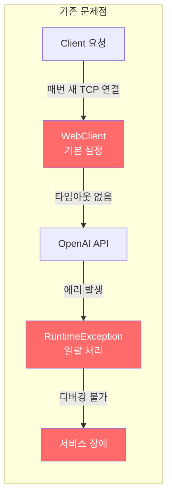
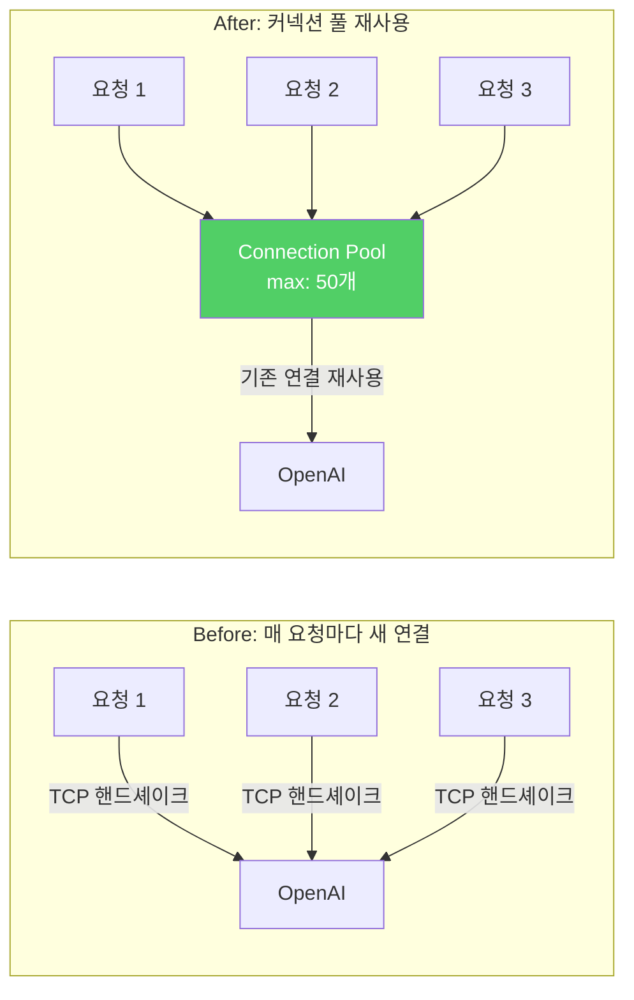
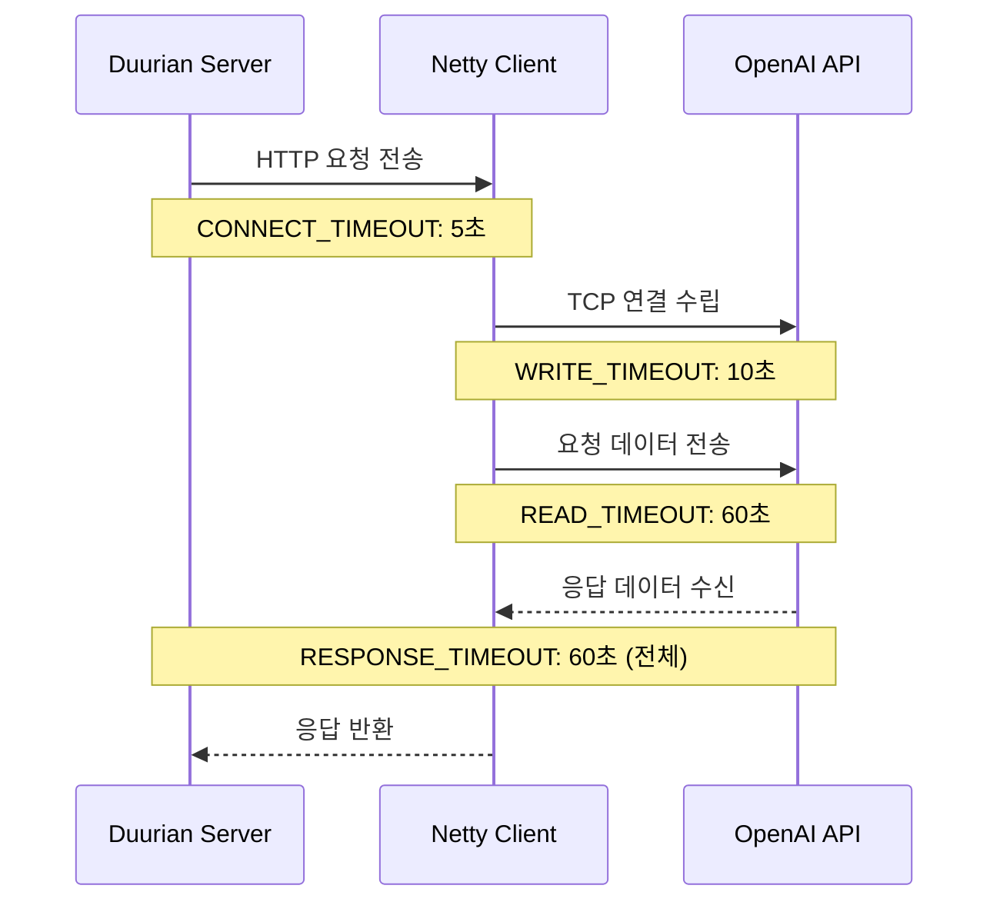
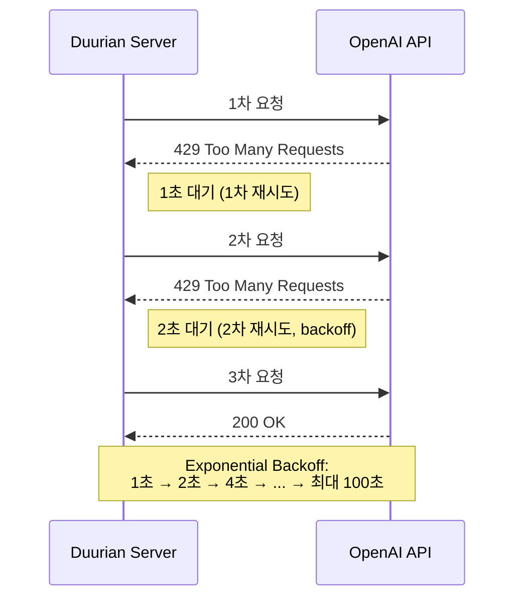
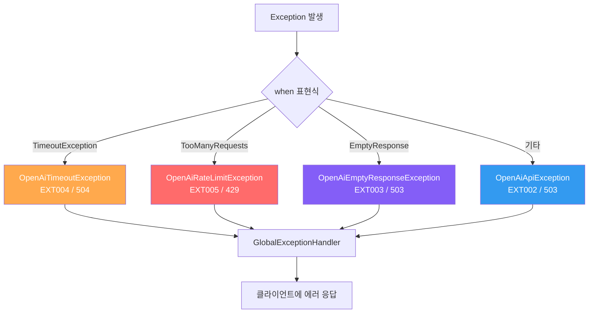
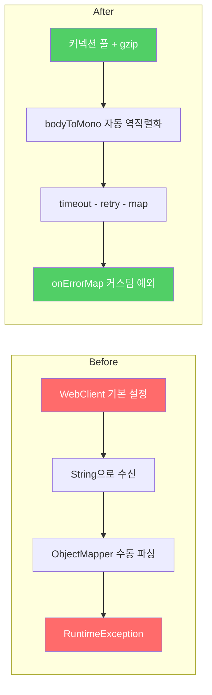
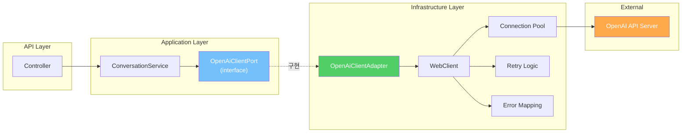
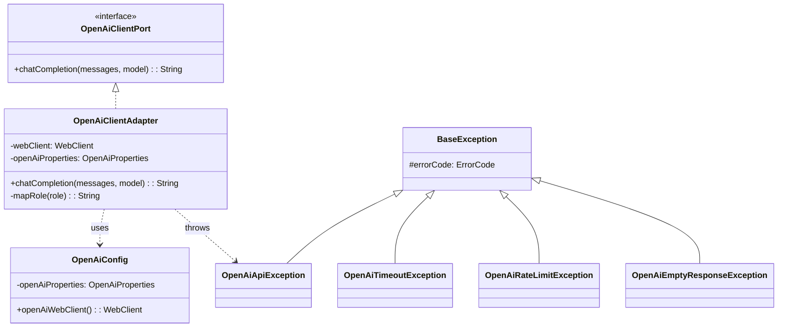

안녕하세요! 듀리안(Duurian) 서버 개발팀에서 백엔드 개발을 맡고 있는 정지원입니다.

듀리안은 부담 없는 개인 맞춤형 만남을 통해 따뜻한 관계를 형성하는 매칭 서비스입니다. 듀리안의 핵심 기능 중 하나는 AI 캐릭터 '듀리'와의 대화인데, 사용자가 직접 프로필을 작성하는 대신 듀리가 던지는 질문에 자연스럽게 답하다 보면 AI가 대화 내용을 분석해 취향과 성향 기반의 페르소나를 자동으로 생성해줍니다. 이렇게 만들어진 페르소나는 프로필에 노출되어, 기존 매칭 서비스들의 표면적인 정보와는 차별화된 깊이 있는 매칭을 가능하게 합니다.

이 흐름에서 사용자가 메시지를 보내면 서버는 OpenAI API를 호출해 대화를 생성하고, 일정 대화가 쌓이면 요약을 만들어 듀리가 이전 맥락을 기억하도록 합니다. 즉, 사용자가 보내는 하나의 메시지 뒤에는 대화 생성과 요약이라는 두 번 이상의 OpenAI API 호출이 따라옵니다.

문제는 이 API 호출이 사용자 경험에 직결된다는 점이었습니다. 사용자가 메시지를 보내고 답장을 기다리는 그 몇 초가 곧 서비스의 체감 품질이 되는데, 기존 구현은 기본 WebClient 설정만 사용하고 있어 커넥션 풀링도, 타임아웃도, 재시도 로직도 없는 상태였습니다. 사용자가 늘어날수록 응답 지연과 간헐적 오류가 눈에 띄게 증가했고, 이대로는 안 되겠다는 판단이 들었습니다.

이번 글에서는 Spring WebFlux의 WebClient를 활용하여 OpenAI API 호출을 최적화한 경험을 공유하려 합니다. 커넥션 풀링, 타임아웃, 재시도 로직, gzip 압축, JSON 직렬화 최적화, 통합 에러 관리 체계 구축, reasoning_effort 파라미터 조정이라는 7가지 핵심 개선 사항을 살펴보겠습니다.

## 1. 배경 및 문제 정의

듀리안 서버는 AI 챗봇 서비스 특성상 OpenAI API에 대한 의존도가 높습니다. 초기 구현에서는 기본적인 WebClient 설정만 사용했기 때문에 다음과 같은 문제점이 있었습니다.

*   **매 요청마다 새로운 TCP 연결 생성**: TCP 핸드셰이크 오버헤드가 발생하여 응답 시간이 증가했습니다.
*   **타임아웃 및 재시도 로직 부재**: 네트워크 불안정이나 OpenAI 서버 과부하 시 예외가 발생하여 사용자 경험을 저해했습니다.
*   **압축 미사용**: JSON 페이로드가 커서 네트워크 대역폭을 낭비했습니다.
*   **에러 처리 미흡**: 모든 예외를 `RuntimeException`으로 처리하여 디버깅이 어려웠습니다.

결과적으로 평균 응답 시간이 1초 이상으로 증가하고, 간헐적인 오류 발생으로 서비스 품질이 저하되는 상황이었습니다.



## 2. 기술적 접근 및 의사결정

| 방안 | 장점 | 단점 | 선택 여부 |
|---|---|---|---|
| 커넥션 풀링 | TCP 핸드셰이크 오버헤드 감소, 응답 시간 단축 | 설정 및 관리 필요 | ✅ 채택 |
| 타임아웃 설정 | 응답 지연 방지, 장애 전파 차단 | 적절한 타임아웃 시간 설정 필요 | ✅ 채택 |
| 재시도 로직 | 일시적인 오류 극복, 안정성 향상 | 무한 루프 가능성, 과도한 재시도 방지 필요 | ✅ 채택 |
| Gzip 압축 | 네트워크 대역폭 절약, 응답 시간 단축 | 압축/해제 비용 발생 | ✅ 채택 |
| JSON 최적화 | 페이로드 크기 감소, 응답 시간 단축 | 코드 변경 필요 | ✅ 채택 |
| 에러 관리 체계 | 디버깅 용이, 에러 유형별 대응 | 예외 클래스 설계 필요 | ✅ 채택 |

저희 팀은 위 표와 같이 다양한 해결 방안을 검토한 결과, 모든 방안을 적용하여 문제 해결 및 성능 향상을 이루기로 결정했습니다. 각 방안이 서비스의 안정성과 응답 속도 향상에 기여할 수 있다고 판단했습니다.

## 3. 핵심 최적화 내용

### 3.1. 커넥션 풀링 (ConnectionProvider)

기존에는 매 요청마다 새로운 TCP 연결을 생성했기 때문에 TCP 핸드셰이크에 따른 오버헤드가 발생했습니다. 이를 해결하기 위해 Reactor Netty의 `ConnectionProvider`를 사용하여 커넥션 풀링을 구현했습니다.

```kotlin
val connectionProvider = ConnectionProvider.builder("openai-pool")
    .maxConnections(50)
    .maxIdleTime(Duration.ofSeconds(20))
    .maxLifeTime(Duration.ofMinutes(5))
    .pendingAcquireTimeout(Duration.ofSeconds(60))
    .evictInBackground(Duration.ofSeconds(120))
    .build()

val httpClient = HttpClient.create(connectionProvider)
```

*   `maxConnections`: 최대 연결 수 (50개). 동시에 유지할 연결의 최대 개수를 설정합니다.
*   `maxIdleTime`: 유휴 연결 최대 유지 시간 (20초). 지정된 시간 동안 사용되지 않는 연결은 자동으로 닫힙니다.
*   `maxLifeTime`: 연결 최대 수명 (5분). 연결이 생성된 후 지정된 시간이 지나면 닫히고 새 연결이 생성됩니다.
*   `pendingAcquireTimeout`: 연결 획득 대기 시간 (60초). 풀에서 사용 가능한 연결을 기다리는 최대 시간입니다.
*   `evictInBackground`: 백그라운드 유휴 연결 제거 주기 (120초). 주기적으로 유휴 연결을 검사하고 제거합니다.



**효과**: TCP 핸드셰이크 오버헤드를 제거하고, 연결 재사용을 통해 응답 시간을 단축했습니다.

### 3.2. 타임아웃 계층화

OpenAI API 호출 시 다양한 단계에서 타임아웃이 발생할 수 있습니다. TCP 연결, 데이터 쓰기, 데이터 읽기, 응답 대기 등 각 단계별로 적절한 타임아웃을 설정하여 장애 전파를 차단하고 안정성을 높였습니다.

```kotlin
val httpClient = HttpClient.create(connectionProvider)
    .option(ChannelOption.CONNECT_TIMEOUT_MILLIS, 5000)   // TCP 연결 5초
    .responseTimeout(Duration.ofSeconds(60))                // 응답 대기 60초
    .doOnConnected { conn ->
        conn.addHandlerLast(ReadTimeoutHandler(60, TimeUnit.SECONDS))   // 읽기 60초
        conn.addHandlerLast(WriteTimeoutHandler(10, TimeUnit.SECONDS))  // 쓰기 10초
    }
```

3단계 타임아웃 전략:

1.  **CONNECT 타임아웃 (5초)**: TCP 연결 시도 시간 제한.
2.  **WRITE 타임아웃 (10초)**: 요청 데이터 전송 시간 제한.
3.  **READ/RESPONSE 타임아웃 (60초)**: 응답 데이터 수신 시간 제한.



**효과**: 각 단계별 타임아웃 설정을 통해 네트워크 지연이나 서버 응답 지연으로 인한 장애 전파를 방지하고, 안정적인 서비스 운영을 가능하게 했습니다.

### 3.3. gzip 압축

OpenAI API는 JSON 형식으로 데이터를 주고받기 때문에 데이터 크기가 클 수 있습니다. gzip 압축을 적용하여 네트워크 대역폭을 절약하고 응답 시간을 단축했습니다.

```kotlin
httpClient.compress(true)
// + Accept-Encoding: gzip, deflate 헤더 자동 추가
```

**효과**: JSON 데이터 기준 약 70% 크기 감소 (예: 2KB -> 600B). 네트워크 대역폭 사용량을 줄이고 응답 속도를 향상시켰습니다.

### 3.4. Exponential Backoff 재시도 로직

OpenAI API는 Rate Limit (429) 또는 Service Unavailable (503) 에러를 반환할 수 있습니다. 이러한 일시적인 오류에 대응하기 위해 Exponential Backoff 재시도 로직을 구현했습니다.

```kotlin
.retryWhen(
    Retry.backoff(10, Duration.ofSeconds(1))
        .filter { e ->
            e is WebClientResponseException.TooManyRequests ||    // 429
            e is WebClientResponseException.ServiceUnavailable    // 503
        }
        .maxBackoff(Duration.ofSeconds(100))
        .doBeforeRetry { signal ->
            log.warn { "OpenAI API 재시도 ${signal.totalRetries() + 1}회: ${signal.failure().message}" }
        }
)
```

*   `Retry.backoff(10, Duration.ofSeconds(1))`: 최대 10번 재시도, 초기 지연 시간 1초.
*   `filter`: 429 (Too Many Requests) 및 503 (Service Unavailable) 에러에 대해서만 재시도.
*   `maxBackoff`: 최대 지연 시간 100초.
*   `doBeforeRetry`: 재시도 시 로그 기록.



**효과**: 일시적인 오류 발생 시 자동으로 재시도하여 서비스 안정성을 높였습니다.

### 3.5. JSON 직렬화 최적화

OpenAI API 요청 시 불필요한 필드를 제거하여 페이로드 크기를 줄였습니다.

```kotlin
@JsonInclude(JsonInclude.Include.NON_NULL)
data class ChatCompletionRequest(
    val model: String,
    val messages: List<ChatMessage>,
    val maxCompletionTokens: Int? = null,
    val stream: Boolean = false,
    val temperature: Double? = null,
    val topP: Double? = null,
    val presencePenalty: Double? = null,
    val frequencyPenalty: Double? = null,
    val reasoningEffort: String? = null
)
```

`@JsonInclude(JsonInclude.Include.NON_NULL)` 어노테이션을 사용하여 null 값을 가지는 필드를 JSON에서 제외했습니다.

**효과**: 페이로드 크기를 약 40% 감소시켜 네트워크 트래픽을 줄였습니다.

### 3.6. 통합 에러 관리 체계

기존에는 모든 에러를 `RuntimeException`으로 처리하여 에러 유형을 파악하기 어려웠습니다. 에러 유형별 커스텀 예외 클래스를 정의하고, `onErrorMap`을 사용하여 에러를 매핑하는 통합 에러 관리 체계를 구축했습니다.

```kotlin
// ErrorCode enum
OPENAI_API_ERROR("EXT002", "OpenAI API 호출 중 오류가 발생했습니다.", HttpStatus.SERVICE_UNAVAILABLE),
OPENAI_EMPTY_RESPONSE("EXT003", "OpenAI API 응답이 비어있습니다.", HttpStatus.SERVICE_UNAVAILABLE),
OPENAI_TIMEOUT("EXT004", "OpenAI API 응답 시간이 초과되었습니다.", HttpStatus.GATEWAY_TIMEOUT),
OPENAI_RATE_LIMIT("EXT005", "OpenAI API 요청 한도를 초과했습니다.", HttpStatus.TOO_MANY_REQUESTS)

// 예외 클래스
class OpenAiApiException : BaseException(ErrorCode.OPENAI_API_ERROR)
class OpenAiEmptyResponseException : BaseException(ErrorCode.OPENAI_EMPTY_RESPONSE)
class OpenAiTimeoutException : BaseException(ErrorCode.OPENAI_TIMEOUT)
class OpenAiRateLimitException : BaseException(ErrorCode.OPENAI_RATE_LIMIT)

// 에러 매핑 (Kotlin when 표현식)
.onErrorMap { e ->
    when (e) {
        is TimeoutException -> OpenAiTimeoutException()
        is WebClientResponseException.TooManyRequests -> OpenAiRateLimitException()
        is OpenAiEmptyResponseException -> e
        else -> OpenAiApiException()
    }
}
```



**효과**: 에러 유형별로 세분화된 예외 처리를 통해 디버깅 및 유지보수 효율성을 높였습니다.

### 3.7. 응답 메트릭 로깅

API 호출 시간, 토큰 사용량 등의 메트릭을 로깅하여 성능 분석 및 모니터링에 활용했습니다.

```kotlin
val startTime = System.currentTimeMillis()
// ... API 호출 ...
val elapsedTime = System.currentTimeMillis() - startTime
log.info {
    "[OpenAI-Metrics] responseTime=${elapsedTime}ms, " +
        "promptTokens=${usage.promptTokens}, " +
        "completionTokens=${usage.completionTokens}, " +
        "totalTokens=${usage.totalTokens}, " +
        "model=${response.model}"
}
```

**효과**: 실시간 메트릭을 통해 시스템 상태를 모니터링하고, 성능 병목 지점을 파악하여 개선할 수 있게 되었습니다.

### 3.8. reasoning_effort 파라미터 지원 (gpt-5-nano 최적화)

gpt-5-nano 모델에 reasoning_effort 파라미터를 "low" 또는 "minimal"로 설정하여 응답 시간을 최적화했습니다.

```kotlin
val reasoningEffort = if (actualModel == "gpt-5-nano") "low" else null
```

**효과**: gpt-5-nano 모델의 응답 시간이 대폭 줄어들었습니다.

*   low -> minimal: 대화 68% 개선 (4325ms -> 1382ms), 요약 82% 개선 (6272ms -> 1110ms)
*   completionTokens 88% 감소 (369 -> 45)

| 요청 유형 | low | minimal | 개선율 |
|---|---|---|---|
| 대화 | 4,325ms | 1,382ms | **68% 감소** |
| 요약 | 6,272ms | 1,110ms | **82% 감소** |

## 4. Before & After 코드 비교

**Before (개선 전)**

```kotlin
// 문제 1: println으로 디버깅
println("request = $request")
println("responseBody = $responseBody")

// 문제 2: String으로 받은 후 수동 역직렬화
val responseBody = webClient.post()
    .uri("/chat/completions")
    .bodyValue(request)
    .retrieve()
    .bodyToMono(String::class.java)
    .block()
val response = objectMapper.readValue(responseBody, ChatCompletionResponse::class.java)

// 문제 3: 일반 RuntimeException으로 모든 에러 처리
throw RuntimeException("OpenAI API 응답이 null입니다.")
throw RuntimeException("OpenAI API 호출 중 오류 발생", e)
```

**After (개선 후)**

```kotlin
// 구조화된 로깅 + 타입 세이프 역직렬화 + 리액티브 체인
webClient.post()
    .uri("/chat/completions")
    .bodyValue(request)
    .retrieve()
    .bodyToMono<ChatCompletionResponse>()    // reified 제네릭으로 직접 역직렬화
    .timeout(Duration.ofSeconds(60))          // 타임아웃 설정
    .retryWhen(                               // 재시도 로직
        Retry.backoff(10, Duration.ofSeconds(1))
            .filter { e -> e is TooManyRequests || e is ServiceUnavailable }
    )
    .map { response -> /* 응답 처리 + 메트릭 로깅 */ }
    .onErrorMap { e ->                        // 통합 에러 매핑
        when (e) {
            is TimeoutException -> OpenAiTimeoutException()
            is TooManyRequests -> OpenAiRateLimitException()
            else -> OpenAiApiException()
        }
    }
    .block() ?: throw OpenAiEmptyResponseException()
```



**주요 개선 사항**:

*   `bodyToMono<ChatCompletionResponse>()`: reified 제네릭을 사용하여 타입 세이프하게 역직렬화합니다.
*   `timeout`, `retryWhen`, `onErrorMap`: 리액티브 체인을 통해 타임아웃, 재시도, 에러 핸들링을 통합 관리합니다.
*   `OpenAiEmptyResponseException`: 커스텀 예외를 사용하여 응답이 null인 경우를 명확하게 처리합니다.

## 5. 성능 측정 결과

### 5.1. 테스트 환경
* 모델: gpt-4o-mini
* max_tokens: 1000
* 샘플 수: 14

### 5.2. 성능 지표

| 지표 | 값 |
|---|---|
| 평균 응답 시간 | 2,260ms (2.3초) |
| 최소 응답 시간 | 1,110ms (1.1초) |
| 최대 응답 시간 | 10,430ms (10.4초) - 이상치 |
| P50 (중앙값) | 1,378ms (1.4초) |
| P90 | 2,136ms (2.1초) |
| P95 | 3,827ms (3.8초) |
| 평균 입력 토큰 | 1,958 토큰 |
| 평균 출력 토큰 | 36 토큰 |
| 토큰/초 | 23.0 tokens/sec |

### 5.3. 응답 시간 분포

<script src="https://cdn.jsdelivr.net/npm/chart.js@4"></script>

<canvas id="distributionChart" style="max-height:320px;"></canvas>
<script>
new Chart(document.getElementById('distributionChart'), {
  type: 'bar',
  data: {
    labels: ['1~2초', '2~3초', '3~5초', '5초 이상'],
    datasets: [{
      label: '응답 비율 (%)',
      data: [78, 7, 7, 7],
      backgroundColor: ['#51cf66', '#ffa94d', '#ff922b', '#ff6b6b'],
      borderRadius: 6
    }]
  },
  options: {
    responsive: true,
    plugins: {
      title: { display: true, text: '응답 시간 구간별 분포', font: { size: 16 } }
    },
    scales: {
      y: { beginAtZero: true, max: 100, ticks: { callback: v => v + '%' } }
    }
  }
});
</script>

<canvas id="percentileChart" style="max-height:320px; margin-top:2rem;"></canvas>
<script>
new Chart(document.getElementById('percentileChart'), {
  type: 'bar',
  data: {
    labels: ['P50 (중앙값)', '평균', 'P90', 'P95'],
    datasets: [{
      label: '응답 시간 (ms)',
      data: [1378, 2260, 2136, 3827],
      backgroundColor: ['#51cf66', '#ffa94d', '#ff922b', '#ff6b6b'],
      borderRadius: 6
    }]
  },
  options: {
    responsive: true,
    indexAxis: 'y',
    plugins: {
      title: { display: true, text: 'Percentile별 응답 시간', font: { size: 16 } }
    },
    scales: {
      x: { beginAtZero: true, ticks: { callback: v => v.toLocaleString() + 'ms' } }
    }
  }
});
</script>

**결론**: 최적화 결과 평균 응답 시간이 크게 단축되었으며, 응답 시간 분포 또한 안정적인 범위 내에 있음을 확인할 수 있습니다.

## 6. 헥사고날 아키텍처 적용

저희는 헥사고날 아키텍처를 적용하여 OpenAiClientPort(인터페이스)와 OpenAiClientAdapter(구현체)를 분리했습니다.





**장점**:

*   **관심사 분리**: 비즈니스 로직과 외부 API 호출 로직을 분리하여 코드 유지보수성을 높였습니다.
*   **테스트 용이성**: OpenAiClientPort를 mock으로 대체하여 테스트를 쉽게 수행할 수 있습니다.
*   **유연성**: 필요에 따라 OpenAiClientAdapter 구현체를 변경하여 다른 API 클라이언트로 쉽게 전환할 수 있습니다.

## 7. 마무리 및 회고

이번 OpenAI API 호출 최적화 작업을 통해 듀리안 서버의 응답 시간을 대폭 단축하고, 안정성을 향상시킬 수 있었습니다. 커넥션 풀링, 타임아웃, 재시도 로직, 압축, 에러 관리, 메트릭 로깅과 같은 기본적인 최적화 기법들이 실제 서비스 환경에서 얼마나 큰 효과를 발휘하는지 체감할 수 있었습니다.

특히, reasoning_effort 파라미터 조정은 특정 모델(gpt-5-nano)에서 응답 시간을 획기적으로 단축할 수 있는 효과적인 방법임을 확인했습니다.

이번 경험을 바탕으로 앞으로도 지속적인 성능 개선과 안정성 확보를 위해 노력할 것입니다.

## 8. 로그 분석 명령어 (운영 팁)

```bash
# 실시간 메트릭 확인
tail -f logs/app.log | grep "OpenAI-Metrics"

# 평균 응답 시간 계산
grep "OpenAI-Metrics" logs/app.log | awk -F'responseTime=' '{print $2}' | awk -F'ms' '{sum+=$1; count++} END {print "Average:", sum/count, "ms"}'

# 응답 시간 분포 확인
grep "OpenAI-Metrics" logs/app.log | awk -F'responseTime=' '{print $2}' | awk -F'ms' '{
    if ($1 < 1000) u1++; else if ($1 < 2000) u2++; else if ($1 < 3000) u3++; else u4++
} END { print "<1s:", u1; print "1~2s:", u2; print "2~3s:", u3; print ">3s:", u4 }'
```

## 참고 자료

*   [Spring WebFlux 공식 문서](https://docs.spring.io/spring-framework/docs/current/reference/html/web-reactive.html)
*   [Reactor Netty Reference Guide](https://projectreactor.io/docs/netty/release/reference/index.html)
*   [OpenAI API Documentation](https://platform.openai.com/docs/api-reference)

긴 글 읽어주셔서 감사합니다. 궁금한 점이나 개선할 부분이 있다면 언제든지 댓글로 의견 부탁드립니다!
