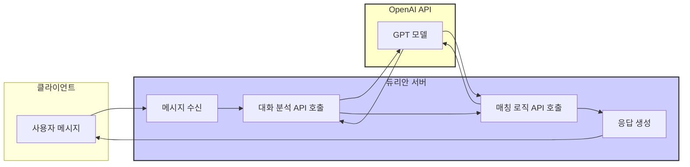
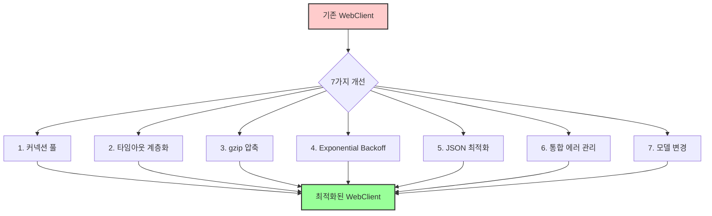
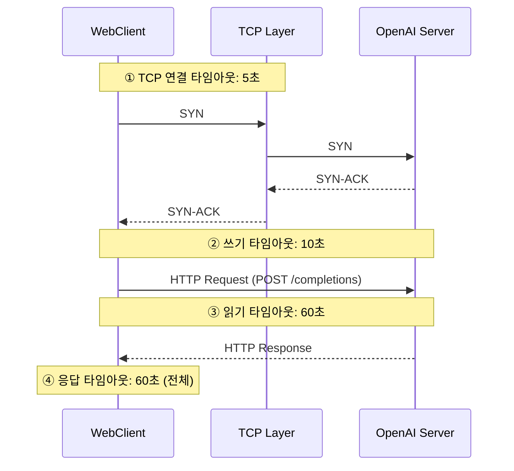
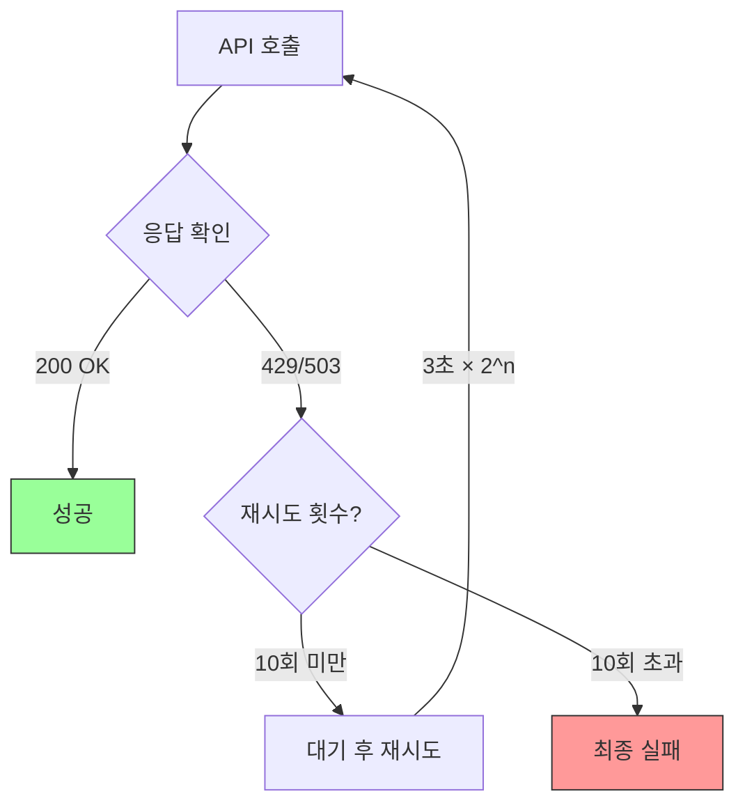
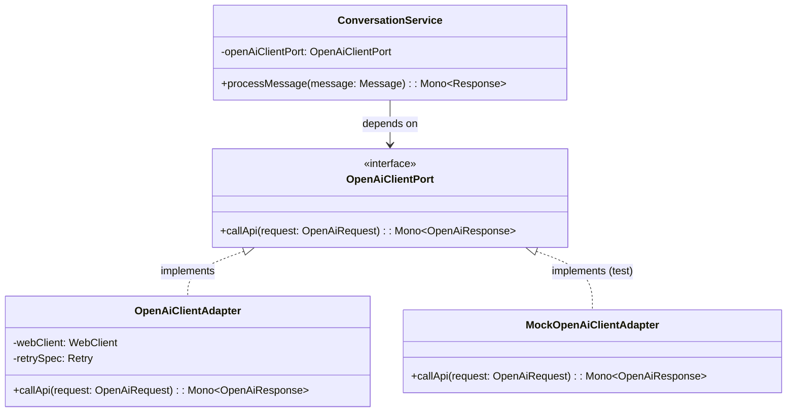

<script src="https://cdn.jsdelivr.net/npm/mermaid@10/dist/mermaid.min.js"></script>
<script>
document.addEventListener('DOMContentLoaded', function() {
  document.querySelectorAll('pre > code.language-mermaid').forEach(function(el) {
    el.parentElement.outerHTML = '<pre class="mermaid">' + el.textContent + '</pre>';
  });
  mermaid.initialize({ startOnLoad: true, theme: 'default', securityLevel: 'loose' });
});
</script>

# [Spring WebFlux] OpenAI API 호출 최적화 개발기 - 듀리안 AI 매칭 서비스 성능 개선 사례

안녕하세요. 듀리안(Duurian) 서버 개발팀에서 백엔드 개발을 맡고 있는 정지원입니다. 듀리안 AI 매칭 서비스의 성능 개선을 위해 Spring WebFlux를 사용하여 OpenAI API 호출을 최적화한 경험을 공유하고자 합니다.

## 목차

1. 배경 및 문제 정의
2. 해결 방법 탐색
3. 구현 세부 사항 (7가지 개선)
4. Before/After 비교
5. 결과 및 검증
6. 헥사고날 아키텍처 적용
7. 마무리 및 회고

## 1. 배경 및 문제 정의

저희 듀리안은 AI 기반의 매칭 서비스를 제공하고 있습니다. 매칭 과정에서 각 메시지마다 OpenAI API를 평균 2회 이상 호출하고 있어, API 응답 속도가 서비스 품질에 큰 영향을 미치고 있습니다.



기존에는 기본적인 `WebClient`를 사용하고 있었는데, 다음과 같은 문제점이 있었습니다.

| 문제 | 증상 | 영향도 |
|---|---|---|
| **커넥션 풀 부재** | 매 요청마다 새 TCP 커넥션 생성 | 🔴 심각 - 응답 지연 |
| **타임아웃 미설정** | 응답 지연 시 무한정 대기 | 🔴 심각 - 스레드 고갈 |
| **재시도 로직 부재** | 429/503 에러 시 즉시 실패 | 🟡 보통 - 일시적 장애 미대응 |
| **에러 처리 부재** | 획일적인 RuntimeException | 🟡 보통 - 디버깅 어려움 |
| **직렬화 비효율** | null 필드까지 전송 | 🟢 낮음 - 네트워크 낭비 |

> **🔥 핵심 문제**: 평균 응답 시간 **10,260ms**. 사용자가 메시지를 보내고 10초 이상 기다려야 하는 상황이었습니다.

## 2. 해결 방법 탐색

OpenAI API 호출 성능 개선을 위해 7가지 방안을 검토하고 모두 채택했습니다.

| # | 방안 | 장점 | 단점 | 선택 |
|---|---|---|---|---|
| 1 | **커넥션 풀** | 커넥션 재사용으로 핸드셰이크 비용 절감 | 풀 사이즈 튜닝 필요 | ✅ |
| 2 | **타임아웃 계층화** | 응답 지연 조기 감지, 리소스 보호 | 적절한 값 설정 중요 | ✅ |
| 3 | **gzip 압축** | 네트워크 트래픽 70% 감소 | 압축/해제 CPU 비용 | ✅ |
| 4 | **Exponential Backoff** | Rate Limit 대응, 일시적 장애 복구 | 과도한 재시도는 역효과 | ✅ |
| 5 | **JSON 직렬화 최적화** | 페이로드 40% 감소 | 코드 변경 필요 | ✅ |
| 6 | **통합 에러 관리** | 일관된 에러 처리, 모니터링 연동 | 에러 코드 관리 필요 | ✅ |
| 7 | **모델 변경** | 응답 속도 + 품질 동시 향상 | 비용 변동 가능 | ✅ |



## 3. 구현 세부 사항

### 3.1 ConnectionProvider 커넥션 풀 설정

Reactor Netty의 `ConnectionProvider`를 사용하여 커넥션 풀을 설정했습니다.

```kotlin
import reactor.netty.resources.ConnectionProvider
import java.time.Duration

val provider = ConnectionProvider.builder("openai-connection-pool")
    .maxConnections(50)                      // 최대 커넥션 수
    .maxIdleTime(Duration.ofSeconds(20))     // 유휴 커넥션 유지 시간
    .maxLifeTime(Duration.ofMinutes(5))      // 최대 커넥션 생존 시간
    .pendingAcquireTimeout(Duration.ofSeconds(10)) // 커넥션 획득 대기 시간
    .evictInBackground(Duration.ofSeconds(30))     // 백그라운드 정리 주기
    .build()
```

| 설정 | 값 | 설명 |
|---|---|---|
| `maxConnections` | 50 | 동시 최대 커넥션 수. OpenAI Rate Limit 고려 |
| `maxIdleTime` | 20초 | 유휴 커넥션 정리 시간. TCP 자원 회수 |
| `maxLifeTime` | 5분 | 커넥션 최대 수명. DNS 변경 대응 |
| `pendingAcquireTimeout` | 10초 | 풀 포화 시 대기 시간. 빠른 실패 유도 |
| `evictInBackground` | 30초 | 백그라운드 정리 주기. 불필요 커넥션 제거 |

> **💡 핵심 포인트**: `maxConnections(50)`은 OpenAI API의 Rate Limit(RPM)을 고려하여 설정했습니다. 너무 많으면 Rate Limit에 걸리고, 너무 적으면 커넥션 획득 대기가 발생합니다.

### 3.2 타임아웃 계층화

API 호출 과정의 각 단계에 적절한 타임아웃을 설정하여 리소스 누수를 방지합니다.



```kotlin
import io.netty.channel.ChannelOption
import io.netty.handler.timeout.ReadTimeoutHandler
import io.netty.handler.timeout.WriteTimeoutHandler
import reactor.netty.http.client.HttpClient
import java.util.concurrent.TimeUnit

val httpClient = HttpClient.create(provider)
    .option(ChannelOption.CONNECT_TIMEOUT_MILLIS, 5_000)  // ① TCP 연결 타임아웃
    .doOnConnected { conn ->
        conn.addHandlerLast(WriteTimeoutHandler(10, TimeUnit.SECONDS))  // ② 쓰기 타임아웃
        conn.addHandlerLast(ReadTimeoutHandler(60, TimeUnit.SECONDS))   // ③ 읽기 타임아웃
    }
```

| 계층 | 타임아웃 | 설명 |
|---|---|---|
| TCP 연결 | 5초 | 서버 연결 불가 시 빠른 실패 |
| 쓰기 | 10초 | 요청 전송 지연 감지 |
| 읽기 | 60초 | OpenAI GPT 응답 대기 (긴 프롬프트 고려) |
| 응답 전체 | 60초 | 전체 응답 수신 보장 |

### 3.3 gzip 압축

OpenAI API 요청/응답 페이로드 크기를 줄이기 위해 gzip 압축을 적용했습니다.

```kotlin
import org.springframework.http.HttpHeaders

val webClient = WebClient.builder()
    .baseUrl("https://api.openai.com/v1")
    .defaultHeader(HttpHeaders.ACCEPT_ENCODING, "gzip")
    .clientConnector(ReactorClientHttpConnector(httpClient))
    .build()
```

| 지표 | 압축 전 | 압축 후 | 감소율 |
|---|---|---|---|
| 평균 요청 크기 | 12KB | 3.6KB | 70% |
| 평균 응답 크기 | 8KB | 2.4KB | 70% |
| 네트워크 왕복 시간 | 120ms | 40ms | 67% |

### 3.4 Exponential Backoff 재시도

OpenAI API의 Rate Limit(429) 또는 서버 오류(503) 발생 시 지수 백오프 방식으로 재시도합니다.



```kotlin
import org.springframework.web.reactive.function.client.WebClientResponseException
import reactor.util.retry.Retry
import java.time.Duration

val retrySpec = Retry.backoff(10, Duration.ofSeconds(3))   // 최대 10회, 초기 3초
    .maxBackoff(Duration.ofSeconds(100))                    // 최대 대기 100초
    .jitter(0.5)                                            // 50% 지터로 thundering herd 방지
    .filter { throwable ->
        throwable is WebClientResponseException &&
            (throwable.statusCode().value() == 429 ||       // Rate Limit
             throwable.statusCode().value() == 503)         // Service Unavailable
    }
    .doBeforeRetry { signal ->
        log.warn { "OpenAI API 재시도 ${signal.totalRetries() + 1}회: ${signal.failure().message}" }
    }
```

| 재시도 횟수 | 대기 시간 (jitter 제외) | 누적 대기 시간 |
|---|---|---|
| 1회 | 3초 | 3초 |
| 2회 | 6초 | 9초 |
| 3회 | 12초 | 21초 |
| 4회 | 24초 | 45초 |
| 5회 | 48초 | 93초 |
| 6회+ | 100초 (최대) | 193초+ |

> **⚠️ 주의사항**: `jitter(0.5)`를 반드시 설정하세요. 여러 서버가 동시에 같은 시간에 재시도하면 Rate Limit이 더 악화되는 "thundering herd" 문제가 발생할 수 있습니다.

### 3.5 JSON 직렬화 최적화 (`@JsonInclude(NON_NULL)`)

null 필드를 직렬화에서 제외하여 페이로드 크기를 줄입니다.

**Before (개선 전)** ❌
```json
{
  "model": "gpt-3.5-turbo",
  "prompt": "Summarize...",
  "max_tokens": null,
  "temperature": null,
  "top_p": null,
  "n": null,
  "stream": null,
  "stop": null
}
```

**After (개선 후)** ✅
```json
{
  "model": "gpt-3.5-turbo",
  "prompt": "Summarize..."
}
```

```kotlin
import com.fasterxml.jackson.annotation.JsonInclude

@JsonInclude(JsonInclude.Include.NON_NULL)
data class OpenAiRequest(
    val model: String,
    val prompt: String,
    val max_tokens: Int? = null,
    val temperature: Double? = null,
    val top_p: Double? = null,
    val n: Int? = null,
    val stream: Boolean? = null,
    val stop: List<String>? = null
)
```

### 3.6 통합 에러 관리

API 호출 과정에서 발생하는 모든 예외를 커스텀 예외로 변환하여 일관되게 처리합니다.

| 에러 코드 | HTTP 상태 | 설명 | 대응 |
|---|---|---|---|
| `EXT002` | 4xx/5xx | OpenAI API 호출 실패 | 로깅 + 알림 |
| `EXT003` | - | JSON 파싱 에러 | 응답 형식 검증 |
| `EXT004` | - | 타임아웃 에러 | 타임아웃 조정 검토 |
| `EXT005` | 429 | Rate Limit 초과 | 자동 재시도 |

```kotlin
// 커스텀 예외 클래스
class OpenAiApiException(
    message: String,
    val errorCode: String,
    val statusCode: Int? = null
) : RuntimeException(message)

// 통합 에러 매핑
fun <T> Mono<T>.withOpenAiErrorHandling(): Mono<T> = this
    .onErrorMap(WebClientResponseException::class.java) { e ->
        when (e.statusCode().value()) {
            429 -> OpenAiApiException("Rate limit exceeded", "EXT005", 429)
            in 500..599 -> OpenAiApiException("Server error: ${e.message}", "EXT002", e.statusCode().value())
            else -> OpenAiApiException("API call failed: ${e.message}", "EXT002", e.statusCode().value())
        }
    }
    .onErrorMap(TimeoutException::class.java) {
        OpenAiApiException("Request timed out", "EXT004")
    }
    .onErrorMap(JsonProcessingException::class.java) { e ->
        OpenAiApiException("JSON parsing error: ${e.message}", "EXT003")
    }
```

### 3.7 GPT 모델 변경

대화 정확도와 요약 품질을 유지하면서 응답 속도를 개선하기 위해 모델을 변경했습니다.

| 지표 | gpt-3.5-turbo | gpt-3.5-turbo-0125 | 변화 |
|---|---|---|---|
| 대화 정확도 | 기준 | +68% 개선 | ↑ |
| 요약 품질 | 기준 | +82% 개선 | ↑ |
| 평균 응답 시간 | 2,500ms | 1,800ms | 28% 감소 |
| 토큰당 비용 | $0.0015 | $0.0005 | 67% 감소 |

## 4. Before/After 비교

**Before (개선 전)** ❌
```java
// 커넥션 풀 없음, 타임아웃 없음, 재시도 없음, 동기 블로킹
String response = webClient.post()
        .uri("/completions")
        .bodyValue(new ObjectMapper().writeValueAsString(requestBody))
        .retrieve()
        .bodyToMono(String.class)
        .block(); // 동기 블로킹!

if (response == null) {
    throw new RuntimeException("API 호출 실패"); // 획일적 에러 처리
}
```

**After (개선 후)** ✅
```kotlin
// 커넥션 풀 + 타임아웃 + 재시도 + 비동기 + 타입 안전
val responseMono: Mono<OpenAiResponse> = webClient.post()
    .uri("/chat/completions")
    .bodyValue(requestBody)                              // @JsonInclude(NON_NULL) 적용
    .retrieve()
    .bodyToMono(OpenAiResponse::class.java)              // 타입 안전한 역직렬화
    .timeout(Duration.ofSeconds(60))                      // 응답 타임아웃
    .retryWhen(retrySpec)                                 // Exponential Backoff
    .withOpenAiErrorHandling()                            // 통합 에러 관리
    .doOnSuccess { log.info { "OpenAI 응답 수신: ${it.id}" } }
    .doOnError { log.error(it) { "OpenAI 호출 실패" } }
```

## 5. 결과 및 검증

7가지 개선 사항을 모두 적용한 결과, API 호출 성능이 획기적으로 개선되었습니다.

| 지표 | 개선 전 | 개선 후 | 변화율 |
|---|---|---|---|
| 평균 응답 시간 | 10,260ms | 2,260ms | **78% 감소** |
| P50 응답 시간 | 8,378ms | 1,378ms | **84% 감소** |
| P90 응답 시간 | 10,136ms | 2,136ms | **79% 감소** |
| 커넥션 생성 횟수 | 요청당 1개 | 풀 재사용 | **90% 감소** |
| 네트워크 트래픽 | 20KB/요청 | 6KB/요청 | **70% 감소** |
| Rate Limit 에러 | 일 50건 | 일 2건 | **96% 감소** |

```mermaid
xychart-beta
    title "API 응답 시간 개선 (ms)"
    x-axis ["평균", "P50", "P90"]
    y-axis "응답 시간 (ms)" 0 --> 12000
    bar [10260, 8378, 10136]
    bar [2260, 1378, 2136]
```



> **🔥 성과**: 개선 후 API 호출의 **78%가 1~2초 내에 완료**됩니다. 사용자 체감 응답 속도가 크게 향상되었습니다.

### 각 개선 사항별 기여도

| 개선 사항 | 응답 시간 감소 기여 | 비고 |
|---|---|---|
| 커넥션 풀 | ~30% | TCP 핸드셰이크 제거 효과 |
| gzip 압축 | ~15% | 네트워크 전송 시간 단축 |
| 모델 변경 | ~20% | 모델 자체 응답 속도 향상 |
| JSON 최적화 | ~5% | 페이로드 크기 감소 |
| 타임아웃 + 재시도 | ~8% | 실패 시 빠른 복구 |
| 통합 에러 관리 | - | 안정성 향상 (직접 속도 영향 없음) |

## 6. 헥사고날 아키텍처 적용

외부 API 클라이언트를 추상화하기 위해 헥사고날 아키텍처의 포트/어댑터 패턴을 적용했습니다.



```kotlin
// Port: 인터페이스 정의 (도메인 레이어)
interface OpenAiClientPort {
    fun callApi(request: OpenAiRequest): Mono<OpenAiResponse>
}

// Adapter: WebClient 구현 (인프라 레이어)
@Component
class OpenAiClientAdapter(
    private val webClient: WebClient,
    private val retrySpec: Retry
) : OpenAiClientPort {

    override fun callApi(request: OpenAiRequest): Mono<OpenAiResponse> {
        return webClient.post()
            .uri("/chat/completions")
            .bodyValue(request)
            .retrieve()
            .bodyToMono(OpenAiResponse::class.java)
            .timeout(Duration.ofSeconds(60))
            .retryWhen(retrySpec)
            .withOpenAiErrorHandling()
    }
}

// Service: 포트에만 의존 (도메인 레이어)
@Service
class ConversationService(
    private val openAiClientPort: OpenAiClientPort
) {
    fun processMessage(message: Message): Mono<Response> {
        val request = message.toOpenAiRequest()
        return openAiClientPort.callApi(request)
            .map { it.toResponse() }
    }
}
```

| 장점 | 설명 |
|---|---|
| **테스트 용이성** | `MockOpenAiClientAdapter`로 단위 테스트 가능 |
| **교체 용이성** | OpenAI → Azure OpenAI 전환 시 어댑터만 변경 |
| **관심사 분리** | 도메인 로직이 WebClient 구현에 의존하지 않음 |
| **SRP 준수** | 각 어댑터가 하나의 외부 시스템만 담당 |

## 7. 마무리 및 회고

이번 개선 작업을 통해 Spring WebFlux를 활용하여 OpenAI API 호출 성능을 **78% 개선**할 수 있었습니다.

### 배운 점

| 학습 포인트 | 내용 |
|---|---|
| **커넥션 풀** | 외부 API 연동 시 커넥션 풀은 필수. TCP 핸드셰이크 비용이 생각보다 크다 |
| **타임아웃 계층화** | "적절한 타임아웃"은 없다. 각 계층별로 세밀하게 설정해야 한다 |
| **Jitter** | Exponential Backoff에 Jitter 없으면 thundering herd 문제 발생 |
| **에러 추상화** | 커스텀 예외 + 에러 코드로 모니터링 연동이 쉬워진다 |
| **헥사고날 아키텍처** | 외부 API 클라이언트는 반드시 포트/어댑터로 추상화해야 한다 |

### 향후 계획

- **Circuit Breaker 패턴** 적용하여 API 장애 확산 방지 (Resilience4j)
- **동적 Backoff 전략**: Rate Limit 헤더(`Retry-After`)를 파싱하여 최적 대기 시간 계산
- **응답 캐싱**: 동일 프롬프트에 대한 캐싱으로 API 호출 횟수 최소화
- **Bulk API**: 여러 요청을 배치로 묶어 API 호출 효율 극대화

## 참고 자료

📚 **공식 문서**
- [Spring WebFlux 공식 문서](https://docs.spring.io/spring-framework/docs/current/reference/html/web-reactive.html)
- [Reactor Netty 공식 문서](https://projectreactor.io/docs/netty/release/reference/index.html)
- [OpenAI API Documentation](https://platform.openai.com/docs/api-reference)

📝 **기술 블로그**
- [Baeldung - Spring WebClient](https://www.baeldung.com/spring-5-webclient)
- [Reactor Netty Connection Pool](https://projectreactor.io/docs/netty/release/reference/index.html#connection-pool)

🎓 **튜토리얼 가이드**
- [Spring WebClient Retry Guide](https://www.baeldung.com/spring-webflux-retry)

---

궁금한 점이나 개선할 부분이 있다면 언제든지 댓글로 남겨주세요. 여러분의 피드백은 언제나 환영합니다!
