# Kotlin Coroutines에서 Spring @Async로 — 대화 요약 비동기화로 API 응답 시간 71% 개선한 이야기


안녕하세요. duurian 팀에서 백엔드 개발을 담당하고 있는 개발자입니다. AI 기반 대화 서비스의 서버 성능 최적화와 안정성 개선을 맡고 있습니다.

---

## 배경

### duurian 서비스 구조

duurian은 AI 기반 대화 서비스입니다. 사용자가 여러 턴(turn)에 걸쳐 대화를 나누고, **마지막 턴이 끝나면** 서버가 OpenAI API를 호출하여 대화 내용을 분석하고 요약을 생성합니다. 이 요약은 사용자의 성격, 관심사 등을 파악하여 이후 추천 시스템에 활용됩니다.

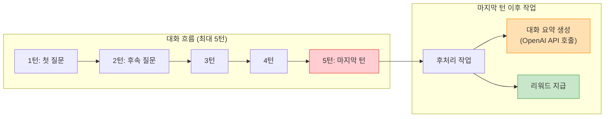

### 동기 처리의 문제점

API가 요청을 처리하고 모든 작업이 완료된 후에야 응답을 반환하는 방식을 **동기(Synchronous) 처리**라고 합니다. 동기 API는 클라이언트가 서버의 응답을 받기 전까지 다른 작업을 수행할 수 없으며, 특히 외부 API 호출처럼 **I/O 바운드 작업**이 포함되면 응답 시간이 급격히 늘어납니다. ([Synchronous API vs Asynchronous API - Nylas](https://www.nylas.com/blog/synchronous-vs-asynchronous-api/))

문제는 이 요약 생성 과정이 바로 이 **동기적** 방식으로 실행되고 있었다는 점입니다.

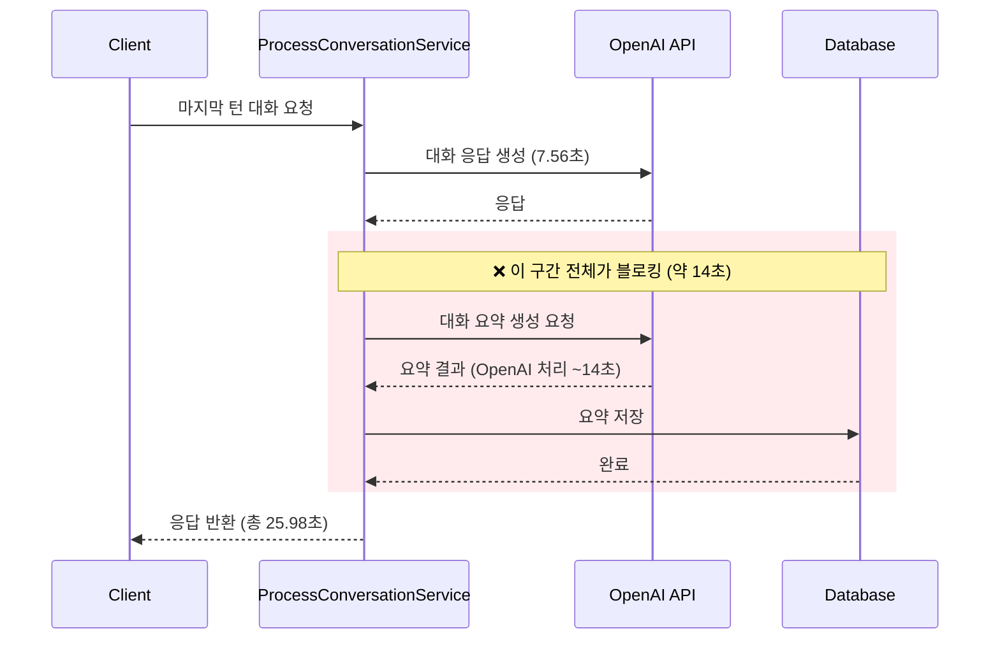

> **🔥 핵심 문제**: 사용자는 대화 응답만 필요한데, 요약 생성이 끝날 때까지 **14초를 추가로** 기다려야 했습니다. 전체 API 응답 시간이 **25.98초**에 달했습니다.

### 비동기 전환의 판단 기준

요약 생성은 사용자에게 **즉시** 보여줄 필요가 없는 **후처리 작업**입니다. 그런데 이 작업이 API 응답을 블로킹하고 있었으니, 사용자 경험에 큰 문제가 있었습니다.

비동기(Asynchronous) API는 클라이언트의 요청을 수락(202 Accepted)하고 실제 처리는 백그라운드에서 수행합니다. 클라이언트는 결과를 기다리지 않고 즉시 다음 작업을 진행할 수 있습니다. ([Understanding Asynchronous APIs - Postman Blog](https://blog.postman.com/understanding-asynchronous-apis/))

비동기화 대상을 판별하는 핵심 질문은 하나입니다:

> **"이 작업의 결과가 클라이언트 응답에 즉시 필요한가?"**

| 질문 | 대화 응답 생성 | 대화 요약 생성 |
|------|---------------|---------------|
| 클라이언트에 즉시 필요한가? | ✅ 필수 — 사용자가 보는 응답 | ❌ 불필요 — 내부 분석용 데이터 |
| 동기 처리 필요? | ✅ 반드시 대기 | ❌ 백그라운드 처리 가능 |
| 비동기화 가능? | ❌ | ✅ |

이 글에서는 이 문제를 3단계에 걸쳐 해결한 과정을 공유합니다.

---

## 해결 과정 개요

비동기 처리를 도입하는 것은 단순히 `async` 키워드를 붙이는 것이 아닙니다. **어떤 도구로, 어떤 아키텍처에서, 어떤 안전장치와 함께** 비동기화할 것인지가 중요합니다. 저희는 다음 3단계를 거쳐 점진적으로 개선했습니다.

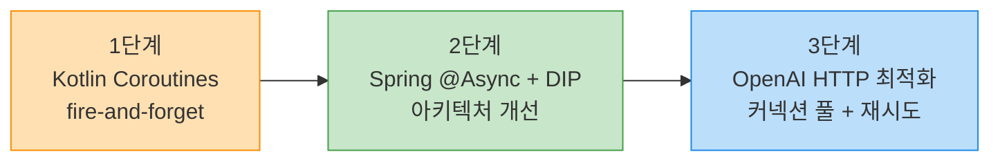

| 단계 | 핵심 변경 | 목적 | 해결하는 문제 |
|------|-----------|------|--------------|
| 1단계 | `CoroutineScope(Dispatchers.IO).launch` | 요약 생성을 백그라운드로 분리 | 클라이언트 대기 시간 14초 제거 |
| 2단계 | Spring `@Async` + Port 인터페이스 | Spring 생태계 통합 + 의존성 역전 | Spring AOP/트랜잭션 분리 문제, 확장성 |
| 3단계 | WebClient 커넥션 풀 + 재시도 | OpenAI API 호출 자체의 안정성 확보 | 일시적 오류(429/503), 연결 생성 오버헤드 |

> **📝 참고**: 한 프로젝트에서 비동기 API를 도입하여 **응답 시간을 5~10초에서 500ms~1초로** 개선한 [사례](https://obv-cloud.com/42)도 있습니다. 비동기화는 외부 API 호출이 많은 서비스에서 특히 큰 효과를 발휘합니다.

---

## 1단계: Kotlin Coroutines로 비동기화

### 접근 방식: Fire-and-Forget 패턴

가장 빠른 해결책은 요약 생성 로직을 **fire-and-forget** 패턴으로 전환하는 것이었습니다.

Fire-and-forget은 말 그대로 "실행하고 잊어버리는" 패턴입니다. 메서드를 호출하되, 그 결과를 기다리지 않고 즉시 반환합니다. 빠르게 응답할 수 있지만, **앱이 크래시되면 진행 중인 작업이 유실될 수 있다는** 트레이드오프가 있습니다. ([Fire and Forget Pattern](https://ducmanhphan.github.io/2020-02-24-fire-and-forget-pattern/))

### Dispatchers.IO의 동작 원리

Kotlin Coroutines의 `Dispatchers.IO`는 **I/O 바운드 작업**(파일 읽기/쓰기, 네트워크 호출, 블로킹 API 호출 등)에 최적화된 디스패처입니다.

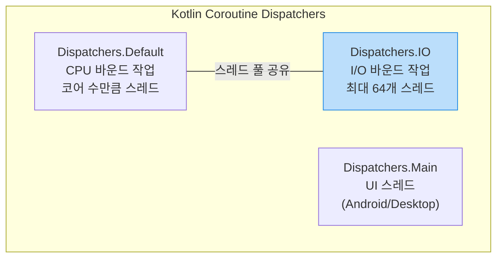

| 속성 | Dispatchers.Default | Dispatchers.IO |
|------|-------------------|----------------|
| 용도 | CPU 집약적 작업 (계산, 정렬) | I/O 작업 (네트워크, DB, 파일) |
| 스레드 수 | CPU 코어 수 | 최대 64개 (또는 코어 수 중 큰 값) |
| 특성 | 적은 스레드로 효율적 처리 | 대기 시간이 긴 작업에 많은 스레드 할당 |

> **💡 핵심 포인트**: I/O 작업은 대부분 **대기(waiting)** 상태입니다. CPU를 사용하지 않으면서 네트워크나 디스크 응답을 기다리기 때문에, 더 많은 스레드를 할당해도 CPU 자원에 부담이 적습니다. 이것이 `Dispatchers.IO`가 Default보다 더 큰 스레드 풀을 사용하는 이유입니다. ([Kotlin Coroutines Dispatchers - Kt. Academy](https://kt.academy/article/cc-dispatchers))

`CoroutineScope(Dispatchers.IO).launch`를 사용하면, 호출 즉시 I/O 스레드 풀의 별도 스레드에서 실행되고 현재 스레드는 블로킹되지 않습니다.

### 코드 변경

먼저 인터페이스의 반환 타입을 변경했습니다.

**Before** ❌
```kotlin
interface CreateConversationSummaryUseCase {
    fun createConversationSummary(
        command: CreateConversationSummaryCommand
    ): List<CommandConversationSummaryResult>  // 결과를 반환해야 함 → 블로킹
}
```

**After** ✅
```kotlin
interface CreateConversationSummaryUseCase {
    fun createConversationSummary(
        command: CreateConversationSummaryCommand
    )  // Unit 반환 → fire-and-forget 가능
}
```

> **💡 핵심 포인트**: 반환 타입을 `Unit`으로 변경함으로써, 호출자가 결과를 기다릴 필요가 없어졌습니다. 이것이 비동기화의 전제 조건입니다.

다음으로 서비스 구현체를 비동기로 전환했습니다.

**Before (동기 방식)** ❌
```kotlin
override fun createConversationSummary(
    command: CreateConversationSummaryCommand
): List<CommandConversationSummaryResult> {
    // 이 모든 작업이 완료될 때까지 호출자가 블로킹됨
    val todayConversations = queryConversationPort.findAllTodayUserConversations(
        command.userId, LocalDate.now()
    )
    val summaries = handleSummary(todayConversations)  // OpenAI API 호출 (~14초)
    
    for (summary in summaries) {
        println("summary: $summary")  // 디버깅용 println 😅
        val newSummary = ConversationSummary.create(userId = command.userId, content = summary)
        val savedSummary = commandConversationSummaryPort.saveConversationSummary(newSummary)
        results.add(CommandConversationSummaryResult(...))
    }
    return results  // 결과 반환 시점 = 모든 작업 완료 시점
}
```

**After (Kotlin Coroutines 비동기)** ✅
```kotlin
override fun createConversationSummary(command: CreateConversationSummaryCommand) {
    // CoroutineScope로 감싸서 즉시 반환
    CoroutineScope(Dispatchers.IO).launch {
        val todayConversations = queryConversationPort.findAllTodayUserConversations(
            command.userId, LocalDate.now()
        )
        val summaries = handleSummary(todayConversations)  // 백그라운드에서 실행
        
        for (summary in summaries) {
            val newSummary = ConversationSummary.create(
                userId = command.userId, content = summary
            )
            commandConversationSummaryPort.saveConversationSummary(newSummary)
        }
    }
    // launch는 즉시 반환 → 호출자는 블로킹되지 않음
}
```

그리고 마지막 턴에서 요약 생성을 호출하도록 `ProcessConversationService`에 로직을 추가했습니다.

```kotlin
// ProcessConversationService.kt
val isLastTurn = currentTurn == MAX_TURNS

if (isLastTurn) {
    // 비동기이므로 즉시 반환됨
    createConversationSummaryUseCase.createConversationSummary(
        CreateConversationSummaryCommand(userId = command.userId)
    )
}
```

### 1단계 결과

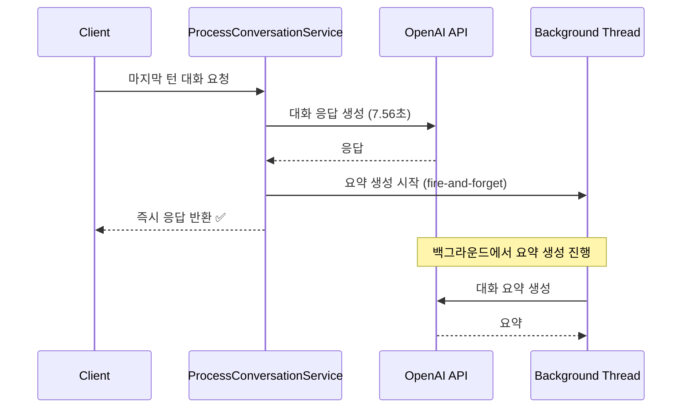

> **⚠️ 주의사항**: 이 방식에는 한계가 있었습니다.

`CoroutineScope`를 직접 생성하면 Spring의 트랜잭션 관리, AOP, 에러 핸들링과 **완전히 분리**됩니다. 코루틴 내부에서 발생하는 예외는 Spring의 `@Transactional` 롤백 메커니즘과 무관하게 동작하며, 에러 핸들링도 코루틴 내부에서 직접 처리해야 합니다. 또한, 구조적으로 `ProcessConversationService`가 요약 생성(`CreateConversationSummaryUseCase`)과 리워드 지급(`CreateRewardUseCase`) **두 가지 구체 구현에 직접 의존**하는 문제도 있었습니다. 마지막 턴 이후에 새로운 작업을 추가할 때마다 이 서비스를 수정해야 했습니다.

---

## 2단계: Spring @Async + DIP로 리팩토링

### 왜 Coroutine에서 @Async로 전환했나?

1단계의 Kotlin Coroutines 방식은 동작했지만, 몇 가지 문제가 있었습니다.

| 항목 | CoroutineScope 직접 사용 | Spring @Async |
|------|-------------------------|---------------|
| 트랜잭션 관리 | Spring 트랜잭션과 분리됨 ⚠️ | Spring AOP와 자연스럽게 통합 ✅ |
| 에러 핸들링 | 코루틴 내부에서 직접 처리 필요 | Spring의 [AsyncUncaughtExceptionHandler](https://medium.com/@sachinverma_78701/handling-exceptions-in-async-execution-in-spring-boot-%EF%B8%8F-632fb21639e8) 활용 가능 |
| 스레드 풀 관리 | Dispatchers.IO 기본 설정 의존 | Spring [TaskExecutor](https://docs.spring.io/spring-framework/reference/integration/scheduling.html#scheduling-annotation-support-async)로 세밀한 제어 가능 |
| 테스트 용이성 | 코루틴 테스트 라이브러리 필요 | 동기 호출로 테스트 가능 |
| 생태계 통합 | 별도 관리 필요 | Spring의 모니터링, 로깅과 통합 |

### Spring @Async의 내부 동작 원리

`@Async`는 단순한 어노테이션처럼 보이지만, 내부적으로는 **Spring AOP 프록시** 메커니즘을 통해 동작합니다. ([Spring Boot @Async 어떻게 동작하는가? - brunch](https://brunch.co.kr/@springboot/401))

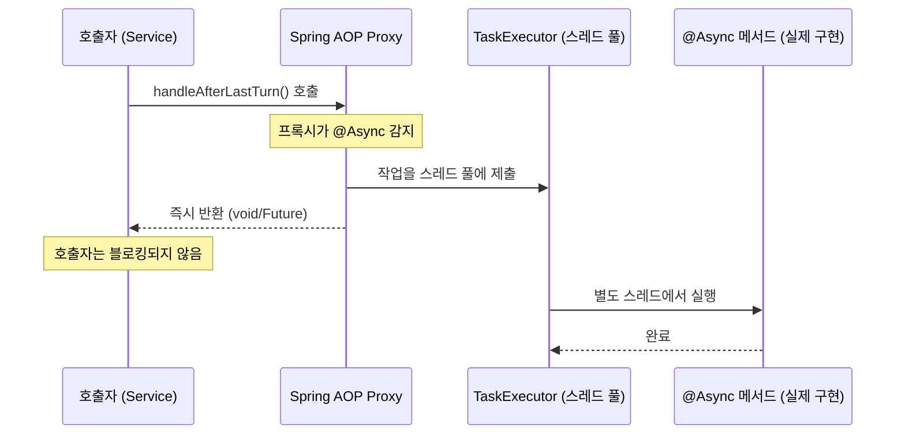

핵심 동작 흐름은 다음과 같습니다:

1. **프록시 생성**: `@EnableAsync`를 선언하면 Spring이 `@Async` 메서드가 있는 빈에 대해 프록시 객체를 생성합니다
2. **메서드 가로채기**: 메서드 호출 시, 프록시가 이를 가로채서 `TaskExecutor`의 스레드 풀에 작업을 제출합니다
3. **비동기 실행**: 실제 메서드는 **별도 스레드**에서 실행되고, 호출자에게는 즉시 반환됩니다

내부적으로 `AsyncExecutionAspectSupport` 클래스의 `doSubmit` 메서드에서, 반환 타입에 따라 다르게 처리됩니다:
- **void**: 즉시 `null` 반환 (fire-and-forget)
- **Future/CompletableFuture**: 비동기 결과를 추적 가능한 Future 객체 반환

> **⚠️ 주의**: `@Async` 메서드는 **반드시 public**이어야 하며, **같은 클래스 내부에서 호출하면 작동하지 않습니다.** 내부 호출은 프록시를 거치지 않고 직접 메서드를 호출하기 때문입니다. 이것이 별도 Service 클래스로 분리한 이유이기도 합니다. ([Understanding Spring Proxies and @Async - Medium](https://medium.com/@pradeepisuru31/understanding-spring-proxies-and-async-the-complete-developers-guide-f7e1b669dd6f))

> **💡 핵심 포인트**: 이미 Spring Boot 기반 프로젝트에서는 Spring의 `@Async`가 코루틴보다 **생태계 통합** 측면에서 유리합니다. 특히 트랜잭션 경계가 중요한 경우에 그렇습니다. ([Non-Blocking Spring Boot with Kotlin Coroutines - Baeldung](https://www.baeldung.com/kotlin/spring-boot-kotlin-coroutines))

### DIP(의존성 역전 원칙) 적용

단순히 비동기화만 한 것이 아닙니다. **마지막 턴 이후 작업** 전체를 하나의 Port 인터페이스로 추상화했습니다.

이 설계는 **헥사고날 아키텍처(Hexagonal Architecture)**의 Port & Adapter 패턴에서 영감을 받았습니다. 헥사고날 아키텍처의 핵심은 바로 **의존성 역전 원칙(DIP)**입니다. 고수준 모듈(도메인)이 저수준 모듈(인프라)에 의존하는 대신, 둘 다 **추상화(인터페이스)**에 의존합니다. ([Hexagonal Architecture is based on Dependency Inversion - Unite](https://techblog.unite.eu/hexagonal-architecture-at-its-core-is-based-on-dependency-inversion-a8a6ef7ac38b))

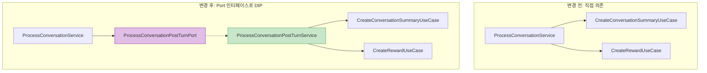

먼저 Port 인터페이스를 정의했습니다.

```kotlin
// 마지막 턴 이후 작업을 추상화한 Port 인터페이스
interface ProcessConversationPostTurnPort {
    fun handleAfterLastTurn(userId: UUID)
}
```

그리고 이 Port를 구현하는 서비스에 `@Async`를 적용했습니다.

```kotlin
@Service
class ProcessConversationPostTurnService(
    private val createConversationSummaryUseCase: CreateConversationSummaryUseCase,
    private val createRewardUseCase: CreateRewardUseCase
) : ProcessConversationPostTurnPort {

    private val log = KotlinLogging.logger {}

    @Async  // Spring이 별도 스레드에서 실행
    override fun handleAfterLastTurn(userId: UUID) {
        try {
            // 요약 생성
            createConversationSummaryUseCase.createConversationSummary(
                CreateConversationSummaryCommand(userId = userId)
            )
            // 리워드 지급
            createRewardUseCase.createConversationReward(
                CreateRewardCommand(userId = userId)
            )
        } catch (e: Exception) {
            log.error(e) { "마지막 턴 이후 비동기 작업 실패" }
        }
    }
}
```

`@EnableAsync`를 Application 클래스에 추가하여 비동기 처리를 활성화했습니다.

```kotlin
@EnableJpaAuditing
@EnableScheduling
@EnableAsync  // 비동기 처리 활성화
@SpringBootApplication
class DuurianApplication
```

마지막으로, `ProcessConversationService`에서 직접 의존하던 UseCase들을 Port 인터페이스로 교체했습니다.

**Before** ❌
```kotlin
class ProcessConversationService(
    ...
    private val createConversationSummaryUseCase: CreateConversationSummaryUseCase,
    private val createRewardUseCase: CreateRewardUseCase  // 구체 구현에 직접 의존
)

// 호출 시
if (isLastTurn) {
    createConversationSummaryUseCase.createConversationSummary(...)
    createRewardUseCase.createConversationReward(...)
}
```

**After** ✅
```kotlin
class ProcessConversationService(
    ...
    private val postTurnPort: ProcessConversationPostTurnPort  // 추상화에 의존
)

// 호출 시 - 단 한 줄로 정리
if (currentTurn == MAX_TURNS) {
    postTurnPort.handleAfterLastTurn(command.userId)
}
```

### DIP 적용의 이점

| 관점 | 개선 내용 |
|------|-----------|
| **단일 책임** | ProcessConversationService는 대화 처리만 담당. 후처리 작업의 세부사항을 알 필요 없음 |
| **확장성** | 마지막 턴 이후 작업 추가 시 PostTurnService만 수정하면 됨 (알림, 분석 등) |
| **테스트 용이성** | Port 인터페이스를 Mock하여 ProcessConversationService를 독립적으로 테스트 가능 |
| **비동기 전환 투명성** | 호출자는 동기/비동기 여부를 알 필요 없음 — `@Async`는 구현체의 관심사 |

---

## 3단계: OpenAI API HTTP 호출 최적화

비동기화로 사용자 대기 시간은 해결했지만, OpenAI API 호출 자체의 **안정성과 효율**도 개선이 필요했습니다. 백그라운드에서 실행되더라도 OpenAI API 호출이 실패하거나 불안정하면, 요약 생성 자체가 되지 않기 때문입니다.

### 커넥션 풀이 필요한 이유

HTTP 연결을 매번 새로 생성하는 것은 TCP 핸드셰이크 → TLS 핸드셰이크 → 요청/응답 → 연결 종료 과정을 반복하는 것입니다. **커넥션 풀**을 사용하면 이미 맺어진 연결을 재사용하여 이 오버헤드를 제거할 수 있습니다. ([Spring WebClient & Connection Pool - dcebotarenco](https://dcebotarenco.github.io/posts/reactor-connection-pool/))

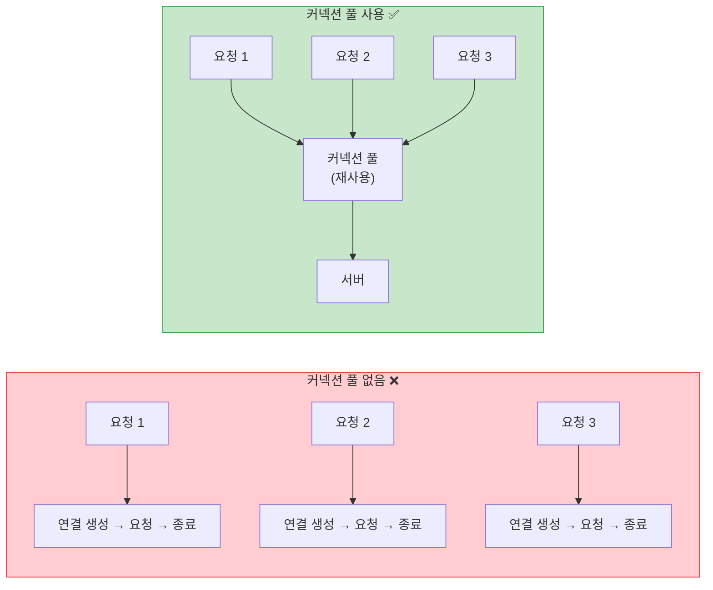

Reactor Netty의 기본 커넥션 풀은 최대 500개의 활성 연결과 1000개의 대기열을 가집니다. 하지만 OpenAI API와 같이 특정 외부 서비스만 호출하는 경우에는 목적에 맞게 풀 크기를 조정하고, `maxIdleTime`과 `evictInBackground`를 설정하여 유휴 연결을 적절히 정리해야 합니다. ([Spring Boot WebClient: Performance Optimization - DZone](https://dzone.com/articles/spring-boot-webclient-optimizing-performance-and-resilience))

> **💡 핵심 포인트**: `maxIdleTime`은 서버 측의 `keepAliveTimeout`보다 짧게 설정하는 것이 좋습니다. 서버가 먼저 연결을 끊으면 클라이언트가 닫힌 연결에 요청을 보내는 문제가 발생할 수 있습니다. ([Webclient timeout and connection pool Strategy - DEV](https://dev.to/yangbongsoo/webclient-timeout-and-connection-pool-strategy-2gpn))

**Before** ❌ — 기본 WebClient 설정 (커넥션 풀 없음)
```kotlin
@Bean(name = ["openAiWebClient"])
fun openAiWebClient(): WebClient {
    return WebClient.builder()
        .baseUrl(openAiProperties.apiUrl)
        .defaultHeader(HttpHeaders.AUTHORIZATION, "Bearer ${openAiProperties.apiKey}")
        .defaultHeader(HttpHeaders.CONTENT_TYPE, MediaType.APPLICATION_JSON_VALUE)
        .build()
}
```

**After** ✅ — 커넥션 풀 + 타임아웃 + gzip 압축
```kotlin
@Bean(name = ["openAiWebClient"])
fun openAiWebClient(): WebClient {
    // 커넥션 풀: 매번 새 연결을 만들지 않고 재사용
    val connectionProvider = ConnectionProvider.builder("openai-pool")
        .maxConnections(50)              // 최대 50개 동시 연결
        .maxIdleTime(Duration.ofSeconds(20))  // 유휴 연결 20초 후 정리
        .maxLifeTime(Duration.ofMinutes(5))   // 연결 최대 수명 5분
        .pendingAcquireTimeout(Duration.ofSeconds(60))
        .evictInBackground(Duration.ofSeconds(120))
        .build()

    // HTTP 클라이언트: 타임아웃 + 압축
    val httpClient = HttpClient.create(connectionProvider)
        .option(ChannelOption.CONNECT_TIMEOUT_MILLIS, 5000)  // 연결 타임아웃 5초
        .responseTimeout(Duration.ofSeconds(60))              // 응답 타임아웃 60초
        .doOnConnected { conn ->
            conn.addHandlerLast(ReadTimeoutHandler(60, TimeUnit.SECONDS))
            conn.addHandlerLast(WriteTimeoutHandler(10, TimeUnit.SECONDS))
        }
        .compress(true)  // gzip 압축 활성화

    return WebClient.builder()
        .baseUrl(openAiProperties.apiUrl)
        .clientConnector(ReactorClientHttpConnector(httpClient))
        .defaultHeader(HttpHeaders.ACCEPT_ENCODING, "gzip, deflate")
        ...
        .build()
}
```

### 재시도 로직: 지수 백오프(Exponential Backoff)

OpenAI API는 과도한 요청 시 **429 Too Many Requests** 또는 서버 과부하 시 **503 Service Unavailable**을 반환합니다. [OpenAI 공식 문서](https://platform.openai.com/docs/guides/rate-limits)에서는 이런 경우 **지수 백오프(Exponential Backoff)** 전략으로 재시도할 것을 권장합니다.

지수 백오프는 첫 번째 재시도는 빠르게, 이후 재시도는 간격을 점점 늘려가는 방식입니다. 랜덤 지터(jitter)를 추가하면 여러 클라이언트가 동시에 재시도하는 "thundering herd" 문제도 방지할 수 있습니다. ([How to handle rate limits - OpenAI Cookbook](https://cookbook.openai.com/examples/how_to_handle_rate_limits))

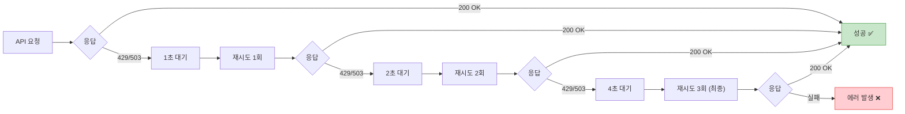

**Before** ❌ — String으로 받아서 수동 파싱, 재시도 없음
```kotlin
val responseBody = webClient.post()
    .uri("/chat/completions")
    .bodyValue(request)
    .retrieve()
    .bodyToMono(String::class.java)  // String으로 받아서
    .block()

val response = objectMapper.readValue(responseBody, ChatCompletionResponse::class.java)  // 수동 파싱
```

**After** ✅ — 직접 타입 매핑 + 지수 백오프 재시도
```kotlin
return webClient.post()
    .uri("/chat/completions")
    .bodyValue(request)
    .retrieve()
    .bodyToMono<ChatCompletionResponse>()  // 직접 타입 매핑
    .timeout(Duration.ofSeconds(60))
    .retryWhen(
        Retry.backoff(3, Duration.ofSeconds(1))  // 최대 3회, 1초부터 지수 백오프
            .filter { e ->
                // 429 (Rate Limit) 또는 503 (Service Unavailable)만 재시도
                e is WebClientResponseException.TooManyRequests ||
                e is WebClientResponseException.ServiceUnavailable
            }
            .maxBackoff(Duration.ofSeconds(10))
            .doBeforeRetry { signal ->
                log.warn { "OpenAI API 재시도 ${signal.totalRetries() + 1}회: ${signal.failure().message}" }
            }
    )
    .map { response ->
        // 토큰 사용량 로깅
        response.usage?.let { usage ->
            log.info {
                "[OpenAI-Token] prompt=${usage.promptTokens}, " +
                    "completion=${usage.completionTokens}, " +
                    "total=${usage.totalTokens}"
            }
        }
        // 응답 추출 및 검증
        val content = response.choices?.firstOrNull()?.message?.content
            ?: throw OpenAiApiException("OpenAI API 응답에 content가 없습니다.")
        content.replace(Regex("^\\[?듀리[^\\]:：]*]?\\s*[：:]\\s*"), "")
    }
    .block() ?: throw OpenAiApiException("OpenAI API 응답이 null입니다.")
```

### HTTP 최적화 요약

| 개선 항목 | 변경 전 | 변경 후 | 효과 |
|-----------|---------|---------|------|
| 커넥션 관리 | 매번 새 연결 | 풀링 (최대 50개) | 연결 생성 오버헤드 제거 |
| 응답 파싱 | String → ObjectMapper | 직접 타입 매핑 | 중간 문자열 변환 제거 |
| 재시도 | 없음 | 지수 백오프 3회 | 일시적 오류에 대한 복원력 |
| 압축 | 비활성 | gzip 활성 | 네트워크 전송량 감소 |
| 타임아웃 | 무제한 | 연결 5초 / 응답 60초 | 무한 대기 방지 |
| 로깅 | `println` | 구조화된 로거 | 프로덕션 환경 적합 |

---

## 최종 결과

### 성능 측정 비교

| 작업 | 변경 전 | 변경 후 | 개선율 |
|------|---------|---------|--------|
| **요약 생성 (클라이언트 대기)** | 14초 | 0초 | **100% 개선** ⚡ |
| **대화 생성 전체** | 25.98초 | 7.56초 | **71% 개선** ⚡ |

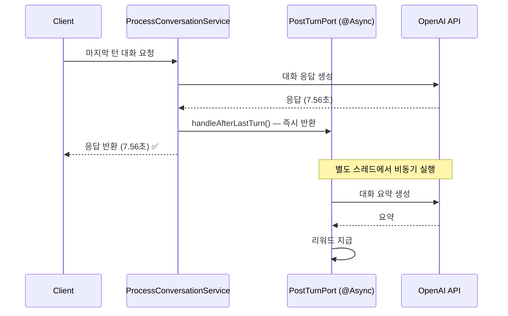

> **🔥 성능 팁**: 대화 생성 시간이 **25.98초에서 7.56초로**  약 **18초가 단축**되었습니다.     
사용자는 더 이상 요약 생성을 기다릴 필요가 없습니다.

### 아키텍처 개선 결과

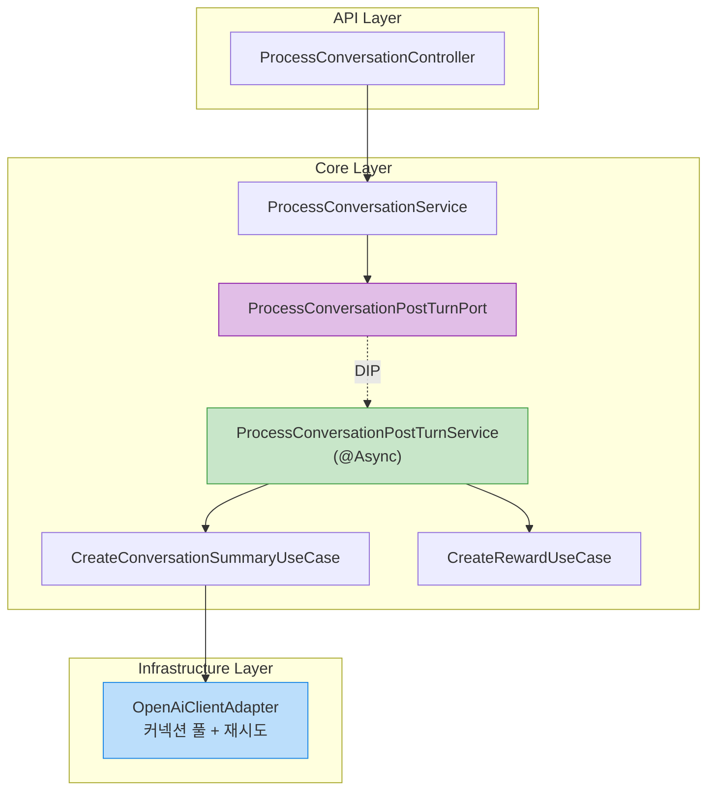

---

## 마무리

### 배운 점

이번 작업을 통해 몇 가지 중요한 인사이트를 얻었습니다.

1. **동기 vs 비동기의 판단 기준**: "이 작업의 결과가 **즉시** 클라이언트에게 필요한가?"를 먼저 판단하면, 비동기화 대상을 쉽게 식별할 수 있습니다. 대화 요약은 사용자에게 즉시 보여줄 필요가 없는 후처리 작업이었습니다.

2. **Coroutines vs @Async**: Kotlin Coroutines는 강력하지만, **Spring Boot 기반 프로젝트**에서는 `@Async`가 트랜잭션, AOP, 모니터링과의 통합에서 더 자연스러운 선택일 수 있습니다. 도구는 맥락에 맞게 선택해야 합니다.

3. **DIP는 비동기 전환을 투명하게 만든다**: Port 인터페이스로 추상화하면, 호출자는 구현이 동기인지 비동기인지 알 필요가 없습니다. 나중에 메시지 큐 기반으로 전환하더라도 Port 뒤의 구현만 바꾸면 됩니다.

### 향후 계획

- **비동기 작업 모니터링 강화**: 현재 로깅 기반이지만, 향후 메트릭 수집 및 알림 시스템 연동 필요
- **대화 요약 상태 API**: 클라이언트가 요약 생성 완료 여부를 확인할 수 있는 API 추가 (DDU-556, DDU-557에서 구현 완료)
- **실패 시 재시도 메커니즘**: 비동기 작업 실패 시 자동 재시도 또는 데드 레터 큐 도입 검토

---

## 참고 자료

### 공식 문서
- [Kotlin Coroutines 공식 문서](https://kotlinlang.org/docs/coroutines-overview.html)
- [Kotlin Coroutine Dispatchers](https://kotlinlang.org/docs/coroutine-context-and-dispatchers.html)
- [Spring Framework - @Async 공식 문서](https://docs.spring.io/spring-framework/reference/integration/scheduling.html#scheduling-annotation-support-async)
- [Spring Framework - Coroutines 지원](https://docs.spring.io/spring-framework/reference/languages/kotlin/coroutines.html)
- [Reactor Netty - HTTP Client](https://docs.spring.io/projectreactor/reactor-netty/docs/1.2.0-M2/reference/html/http-client.html)
- [OpenAI API - Rate Limits](https://platform.openai.com/docs/guides/rate-limits)

### Kotlin Coroutines & 비동기 처리
- [Kotlin Coroutines Dispatchers - Kt. Academy](https://kt.academy/article/cc-dispatchers) — Dispatchers.IO의 스레드 풀 동작 원리
- [Coroutine으로 비동기 처리하기 — Velog](https://velog.io/@adorableco/Coroutine-%EC%9C%BC%EB%A1%9C-%EB%B9%84%EB%8F%99%EA%B8%B0-%EC%B2%98%EB%A6%AC%ED%95%98%EA%B8%B0)
- [Non-Blocking Spring Boot with Kotlin Coroutines — Baeldung](https://www.baeldung.com/kotlin/spring-boot-kotlin-coroutines)
- [Asynchronous Programming Techniques — Kotlin](https://kotlinlang.org/docs/async-programming.html)

### Spring @Async
- [Spring Boot @Async 어떻게 동작하는가? — brunch](https://brunch.co.kr/@springboot/401) — AOP 프록시 기반 내부 동작 원리
- [How Does @Async Work Internally in Spring Boot? — DEV](https://dev.to/realnamehidden1_61/how-does-async-work-internally-in-spring-boot-35h5)
- [How To Do @Async in Spring — Baeldung](https://www.baeldung.com/spring-async)
- [Handling Exceptions in @Async Execution — Medium](https://medium.com/@sachinverma_78701/handling-exceptions-in-async-execution-in-spring-boot-%EF%B8%8F-632fb21639e8)
- [Spring Security Context Propagation with @Async — Baeldung](https://www.baeldung.com/spring-security-async-principal-propagation)
- [Fire and Forget Pattern](https://ducmanhphan.github.io/2020-02-24-fire-and-forget-pattern/)

### 헥사고날 아키텍처 & DIP
- [Hexagonal Architecture is based on Dependency Inversion — Unite](https://techblog.unite.eu/hexagonal-architecture-at-its-core-is-based-on-dependency-inversion-a8a6ef7ac38b)
- [Hexagonal Architecture with Java and Spring — reflectoring.io](https://reflectoring.io/spring-hexagonal/)
- [Hexagonal Architecture: Ports and Adapters Explained — Medium](https://medium.com/@tejasrawat_82721/hexagonal-architecture-ports-and-adapters-explained-a-practical-guide-from-concept-to-code-7903053f38f4)

### WebClient 최적화 & OpenAI API
- [Spring Boot WebClient: Performance Optimization — DZone](https://dzone.com/articles/spring-boot-webclient-optimizing-performance-and-resilience)
- [Spring WebClient & Connection Pool — dcebotarenco](https://dcebotarenco.github.io/posts/reactor-connection-pool/)
- [Webclient timeout and connection pool Strategy — DEV](https://dev.to/yangbongsoo/webclient-timeout-and-connection-pool-strategy-2gpn)
- [Performant and Optimal Spring WebClient — Dhaval Shah](https://www.dhaval-shah.com/performant-and-optimal-spring-webclient/)
- [How to handle rate limits — OpenAI Cookbook](https://cookbook.openai.com/examples/how_to_handle_rate_limits)

### 성능 최적화 사례
- [비동기 API CompletableFuture를 활용한 성능 개선](https://obv-cloud.com/42) — 5~10초 → 500ms~1초 개선 사례
- [Spring Boot API 응답 시간을 줄이는 9가지 팁 — Devloo](https://devloo.io/spring-boot-api-%EC%9D%91%EB%8B%B5-%EC%8B%9C%EA%B0%84%EC%9D%84-%EC%A4%84%EC%9D%B4%EB%8A%94-9%EA%B0%80%EC%A7%80-%ED%95%84%EC%88%98-%ED%8C%81/)
- [Synchronous vs Asynchronous API — Nylas](https://www.nylas.com/blog/synchronous-vs-asynchronous-api/)
- [Understanding Asynchronous APIs — Postman Blog](https://blog.postman.com/understanding-asynchronous-apis/)

