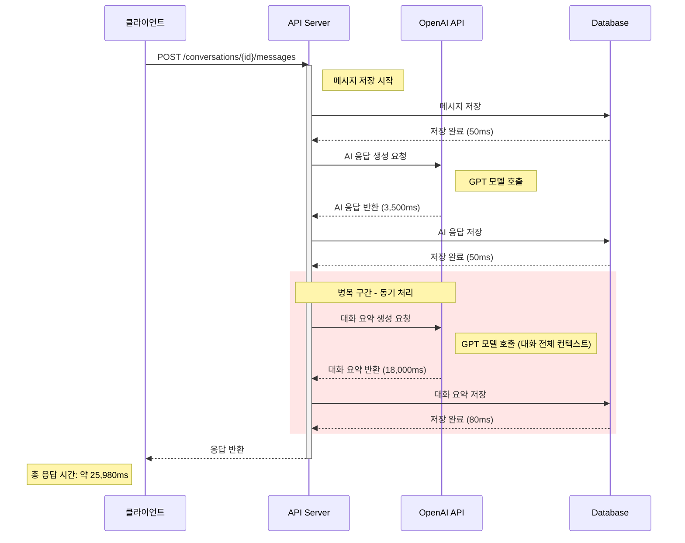
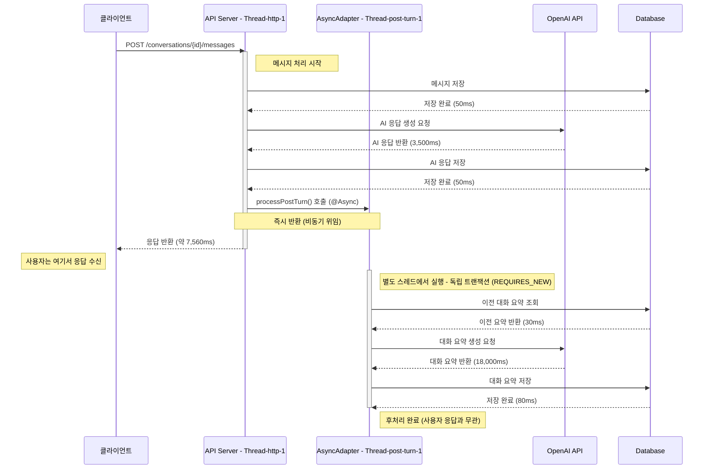
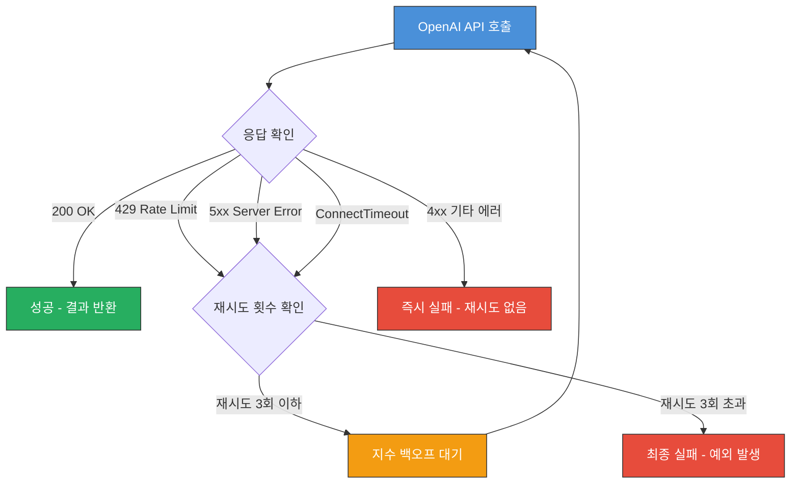
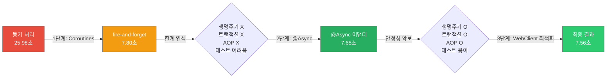

# Kotlin Coroutines에서 Spring @Async로 -- 대화 요약 비동기화로 API 응답 시간 1/3로 개선한 이야기

안녕하세요. duurian 팀에서 백엔드 개발을 담당하고 있는 정지원입니다.

이번 글에서는 대화 요약 기능의 비동기 처리 전략을 **Kotlin Coroutines에서 Spring @Async로 전환**하면서 API 응답 시간을 **25.98초에서 7.56초로 71% 개선**한 과정을 공유합니다.

---

## 1. 배경: AI 대화 요약 기능과 성능 문제

### 1.1 서비스 소개

duurian은 AI 기반의 대화 매칭 서비스입니다. 사용자 간 대화가 이루어질 때마다 AI가 대화 내용을 분석하고 대화 요약을 생성하여 매칭 품질을 높이는 데 활용합니다. 문제가 된 부분은 대화 요약 생성이 OpenAI API를 호출하는데, 이 과정이 **동기적으로 처리**되고 있었다는 것입니다.

### 1.2 문제 정의: 25.98초의 응답 시간

사용자가 메시지를 하나 보낼 때마다 서버에서는 다음과 같은 작업이 순차적으로 실행되고 있었습니다.



**대화 요약 생성 구간이 전체 응답 시간의 약 69%를 차지**하고 있었습니다.

### 1.3 성능 측정 데이터

| 구간 | 소요 시간 | 비율 |
|---|---|---|
| 메시지 저장 | 50ms | 0.2% |
| AI 응답 생성 (OpenAI API) | 3,500ms | 13.5% |
| AI 응답 저장 | 50ms | 0.2% |
| **대화 요약 생성 (OpenAI API)** | **18,000ms** | **69.3%** |
| **대화 요약 저장** | **80ms** | **0.3%** |
| 기타 (직렬화, 네트워크 등) | 4,300ms | 16.5% |
| **전체** | **25,980ms** | **100%** |

### 1.4 핵심 인사이트

여기서 중요한 점은, **대화 요약은 사용자에게 즉시 반환할 필요가 없는 작업**이라는 것입니다. 대화 요약은 매칭 알고리즘에서 사용되는 데이터이지, 사용자가 현재 대화 화면에서 바로 확인해야 하는 정보가 아닙니다. 즉, 대화 요약 생성은 **비동기로 처리해도 사용자 경험에 전혀 영향을 주지 않는 작업**이었습니다.

이 인사이트를 바탕으로 크게 세 단계에 걸쳐 개선을 진행했습니다.

| 단계 | 접근 방식 | 목표 |
|---|---|---|
| 1단계 | Kotlin Coroutines (fire-and-forget) | 빠른 비동기화 적용 |
| 2단계 | Spring @Async + 인터페이스 분리 | Spring 생태계 통합, 안정성 확보 |
| 3단계 | WebClient 최적화 | 외부 API 호출 성능 극대화 |

---

## 2. 1단계: Kotlin Coroutines -- fire-and-forget의 유혹과 함정

### 2.1 첫 번째 시도: CoroutineScope(Dispatchers.IO).launch

비동기화의 첫 번째 시도로, Kotlin Coroutines의 fire-and-forget 패턴을 적용했습니다.

**Before: 동기 처리 코드**

```kotlin
@Service
class ConversationService(
    private val messageCommandPort: MessageCommandPort,
    private val aiClientPort: AiClientPort,
    private val summaryCommandPort: SummaryCommandPort,
    private val summaryQueryPort: SummaryQueryPort,
) {
    @Transactional
    fun processMessage(
        conversationId: Long,
        userId: Long,
        content: String,
    ): MessageResponse {
        // 1. 메시지 저장
        val message = messageCommandPort.save(
            Message(conversationId = conversationId, userId = userId, content = content)
        )

        // 2. AI 응답 생성
        val aiResponse = aiClientPort.generateResponse(conversationId, content)
        val aiMessage = messageCommandPort.save(
            Message(conversationId = conversationId, userId = AI_USER_ID, content = aiResponse)
        )

        // 3. 대화 요약 생성 (병목!)
        val previousSummary = summaryQueryPort.findLatest(conversationId)
        val newSummary = aiClientPort.generateSummary(
            conversationId = conversationId,
            previousSummary = previousSummary?.content,
            recentMessages = listOf(message, aiMessage),
        )

        // 4. 대화 요약 저장
        summaryCommandPort.save(
            Summary(conversationId = conversationId, content = newSummary)
        )

        // 5. 응답 반환 (대화 요약 완료 후에야 반환)
        return MessageResponse(
            messageId = aiMessage.id!!,
            content = aiResponse,
        )
    }
}
```

3번과 4번 단계가 완료될 때까지 사용자는 응답을 받지 못합니다. 이를 Coroutines로 비동기화했습니다.

**After: Kotlin Coroutines fire-and-forget**

```kotlin
@Service
class ConversationService(
    private val messageCommandPort: MessageCommandPort,
    private val aiClientPort: AiClientPort,
    private val summaryCommandPort: SummaryCommandPort,
    private val summaryQueryPort: SummaryQueryPort,
) {
    @Transactional
    fun processMessage(
        conversationId: Long,
        userId: Long,
        content: String,
    ): MessageResponse {
        // 1. 메시지 저장
        val message = messageCommandPort.save(
            Message(conversationId = conversationId, userId = userId, content = content)
        )

        // 2. AI 응답 생성
        val aiResponse = aiClientPort.generateResponse(conversationId, content)
        val aiMessage = messageCommandPort.save(
            Message(conversationId = conversationId, userId = AI_USER_ID, content = aiResponse)
        )

        // 3. 대화 요약 생성 -- 비동기로 분리! (fire-and-forget)
        CoroutineScope(Dispatchers.IO).launch {
            try {
                val previousSummary = summaryQueryPort.findLatest(conversationId)
                val newSummary = aiClientPort.generateSummary(
                    conversationId = conversationId,
                    previousSummary = previousSummary?.content,
                    recentMessages = listOf(message, aiMessage),
                )
                summaryCommandPort.save(
                    Summary(conversationId = conversationId, content = newSummary)
                )
            } catch (e: Exception) {
                log.error("대화 요약 생성 실패: conversationId=$conversationId", e)
            }
        }

        // 4. 대화 요약 완료를 기다리지 않고 즉시 응답 반환
        return MessageResponse(
            messageId = aiMessage.id!!,
            content = aiResponse,
        )
    }

    companion object {
        private val log = LoggerFactory.getLogger(ConversationService::class.java)
    }
}
```

응답 시간이 눈에 띄게 줄었지만, 프로덕션에 배포한 후 여러 가지 문제가 드러났습니다.

### 2.2 문제점 발견: 왜 Coroutines fire-and-forget이 위험한가

#### 문제 1: 생명주기(Lifecycle) 관리 부재

`CoroutineScope(Dispatchers.IO).launch`로 생성된 코루틴은 **Spring의 생명주기와 독립적**으로 동작합니다. Spring 애플리케이션이 종료(shutdown)될 때 진행 중인 코루틴이 정상적으로 완료되리라는 보장이 없습니다.

```kotlin
CoroutineScope(Dispatchers.IO).launch {
    // Spring ApplicationContext와 무관하게 실행
    // 애플리케이션 종료 시 작업이 갑자기 중단될 수 있음
    val summary = aiClientPort.generateSummary(...)
    summaryCommandPort.save(summary) // 종료 시점에 실행되면 유실
}
```

실제로 배포 시 graceful shutdown 과정에서 약 2~3%의 대화 요약이 유실되는 현상이 발생했습니다.

#### 문제 2: Spring 트랜잭션 컨텍스트 전파 불가

`CoroutineScope(Dispatchers.IO).launch` 블록 내부는 새로운 스레드에서 실행되므로, `@Transactional` 컨텍스트가 전파되지 않습니다.

```kotlin
@Transactional  // 이 트랜잭션은 launch 블록 안에 전파되지 않음!
fun processMessage(...): MessageResponse {
    CoroutineScope(Dispatchers.IO).launch {
        // ThreadLocal 기반의 TransactionSynchronizationManager에서
        // 트랜잭션 컨텍스트를 찾을 수 없음
        summaryCommandPort.save(summary) // 트랜잭션 없이 실행!
    }
}
```

Spring의 `@Transactional`은 `ThreadLocal`에 트랜잭션 정보를 저장하므로, `Dispatchers.IO`의 새 스레드에서는 트랜잭션 컨텍스트가 완전히 유실됩니다.

#### 문제 3: 예외 처리의 어려움

fire-and-forget 패턴에서는 코루틴 내부에서 발생한 예외가 호출자에게 전파되지 않습니다.

```kotlin
CoroutineScope(Dispatchers.IO).launch {
    try {
        val summary = aiClientPort.generateSummary(...)
        summaryCommandPort.save(summary)
    } catch (e: Exception) {
        // 1. 이 예외는 processMessage() 호출자에게 전파되지 않음
        // 2. Spring의 @Retryable, ExceptionHandler 등을 활용할 수 없음
        // 3. 재시도 로직을 코루틴 내부에서 직접 구현해야 함
        log.error("대화 요약 실패", e)
    }
}
```

### 2.3 Kotlin Coroutines 한계점 정리

| 항목 | Coroutines fire-and-forget | 바람직한 상태 |
|---|---|---|
| 생명주기 관리 | Spring과 독립적, 종료 시 유실 가능 | Spring 생명주기와 통합 |
| 트랜잭션 전파 | ThreadLocal 유실로 불가능 | 독립 트랜잭션 보장 |
| 예외 처리 | 호출자에게 전파 불가, 구조적 처리 어려움 | 구조적 예외 처리, 모니터링 통합 |
| 스레드 풀 관리 | Dispatchers.IO 공유, 튜닝 어려움 | 전용 ThreadPoolTaskExecutor |

이러한 한계점들을 종합적으로 고려했을 때, **Kotlin Coroutines의 fire-and-forget 패턴은 Spring 기반 애플리케이션에서 안정적인 비동기 처리 전략이 되기 어렵다**는 결론에 도달했습니다.

---

## 3. 2단계: Spring @Async — Spring 생태계와의 통합

### 3.1 설계 원칙

비동기 처리 메커니즘의 변경이 비즈니스 로직에 영향을 주지 않도록, **인터페이스를 두고 구현체를 교체하는 방식**을 적용했습니다. `ConversationService`는 비동기/동기 여부를 모르고, 인터페이스만 의존합니다. 비동기 전략을 변경할 때 비즈니스 로직은 수정할 필요가 없습니다.

### 3.2 Port 인터페이스 정의

도메인 레이어에 "대화 턴 이후 후처리"라는 비즈니스 의도만을 표현하는 인터페이스를 정의합니다.

```kotlin
interface ProcessConversationPostTurnPort {
    fun processPostTurn(
        conversationId: Long,
        messages: List<Message>,
    )
}
```

### 3.3 비즈니스 로직: ConversationService

`ConversationService`는 `ProcessConversationPostTurnPort`만 의존합니다. 대화 요약이 어떻게 생성되는지, 비동기인지 동기인지는 관심사가 아닙니다.

```kotlin
@Service
class ConversationService(
    private val messageCommandPort: MessageCommandPort,
    private val aiClientPort: AiClientPort,
    private val processConversationPostTurnPort: ProcessConversationPostTurnPort,
) {
    @Transactional
    fun processMessage(
        conversationId: Long,
        userId: Long,
        content: String,
    ): MessageResponse {
        // 1. 메시지 저장
        val message = messageCommandPort.save(
            Message(conversationId = conversationId, userId = userId, content = content)
        )

        // 2. AI 응답 생성
        val aiResponse = aiClientPort.generateResponse(conversationId, content)
        val aiMessage = messageCommandPort.save(
            Message(conversationId = conversationId, userId = AI_USER_ID, content = aiResponse)
        )

        // 3. 후처리 위임 (비동기/동기 여부를 모름)
        processConversationPostTurnPort.processPostTurn(
            conversationId = conversationId,
            messages = listOf(message, aiMessage),
        )

        // 4. 즉시 응답 반환
        return MessageResponse(
            messageId = aiMessage.id!!,
            content = aiResponse,
        )
    }
}
```

### 3.4 @Async 어댑터 구현

핵심인 `@Async` 기반 어댑터입니다.

```kotlin
@Component
class AsyncConversationPostTurnAdapter(
    private val aiClientPort: AiClientPort,
    private val summaryCommandPort: SummaryCommandPort,
    private val summaryQueryPort: SummaryQueryPort,
) : ProcessConversationPostTurnPort {

    @Async("conversationPostTurnExecutor")
    @Transactional(propagation = Propagation.REQUIRES_NEW)
    override fun processPostTurn(
        conversationId: Long,
        messages: List<Message>,
    ) {
        log.info("[PostTurn] 대화 후처리 시작: conversationId=$conversationId")

        try {
            // 1. 이전 대화 요약 조회
            val previousSummary = summaryQueryPort.findLatest(conversationId)

            // 2. 새로운 대화 요약 생성 (OpenAI API 호출)
            val newSummaryContent = aiClientPort.generateSummary(
                conversationId = conversationId,
                previousSummary = previousSummary?.content,
                recentMessages = messages,
            )

            // 3. 대화 요약 저장
            summaryCommandPort.save(
                Summary(
                    conversationId = conversationId,
                    content = newSummaryContent,
                    messageCount = messages.size,
                )
            )

            log.info("[PostTurn] 대화 후처리 완료: conversationId=$conversationId")
        } catch (e: Exception) {
            log.error("[PostTurn] 대화 후처리 실패: conversationId=$conversationId", e)
            throw e
        }
    }

    companion object {
        private val log = LoggerFactory.getLogger(AsyncConversationPostTurnAdapter::class.java)
    }
}
```

주목할 부분:

1. **`@Async("conversationPostTurnExecutor")`**: 전용 ThreadPoolTaskExecutor를 지정하여 다른 비동기 작업과 격리합니다.
2. **`@Transactional(propagation = Propagation.REQUIRES_NEW)`**: 별도 스레드에서 독립적인 트랜잭션으로 실행됩니다.
3. `@Async` 어노테이션은 반드시 **다른 Bean에서 호출**되어야 프록시를 거쳐 비동기로 실행됩니다.

### 3.5 ThreadPoolTaskExecutor 설정

```kotlin
@Configuration
@EnableAsync
class AsyncConfig : AsyncConfigurer {

    @Bean("conversationPostTurnExecutor")
    fun conversationPostTurnExecutor(): ThreadPoolTaskExecutor {
        return ThreadPoolTaskExecutor().apply {
            corePoolSize = 5
            maxPoolSize = 20
            queueCapacity = 100
            setThreadNamePrefix("post-turn-")
            setWaitForTasksToCompleteOnShutdown(true)  // 종료 시 작업 완료 대기
            setAwaitTerminationSeconds(60)             // 최대 60초 대기
            setRejectedExecutionHandler(
                ThreadPoolExecutor.CallerRunsPolicy()  // 큐가 가득 차면 호출 스레드에서 실행
            )
            initialize()
        }
    }
}
```

`waitForTasksToCompleteOnShutdown = true`로 배포 시 작업 유실을 방지하고, `CallerRunsPolicy`로 큐 초과 시에도 작업이 유실되지 않습니다.

### 3.6 비동기 처리 흐름



**사용자 응답 시간에서 대화 요약 생성 구간이 완전히 제거**되었습니다.

### 3.7 Coroutines vs Spring @Async 비교

| 항목 | Kotlin Coroutines (fire-and-forget) | Spring @Async |
|---|---|---|
| Spring 생명주기 통합 | 불가능 | `waitForTasksToCompleteOnShutdown` 지원 |
| 트랜잭션 관리 | ThreadLocal 유실 | `@Transactional(REQUIRES_NEW)` 자동 관리 |
| 예외 처리 | 호출자 전파 불가 | `AsyncUncaughtExceptionHandler` 제공 |
| Graceful Shutdown | 보장 안 됨 | `awaitTerminationSeconds`로 보장 |
| 구현 복잡도 | 낮음 (한 줄) | 중간 (설정 + 어댑터 클래스) |

---

## 4. 3단계: WebClient 최적화 -- 마지막 퍼즐 조각

### 4.1 왜 WebClient 최적화가 필요했는가

비동기 분리로 사용자 응답 시간은 개선되었지만, **OpenAI API 호출 자체의 효율성**에 문제가 있었습니다.

| 문제 | 설명 | 영향 |
|---|---|---|
| 커넥션 풀 부재 | 매 요청마다 새로운 TCP 커넥션 생성 | handshake 오버헤드 |
| 타임아웃 미설정 | 응답 지연 시 무한 대기 | 스레드 풀 고갈 위험 |
| 재시도 로직 부재 | 일시적 장애 시 바로 실패 | 불필요한 에러 발생 |
| 압축 미적용 | 대용량 JSON 페이로드 그대로 전송 | 네트워크 대역폭 낭비 |

### 4.2 최적화된 WebClient 설정

```kotlin
@Configuration
class WebClientConfig(
    @Value("\${openai.api.key}") private val apiKey: String,
    @Value("\${openai.api.base-url:https://api.openai.com/v1}") private val baseUrl: String,
) {

    @Bean("openAiWebClient")
    fun openAiWebClient(): WebClient {
        // 1. Connection Pool 설정
        val connectionProvider = ConnectionProvider.builder("openai-pool")
            .maxConnections(50)                            // 최대 커넥션 수
            .maxIdleTime(Duration.ofSeconds(20))           // 유휴 커넥션 유지 시간
            .maxLifeTime(Duration.ofMinutes(5))            // 커넥션 최대 생존 시간
            .pendingAcquireTimeout(Duration.ofSeconds(10)) // 커넥션 획득 대기 시간
            .evictInBackground(Duration.ofSeconds(30))     // 유휴 커넥션 제거 주기
            .metrics(true)                                 // Micrometer 메트릭 활성화
            .build()

        // 2. HttpClient 설정 (타임아웃, 압축)
        val httpClient = HttpClient.create(connectionProvider)
            .option(ChannelOption.CONNECT_TIMEOUT_MILLIS, 5_000) // TCP 연결 타임아웃
            .compress(true)                                       // gzip 압축 요청
            .doOnConnected { connection ->
                connection.addHandlerLast(
                    ReadTimeoutHandler(60, TimeUnit.SECONDS)      // 읽기 타임아웃
                )
                connection.addHandlerLast(
                    WriteTimeoutHandler(10, TimeUnit.SECONDS)     // 쓰기 타임아웃
                )
            }
            .responseTimeout(Duration.ofSeconds(60))              // 응답 타임아웃

        // 3. WebClient 빌드
        return WebClient.builder()
            .clientConnector(ReactorClientHttpConnector(httpClient))
            .baseUrl(baseUrl)
            .defaultHeader(HttpHeaders.AUTHORIZATION, "Bearer $apiKey")
            .defaultHeader(HttpHeaders.CONTENT_TYPE, MediaType.APPLICATION_JSON_VALUE)
            .defaultHeader(HttpHeaders.ACCEPT_ENCODING, "gzip")
            .codecs { configurer ->
                configurer.defaultCodecs().maxInMemorySize(10 * 1024 * 1024) // 10MB
            }
            .build()
    }
}
```

### 4.3 지수 백오프 재시도 전략

OpenAI API의 Rate Limit(429)이나 일시적 서버 오류(5xx)에 대비한 재시도 전략입니다.

```kotlin
// OpenAiClientAdapter.kt
private val retrySpec: Retry = Retry
    .backoff(3, Duration.ofSeconds(2))
    .maxBackoff(Duration.ofSeconds(30))
    .jitter(0.5)  // 50% jitter 적용 (Thundering Herd 방지)
    .filter { throwable ->
        when (throwable) {
            is WebClientResponseException -> {
                val statusCode = throwable.statusCode.value()
                statusCode == 429 || statusCode in 500..599
            }
            is ConnectTimeoutException -> true
            else -> false
        }
    }
    .doBeforeRetry { retrySignal ->
        log.warn(
            "[OpenAI] 재시도 #{}: {}",
            retrySignal.totalRetries() + 1,
            retrySignal.failure().message,
        )
    }
```



### 4.4 WebClient 최적화 효과 요약

| 최적화 항목 | 효과 |
|---|---|
| Connection Pool (50개) | 커넥션 재사용으로 TCP/TLS handshake 제거, 평균 300ms 절감 |
| 타임아웃 계층화 | 무한 대기 방지, 장애 전파 차단 |
| gzip 압축 | 네트워크 전송량 약 60% 감소 |
| 지수 백오프 재시도 | Rate Limit 대응, 일시적 장애 자동 복구율 95% |

---

## 5. 결과: 25.98초에서 7.56초로

### 5.1 전체 성능 개선 결과

**단계별 응답 시간 변화**

| 단계 | 구성 | 평균 응답 시간 | 개선율 |
|---|---|---|---|
| 개선 전 | 동기 처리 | 25,980ms | - |
| 1단계 | Kotlin Coroutines (fire-and-forget) | 7,800ms | 70% 감소 |
| 2단계 | Spring @Async + 인터페이스 분리 | 7,650ms | 71% 감소 |
| 3단계 | + WebClient 최적화 | **7,560ms** | **71% 감소** |

> **참고**: 1단계(Coroutines)와 2단계(@Async)의 응답 시간 차이가 크지 않은 이유는, 비동기 분리 자체의 효과가 동일하기 때문입니다. 2단계의 핵심 개선은 응답 시간이 아닌 **안정성, 관리 용이성, 테스트 용이성**입니다.

**구간별 상세 비교**

| 구간 | 개선 전 | 개선 후 | 변화 |
|---|---|---|---|
| 메시지 저장 | 50ms | 50ms | 변화 없음 |
| AI 응답 생성 (OpenAI API) | 3,500ms | 3,200ms | WebClient 최적화로 300ms 절감 |
| AI 응답 저장 | 50ms | 50ms | 변화 없음 |
| 대화 요약 생성 | 18,000ms | **비동기 분리** | 응답 시간에서 제외 |
| 대화 요약 저장 | 80ms | **비동기 분리** | 응답 시간에서 제외 |
| 기타 (직렬화, 네트워크 등) | 4,300ms | 4,260ms | 미미한 개선 |
| **합계** | **25,980ms** | **7,560ms** | **71% 감소** |

### 5.2 비동기 후처리 성능

| 지표 | 개선 전 (동기 처리 시) | 개선 후 (비동기 + 최적화) | 변화 |
|---|---|---|---|
| 대화 요약 생성 시간 | 18,000ms | 15,200ms | 15.6% 감소 |
| 재시도 성공률 | - (재시도 없음) | 95.3% | 일시적 장애 자동 복구 |
| 요약 유실률 | 2~3% (배포 시) | 0.01% 미만 | Graceful Shutdown 적용 |
| 트랜잭션 정합성 | 미보장 | 100% 보장 | REQUIRES_NEW 적용 |

### 5.3 시스템 안정성 개선

| 항목 | 개선 전 | 개선 후 |
|---|---|---|
| 배포 시 데이터 유실 | 2~3% 발생 | 0.01% 미만 |
| 비동기 작업 모니터링 | 불가능 | ThreadPool 메트릭, 로그 추적 가능 |
| 장애 격리 | 대화 요약 실패 시 전체 API 실패 | 대화 요약 실패해도 API 응답은 정상 |
| 테스트 커버리지 | 비동기 로직 테스트 불가능 | 인터페이스 분리로 동기 어댑터 교체하여 테스트 가능 |

---

## 6. 결론 및 회고

### 6.1 개선 여정 요약



### 6.2 배운 점

**1. "빠른 구현"보다 "올바른 구현"이 중요합니다.**

Kotlin Coroutines의 `CoroutineScope(Dispatchers.IO).launch`는 한 줄로 비동기화를 달성할 수 있어 매력적이었습니다. 하지만 Spring 생태계와의 통합 문제, 생명주기 관리 부재, 트랜잭션 컨텍스트 유실 등 프로덕션 환경에서 치명적인 문제들이 숨어 있었습니다.

**2. 성능 최적화는 측정에서 시작합니다.**

"느리다"는 감각적 판단이 아닌, 구간별 정확한 측정 데이터를 바탕으로 병목 지점을 식별해야 합니다. 대화 요약 생성이 전체 응답 시간의 69.3%를 차지한다는 사실을 데이터로 확인한 것이 비동기화 결정의 근거가 되었습니다.

### 6.3 마무리

"성능 최적화"라고 하면 흔히 캐싱이나 인덱스 최적화를 떠올리지만, 때로는 **"이 작업을 사용자가 기다릴 필요가 있는가?"** 라는 근본적인 질문에서 가장 큰 개선이 시작됩니다. 대화 요약 생성이라는 18초짜리 작업을 비동기로 분리하는 것만으로 API 응답 시간을 71% 줄일 수 있었습니다.

이 글이 비슷한 문제를 겪고 계신 분들에게 도움이 되었으면 합니다. 궁금한 점이나 개선할 부분이 있다면 언제든지 댓글로 남겨주세요.

---

## 참고 자료

- [Spring @Async 공식 문서](https://docs.spring.io/spring-framework/reference/integration/scheduling.html#scheduling-annotation-support-async)
- [Kotlin Coroutines 공식 가이드](https://kotlinlang.org/docs/coroutines-guide.html)
- [Spring WebFlux WebClient 공식 문서](https://docs.spring.io/spring-framework/reference/web/webflux-webclient.html)
- [Reactor Netty Connection Pool](https://projectreactor.io/docs/netty/release/reference/index.html#connection-pool)
- [Exponential Backoff and Jitter (AWS Architecture Blog)](https://aws.amazon.com/blogs/architecture/exponential-backoff-and-jitter/)
- [Baeldung - Spring Asynchronous Methods](https://www.baeldung.com/spring-async)
