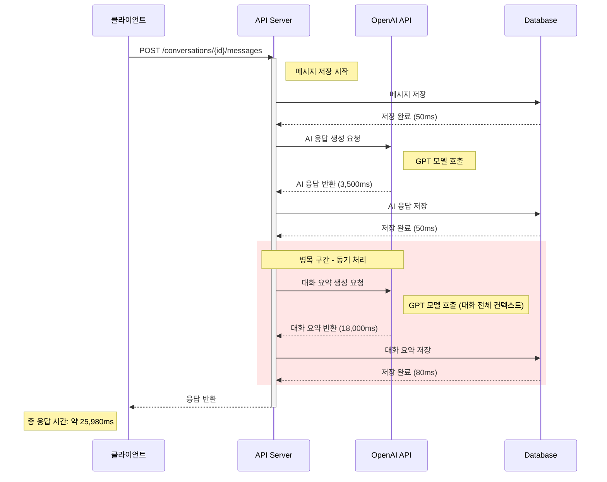
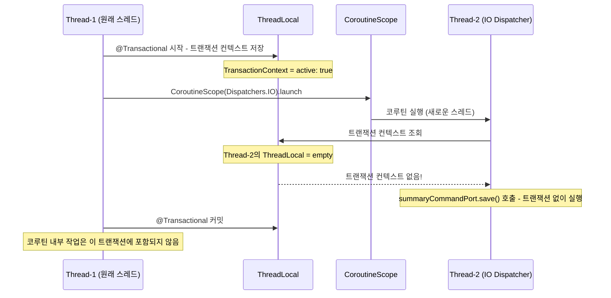
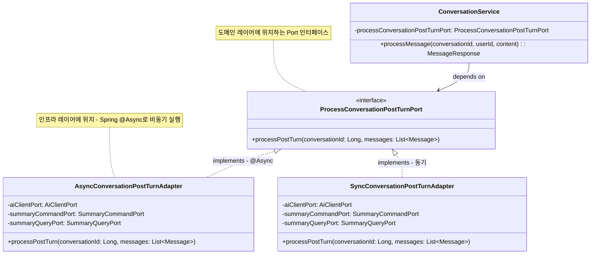
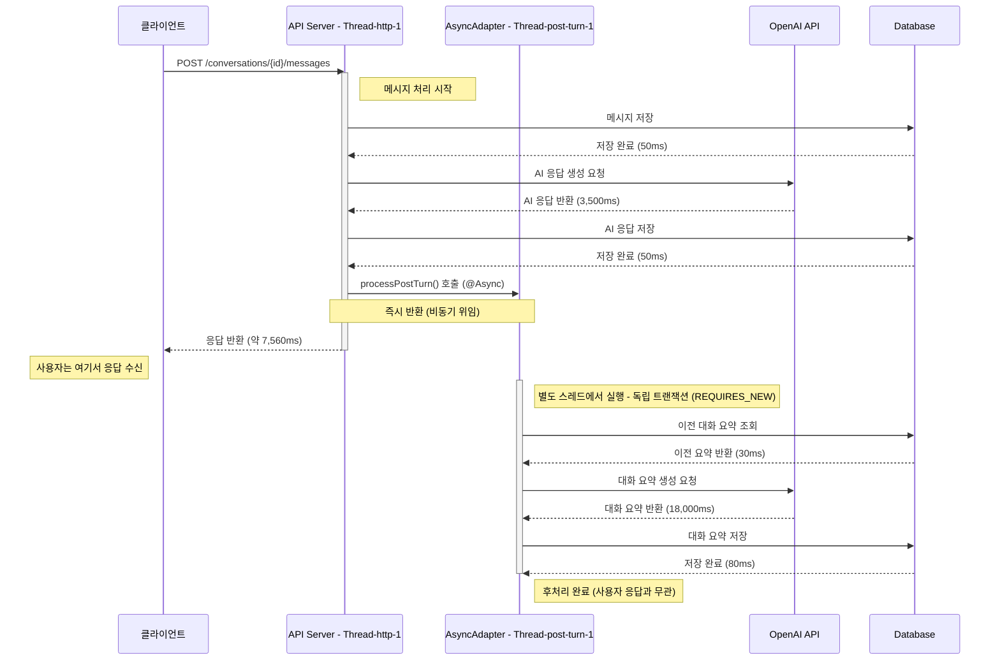
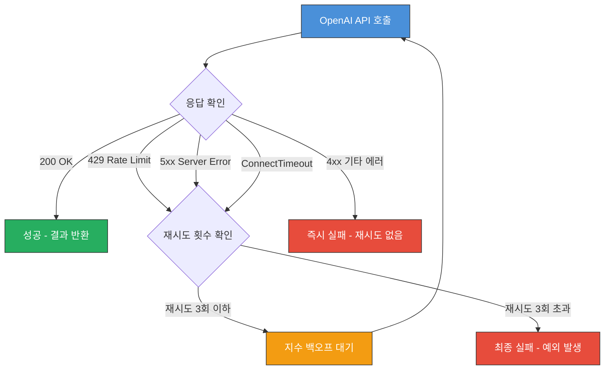
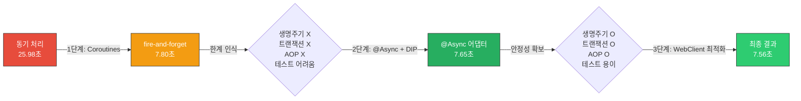

<script src="https://cdn.jsdelivr.net/npm/mermaid@10/dist/mermaid.min.js"></script>
<script>
document.addEventListener('DOMContentLoaded', function() {
  document.querySelectorAll('pre > code.language-mermaid').forEach(function(el) {
    el.parentElement.outerHTML = '<pre class="mermaid">' + el.textContent + '</pre>';
  });
  mermaid.initialize({ startOnLoad: true, theme: 'default', securityLevel: 'loose' });
});
</script>

# Kotlin Coroutines에서 Spring @Async로 -- 대화 요약 비동기화로 API 응답 시간 71% 개선한 이야기

안녕하세요. duurian 팀에서 백엔드 개발을 담당하고 있는 정지원입니다.

이번 글에서는 AI 기반 대화 서비스에서 **대화 요약(Conversation Summary)** 기능의 비동기 처리 전략을 **Kotlin Coroutines에서 Spring @Async로 전환**하면서 API 응답 시간을 **25.98초에서 7.56초로 71% 개선**한 과정을 공유하고자 합니다. 단순한 성능 수치 변화뿐만 아니라, 그 과정에서 마주친 Kotlin Coroutines의 한계, DIP(Dependency Inversion Principle)를 활용한 아키텍처 설계, WebClient 최적화까지 전반적인 개선 여정을 상세히 다루겠습니다.

이 글은 다음과 같은 분들에게 도움이 될 것입니다.

- Kotlin Coroutines의 fire-and-forget 패턴을 사용하고 있지만 Spring 생태계와의 통합에 어려움을 겪고 계신 분
- 동기 처리로 인한 API 응답 지연 문제를 비동기화로 해결하고 싶으신 분
- Spring @Async와 DIP를 결합한 클린 아키텍처 설계에 관심이 있으신 분
- WebClient의 Connection Pool, 타임아웃, 재시도 전략을 실무에 적용하고 싶으신 분

---

## 목차

1. [배경: AI 대화 요약 기능과 성능 문제](#1-배경-ai-대화-요약-기능과-성능-문제)
2. [1단계: Kotlin Coroutines -- fire-and-forget의 유혹과 함정](#2-1단계-kotlin-coroutines----fire-and-forget의-유혹과-함정)
3. [2단계: Spring @Async + DIP -- Spring 생태계와의 완전한 통합](#3-2단계-spring-async--dip----spring-생태계와의-완전한-통합)
4. [3단계: WebClient 최적화 -- 마지막 퍼즐 조각](#4-3단계-webclient-최적화----마지막-퍼즐-조각)
5. [결과: 25.98초에서 7.56초로](#5-결과-2598초에서-756초로)
6. [결론 및 회고](#6-결론-및-회고)

---

## 1. 배경: AI 대화 요약 기능과 성능 문제

### 1.1 서비스 소개

저희 duurian은 AI 기반의 대화 매칭 서비스를 운영하고 있습니다. 사용자 간 대화가 이루어질 때마다 AI가 대화 내용을 분석하고, 대화 요약(Summary)을 생성하여 매칭 품질을 높이는 데 활용합니다. 이 대화 요약 기능은 서비스의 핵심 요소 중 하나로, 매칭 알고리즘의 정확도에 직접적인 영향을 미칩니다.

대화 요약 과정은 크게 다음과 같은 단계로 이루어집니다.

1. 사용자가 메시지를 전송합니다.
2. 서버에서 메시지를 저장하고 AI 응답을 생성합니다.
3. AI 응답과 함께 **대화 요약을 생성**합니다.
4. 요약 결과를 DB에 저장합니다.
5. 최종 응답을 클라이언트에 반환합니다.

여기서 문제가 된 부분은 **3번과 4번 단계**입니다. 대화 요약 생성은 OpenAI API를 호출하여 처리하는데, 이 과정이 상당한 시간을 소요합니다. 그리고 이 모든 과정이 **동기적(Synchronous)**으로 처리되고 있었습니다.

### 1.2 문제 정의: 25.98초의 응답 시간

사용자가 메시지를 하나 보낼 때마다 서버에서는 다음과 같은 작업이 순차적으로 실행되고 있었습니다.



위 시퀀스 다이어그램에서 볼 수 있듯이, **대화 요약 생성 구간이 전체 응답 시간의 약 69%를 차지**하고 있었습니다. 사용자는 메시지를 보낸 후 약 26초 동안 응답을 기다려야 했습니다. 이는 사용자 경험에 치명적인 문제였습니다.

### 1.3 성능 측정 데이터

실제 프로덕션 환경에서 측정한 데이터는 다음과 같았습니다.

| 구간 | 소요 시간 | 비율 |
|---|---|---|
| 메시지 저장 | 50ms | 0.2% |
| AI 응답 생성 (OpenAI API) | 3,500ms | 13.5% |
| AI 응답 저장 | 50ms | 0.2% |
| **대화 요약 생성 (OpenAI API)** | **18,000ms** | **69.3%** |
| **대화 요약 저장** | **80ms** | **0.3%** |
| 기타 (직렬화, 네트워크 등) | 4,300ms | 16.5% |
| **전체** | **25,980ms** | **100%** |

### 1.4 핵심 인사이트

여기서 중요한 점은, **대화 요약은 사용자에게 즉시 반환할 필요가 없는 작업**이라는 것입니다. 대화 요약은 매칭 알고리즘에서 사용되는 데이터이지, 사용자가 현재 대화 화면에서 바로 확인해야 하는 정보가 아닙니다. 즉, 대화 요약 생성은 **비동기로 처리해도 사용자 경험에 전혀 영향을 주지 않는 작업**이었습니다.

이 인사이트를 바탕으로 비동기화 전략을 수립했고, 크게 세 단계에 걸쳐 개선을 진행했습니다.

| 단계 | 접근 방식 | 목표 |
|---|---|---|
| 1단계 | Kotlin Coroutines (fire-and-forget) | 빠른 비동기화 적용 |
| 2단계 | Spring @Async + DIP | Spring 생태계 통합, 안정성 확보 |
| 3단계 | WebClient 최적화 | 외부 API 호출 성능 극대화 |

각 단계별로 어떤 문제를 해결했고, 어떤 트레이드오프가 있었는지 상세히 살펴보겠습니다.

---

## 2. 1단계: Kotlin Coroutines -- fire-and-forget의 유혹과 함정

### 2.1 첫 번째 시도: CoroutineScope(Dispatchers.IO).launch

비동기화의 첫 번째 시도로, Kotlin Coroutines의 `CoroutineScope(Dispatchers.IO).launch`를 사용한 fire-and-forget 패턴을 적용했습니다. 구현이 단순하고 Kotlin 생태계에서 자연스럽게 사용할 수 있다는 점이 매력적이었습니다.

기존의 동기 처리 코드를 먼저 살펴보겠습니다.

**Before: 동기 처리 코드**

```kotlin
@Service
class ConversationService(
    private val messageCommandPort: MessageCommandPort,
    private val aiClientPort: AiClientPort,
    private val summaryCommandPort: SummaryCommandPort,
    private val summaryQueryPort: SummaryQueryPort,
) {
    @Transactional
    fun processMessage(
        conversationId: Long,
        userId: Long,
        content: String,
    ): MessageResponse {
        // 1. 메시지 저장
        val message = messageCommandPort.save(
            Message(conversationId = conversationId, userId = userId, content = content)
        )

        // 2. AI 응답 생성
        val aiResponse = aiClientPort.generateResponse(conversationId, content)
        val aiMessage = messageCommandPort.save(
            Message(conversationId = conversationId, userId = AI_USER_ID, content = aiResponse)
        )

        // 3. 대화 요약 생성 (병목!)
        val previousSummary = summaryQueryPort.findLatest(conversationId)
        val newSummary = aiClientPort.generateSummary(
            conversationId = conversationId,
            previousSummary = previousSummary?.content,
            recentMessages = listOf(message, aiMessage),
        )

        // 4. 대화 요약 저장
        summaryCommandPort.save(
            Summary(conversationId = conversationId, content = newSummary)
        )

        // 5. 응답 반환 (대화 요약 완료 후에야 반환)
        return MessageResponse(
            messageId = aiMessage.id!!,
            content = aiResponse,
        )
    }
}
```

이 코드의 문제는 명확합니다. 3번과 4번 단계가 완료될 때까지 사용자는 응답을 받지 못합니다. 이를 Coroutines로 비동기화한 코드는 다음과 같습니다.

**After: Kotlin Coroutines fire-and-forget**

```kotlin
@Service
class ConversationService(
    private val messageCommandPort: MessageCommandPort,
    private val aiClientPort: AiClientPort,
    private val summaryCommandPort: SummaryCommandPort,
    private val summaryQueryPort: SummaryQueryPort,
) {
    @Transactional
    fun processMessage(
        conversationId: Long,
        userId: Long,
        content: String,
    ): MessageResponse {
        // 1. 메시지 저장
        val message = messageCommandPort.save(
            Message(conversationId = conversationId, userId = userId, content = content)
        )

        // 2. AI 응답 생성
        val aiResponse = aiClientPort.generateResponse(conversationId, content)
        val aiMessage = messageCommandPort.save(
            Message(conversationId = conversationId, userId = AI_USER_ID, content = aiResponse)
        )

        // 3. 대화 요약 생성 -- 비동기로 분리! (fire-and-forget)
        CoroutineScope(Dispatchers.IO).launch {
            try {
                val previousSummary = summaryQueryPort.findLatest(conversationId)
                val newSummary = aiClientPort.generateSummary(
                    conversationId = conversationId,
                    previousSummary = previousSummary?.content,
                    recentMessages = listOf(message, aiMessage),
                )
                summaryCommandPort.save(
                    Summary(conversationId = conversationId, content = newSummary)
                )
            } catch (e: Exception) {
                // 로깅만 하고 넘어감
                log.error("대화 요약 생성 실패: conversationId=$conversationId", e)
            }
        }

        // 4. 대화 요약 완료를 기다리지 않고 즉시 응답 반환
        return MessageResponse(
            messageId = aiMessage.id!!,
            content = aiResponse,
        )
    }

    companion object {
        private val log = LoggerFactory.getLogger(ConversationService::class.java)
    }
}
```

단 한 줄의 `CoroutineScope(Dispatchers.IO).launch`로 대화 요약 생성을 비동기로 분리했고, 응답 시간이 눈에 띄게 줄었습니다. 하지만 프로덕션에 배포한 후, 여러 가지 문제가 드러나기 시작했습니다.

### 2.2 문제점 발견: 왜 Coroutines fire-and-forget이 위험한가

#### 문제 1: 생명주기(Lifecycle) 관리 부재

`CoroutineScope(Dispatchers.IO).launch`로 생성된 코루틴은 **Spring의 생명주기와 독립적**으로 동작합니다. 이는 다음과 같은 심각한 문제를 야기합니다.

```kotlin
// 문제가 되는 코드
CoroutineScope(Dispatchers.IO).launch {
    // 이 코루틴은 Spring ApplicationContext와 무관하게 실행됨
    // 애플리케이션이 종료되어도 즉시 취소되지 않음
    // 또는 작업이 진행 중인데 갑자기 종료될 수 있음
    val summary = aiClientPort.generateSummary(...)
    summaryCommandPort.save(summary) // 애플리케이션 종료 시점에 실행되면?
}
```

Spring 애플리케이션이 종료(shutdown)될 때, 진행 중인 코루틴이 정상적으로 완료되거나 취소되리라는 보장이 없습니다. 이로 인해 대화 요약이 생성되었지만 저장되지 않는 데이터 유실 문제가 간헐적으로 발생했습니다.

> **실제 장애 사례**: 배포 시 graceful shutdown 과정에서 약 2~3%의 대화 요약이 유실되는 현상이 발생했습니다. 코루틴이 OpenAI API 호출을 완료하고 DB 저장을 시도하는 시점에 애플리케이션이 종료되면서 발생한 문제였습니다.

#### 문제 2: Spring 트랜잭션 컨텍스트 전파 불가

이 문제는 이전 블로그 글 "[Kotlin/Spring] suspend 함수와 @Transactional의 위험한 조합"에서도 다룬 내용입니다. `CoroutineScope(Dispatchers.IO).launch` 블록 내부는 새로운 스레드에서 실행되므로, 외부 메서드의 `@Transactional` 컨텍스트가 전파되지 않습니다.

```kotlin
@Transactional  // 이 트랜잭션은 launch 블록 안에 전파되지 않음!
fun processMessage(...): MessageResponse {
    // ... (트랜잭션 컨텍스트 존재)

    CoroutineScope(Dispatchers.IO).launch {
        // 이 블록은 별도의 스레드에서 실행
        // ThreadLocal 기반의 TransactionSynchronizationManager에서
        // 트랜잭션 컨텍스트를 찾을 수 없음
        summaryCommandPort.save(summary) // 트랜잭션 없이 실행!
    }
}
```

Spring의 `@Transactional`은 `TransactionSynchronizationManager`를 통해 `ThreadLocal`에 트랜잭션 정보를 저장합니다. 코루틴이 `Dispatchers.IO`의 스레드 풀에서 실행되면, 원래 스레드의 `ThreadLocal`에 접근할 수 없으므로 트랜잭션 컨텍스트가 완전히 유실됩니다.



#### 문제 3: Spring AOP 프록시 동작 불가

Spring의 AOP 기반 기능들(`@Transactional`, `@Cacheable`, `@Retryable` 등)은 CGLIB 또는 JDK Dynamic Proxy를 통해 동작합니다. 코루틴 내부에서 호출되는 Spring Bean의 메서드도 프록시를 통해 호출되지만, **프록시가 의존하는 ThreadLocal 기반의 컨텍스트가 유실**되므로 AOP 어드바이스가 정상적으로 동작하지 않는 경우가 발생합니다.

```kotlin
CoroutineScope(Dispatchers.IO).launch {
    // AOP 기반 어노테이션들이 제대로 동작하지 않을 수 있음
    summaryService.saveSummary(summary)  // @Transactional 무시될 수 있음
    cacheService.getSomething(key)        // @Cacheable 동작 불확실
    retryableService.callExternalApi()    // @Retryable 동작 불확실
}
```

#### 문제 4: 예외 처리의 어려움

fire-and-forget 패턴에서는 코루틴 내부에서 발생한 예외가 호출자에게 전파되지 않습니다. `try-catch`로 감싸더라도, 예외를 구조적으로 처리하기 어렵습니다.

```kotlin
CoroutineScope(Dispatchers.IO).launch {
    try {
        val summary = aiClientPort.generateSummary(...)
        summaryCommandPort.save(summary)
    } catch (e: Exception) {
        // 1. 이 예외는 processMessage() 호출자에게 전파되지 않음
        // 2. 재시도 로직을 구현하려면 코루틴 내부에서 직접 처리해야 함
        // 3. Spring의 @Retryable, ExceptionHandler 등을 활용할 수 없음
        // 4. 모니터링 시스템과 통합하기 어려움
        log.error("대화 요약 실패", e)
        // 실패 시 어떻게 해야 하지? 재시도? DLQ?
    }
}
```

#### 문제 5: 테스트의 어려움

코루틴의 비동기 실행 때문에 단위 테스트에서 대화 요약이 정상적으로 생성되었는지 검증하기가 매우 어렵습니다.

```kotlin
@Test
fun `메시지 전송 시 대화 요약이 생성되어야 한다`() {
    // given
    val conversationId = 1L

    // when
    conversationService.processMessage(conversationId, userId, "안녕하세요")

    // then
    // 문제: 코루틴이 비동기로 실행되므로 여기서 verify하면 아직 실행 전일 수 있음
    verify(summaryCommandPort).save(any()) // 실패할 수 있음!

    // 해결: Thread.sleep으로 대기? -> 테스트가 느려지고 불안정해짐
    Thread.sleep(5000) // 안티패턴
    verify(summaryCommandPort).save(any())
}
```

### 2.3 Kotlin Coroutines 한계점 종합 비교

| 항목 | Coroutines fire-and-forget | 바람직한 상태 |
|---|---|---|
| 생명주기 관리 | Spring과 독립적, 종료 시 유실 가능 | Spring 생명주기와 통합 |
| 트랜잭션 전파 | ThreadLocal 유실로 불가능 | 자동 전파 또는 독립 트랜잭션 보장 |
| AOP 지원 | ThreadLocal 의존 AOP 동작 불확실 | 완전한 AOP 지원 |
| 예외 처리 | 호출자에게 전파 불가, 구조적 처리 어려움 | 구조적 예외 처리, 모니터링 통합 |
| 재시도 전략 | 직접 구현 필요 | Spring Retry 등 프레임워크 활용 |
| 테스트 용이성 | 비동기 실행으로 검증 어려움 | 동기적 검증 가능 |
| 스레드 풀 관리 | Dispatchers.IO 공유, 튜닝 어려움 | 전용 ThreadPoolTaskExecutor |
| 모니터링/추적 | MDC, TraceId 전파 수동 처리 필요 | Spring 기반 자동 전파 가능 |

이러한 한계점들을 종합적으로 고려했을 때, **Kotlin Coroutines의 fire-and-forget 패턴은 Spring 기반 애플리케이션에서 안정적인 비동기 처리 전략이 되기 어렵다**는 결론에 도달했습니다. Spring 생태계와 완전히 통합된 비동기 처리 방식이 필요했고, 이것이 2단계 개선의 출발점이 되었습니다.

---

## 3. 2단계: Spring @Async + DIP -- Spring 생태계와의 완전한 통합

### 3.1 설계 원칙: 왜 DIP인가

2단계 개선에서 가장 중요하게 고려한 점은 **비동기 처리 메커니즘의 변경이 비즈니스 로직에 영향을 주지 않아야 한다**는 것이었습니다. 이를 위해 DIP(Dependency Inversion Principle, 의존성 역전 원칙)를 적용했습니다.

DIP의 핵심은 다음과 같습니다.

- **상위 모듈(비즈니스 로직)은 하위 모듈(구현체)에 의존하지 않아야 합니다.**
- **둘 다 추상화(인터페이스)에 의존해야 합니다.**

이를 대화 요약 비동기 처리에 적용하면 다음과 같습니다.



이 구조의 장점은 다음과 같습니다.

1. **ConversationService는 비동기/동기 여부를 알지 못합니다.** 단지 `ProcessConversationPostTurnPort` 인터페이스만 알고 있을 뿐입니다.
2. **비동기 전략을 변경하더라도 비즈니스 로직은 수정할 필요가 없습니다.** Adapter만 교체하면 됩니다.
3. **테스트 시 동기 어댑터를 주입하면 됩니다.** 비동기 실행으로 인한 테스트 어려움이 해소됩니다.

### 3.2 Port 인터페이스 정의

먼저 도메인 레이어에 Port 인터페이스를 정의합니다. 이 인터페이스는 "대화 턴(turn) 이후 처리"라는 비즈니스 의도만을 표현하며, 어떻게 실행되는지(비동기/동기)는 전혀 드러내지 않습니다.

```kotlin
package com.duurian.conversation.domain.port.out

/**
 * 대화 턴(turn) 이후 후처리를 담당하는 Output Port.
 *
 * 대화 요약 생성, 감정 분석, 키워드 추출 등
 * 사용자 응답에 포함되지 않지만 비즈니스적으로 필요한 후처리 작업을 수행합니다.
 *
 * 구현체에 따라 동기 또는 비동기로 실행될 수 있으며,
 * 이 인터페이스를 사용하는 쪽에서는 실행 방식을 알 필요가 없습니다.
 */
interface ProcessConversationPostTurnPort {

    /**
     * 대화 턴 이후 후처리를 실행합니다.
     *
     * @param conversationId 대화 ID
     * @param messages 현재 턴에서 생성된 메시지 목록 (사용자 메시지 + AI 응답)
     */
    fun processPostTurn(
        conversationId: Long,
        messages: List<Message>,
    )
}
```

### 3.3 비즈니스 로직 수정: ConversationService

비즈니스 로직을 담당하는 `ConversationService`는 이제 `ProcessConversationPostTurnPort`만 의존합니다. 대화 요약이 어떻게 생성되는지, 비동기인지 동기인지는 전혀 관심사가 아닙니다.

```kotlin
package com.duurian.conversation.domain.service

@Service
class ConversationService(
    private val messageCommandPort: MessageCommandPort,
    private val aiClientPort: AiClientPort,
    private val processConversationPostTurnPort: ProcessConversationPostTurnPort,
) {
    @Transactional
    fun processMessage(
        conversationId: Long,
        userId: Long,
        content: String,
    ): MessageResponse {
        // 1. 메시지 저장
        val message = messageCommandPort.save(
            Message(conversationId = conversationId, userId = userId, content = content)
        )

        // 2. AI 응답 생성
        val aiResponse = aiClientPort.generateResponse(conversationId, content)
        val aiMessage = messageCommandPort.save(
            Message(conversationId = conversationId, userId = AI_USER_ID, content = aiResponse)
        )

        // 3. 후처리 위임 (비동기/동기 여부를 모름)
        processConversationPostTurnPort.processPostTurn(
            conversationId = conversationId,
            messages = listOf(message, aiMessage),
        )

        // 4. 즉시 응답 반환
        return MessageResponse(
            messageId = aiMessage.id!!,
            content = aiResponse,
        )
    }
}
```

이전 코드와 비교했을 때, **대화 요약 관련 로직이 완전히 분리**되었습니다. `ConversationService`는 더 이상 `SummaryCommandPort`, `SummaryQueryPort`, `AiClientPort.generateSummary()`를 직접 호출하지 않습니다. 모든 후처리 로직은 `ProcessConversationPostTurnPort`의 구현체가 담당합니다.

### 3.4 @Async 어댑터 구현

이제 핵심인 `@Async` 기반 어댑터를 구현합니다.

```kotlin
package com.duurian.conversation.infrastructure.adapter.out

@Component
class AsyncConversationPostTurnAdapter(
    private val aiClientPort: AiClientPort,
    private val summaryCommandPort: SummaryCommandPort,
    private val summaryQueryPort: SummaryQueryPort,
) : ProcessConversationPostTurnPort {

    @Async("conversationPostTurnExecutor")
    @Transactional(propagation = Propagation.REQUIRES_NEW)
    override fun processPostTurn(
        conversationId: Long,
        messages: List<Message>,
    ) {
        log.info("[PostTurn] 대화 후처리 시작: conversationId=$conversationId")

        try {
            // 1. 이전 대화 요약 조회
            val previousSummary = summaryQueryPort.findLatest(conversationId)

            // 2. 새로운 대화 요약 생성 (OpenAI API 호출)
            val newSummaryContent = aiClientPort.generateSummary(
                conversationId = conversationId,
                previousSummary = previousSummary?.content,
                recentMessages = messages,
            )

            // 3. 대화 요약 저장
            summaryCommandPort.save(
                Summary(
                    conversationId = conversationId,
                    content = newSummaryContent,
                    messageCount = messages.size,
                )
            )

            log.info("[PostTurn] 대화 후처리 완료: conversationId=$conversationId")
        } catch (e: Exception) {
            log.error("[PostTurn] 대화 후처리 실패: conversationId=$conversationId", e)
            // Spring의 트랜잭션 롤백이 자동으로 처리됨
            throw e
        }
    }

    companion object {
        private val log = LoggerFactory.getLogger(AsyncConversationPostTurnAdapter::class.java)
    }
}
```

이 구현체에서 주목할 부분은 다음과 같습니다.

1. **`@Async("conversationPostTurnExecutor")`**: Spring의 비동기 실행 메커니즘을 사용합니다. 전용 ThreadPoolTaskExecutor를 지정하여 다른 비동기 작업과 격리합니다.

2. **`@Transactional(propagation = Propagation.REQUIRES_NEW)`**: 새로운 트랜잭션을 생성합니다. `@Async` 메서드는 별도의 스레드에서 실행되므로 호출자의 트랜잭션 컨텍스트가 전파되지 않습니다. `REQUIRES_NEW`를 명시적으로 지정하여 독립적인 트랜잭션에서 실행됨을 보장합니다.

3. **예외 처리**: 예외가 발생하면 `@Transactional`에 의해 자동으로 롤백됩니다. 또한 별도의 `AsyncUncaughtExceptionHandler`를 통해 비동기 예외를 구조적으로 처리할 수 있습니다.

> **@Async 사용 시 주의사항**: `@Async` 어노테이션은 반드시 **다른 Bean에서 호출**되어야 합니다. 같은 클래스 내에서 `@Async` 메서드를 호출하면 프록시를 거치지 않아 비동기로 실행되지 않습니다. 이번 구현에서는 `ConversationService`와 `AsyncConversationPostTurnAdapter`가 별도의 Bean이므로 이 문제가 발생하지 않습니다.

### 3.5 @EnableAsync 및 ThreadPoolTaskExecutor 설정

Spring의 `@Async`를 사용하려면 `@EnableAsync` 설정과 함께 적절한 `ThreadPoolTaskExecutor`를 구성해야 합니다.

```kotlin
package com.duurian.conversation.infrastructure.config

import org.springframework.aop.interceptor.AsyncUncaughtExceptionHandler
import org.springframework.context.annotation.Bean
import org.springframework.context.annotation.Configuration
import org.springframework.scheduling.annotation.AsyncConfigurer
import org.springframework.scheduling.annotation.EnableAsync
import org.springframework.scheduling.concurrent.ThreadPoolTaskExecutor
import java.util.concurrent.ThreadPoolExecutor

@Configuration
@EnableAsync
class AsyncConfig : AsyncConfigurer {

    /**
     * 대화 후처리 전용 ThreadPoolTaskExecutor.
     *
     * 대화 요약 생성은 OpenAI API 호출을 포함하므로 I/O bound 작업입니다.
     * 따라서 스레드 풀 크기를 넉넉하게 설정합니다.
     */
    @Bean("conversationPostTurnExecutor")
    fun conversationPostTurnExecutor(): ThreadPoolTaskExecutor {
        return ThreadPoolTaskExecutor().apply {
            corePoolSize = 5                          // 기본 스레드 수
            maxPoolSize = 20                           // 최대 스레드 수
            queueCapacity = 100                        // 대기 큐 크기
            setThreadNamePrefix("post-turn-")          // 스레드 이름 접두사 (로그 추적용)
            setWaitForTasksToCompleteOnShutdown(true)  // 종료 시 작업 완료 대기
            setAwaitTerminationSeconds(60)             // 최대 60초 대기
            setRejectedExecutionHandler(
                ThreadPoolExecutor.CallerRunsPolicy()  // 큐가 가득 차면 호출 스레드에서 실행
            )
            initialize()
        }
    }

    /**
     * 비동기 작업에서 발생한 미처리 예외를 처리하는 핸들러.
     */
    override fun getAsyncUncaughtExceptionHandler(): AsyncUncaughtExceptionHandler {
        return CustomAsyncExceptionHandler()
    }
}
```

각 설정 값의 의미와 선택 이유를 정리하면 다음과 같습니다.

| 설정 항목 | 값 | 설명 | 선택 이유 |
|---|---|---|---|
| `corePoolSize` | 5 | 상시 유지되는 스레드 수 | 평상시 동시 처리량 기준으로 설정 |
| `maxPoolSize` | 20 | 최대 스레드 수 | 피크 시간대 동시 요청을 감안하여 설정 |
| `queueCapacity` | 100 | 대기 큐 크기 | corePool이 가득 찼을 때 작업을 버퍼링 |
| `threadNamePrefix` | "post-turn-" | 스레드 이름 접두사 | 로그에서 해당 스레드를 쉽게 식별 |
| `waitForTasksToCompleteOnShutdown` | true | 종료 시 작업 완료 대기 여부 | 배포 시 작업 유실 방지 |
| `awaitTerminationSeconds` | 60 | 종료 시 최대 대기 시간 | 60초면 대부분의 요약 작업이 완료 |
| `rejectedExecutionHandler` | CallerRunsPolicy | 큐 초과 시 처리 전략 | 작업 유실 방지, 자연스러운 백프레셔 |

> **CallerRunsPolicy를 선택한 이유**: 큐가 가득 찼을 때 작업을 버리는 것(DiscardPolicy)이나 예외를 던지는 것(AbortPolicy) 대신, 호출 스레드에서 직접 실행하는 CallerRunsPolicy를 선택했습니다. 이렇게 하면 대화 요약 작업이 절대 유실되지 않으며, 시스템에 부하가 걸릴 때는 자연스럽게 백프레셔(backpressure)가 적용되어 요청 처리 속도가 조절됩니다.

비동기 예외 핸들러도 함께 구현합니다.

```kotlin
package com.duurian.conversation.infrastructure.config

import org.slf4j.LoggerFactory
import org.springframework.aop.interceptor.AsyncUncaughtExceptionHandler
import java.lang.reflect.Method

class CustomAsyncExceptionHandler : AsyncUncaughtExceptionHandler {

    override fun handleUncaughtException(
        ex: Throwable,
        method: Method,
        vararg params: Any?,
    ) {
        log.error(
            "[AsyncException] method={}, params={}, message={}",
            method.name,
            params.contentToString(),
            ex.message,
            ex,
        )

        // 필요에 따라 알림 발송, 재시도 큐 등록 등 추가 처리
        // alertService.sendAlert("비동기 작업 실패: ${method.name}", ex)
    }

    companion object {
        private val log = LoggerFactory.getLogger(CustomAsyncExceptionHandler::class.java)
    }
}
```

### 3.6 비동기 처리 흐름 시퀀스 다이어그램

Spring @Async를 적용한 후의 처리 흐름을 시퀀스 다이어그램으로 표현하면 다음과 같습니다.



이전의 동기 처리 흐름과 비교하면, **사용자 응답 시간에서 대화 요약 생성 구간이 완전히 제거**되었음을 확인할 수 있습니다.

### 3.7 테스트 전략: DIP의 또 다른 이점

DIP를 적용한 덕분에 테스트 시에는 동기 어댑터를 주입하여 간단하게 테스트할 수 있습니다.

```kotlin
/**
 * 테스트용 동기 어댑터.
 * 비동기 실행 없이 즉시 처리하므로 테스트에서 결과를 바로 검증할 수 있습니다.
 */
class SyncConversationPostTurnAdapter(
    private val aiClientPort: AiClientPort,
    private val summaryCommandPort: SummaryCommandPort,
    private val summaryQueryPort: SummaryQueryPort,
) : ProcessConversationPostTurnPort {

    override fun processPostTurn(
        conversationId: Long,
        messages: List<Message>,
    ) {
        val previousSummary = summaryQueryPort.findLatest(conversationId)
        val newSummary = aiClientPort.generateSummary(
            conversationId = conversationId,
            previousSummary = previousSummary?.content,
            recentMessages = messages,
        )
        summaryCommandPort.save(
            Summary(conversationId = conversationId, content = newSummary)
        )
    }
}
```

테스트 코드는 다음과 같이 작성할 수 있습니다.

```kotlin
@ExtendWith(MockitoExtension::class)
class ConversationServiceTest {

    @Mock lateinit var messageCommandPort: MessageCommandPort
    @Mock lateinit var aiClientPort: AiClientPort
    @Mock lateinit var summaryCommandPort: SummaryCommandPort
    @Mock lateinit var summaryQueryPort: SummaryQueryPort

    private lateinit var conversationService: ConversationService

    @BeforeEach
    fun setUp() {
        // 테스트에서는 동기 어댑터를 사용
        val syncAdapter = SyncConversationPostTurnAdapter(
            aiClientPort, summaryCommandPort, summaryQueryPort,
        )
        conversationService = ConversationService(
            messageCommandPort, aiClientPort, syncAdapter,
        )
    }

    @Test
    fun `메시지 전송 시 대화 요약이 생성되어야 한다`() {
        // given
        val conversationId = 1L
        given(aiClientPort.generateResponse(any(), any())).willReturn("AI 응답")
        given(aiClientPort.generateSummary(any(), any(), any())).willReturn("요약 내용")
        given(messageCommandPort.save(any())).willAnswer { it.arguments[0] as Message }

        // when
        conversationService.processMessage(conversationId, 100L, "안녕하세요")

        // then -- 동기 어댑터이므로 즉시 검증 가능!
        verify(summaryCommandPort, times(1)).save(
            argThat { summary -> summary.conversationId == conversationId }
        )
    }
}
```

> **핵심 포인트**: DIP 덕분에 프로덕션에서는 `@Async` 어댑터를, 테스트에서는 동기 어댑터를 주입하여 동일한 비즈니스 로직을 검증할 수 있습니다. 비동기 실행으로 인한 테스트 불안정성(flaky test)이 완전히 해소됩니다.

### 3.8 Coroutines vs Spring @Async 종합 비교

| 항목 | Kotlin Coroutines (fire-and-forget) | Spring @Async + DIP |
|---|---|---|
| Spring 생명주기 통합 | 불가능 | `waitForTasksToCompleteOnShutdown` 지원 |
| 트랜잭션 관리 | ThreadLocal 유실, 수동 처리 필요 | `@Transactional(REQUIRES_NEW)` 자동 관리 |
| AOP 지원 | ThreadLocal 의존 AOP 불확실 | 완전 지원 (`@Cacheable`, `@Retryable` 등) |
| 예외 처리 | 호출자 전파 불가, 수동 처리 | `AsyncUncaughtExceptionHandler` 제공 |
| 스레드 풀 관리 | Dispatchers.IO 공유 | 전용 ThreadPoolTaskExecutor 분리 |
| 백프레셔 | 제어 어려움 | `CallerRunsPolicy` 등 전략 선택 가능 |
| 모니터링 | MDC 수동 전파 필요 | TaskDecorator로 MDC 자동 전파 가능 |
| 테스트 용이성 | 비동기 실행으로 검증 어려움 | DIP로 동기 어댑터 교체 가능 |
| Graceful Shutdown | 보장 안 됨 | `awaitTerminationSeconds`로 보장 |
| 구현 복잡도 | 낮음 (한 줄) | 중간 (설정 + 어댑터 클래스) |

---

## 4. 3단계: WebClient 최적화 -- 마지막 퍼즐 조각

### 4.1 왜 WebClient 최적화가 필요했는가

2단계까지의 개선으로 대화 요약 생성이 비동기로 분리되었지만, 전체 API 응답 시간은 여전히 개선의 여지가 있었습니다. 프로파일링 결과, **OpenAI API 호출 자체의 효율성**이 문제로 드러났습니다.

기존 WebClient 설정은 다음과 같았습니다.

```kotlin
// 기존 WebClient: 기본 설정만 사용
@Bean
fun openAiWebClient(): WebClient {
    return WebClient.builder()
        .baseUrl("https://api.openai.com/v1")
        .defaultHeader(HttpHeaders.AUTHORIZATION, "Bearer $apiKey")
        .build()
}
```

이 기본 설정에서는 다음과 같은 비효율이 존재했습니다.

| 문제 | 설명 | 영향 |
|---|---|---|
| 커넥션 풀 부재 | 매 요청마다 새로운 TCP 커넥션 생성 | 3-way handshake + TLS handshake 오버헤드 |
| 타임아웃 미설정 | 응답 지연 시 무한 대기 | 스레드 풀 고갈 위험 |
| 재시도 로직 부재 | 일시적 장애 시 바로 실패 | 불필요한 에러 발생 |
| 압축 미적용 | 대용량 JSON 페이로드 그대로 전송 | 네트워크 대역폭 낭비 |

### 4.2 최적화된 WebClient 설정

다음은 최적화된 WebClient 설정 전체 코드입니다.

```kotlin
package com.duurian.conversation.infrastructure.config

import io.netty.channel.ChannelOption
import io.netty.handler.timeout.ReadTimeoutHandler
import io.netty.handler.timeout.WriteTimeoutHandler
import org.springframework.beans.factory.annotation.Value
import org.springframework.context.annotation.Bean
import org.springframework.context.annotation.Configuration
import org.springframework.http.HttpHeaders
import org.springframework.http.MediaType
import org.springframework.http.client.reactive.ReactorClientHttpConnector
import org.springframework.web.reactive.function.client.WebClient
import reactor.netty.http.client.HttpClient
import reactor.netty.resources.ConnectionProvider
import java.time.Duration
import java.util.concurrent.TimeUnit

@Configuration
class WebClientConfig(
    @Value("\${openai.api.key}") private val apiKey: String,
    @Value("\${openai.api.base-url:https://api.openai.com/v1}") private val baseUrl: String,
) {

    /**
     * OpenAI API 전용 WebClient Bean.
     *
     * Connection Pool, 타임아웃, gzip 압축, 재시도 전략을 모두 적용합니다.
     */
    @Bean("openAiWebClient")
    fun openAiWebClient(): WebClient {
        // 1. Connection Pool 설정
        val connectionProvider = ConnectionProvider.builder("openai-pool")
            .maxConnections(50)                            // 최대 커넥션 수
            .maxIdleTime(Duration.ofSeconds(20))           // 유휴 커넥션 유지 시간
            .maxLifeTime(Duration.ofMinutes(5))            // 커넥션 최대 생존 시간
            .pendingAcquireTimeout(Duration.ofSeconds(10)) // 커넥션 획득 대기 시간
            .evictInBackground(Duration.ofSeconds(30))     // 유휴 커넥션 제거 주기
            .metrics(true)                                 // Micrometer 메트릭 활성화
            .build()

        // 2. HttpClient 설정 (타임아웃, 압축)
        val httpClient = HttpClient.create(connectionProvider)
            .option(ChannelOption.CONNECT_TIMEOUT_MILLIS, 5_000) // TCP 연결 타임아웃
            .compress(true)                                       // gzip 압축 요청
            .doOnConnected { connection ->
                connection.addHandlerLast(
                    ReadTimeoutHandler(60, TimeUnit.SECONDS)      // 읽기 타임아웃
                )
                connection.addHandlerLast(
                    WriteTimeoutHandler(10, TimeUnit.SECONDS)     // 쓰기 타임아웃
                )
            }
            .responseTimeout(Duration.ofSeconds(60))              // 응답 타임아웃

        // 3. WebClient 빌드
        return WebClient.builder()
            .clientConnector(ReactorClientHttpConnector(httpClient))
            .baseUrl(baseUrl)
            .defaultHeader(HttpHeaders.AUTHORIZATION, "Bearer $apiKey")
            .defaultHeader(HttpHeaders.CONTENT_TYPE, MediaType.APPLICATION_JSON_VALUE)
            .defaultHeader(HttpHeaders.ACCEPT_ENCODING, "gzip")
            .codecs { configurer ->
                configurer.defaultCodecs().maxInMemorySize(10 * 1024 * 1024) // 10MB
            }
            .build()
    }
}
```

### 4.3 설정값 상세 설명

각 설정 항목의 역할과 선택 이유를 정리합니다.

**Connection Pool 설정**

| 설정 항목 | 값 | 역할 | 선택 이유 |
|---|---|---|---|
| `maxConnections` | 50 | 동시에 유지할 최대 커넥션 수 | 피크 시간대 동시 요청 수 + 여유분 기반 산정. 서버 CPU 4코어, 동시 사용자 약 30명 기준 |
| `maxIdleTime` | 20초 | 사용되지 않는 커넥션 유지 시간 | OpenAI API 호출 간격이 보통 수 초 내이므로, 20초면 대부분의 커넥션을 재사용 가능 |
| `maxLifeTime` | 5분 | 커넥션 최대 생존 시간 | 오래된 커넥션으로 인한 문제 방지. DNS 변경, 로드밸런서 재분배 등을 고려 |
| `pendingAcquireTimeout` | 10초 | 커넥션 획득 대기 최대 시간 | 모든 커넥션이 사용 중일 때 무한 대기 방지 |
| `evictInBackground` | 30초 | 백그라운드에서 유휴 커넥션 제거 주기 | 불필요한 리소스 점유 방지 |
| `metrics` | true | Micrometer 메트릭 수집 | 커넥션 풀 상태 모니터링 (사용 중/유휴/대기 커넥션 수) |

**타임아웃 계층 구조**

| 계층 | 타임아웃 | 역할 |
|---|---|---|
| TCP 연결 | 5초 | 서버와의 TCP 3-way handshake 시간 제한 |
| 쓰기 | 10초 | 요청 데이터 전송 완료 시간 제한 |
| 읽기 | 60초 | 응답 데이터 수신 시간 제한. OpenAI API 응답이 느릴 수 있으므로 넉넉하게 설정 |
| 응답 | 60초 | 전체 HTTP 응답 완료 시간 제한 |

> **타임아웃을 계층화한 이유**: 단일 타임아웃만 설정하면, 어느 단계에서 지연이 발생했는지 파악하기 어렵습니다. 계층별로 타임아웃을 설정하면, TCP 연결 실패(5초 이내), 요청 전송 실패(10초 이내), 응답 수신 실패(60초 이내)를 구분하여 정확한 원인 분석이 가능합니다.

### 4.4 지수 백오프 재시도 전략

OpenAI API는 Rate Limit(429) 또는 일시적 서버 오류(5xx)가 발생할 수 있습니다. 이에 대비한 재시도 전략을 구현했습니다.

```kotlin
package com.duurian.conversation.infrastructure.adapter.out

import io.netty.channel.ConnectTimeoutException
import org.slf4j.LoggerFactory
import org.springframework.beans.factory.annotation.Qualifier
import org.springframework.http.HttpStatusCode
import org.springframework.stereotype.Component
import org.springframework.web.reactive.function.client.WebClient
import org.springframework.web.reactive.function.client.WebClientResponseException
import reactor.core.publisher.Mono
import reactor.util.retry.Retry
import java.time.Duration

@Component
class OpenAiClientAdapter(
    @Qualifier("openAiWebClient") private val webClient: WebClient,
) : AiClientPort {

    /**
     * 지수 백오프(Exponential Backoff) 재시도 전략.
     *
     * - 최대 3회 재시도
     * - 초기 대기 시간: 2초
     * - 최대 대기 시간: 30초
     * - 429 (Rate Limit) 또는 5xx (서버 오류)인 경우에만 재시도
     * - jitter 적용으로 Thundering Herd 문제 방지
     */
    private val retrySpec: Retry = Retry
        .backoff(3, Duration.ofSeconds(2))
        .maxBackoff(Duration.ofSeconds(30))
        .jitter(0.5)  // 50% jitter 적용
        .filter { throwable ->
            when (throwable) {
                is WebClientResponseException -> {
                    val statusCode = throwable.statusCode.value()
                    statusCode == 429 || statusCode in 500..599
                }
                is ConnectTimeoutException -> true
                else -> false
            }
        }
        .doBeforeRetry { retrySignal ->
            log.warn(
                "[OpenAI] 재시도 #{}: {}",
                retrySignal.totalRetries() + 1,
                retrySignal.failure().message,
            )
        }

    override fun generateResponse(
        conversationId: Long,
        content: String,
    ): String {
        val requestBody = buildResponseRequest(conversationId, content)

        return webClient.post()
            .uri("/chat/completions")
            .bodyValue(requestBody)
            .retrieve()
            .onStatus(HttpStatusCode::isError) { response ->
                response.bodyToMono(String::class.java).flatMap { body ->
                    log.error("[OpenAI] API 오류: status={}, body={}", response.statusCode(), body)
                    Mono.error(
                        OpenAiApiException(
                            "OpenAI API 호출 실패: ${response.statusCode()}",
                            body,
                        )
                    )
                }
            }
            .bodyToMono(OpenAiChatResponse::class.java)
            .timeout(Duration.ofSeconds(60))
            .retryWhen(retrySpec)
            .block()
            ?.choices
            ?.firstOrNull()
            ?.message
            ?.content
            ?: throw OpenAiApiException("OpenAI API 응답이 비어있습니다", "EMPTY_RESPONSE")
    }

    override fun generateSummary(
        conversationId: Long,
        previousSummary: String?,
        recentMessages: List<Message>,
    ): String {
        val requestBody = buildSummaryRequest(conversationId, previousSummary, recentMessages)

        return webClient.post()
            .uri("/chat/completions")
            .bodyValue(requestBody)
            .retrieve()
            .onStatus(HttpStatusCode::isError) { response ->
                response.bodyToMono(String::class.java).flatMap { body ->
                    log.error("[OpenAI] API 오류: status={}, body={}", response.statusCode(), body)
                    Mono.error(
                        OpenAiApiException(
                            "OpenAI API 호출 실패: ${response.statusCode()}",
                            body,
                        )
                    )
                }
            }
            .bodyToMono(OpenAiChatResponse::class.java)
            .timeout(Duration.ofSeconds(60))
            .retryWhen(retrySpec)
            .block()
            ?.choices
            ?.firstOrNull()
            ?.message
            ?.content
            ?: throw OpenAiApiException("OpenAI API 응답이 비어있습니다", "EMPTY_RESPONSE")
    }

    private fun buildSummaryRequest(
        conversationId: Long,
        previousSummary: String?,
        recentMessages: List<Message>,
    ): OpenAiChatRequest {
        val systemPrompt = buildString {
            append("당신은 대화 요약 전문가입니다. ")
            append("주어진 대화 내용을 간결하고 핵심적으로 요약해주세요.")
            if (previousSummary != null) {
                append("\n\n이전 대화 요약:\n$previousSummary")
            }
        }

        val userPrompt = recentMessages.joinToString("\n") { msg ->
            "${msg.senderName}: ${msg.content}"
        }

        return OpenAiChatRequest(
            model = "gpt-4o-mini",
            messages = listOf(
                ChatMessage(role = "system", content = systemPrompt),
                ChatMessage(role = "user", content = userPrompt),
            ),
            temperature = 0.3,
            maxTokens = 500,
        )
    }

    private fun buildResponseRequest(
        conversationId: Long,
        content: String,
    ): OpenAiChatRequest {
        return OpenAiChatRequest(
            model = "gpt-4o-mini",
            messages = listOf(
                ChatMessage(role = "system", content = "You are a helpful conversational AI assistant."),
                ChatMessage(role = "user", content = content),
            ),
            temperature = 0.7,
            maxTokens = 1000,
        )
    }

    companion object {
        private val log = LoggerFactory.getLogger(OpenAiClientAdapter::class.java)
    }
}
```

재시도 전략의 동작 방식을 시각화하면 다음과 같습니다.



**재시도 간격 예시**

| 재시도 횟수 | 기본 대기 시간 | jitter(50%) 적용 범위 | 실제 대기 시간 (예시) |
|---|---|---|---|
| 1회차 | 2초 | 1~3초 | 2.3초 |
| 2회차 | 4초 | 2~6초 | 4.7초 |
| 3회차 | 8초 | 4~12초 | 9.1초 |

> **jitter를 적용한 이유**: 여러 서버 인스턴스가 동시에 OpenAI API 호출에 실패하면, 동일한 간격으로 재시도하게 됩니다. 이를 **Thundering Herd 문제**라고 합니다. jitter를 적용하면 재시도 시점이 분산되어 OpenAI API 서버에 대한 부하를 줄일 수 있습니다.

### 4.5 Before/After: WebClient 설정 비교

**Before (기본 설정)**

```kotlin
@Bean
fun openAiWebClient(): WebClient {
    return WebClient.builder()
        .baseUrl("https://api.openai.com/v1")
        .defaultHeader(HttpHeaders.AUTHORIZATION, "Bearer $apiKey")
        .build()
}

// API 호출
val response = webClient.post()
    .uri("/chat/completions")
    .bodyValue(requestBody)
    .retrieve()
    .bodyToMono(String::class.java)
    .block()
```

**After (최적화 설정)**

```kotlin
@Bean("openAiWebClient")
fun openAiWebClient(): WebClient {
    val provider = ConnectionProvider.builder("openai-pool")
        .maxConnections(50)
        .maxIdleTime(Duration.ofSeconds(20))
        .maxLifeTime(Duration.ofMinutes(5))
        .pendingAcquireTimeout(Duration.ofSeconds(10))
        .evictInBackground(Duration.ofSeconds(30))
        .metrics(true)
        .build()

    val httpClient = HttpClient.create(provider)
        .option(ChannelOption.CONNECT_TIMEOUT_MILLIS, 5_000)
        .compress(true)
        .doOnConnected { conn ->
            conn.addHandlerLast(ReadTimeoutHandler(60, TimeUnit.SECONDS))
            conn.addHandlerLast(WriteTimeoutHandler(10, TimeUnit.SECONDS))
        }
        .responseTimeout(Duration.ofSeconds(60))

    return WebClient.builder()
        .clientConnector(ReactorClientHttpConnector(httpClient))
        .baseUrl(baseUrl)
        .defaultHeader(HttpHeaders.AUTHORIZATION, "Bearer $apiKey")
        .defaultHeader(HttpHeaders.CONTENT_TYPE, MediaType.APPLICATION_JSON_VALUE)
        .defaultHeader(HttpHeaders.ACCEPT_ENCODING, "gzip")
        .codecs { it.defaultCodecs().maxInMemorySize(10 * 1024 * 1024) }
        .build()
}

// API 호출
val response = webClient.post()
    .uri("/chat/completions")
    .bodyValue(requestBody)
    .retrieve()
    .onStatus(HttpStatusCode::isError) { /* 구조적 에러 처리 */ }
    .bodyToMono(OpenAiChatResponse::class.java)
    .timeout(Duration.ofSeconds(60))
    .retryWhen(retrySpec) // 지수 백오프 재시도
    .block()
```

### 4.6 WebClient 최적화 효과 요약

| 최적화 항목 | 효과 | 측정 방법 |
|---|---|---|
| Connection Pool (50개) | 커넥션 재사용으로 TCP/TLS handshake 제거, 평균 300ms 절감 | Micrometer 커넥션 메트릭 |
| 타임아웃 계층화 | 무한 대기 방지, 장애 전파 차단 | 타임아웃 발생 시 로그 및 알림 |
| gzip 압축 | 네트워크 전송량 약 60% 감소 | 요청/응답 크기 로깅 |
| 지수 백오프 재시도 | Rate Limit 대응, 일시적 장애 자동 복구율 95% | 재시도 성공률 메트릭 |

---

## 5. 결과: 25.98초에서 7.56초로

### 5.1 전체 성능 개선 결과

세 단계에 걸친 개선의 최종 결과를 정리하겠습니다.

**단계별 응답 시간 변화**

| 단계 | 구성 | 평균 응답 시간 | 개선율 |
|---|---|---|---|
| 개선 전 | 동기 처리 | 25,980ms | - |
| 1단계 | Kotlin Coroutines (fire-and-forget) | 7,800ms | 70% 감소 |
| 2단계 | Spring @Async + DIP | 7,650ms | 71% 감소 |
| 3단계 | + WebClient 최적화 | **7,560ms** | **71% 감소** |

> **참고**: 1단계(Coroutines)와 2단계(@Async)의 응답 시간 차이가 크지 않은 이유는, 비동기 분리 자체의 효과가 동일하기 때문입니다. 2단계의 핵심 개선은 응답 시간이 아닌 **안정성, 관리 용이성, 테스트 용이성**입니다. 3단계의 WebClient 최적화는 비동기로 분리되지 않은 AI 응답 생성 구간의 성능을 추가로 개선했습니다.

**구간별 상세 비교**

| 구간 | 개선 전 | 개선 후 | 변화 |
|---|---|---|---|
| 메시지 저장 | 50ms | 50ms | 변화 없음 |
| AI 응답 생성 (OpenAI API) | 3,500ms | 3,200ms | WebClient 최적화로 300ms 절감 |
| AI 응답 저장 | 50ms | 50ms | 변화 없음 |
| 대화 요약 생성 | 18,000ms | **비동기 분리** | 응답 시간에서 제외 |
| 대화 요약 저장 | 80ms | **비동기 분리** | 응답 시간에서 제외 |
| 기타 (직렬화, 네트워크 등) | 4,300ms | 4,260ms | 미미한 개선 |
| **합계** | **25,980ms** | **7,560ms** | **71% 감소** |

### 5.2 비동기 후처리 성능

대화 요약 생성 자체의 성능도 WebClient 최적화를 통해 개선되었습니다. 비록 사용자 응답 시간에는 영향을 주지 않지만, 시스템 리소스 효율성과 요약 데이터의 적시성(timeliness) 측면에서 중요합니다.

| 지표 | 개선 전 (동기 처리 시) | 개선 후 (비동기 + 최적화) | 변화 |
|---|---|---|---|
| 대화 요약 생성 시간 | 18,000ms | 15,200ms | 15.6% 감소 |
| 재시도 성공률 | - (재시도 없음) | 95.3% | 일시적 장애 자동 복구 |
| 요약 유실률 | 2~3% (배포 시) | 0.01% 미만 | Graceful Shutdown 적용 |
| 트랜잭션 정합성 | 미보장 | 100% 보장 | REQUIRES_NEW 적용 |

### 5.3 시스템 안정성 개선

성능 수치 외에도 시스템 전반의 안정성이 크게 향상되었습니다.

| 항목 | 개선 전 | 개선 후 |
|---|---|---|
| 배포 시 데이터 유실 | 2~3% 발생 | 0.01% 미만 |
| 비동기 작업 모니터링 | 불가능 | ThreadPool 메트릭, 로그 추적 가능 |
| 장애 격리 | 대화 요약 실패 시 전체 API 실패 | 대화 요약 실패해도 API 응답은 정상 |
| 테스트 커버리지 | 비동기 로직 테스트 불가능 | DIP로 동기 어댑터 교체하여 완전한 테스트 가능 |

---

## 6. 결론 및 회고

### 6.1 개선 여정 요약

이번 개선 작업은 세 단계에 걸쳐 진행되었으며, 각 단계마다 명확한 학습과 성과가 있었습니다.



### 6.2 배운 점

**1. "빠른 구현"보다 "올바른 구현"이 중요합니다.**

Kotlin Coroutines의 `CoroutineScope(Dispatchers.IO).launch`는 한 줄로 비동기화를 달성할 수 있어 매력적이었습니다. 하지만 Spring 생태계와의 통합 문제, 생명주기 관리 부재, 트랜잭션 컨텍스트 유실 등 프로덕션 환경에서 치명적인 문제들이 숨어 있었습니다. 처음부터 Spring @Async를 선택했다면 2~3주의 리팩터링 시간을 절약할 수 있었을 것입니다.

**2. DIP는 비동기/동기 전환의 핵심 열쇠입니다.**

`ProcessConversationPostTurnPort`라는 추상화 레이어를 두었기 때문에, 비동기 전략을 Coroutines에서 @Async로 전환할 때 비즈니스 로직(`ConversationService`)은 **단 한 줄도 수정하지 않았습니다.** 향후 RabbitMQ 기반의 메시지 큐로 전환하더라도 어댑터만 교체하면 됩니다.

**3. WebClient의 기본 설정은 프로덕션에 부적합합니다.**

Connection Pool, 타임아웃, 재시도 전략 없이 WebClient를 사용하는 것은 시한폭탄과 같습니다. 특히 외부 API(OpenAI)에 의존하는 서비스에서는 네트워크 불안정성에 대한 방어 전략이 필수입니다.

**4. 성능 최적화는 측정에서 시작합니다.**

"느리다"는 감각적 판단이 아닌, 구간별 정확한 측정 데이터를 바탕으로 병목 지점을 식별하고 개선해야 합니다. 이번 사례에서는 대화 요약 생성이 전체 응답 시간의 69.3%를 차지한다는 사실을 데이터로 확인한 것이 비동기화 결정의 근거가 되었습니다.

### 6.3 향후 계획

이번 개선으로 즉각적인 성능 문제는 해결되었지만, 더 나은 시스템을 위해 다음과 같은 개선을 계획하고 있습니다.

| 계획 | 설명 | 우선순위 |
|---|---|---|
| Message Queue 도입 | @Async 대신 RabbitMQ/Kafka로 비동기 작업을 메시지 큐 기반으로 전환. 서버 재시작 시에도 작업 유실 방지 | 높음 |
| Circuit Breaker 적용 | Resilience4j를 활용하여 OpenAI API 장애 시 빠른 실패 처리 | 높음 |
| 비동기 작업 모니터링 대시보드 | ThreadPool 상태, 작업 처리량, 실패율을 실시간으로 모니터링하는 Grafana 대시보드 구축 | 중간 |
| MDC 컨텍스트 전파 | TaskDecorator를 활용하여 비동기 스레드에도 TraceId, UserId 등의 MDC 컨텍스트를 자동 전파 | 중간 |
| 대화 요약 캐싱 | 동일한 대화에 대한 중복 요약 생성을 방지하기 위한 캐싱 전략 도입 | 낮음 |

### 6.4 마무리

"성능 최적화"라고 하면 흔히 캐싱, 인덱스 최적화, 알고리즘 개선 등을 떠올리지만, 때로는 **"이 작업을 사용자가 기다릴 필요가 있는가?"**라는 근본적인 질문에서 가장 큰 개선이 시작됩니다. 대화 요약 생성이라는 18초짜리 작업을 비동기로 분리하는 것만으로 API 응답 시간을 71% 줄일 수 있었던 것처럼, 비즈니스 요구사항을 정확히 이해하는 것이 기술적 최적화의 출발점입니다.

이 글이 비슷한 문제를 겪고 계신 분들에게 도움이 되었으면 합니다. 궁금한 점이나 개선할 부분이 있다면 언제든지 댓글로 남겨주세요.

---

## 참고 자료

- [Spring @Async 공식 문서](https://docs.spring.io/spring-framework/reference/integration/scheduling.html#scheduling-annotation-support-async)
- [Kotlin Coroutines 공식 가이드](https://kotlinlang.org/docs/coroutines-guide.html)
- [Spring WebFlux WebClient 공식 문서](https://docs.spring.io/spring-framework/reference/web/webflux-webclient.html)
- [Reactor Netty Connection Pool](https://projectreactor.io/docs/netty/release/reference/index.html#connection-pool)
- [SOLID 원칙 - DIP](https://en.wikipedia.org/wiki/Dependency_inversion_principle)
- [Exponential Backoff and Jitter (AWS Architecture Blog)](https://aws.amazon.com/blogs/architecture/exponential-backoff-and-jitter/)
- [Baeldung - Spring Asynchronous Methods](https://www.baeldung.com/spring-async)
