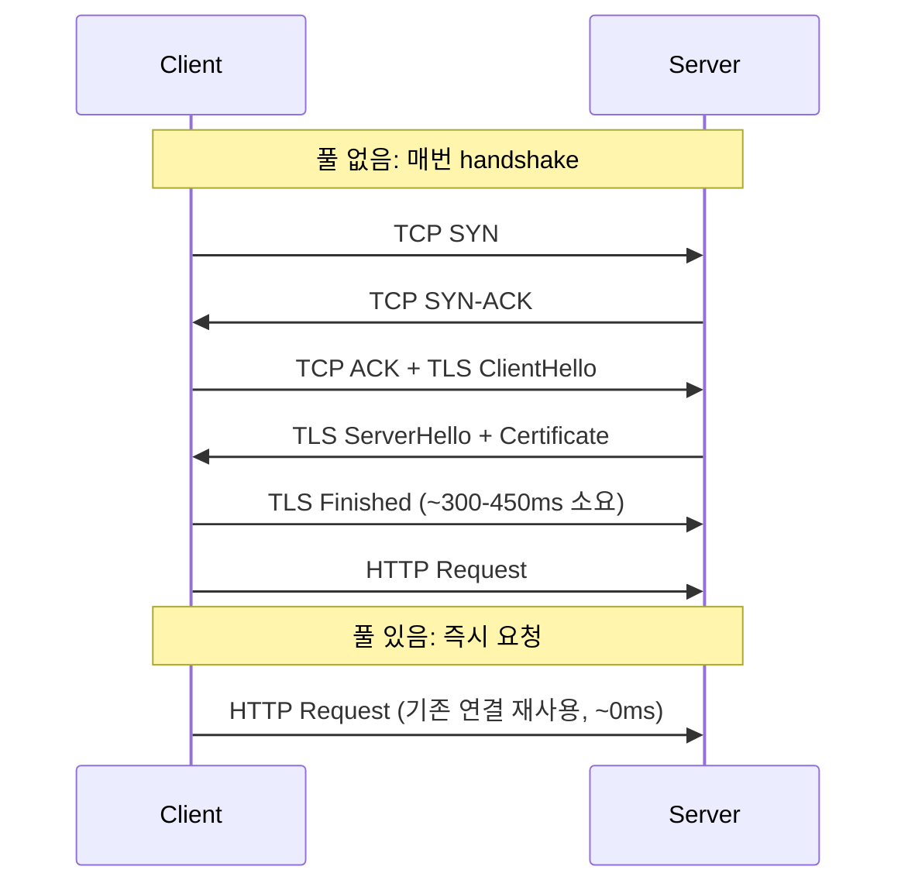
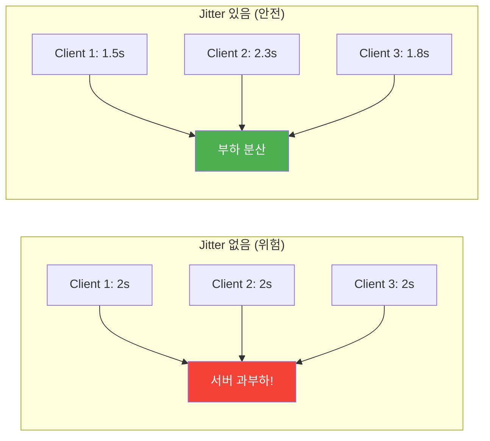
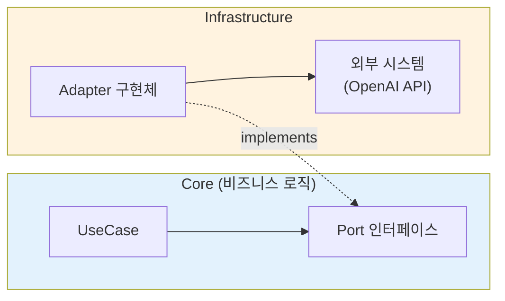

# OpenAI API 호출 최적화 -- 모델 선택부터 WebClient 튜닝까지

안녕하세요. duurian 팀에서 백엔드 개발을 담당하고 있는 정지원입니다.

이번 글에서는 AI 대화 서비스에서 OpenAI API 호출을 최적화한 과정을 공유합니다. 크게 두 가지 축으로 진행했습니다.

1. **OpenAI 모델 최적화**: `reasoning_effort` 파라미터 튜닝과 모델 비교를 통한 응답 속도 개선
2. **WebClient 최적화**: Connection Pool, Timeout 계층화, gzip 압축, 지수 백오프 재시도를 통한 네트워크 효율 및 안정성 개선

---

## 1. 배경: AI 대화 서비스와 OpenAI API 의존도

### 1.1 서비스 소개

duurian은 AI 페르소나 기반의 대화 서비스입니다. 사용자가 AI 페르소나와 하루 최대 5턴의 대화를 나누고, 마지막 턴이 완료되면 AI가 오늘의 대화 내용을 분석하여 대화 요약을 생성합니다.

서비스의 핵심 기능 대부분이 OpenAI API에 의존하고 있습니다.

| 기능 | OpenAI API 호출 | 설명 |
|---|---|---|
| 대화 응답 생성 | 매 턴마다 | 사용자 메시지에 대한 AI 후속 응답 생성 |
| 대화 요약 생성 | 5턴 완료 시 | 오늘 전체 대화 내용 요약 |

하루에 사용자 1명당 최소 4회(대화) + 1회(요약) = **5회의 OpenAI API 호출**이 발생합니다. 사용자 수가 증가하면 API 호출 빈도도 비례하여 늘어나므로, **외부 API 호출의 효율성과 안정성**이 서비스 전체의 성능을 좌우하는 구조입니다.

### 1.2 초기 상태: gpt-5-nano + reasoning_effort: low

서비스 초기에는 **gpt-5-nano** 모델을 `reasoning_effort: low`로 사용하고 있었고, WebClient는 별도 최적화 없이 기본 설정으로 OpenAI API를 호출하고 있었습니다.

```kotlin
// 초기 WebClient — 최적화 이전
@Bean
fun openAiWebClient(): WebClient {
    return WebClient.builder()
        .baseUrl(apiUrl)
        .defaultHeader(HttpHeaders.AUTHORIZATION, "Bearer $apiKey")
        .defaultHeader(HttpHeaders.CONTENT_TYPE, MediaType.APPLICATION_JSON_VALUE)
        .build()
}
```

```kotlin
// 초기 모델 설정 — gpt-5-nano + reasoning_effort: low
val request = ChatCompletionRequest(
    model = "gpt-5-nano",
    messages = openAiMessages,
    maxCompletionTokens = 4000,
    reasoningEffort = "low"
)
```

테스트 서버에서 측정한 결과, 이 조합의 성능이 기대 이하였습니다.

### 1.3 실측 데이터: 왜 최적화가 필요했는가

테스트 서버 환경에서 OpenAI API 호출 시간을 `[OpenAI-Metrics]` 로그를 통해 측정했습니다.

**gpt-5-nano (reasoning_effort: low) — 초기 설정**

| 기능 | 평균 응답 시간 | 샘플 수 |
|---|---|---|
| 대화 응답 생성 | **4,325.2ms** | 5건 |
| 대화 요약 생성 | **6,272ms** | 1건 |

대화 응답에 4초 이상, 요약에 6초 이상이 걸리고 있었습니다. 사용자가 매 턴마다 4초 이상 기다려야 하는 것은 대화 경험에 큰 영향을 미칩니다.

이 문제를 해결하기 위해 **모델/파라미터 최적화**와 **WebClient 최적화**를 동시에 진행했습니다.

---

## 2. OpenAI 모델 최적화

### 2.1 reasoning_effort란?

OpenAI의 reasoning 모델(gpt-5-nano 등)은 `reasoning_effort` 파라미터를 통해 **추론에 투입하는 연산량**을 조절할 수 있습니다.

| reasoning_effort | 설명 | 특징 |
|---|---|---|
| `high` | 최대 추론 | 정확도 최고, 응답 속도 최저 |
| `medium` | 균형 | 기본값 |
| `low` | 제한적 추론 | 빠르지만 복잡한 추론에 약함 |
| `minimal` | 최소 추론 | 속도 최고, 단순 작업에 적합 |

`reasoning_effort`가 높을수록 모델이 내부적으로 더 많은 reasoning token을 생성하여 깊은 사고 과정을 거칩니다. 이 reasoning token은 API 응답에는 포함되지 않지만, **응답 시간과 토큰 비용**에 직접적인 영향을 줍니다.

<div class="notice--info" markdown="1">
**📘 Reasoning Token과 reasoning_effort**

최신 LLM(gpt-5-nano 등)은 답변 생성 전에 내부적으로 "생각하는" 토큰(reasoning token)을 생성합니다. 이 토큰은 API 응답에 포함되지 않지만, 연산 시간과 비용에 영향을 줍니다. `reasoning_effort`가 낮을수록 reasoning token이 적게 생성되어 응답이 빨라지지만, 복잡한 추론 능력은 떨어집니다.
</div>

### 2.2 모델별 성능 비교

다양한 모델과 `reasoning_effort` 조합을 프로덕션에서 측정했습니다.

| 모델 | reasoning_effort | 대화 응답 평균 | 대화 요약 평균 |
|---|---|---|---|
| gpt-5-nano | low | 4,325.2ms (5건) | 6,272ms (1건) |
| gpt-5-nano | minimal | **1,382.4ms** (5건) | **1,110ms** (1건) |
| gpt-4o-mini | - | 1,819.8ms (10건) | 1,338.7ms (3건) |


핵심 발견:
- **gpt-5-nano low → minimal**: 대화 응답 약 **3.1배**, 요약 약 **5.6배** 빨라짐
- **gpt-4o-mini**: reasoning 모델이 아니므로 `reasoning_effort` 불필요. 안정적인 성능

`reasoning_effort`를 `low`에서 `minimal`로 한 단계만 낮춰도 응답 시간이 크게 줄어드는 이유는, `low`도 여전히 상당한 reasoning token을 생성하기 때문입니다. `minimal`은 reasoning을 거의 건너뛰고 바로 응답을 생성합니다.

### 2.3 대화 서비스에 적합한 모델 전략

대화 응답 생성과 요약 생성은 **높은 수준의 추론이 필요한 작업이 아닙니다.** 이미 시스템 프롬프트와 대화 컨텍스트가 충분히 제공되므로, 모델은 주어진 컨텍스트를 바탕으로 자연스러운 대화를 이어가거나 내용을 요약하기만 하면 됩니다.

반면 **수학 문제 풀이, 코드 작성, 논리적 분석** 같은 작업은 깊은 추론이 필요하므로 `reasoning_effort`를 높이는 것이 적합합니다.

| 작업 유형 | 추론 필요도 | 적합한 설정 |
|---|---|---|
| 대화 응답 생성 | 낮음 | `minimal` 또는 non-reasoning 모델 |
| 대화 요약 생성 | 낮음 | `minimal` 또는 non-reasoning 모델 |
| 추천 설명 생성 | 중간 | `medium` |
| 복잡한 분석 작업 | 높음 | `high` |

### 2.4 동적 모델 설정: DB 기반 모델 관리

모델 변경 시마다 코드를 수정하고 재배포하는 것은 비효율적입니다. `AiModelResolver`를 통해 **DB에서 모델명을 동적으로 조회**하고, DB에 없으면 환경변수를 fallback으로 사용합니다.

```kotlin
@Component
class AiModelResolver(
    private val queryAiModelPort: QueryAiModelPort,
    private val openAiClientPort: OpenAiClientPort,
) {

    fun resolve(aiModelId: UUID?): String {
        // 1) DB에서 프롬프트에 연결된 모델 조회
        if (aiModelId != null) {
            val model = queryAiModelPort.findById(aiModelId)
            if (model != null) return model.name
        }

        // 2) 환경변수 fallback
        val defaultModel = openAiClientPort.getDefaultModel()
        if (!defaultModel.isNullOrBlank()) return defaultModel

        // 3) 둘 다 없으면 에러
        throw NotFoundAiModelException()
    }
}
```

이 구조의 장점:
- **재배포 없이 모델 변경**: DB의 프롬프트-모델 매핑을 변경하면 즉시 반영
- **프롬프트별 모델 지정**: 대화 응답은 gpt-5-nano minimal, 요약은 gpt-4o-mini 등 용도에 맞는 모델 배정 가능
- **환경변수 fallback**: DB에 매핑이 없어도 기본 모델로 동작

### 2.5 reasoning_effort 적용 코드

```kotlin
@Component
class OpenAiClientAdapter(
    @param:Qualifier("openAiWebClient")
    private val webClient: WebClient,
    private val openAiProperties: OpenAiProperties
) : OpenAiClientPort {

    override fun chatCompletion(
        messages: List<ConversationMessage>,
        model: String?, temperature: Double?, maxTokens: Int?
    ): String {
        val actualModel = model
            ?: openAiProperties.model
            ?: throw IllegalStateException("OpenAI 모델이 설정되지 않았습니다.")

        // gpt-5-nano일 때만 reasoning_effort 적용
        val reasoningEffort = if (actualModel == "gpt-5-nano") "low" else null

        val request = ChatCompletionRequest(
            model = actualModel,
            messages = openAiMessages,
            maxCompletionTokens = openAiProperties.maxTokens,
            stream = false,
            reasoningEffort = reasoningEffort
        )
        // ...
    }
}
```

`reasoning_effort`는 reasoning 모델에만 의미가 있으므로, gpt-5-nano일 때만 설정하고 다른 모델에서는 null(미포함)로 처리합니다. DTO에 `@JsonInclude(JsonInclude.Include.NON_NULL)`이 적용되어 있어, null 필드는 요청 JSON에서 자동 제거됩니다.

```kotlin
@JsonInclude(JsonInclude.Include.NON_NULL)
data class ChatCompletionRequest(
    val model: String,
    val messages: List<ChatMessage>,
    @field:JsonProperty("max_completion_tokens")
    val maxCompletionTokens: Int? = null,
    val stream: Boolean = false,
    val temperature: Double? = null,
    @field:JsonProperty("reasoning_effort")
    val reasoningEffort: String? = null  // "minimal", "low", "medium", "high"
)
```

---

## 3. WebClient 최적화

모델 최적화로 API 응답 속도를 개선했다면, WebClient 최적화는 **네트워크 계층의 효율성과 안정성**을 높이는 작업입니다.

### 3.1 기존 WebClient의 문제


### 3.2 Connection Pool 설계

Reactor Netty의 `ConnectionProvider`를 사용하여 커넥션 풀을 구성합니다.

```kotlin
val connectionProvider = ConnectionProvider.builder("openai-pool")
    .maxConnections(50)                            // 최대 커넥션 수
    .maxIdleTime(Duration.ofSeconds(20))           // 유휴 커넥션 유지 시간
    .maxLifeTime(Duration.ofMinutes(5))            // 커넥션 최대 생존 시간
    .pendingAcquireTimeout(Duration.ofSeconds(60)) // 커넥션 획득 대기 시간
    .evictInBackground(Duration.ofSeconds(120))    // 유휴 커넥션 백그라운드 제거 주기
    .build()
```

커넥션 풀의 핵심은 **커넥션 재사용**입니다.

```
[기본 설정 — 커넥션 풀 없음]
요청 1: TCP 연결 → TLS 핸드셰이크 → 요청/응답 → 연결 종료
요청 2: TCP 연결 → TLS 핸드셰이크 → 요청/응답 → 연결 종료  ← 동일한 과정 반복

[커넥션 풀 적용]
요청 1: TCP 연결 → TLS 핸드셰이크 → 요청/응답 → 풀에 반환
요청 2: 풀에서 커넥션 획득 → 요청/응답 → 풀에 반환              ← handshake 생략
```

실측 결과, 커넥션 재사용으로 두 번째 이후 요청에서 **150~450ms의 지연을 절감**할 수 있었습니다.

<div class="notice--info" markdown="1">
**📘 Connection Pool과 TCP/TLS Handshake**

HTTPS 연결 수립에는 TCP 3-way handshake(~1 RTT) + TLS handshake(~2 RTT)가 필요합니다. 서울↔미국 기준 RTT가 ~150ms이므로, 매번 연결을 새로 맺으면 300~450ms가 연결 설정에만 소비됩니다. Connection Pool은 연결을 재사용하여 두 번째 요청부터 이 비용을 제거합니다.
</div>



각 설정값의 설계 의도:

| 설정 | 값 | 설계 의도 |
|---|---|---|
| `maxConnections` | 50 | 동시 OpenAI API 호출 상한. 서비스 규모에 맞게 설정 |
| `maxIdleTime` | 20초 | 유휴 커넥션을 너무 오래 유지하면 서버 측에서 끊을 수 있음 |
| `maxLifeTime` | 5분 | 오래된 커넥션을 주기적으로 갱신하여 stale connection 방지 |
| `pendingAcquireTimeout` | 60초 | 풀이 가득 찼을 때 커넥션 획득 대기 상한. OpenAI API의 긴 응답 시간을 고려 |
| `evictInBackground` | 120초 | 유휴 커넥션을 2분마다 정리. 리소스 누수 방지 |

<div class="notice--warning" markdown="1">
**⚠️ Stale Connection**

Stale Connection은 풀에 유지되고 있지만, 서버 측에서 이미 끊은 연결입니다. 이 연결로 요청을 보내면 에러가 발생합니다. `maxLifeTime`으로 연결의 최대 수명을 제한하고, `evictInBackground`로 주기적으로 유휴 연결을 정리하여 방지합니다.
</div>

### 3.3 Timeout 계층화

타임아웃을 **네트워크 계층별로 세분화**하여 설정합니다.

```kotlin
val httpClient = HttpClient.create(connectionProvider)
    .option(ChannelOption.CONNECT_TIMEOUT_MILLIS, 5_000) // 1. TCP 연결 타임아웃
    .responseTimeout(Duration.ofSeconds(60))              // 2. 응답 타임아웃
    .doOnConnected { conn ->
        conn.addHandlerLast(
            ReadTimeoutHandler(60, TimeUnit.SECONDS)      // 3. 읽기 타임아웃
        )
        conn.addHandlerLast(
            WriteTimeoutHandler(10, TimeUnit.SECONDS)     // 4. 쓰기 타임아웃
        )
    }
    .compress(true)                                       // gzip 압축 활성화
```


| 타임아웃 | 값 | 역할 |
|---|---|---|
| Connect Timeout | 5초 | TCP 연결 수립 실패를 빠르게 감지 |
| Write Timeout | 10초 | 요청 전송 중 네트워크 문제 감지 |
| Response Timeout | 60초 | OpenAI API 응답 대기 상한. 모델에 따라 수초~10초 이상 걸릴 수 있어 여유있게 설정 |
| Read Timeout | 60초 | 응답 수신 중 네트워크 지연 감지 |

<div class="notice--warning" markdown="1">
**⚠️ Timeout Layering**

단일 타임아웃은 프로덕션에서 불충분합니다. 네트워크 장애는 연결, 전송, 대기, 수신 각 단계에서 발생할 수 있습니다. 타임아웃 없이 느린 API 하나가 스레드를 무한 점유하면, 스레드 풀이 고갈되어 전체 서비스가 응답 불능 상태에 빠집니다. 이를 **캐스케이딩 장애(cascading failure)**라 합니다.
</div>

### 3.4 gzip 압축

```kotlin
// HttpClient 레벨에서 압축 활성화
.compress(true)

// WebClient 헤더에서 Accept-Encoding 명시
.defaultHeader(HttpHeaders.ACCEPT_ENCODING, "gzip, deflate")
```

`compress(true)`로 Reactor Netty 클라이언트 수준에서 gzip을 활성화하고, `Accept-Encoding` 헤더를 명시하여 서버에 압축 응답을 요청합니다. 실측 결과 응답 데이터 크기를 약 **70% 줄일** 수 있었습니다.

<div class="notice--info" markdown="1">
**📘 gzip 압축**

HTTP 클라이언트가 `Accept-Encoding: gzip` 헤더를 보내면, 서버는 응답 본문을 gzip으로 압축하여 전송합니다. JSON 같은 텍스트 데이터는 압축률이 높아 원본 대비 ~70% 크기를 줄일 수 있습니다. 네트워크 대역폭을 절약하고 전송 시간을 단축합니다.
</div>

### 3.5 메모리 버퍼 크기 설정

```kotlin
val exchangeStrategies = ExchangeStrategies.builder()
    .codecs { configurer ->
        configurer.defaultCodecs().maxInMemorySize(10 * 1024 * 1024) // 10MB
    }
    .build()
```

WebClient의 기본 메모리 버퍼 크기는 256KB입니다. OpenAI API의 응답은 긴 텍스트를 포함할 수 있으므로 **10MB**로 확보합니다. 이 설정이 없으면 긴 응답에서 `DataBufferLimitException`이 발생합니다.

<div class="notice--warning" markdown="1">
**⚠️ DataBufferLimitException**

Spring WebClient의 기본 메모리 버퍼 크기는 256KB입니다. 응답이 이보다 크면 `DataBufferLimitException`이 발생합니다. 이는 보안(메모리 폭발 방지)을 위한 기본 제한이지만, LLM API처럼 큰 응답을 다루는 경우 적절히 늘려야 합니다. 다만 무한정 늘리면 OOM(Out of Memory) 위험이 있으므로 예상 최대 응답 크기를 기준으로 설정합니다.
</div>

### 3.6 전체 WebClient 설정 코드

```kotlin
@Configuration
@EnableConfigurationProperties(OpenAiProperties::class)
class OpenAiConfig(
    private val openAiProperties: OpenAiProperties
) {

    @Bean(name = ["openAiWebClient"])
    fun openAiWebClient(): WebClient {
        // 1. Connection Pool 설정
        val connectionProvider = ConnectionProvider.builder("openai-pool")
            .maxConnections(50)
            .maxIdleTime(Duration.ofSeconds(20))
            .maxLifeTime(Duration.ofMinutes(5))
            .pendingAcquireTimeout(Duration.ofSeconds(60))
            .evictInBackground(Duration.ofSeconds(120))
            .build()

        // 2. HttpClient 설정 (타임아웃, 압축)
        val httpClient = HttpClient.create(connectionProvider)
            .option(ChannelOption.CONNECT_TIMEOUT_MILLIS, 5_000)
            .responseTimeout(Duration.ofSeconds(60))
            .doOnConnected { conn ->
                conn.addHandlerLast(ReadTimeoutHandler(60, TimeUnit.SECONDS))
                conn.addHandlerLast(WriteTimeoutHandler(10, TimeUnit.SECONDS))
            }
            .compress(true)

        // 3. 버퍼 크기 설정
        val exchangeStrategies = ExchangeStrategies.builder()
            .codecs { configurer ->
                configurer.defaultCodecs().maxInMemorySize(10 * 1024 * 1024)
            }
            .build()

        // 4. WebClient 빌드
        return WebClient.builder()
            .baseUrl(openAiProperties.apiUrl)
            .clientConnector(ReactorClientHttpConnector(httpClient))
            .exchangeStrategies(exchangeStrategies)
            .defaultHeader(HttpHeaders.AUTHORIZATION, "Bearer ${openAiProperties.apiKey}")
            .defaultHeader(HttpHeaders.CONTENT_TYPE, MediaType.APPLICATION_JSON_VALUE)
            .defaultHeader(HttpHeaders.ACCEPT_ENCODING, "gzip, deflate")
            .build()
    }
}
```

설정값들은 `@ConfigurationProperties`를 통해 외부화합니다.

```kotlin
@Component
@ConfigurationProperties(prefix = "openai")
class OpenAiProperties {
    lateinit var apiKey: String
    lateinit var apiUrl: String
    lateinit var model: String
    var maxTokens: Int = 4000
    var temperature: Double = 0.7
}
```

`@Value` 대신 `@ConfigurationProperties`를 사용한 이유:
- **타입 안전성**: 컴파일 타임에 타입 검증
- **그룹화**: 관련 설정을 하나의 클래스로 묶어 관리
- **IDE 지원**: 자동완성, 리팩토링 지원

<div class="notice--info" markdown="1">
**📘 @ConfigurationProperties vs @Value**

| 비교 항목 | `@Value` | `@ConfigurationProperties` |
|---|---|---|
| 바인딩 단위 | 필드 단위 (`@Value("${openai.apiKey}")`) | 클래스 단위 (prefix 기반) |
| 타입 안전성 | 문자열 → 수동 변환 필요 | 자동 타입 변환 + 컴파일 타임 검증 |
| IDE 지원 | 제한적 | **자동완성, 리팩토링, 문서화** |
| 검증 | 불가 | `@Validated` + Bean Validation 가능 |
</div>

---

## 4. 지수 백오프 재시도 전략

### 4.1 왜 재시도가 필요한가

OpenAI API에서 가장 빈번하게 발생하는 오류 두 가지는 **429 Too Many Requests**(Rate Limit)와 **503 Service Unavailable**(일시적 서버 장애)입니다. 이 두 오류는 일정 시간이 지나면 자연히 해소되는 **일시적 오류(transient error)** 입니다.

재시도 전략 없이 이런 오류를 바로 사용자에게 전달하면 불필요한 실패가 됩니다. 반대로 모든 오류를 무분별하게 재시도하면, 400 Bad Request나 401 Unauthorized 같이 **재시도해도 절대 성공하지 않는 오류**까지 반복 호출하게 됩니다.

<div class="notice--warning" markdown="1">
**⚠️ Transient Error vs Permanent Error**

| 오류 유형 | HTTP 상태 코드 | 재시도 |
|---|---|---|
| **일시적 (Transient)** | 429 Too Many Requests, 503 Service Unavailable | O — 시간이 지나면 해소 |
| **영구적 (Permanent)** | 400 Bad Request, 401 Unauthorized, 404 Not Found | X — 재시도해도 동일한 실패 |

일시적 오류는 시간이 지나면 자연히 해소되므로 재시도가 효과적이지만, 영구적 오류를 재시도하면 서버 부하만 가중됩니다.
</div>

### 4.2 Reactor Retry.backoff 적용

```kotlin
webClient.post()
    .uri("/chat/completions")
    .bodyValue(request)
    .retrieve()
    .bodyToMono<ChatCompletionResponse>()
    .timeout(Duration.ofSeconds(60))
    .retryWhen(
        Retry.backoff(10, Duration.ofSeconds(1))       // 최대 10회, 초기 1초 백오프
            .filter { e ->
                e is WebClientResponseException.TooManyRequests ||   // 429만
                e is WebClientResponseException.ServiceUnavailable   // 503만
            }
            .maxBackoff(Duration.ofSeconds(100))        // 최대 100초 백오프
            .doBeforeRetry { signal ->
                log.warn {
                    "OpenAI API 재시도 ${signal.totalRetries() + 1}회: " +
                    "${signal.failure().message}"
                }
            }
    )
```

| 항목 | 설정값 | 이유 |
|---|---|---|
| 최대 재시도 | 10회 | OpenAI Rate Limit은 분 단위로 리셋되므로, 충분한 횟수 확보 |
| 초기 백오프 | 1초 | 일시적 오류는 곧바로 해소될 수 있으므로, 첫 재시도는 빠르게 |
| 최대 백오프 | 100초 | Rate Limit 상황에서 충분한 대기 시간 |
| 재시도 대상 | 429, 503 | 재시도로 복구 가능한 일시적 오류만. 다른 4xx/5xx는 재시도 무의미 |

### 4.3 지수 백오프의 동작 원리

`Retry.backoff`은 **지수적으로 증가하는 대기 시간 + jitter(무작위 변동)** 을 적용합니다.

```
재시도 1: ~1초 대기    (초기 백오프)
재시도 2: ~2초 대기    (x2)
재시도 3: ~4초 대기    (x2)
재시도 4: ~8초 대기    (x2)
재시도 5: ~16초 대기   (x2)
재시도 6: ~32초 대기   (x2)
재시도 7: ~64초 대기   (x2)
재시도 8: ~100초 대기  (maxBackoff 도달)
재시도 9: ~100초 대기  (maxBackoff 유지)
재시도 10: ~100초 대기 (maxBackoff 유지)
```

Reactor의 `Retry.backoff`은 기본적으로 **jitter factor 0.5**를 적용하여, 대기 시간에 ±50%의 무작위 변동을 줍니다. 이는 여러 요청이 동시에 Rate Limit에 걸렸을 때, 모두 같은 시점에 재시도하여 **thundering herd** 문제를 일으키는 것을 방지합니다.

<div class="notice--info" markdown="1">
**📘 Exponential Backoff + Jitter + Thundering Herd**

**지수 백오프(Exponential Backoff)**는 재시도 간격을 1s→2s→4s→8s...로 지수적으로 늘리는 전략입니다. **Jitter**는 이 간격에 랜덤 편차를 추가합니다. Jitter 없이 100개 클라이언트가 동시에 Rate Limit에 걸리면, 모두 정확히 같은 시점에 재시도하여 서버를 다시 과부하시킵니다. 이를 **Thundering Herd Problem**이라 합니다.
</div>



### 4.4 재시도 흐름도


---

## 5. 에러 처리와 응답 매핑

### 5.1 에러 타입별 매핑

외부 API의 다양한 오류를 **도메인 레이어의 예외 타입으로 변환**합니다.

```kotlin
.onErrorMap { e ->
    when (e) {
        is TimeoutException -> OpenAiTimeoutException()
        is WebClientResponseException.TooManyRequests -> OpenAiRateLimitException()
        is OpenAiEmptyResponseException -> e
        else -> OpenAiApiException()
    }
}
```

| WebClient 예외 | 도메인 예외 | 의미 |
|---|---|---|
| `TimeoutException` | `OpenAiTimeoutException` | 60초 내 응답 없음 |
| `TooManyRequests` (429) | `OpenAiRateLimitException` | Rate Limit 초과 (10회 재시도 후에도 실패) |
| `OpenAiEmptyResponseException` | 그대로 전파 | API는 200이지만 응답 내용이 없음 |
| 기타 모든 예외 | `OpenAiApiException` | 알 수 없는 API 오류 |

### 5.2 응답 메트릭 로깅

모든 API 호출에 대해 응답 시간과 토큰 사용량을 구조화하여 로깅합니다.

```kotlin
.map { response ->
    val elapsedTime = System.currentTimeMillis() - startTime

    response.usage?.let { usage ->
        log.info {
            "[OpenAI-Metrics] " +
                "responseTime=${elapsedTime}ms, " +
                "promptTokens=${usage.promptTokens}, " +
                "completionTokens=${usage.completionTokens}, " +
                "totalTokens=${usage.totalTokens}, " +
                "model=${response.model} "
        }
    }
    // ...
}
```

`[OpenAI-Metrics]` 태그로 구조화된 로그를 남기면 모델별/기능별 응답 시간을 모니터링할 수 있습니다. 앞서 제시한 모델별 실측 데이터도 이 로그를 기반으로 수집한 것입니다.

### 5.3 빈 응답 및 reasoning 모델 응답 처리

OpenAI API는 200 OK를 반환하면서도 content가 비어 있을 수 있고, reasoning 모델은 `content` 대신 `reasoningContent` 필드에 응답을 담을 수 있습니다.

```kotlin
val choice = response.choices?.firstOrNull()
val message = choice?.message

// content 또는 reasoningContent 중 하나를 사용
val content = message?.content?.takeIf { it.isNotBlank() }
    ?: message?.reasoningContent?.takeIf { it.isNotBlank() }

if (content.isNullOrBlank()) {
    log.warn {
        "OpenAI API 응답에 content가 없습니다: " +
        "id=${response.id}, " +
        "finishReason=${choice?.finishReason}, " +
        "refusal=${message?.refusal}"
    }
    throw OpenAiEmptyResponseException()
}
```

`content` → `reasoningContent` 순서로 fallback하는 이유는, gpt-5-nano 같은 reasoning 모델이 `reasoning_effort` 설정에 따라 응답을 다른 필드에 담을 수 있기 때문입니다.

---

## 6. Hexagonal Architecture에서의 통합

### 6.1 아키텍처 구조

모델 설정과 WebClient 관련 코드는 **Hexagonal Architecture(포트 & 어댑터 패턴)** 에 따라 분리되어 있습니다.

```
프로젝트 구조
├── core/                      (비즈니스 로직)
│   ├── port/out/
│   │   └── OpenAiClientPort   ← 인터페이스 정의 (Port)
│   └── support/
│       └── AiModelResolver    ← DB 기반 모델 조회
│
├── domain/                    (도메인 모델)
│   ├── error/
│   │   ├── OpenAiApiException
│   │   ├── OpenAiTimeoutException
│   │   ├── OpenAiRateLimitException
│   │   └── OpenAiEmptyResponseException
│   └── model/
│       └── AiModelRequest     ← 모델 요청 메타 (model, reasoningEffort)
│
└── infrastructure/openai/     (외부 API 통합)
    ├── config/
    │   ├── OpenAiConfig       ← WebClient Bean 설정
    │   └── OpenAiProperties   ← 설정값 외부화
    ├── adapter/
    │   └── OpenAiClientAdapter ← Port 구현체 (Adapter)
    └── dto/
        ├── ChatCompletionRequest
        └── ChatCompletionResponse
```

### 6.2 Port 인터페이스

```kotlin
// core 모듈 — 외부 API 구현에 의존하지 않음
interface OpenAiClientPort {
    fun chatCompletion(
        messages: List<ConversationMessage>,
        model: String? = null,
        temperature: Double? = null,
        maxTokens: Int? = null
    ): String

    fun getDefaultTemperature(): Double
    fun getDefaultMaxTokens(): Int
    fun getDefaultModel(): String?
}
```

비즈니스 로직은 WebClient, Connection Pool, Retry 전략, `reasoning_effort` 등의 구현 세부사항을 전혀 알지 못합니다. `OpenAiClientPort`만 의존합니다.

이 구조의 장점:
- **교체 용이성**: OpenAI API를 다른 LLM API로 교체해도 core 모듈 수정 없음
- **테스트 용이성**: `OpenAiClientPort`를 mock하여 비즈니스 로직을 단위 테스트 가능
- **관심사 분리**: 모델 설정과 WebClient 최적화는 infrastructure 모듈에서만 수행

<div class="notice--success" markdown="1">
**✅ Hexagonal Architecture (Port & Adapter)**

비즈니스 로직이 외부 시스템(DB, API, 메시지 큐)에 직접 의존하지 않도록 **Port(인터페이스)**와 **Adapter(구현체)**로 분리하는 아키텍처입니다. 비즈니스 로직은 Port만 알고, Adapter가 실제 외부 통신을 담당합니다. 외부 시스템 교체 시 Adapter만 새로 만들면 됩니다.
</div>



---

## 7. 결과

### 7.1 모델 최적화 효과

| 항목 | gpt-5-nano (low) | gpt-5-nano (minimal) | gpt-4o-mini |
|---|---|---|---|
| 대화 응답 평균 | 4,325.2ms | **1,382.4ms** | 1,819.8ms |
| 대화 요약 평균 | 6,272ms | **1,110ms** | 1,338.7ms |
| reasoning 지원 | O | O | X |

`reasoning_effort`를 `low` → `minimal`로 변경하는 것만으로 대화 응답 약 **3.1배**, 요약 약 **5.6배** 빨라졌습니다.

### 7.2 WebClient 최적화 효과

| 최적화 항목 | 적용 전 | 적용 후 | 개선 |
|---|---|---|---|
| 커넥션 재사용 | 매번 TCP/TLS handshake | 풀에서 즉시 획득 | 두 번째 이후 요청 150~450ms 절감 |
| 응답 데이터 크기 | 원본 100% | gzip 압축 ~30% | **70% 감소** |
| 요청 페이로드 | null 필드 포함 | null 필드 제외 | **약 40% 감소** |
| 타임아웃 | 무한 대기 | 계층별 타임아웃 | 장애 전파 차단 |
| Rate Limit 처리 | 즉시 실패 | 10회 지수 백오프 | 자동 복구 |

### 7.3 안정성 개선

| 항목 | 개선 전 | 개선 후 |
|---|---|---|
| 무한 대기 | 발생 가능 | 타임아웃으로 방지 |
| Rate Limit | 사용자에게 즉시 에러 | 자동 재시도 후 복구 |
| 서버 일시 장애 | 사용자에게 즉시 에러 | 503 자동 재시도 |
| 모델 변경 | 코드 수정 + 재배포 | DB 변경으로 즉시 반영 |
| 커넥션 누수 | 관리 부재 | `maxIdleTime`, `maxLifeTime`, `evictInBackground`로 관리 |

---

## 8. 결론

### 8.1 배운 점

**1. API 응답 시간의 가장 큰 변수는 모델과 파라미터입니다.**

WebClient를 아무리 최적화해도, 모델 자체가 느리면 한계가 있습니다. gpt-5-nano의 `reasoning_effort`를 `low`에서 `minimal`로 한 단계 낮추는 것만으로 응답 시간이 3~5배 빨라졌습니다. 작업의 복잡도에 맞는 `reasoning_effort`를 선택하는 것이 성능 최적화의 첫 번째 단계입니다.

**2. 기본 설정은 프로덕션 설정이 아닙니다.**

WebClient의 기본 설정은 빠른 개발을 위한 것이지, 프로덕션 환경에서의 안정성과 성능을 보장하지 않습니다. 커넥션 풀, 타임아웃, 재시도, 압축 — 이 네 가지는 외부 API를 호출하는 모든 서비스에서 기본적으로 구성해야 합니다.

**3. 재시도 대상을 정확히 필터링해야 합니다.**

429(Rate Limit)와 503(일시적 장애)만 재시도 대상으로 한정해야 합니다. 400(잘못된 요청)이나 401(인증 실패)을 재시도하면 서버 부하만 가중됩니다.

**4. 성능 최적화는 측정에서 시작합니다.**

"느리다"는 감각적 판단이 아닌, 구간별 정확한 측정 데이터를 바탕으로 병목 지점을 식별해야 합니다. `[OpenAI-Metrics]` 로그를 통해 모델별 응답 시간을 실측하고, 이 데이터를 기반으로 `reasoning_effort` 조정과 WebClient 최적화를 결정한 것이 효과적인 개선의 출발점이었습니다.

### 8.2 마무리

외부 API 호출 최적화는 **"어떤 모델을 어떤 설정으로 호출하는가"** 와 **"어떻게 호출하는가"** 두 축으로 나뉩니다. 전자는 모델 선택과 `reasoning_effort` 같은 파라미터 튜닝이고, 후자는 Connection Pool, 타임아웃, 재시도, 압축 같은 네트워크 계층 최적화입니다. 둘 다 놓치지 않아야 외부 API에 의존하는 서비스의 성능과 안정성을 동시에 확보할 수 있습니다.

이 글이 비슷한 문제를 겪고 계신 분들에게 도움이 되었으면 합니다. 궁금한 점이나 개선할 부분이 있다면 언제든지 댓글로 남겨주세요.

---

## 참고 자료

- [Spring WebFlux WebClient 공식 문서](https://docs.spring.io/spring-framework/reference/web/webflux-webclient.html)
- [Reactor Netty Connection Pool](https://projectreactor.io/docs/netty/release/reference/index.html#connection-pool)
- [Reactor Retry 가이드](https://projectreactor.io/docs/core/release/reference/#_retrying)
- [Exponential Backoff and Jitter (AWS Architecture Blog)](https://aws.amazon.com/blogs/architecture/exponential-backoff-and-jitter/)
- [OpenAI API Rate Limits](https://platform.openai.com/docs/guides/rate-limits)
- [OpenAI Reasoning Models](https://platform.openai.com/docs/guides/reasoning)
