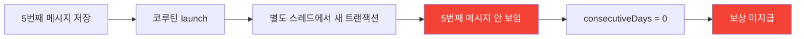
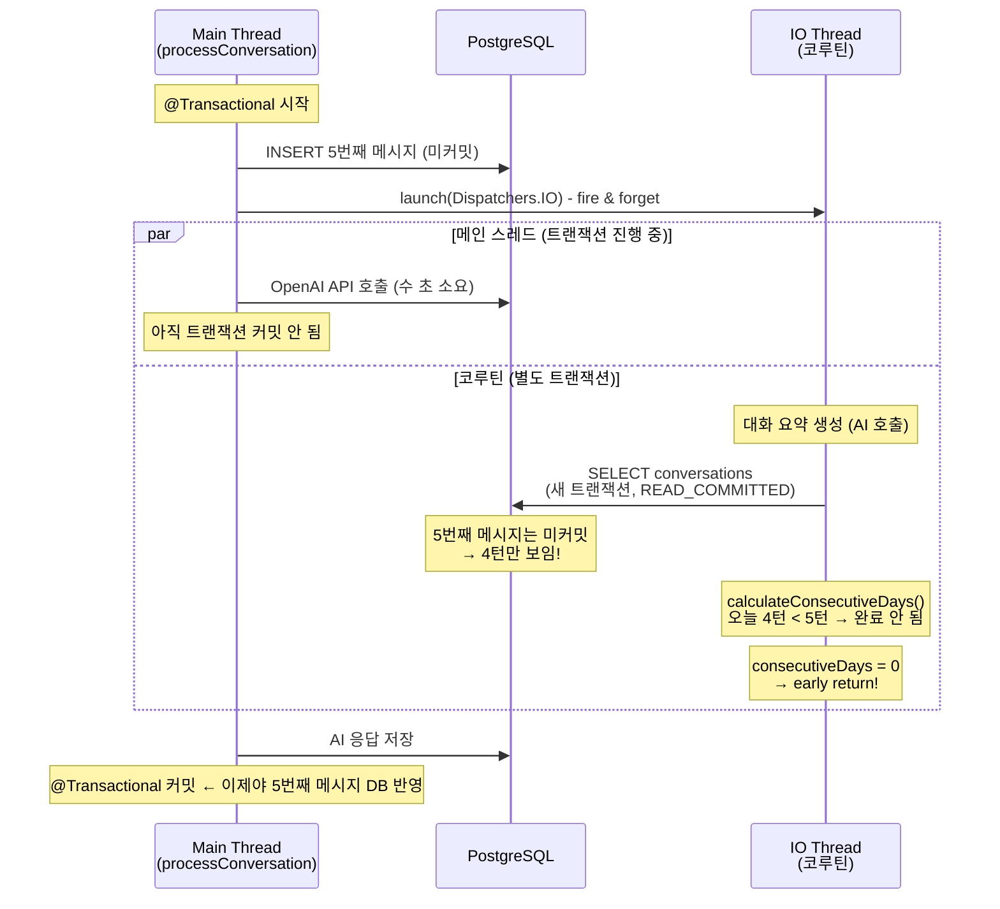
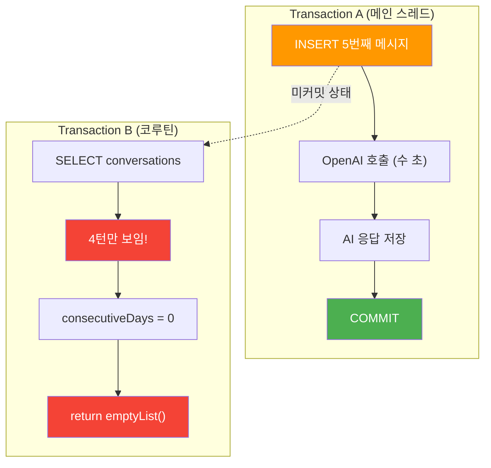
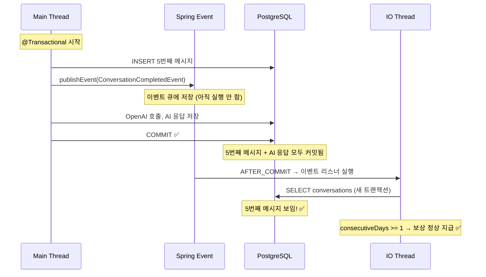
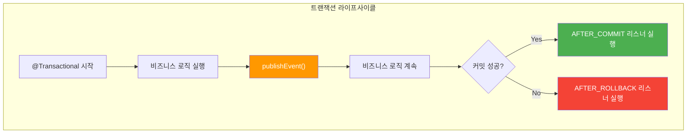
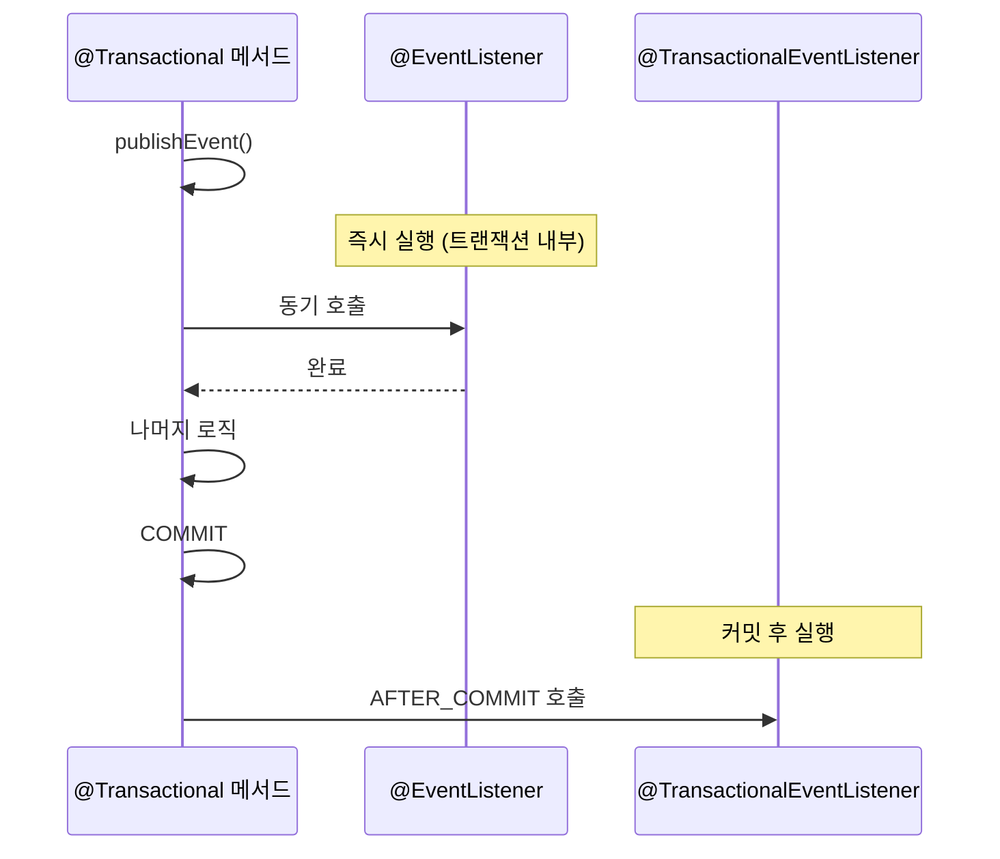
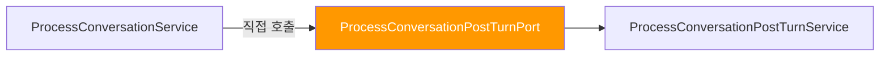
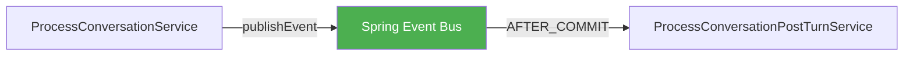
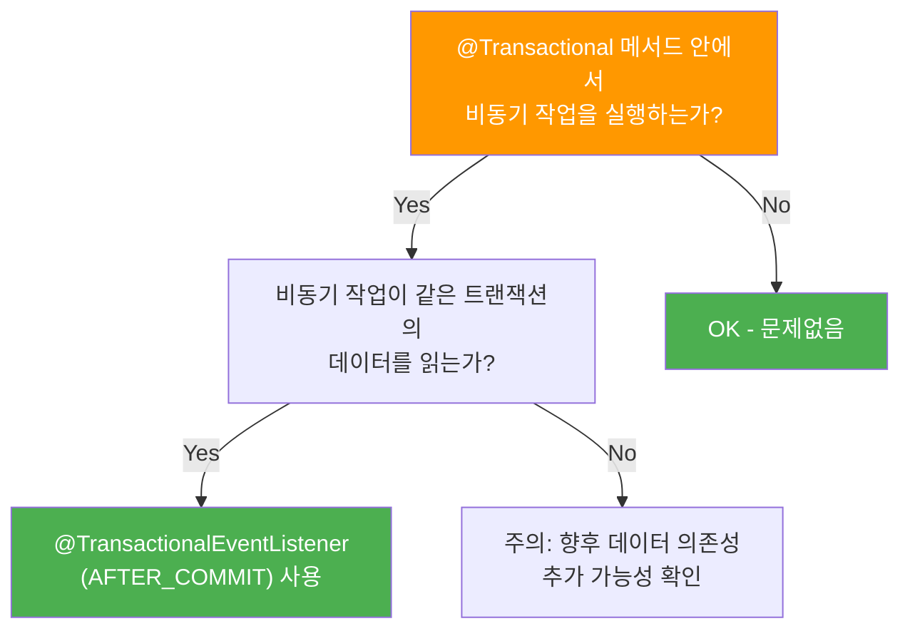
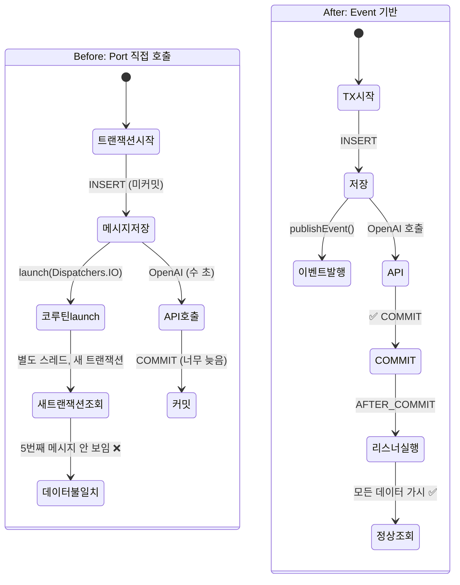

# [Spring/Kotlin] @Transactional 내부 코루틴의 트랜잭션 가시성 문제 - @TransactionalEventListener로 해결하기

안녕하세요. duurian 팀에서 백엔드 개발을 담당하고 있는 정지원입니다.

이전 글 [suspend 함수와 @Transactional의 위험한 조합](/2025-01-24-kotlin-coroutine-transactional-danger)에서는 코루틴의 스레드 전환으로 인한 **트랜잭션 컨텍스트 유실** 문제를 다뤘습니다.

이번에는 비슷하지만 다른 함정을 만났습니다. `@Transactional` 메서드 내부에서 코루틴을 launch하면, 코루틴의 새 트랜잭션이 **부모 트랜잭션의 미커밋 데이터를 읽지 못하는** 문제입니다. 이 글에서는 문제의 원인을 분석하고 `@TransactionalEventListener(AFTER_COMMIT)`로 해결하는 과정을 공유합니다.

---

## 1. 문제 상황: 보상이 지급되지 않는다

### 1.1 문제 발견 과정



duurian 서비스에서는 사용자가 5턴 대화를 완료하면 보상을 지급합니다. 그런데 대화 완료 후 `RewardSkipHistory` 저장과 `createRewardIfExists` 호출이 **모두** 동작하지 않는 버그가 발생했습니다.

### 1.2 문제의 코드

대화 처리의 핵심 흐름을 살펴보겠습니다.

```kotlin
// ProcessConversationService.kt
@Transactional  // 트랜잭션 시작
override fun processConversation(command: ProcessConversationCommand): ProcessConversationResult {
    // 1. 5번째 사용자 메시지 저장 (아직 커밋 안 됨!)
    commandConversationPort.saveConversation(userConversation)

    val systemTurn = todayConversations.filter { !it.isAiModel && it.questionId == null }.size

    if (systemTurn == MAX_TURNS) {
        // 2. 후처리 비동기 실행 (코루틴 launch)
        postTurnPort.handleAfterLastTurn(command.userId)
    }

    // 3. OpenAI API 호출 (수 초 소요) → 이 후에야 트랜잭션 커밋
    return handleFollowUpTurn(command, todayConversations, systemTurn)
}
```

후처리 서비스는 코루틴으로 실행됩니다.

```kotlin
// ProcessConversationPostTurnService.kt
override fun handleAfterLastTurn(userId: UUID) {
    conversationPostTurnScope.launch(Dispatchers.IO) {  // 별도 스레드!
        val summaryList = summaryListDeferred.await()

        launch {
            val qualityResult = lowQualityConversationDetector.check(userId, summaryList)
            // 여기서 보상 생성 시도
            createRewardUseCase.createConversationReward(
                CreateRewardCommand(userId = userId, ...)
            )
        }
    }
}
```

보상 생성 로직에서는 연속 대화 일수를 확인합니다.

```kotlin
// CreateRewardService.kt
@Transactional
override fun createConversationReward(command: CreateRewardCommand): List<CommandRewardResult> {
    val consecutiveDays = conversationDaysCalculator.calculateConsecutiveDays(command.userId)
    if (consecutiveDays < 1) return emptyList()  // ← 여기서 early return!

    // RewardSkipHistory 저장과 createRewardIfExists 모두 이 아래에 있음
    if (command.skipDailyReward) {
        commandRewardSkipHistoryPort.save(...)  // 도달 불가!
    } else {
        createRewardIfExists(...)  // 도달 불가!
    }
}
```

### 1.3 증상 정리

| 증상 | 상세 |
|------|------|
| 보상 미지급 | 대화 완료 후 DAY1 보상이 생성되지 않음 |
| 미지급 이력 미저장 | 저품질 대화 시 `RewardSkipHistory`도 저장되지 않음 |
| early return | `consecutiveDays = 0`으로 계산되어 line 57에서 조기 반환 |
| 재현 조건 | 신규 사용자 또는 전날 대화하지 않은 사용자에서 100% 재현 |

---

## 2. 원인 분석: 트랜잭션 가시성(Transaction Visibility) 문제

### 2.1 전체 타임라인

이전 글에서 다뤘던 ThreadLocal 유실 문제와 다릅니다. 이번에는 **부모 트랜잭션의 미커밋 데이터를 자식 트랜잭션에서 읽지 못하는 문제**입니다.



### 2.2 PostgreSQL의 READ_COMMITTED 격리 수준

PostgreSQL의 기본 격리 수준은 `READ_COMMITTED`입니다. 이 격리 수준에서는 **다른 트랜잭션이 커밋한 데이터만** 읽을 수 있습니다.



| 시점 | Transaction A (메인) | Transaction B (코루틴) |
|------|---------------------|----------------------|
| T0 | INSERT 5번째 메시지 | - |
| T1 | OpenAI 호출 시작 | launch 시작, 요약 생성 AI 호출 |
| T2 | OpenAI 응답 대기 중 | 요약 완료, **SELECT conversations** → 4턴만 보임 |
| T3 | OpenAI 응답 대기 중 | `consecutiveDays = 0` → **early return** |
| T4 | AI 응답 저장, COMMIT | (이미 실패 후) |

### 2.3 왜 5턴이 중요한가

`ConversationDaysCalculator.calculateConsecutiveDays`는 하루에 5턴 이상 대화한 날만 "완료된 날"로 인정합니다.

```kotlin
fun calculateConsecutiveDays(userId: UUID): Int {
    val completedDates = conversations
        .filter { !it.isAiModel && it.questionId == null }
        .groupBy { convertUtcToSeoulDate(it.createdAt) }
        .filter { (_, turns) -> turns.size >= 5 }  // 5턴 기준!
        .keys

    if (completedDates.isEmpty()) return 0
    // ...
}
```

코루틴에서 조회하면 5번째 메시지가 미커밋 상태이므로 **오늘은 4턴**으로 계산됩니다. 따라서:

- 오늘이 "완료된 날"로 인정되지 않음
- 어제도 대화하지 않았다면 → `consecutiveDays = 0`
- `consecutiveDays < 1` → **early return** → 보상 로직에 도달 불가

### 2.4 이전 글과의 차이점

| | 이전 글 (ThreadLocal 유실) | 이번 글 (트랜잭션 가시성) |
|---|---|---|
| **원인** | 코루틴 스레드 전환으로 ThreadLocal 유실 | 미커밋 데이터를 별도 트랜잭션에서 조회 |
| **위치** | `suspend` 함수 + `@Transactional` | 일반 함수에서 코루틴 `launch` |
| **증상** | 트랜잭션 자체가 없음 | 트랜잭션은 있지만 데이터가 안 보임 |
| **해결** | 트랜잭션 범위 분리 | `@TransactionalEventListener(AFTER_COMMIT)` |

---

## 3. 해결: @TransactionalEventListener(AFTER_COMMIT)

### 3.1 핵심 아이디어

**트랜잭션이 커밋된 이후에** 코루틴을 시작하면, 코루틴의 새 트랜잭션에서 모든 데이터를 조회할 수 있습니다.

Spring의 `@TransactionalEventListener(phase = TransactionPhase.AFTER_COMMIT)`는 정확히 이 시점에 실행됩니다.



### 3.2 구현: Before → After

**Before** - Port 인터페이스로 직접 호출

```kotlin
// ProcessConversationService.kt
@Service
class ProcessConversationService(
    private val postTurnPort: ProcessConversationPostTurnPort,  // Port 직접 의존
    // ...
) {
    @Transactional
    override fun processConversation(command: ProcessConversationCommand) {
        commandConversationPort.saveConversation(userConversation)

        if (systemTurn == MAX_TURNS) {
            postTurnPort.handleAfterLastTurn(command.userId)  // 트랜잭션 내에서 호출!
        }

        return handleFollowUpTurn(...)  // OpenAI 호출 후 커밋
    }
}
```

```kotlin
// ProcessConversationPostTurnService.kt
@Service
class ProcessConversationPostTurnService(
    // ...
) : ProcessConversationPostTurnPort {

    override fun handleAfterLastTurn(userId: UUID) {
        conversationPostTurnScope.launch(Dispatchers.IO) {
            // 부모 트랜잭션 미커밋 → 5번째 메시지 안 보임!
            // ...
        }
    }
}
```

**After** - 이벤트 기반으로 전환

```kotlin
// 1. 이벤트 클래스 생성
data class ConversationCompletedEvent(
    val userId: UUID,
)
```

```kotlin
// 2. ProcessConversationService.kt - 이벤트 발행으로 변경
@Service
class ProcessConversationService(
    private val eventPublisher: ApplicationEventPublisher,  // 이벤트 퍼블리셔
    // ...
) {
    @Transactional
    override fun processConversation(command: ProcessConversationCommand) {
        commandConversationPort.saveConversation(userConversation)

        if (systemTurn == MAX_TURNS) {
            // 이벤트만 발행 → AFTER_COMMIT까지 실행 대기
            eventPublisher.publishEvent(
                ConversationCompletedEvent(userId = command.userId)
            )
        }

        return handleFollowUpTurn(...)
    }
}
```

```kotlin
// 3. ProcessConversationPostTurnService.kt - 이벤트 리스너로 변경
@Component
class ProcessConversationPostTurnService(
    private val createConversationSummaryUseCase: CreateConversationSummaryUseCase,
    private val createRewardUseCase: CreateRewardUseCase,
    private val updateFriendshipAfterConversationService: UpdateFriendshipAfterConversationService,
    private val lowQualityConversationDetector: LowQualityConversationDetector,
    private val conversationPostTurnScope: CoroutineScope,
) {

    @TransactionalEventListener(phase = TransactionPhase.AFTER_COMMIT)
    fun handleConversationCompleted(event: ConversationCompletedEvent) {
        val userId = event.userId

        conversationPostTurnScope.launch(Dispatchers.IO) {
            // 트랜잭션 커밋 후 실행 → 5번째 메시지 조회 가능!
            val summaryList = summaryListDeferred.await()

            launch {
                val qualityResult = lowQualityConversationDetector.check(userId, summaryList)
                createRewardUseCase.createConversationReward(
                    CreateRewardCommand(
                        userId = userId,
                        skipDailyReward = qualityResult.isLowQuality,
                        skipReasons = qualityResult.reasons,
                    )
                )
            }

            // 친밀도 업데이트 ...
        }
    }
}
```

```kotlin
// 4. ProcessConversationPostTurnPort.kt 삭제 (더 이상 불필요)
```

### 3.3 변경 사항 요약

| 파일 | 변경 |
|------|------|
| `ConversationCompletedEvent.kt` | **신규** - 대화 완료 이벤트 |
| `ProcessConversationService.kt` | `postTurnPort.handleAfterLastTurn()` → `eventPublisher.publishEvent()` |
| `ProcessConversationPostTurnService.kt` | Port 구현 → `@TransactionalEventListener(AFTER_COMMIT)` |
| `ProcessConversationPostTurnPort.kt` | **삭제** - 불필요한 Port 인터페이스 제거 |

---

## 4. @TransactionalEventListener 동작 원리

### 4.1 Spring 이벤트와 트랜잭션 연동

`@TransactionalEventListener`는 Spring 4.2부터 제공되는 기능으로, 트랜잭션의 특정 단계(phase)에서 이벤트를 처리합니다.



| Phase | 실행 시점 | 사용 사례 |
|-------|----------|----------|
| `BEFORE_COMMIT` | 커밋 직전 | 추가 검증, 감사 로그 |
| `AFTER_COMMIT` | 커밋 성공 후 | **알림 발송, 후속 비동기 작업** |
| `AFTER_ROLLBACK` | 롤백 후 | 보상 트랜잭션, 상태 복구 |
| `AFTER_COMPLETION` | 커밋/롤백 후 | 리소스 정리 |

### 4.2 @EventListener vs @TransactionalEventListener



| | `@EventListener` | `@TransactionalEventListener` |
|---|---|---|
| **실행 시점** | 즉시 (트랜잭션 내부) | 트랜잭션 커밋/롤백 후 |
| **데이터 가시성** | 미커밋 데이터 보임 (같은 트랜잭션) | 커밋된 데이터만 보임 |
| **실패 시 영향** | 트랜잭션 롤백 가능 | 트랜잭션에 영향 없음 |
| **적합한 사용처** | 트랜잭션 내 동기 처리 | 비동기 후처리, 알림 발송 |

### 4.3 주의사항

#### 트랜잭션 없이 publishEvent를 호출하면?

`@TransactionalEventListener`는 활성 트랜잭션이 있을 때만 동작합니다. 트랜잭션 없이 `publishEvent()`를 호출하면 **이벤트가 무시됩니다**(기본 동작).

```kotlin
// 기본값: fallbackExecution = false → 트랜잭션 없으면 이벤트 무시
@TransactionalEventListener(phase = TransactionPhase.AFTER_COMMIT)
fun handle(event: MyEvent) { ... }

// fallbackExecution = true → 트랜잭션 없어도 즉시 실행
@TransactionalEventListener(
    phase = TransactionPhase.AFTER_COMMIT,
    fallbackExecution = true
)
fun handle(event: MyEvent) { ... }
```

#### AFTER_COMMIT 리스너에서의 예외

`AFTER_COMMIT` 리스너에서 발생한 예외는 이미 커밋된 트랜잭션에 영향을 주지 않습니다. 하지만 예외가 전파되면 다른 리스너의 실행을 방해할 수 있으므로, 반드시 try-catch로 감싸야 합니다.

---

## 5. 아키텍처 개선: Port → Event

### 5.1 Before: Port 기반 직접 결합



서비스가 Port를 통해 후처리 서비스를 **직접 호출**합니다. 이 구조에서는 호출 시점을 제어하기 어렵습니다.

### 5.2 After: 이벤트 기반 느슨한 결합



이벤트 기반으로 전환하면:

- **느슨한 결합**: 발행자와 수신자가 서로를 알 필요 없음
- **트랜잭션 경계 보장**: `AFTER_COMMIT`으로 커밋 후 실행 보장
- **확장성**: 새로운 후처리 로직 추가 시 리스너만 추가하면 됨
- **Port 인터페이스 제거**: 불필요한 추상화 계층 정리

---

## 6. 실무 팁

### 6.1 @Transactional + 비동기 작업 체크리스트



| 체크 항목 | 확인 내용 |
|-----------|-----------|
| `@Transactional` 내 `launch` | 코루틴이 같은 트랜잭션의 데이터를 읽는지 확인 |
| `@Transactional` 내 `@Async` | 비동기 메서드가 미커밋 데이터에 의존하는지 확인 |
| `@Transactional` 내 `CompletableFuture` | 별도 스레드에서 DB 조회 시 가시성 문제 확인 |
| 이벤트 발행 위치 | `publishEvent`가 트랜잭션 내부에서 호출되는지 확인 |

### 6.2 디버깅: 트랜잭션 커밋 시점 확인

문제가 의심될 때 JPA의 SQL 로그를 활성화하면 커밋 시점을 확인할 수 있습니다.

```yaml
# application.yml
logging:
  level:
    org.springframework.transaction: DEBUG
    org.springframework.orm.jpa: DEBUG
```

출력 예시:

```
DEBUG - Creating new transaction with name [processConversation]
DEBUG - Opened new EntityManager for JPA transaction
...
DEBUG - Committing JPA transaction on EntityManager
DEBUG - Closing JPA EntityManager after transaction
```

`Committing JPA transaction` 로그가 출력된 **후에** 이벤트 리스너가 실행되어야 정상입니다.

---

## 7. 마무리

> **💡 Key Takeaways**
> 1. **`@Transactional` 내 비동기 = 트랜잭션 가시성 함정** — 코루틴 `launch`는 별도 스레드에서 새 트랜잭션을 시작하므로, 부모의 미커밋 데이터를 읽지 못합니다. "같은 코드 블록 안에 있으니까 같은 트랜잭션이겠지"라는 가정이 가장 위험합니다.
> 2. **데이터 의존성이 있으면 `AFTER_COMMIT`** — `@TransactionalEventListener(AFTER_COMMIT)`는 커밋 완료 후 실행을 보장하므로, 후처리 로직이 항상 완전한 데이터를 읽을 수 있습니다.
> 3. **이벤트 기반 전환은 부수 효과까지 개선** — 트랜잭션 가시성 문제를 해결하면서 동시에 Port → Event 전환으로 느슨한 결합, 확장성까지 얻었습니다. 문제 해결이 아키텍처 개선으로 이어진 사례입니다.

### Before → After



| 항목 | Before | After |
|------|--------|-------|
| **호출 방식** | Port 인터페이스 직접 호출 | `ApplicationEventPublisher` + 이벤트 |
| **실행 시점** | 트랜잭션 진행 중 (미커밋) | 트랜잭션 커밋 후 (`AFTER_COMMIT`) |
| **데이터 가시성** | 5번째 메시지 안 보임 ❌ | 모든 데이터 조회 가능 ✅ |
| **결합도** | 서비스 → Port → 구현체 직접 결합 | 이벤트 기반 느슨한 결합 |
| **보상 지급** | `consecutiveDays = 0` → 미지급 | 정상 계산 → 정상 지급 |

`@Transactional` 메서드 안에서 비동기 작업을 실행할 때는 항상 **"이 비동기 작업이 같은 트랜잭션의 데이터를 읽어야 하는가?"**를 자문해 보세요. 답이 Yes라면, `@TransactionalEventListener(AFTER_COMMIT)`가 안전한 선택입니다.

---

이전 글 [suspend 함수와 @Transactional의 위험한 조합](/2025-01-24-kotlin-coroutine-transactional-danger)과 함께 읽으면 코루틴 + 트랜잭션의 두 가지 주요 함정을 모두 이해할 수 있습니다.
궁금한 점이나 유사한 경험이 있다면 댓글로 공유해주세요!

## 참고 자료

* [Spring Framework - @TransactionalEventListener](https://docs.spring.io/spring-framework/reference/data-access/transaction/event.html)
* [PostgreSQL - Transaction Isolation](https://www.postgresql.org/docs/current/transaction-iso.html)
* [Spring Blog - Better Application Events in Spring Framework 4.2](https://spring.io/blog/2015/02/11/better-application-events-in-spring-framework-4-2)
* [Baeldung - Spring Events](https://www.baeldung.com/spring-events)
