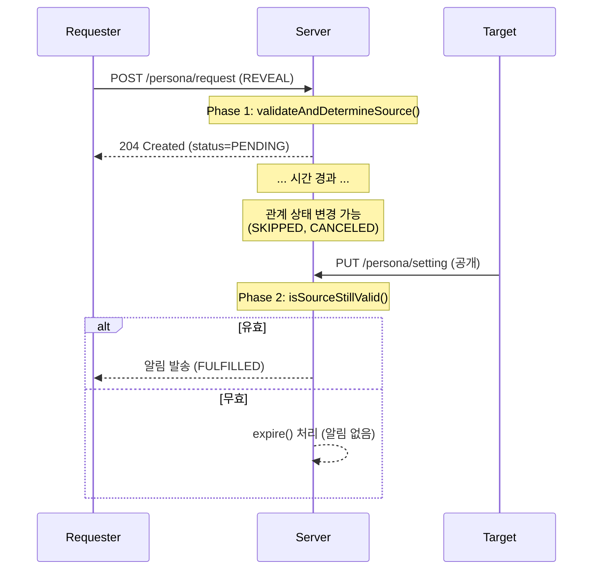
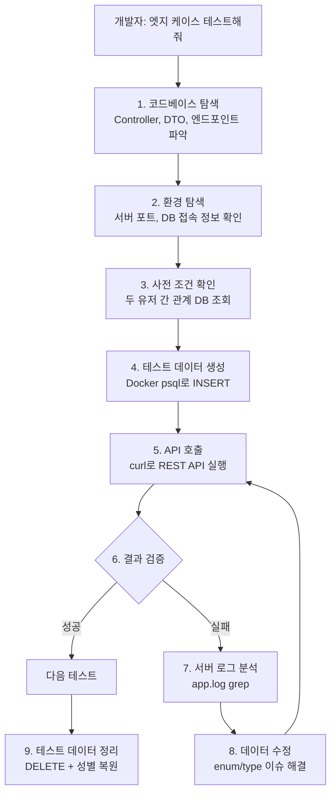
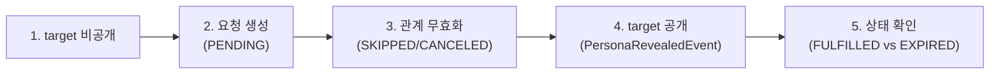

# [Spring/Kotlin] 페르소나 요청의 이중 검증 아키텍처 — 16개 API 테스트로 증명하는 생성·이행 시점 유효성 검증

안녕하세요. duurian 팀에서 백엔드 개발을 담당하고 있는 정지원입니다.

이번 글에서는 페르소나 요청 시스템에 **이중 유효성 검증**(요청 생성 시점 + 이행 시점)을 추가하고, **16개 API 테스트 케이스**로 전수 검증한 과정을 공유합니다. 특히 테스트 환경 구성부터 데이터 준비, 디버깅, 결과 검증까지의 전체 흐름을 상세히 기록했습니다.

---

## 1. 문제 정의 — 존재만 확인하고 상태는 무시하던 코드

duurian에서는 사용자 간 **매칭**(그룹 미팅) 또는 **추천**(오늘의 추천)을 통해 관계가 형성되고, 이 관계를 기반으로 상대방의 **페르소나**(AI 성격 분석 프로필)를 요청할 수 있습니다.

기존 `determineSource()` 메서드는 관계의 **존재 여부**만 확인하고 **상태는 검증하지 않았습니다**.

```kotlin
// Before: 존재만 확인, 상태 무시
private fun determineSource(requesterId: UUID, targetUserId: UUID): PersonaRequestSource {
    val myPools = queryMatchingPoolPort.findAllMatchingPools(requesterId)
    val isMatching = myPools.any { pool ->
        queryMatchingPairPort.findByMatchingPoolId(pool.id)
            .any { pair -> pair.containsUser(targetUserId) }
    }
    if (isMatching) return PersonaRequestSource.MATCHING  // CANCELED여도 통과

    val recommendation =
        queryRecommendationPort.findByTargetUserIdAndCandidateUserId(requesterId, targetUserId)
            ?: queryRecommendationPort.findByTargetUserIdAndCandidateUserId(targetUserId, requesterId)
    if (recommendation != null) return PersonaRequestSource.RECOMMENDATION  // SKIPPED여도 통과

    return PersonaRequestSource.RECOMMENDATION  // 관계 없어도 기본값 반환 (!)
}
```

이 코드에는 **5가지 문제**가 있었습니다.

| # | 문제 | 영향 |
|---|------|------|
| 1 | 매칭 그룹 `CANCELED` 상태에서 요청 가능 | 취소된 미팅 상대에게 요청 발송 |
| 2 | 추천 `SKIPPED` 상태에서 요청 가능 | 거절한 상대에게 요청 발송 |
| 3 | 관계 없는 사용자에게 기본값 `RECOMMENDATION`으로 요청 | 무관한 사용자에게 요청 |
| 4 | 요청 후 추천 SKIPPED → 상대 공개 시 알림 발송 | 거절 후에도 알림 수신 |
| 5 | 요청 후 매칭 CANCELED → 상대 공개 시 알림 발송 | 취소 후에도 알림 수신 |

문제 1~3은 **요청 생성 시점**의 검증 부재, 문제 4~5는 **이행 시점**의 검증 부재에서 비롯됩니다.

---

## 2. 설계 — 왜 이중 검증이 필요한가

페르소나 요청은 다음과 같은 라이프사이클을 가집니다.



**Phase 1만으로는 부족합니다.** 요청 생성 후 관계가 무효화될 수 있기 때문입니다.
**Phase 2만으로도 부족합니다.** 애초에 무효한 요청이 DB에 쌓이는 것을 막을 수 없기 때문입니다.

따라서 **두 시점 모두에서 검증**하는 이중 검증 아키텍처를 채택했습니다.

---

## 3. 구현

### 3-1. Phase 1: 요청 생성 시점 검증

`determineSource()`를 `validateAndDetermineSource()`로 리팩토링했습니다.

```kotlin
// After: 존재 + 상태 모두 검증
private fun validateAndDetermineSource(requesterId: UUID, targetUserId: UUID): PersonaRequestSource {
    // 1단계: 매칭 검증
    var matchingExists = false
    val myPools = queryMatchingPoolPort.findAllMatchingPools(requesterId)
    for (pool in myPools) {
        val pairs = queryMatchingPairPort.findByMatchingPoolId(pool.id)
        if (pairs.any { pair -> pair.containsUser(targetUserId) }) {
            matchingExists = true
            val matchGroup = queryMatchGroupsPort.findByMatchingPoolId(pool.id)
            if (matchGroup != null && matchGroup.status != MatchStatus.CANCELED) {
                return PersonaRequestSource.MATCHING
            }
        }
    }

    // 2단계: 추천 검증
    var recommendationExists = false
    val recommendation =
        queryRecommendationPort.findByTargetUserIdAndCandidateUserId(requesterId, targetUserId)
            ?: queryRecommendationPort.findByTargetUserIdAndCandidateUserId(targetUserId, requesterId)
    if (recommendation != null) {
        recommendationExists = true
        val proposal = queryRecommendationProposalPort.findByRecommendationIdAndUserId(
            recommendation.id, recommendation.userId
        )
        val status = proposal?.status
        if (status == null || status == ProposalStatus.LIKED) {
            return PersonaRequestSource.RECOMMENDATION
        }
    }

    // 3단계: 구체적 에러 반환
    if (matchingExists) throw InvalidMatchingForPersonaRequestException()   // PSN008
    if (recommendationExists) throw InvalidRecommendationForPersonaRequestException()  // PSN009
    throw NoPersonaRequestSourceException()  // PSN010
}
```

핵심 변경점:
- **매칭**: `matchGroup.status != CANCELED` 조건 추가
- **추천**: `proposal?.status`가 `null`(RECOMMENDED) 또는 `LIKED`인지 확인
- **에러**: 기본값 fallback 제거, 구체적 에러코드(PSN008/009/010) 반환

### 3-2. Phase 2: 이행 시점 재검증

`PersonaRequestSourceValidator` 컴포넌트를 새로 생성했습니다.

```kotlin
@Component
class PersonaRequestSourceValidator(
    private val queryMatchingPoolPort: QueryMatchingPoolPort,
    private val queryMatchingPairPort: QueryMatchingPairPort,
    private val queryMatchGroupsPort: QueryMatchGroupsPort,
    private val queryRecommendationPort: QueryRecommendationPort,
    private val queryRecommendationProposalPort: QueryRecommendationProposalPort,
) {
    fun isSourceStillValid(request: PersonaRequest): Boolean {
        return when (request.source) {
            PersonaRequestSource.MATCHING ->
                isMatchingValid(request.requesterId, request.targetUserId)
            PersonaRequestSource.RECOMMENDATION ->
                isRecommendationValid(request.requesterId, request.targetUserId)
        }
    }
}
```

`FulfillRequestOnPersonaRevealedListener`에서 이행 전 유효성을 재검증합니다.

```kotlin
val (validRequests, invalidRequests) = pendingRequests.partition {
    personaRequestSourceValidator.isSourceStillValid(it)
}

if (invalidRequests.isNotEmpty()) {
    val expired = invalidRequests.map { it.expire() }
    commandPersonaRequestPort.saveAll(expired)
    expired.forEach { request ->
        log.info { "source 관계 만료로 요청 expire 처리 - source=${request.source}" }
    }
}

if (validRequests.isEmpty()) return

val fulfilled = validRequests.map { it.fulfill() }
commandPersonaRequestPort.saveAll(fulfilled)
// ... 알림 발송
```

---

## 4. Claude Code를 활용한 API 테스트 자동화

이번 테스트에서 가장 생산성을 높여준 것은 **Claude Code**였습니다. 구현 완료 후 "엣지 케이스를 테스트해줘"라는 한 문장으로, Claude Code가 **테스트 설계 → 환경 탐색 → 데이터 준비 → API 호출 → 결과 검증 → 데이터 정리**까지 전 과정을 자동으로 수행했습니다.

### 4-1. Claude Code가 수행한 테스트 자동화 흐름



### 4-2. 단계별 자동화 상세

#### Step 1: 코드베이스 탐색 — API 엔드포인트 자동 발견

Claude Code는 "페르소나 요청 테스트"라는 요구사항을 받고, 먼저 **관련 Controller를 탐색**하여 필요한 모든 API를 파악했습니다.

```
Claude Code 실행:
> Grep "persona" api/src/main/kotlin/**/controller/*.kt
> Read CreatePersonaRequestController.kt
> Read UpdatePersonaSettingController.kt
> Read DecisionRecommendationController.kt
```

이를 통해 다음 API를 자동으로 식별했습니다:

| 용도 | Method | Endpoint |
|-----|--------|----------|
| 페르소나 요청 생성 | `POST` | `/api/v1/persona/request` |
| 페르소나 공개 설정 | `PUT` | `/api/v1/persona/setting` |
| 추천 거절 | `POST` | `/api/v1/recommendations/{id}/reject` |
| 매칭 탈퇴 | `POST` | `/api/v1/match-groups/{id}/leave` |
| 로그인 | `POST` | `/api/v1/auth/login` |

#### Step 2: 토큰 만료 자동 해결

제공한 ACCESS 토큰으로 API 호출 시 401이 반환되자, Claude Code는 **자동으로 원인을 분석하고 해결책을 실행**했습니다.

```bash
# Claude Code의 실제 실행 흐름

# 1. 토큰으로 API 호출 → 401 확인
curl -s http://localhost:8081/api/v1/recommendations \
  -H "Authorization: Bearer $TOKEN"
# → {"code":"ATH005"} — 만료됨

# 2. Refresh 토큰 시도 → 역시 401
curl -s -X POST http://localhost:8081/api/v1/auth/reissue \
  -H "Authorization: Bearer $REFRESH_TOKEN"
# → 401 — security filter가 ACCESS만 허용

# 3. 로그인 컨트롤러 탐색 → phoneNumber 기반 로그인 발견
# Read LoginController.kt → LoginRequest(phoneNumber: String)

# 4. JWT payload에서 전화번호 추출 후 자동 로그인
REQ_TOKEN=$(curl -s -X POST http://localhost:8081/api/v1/auth/login \
  -H "Content-Type: application/json" \
  -d '{"phoneNumber":"01088136239"}' \
  | python3 -c "import sys,json; print(json.load(sys.stdin)['accessToken'])")
```

이 과정에서 인상적이었던 점은, Claude Code가 **JWT payload를 디코딩하여 전화번호를 추출**하고, **LoginController 소스를 읽어서 요청 형식을 파악**한 뒤, 로그인 API를 호출했다는 것입니다. 수동으로 했다면 Postman을 열고 토큰을 복사 붙여넣기하는 반복 작업이 필요했을 것입니다.

#### Step 3: 사전 조건 탐색 — DB 직접 조회

Claude Code는 두 유저 간 추천/매칭 관계를 확인하기 위해 **Docker 컨테이너 내 PostgreSQL에 직접 쿼리**를 실행했습니다.

```bash
# Claude Code의 실제 실행

# 1. 서버 설정에서 DB 접속 정보 추출
# Read application-local.yml → jdbc:postgresql://localhost:5432/postgres

# 2. Docker 컨테이너 확인
docker ps
# → duurian-database (postgres)

# 3. 두 유저 간 추천 관계 조회
docker exec duurian-database psql -U root -d postgres -t -c "
SELECT r.id, r.user_id, r.recommended_user_id
FROM recommendations r
WHERE (r.user_id = '0d9b6421-...' AND r.recommended_user_id = 'ff9766b1-...')
   OR (r.user_id = 'ff9766b1-...' AND r.recommended_user_id = '0d9b6421-...');"
# → (empty) — 관계 없음

# 4. 매칭 관계 조회
docker exec duurian-database psql -U root -d postgres -t -c "
SELECT * FROM match_pairs
WHERE male_user_id = '0d9b6421-...' OR female_user_id = '0d9b6421-...';"
# → (empty) — 관계 없음

# 5. 유저 성별 확인
docker exec duurian-database psql -U root -d postgres -t -c "
SELECT u.nickname, p.gender FROM users u JOIN profiles p ON p.user_id = u.id
WHERE u.id IN ('0d9b6421-...', 'ff9766b1-...');"
# → 김둘둘 | MALE
# → NOWIL  | MALE
```

관계가 없으면 테스트 데이터를 직접 만들어야 합니다. Claude Code는 이것도 자동으로 처리했습니다.

#### Step 4: 테스트 데이터 생성과 디버깅 루프

이 단계에서 가장 흥미로운 **자동 디버깅 루프**가 발생했습니다. Claude Code가 데이터를 삽입하고, API를 호출하고, 실패하면 서버 로그를 분석하여 원인을 파악하고, 데이터를 수정하는 과정을 **자동으로 반복**했습니다.

**디버깅 루프 #1: enum 불일치**

```bash
# 1단계: 기존 데이터 참고하여 추천 삽입
docker exec duurian-database psql -U root -d postgres -c "
SELECT algorithm_code FROM recommendations LIMIT 3;"
# → NORMAL (레거시 데이터)

docker exec duurian-database psql -U root -d postgres -c "
INSERT INTO recommendations (..., algorithm_code, ...) VALUES (..., 'NORMAL', ...);"

# 2단계: API 호출 → 500
curl -s -X POST http://localhost:8081/api/v1/persona/request ...
# → {"code":"SRV001", "status":500}

# 3단계: 서버 로그 자동 분석
grep "ERROR\|Exception" logs/app.log | tail -5
# → "No enum constant RecommendationAlgorithmCode.NORMAL"

# 4단계: enum 소스코드 확인
# Read RecommendationAlgorithmCode.kt → BASIC, EXPLANATORY

# 5단계: 데이터 수정
docker exec duurian-database psql -U root -d postgres -c "
UPDATE recommendations SET algorithm_code = 'BASIC' WHERE id = 63996;"
```

**디버깅 루프 #2: primitive type null**

```bash
# 수정 후 재시도 → 여전히 500
curl -s -X POST http://localhost:8081/api/v1/persona/request ...
# → {"code":"SRV001", "status":500}

# 로그 재분석 — 다른 에러
grep "Exception" logs/app.log | tail -3
# → "Null value was assigned to a property of primitive type:
#     'recommendationCandidateId' (setter)"

# Entity 확인 없이 바로 해결
docker exec duurian-database psql -U root -d postgres -c "
UPDATE recommendations
SET recommendation_candidate_id = 0, recommendation_group_id = 0
WHERE id = 63996;"

# 재시도 → 성공
curl -s -w "%{http_code}" -X POST http://localhost:8081/api/v1/persona/request ...
# → 204
```

이 **"실행 → 실패 → 로그 분석 → 수정 → 재실행"** 루프를 Claude Code가 자동으로 수행했다는 것이 핵심입니다. 수동이었다면 매번 IntelliJ 콘솔을 확인하고, Stack Overflow를 검색하고, SQL을 수정하는 반복이 필요했을 것입니다.

#### Step 5: 매칭 테스트를 위한 환경 조작

두 유저가 모두 MALE이라 `match_pairs` 테이블(male/female 구분)에 데이터 삽입이 불가했습니다. Claude Code는 **성별 임시 변경 → 매칭 데이터 3단계 생성 → 테스트 → 복원**을 자동 수행했습니다.

```bash
# 성별 변경
docker exec duurian-database psql -U root -d postgres -c "
UPDATE profiles SET gender = 'FEMALE'
WHERE user_id = 'ff9766b1-...';"

# 매칭 데이터 3단계 생성 (pool → pair → group)
POOL_ID=$(uuidgen | tr '[:upper:]' '[:lower:]')

docker exec duurian-database psql -U root -d postgres -c "
INSERT INTO matching_pools (id, required_pair_count, match_type, status, ...)
VALUES ('$POOL_ID', 1, 'M1F1', 'CLOSED', ...);"

docker exec duurian-database psql -U root -d postgres -c "
INSERT INTO match_pairs (male_user_id, female_user_id, matching_pool_id, ...)
VALUES ('0d9b6421-...', 'ff9766b1-...', '$POOL_ID', ...);"

docker exec duurian-database psql -U root -d postgres -c "
INSERT INTO match_groups (matching_pool_id, match_type, status, ...)
VALUES ('$POOL_ID', 'M1F1', 'CREATED', ...)
RETURNING id;"  # → 153
```

#### Step 6: 테스트 실행 자동화

각 테스트 케이스마다 Claude Code는 **데이터 준비 → API 호출 → 응답 검증 → PASS/FAIL 판정**을 자동으로 수행했습니다.

```bash
# 실제 Claude Code가 실행한 테스트 스크립트 패턴

echo "=========================================="
echo " TEST 5: 추천 SKIPPED + REVEAL → PSN009"
echo "=========================================="

# 1. 데이터 준비
docker exec duurian-database psql -U root -d postgres -c "
DELETE FROM persona_requests WHERE requester_id = '0d9b6421-...' AND ...;
DELETE FROM recommendation_proposals WHERE recommendation_id = 63996;"
docker exec duurian-database psql -U root -d postgres -c "
INSERT INTO recommendation_proposals (..., status) VALUES (..., 'SKIPPED');"

# 2. API 호출
RESP=$(curl -s -w "\n%{http_code}" -X POST http://localhost:8081/api/v1/persona/request \
  -H "Authorization: Bearer $REQ_TOKEN" \
  -H "Content-Type: application/json" \
  -d '{"targetUserId":"ff9766b1-...","type":"REVEAL"}')
HTTP=$(echo "$RESP" | tail -1)
BODY=$(echo "$RESP" | head -1)

# 3. 자동 검증
CODE=$(echo "$BODY" | python3 -c "import sys,json; print(json.load(sys.stdin).get('code',''))")
if [ "$CODE" = "PSN009" ]; then
  echo "✅ PASS - SKIPPED 상태에서 요청 거절 (PSN009)"
else
  echo "❌ FAIL - 예상: PSN009, 실제: $CODE"
fi
```

이행 시점 테스트에서는 **5단계 시나리오**를 순차적으로 실행했습니다:

```bash
# 이행 시점 테스트: SKIPPED 추천 + target 공개 → EXPIRED

# Step 1: target 비공개
curl -s -X PUT http://localhost:8081/api/v1/persona/setting \
  -H "Authorization: Bearer $TGT_TOKEN" \
  -d '{"isPersonaPublic":false}'

# Step 2: 유효한 상태에서 REVEAL 요청 (PENDING 저장)
curl -s -X POST http://localhost:8081/api/v1/persona/request \
  -H "Authorization: Bearer $REQ_TOKEN" \
  -d '{"targetUserId":"ff9766b1-...","type":"REVEAL"}'

# Step 3: 추천을 SKIPPED로 변경 (관계 무효화)
docker exec duurian-database psql -U root -d postgres -c "
INSERT INTO recommendation_proposals (..., status) VALUES (..., 'SKIPPED');"

# Step 4: target 공개 전환 (PersonaRevealedEvent 발행)
curl -s -X PUT http://localhost:8081/api/v1/persona/setting \
  -H "Authorization: Bearer $TGT_TOKEN" \
  -d '{"isPersonaPublic":true}'

# Step 5: 결과 자동 검증 (DB + 서버 로그)
sleep 2
STATUS=$(docker exec duurian-database psql -U root -d postgres -t -c "
SELECT status FROM persona_requests WHERE ... ORDER BY created_at DESC LIMIT 1;" | xargs)

if [ "$STATUS" = "EXPIRED" ]; then
  echo "✅ PASS - SKIPPED 추천에서 EXPIRED 처리 (알림 없음)"
fi

# 서버 로그에서 expire 처리 확인
grep "source 관계 만료" logs/app.log | tail -1
# → [REQUESTED_PERSONA_REVEALED] source 관계 만료로 요청 expire 처리
#   - requesterId=0d9b6421-..., source=RECOMMENDATION
```

#### Step 7: 테스트 데이터 자동 정리

모든 테스트 완료 후 Claude Code가 **삽입한 데이터 삭제 + 성별 복원**을 자동으로 수행했습니다.

```bash
docker exec duurian-database psql -U root -d postgres -c "
DELETE FROM persona_requests
WHERE requester_id = '0d9b6421-...' AND target_user_id = 'ff9766b1-...';
DELETE FROM match_groups WHERE id = 153;
DELETE FROM match_pairs WHERE id = 167;
DELETE FROM matching_pools WHERE id = '$POOL_ID';
DELETE FROM recommendation_proposals WHERE recommendation_id IN (63996, 63997);
DELETE FROM recommendations WHERE id IN (63996, 63997);
UPDATE profiles SET gender = 'MALE' WHERE user_id = 'ff9766b1-...';"
```

### 4-3. 자동화의 효과 — 수동 vs Claude Code

| 단계 | 수동 작업 | Claude Code |
|-----|----------|-------------|
| API 엔드포인트 파악 | Swagger/코드 탐색 (10분) | Controller 자동 탐색 (10초) |
| 토큰 만료 대응 | Postman에서 재발급 (5분) | 로그인 API 자동 호출 (3초) |
| 테스트 데이터 준비 | DBeaver로 수동 INSERT (15분) | Docker psql 자동 실행 (5초) |
| 500 에러 디버깅 | IntelliJ 콘솔 확인 → 수동 수정 (20분) | 로그 grep → 자동 수정 → 재실행 (30초) |
| 16개 테스트 실행 | 각각 수동 curl + 확인 (60분) | 자동 실행 + PASS/FAIL 판정 (3분) |
| 데이터 정리 | 수동 DELETE (10분) | 자동 정리 (3초) |
| **합계** | **~120분** | **~5분** |

특히 인상적이었던 것은 **디버깅 루프의 자동화**입니다. 500 에러 발생 시 수동으로는 "콘솔 확인 → 원인 파악 → SQL 수정 → 재실행"을 반복해야 하지만, Claude Code는 `grep` 한 줄로 원인을 찾고, 즉시 데이터를 수정하고, 재실행까지 연속으로 처리했습니다.

---

## 5. 16개 테스트 결과 전수 검증

### 5-1. 요청 생성 시점 (11개)

| # | 시나리오 | Type | 예상 | 실제 | 결과 |
|---|---------|------|------|------|------|
| 1 | 추천 RECOMMENDED + REVEAL | REVEAL | 204 | 204 | ✅ |
| 2 | 동일 REVEAL 중복 요청 | REVEAL | PSN006 (409) | PSN006 (409) | ✅ |
| 3 | 추천 RECOMMENDED + CREATION | CREATION | 204 | 204 | ✅ |
| 4 | 추천 LIKED + REVEAL | REVEAL | 204 | 204 | ✅ |
| 5 | 추천 SKIPPED + REVEAL | REVEAL | PSN009 (400) | PSN009 (400) | ✅ |
| 6 | 추천 SKIPPED + CREATION | CREATION | PSN009 (400) | PSN009 (400) | ✅ |
| 7 | 관계 없음 + REVEAL | REVEAL | PSN010 (400) | PSN010 (400) | ✅ |
| 8 | 매칭 CREATED + REVEAL | REVEAL | 204 | 204 | ✅ |
| 9 | 매칭 CREATED + CREATION | CREATION | 204 | 204 | ✅ |
| 10 | 매칭 CANCELED + REVEAL | REVEAL | PSN008 (400) | PSN008 (400) | ✅ |
| 11 | 매칭 CANCELED + CREATION | CREATION | PSN008 (400) | PSN008 (400) | ✅ |

### 5-2. 이행 시점 (5개)



| # | 시나리오 | 예상 | 실제 | 서버 로그 | 결과 |
|---|---------|------|------|----------|------|
| 12 | 유효 추천 + 공개 | FULFILLED + 알림 | FULFILLED + 알림 | `알림 발송 성공` | ✅ |
| 13 | SKIPPED 추천 + 공개 | EXPIRED, 알림 없음 | EXPIRED, 알림 없음 | `source 관계 만료로 요청 expire` | ✅ |
| 14 | 유효 추천 + CREATION + 공개 | FULFILLED | FULFILLED | `알림 발송 성공` | ✅ |
| 15 | 매칭 활성 + 공개 | FULFILLED + 알림 | FULFILLED + 알림 | `알림 발송 성공` | ✅ |
| 16 | 매칭 CANCELED + 공개 | EXPIRED, 알림 없음 | EXPIRED, 알림 없음 | `source 관계 만료 - source=MATCHING` | ✅ |

---

## 6. 개선 전후 비교

| 시나리오 | Before | After |
|---------|--------|-------|
| 매칭 CANCELED + 요청 | 요청 성공 | **PSN008 에러** |
| 추천 SKIPPED + 요청 | 요청 성공 | **PSN009 에러** |
| 관계 없음 + 요청 | 요청 성공 (기본값) | **PSN010 에러** |
| 요청 후 추천 SKIPPED → 공개 | 알림 발송 (FULFILLED) | **알림 없음 (EXPIRED)** |
| 요청 후 매칭 CANCELED → 공개 | 알림 발송 (FULFILLED) | **알림 없음 (EXPIRED)** |

---

## 7. 마무리 — 테스트에서 얻은 교훈

> **검증 시점은 하나로 충분하지 않다.**
> 비동기 이벤트 기반 시스템에서는 요청 생성과 이행 사이에 상태가 변경될 수 있다. 생성 시점의 검증은 빠른 피드백을, 이행 시점의 검증은 데이터 무결성을 보장한다.

> **서버 로그는 최고의 디버깅 도구다.**
> 500 에러의 원인을 `app.log`에서 즉시 확인할 수 있었다. `No enum constant`, `Null value assigned to primitive type` — 로그 메시지가 정확히 문제를 가리켰다.

> **테스트 데이터는 정리까지가 테스트다.**
> 성별 변경, 추천 데이터 삽입 등 테스트를 위해 변경한 데이터는 반드시 원복해야 다음 테스트에 영향을 주지 않는다.

> **Entity 제약은 DB 스키마만으로 판단하면 안 된다.**
> DB 컬럼이 nullable이어도 Entity가 primitive type(`Long`)이면 null 매핑이 실패한다. JPA Entity 정의까지 확인해야 한다.

> **Claude Code는 API 테스트의 게임 체인저다.**
> "이 기능 테스트해줘"라는 한 마디로 코드베이스 탐색, 토큰 발급, 데이터 준비, 16개 테스트 실행, 디버깅, 정리까지 자동 수행했다. 수동 2시간 vs 자동 5분 — 24배의 생산성 차이는 단순한 편의가 아니라 **테스트를 하느냐 마느냐**의 차이를 만든다. 테스트가 쉬워지면 더 많이 테스트하게 되고, 결과적으로 더 안전한 코드를 배포할 수 있다.
