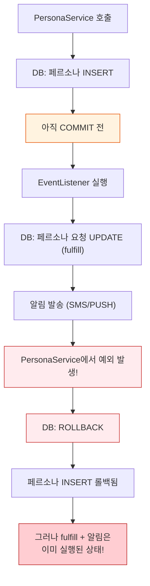
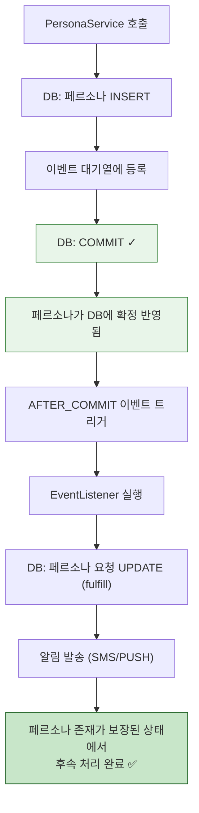
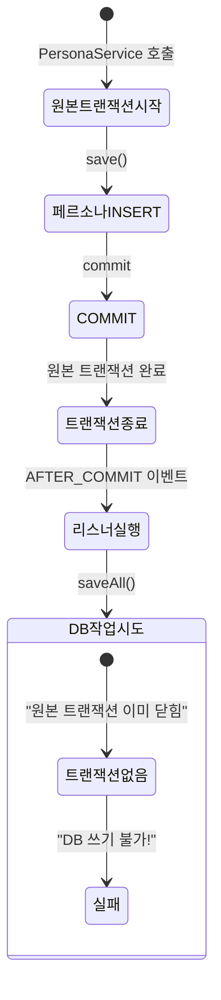
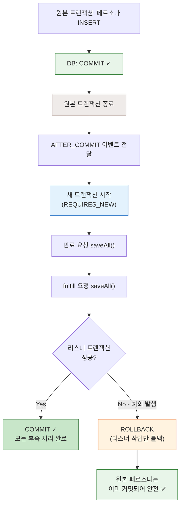
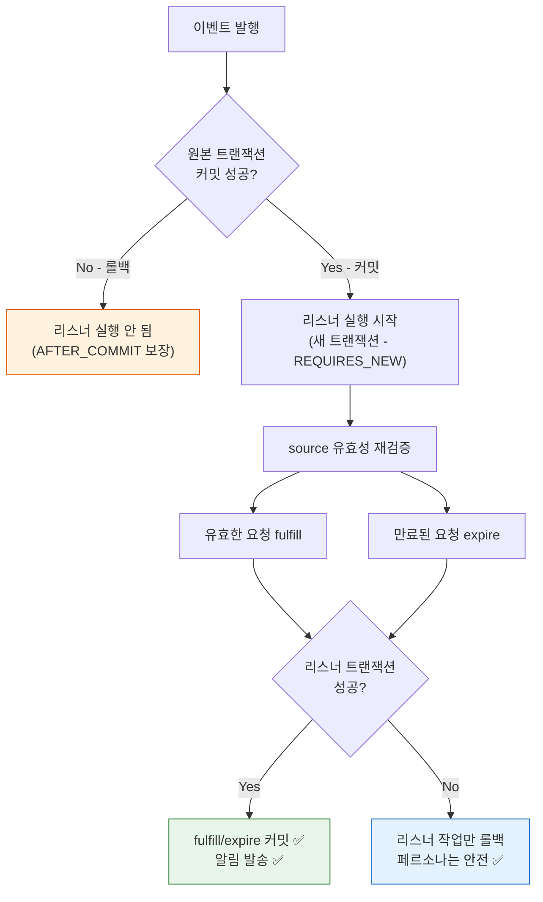

# [Spring/Kotlin] @TransactionalEventListener + REQUIRES_NEW 깊이 파헤치기

안녕하세요. duurian 팀에서 백엔드 개발을 담당하고 있는 정지원입니다.

이전 글 시리즈에서는 코루틴과 트랜잭션의 다양한 함정을 다뤘습니다.

- [suspend 함수와 @Transactional의 위험한 조합](/posts/kotlin-coroutine-transactional-danger/) — ThreadLocal 기반 트랜잭션 컨텍스트 유실
- [@Transactional 내부 코루틴의 트랜잭션 가시성 문제](/posts/spring-transactional-event-listener-coroutine-visibility/) — 미커밋 데이터를 코루틴에서 읽지 못하는 문제
- [비동기 보상 시스템에서 만난 트랜잭션 가시성 문제](/posts/spring-async-reward-transaction-visibility/) — 대화 종료와 보상 생성의 책임 분리

이번 글에서는 한 걸음 더 들어가, `@TransactionalEventListener`와 `@Transactional(propagation = Propagation.REQUIRES_NEW)` 조합이 **왜 필요한지**, 각각 빠졌을 때 어떤 문제가 발생하는지를 실제 프로덕션 코드 기반으로 분석합니다.

---

## 1. 배경: 실제 코드에서 출발하기

듀리안 서버에서는 **페르소나(Persona)**가 생성되면, 해당 유저를 대상으로 대기 중이던 페르소나 요청(PersonaRequest)들을 이행(fulfill)하는 이벤트 리스너가 존재합니다.

```kotlin
@Component
class FulfillRequestOnPersonaCreatedListener(
    private val queryPersonaRequestPort: QueryPersonaRequestPort,
    private val commandPersonaRequestPort: CommandPersonaRequestPort,
    private val sendNotificationUseCase: SendNotificationUseCase,
    private val personaRequestSourceValidator: PersonaRequestSourceValidator,
) {
    @Transactional(propagation = Propagation.REQUIRES_NEW)
    @TransactionalEventListener(phase = TransactionPhase.AFTER_COMMIT)
    fun handle(event: PersonaCreatedEvent) {
        val pendingRequests = queryPersonaRequestPort.findPendingByTargetAndType(
            event.userId, PersonaRequestType.CREATION
        )
        if (pendingRequests.isEmpty()) return

        // source 관계 유효성 재검증
        val (validRequests, invalidRequests) = pendingRequests.partition {
            personaRequestSourceValidator.isSourceStillValid(it)
        }

        // 유효하지 않은 요청 -> expire 처리
        if (invalidRequests.isNotEmpty()) {
            commandPersonaRequestPort.saveAll(invalidRequests.map { it.expire() })
        }

        // 유효한 요청 -> fulfill 처리 + 알림 발송
        val fulfilled = validRequests.map { it.fulfill() }
        commandPersonaRequestPort.saveAll(fulfilled)
        // ... 알림 발송 로직
    }
}
```

이 코드에서 두 개의 어노테이션이 각각 어떤 역할을 하는지 하나씩 분석해보겠습니다.

---

## 2. @TransactionalEventListener(phase = AFTER_COMMIT)

### 2.1 이게 없으면? — 일반 @EventListener의 문제

일반 `@EventListener`는 **이벤트를 발행한 트랜잭션이 아직 진행 중인 시점**에 실행됩니다.



<div class="notice--warning" markdown="1">
**핵심 문제**: 페르소나 생성이 롤백되었는데, 이미 요청은 fulfill 처리되고 알림까지 발송된 상태가 됩니다. 일반 `@EventListener`는 트랜잭션의 성공/실패와 무관하게 즉시 실행되기 때문에, 원본 트랜잭션이 롤백되어도 부수 효과(side effect)를 되돌릴 수 없습니다.
</div>

### 2.2 AFTER_COMMIT이 해결하는 것

`@TransactionalEventListener(phase = TransactionPhase.AFTER_COMMIT)`을 사용하면, **이벤트 발행 트랜잭션이 성공적으로 커밋된 후에만** 리스너가 실행됩니다.



<div class="notice--success" markdown="1">
**보장 사항**: 리스너가 실행되는 시점에 페르소나는 이미 DB에 확정 반영된 상태입니다. 원본 트랜잭션이 롤백되면 리스너 자체가 실행되지 않으므로, 정합성이 깨질 여지가 없습니다.
</div>

### 2.3 TransactionPhase 옵션 비교

| Phase | 실행 시점 | 사용 시나리오 |
|-------|----------|-------------|
| `BEFORE_COMMIT` | 커밋 직전 | 커밋 전 유효성 검증이 필요한 경우 |
| **`AFTER_COMMIT`** | **커밋 성공 후** | **알림 발송, 후속 상태 변경 등 부수 효과** |
| `AFTER_ROLLBACK` | 롤백 후 | 실패 알림, 보상 트랜잭션 |
| `AFTER_COMPLETION` | 커밋/롤백 후 | 리소스 정리 등 결과와 무관한 처리 |

---

## 3. @Transactional(propagation = Propagation.REQUIRES_NEW)

### 3.1 이게 없으면? — AFTER_COMMIT의 함정

`AFTER_COMMIT` 시점에는 **원본 트랜잭션이 이미 종료(커밋 완료)된 상태**입니다. 이때 트랜잭션 전파 설정 없이 DB 작업을 수행하면 어떻게 될까요?



<div class="notice--warning" markdown="1">
**핵심 문제**: `AFTER_COMMIT` 시점에서 원본 트랜잭션은 이미 완료되었습니다. 트랜잭션 전파 설정이 없으면 리스너의 DB 작업이 트랜잭션 컨텍스트 없이 실행되어, 쓰기 작업이 실패하거나 부분적으로만 적용될 수 있습니다.
</div>

### 3.2 왜 REQUIRES_NEW인가? — 다른 전파 옵션과의 비교

| 전파 옵션 | 동작 | AFTER_COMMIT에서의 결과 |
|----------|------|----------------------|
| `REQUIRED` (기본값) | 기존 트랜잭션 참여, 없으면 새로 생성 | 원본 트랜잭션이 이미 닫혀서 "참여"할 대상 없음. 새 트랜잭션을 열긴 하지만 Spring 내부 구현에 따라 **예측 불가능한 동작** 가능 |
| **`REQUIRES_NEW`** | **항상 새 트랜잭션 생성** | **명시적으로 독립 트랜잭션 생성 → 안전하게 DB 작업 수행** |
| `MANDATORY` | 기존 트랜잭션 필수 | 기존 트랜잭션 없으므로 즉시 예외 발생 |
| `SUPPORTS` | 트랜잭션 있으면 참여, 없으면 없이 실행 | 트랜잭션 없이 실행 → 부분 실패 위험 |

`REQUIRES_NEW`만이 **"원본 트랜잭션 상태와 무관하게, 확실히 새로운 트랜잭션에서 동작한다"**는 것을 보장합니다.

### 3.3 독립 트랜잭션의 장점: 격리와 안전성



<div class="notice--info" markdown="1">
**격리 효과**: 리스너의 성공/실패가 원본 트랜잭션에 전혀 영향을 주지 않습니다. 리스너에서 예외가 발생해도 이미 커밋된 페르소나 데이터는 안전하게 유지됩니다. 반대로 원본 트랜잭션의 상태에도 의존하지 않으므로, 독립적인 트랜잭션 경계 안에서 안전하게 DB 작업을 수행할 수 있습니다.
</div>

---

## 4. 두 어노테이션의 시너지 효과

### 4.1 각각의 역할 정리

| 어노테이션 | 역할 | 없을 때의 문제 |
|-----------|------|--------------|
| `@TransactionalEventListener(AFTER_COMMIT)` | 원본 트랜잭션 커밋 후에만 실행 | 원본 롤백 시에도 리스너 실행 → 정합성 붕괴 |
| `@Transactional(REQUIRES_NEW)` | 독립된 새 트랜잭션에서 실행 | 트랜잭션 컨텍스트 없음 → DB 쓰기 실패/부분 실패 |

### 4.2 조합이 만드는 안전한 실행 흐름



- **`AFTER_COMMIT`이 "언제" 실행할지를 제어합니다** — 원본 데이터가 확정된 후에만 실행
- **`REQUIRES_NEW`가 "어떻게" 실행할지를 제어합니다** — 독립된 트랜잭션에서 안전하게 DB 작업 수행
- 두 어노테이션이 합쳐져 **"원본 트랜잭션의 성공을 전제로, 독립적인 후속 처리를 안전하게 수행한다"**는 패턴을 완성합니다.

---

## 5. 실무에서 주의할 점

### 5.1 이벤트 유실 가능성

`AFTER_COMMIT` 리스너는 **스프링 애플리케이션 메모리에서 동작**합니다. 커밋 직후 서버가 죽으면 이벤트가 유실됩니다.

<div class="notice--warning" markdown="1">
**대응 전략**: 미이행 요청은 별도 배치/스케줄러로 보상 처리할 수 있도록 설계해야 합니다. 현재 코드에서 `findPendingByTargetAndType()`이 PENDING 상태를 조회하는 것 자체가 이 보상 메커니즘의 기반이 됩니다.
</div>

### 5.2 트랜잭션 커넥션 점유

`REQUIRES_NEW`는 **커넥션 풀에서 새 커넥션을 가져옵니다**. 이벤트 발행이 빈번한 경우 커넥션 풀 고갈에 주의해야 합니다.

<div class="notice--info" markdown="1">
**대응 전략**: 대량 이벤트 처리 시 비동기(`@Async`) 조합이나, 배치 처리를 고려할 수 있습니다. `@Async`와 결합하면 이벤트 리스너가 별도 스레드에서 실행되어 원본 트랜잭션의 커넥션을 즉시 반환할 수 있지만, 이 경우 에러 핸들링과 재시도 전략을 별도로 설계해야 합니다.
</div>

### 5.3 자기 호출(Self-invocation) 주의

`@Transactional`은 **프록시 기반**으로 동작합니다. 같은 클래스 내부에서 호출하면 프록시를 거치지 않아 트랜잭션이 적용되지 않습니다. 이벤트 리스너는 Spring이 직접 호출하므로 이 문제가 발생하지 않지만, 리스너 내부에서 같은 빈의 다른 `@Transactional` 메서드를 호출할 때는 주의가 필요합니다.

---

## 6. 정리

> **`@TransactionalEventListener(AFTER_COMMIT)`**: 원본 데이터가 확정된 후에만 실행 → **정합성 보장**
>
> **`@Transactional(REQUIRES_NEW)`**: 독립 트랜잭션에서 안전하게 DB 작업 → **실행 가능성 + 격리 보장**

이 두 어노테이션의 조합은 Spring 이벤트 기반 아키텍처에서 **"원본 트랜잭션의 성공을 전제로, 독립적인 후속 처리를 안전하게 수행한다"**는 패턴의 정석입니다.

---

이전 글 [suspend 함수와 @Transactional의 위험한 조합](/posts/kotlin-coroutine-transactional-danger/), [@Transactional 내부 코루틴의 트랜잭션 가시성 문제](/posts/spring-transactional-event-listener-coroutine-visibility/), [비동기 보상 시스템에서 만난 트랜잭션 가시성 문제](/posts/spring-async-reward-transaction-visibility/)와 함께 읽으면 코루틴 + 트랜잭션의 주요 함정과 해결 패턴을 전체적으로 이해할 수 있습니다.

궁금한 점이나 유사한 경험이 있다면 댓글로 공유해주세요!

## 참고 자료

* [Spring Framework - @TransactionalEventListener](https://docs.spring.io/spring-framework/reference/data-access/transaction/event.html)
* [Spring Framework - Transaction Propagation](https://docs.spring.io/spring-framework/reference/data-access/transaction/declarative/tx-propagation.html)
* [Baeldung - Spring Events](https://www.baeldung.com/spring-events)
* [Baeldung - Transaction Propagation and Isolation](https://www.baeldung.com/spring-transactional-propagation-isolation)
