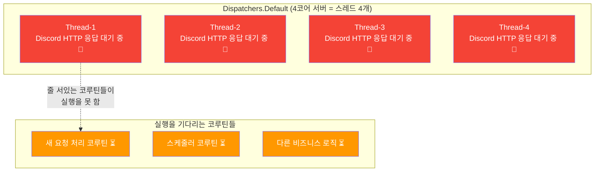
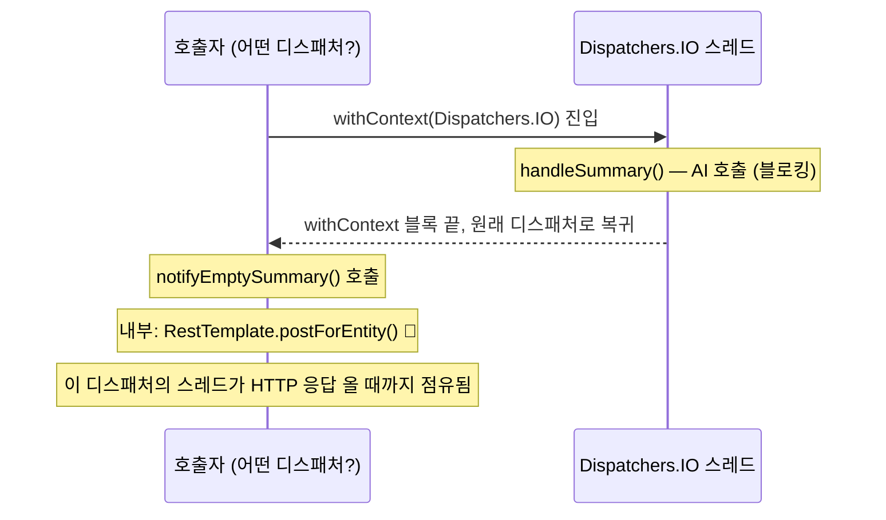
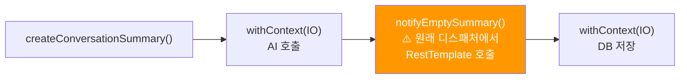
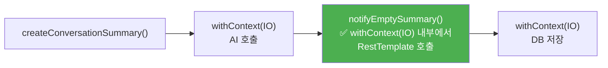

# [Kotlin/Spring] suspend 함수 안에서 블로킹 IO를 호출하면 생기는 일

안녕하세요. duurian 팀에서 백엔드 개발을 하고 있는 정지원입니다.

최근 코드 리뷰에서 `suspend` 함수 안에 `RestTemplate` 호출이 `withContext(Dispatchers.IO)` 없이 쓰인 코드를 발견했습니다. 지금 당장은 동작하고 있었지만 **언제 터질지 모르는 시한폭탄**이었습니다.

이 글에서는 그 문제가 왜 위험한지, 그리고 어떻게 고쳐야 하는지를 처음부터 차근차근 설명해 보겠습니다. 코루틴을 배우는 중이라면 꼭 알아야 할 내용이에요.

---

## 0. 배경 지식 — 스레드와 블로킹 IO가 뭔가요?

본론으로 들어가기 전에, 핵심 개념 두 가지를 짚고 넘어가겠습니다.

### 스레드(Thread)란?

프로그램이 일을 처리하는 **일꾼**이라고 생각하면 됩니다. 서버는 여러 요청을 동시에 처리하기 위해 여러 명의 일꾼(스레드)을 운용합니다. 그런데 일꾼의 수는 한정되어 있습니다.

### 블로킹 IO(Blocking I/O)란?

`RestTemplate`으로 외부 API를 호출하거나, JDBC로 DB 쿼리를 실행할 때, 결과가 올 때까지 **그 스레드는 아무것도 못 하고 멈춰서 기다립니다.** 이렇게 스레드를 점유한 채 대기하는 것을 **블로킹(Blocking)**이라고 합니다.

```
블로킹 상황:

스레드-1: "외부 API 호출했는데..."  🕐  🕑  🕒  "응답 왔다!"
             ← 응답 오는 동안 이 스레드는 아무 것도 못 함 →
```

블로킹 자체는 나쁜 게 아닙니다. **문제는 어떤 스레드 풀에서 블로킹이 일어나느냐**입니다. 이게 이 글의 핵심입니다.

---

## 1. 발생한 상황

### 1.1 구현 배경

AI API를 호출해 대화 요약을 생성하는 서비스에 모니터링 기능을 추가하게 됐습니다. AI가 응답했지만 요약 내용이 비어있는 경우를 감지하고, 디스코드 경고 알림을 보내는 로직이었습니다.

처음 작성한 코드는 이랬습니다.

```kotlin
override suspend fun createConversationSummary(command: CreateConversationSummaryCommand): List<String> {
    // ...
    // IO 디스패처에서 AI 호출 (올바르게 감쌌음)
    val generationResult = withContext(Dispatchers.IO) {
        handleSummary(todayConversations)
    }
    // ↑ 여기서 withContext 블록이 끝남 → 원래 디스패처로 복귀

    val summaries = generationResult.parsedSummaries
    val nonBlankSummaries = summaries.filter { it.isNotBlank() }

    if (nonBlankSummaries.isEmpty()) {
        notifyEmptySummary(        // ← 여기가 문제!
            userId = command.userId,
            rawContent = generationResult.rawContent,
            // ...
        )
    }
    // ...
}

// 문제의 함수
private fun notifyEmptySummary(userId: UUID, ...) {
    try {
        errorNotificationPort.notifyWarning(message)
        //       ↑ 내부에서 RestTemplate.postForEntity() 호출 = 블로킹 HTTP!
    } catch (e: Exception) {
        log.error(e) { "Discord 알림 전송 실패 - userId=$userId" }
    }
}
```

코드 리뷰에서 "Critical" 이슈로 잡혔습니다. 무엇이 문제였을까요?

---

## 2. 문제 분석

### 2.1 suspend 함수는 non-blocking을 보장하지 않는다

코루틴을 처음 배울 때 가장 많이 하는 오해입니다.

> `suspend`는 **"이 함수를 일시 중단할 수 있다"는 뜻이지, "내부 코드가 블로킹하지 않는다"는 뜻이 아닙니다.**

`suspend fun` 안에서 `RestTemplate`이나 `Thread.sleep()` 같은 블로킹 코드를 아무 제약 없이 쓸 수 있습니다. Kotlin 컴파일러도 막아주지 않고, 런타임도 경고를 주지 않습니다.

```kotlin
// ❌ 컴파일은 됩니다. 하지만 이 함수는 블로킹입니다.
suspend fun fetchDataWrong() {
    val result = restTemplate.getForObject(url, String::class.java)  // 블로킹!
    // suspend 키워드가 있어도 이 줄은 스레드를 점유하며 응답을 기다립니다
}

// ✅ 올바른 방법 — withContext(IO)로 블로킹 코드를 감싸준다
suspend fun fetchDataRight() {
    val result = withContext(Dispatchers.IO) {
        restTemplate.getForObject(url, String::class.java)
        // 이제 블로킹이 IO 전용 스레드 풀에서 일어남
    }
}
```

### 2.2 디스패처(Dispatcher)란?

코루틴은 스레드를 직접 관리하지 않고, **디스패처**에게 "이 코루틴을 어떤 스레드에서 실행할지" 맡깁니다. Spring Boot 기반 코루틴 프로젝트에서 자주 쓰는 디스패처는 두 가지입니다.

| 디스패처 | 스레드 풀 크기 | 목적 |
|----------|--------------|------|
| `Dispatchers.Default` | CPU 코어 수 (보통 4~16개) | 계산이 많은 작업 |
| `Dispatchers.IO` | 최대 64개 | 파일, 네트워크, DB 등 **블로킹 IO 전용** |

<div class="notice--info" markdown="1">
**📘 스레드 풀(Thread Pool)이란?**

스레드를 미리 여러 개 만들어 놓고 재사용하는 방식입니다. 요청이 들어올 때마다 새 스레드를 만들면 생성 비용이 크기 때문에, 미리 만들어둔 스레드를 번갈아 사용합니다. 풀에 있는 스레드가 모두 바쁘면 새 작업은 스레드가 빌 때까지 대기합니다.
</div>

### 2.3 왜 Dispatchers.IO와 Default의 스레드 수 차이가 중요한가?

`Dispatchers.Default`는 코어 수만큼만 스레드가 있습니다. 블로킹 HTTP 호출이 이 풀에서 일어나면, 그 스레드는 응답이 오기까지 수십~수백 ms 동안 **아무것도 못 하고 점유됩니다.**

동시에 여러 요청이 들어오면 어떻게 될까요?



4개의 스레드가 모두 Discord API 응답을 기다리느라 묶여 있으면, **다른 코루틴들은 스레드를 받지 못해 실행을 못 합니다.** 이것이 **스레드 기아(Thread Starvation)** 입니다. 서버가 응답을 못 하거나 엄청나게 느려지게 됩니다.

반면 `Dispatchers.IO`는 이런 상황을 위해 설계된 풀로, 최대 64개 스레드를 갖고 있어 블로킹 IO를 동시에 많이 감당할 수 있습니다.

### 2.4 withContext가 끝나면 어떻게 되나?

이제 문제의 코드로 돌아가겠습니다.

```kotlin
// withContext(IO) 블록이 끝나면 원래 디스패처로 복귀합니다
val generationResult = withContext(Dispatchers.IO) {
    handleSummary(todayConversations)
}
// ↑ 이 줄 이후로는 원래 디스패처에서 실행됩니다

// 이 시점에서 어떤 디스패처인지는 "이 함수를 호출한 쪽"에 달려 있습니다
notifyEmptySummary(...)   // ← 내부에서 RestTemplate 블로킹 호출
```

`withContext` 블록이 끝나면 **원래 호출한 코루틴의 디스패처로 돌아옵니다.** 만약 그 디스패처가 `Dispatchers.Default`라면, `notifyEmptySummary()` 안의 블로킹 HTTP 호출이 Default 스레드 풀을 점유하게 됩니다.



### 2.5 그런데 왜 지금은 동작하나?

실제 호출 흐름을 따라가 보면 이렇습니다.

```kotlin
// ProcessConversationPostTurnService.kt
conversationPostTurnScope.launch(Dispatchers.IO) {   // 처음부터 IO에서 시작!
    processPostTurn(userId)
        └── createSummary(userId)
                └── createConversationSummary(...)   // 여전히 IO 위에 있음
}
```

지금은 `createConversationSummary()`가 항상 `Dispatchers.IO`에서 실행되기 때문에, `withContext(IO)` 블록이 끝나도 IO 스레드 풀로 복귀해서 우연히 안전합니다.

<div class="notice--warning" markdown="1">
**⚠️ "지금 동작한다"와 "올바르게 동작한다"는 다릅니다**

이 코드는 현재의 호출 방식 덕분에 우연히 안전할 뿐입니다. 만약 나중에 누군가 이 함수를 다른 곳에서 호출하면 어떻게 될까요?

```kotlin
// 미래에 다른 개발자가 이렇게 호출하면?
someScope.launch(Dispatchers.Default) {
    createConversationSummaryUseCase.createConversationSummary(command)
    // → withContext(IO) 블록 이후 notifyEmptySummary가 Default에서 실행됨
    // → RestTemplate 블로킹이 Default 스레드 풀을 점유
    // → 스레드 기아 발생 가능
}
```

코드에 에러는 없고, 컴파일도 잘 되지만, 트래픽이 몰리는 순간 서버가 멈출 수 있습니다.
</div>

---

## 3. 해결 방법

### 3.1 원칙: 블로킹 코드는 항상 withContext(Dispatchers.IO)로 감싸기

단순합니다. 블로킹 IO가 발생하는 코드는 **어디에 있든** `withContext(Dispatchers.IO)` 블록 안에 있어야 합니다. 그러면 어떤 디스패처에서 호출되든 블로킹은 항상 IO 스레드 풀에서 일어납니다.

### 3.2 코드 수정

`notifyEmptySummary()`를 `suspend fun`으로 바꾸고, 내부에 `withContext(Dispatchers.IO)`를 추가합니다.

```kotlin
// Before ❌ — 어떤 스레드에서 실행될지 보장 없음
private fun notifyEmptySummary(userId: UUID, ...) {
    try {
        errorNotificationPort.notifyWarning(message)  // RestTemplate 블로킹!
    } catch (e: Exception) {
        log.error(e) { "Discord 알림 전송 실패 - userId=$userId" }
    }
}

// After ✅ — 항상 IO 스레드 풀에서 블로킹 실행을 보장
private suspend fun notifyEmptySummary(userId: UUID, ...) {
    withContext(Dispatchers.IO) {           // 명시적으로 IO 디스패처 지정
        try {
            errorNotificationPort.notifyWarning(message)
        } catch (e: Exception) {
            log.error(e) { "Discord 알림 전송 실패 - userId=$userId" }
        }
    }
}
```

`suspend fun`으로 바꾼 이유는 `withContext`가 suspend 함수라서 `suspend` 컨텍스트 안에서만 호출할 수 있기 때문입니다.

### 3.3 수정 후 흐름 비교

**Before** — `notifyEmptySummary()`가 withContext 블록 바깥에서 블로킹 IO 호출



**After** — 블로킹 IO가 항상 IO 풀 안에서 실행



---

## 4. 정리: 어떤 코드가 블로킹인가요?

코루틴 코드를 작성할 때 `withContext(Dispatchers.IO)`로 감싸야 하는 코드들입니다.

| 종류 | 예시 | 이유 |
|------|------|------|
| HTTP 클라이언트 | `RestTemplate`, `OkHttpClient` | 응답 올 때까지 스레드 대기 |
| DB 쿼리 | `JdbcTemplate`, JPA `EntityManager` | DB 결과 올 때까지 스레드 대기 |
| 파일 IO | `File.readText()`, `BufferedReader` | 파일 읽기 완료까지 스레드 대기 |
| 직접 슬립 | `Thread.sleep()` | 지정 시간 동안 스레드 점유 |

반대로, 이미 코루틴 친화적으로 만들어진 라이브러리들은 `withContext` 없이 써도 됩니다.

| 종류 | 예시 |
|------|------|
| 코루틴 기반 HTTP | Spring `WebClient` + `.awaitBody()` |
| 코루틴 기반 DB | R2DBC |
| suspend 확장 함수 | 이미 `suspend fun`으로 래핑된 API |

<div class="notice--info" markdown="1">
**📘 WebClient가 withContext 없이 괜찮은 이유**

`RestTemplate`은 블로킹 방식으로 설계되었지만, Spring `WebClient`는 Reactive(반응형) 방식으로 설계되었습니다. `WebClient`의 코루틴 확장 함수 `.awaitBody()`는 내부적으로 스레드를 점유하지 않고 응답을 기다립니다. 스레드를 빌려 쓰고 응답이 오면 다시 쓰는 방식이라, `Dispatchers.IO` 없이 써도 됩니다.

```kotlin
// WebClient: suspend 친화적, withContext 불필요
val result = webClient.get()
    .uri(url)
    .retrieve()
    .awaitBody<String>()  // 스레드를 점유하지 않음
```
</div>

---

## 5. 마무리

이번 코드 리뷰를 통해 배운 핵심 세 가지를 정리하면:

1. `suspend` **≠ non-blocking**  
   suspend 키워드는 "중단 가능"을 의미할 뿐, 내부 코드가 블로킹하지 않는다는 보장이 아닙니다.

2. **블로킹 IO는 withContext(Dispatchers.IO)로 명시적으로 감싸야 합니다**  
   그래야 어떤 디스패처에서 이 함수를 호출하든 블로킹이 항상 IO 스레드 풀에서 일어납니다.

3. **"우연히 동작"과 "올바르게 동작"은 다릅니다**  
   지금 당장 문제없어 보여도, 호출 방식이 바뀌는 순간 스레드 기아로 서버 전체가 느려질 수 있습니다.

코루틴을 처음 쓸 때 `suspend`만 붙이면 뭔가 다 해결될 것 같은 느낌이 있는데, 사실 내부에 블로킹 IO가 있다면 그걸 IO 디스패처에 직접 옮겨줘야 합니다. 이 점을 기억해두면 코루틴 코드 리뷰할 때 많은 도움이 될 것 같습니다.

궁금한 점이 있으시면 댓글로 남겨 주세요!

---

## 참고 자료

- [Kotlin Coroutines - Dispatchers](https://kotlinlang.org/docs/coroutine-context-and-dispatchers.html)
- [kotlinx.coroutines - withContext](https://kotlinlang.org/api/kotlinx.coroutines/kotlinx-coroutines-core/kotlinx.coroutines/with-context.html)
- [Spring WebFlux - WebClient](https://docs.spring.io/spring-framework/reference/web/webflux-webclient.html)
